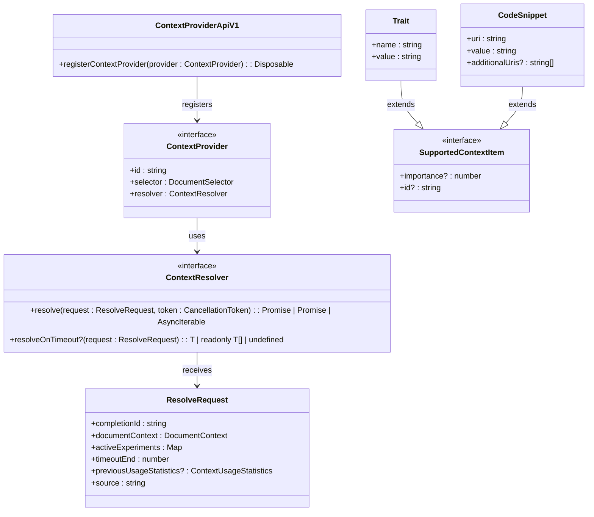

# API Reference

<cite>
**Referenced Files in This Document**   
- [extensionApi.ts](file://src/extension/api/vscode/extensionApi.ts)
- [api.d.ts](file://src/extension/api/vscode/api.d.ts)
- [vscodeContextProviderApi.ts](file://src/extension/api/vscode/vscodeContextProviderApi.ts)
- [api.ts](file://src/platform/inlineCompletions/common/api.ts)
- [languageContextProviderService.ts](file://src/platform/languageContextProvider/common/languageContextProviderService.ts)
- [package.json](file://package.json)
- [README.md](file://README.md)
</cite>

## Table of Contents
1. [Introduction](#introduction)
2. [Extension API](#extension-api)
3. [Context Provider API](#context-provider-api)
4. [Event System](#event-system)
5. [Versioning and Compatibility](#versioning-and-compatibility)
6. [Client Implementation Guidance](#client-implementation-guidance)
7. [Migration Guide](#migration-guide)
8. [Best Practices](#best-practices)

## Introduction
The GitHub Copilot Chat extension provides a comprehensive API for integrating AI-powered coding assistance into Visual Studio Code. This API enables extensions to interact with Copilot's core functionality, including context provision, code completion, and chat capabilities. The extension exposes its public interfaces through a well-defined API surface that supports versioning, backward compatibility, and extensibility.

The API is designed to allow other extensions to enhance Copilot's understanding of code context, register custom providers, and participate in the AI-assisted development workflow. This documentation covers all public interfaces exposed by the extension, including detailed descriptions of methods, parameters, return values, and usage patterns.

**Section sources**
- [README.md](file://README.md#L1-L84)

## Extension API

The Copilot extension exposes its primary API through the `CopilotExtensionApi` class, which serves as the entry point for other extensions to interact with Copilot Chat functionality. The API is versioned to ensure backward compatibility and provides methods for scope selection and context provider access.

The extension API is accessed through the standard VS Code extension API using the `getExtension` method, followed by calling `getAPI` with the desired version number. This pattern ensures that extensions can safely interact with Copilot Chat while handling version compatibility.

```mermaid
classDiagram
class CopilotExtensionApi {
+static version : number
+selectScope(editor? : TextEditor, options? : { reason? : string }) : Promise<Selection | undefined>
+getContextProviderAPI(version : 'v1') : ContextProviderApiV1
}
class ICopilotExtensionApi {
<<interface>>
+selectScope : (editor? : TextEditor, options? : { reason? : string }) => Promise<Selection | undefined>
+getContextProviderAPI : (version : 'v1') => ContextProviderApiV1
}
CopilotExtensionApi --|> ICopilotExtensionApi : implements
```

**Diagram sources**
- [extensionApi.ts](file://src/extension/api/vscode/extensionApi.ts#L13-L32)
- [api.d.ts](file://src/extension/api/vscode/api.d.ts#L11-L20)

### selectScope Method
The `selectScope` method allows extensions to request the selection of a logical code scope in the active editor. This functionality is particularly useful for AI-assisted coding tasks that require understanding of specific code blocks or functions.

**Parameters:**
- `editor` (optional): The text editor in which to select the scope. If not provided, the active text editor is used.
- `options` (optional): Additional options for the scope selection process.
  - `reason`: A string describing the reason for selecting the scope, which may be used in UI hints.

**Returns:**
- A Promise that resolves to a Selection object representing the selected scope, or undefined if no scope was selected.

**Exceptions:**
- Throws an error if an invalid API version is requested through `getAPI`.

**Usage Example:**
```typescript
const copilot = vscode.extensions.getExtension("GitHub.copilot-chat");
if (copilot) {
    const api = copilot.exports.getAPI(1);
    const selection = await api.selectScope();
    if (selection) {
        // Process the selected code scope
        console.log(`Selected scope from line ${selection.start.line} to ${selection.end.line}`);
    }
}
```

**Section sources**
- [extensionApi.ts](file://src/extension/api/vscode/extensionApi.ts#L21-L27)
- [api.d.ts](file://src/extension/api/vscode/api.d.ts#L14-L18)

## Context Provider API

The Context Provider API enables extensions to contribute additional context to Copilot's AI model, enhancing its understanding of the current codebase and development environment. This API allows extensions to register providers that supply relevant information based on the current document and cursor position.

The context provider system is designed to be efficient and responsive, with time budgets and cancellation tokens to ensure that context retrieval does not block the main thread or degrade editor performance.



**Diagram sources**
- [vscodeContextProviderApi.ts](file://src/extension/api/vscode/vscodeContextProviderApi.ts#L11-L20)
- [api.ts](file://src/platform/inlineCompletions/common/api.ts#L38-L202)

### getContextProviderAPI Method
The `getContextProviderAPI` method returns an instance of the Context Provider API, allowing extensions to register their own context providers. This method takes a version parameter to ensure compatibility with the requested API version.

**Parameters:**
- `_version`: A string specifying the API version to use. Currently, only 'v1' is supported.

**Returns:**
- An instance of `ContextProviderApiV1` that provides methods for registering context providers.

**Usage Example:**
```typescript
const copilot = vscode.extensions.getExtension("GitHub.copilot-chat");
if (copilot) {
    const api = copilot.exports.getAPI(1);
    const contextApi = api.getContextProviderAPI('v1');
    
    const provider = {
        id: 'my-custom-provider',
        selector: [{ language: 'javascript' }, { language: 'typescript' }],
        resolver: {
            resolve: async (request, token) => {
                // Provide context items based on the request
                return [
                    { name: 'framework', value: 'React', importance: 80 },
                    { name: 'componentType', value: 'functional', importance: 60 }
                ];
            }
        }
    };
    
    const disposable = contextApi.registerContextProvider(provider);
    // Dispose when no longer needed
    return disposable;
}
```

**Section sources**
- [extensionApi.ts](file://src/extension/api/vscode/extensionApi.ts#L29-L31)
- [vscodeContextProviderApi.ts](file://src/extension/api/vscode/vscodeContextProviderApi.ts#L11-L20)

### Context Provider Registration
Extensions can register context providers to contribute information to Copilot's AI model. Each provider must specify:
- A unique `id` for identification
- A `DocumentSelector` to determine when the provider should be active
- A `ContextResolver` with a `resolve` method that returns context items

The `resolve` method receives a `ResolveRequest` object containing information about the current completion request, including:
- `completionId`: A unique identifier for the completion request
- `documentContext`: Information about the current document and cursor position
- `timeoutEnd`: A timestamp indicating when the request will be cancelled
- `activeExperiments`: A map of active experiments and their values

**Performance Considerations:**
- Providers should complete their work before the `timeoutEnd` time to avoid cancellation
- Use asynchronous operations and streaming (AsyncIterable) for large amounts of data
- Cache expensive operations when possible
- Consider the `previousUsageStatistics` to optimize context provision

**Section sources**
- [api.ts](file://src/platform/inlineCompletions/common/api.ts#L61-L71)
- [languageContextProviderService.ts](file://src/platform/languageContextProvider/common/languageContextProviderService.ts#L21-L30)

## Event System

The Copilot Chat extension does not expose a traditional event system for external extensions to subscribe to. Instead, it uses the context provider model where extensions actively provide information when requested by the Copilot system.

However, the extension itself listens to various VS Code events to trigger its functionality, including:
- Editor activation and focus changes
- Document changes and saves
- Selection changes
- Command executions

Extensions that need to react to Copilot-related events should monitor the standard VS Code API events and coordinate with Copilot through the provided APIs.

The extension uses the VS Code command system for internal event communication, with commands prefixed with `github.copilot`. These commands are not part of the public API and may change between versions.

**Section sources**
- [package.json](file://package.json#L81-L87)
- [extensionApi.ts](file://src/extension/api/vscode/extensionApi.ts#L6-L8)

## Versioning and Compatibility

The Copilot Chat extension follows a strict versioning policy to ensure backward compatibility and smooth upgrades for dependent extensions.

### API Versioning
The extension API is versioned through the `getAPI` method, which accepts a version number parameter. The current API version is exposed as a static property on the `CopilotExtensionApi` class.

```typescript
export class CopilotExtensionApi implements ICopilotExtensionApi {
    public static readonly version = 1;
    // ...
}
```

When an extension requests an API version through `getAPI`, the method validates that the requested version does not exceed the current version. If a higher version is requested, an error is thrown instructing the user to upgrade the Copilot extension.

### Backward Compatibility
The extension maintains backward compatibility through:
- Semantic versioning for the extension itself
- Versioned API entry points
- Deprecation warnings before removing functionality
- Graceful fallback for unsupported features

Extensions should always check the available API version before using specific features and provide fallback behavior when necessary.

### Breaking Changes
Breaking changes are minimized and only introduced in major version updates. When breaking changes are necessary:
- They are documented in the CHANGELOG
- Deprecation warnings are added in advance
- Alternative approaches are provided
- Migration guides are published

**Section sources**
- [extensionApi.ts](file://src/extension/api/vscode/extensionApi.ts#L14)
- [extension.ts](file://src/extension/extension/vscode/extension.ts#L82-L87)

## Client Implementation Guidance

### Getting Started
To use the Copilot Chat API in your extension, follow these steps:

1. Add Copilot Chat as a dependency in your `package.json`:
```json
{
    "extensionDependencies": [
        "GitHub.copilot-chat"
    ]
}
```

2. Access the API in your extension code:
```typescript
const copilot = vscode.extensions.getExtension("GitHub.copilot-chat");
if (copilot) {
    const api = copilot.exports.getAPI(1);
    // Use the API
}
```

### Error Handling
When working with the Copilot API, implement robust error handling:

```typescript
try {
    const copilot = vscode.extensions.getExtension("GitHub.copilot-chat");
    if (!copilot) {
        vscode.window.showWarningMessage('GitHub Copilot Chat is not installed');
        return;
    }
    
    if (!copilot.isActive) {
        await copilot.activate();
    }
    
    const api = copilot.exports.getAPI(1);
    // Use the API
} catch (error) {
    if (error.message.includes('Invalid Copilot Chat extension API version')) {
        vscode.window.showErrorMessage('Please update GitHub Copilot Chat to the latest version');
    } else {
        console.error('Failed to access Copilot API:', error);
    }
}
```

### Performance Optimization
To ensure optimal performance when using the Copilot API:

1. **Lazy Initialization**: Only access the Copilot API when needed, rather than at extension activation.
2. **Caching**: Cache API instances and context provider registrations.
3. **Error Boundaries**: Wrap API calls in try-catch blocks to prevent extension crashes.
4. **Version Checking**: Always check for the required API version before using specific features.
5. **Resource Management**: Properly dispose of disposables returned by API methods.

**Section sources**
- [extension.ts](file://src/extension/extension/vscode/extension.ts#L82-L89)
- [README.md](file://README.md#L11-L13)

## Migration Guide

### From Previous Versions
The Copilot Chat API has maintained backward compatibility since its initial release. No migration is required for extensions using version 1 of the API.

### Future-Proof Integration
To ensure your extension remains compatible with future versions of Copilot Chat:

1. **Use Versioned APIs**: Always specify the API version when calling `getAPI`.
2. **Check API Availability**: Verify that the Copilot extension is available before using its API.
3. **Handle Errors Gracefully**: Implement fallback behavior when API calls fail.
4. **Monitor Changes**: Subscribe to the Copilot Chat release notes for API changes.
5. **Test with Pre-releases**: Test your extension with Copilot Chat pre-release versions when possible.

### Deprecation Policy
The Copilot Chat team follows these guidelines for deprecating API features:
- Features are deprecated for at least one major version before removal
- Deprecation warnings are logged when deprecated features are used
- Alternative approaches are documented in release notes
- Breaking changes are minimized and well-communicated

**Section sources**
- [package.json](file://package.json#L5-L8)
- [README.md](file://README.md#L48-L53)

## Best Practices

### Security Considerations
- Never expose sensitive information through context providers
- Validate all inputs before providing them as context
- Use appropriate importance values to prioritize sensitive context
- Implement proper error handling to prevent information leakage

### User Experience
- Provide clear feedback when using Copilot functionality
- Respect user preferences and settings
- Minimize disruption to the user's workflow
- Provide meaningful error messages
- Support accessibility features

### Testing
When testing extensions that use the Copilot API:
- Use the extension's test mode when available
- Mock the Copilot API in unit tests
- Test with and without the Copilot extension installed
- Verify behavior across different API versions
- Test error handling scenarios

### Documentation
Maintain clear documentation for users of your extension:
- Explain how Copilot integration enhances functionality
- Document any required configuration
- Provide usage examples
- List known limitations
- Include troubleshooting guidance

**Section sources**
- [README.md](file://README.md#L54-L59)
- [package.json](file://package.json#L71-L73)