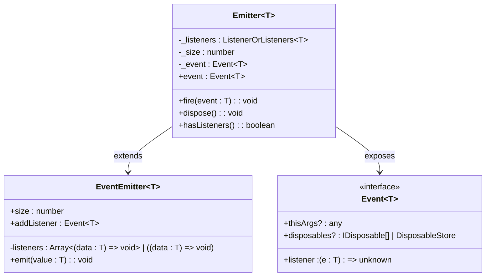
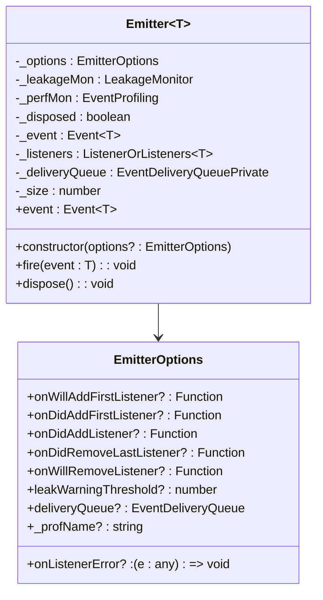
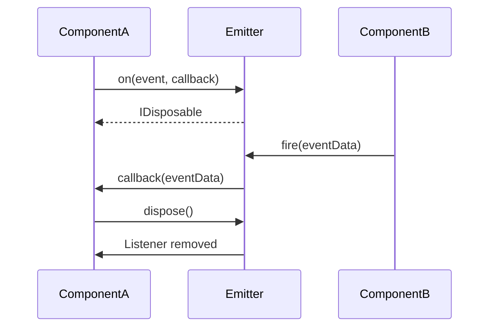
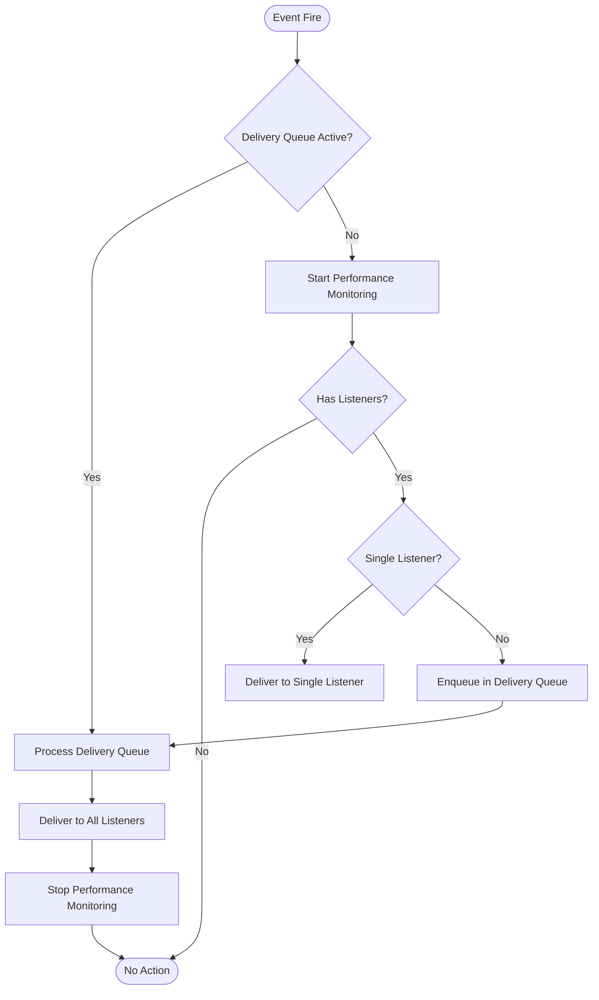
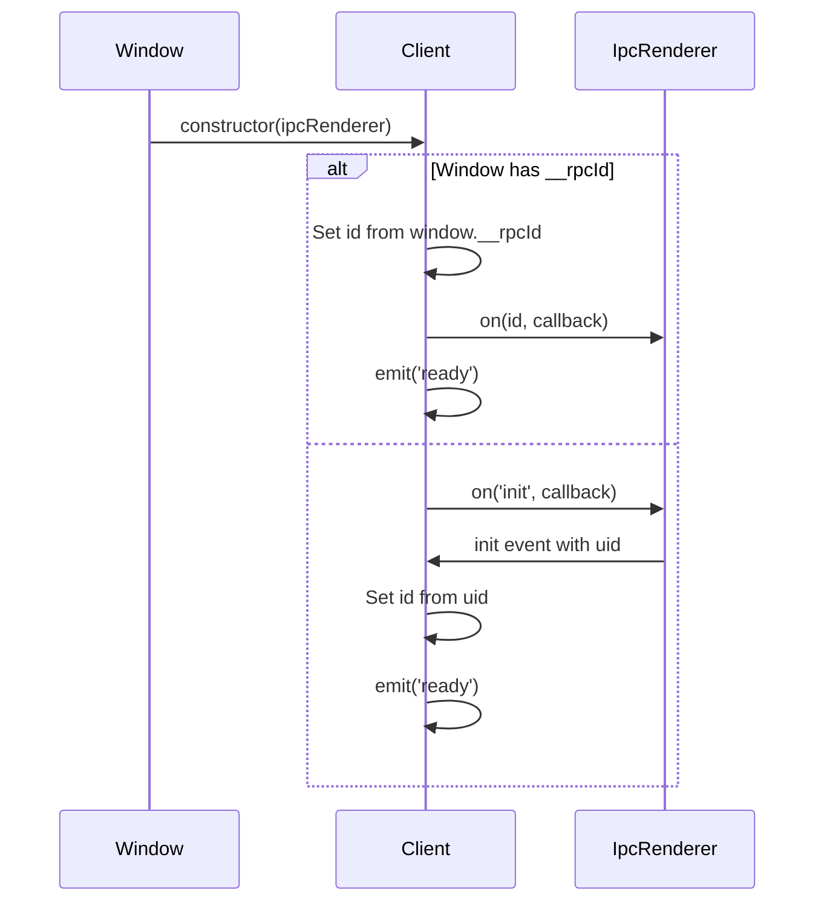
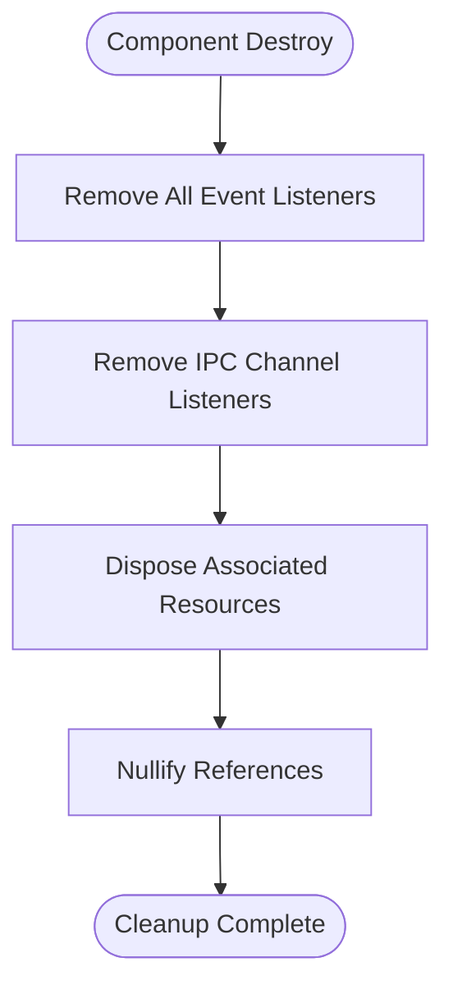
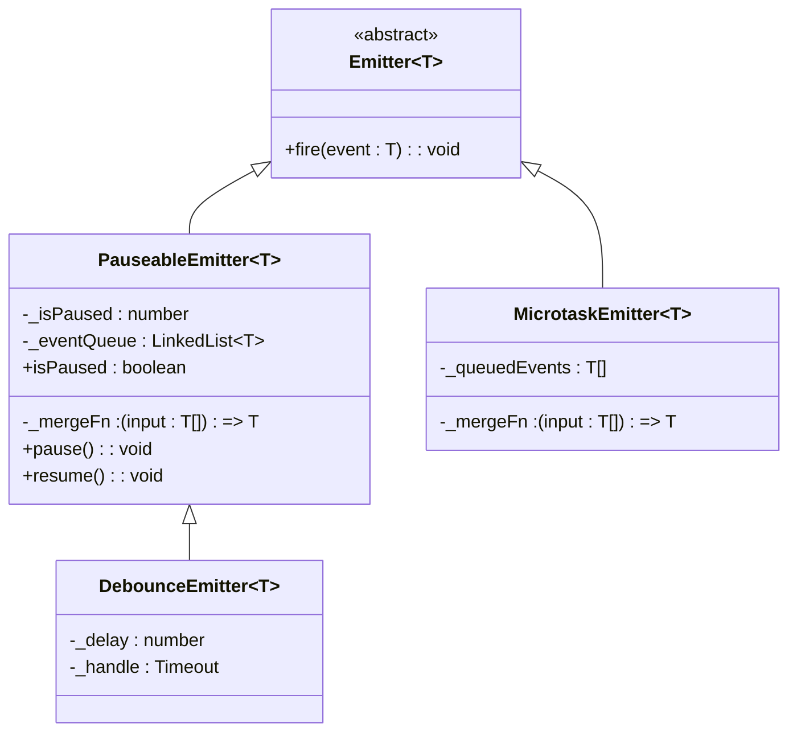

# Event Subscription Patterns

<cite>
**Referenced Files in This Document**   
- [event.ts](file://src/util/vs/base/common/event.ts)
- [crlf-input.json](file://src/extension/tools/node/test/editFileToolUtilsFixtures/crlf-input.json)
- [crlf-output.json](file://src/extension/tools/node/test/editFileToolUtilsFixtures/crlf-output.json)
- [tsc_error_2339_3.ts](file://test/simulation/fixtures/fixing/typescript/tsc_error_2339_3.ts)
- [observableFromEvent.ts](file://src/util/vs/base/common/observableInternal/observables/observableFromEvent.ts)
</cite>

## Table of Contents
1. [Introduction](#introduction)
2. [Core Event Architecture](#core-event-architecture)
3. [Emitter and Event Interfaces](#emitter-and-event-interfaces)
4. [Event Subscription Methods](#event-subscription-methods)
5. [Event Emission and Delivery](#event-emission-and-delivery)
6. [Event Listener Management](#event-listener-management)
7. [Event Multiplexing and Buffering](#event-multiplexing-and-buffering)
8. [Event Patterns in Client Implementation](#event-patterns-in-client-implementation)
9. [Memory Management and Cleanup](#memory-management-and-cleanup)
10. [Advanced Event Patterns](#advanced-event-patterns)

## Introduction
The vscode-copilot-chat codebase implements a sophisticated event subscription system based on the EventEmitter pattern. This documentation details the event subscription patterns used throughout the codebase, focusing on the TypedEmitter interface that provides type-safe event handling. The system enables components to communicate through events, with robust mechanisms for subscription management, listener cleanup, and memory leak prevention. This document will explore the core architecture, subscription methods, emission patterns, and best practices for event handling in the application.

## Core Event Architecture
The event system in vscode-copilot-chat is built around the Emitter class, which serves as the foundation for event-driven communication between components. The architecture follows a publisher-subscriber pattern where components can emit events and other components can subscribe to receive notifications when specific events occur.



**Diagram sources**
- [event.ts](file://src/util/vs/base/common/event.ts#L997-L1783)
- [crlf-input.json](file://src/extension/tools/node/test/editFileToolUtilsFixtures/crlf-input.json#L106-L200)

**Section sources**
- [event.ts](file://src/util/vs/base/common/event.ts#L1-L1783)
- [crlf-input.json](file://src/extension/tools/node/test/editFileToolUtilsFixtures/crlf-input.json#L100-L200)

## Emitter and Event Interfaces
The event system is centered around two core interfaces: Emitter and Event. The Emitter class provides the mechanism to fire events, while the Event interface defines the subscription mechanism for listeners.

The Emitter class (defined in event.ts) is parameterized by a type T, representing the type of data passed with the event. It maintains a collection of listeners and provides methods to add, remove, and notify listeners. The Event interface represents a subscribable event, allowing listeners to register callbacks that will be invoked when the event is fired.



**Diagram sources**
- [event.ts](file://src/util/vs/base/common/event.ts#L762-L803)
- [event.ts](file://src/util/vs/base/common/event.ts#L997-L1030)

**Section sources**
- [event.ts](file://src/util/vs/base/common/event.ts#L762-L803)
- [event.ts](file://src/util/vs/base/common/event.ts#L997-L1030)

## Event Subscription Methods
The event system provides several methods for subscribing to events, with the primary method being the on function. Components can subscribe to events by providing a callback function that will be invoked when the event is fired. The subscription returns a disposable object that can be used to unsubscribe from the event.

The system also supports one-time event subscriptions through the once method, which automatically removes the listener after the first event emission. This is useful for initialization scenarios where a component needs to respond to an event only once.



**Diagram sources**
- [event.ts](file://src/util/vs/base/common/event.ts#L1078-L1144)
- [crlf-input.json](file://src/extension/tools/node/test/editFileToolUtilsFixtures/crlf-input.json#L112-L152)

**Section sources**
- [event.ts](file://src/util/vs/base/common/event.ts#L1078-L1144)
- [crlf-input.json](file://src/extension/tools/node/test/editFileToolUtilsFixtures/crlf-input.json#L112-L152)

## Event Emission and Delivery
Event emission is handled by the fire method of the Emitter class. When an event is fired, all registered listeners are notified in sequence. The system includes sophisticated delivery mechanisms to handle edge cases such as reentrant event firing and delivery queue management.

The delivery system uses a queue to ensure that events are delivered in the correct order, even when event handlers themselves fire additional events. This prevents issues that could arise from modifying the listener collection during event delivery.



**Diagram sources**
- [event.ts](file://src/util/vs/base/common/event.ts#L1223-L1242)
- [event.ts](file://src/util/vs/base/common/event.ts#L1210-L1217)

**Section sources**
- [event.ts](file://src/util/vs/base/common/event.ts#L1223-L1242)
- [event.ts](file://src/util/vs/base/common/event.ts#L1210-L1217)

## Event Listener Management
The event system includes comprehensive listener management capabilities, allowing for the addition, removal, and tracking of event listeners. The system maintains a count of listeners through the _size property and provides methods to check if there are any listeners registered.

Listener removal is handled through the _removeListener method, which safely removes a listener from the collection and updates the size counter. The system includes safeguards to prevent removing non-existent listeners and handles the case where the listener collection needs to be compacted after removal.

```mermaid
classDiagram
class ListenerContainer~T~ {
+id : number
+value : (data : T) => void
+stack? : Stacktrace
}
class ListenerOrListeners~T~ {
<<type>>
(ListenerContainer~T~ | undefined)[] | ListenerContainer~T~
}
class Emitter~T~ {
-_listeners : ListenerOrListeners~T~
-_size : number
+_removeListener(listener : ListenerContainer~T~) : void
}
Emitter~T~ --> ListenerOrListeners~T~
ListenerOrListeners~T~ --> ListenerContainer~T~
```

**Diagram sources**
- [event.ts](file://src/util/vs/base/common/event.ts#L960-L961)
- [event.ts](file://src/util/vs/base/common/event.ts#L1146-L1189)

**Section sources**
- [event.ts](file://src/util/vs/base/common/event.ts#L960-L961)
- [event.ts](file://src/util/vs/base/common/event.ts#L1146-L1189)

## Event Multiplexing and Buffering
The codebase includes advanced event patterns such as event multiplexing and buffering. The EventMultiplexer class allows multiple events to be combined into a single event stream, making it easier to listen to events from multiple sources.

The EventBufferer class provides the ability to delay event firing during specific code execution, ensuring that events are not fired during critical sections of code. This is useful for batch processing scenarios where multiple changes should be reported as a single event.

```mermaid
classDiagram
class EventMultiplexer~T~ {
-emitter : Emitter~T~
-hasListeners : boolean
-events : { event : Event~T~; listener : IDisposable | null }[]
+event : Event~T~
+add(event : Event~T~) : IDisposable
+dispose() : void
}
class EventBufferer {
-data : { buffers : Function[] }[]
+wrapEvent~T~(event : Event~T~) : Event~T~
+bufferEvents~R~(fn : () => R) : R
}
class Emitter~T~ {
<<abstract>>
}
EventMultiplexer~T~ --> Emitter~T~
EventBufferer --> Emitter~T~
```

**Diagram sources**
- [event.ts](file://src/util/vs/base/common/event.ts#L1484-L1592)
- [event.ts](file://src/util/vs/base/common/event.ts#L1614-L1682)

**Section sources**
- [event.ts](file://src/util/vs/base/common/event.ts#L1484-L1592)
- [event.ts](file://src/util/vs/base/common/event.ts#L1614-L1682)

## Event Patterns in Client Implementation
The event system is used extensively in client implementations, such as the Client class in the test fixtures. This class demonstrates how events are used to coordinate initialization between IPC channels and manage component lifecycle.

The Client class uses a TypedEmitter to manage events, with specific event types defined for different communication channels. The ready event pattern is used during component initialization to signal when the client is fully initialized and ready to receive messages.



**Diagram sources**
- [tsc_error_2339_3.ts](file://test/simulation/fixtures/fixing/typescript/tsc_error_2339_3.ts#L23-L47)

**Section sources**
- [tsc_error_2339_3.ts](file://test/simulation/fixtures/fixing/typescript/tsc_error_2339_3.ts#L23-L47)

## Memory Management and Cleanup
The event system includes comprehensive memory management features to prevent memory leaks. The dispose method on the Emitter class cleans up all listeners and resources, and the system includes leak detection mechanisms that warn when too many listeners are registered.

The destroy pattern is implemented to clean up all listeners and associated resources. This pattern is critical for preventing memory leaks, especially in long-running applications where components are frequently created and destroyed.



**Diagram sources**
- [tsc_error_2339_3.ts](file://test/simulation/fixtures/fixing/typescript/tsc_error_2339_3.ts#L80-L83)

**Section sources**
- [tsc_error_2339_3.ts](file://test/simulation/fixtures/fixing/typescript/tsc_error_2339_3.ts#L80-L83)

## Advanced Event Patterns
The codebase implements several advanced event patterns beyond the basic subscription model. These include pauseable emitters that can temporarily suspend event delivery, debounce emitters that consolidate rapid-fire events, and microtask emitters that queue events for processing at the end of the event loop.

These patterns enable sophisticated event handling scenarios, such as batching UI updates, preventing excessive event processing during animations, and ensuring that events are processed in the correct order relative to other asynchronous operations.



**Diagram sources**
- [event.ts](file://src/util/vs/base/common/event.ts#L1356-L1459)
- [event.ts](file://src/util/vs/base/common/event.ts#L1407-L1427)

**Section sources**
- [event.ts](file://src/util/vs/base/common/event.ts#L1356-L1459)
- [event.ts](file://src/util/vs/base/common/event.ts#L1407-L1427)