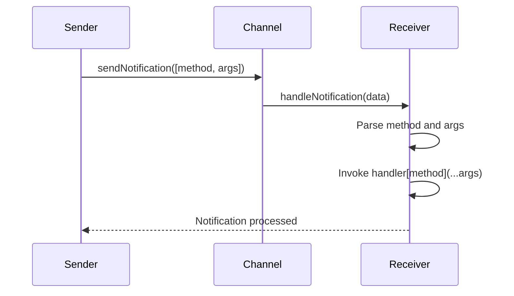
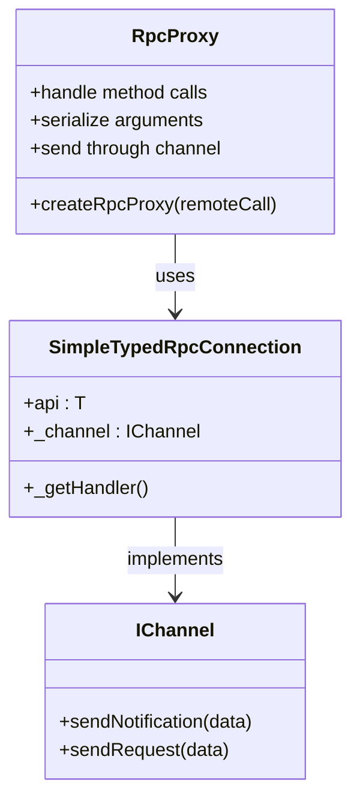
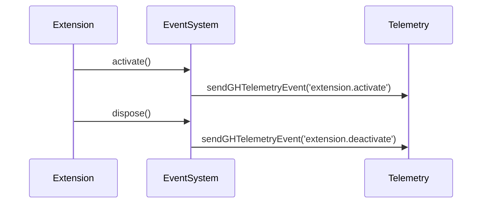
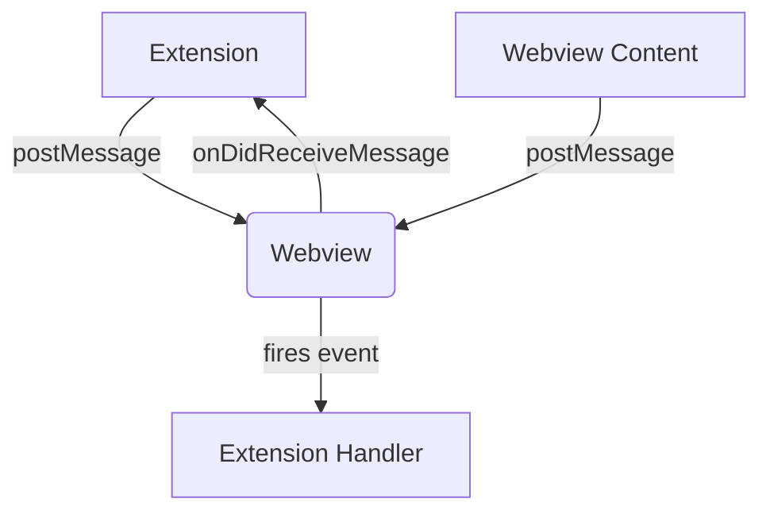

# Event System

<cite>
**Referenced Files in This Document**   
- [rpc.ts](file://src/util/vs/base/common/observableInternal/logging/debugger/rpc.ts)
- [worker.ts](file://src/util/node/worker.ts)
- [event.ts](file://src/util/vs/base/common/event.ts)
- [vscode.d.ts](file://src/extension/vscode.d.ts)
- [notificationSender.ts](file://src/extension/completions-core/vscode-node/lib/src/notificationSender.ts)
- [notificationServiceImpl.ts](file://src/platform/notification/vscode/notificationServiceImpl.ts)
- [contributions.ts](file://src/extension/common/contributions.ts)
- [lifecycleTelemetryContrib.ts](file://src/extension/telemetry/common/lifecycleTelemetryContrib.ts)
</cite>

## Table of Contents
1. [Introduction](#introduction)
2. [RPC Communication and Notification Patterns](#rpc-communication-and-notification-patterns)
3. [Proxy-Based Notification System](#proxy-based-notification-system)
4. [VS Code API Event Handling](#vs-code-api-event-handling)
5. [Message Passing Protocol](#message-passing-protocol)
6. [Practical Examples](#practical-examples)
7. [Common Issues and Best Practices](#common-issues-and-best-practices)
8. [Conclusion](#conclusion)

## Introduction
The event system in vscode-copilot-chat is a sophisticated mechanism that enables communication between different components of the extension through various patterns including RPC (Remote Procedure Call), proxy-based notifications, and message passing. This documentation provides a comprehensive overview of the notification patterns used in the system, focusing on how events are fired, handled, and propagated throughout the application. The system leverages VS Code's proposed extensions and APIs to create a robust event-driven architecture that supports extension activation, deactivation, and inter-component communication.

## RPC Communication and Notification Patterns
The RPC communication system in vscode-copilot-chat is implemented through the `SimpleTypedRpcConnection` class, which facilitates bidirectional communication between different parts of the application. This system uses a channel-based approach where notifications are sent from one end of the connection to the other through the `sendNotification` method.

The RPC connection establishes two primary communication channels: one for requests and another for notifications. When a notification is sent, it is serialized into a message format that includes the method name and arguments, then transmitted through the underlying channel. The receiving end deserializes the message and invokes the corresponding handler function based on the method name.

Key aspects of the RPC notification system include:
- Type-safe communication through generic type parameters
- Automatic serialization and deserialization of messages
- Error handling for unknown notifications
- Support for both host and client roles in the connection

The system ensures that notifications are delivered reliably while maintaining type safety and performance. When a notification is received, the system validates that the requested method exists in the handler's notification registry before invoking it, preventing errors from invalid method calls.



**Diagram sources**
- [rpc.ts](file://src/util/vs/base/common/observableInternal/logging/debugger/rpc.ts#L39-L104)

**Section sources**
- [rpc.ts](file://src/util/vs/base/common/observableInternal/logging/debugger/rpc.ts#L39-L104)

## Proxy-Based Notification System
The proxy-based notification system in vscode-copilot-chat enables clients to call notification methods by name through a dynamic proxy mechanism. This system abstracts the underlying communication channel, allowing developers to work with a clean, intuitive API that handles message serialization and transmission automatically.

The core of this system is the `createRpcProxy` function, which creates a proxy object that intercepts method calls and converts them into RPC notifications. When a method is called on the proxy, it captures the method name and arguments, then uses the provided `remoteCall` function to send the notification through the underlying channel.

Key features of the proxy-based system include:
- Dynamic method resolution through JavaScript proxies
- Automatic argument serialization
- Promise-based return values for asynchronous operations
- Type safety through generic type parameters

The system uses TypeScript's mapped types to ensure that the proxy interface matches the expected API, providing compile-time type checking while maintaining the flexibility of dynamic method invocation. This approach allows for a clean separation between the interface definition and the implementation details of message transmission.



**Diagram sources**
- [worker.ts](file://src/util/node/worker.ts#L61-L77)
- [rpc.ts](file://src/util/vs/base/common/observableInternal/logging/debugger/rpc.ts#L39-L104)

**Section sources**
- [worker.ts](file://src/util/node/worker.ts#L61-L77)

## VS Code API Event Handling
The event handling patterns in the VS Code API, as exposed through the proposed extensions, provide a robust mechanism for responding to various lifecycle events in the extension. These patterns are implemented through the `Event` interface and related utilities in the `event.ts` file, which form the foundation of the event-driven architecture.

The system supports several key event patterns:
- Extension activation and deactivation events
- Webview message events
- Configuration change events
- Workspace state changes

When extensions are activated or deactivated, the system fires corresponding events that can be subscribed to by other components. The `IExtensionContribution` interface defines the contract for extension contributions, including optional `dispose` methods and activation blockers that can delay extension activation until certain conditions are met.

The lifecycle telemetry contribution demonstrates how events are used to track extension activation and deactivation, sending telemetry events when these lifecycle events occur. This pattern allows for monitoring and analytics without tightly coupling components.



**Diagram sources**
- [contributions.ts](file://src/extension/common/contributions.ts#L1-L77)
- [lifecycleTelemetryContrib.ts](file://src/extension/telemetry/common/lifecycleTelemetryContrib.ts#L1-L19)

**Section sources**
- [contributions.ts](file://src/extension/common/contributions.ts#L1-L77)
- [lifecycleTelemetryContrib.ts](file://src/extension/telemetry/common/lifecycleTelemetryContrib.ts#L1-L19)

## Message Passing Protocol
The message passing protocol interface in vscode-copilot-chat enables communication between different parties in the system through a well-defined API. The core components of this protocol are the `onDidReceiveMessage` event and the `postMessage` method, which provide a bidirectional communication channel between webviews and the extension host.

The `Webview` interface defines the message passing protocol with two key members:
- `onDidReceiveMessage`: An event that fires when the webview content posts a message
- `postMessage`: A method to send messages from the extension to the webview

Messages can be strings or JSON-serializable objects, but cannot include DOM-specific objects like `Blob`, `File`, or `ImageData` since the extension runs outside the browser environment. The protocol ensures that messages are only delivered when the webview is live, either visible or running in the background with `retainContextWhenHidden` enabled.

The system handles message delivery asynchronously, returning a promise that resolves when the message is posted to the webview. However, a successful post does not guarantee that the message was actually received by the webview, as the webview might be destroyed or lack appropriate message listeners.



**Diagram sources**
- [vscode.d.ts](file://src/extension/vscode.d.ts#L10179-L10219)

**Section sources**
- [vscode.d.ts](file://src/extension/vscode.d.ts#L10179-L10219)

## Practical Examples
This section provides practical examples demonstrating how to work with the event system in vscode-copilot-chat, covering common use cases such as subscribing to events, handling incoming messages, and publishing notifications.

### Subscribing to Events
To subscribe to events in the system, use the `Event` interface pattern with appropriate listener functions:

```typescript
// Example of subscribing to extension activation events
const disposable = lifecycleTelemetryContrib.onDidActivate(() => {
    console.log('Extension activated');
});

// Clean up by disposing the subscription
disposable.dispose();
```

### Handling Incoming Messages
When working with webviews, handle incoming messages through the `onDidReceiveMessage` event:

```typescript
webview.onDidReceiveMessage((message) => {
    switch (message.command) {
        case 'updateContent':
            updateWebviewContent(message.data);
            break;
        case 'userAction':
            handleUserAction(message.action);
            break;
    }
});
```

### Publishing Notifications
To publish notifications from different parts of the system, use the RPC proxy or direct notification methods:

```typescript
// Using the RPC proxy to send a notification
const notificationProxy = createRpcProxy((name, args) => {
    return channel.sendNotification([name, args]);
});

notificationProxy.showWarningMessage('Configuration updated');
```

### Extension Activation Pattern
The extension activation pattern demonstrates how events are used to manage the lifecycle of extensions:

```typescript
class MyExtensionContribution implements IExtensionContribution {
    constructor() {
        // This fires on activation
        telemetryService.sendGHTelemetryEvent('extension.activate');
    }
    
    dispose() {
        // This fires on deactivation
        telemetryService.sendGHTelemetryEvent('extension.deactivate');
    }
}
```

These examples illustrate the practical application of the event system patterns described in this documentation, showing how to integrate with the system in real-world scenarios.

**Section sources**
- [vscode.d.ts](file://src/extension/vscode.d.ts#L10179-L10219)
- [worker.ts](file://src/util/node/worker.ts#L61-L77)
- [rpc.ts](file://src/util/vs/base/common/observableInternal/logging/debugger/rpc.ts#L39-L104)

## Common Issues and Best Practices
When working with the event system in vscode-copilot-chat, several common issues can arise, particularly around memory management and event flow debugging. This section addresses these issues and provides best practices for avoiding them.

### Event Listener Memory Leaks
One of the most common issues is event listener memory leaks, which occur when event subscriptions are not properly disposed of. To prevent this:

1. Always store event subscription disposables and clean them up:
```typescript
const subscriptions = new DisposableStore();
subscriptions.add(eventListener);
// Clean up when done
subscriptions.dispose();
```

2. Use `DisposableStore` to manage multiple subscriptions:
```typescript
const store = new DisposableStore();
store.add(emitter.onEvent(handler));
store.add(anotherEmitter.onEvent(handler));
// Dispose of all at once
store.dispose();
```

### Proper Disposal Patterns
Follow these disposal patterns to ensure proper resource cleanup:

1. Implement the `dispose` method for classes that manage event subscriptions
2. Clear all event listeners in the dispose method
3. Use the `Disposable` base class when appropriate
4. Chain disposables to ensure proper cleanup order

### Debugging Event Flow
Debugging event flow in distributed components can be challenging. Use these techniques:

1. Add logging to event handlers to trace message flow
2. Use the `onWillAddFirstListener` and `onDidRemoveLastListener` options to monitor subscription lifecycle
3. Implement timeout mechanisms for promises that wait for events
4. Use the `buffer` utility to capture events that occur before listeners are attached

### Performance Considerations
To optimize event system performance:

1. Avoid creating unnecessary event subscriptions
2. Use `debounce` and `throttle` utilities for high-frequency events
3. Clean up subscriptions promptly when they are no longer needed
4. Use `latch` to prevent duplicate events from firing

Following these best practices will help ensure a robust and efficient event system implementation.

**Section sources**
- [event.ts](file://src/util/vs/base/common/event.ts#L1-L800)
- [contributions.ts](file://src/extension/common/contributions.ts#L1-L77)

## Conclusion
The event system in vscode-copilot-chat provides a comprehensive framework for communication between different components of the extension. Through the RPC communication system, proxy-based notifications, and message passing protocols, the system enables flexible and efficient inter-component communication. The integration with VS Code's proposed extensions allows for rich event handling patterns, particularly around extension lifecycle events.

Key takeaways from this documentation include:
- The RPC system provides type-safe, bidirectional communication
- Proxy-based notifications enable clean, intuitive APIs
- The message passing protocol supports webview integration
- Proper disposal patterns are essential for preventing memory leaks
- Event utilities provide powerful tools for managing complex event flows

By understanding and leveraging these patterns, developers can create robust, maintainable extensions that integrate seamlessly with the VS Code ecosystem.