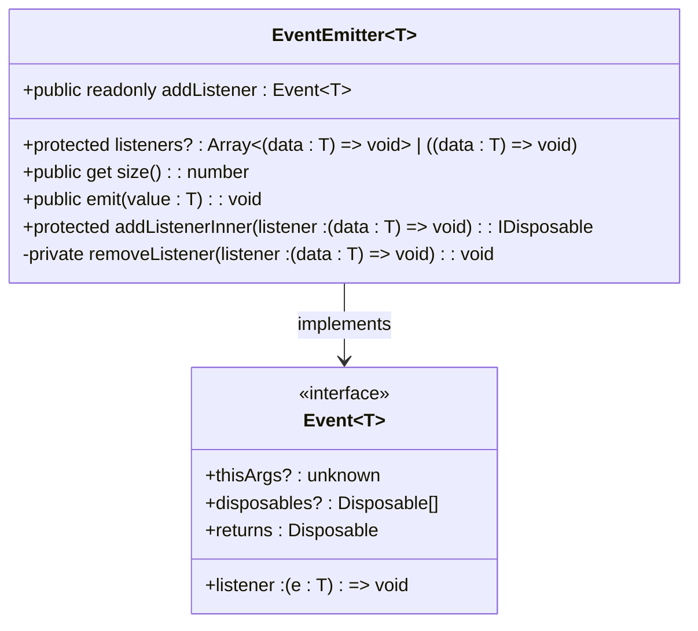
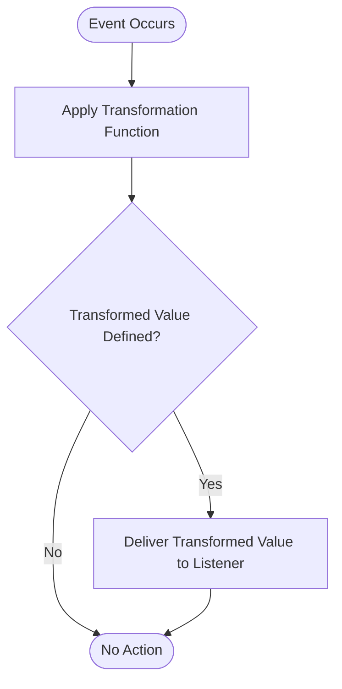
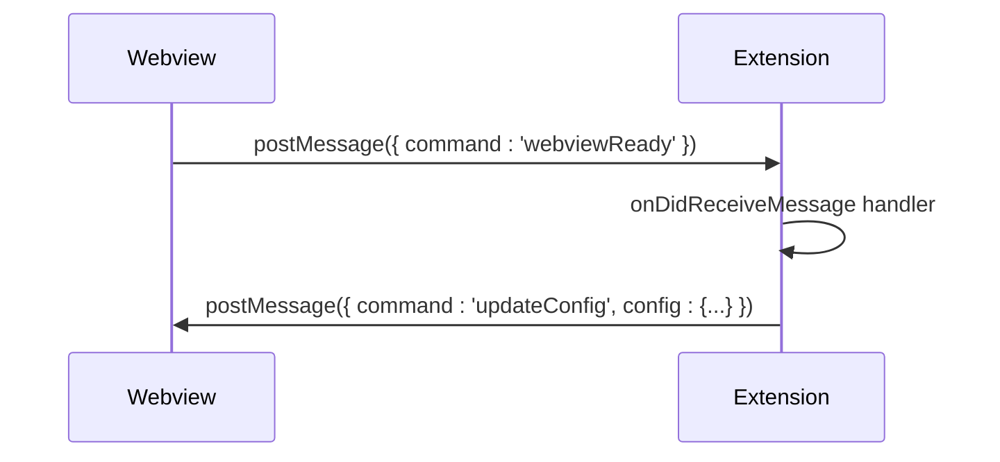
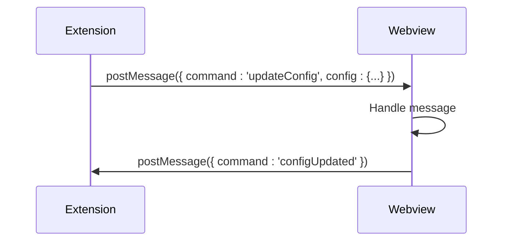
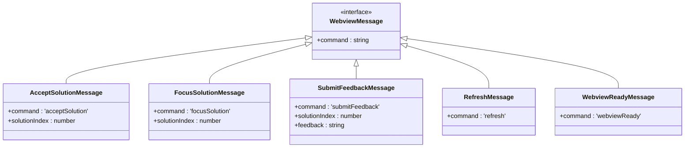
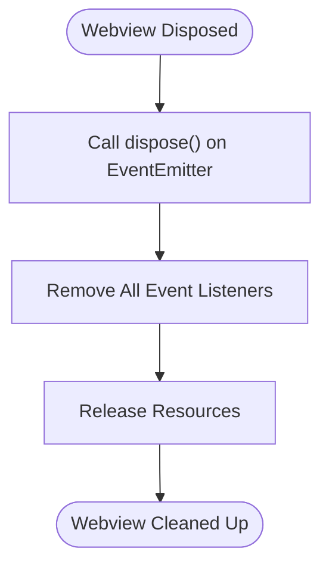

# Message Passing Protocol

<cite>
**Referenced Files in This Document**   
- [baseSuggestionsPanel.ts](file://src/extension/completions-core/vscode-node/extension/src/panelShared/baseSuggestionsPanel.ts)
- [baseSuggestionsPanelManager.ts](file://src/extension/completions-core/vscode-node/extension/src/panelShared/baseSuggestionsPanelManager.ts)
- [event.ts](file://src/extension/completions-core/vscode-node/lib/src/util/event.ts)
- [vscode.d.ts](file://src/extension/vscode.d.ts)
- [rpc.ts](file://src/util/vs/base/common/observableInternal/logging/debugger/rpc.ts)
</cite>

## Table of Contents
1. [Introduction](#introduction)
2. [Event Interface and Observable Streams](#event-interface-and-observable-streams)
3. [TransformEvent Utility](#transformevent-utility)
4. [onDidReceiveMessage Event Pattern](#ondidreceivemessage-event-pattern)
5. [postMessage Method for Communication](#postmessage-method-for-communication)
6. [Client Implementation with EventEmitter Patterns](#client-implementation-with-eventemitter-patterns)
7. [Type Safety in Message Interfaces](#type-safety-in-message-interfaces)
8. [Event Listener Management and Memory Leak Prevention](#event-listener-management-and-memory-leak-prevention)
9. [Conclusion](#conclusion)

## Introduction
The message passing protocol in vscode-copilot-chat is a sophisticated system that enables seamless communication between different components of the extension. This protocol leverages the Event interface from the VS Code API to create observable streams of messages, allowing for efficient and type-safe data flow. The system is designed to handle various types of messages, including user interactions, completion suggestions, and feedback, ensuring that the extension remains responsive and maintainable. This document will delve into the core components of the message passing protocol, focusing on the use of the Event interface, the transformEvent utility, the onDidReceiveMessage event pattern, and the postMessage method. Additionally, we will explore how Client classes utilize EventEmitter patterns to manage message flow between IPC channels, the type safety mechanisms employed in message interfaces, and best practices for managing event listeners to prevent memory leaks.

## Event Interface and Observable Streams
The Event interface in the VS Code API is a fundamental building block for creating observable streams of messages in vscode-copilot-chat. It allows components to subscribe to events and react to changes in the application state. The Event interface is defined as a function that takes a listener function, an optional `thisArgs` parameter, and an optional `disposables` array. When an event occurs, the listener function is called with the event data. This pattern is used extensively throughout the codebase to create reactive and decoupled components.

In the context of vscode-copilot-chat, the Event interface is used to create observable streams of messages that can be subscribed to by various parts of the extension. For example, the `onDidReceiveMessage` event is used to listen for incoming messages from the webview, while the `postMessage` method is used to send messages to the webview. These events are managed using the `EventEmitter` class, which provides a convenient way to fire events and manage listeners.

The `EventEmitter` class is a key component of the message passing protocol. It encapsulates the logic for managing event listeners and firing events. When an event is fired, the `EventEmitter` calls all registered listeners with the event data. Listeners can be added using the `addListener` method, and they can be removed using the `removeListener` method. The `EventEmitter` also provides a `dispose` method to clean up all listeners and prevent memory leaks.



**Diagram sources**
- [baseSuggestionsPanel.ts](file://src/extension/completions-core/vscode-node/extension/src/panelShared/baseSuggestionsPanel.ts#L106-L150)
- [event.ts](file://src/extension/completions-core/vscode-node/lib/src/util/event.ts#L11-L20)

**Section sources**
- [baseSuggestionsPanel.ts](file://src/extension/completions-core/vscode-node/extension/src/panelShared/baseSuggestionsPanel.ts#L87-L150)
- [event.ts](file://src/extension/completions-core/vscode-node/lib/src/util/event.ts#L11-L20)

## TransformEvent Utility
The `transformEvent` utility is a powerful tool for transforming events in vscode-copilot-chat. It allows developers to apply a transformation function to the event's value before it is delivered to the listener. This is particularly useful for converting native VS Code events into custom events that are more suitable for the extension's internal logic. The `transformEvent` function takes an event and a transformation function as parameters and returns a new event that applies the transformation function to the event's value.

The transformation function is called with the event's value, and if it returns a value (not `undefined`), the listener is called with the transformed value. If the transformation function returns `undefined`, the listener is not called. This behavior ensures that only relevant events are processed, reducing unnecessary computations and improving performance.

For example, consider a scenario where a VS Code event contains a complex object with multiple properties, but the extension only needs a subset of those properties. By using `transformEvent`, the developer can create a new event that only includes the required properties, making the code more efficient and easier to understand.



**Diagram sources**
- [event.ts](file://src/extension/completions-core/vscode-node/lib/src/util/event.ts#L36-L45)

**Section sources**
- [event.ts](file://src/extension/completions-core/vscode-node/lib/src/util/event.ts#L31-L45)

## onDidReceiveMessage Event Pattern
The `onDidReceiveMessage` event pattern is a crucial part of the message passing protocol in vscode-copilot-chat. It is used to subscribe to incoming messages from the webview, allowing the extension to react to user interactions and other events. The `onDidReceiveMessage` event is a property of the `Webview` interface and is of type `Event<any>`, meaning it can receive any type of message.

When a message is received, the listener function is called with the message data. The message data can be a string or a JSON-serializable object, but it cannot include `Blob`, `File`, `ImageData`, or other DOM-specific objects, as the extension does not run in a browser environment. This restriction ensures that the message passing protocol remains secure and efficient.

The `onDidReceiveMessage` event is typically used in conjunction with the `postMessage` method to create a two-way communication channel between the extension and the webview. For example, when the webview is ready, it can send a `webviewReady` message to the extension, which can then respond by sending configuration data or other messages back to the webview.



**Diagram sources**
- [baseSuggestionsPanel.ts](file://src/extension/completions-core/vscode-node/extension/src/panelShared/baseSuggestionsPanel.ts#L113-L133)
- [vscode.d.ts](file://src/extension/vscode.d.ts#L10185-L10186)

**Section sources**
- [baseSuggestionsPanel.ts](file://src/extension/completions-core/vscode-node/extension/src/panelShared/baseSuggestionsPanel.ts#L113-L133)
- [vscode.d.ts](file://src/extension/vscode.d.ts#L10185-L10186)

## postMessage Method for Communication
The `postMessage` method is used to send messages from the extension to the webview in vscode-copilot-chat. It is a part of the `Webview` interface and is defined as a method that takes a message and returns a `Thenable<boolean>`. The message can be a string or any JSON-serializable object, but it cannot include `Blob`, `File`, `ImageData`, or other DOM-specific objects, as the extension does not run in a browser environment.

The `postMessage` method is essential for creating a two-way communication channel between the extension and the webview. It allows the extension to send data, commands, and other information to the webview, which can then update its UI or perform other actions based on the received message. The method returns a promise that resolves when the message is posted to the webview or when it is dropped because the message was not deliverable.

Messages are only delivered if the webview is live, either visible or in the background with `retainContextWhenHidden` set to `true`. A response of `true` does not guarantee that the message was actually received by the webview, as there may be no message listeners hooked up inside the webview, or the webview may have been destroyed after the message was posted but before it was received. To confirm that a message was received, the webview can post a confirmation message back to the extension.



**Diagram sources**
- [baseSuggestionsPanel.ts](file://src/extension/completions-core/vscode-node/extension/src/panelShared/baseSuggestionsPanel.ts#L320-L323)
- [vscode.d.ts](file://src/extension/vscode.d.ts#L10218-L10219)

**Section sources**
- [baseSuggestionsPanel.ts](file://src/extension/completions-core/vscode-node/extension/src/panelShared/baseSuggestionsPanel.ts#L320-L323)
- [vscode.d.ts](file://src/extension/vscode.d.ts#L10218-L10219)

## Client Implementation with EventEmitter Patterns
The Client class in vscode-copilot-chat is a prime example of how EventEmitter patterns are used to manage message flow between IPC channels. The Client class is responsible for establishing a connection with the webview and handling incoming and outgoing messages. It uses the `EventEmitter` class to manage event listeners and fire events, ensuring that the communication between the extension and the webview is reliable and efficient.

The Client class is initialized with an `IpcRendererWithCommands` object, which provides methods for sending and receiving messages. When the Client is instantiated, it sets up event listeners for the `init` and `ready` events. The `init` event is used to initialize the connection, while the `ready` event is used to signal that the webview is ready to receive messages.

The Client class also provides methods for sending messages to the webview, such as `emit`, `on`, `once`, and `removeListener`. These methods are implemented using the `EventEmitter` class, allowing the Client to manage event listeners and fire events in a consistent and predictable manner. The `emit` method is used to send messages to the webview, while the `on` and `once` methods are used to register event listeners. The `removeListener` method is used to remove event listeners, preventing memory leaks.

```mermaid
classDiagram
class Client {
+emitter : TypedEmitter~RendererEvents~
+ipc : IpcRendererWithCommands
+id : string
+constructor(ipcRenderer : IpcRendererWithCommands)
+on(ev : U, fn : (arg0 : string[]) => void) : Client
+once(ev : U, fn : (arg0 : string[]) => void) : Client
+emit(ev : U, data? : string[]) : boolean
+removeListener(ev : U, fn : (arg0 : string[]) => void) : Client
+removeAllListeners() : Client
+destroy() : void
}
class TypedEmitter~T~ {
<<interface>>
+emit(emit : string) : void
+removeAllListeners() : void
+removeListener(eventName : string | symbol, listener : (...args : any[]) => void) : EventEmitter
+once(eventName : string | symbol, listener : (...args : any[]) => void) : EventEmitter
+on(eventName : string | symbol, listener : (...args : any[]) => void) : EventEmitter
}
class IpcRendererWithCommands {
+on(event : string, callback : (arg : any) => void) : void
+removeAllListeners(id : string) : void
+send(id : string, message : { ev : string, data? : string[] }) : void
}
Client --> TypedEmitter~RendererEvents~ : implements
Client --> IpcRendererWithCommands : uses
```

**Diagram sources**
- [baseSuggestionsPanel.ts](file://src/extension/completions-core/vscode-node/extension/src/panelShared/baseSuggestionsPanel.ts#L77-L150)
- [event.ts](file://src/extension/completions-core/vscode-node/lib/src/util/event.ts#L11-L20)

**Section sources**
- [baseSuggestionsPanel.ts](file://src/extension/completions-core/vscode-node/extension/src/panelShared/baseSuggestionsPanel.ts#L77-L150)
- [event.ts](file://src/extension/completions-core/vscode-node/lib/src/util/event.ts#L11-L20)

## Type Safety in Message Interfaces
Type safety is a critical aspect of the message passing protocol in vscode-copilot-chat. The extension uses TypeScript to ensure that messages are correctly typed and that the data passed between components is consistent and reliable. This is achieved through the use of interfaces and type guards, which help to catch errors at compile time and prevent runtime issues.

The message interfaces in vscode-copilot-chat are defined using TypeScript interfaces, which specify the structure and types of the message data. For example, the `WebviewMessage` interface is a union type that includes several specific message types, such as `AcceptSolutionMessage`, `FocusSolutionMessage`, and `SubmitFeedbackMessage`. Each of these message types has a `command` property that identifies the type of message, and additional properties that provide the message data.

By using interfaces, the extension ensures that messages are correctly typed and that the data passed between components is consistent. This helps to prevent errors and makes the code more maintainable. Additionally, the use of type guards, such as `instanceof` checks, ensures that the correct message type is handled by the appropriate listener.



**Diagram sources**
- [baseSuggestionsPanel.ts](file://src/extension/completions-core/vscode-node/extension/src/panelShared/baseSuggestionsPanel.ts#L45-L74)

**Section sources**
- [baseSuggestionsPanel.ts](file://src/extension/completions-core/vscode-node/extension/src/panelShared/baseSuggestionsPanel.ts#L45-L74)

## Event Listener Management and Memory Leak Prevention
Effective event listener management is crucial for preventing memory leaks in vscode-copilot-chat. The extension uses several strategies to ensure that event listeners are properly managed and that resources are released when they are no longer needed. This includes using the `Disposable` pattern, implementing the `dispose` method, and carefully managing the lifecycle of event emitters.

The `Disposable` pattern is used to manage resources that need to be cleaned up when they are no longer needed. When an event listener is added, it returns a `Disposable` object that can be used to remove the listener. This ensures that listeners are properly removed when they are no longer needed, preventing memory leaks.

The `dispose` method is implemented in the `EventEmitter` class to clean up all listeners and prevent memory leaks. When the `dispose` method is called, it removes all listeners and sets the `listeners` property to `undefined`. This ensures that the `EventEmitter` is properly cleaned up and that resources are released.

Additionally, the extension carefully manages the lifecycle of event emitters by listening for the `onDidDispose` event and cleaning up resources when the webview is disposed. This ensures that event listeners are removed and that resources are released when the webview is closed or destroyed.



**Diagram sources**
- [baseSuggestionsPanel.ts](file://src/extension/completions-core/vscode-node/extension/src/panelShared/baseSuggestionsPanel.ts#L326-L337)

**Section sources**
- [baseSuggestionsPanel.ts](file://src/extension/completions-core/vscode-node/extension/src/panelShared/baseSuggestionsPanel.ts#L326-L337)

## Conclusion
The message passing protocol in vscode-copilot-chat is a robust and efficient system that enables seamless communication between different components of the extension. By leveraging the Event interface from the VS Code API, the extension creates observable streams of messages that can be subscribed to and reacted to in a reactive and decoupled manner. The `transformEvent` utility allows for the transformation of events, making the code more efficient and easier to understand. The `onDidReceiveMessage` event pattern and the `postMessage` method provide a two-way communication channel between the extension and the webview, ensuring that user interactions and other events are handled promptly and reliably. The Client class uses EventEmitter patterns to manage message flow between IPC channels, and the extension employs type safety mechanisms to ensure that messages are correctly typed and that the data passed between components is consistent. Finally, effective event listener management and memory leak prevention strategies ensure that resources are properly managed and that the extension remains performant and maintainable.