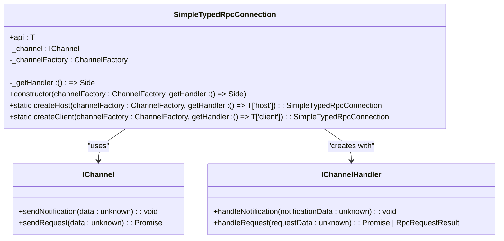
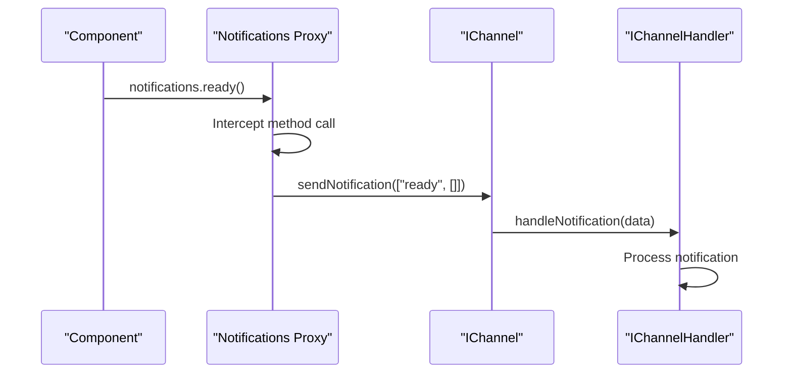
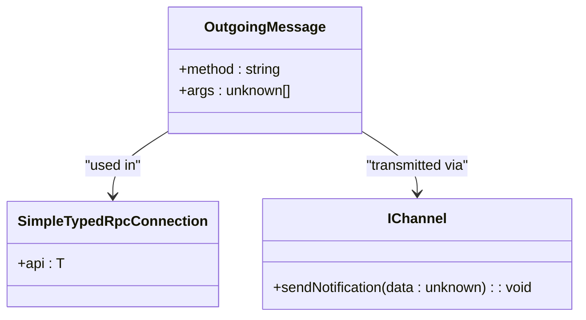
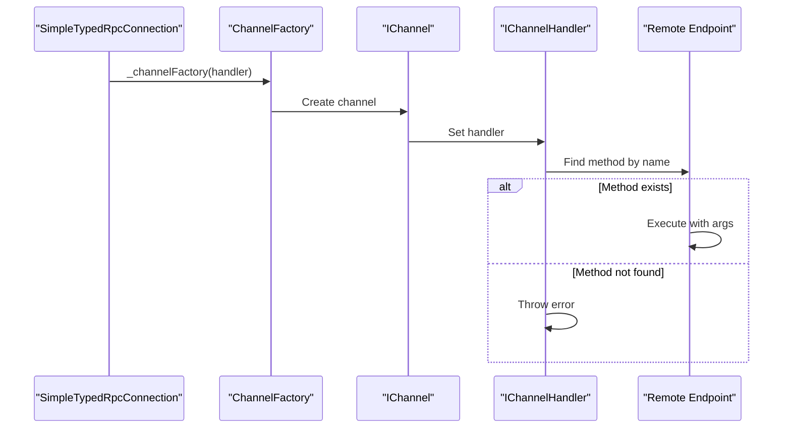
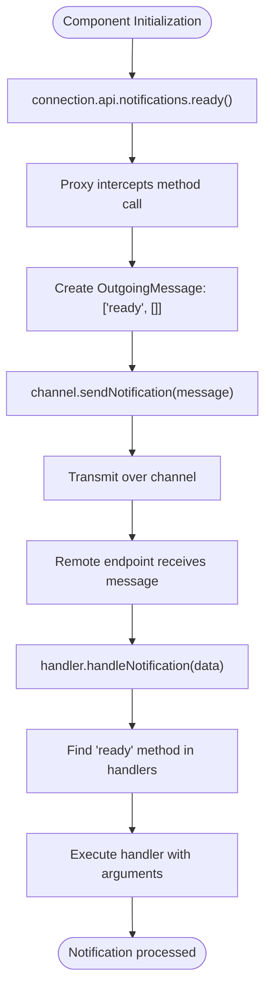
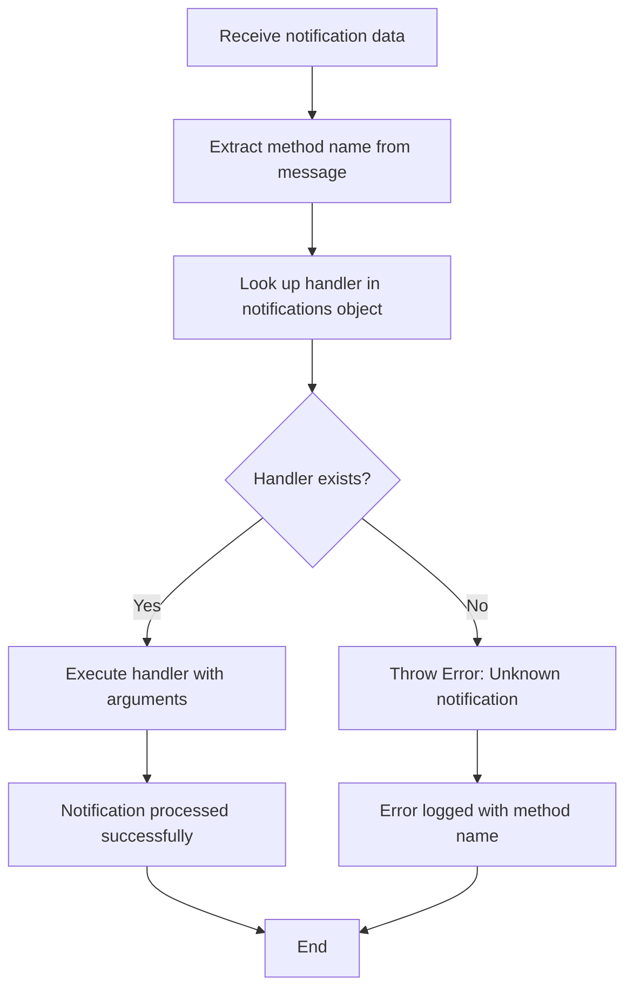
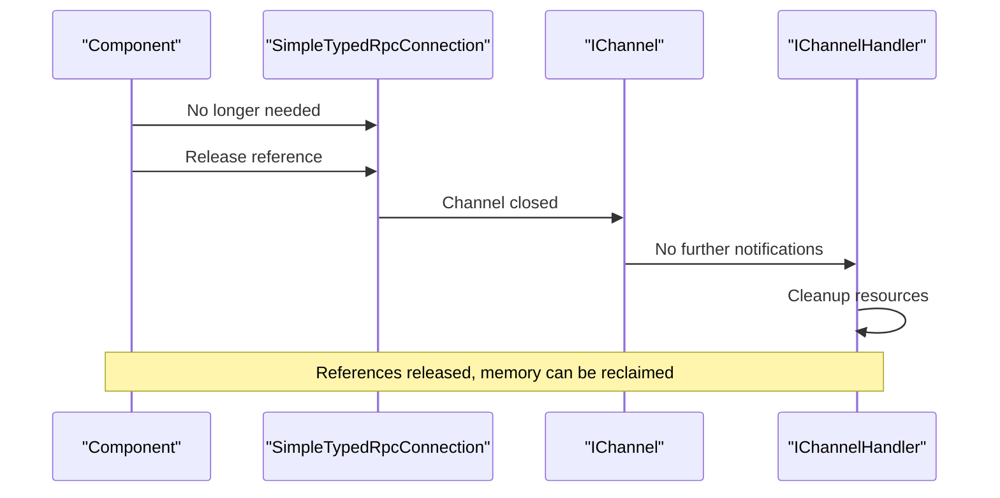

# RPC Notifications

<cite>
**Referenced Files in This Document**   
- [rpc.ts](file://src/util/vs/base/common/observableInternal/logging/debugger/rpc.ts)
- [notificationService.ts](file://src/platform/notification/common/notificationService.ts)
- [notificationServiceImpl.ts](file://src/platform/notification/vscode/notificationServiceImpl.ts)
- [chatLibMain.ts](file://src/lib/node/chatLibMain.ts)
- [worker.ts](file://src/util/node/worker.ts)
</cite>

## Table of Contents
1. [Introduction](#introduction)
2. [SimpleTypedRpcConnection Implementation](#simpletypedrpcconnection-implementation)
3. [Notification Proxy Mechanism](#notification-proxy-mechanism)
4. [OutgoingMessage Structure](#outgoingmessage-structure)
5. [Channel Factory and Notification Handling](#channel-factory-and-notification-handling)
6. [Usage Examples](#usage-examples)
7. [Error Handling](#error-handling)
8. [Connection Disposal](#connection-disposal)
9. [Conclusion](#conclusion)

## Introduction
The RPC notification system in vscode-copilot-chat enables communication between different components through a typed RPC connection. This system allows components to send notifications across process boundaries using a proxy-based mechanism that serializes method calls into a standardized message format. The implementation centers around the SimpleTypedRpcConnection class, which provides a type-safe way to handle both requests and notifications between host and client components.

**Section sources**
- [rpc.ts](file://src/util/vs/base/common/observableInternal/logging/debugger/rpc.ts#L39-L104)

## SimpleTypedRpcConnection Implementation
The SimpleTypedRpcConnection class serves as the foundation for the RPC notification system, providing a type-safe interface for communication between components. This class is instantiated through static factory methods that create either host or client connections, depending on the direction of communication.

The connection is established using a channel factory that creates a communication channel based on a handler interface. The handler defines how incoming notifications and requests are processed. When a connection is created, it sets up the appropriate channel using the provided factory and handler, establishing the communication pipeline.



**Diagram sources **
- [rpc.ts](file://src/util/vs/base/common/observableInternal/logging/debugger/rpc.ts#L39-L48)

**Section sources**
- [rpc.ts](file://src/util/vs/base/common/observableInternal/logging/debugger/rpc.ts#L39-L48)

## Notification Proxy Mechanism
The notification system implements a proxy-based approach to intercept method calls and serialize them for transmission. This is achieved through JavaScript Proxy objects that dynamically create methods on the notifications object. When a method is called on the notifications proxy, it doesn't execute locally but instead packages the method call into a message that is sent over the RPC channel.

The proxy is created in the constructor of SimpleTypedRpcConnection and assigned to the api.notifications property. This proxy uses the get trap to intercept property access and dynamically create functions for any method name that is accessed. When one of these generated functions is called, it invokes the channel's sendNotification method with a properly formatted message.



**Diagram sources **
- [rpc.ts](file://src/util/vs/base/common/observableInternal/logging/debugger/rpc.ts#L88-L94)

**Section sources**
- [rpc.ts](file://src/util/vs/base/common/observableInternal/logging/debugger/rpc.ts#L88-L94)

## OutgoingMessage Structure
The system uses a standardized message structure called OutgoingMessage to transmit notifications across the RPC channel. This structure is a tuple type consisting of two elements: the method name as a string and an array of arguments.

The OutgoingMessage interface is defined as a tuple with specific type annotations:
- method: string - The name of the method being called
- args: unknown[] - An array of arguments to pass to the method

When a notification is sent, this structure is serialized to JSON and transmitted over the communication channel. The receiving end deserializes the message and uses the method name to look up the appropriate handler function in the remote endpoint's notification handlers.



**Diagram sources **
- [rpc.ts](file://src/util/vs/base/common/observableInternal/logging/debugger/rpc.ts#L101-L104)

**Section sources**
- [rpc.ts](file://src/util/vs/base/common/observableInternal/logging/debugger/rpc.ts#L101-L104)

## Channel Factory and Notification Handling
The channel factory pattern is used to create communication channels that handle incoming notifications. When a SimpleTypedRpcConnection is instantiated, it uses the provided channel factory to create a channel with a handler that processes incoming notifications.

The handler's handleNotification method receives the notification data, which is cast to an OutgoingMessage. It then extracts the method name and arguments from the message and looks up the corresponding handler function in the remote endpoint's notification handlers. If the method is found, it is called with the provided arguments; otherwise, an error is thrown.

This approach allows for type-safe communication between components while maintaining flexibility in the underlying transport mechanism. The channel factory can create different types of channels (e.g., for different transport protocols) while maintaining the same interface.



**Diagram sources **
- [rpc.ts](file://src/util/vs/base/common/observableInternal/logging/debugger/rpc.ts#L56-L63)

**Section sources**
- [rpc.ts](file://src/util/vs/base/common/observableInternal/logging/debugger/rpc.ts#L56-L63)

## Usage Examples
Components use the notifications proxy to send events like 'ready' or custom messages across process boundaries. Once a SimpleTypedRpcConnection is established, components can access the notifications object through the api property and call methods on it as if they were local functions.

For example, when a component is initialized and ready to receive requests, it might send a 'ready' notification:

```typescript
connection.api.notifications.ready();
```

Custom messages can be sent with parameters:

```typescript
connection.api.notifications.customEvent("data", 42, true);
```

The proxy mechanism ensures that these method calls are serialized and sent over the RPC channel to the remote endpoint, where they are handled by the corresponding handler function.



**Diagram sources **
- [rpc.ts](file://src/util/vs/base/common/observableInternal/logging/debugger/rpc.ts#L90-L92)
- [worker.ts](file://src/util/node/worker.ts#L65-L76)

**Section sources**
- [rpc.ts](file://src/util/vs/base/common/observableInternal/logging/debugger/rpc.ts#L88-L94)

## Error Handling
The system implements robust error handling for unknown notifications. When a notification is received with a method name that doesn't exist in the remote endpoint's notification handlers, the handleNotification method throws an error with a descriptive message.

The error handling occurs in the handleNotification callback within the SimpleTypedRpcConnection constructor. When a notification is received, the method name is extracted from the OutgoingMessage and used to look up the corresponding handler function. If no handler is found for the method name, an error is thrown with a message indicating the unknown notification.

This approach ensures that invalid or unexpected notifications are caught early and reported clearly, helping developers identify and fix issues in the communication between components.



**Diagram sources **
- [rpc.ts](file://src/util/vs/base/common/observableInternal/logging/debugger/rpc.ts#L59-L61)

**Section sources**
- [rpc.ts](file://src/util/vs/base/common/observableInternal/logging/debugger/rpc.ts#L59-L61)

## Connection Disposal
The RPC connection system includes proper disposal patterns to prevent memory leaks in long-lived connections. While the SimpleTypedRpcConnection class itself doesn't implement IDisposable directly, the underlying channel and handler system is designed to allow for clean teardown.

When a connection is no longer needed, the channel can be closed, which prevents further notifications from being sent or received. The proxy objects and handler references can then be garbage collected, releasing any memory associated with the connection.

Components that use the RPC connection should ensure they release their references to the connection when they are destroyed, particularly in long-lived applications where connections may be created and destroyed frequently.



**Diagram sources **
- [rpc.ts](file://src/util/vs/base/common/observableInternal/logging/debugger/rpc.ts#L55-L74)

**Section sources**
- [rpc.ts](file://src/util/vs/base/common/observableInternal/logging/debugger/rpc.ts#L55-L74)

## Conclusion
The RPC notification system in vscode-copilot-chat provides a robust mechanism for inter-component communication through the SimpleTypedRpcConnection class. By using a proxy-based approach, the system allows components to send notifications across process boundaries as if they were making local method calls. The OutgoingMessage structure standardizes the format of transmitted data, while the channel factory pattern enables flexible transport mechanisms. The system includes proper error handling for unknown notifications and supports clean disposal to prevent memory leaks in long-lived connections. This implementation enables reliable and type-safe communication between different parts of the application.