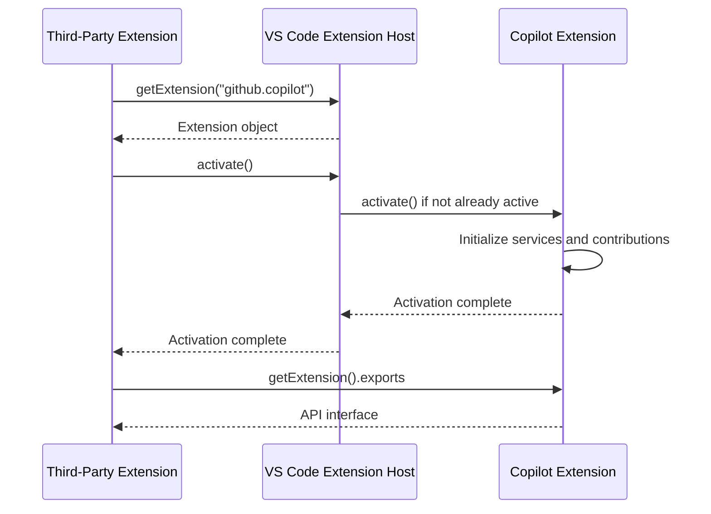
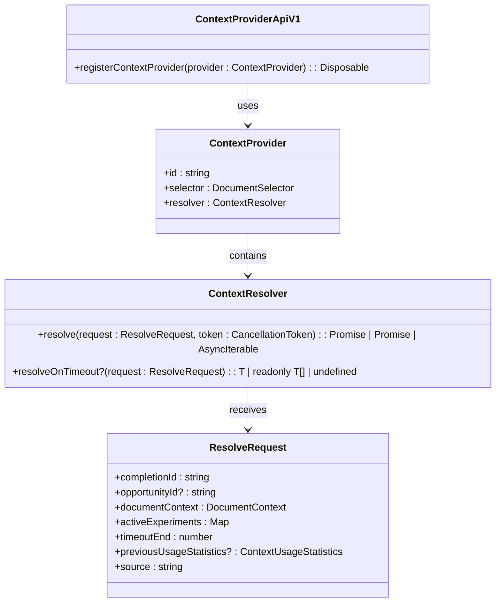
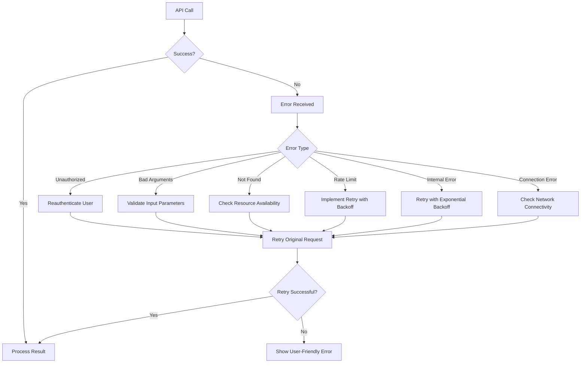
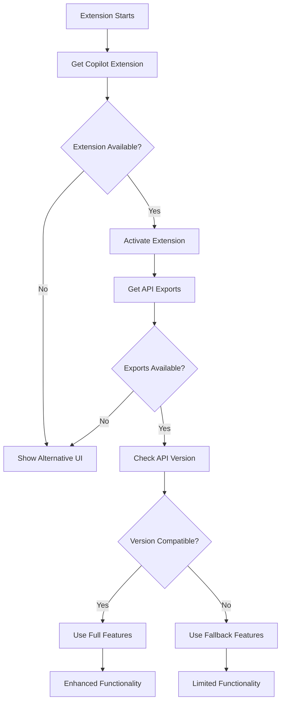
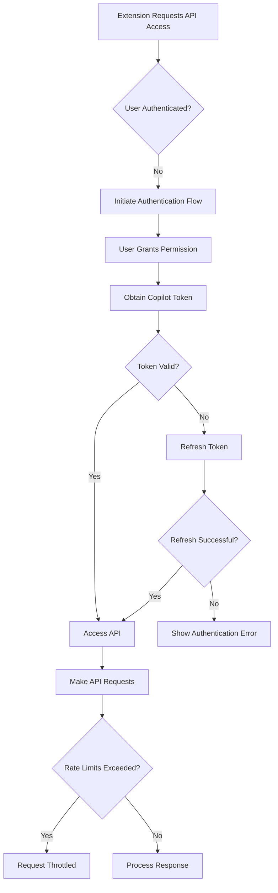

# API Consumption Patterns

<cite>
**Referenced Files in This Document**   
- [extensionApi.ts](file://src/extension/api/vscode/extensionApi.ts)
- [api.d.ts](file://src/extension/api/vscode/api.d.ts)
- [vscodeContextProviderApi.ts](file://src/extension/api/vscode/vscodeContextProviderApi.ts)
- [api.ts](file://src/platform/inlineCompletions/common/api.ts)
- [languageContextProviderService.ts](file://src/platform/languageContextProvider/common/languageContextProviderService.ts)
- [copilotTokenManager.ts](file://src/platform/authentication/common/copilotTokenManager.ts)
- [blockedExtensionService.ts](file://src/platform/chat/common/blockedExtensionService.ts)
- [errorCreator.ts](file://src/extension/completions-core/vscode-node/lib/src/snippy/errorCreator.ts)
- [errors.ts](file://src/util/vs/base/common/errors.ts)
- [extension.ts](file://src/extension/extension/vscode-node/extension.ts)
- [extension.ts](file://src/extension/extension/vscode/extension.ts)
- [vscode.d.ts](file://src/extension/vscode.d.ts)
- [networkConfiguration.ts](file://src/extension/completions-core/vscode-node/lib/src/networkConfiguration.ts)
</cite>

## Table of Contents
1. [Introduction](#introduction)
2. [API Overview](#api-overview)
3. [Module Loading and Activation](#module-loading-and-activation)
4. [Core API Endpoints](#core-api-endpoints)
5. [Context System Integration](#context-system-integration)
6. [Error Handling Strategies](#error-handling-strategies)
7. [Version Compatibility and Graceful Degradation](#version-compatibility-and-graceful-degradation)
8. [Security and Permissions](#security-and-permissions)
9. [Common Integration Scenarios](#common-integration-scenarios)
10. [Troubleshooting Guide](#troubleshooting-guide)

## Introduction

This document provides comprehensive guidance on consuming the Copilot extension API from third-party extensions. It covers best practices for importing and using the Copilot API, including proper module loading patterns, error handling strategies, and integration with Copilot's context system. The documentation explains type casting patterns required when working with the extension's exported services, addresses timing considerations for extension activation, and provides information about version compatibility checking and graceful degradation when API features are not available. Security considerations, permission requirements, and troubleshooting guidance for common integration issues are also included.

**Section sources**
- [extensionApi.ts](file://src/extension/api/vscode/extensionApi.ts#L1-L33)
- [api.d.ts](file://src/extension/api/vscode/api.d.ts#L1-L21)

## API Overview

The Copilot extension API provides a structured interface for third-party extensions to interact with Copilot's capabilities. The API is exposed through the extension's exports and follows a versioned interface pattern to ensure backward compatibility. The core API consists of several key components including the main CopilotExtensionApi, context provider APIs, and various utility services.

The API design follows a modular approach with clear separation of concerns. The main entry point is the CopilotExtensionApi class which implements the CopilotExtensionApi interface. This class provides methods for interacting with Copilot's core functionality and serves as a factory for obtaining versioned sub-apis such as the ContextProviderAPI.

```mermaid
classDiagram
class CopilotExtensionApi {
+static version : number
+selectScope(editor : TextEditor, options : { reason? : string }) : Promise<Selection | undefined>
+getContextProviderAPI(version : 'v1') : ContextProviderApiV1
}
class CopilotExtensionApiInterface {
<<interface>>
+selectScope(editor? : TextEditor, options? : { reason? : string }) : Promise<Selection | undefined>
}
class ContextProviderApiV1 {
+registerContextProvider<T extends SupportedContextItem>(provider : ContextProvider<T>) : Disposable
}
CopilotExtensionApi --|> CopilotExtensionApiInterface
CopilotExtensionApi ..> ContextProviderApiV1 : creates
```

**Diagram sources**
- [extensionApi.ts](file://src/extension/api/vscode/extensionApi.ts#L13-L32)
- [api.d.ts](file://src/extension/api/vscode/api.d.ts#L11-L21)
- [vscodeContextProviderApi.ts](file://src/extension/api/vscode/vscodeContextProviderApi.ts#L11-L21)

**Section sources**
- [extensionApi.ts](file://src/extension/api/vscode/extensionApi.ts#L13-L32)
- [api.d.ts](file://src/extension/api/vscode/api.d.ts#L11-L21)

## Module Loading and Activation

Proper module loading and activation timing is critical when consuming the Copilot extension API. Third-party extensions must ensure the Copilot extension is activated before attempting to access its API. The activation process follows VS Code's standard extension activation model with additional considerations for the Copilot extension's specific requirements.

The Copilot extension uses a multi-stage activation process that separates shared functionality from platform-specific implementations. The base activation logic is contained in the shared `baseActivate` function, which handles common activation tasks across different runtime environments. Platform-specific activation is handled by separate entry points for node.js and web environments.



Third-party extensions should use the following pattern to safely access the Copilot API:

1. Obtain a reference to the Copilot extension using `vscode.extensions.getExtension("github.copilot")`
2. Check if the extension is available and activate it if necessary
3. Wait for activation to complete before accessing the exports
4. Cast the exports to the appropriate API interface

The activation configuration interface defines the parameters needed for proper activation, including the extension context, contribution factories, and service registration functions.

**Diagram sources**
- [extension.ts](file://src/extension/extension/vscode/extension.ts#L25-L39)
- [extension.ts](file://src/extension/extension/vscode-node/extension.ts#L35-L44)

**Section sources**
- [extension.ts](file://src/extension/extension/vscode/extension.ts#L25-L39)
- [extension.ts](file://src/extension/extension/vscode-node/extension.ts#L35-L44)

## Core API Endpoints

The Copilot extension API provides several core endpoints that enable third-party extensions to leverage Copilot's capabilities. These endpoints are organized into logical groups based on their functionality and use cases.

The primary API endpoint is the `selectScope` method, which allows extensions to request Copilot to select a scope in the current editor. This method takes an optional text editor parameter and additional options including a reason for the selection, which is used in the placeholder hint.

The ContextProviderAPI v1 provides access to Copilot's context system, allowing extensions to register custom context providers that supply additional information to Copilot's AI models. This API enables extensions to contribute domain-specific knowledge and context to enhance Copilot's responses.



The API also defines the structure of context items that can be provided by extensions, including traits (key-value pairs) and code snippets. These context items are used by Copilot to enrich its understanding of the current development context.

**Diagram sources**
- [vscodeContextProviderApi.ts](file://src/extension/api/vscode/vscodeContextProviderApi.ts#L11-L21)
- [api.ts](file://src/platform/inlineCompletions/common/api.ts#L38-L205)
- [languageContextProviderService.ts](file://src/platform/languageContextProvider/common/languageContextProviderService.ts#L16-L31)

**Section sources**
- [vscodeContextProviderApi.ts](file://src/extension/api/vscode/vscodeContextProviderApi.ts#L11-L21)
- [api.ts](file://src/platform/inlineCompletions/common/api.ts#L38-L205)

## Context System Integration

Integrating with Copilot's context system allows third-party extensions to provide additional information that enhances Copilot's AI capabilities. The context system is designed to be extensible, allowing extensions to register custom context providers that supply domain-specific knowledge and context.

To integrate with the context system, extensions must create a context provider that implements the `ContextProvider` interface. This interface requires three components: a unique ID, a document selector that specifies the file types for which the provider is active, and a resolver function that returns the context items for a given request.

The resolver function receives a `ResolveRequest` object that contains information about the current context, including the completion ID, document context, active experiments, and timeout information. The resolver can return a promise, array, or async iterable of context items, which can be either traits (key-value pairs) or code snippets.

```mermaid
flowchart TD
A[Extension Registers Context Provider] --> B{Provider Matches Document?}
B --> |Yes| C[Resolver Called with ResolveRequest]
B --> |No| D[Skip Provider]
C --> E[Resolver Fetches Context Data]
E --> F{Data Ready Before Timeout?}
F --> |Yes| G[Return Context Items]
F --> |No| H[Return Timeout Context (Optional)]
G --> I[Copilot Uses Context in Prompt]
H --> I
I --> J[Enhanced AI Response]
```

The context provider registration process involves obtaining the ContextProviderAPI from the Copilot extension exports and calling the `registerContextProvider` method with the provider implementation. The method returns a disposable object that should be managed by the extension to properly clean up resources when the extension is deactivated.

Context providers can be targeted to specific Copilot features by specifying provider targets such as completions or NES (Natural Language to Code Search). This allows extensions to provide context only for specific use cases where it is most relevant.

**Diagram sources**
- [api.ts](file://src/platform/inlineCompletions/common/api.ts#L38-L205)
- [languageContextProviderService.ts](file://src/platform/languageContextProvider/common/languageContextProviderService.ts#L21-L30)

**Section sources**
- [api.ts](file://src/platform/inlineCompletions/common/api.ts#L38-L205)
- [languageContextProviderService.ts](file://src/platform/languageContextProvider/common/languageContextProviderService.ts#L21-L30)

## Error Handling Strategies

Effective error handling is essential when consuming the Copilot extension API, as interactions with AI services can fail for various reasons including network issues, authentication problems, and rate limiting. The API provides a comprehensive error handling system that third-party extensions should properly implement.

The error handling system categorizes errors into several types based on their cause and appropriate response. These include unauthorized errors (401), bad arguments (400), not found (404), rate limiting (429), internal server errors (500-599), and connection errors (600+). Each error type has specific handling requirements and recovery strategies.



The blocked extension service plays a crucial role in error handling by tracking extensions that have been temporarily blocked due to excessive requests. When an extension is blocked, it receives a specific error message indicating that it has been temporarily blocked and should retry later.

Extensions should implement proper error handling by:
1. Catching and analyzing API errors to determine the appropriate response
2. Implementing retry logic with exponential backoff for transient errors
3. Providing user-friendly error messages that explain the issue and suggest solutions
4. Logging errors for diagnostic purposes while respecting user privacy
5. Gracefully degrading functionality when certain API features are unavailable

The error creation utility provides helper methods for creating standardized error responses that include error codes, messages, and metadata for consistent error handling across the extension ecosystem.

**Diagram sources**
- [errorCreator.ts](file://src/extension/completions-core/vscode-node/lib/src/snippy/errorCreator.ts#L25-L65)
- [blockedExtensionService.ts](file://src/platform/chat/common/blockedExtensionService.ts#L1-L35)
- [errors.ts](file://src/util/vs/base/common/errors.ts#L95-L231)

**Section sources**
- [errorCreator.ts](file://src/extension/completions-core/vscode-node/lib/src/snippy/errorCreator.ts#L25-L65)
- [blockedExtensionService.ts](file://src/platform/chat/common/blockedExtensionService.ts#L1-L35)

## Version Compatibility and Graceful Degradation

Ensuring version compatibility and implementing graceful degradation are critical aspects of consuming the Copilot extension API. The API follows a versioned interface pattern that allows extensions to check for feature availability and adapt their behavior accordingly.

The Copilot extension API uses semantic versioning with major, minor, and patch versions. Third-party extensions should check the API version before using specific features to ensure compatibility. The main API class exposes a static version property that can be used for version checking.



When API features are not available, extensions should implement graceful degradation by:
1. Providing alternative user interfaces or workflows
2. Using fallback mechanisms for critical functionality
3. Informing users about limited capabilities
4. Offering to update or configure the extension for full functionality

The API's type casting patterns require careful handling to ensure compatibility across versions. Extensions should use type guards and conditional checks when accessing API features to prevent runtime errors. The exports object may contain different interfaces depending on the installed version of the Copilot extension.

Extensions should also handle cases where the Copilot extension is not installed or cannot be activated. In these scenarios, the extension should provide a clear user experience that explains the dependency and offers guidance on how to install or enable the Copilot extension.

**Section sources**
- [extensionApi.ts](file://src/extension/api/vscode/extensionApi.ts#L14-L14)
- [api.d.ts](file://src/extension/api/vscode/api.d.ts#L11-L21)

## Security and Permissions

Security and permissions are fundamental considerations when consuming the Copilot extension API. The API implements several security mechanisms to protect user data and ensure proper authorization for API access.

Authentication is managed through the Copilot token manager, which handles the retrieval and validation of authentication tokens. Extensions must ensure they have obtained proper user consent before accessing Copilot services, as telemetry and usage data collection requires explicit permission.



The API implements rate limiting to prevent abuse and ensure fair usage across all extensions. Extensions that exceed rate limits are temporarily blocked through the blocked extension service. This service tracks extension usage and enforces cooling-off periods before allowing further requests.

Network security is ensured through proper endpoint configuration and secure communication channels. The network configuration service manages API endpoints and ensures requests are routed through appropriate security protocols. Extensions should not hardcode API endpoints but instead use the configured endpoints provided by the Copilot extension.

Permissions are managed through VS Code's extension contribution system, where extensions declare their required permissions in their package.json file. Users are prompted to grant these permissions when installing or activating extensions that require Copilot API access.

**Diagram sources**
- [copilotTokenManager.ts](file://src/platform/authentication/common/copilotTokenManager.ts#L27-L59)
- [blockedExtensionService.ts](file://src/platform/chat/common/blockedExtensionService.ts#L1-L35)
- [networkConfiguration.ts](file://src/extension/completions-core/vscode-node/lib/src/networkConfiguration.ts#L66-L82)
- [vscode.d.ts](file://src/extension/vscode.d.ts#L18100-L18137)

**Section sources**
- [copilotTokenManager.ts](file://src/platform/authentication/common/copilotTokenManager.ts#L27-L59)
- [blockedExtensionService.ts](file://src/platform/chat/common/blockedExtensionService.ts#L1-L35)

## Common Integration Scenarios

Several common integration scenarios demonstrate how third-party extensions can effectively consume the Copilot extension API. These scenarios cover typical use cases and provide patterns that can be adapted for specific requirements.

### Invoking Copilot Chat

Integrating Copilot chat functionality allows extensions to leverage AI-powered assistance within their custom interfaces. This involves obtaining the Copilot extension reference, activating it if necessary, and accessing the appropriate API endpoints for chat functionality.

The process follows the standard module loading pattern with additional considerations for chat-specific requirements such as context preparation and response handling. Extensions should ensure they provide appropriate context to enhance the quality of chat responses.

### Accessing Code Generation Capabilities

Code generation is a core capability of Copilot that can be accessed through the API. Extensions can request code completions, generate code from natural language descriptions, and integrate code generation into custom workflows.

This requires proper setup of the context system to provide relevant information about the current codebase and development context. Extensions should also handle the asynchronous nature of code generation requests and provide appropriate feedback to users during processing.

### Integrating with External Tools

The API supports integration with external tools and services through the tools service. Extensions can register custom tools that extend Copilot's capabilities and enable AI-assisted workflows for specific domains.

This involves implementing the tool interface, registering the tool with the tools service, and handling tool invocation requests. The installation of extensions through AI suggestions demonstrates this integration pattern, where the AI can recommend and install extensions based on user needs.

**Section sources**
- [extensionApi.ts](file://src/extension/api/vscode/extensionApi.ts#L21-L27)
- [api.ts](file://src/platform/inlineCompletions/common/api.ts#L38-L205)
- [extension.ts](file://src/extension/tools/node/installExtensionTool.tsx#L28-L91)

## Troubleshooting Guide

This section addresses common integration issues encountered when consuming the Copilot extension API and provides guidance for resolving them.

### Extension Not Found Errors

When `vscode.extensions.getExtension("github.copilot")` returns undefined, it indicates the Copilot extension is not installed or not available in the current environment. To resolve this issue:

1. Verify the Copilot extension is installed in VS Code
2. Check that the extension ID is correct ("github.copilot")
3. Ensure the extension is enabled and not disabled
4. Confirm the extension is compatible with the current VS Code version

### Type Mismatch Problems

Type mismatch issues typically occur when there is a version mismatch between the expected API interface and the actual implementation. To address these problems:

1. Verify the API version by checking the static version property
2. Use type guards and conditional checks when accessing API features
3. Ensure type definitions are up to date with the current API version
4. Handle cases where expected properties or methods are undefined

### Activation Timing Issues

Problems related to extension activation timing can cause API access failures. To prevent these issues:

1. Always await the activation promise before accessing exports
2. Implement proper error handling for activation failures
3. Use the extension's activation events to coordinate timing
4. Provide fallback behavior when activation takes longer than expected

### Authentication and Permission Errors

Authentication issues may arise when user consent has not been obtained or tokens have expired. Solutions include:

1. Implement proper authentication flow handling
2. Check for and handle token expiration gracefully
3. Ensure telemetry consent is obtained before API access
4. Provide clear error messages to guide users through authentication

**Section sources**
- [extensionApi.ts](file://src/extension/api/vscode/extensionApi.ts#L13-L32)
- [api.d.ts](file://src/extension/api/vscode/api.d.ts#L11-L21)
- [copilotTokenManager.ts](file://src/platform/authentication/common/copilotTokenManager.ts#L27-L59)
- [errors.ts](file://src/util/vs/base/common/errors.ts#L95-L231)