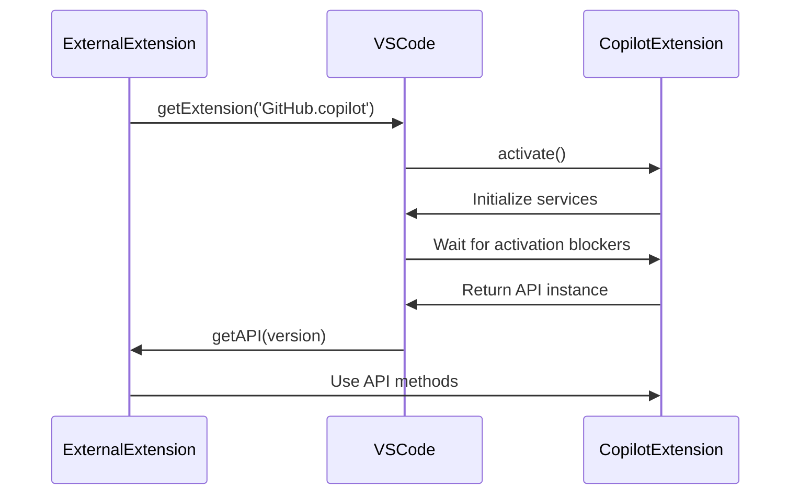
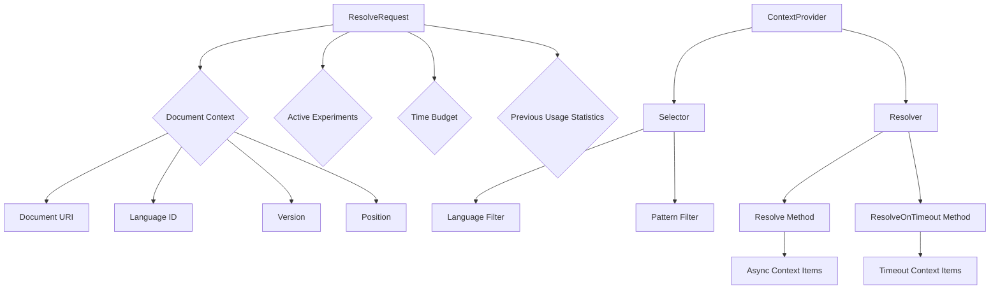
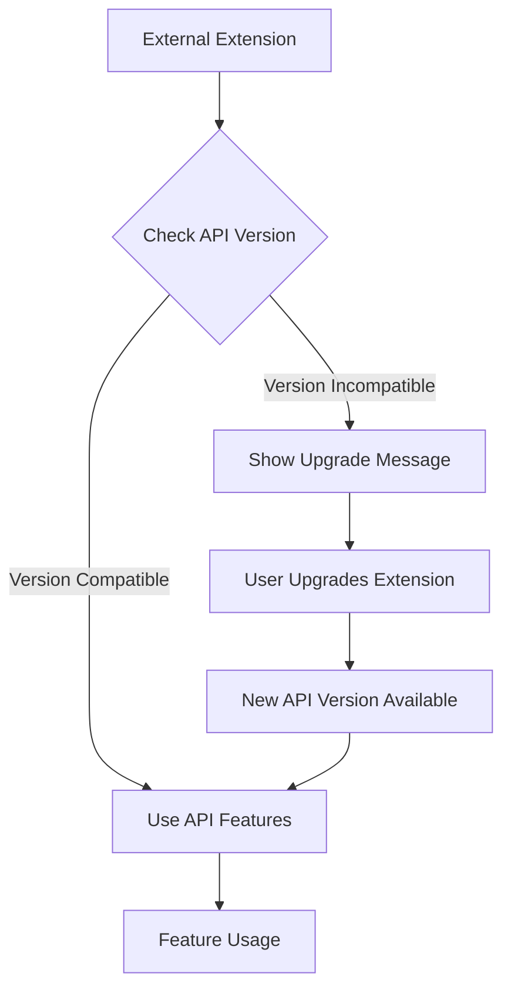
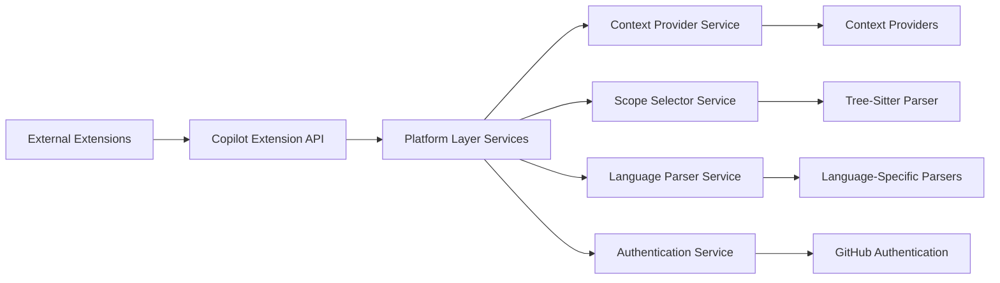

# Core Extension API

<cite>
**Referenced Files in This Document**   
- [extensionApi.ts](file://src/extension/api/vscode/extensionApi.ts)
- [api.d.ts](file://src/extension/api/vscode/api.d.ts)
- [vscodeContextProviderApi.ts](file://src/extension/api/vscode/vscodeContextProviderApi.ts)
- [extension.ts](file://src/extension/extension/vscode/extension.ts)
- [api.ts](file://src/platform/inlineCompletions/common/api.ts)
- [languageContextProviderService.ts](file://src/platform/languageContextProvider/common/languageContextProviderService.ts)
- [scopeSelection.ts](file://src/platform/scopeSelection/common/scopeSelection.ts)
</cite>

## Table of Contents
1. [Introduction](#introduction)
2. [Extension Activation and API Availability](#extension-activation-and-api-availability)
3. [Core API Endpoints](#core-api-endpoints)
4. [Type Definitions and Interfaces](#type-definitions-and-interfaces)
5. [API Usage Examples](#api-usage-examples)
6. [Versioning and Compatibility](#versioning-and-compatibility)
7. [Relationship with Platform Layer](#relationship-with-platform-layer)

## Introduction
The Copilot extension API provides a comprehensive interface for integrating AI-powered coding assistance into Visual Studio Code. This documentation details the core API that allows external extensions to interact with Copilot's functionality, including chat session management, code generation, and context retrieval. The API is designed to be extensible and backward compatible, enabling seamless integration with various language models and AI services.

## Extension Activation and API Availability
The Copilot extension follows a standardized activation pattern that ensures proper initialization before API access. The activation lifecycle begins when the extension is loaded by VS Code, at which point it registers its services and contributions. External extensions can access the Copilot API only after the Copilot extension has been activated.

The API is exposed through the extension's export mechanism, with a versioning system that ensures backward compatibility. When an external extension requests the API, it must specify the desired version. If the requested version exceeds the current API version, an error is thrown, prompting the user to upgrade the Copilot extension.



**Diagram sources**
- [extension.ts](file://src/extension/extension/vscode/extension.ts#L81-L89)
- [extensionApi.ts](file://src/extension/api/vscode/extensionApi.ts#L13-L32)

**Section sources**
- [extension.ts](file://src/extension/extension/vscode/extension.ts#L33-L90)

## Core API Endpoints
The Copilot extension API provides several key endpoints for accessing its functionality. These endpoints are organized into service contracts that expose specific capabilities.

### Scope Selection
The `selectScope` method allows extensions to request the selection of an enclosing code scope in the active editor. This is particularly useful for operations that need to understand the context of a specific code block, such as refactoring or code generation.

### Context Provider API
The Context Provider API enables extensions to register custom context providers that supply additional information to Copilot during code completion requests. This allows for rich, context-aware suggestions based on project-specific data, documentation, or other relevant information.

```mermaid
classDiagram
class CopilotExtensionApi {
+static version : number
+selectScope(editor : TextEditor, options : { reason? : string }) : Promise<Selection | undefined>
+getContextProviderAPI(version : 'v1') : ContextProviderApiV1
}
class ContextProviderApiV1 {
+registerContextProvider<T>(provider : ContextProvider<T>) : Disposable
}
class ContextProvider {
+id : string
+selector : DocumentSelector
+resolver : ContextResolver<T>
}
class ContextResolver {
+resolve(request : ResolveRequest, token : CancellationToken) : Promise<T> | Promise<T[]> | AsyncIterable<T>
+resolveOnTimeout?(request : ResolveRequest) : T | readonly T[] | undefined
}
CopilotExtensionApi --> ContextProviderApiV1 : "provides"
ContextProviderApiV1 --> ContextProvider : "registers"
ContextProvider --> ContextResolver : "contains"
```

**Diagram sources**
- [extensionApi.ts](file://src/extension/api/vscode/extensionApi.ts#L13-L32)
- [vscodeContextProviderApi.ts](file://src/extension/api/vscode/vscodeContextProviderApi.ts#L11-L21)
- [api.ts](file://src/platform/inlineCompletions/common/api.ts#L38-L65)

**Section sources**
- [extensionApi.ts](file://src/extension/api/vscode/extensionApi.ts#L13-L32)
- [vscodeContextProviderApi.ts](file://src/extension/api/vscode/vscodeContextProviderApi.ts#L11-L21)

## Type Definitions and Interfaces
The Copilot extension API exposes a rich set of type definitions and interfaces that define the contracts between the extension and external consumers. These types are designed to be flexible and extensible, supporting various use cases and integration scenarios.

### Main Service Contracts
The primary service contracts in the API include:

- **CopilotExtensionApi**: The main entry point for accessing Copilot functionality
- **ContextProviderApiV1**: Interface for registering context providers
- **ContextProvider**: Definition of a context provider with its selector and resolver
- **ResolveRequest**: Structure containing information about a context resolution request

### Supported Context Items
The API supports two primary types of context items:

- **Trait**: Key-value pairs representing metadata or attributes
- **CodeSnippet**: Code fragments extracted from files with associated URIs

These context items can be used to enrich the AI's understanding of the current coding context, leading to more relevant and accurate suggestions.



**Diagram sources**
- [api.ts](file://src/platform/inlineCompletions/common/api.ts#L38-L204)
- [languageContextProviderService.ts](file://src/platform/languageContextProvider/common/languageContextProviderService.ts#L18-L30)

**Section sources**
- [api.ts](file://src/platform/inlineCompletions/common/api.ts#L8-L204)
- [languageContextProviderService.ts](file://src/platform/languageContextProvider/common/languageContextProviderService.ts#L11-L30)

## API Usage Examples
External extensions can safely import and use the Copilot API by following established patterns for error handling and version management.

### Basic API Access
```typescript
const copilotExtension = vscode.extensions.getExtension('GitHub.copilot');
if (copilotExtension) {
    try {
        const api = await copilotExtension.activate();
        const contextProviderAPI = api.getContextProviderAPI('v1');
        // Use the API
    } catch (error) {
        // Handle activation errors
        console.error('Failed to activate Copilot extension:', error);
    }
} else {
    // Handle case where Copilot extension is not installed
    console.log('Copilot extension not found');
}
```

### Registering a Context Provider
```typescript
const contextProvider = {
    id: 'myCustomProvider',
    selector: [{ language: 'typescript' }],
    resolver: {
        resolve: async (request, token) => {
            // Return context items based on the request
            return [{ name: 'customTrait', value: 'customValue' }];
        }
    }
};

const disposable = contextProviderAPI.registerContextProvider(contextProvider);
// Dispose when no longer needed
```

**Section sources**
- [extension.ts](file://src/extension/extension/vscode/extension.ts#L81-L89)
- [typescriptContextService.ts](file://src/extension/typescriptContext/vscode-node/languageContextService.ts#L2026-L2045)

## Versioning and Compatibility
The Copilot extension API follows a strict versioning strategy to ensure backward compatibility and smooth upgrades. The API version is exposed as a static property on the `CopilotExtensionApi` class, allowing external extensions to check compatibility before attempting to use specific features.

When a new version of the API is released, it maintains support for previous versions to prevent breaking existing integrations. External extensions should always check the API version before using features that may not be available in older versions.

The versioning system also includes error handling for cases where an extension requests a version that is not supported, providing clear guidance to users about required upgrades.



**Diagram sources**
- [extensionApi.ts](file://src/extension/api/vscode/extensionApi.ts#L14)
- [extension.ts](file://src/extension/extension/vscode/extension.ts#L83-L85)

**Section sources**
- [extensionApi.ts](file://src/extension/api/vscode/extensionApi.ts#L14)
- [extension.ts](file://src/extension/extension/vscode/extension.ts#L83-L85)

## Relationship with Platform Layer
The Copilot extension API serves as a bridge between external extensions and the underlying platform layer services. The API abstracts the complexity of the platform implementation, providing a clean, stable interface for external consumption.

The platform layer contains the core services that implement the actual functionality, such as context resolution, language parsing, and scope selection. These services are accessed through dependency injection and service identifiers, ensuring loose coupling and testability.

The extension API layer translates between the external API contracts and the internal platform services, handling concerns like error propagation, version compatibility, and security.



**Diagram sources**
- [extensionApi.ts](file://src/extension/api/vscode/extensionApi.ts#L7-L8)
- [languageContextProviderService.ts](file://src/platform/languageContextProvider/common/languageContextProviderService.ts#L6-L7)
- [scopeSelection.ts](file://src/platform/scopeSelection/common/scopeSelection.ts#L6-L7)

**Section sources**
- [extensionApi.ts](file://src/extension/api/vscode/extensionApi.ts#L7-L19)
- [languageContextProviderService.ts](file://src/platform/languageContextProvider/common/languageContextProviderService.ts#L6-L30)
- [scopeSelection.ts](file://src/platform/scopeSelection/common/scopeSelection.ts#L6-L24)