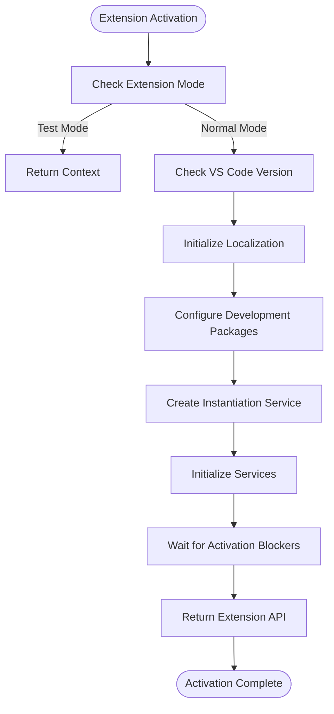
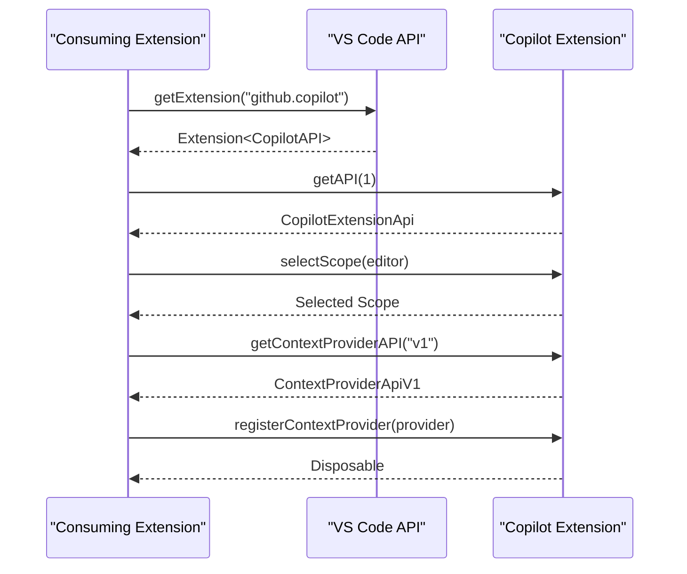
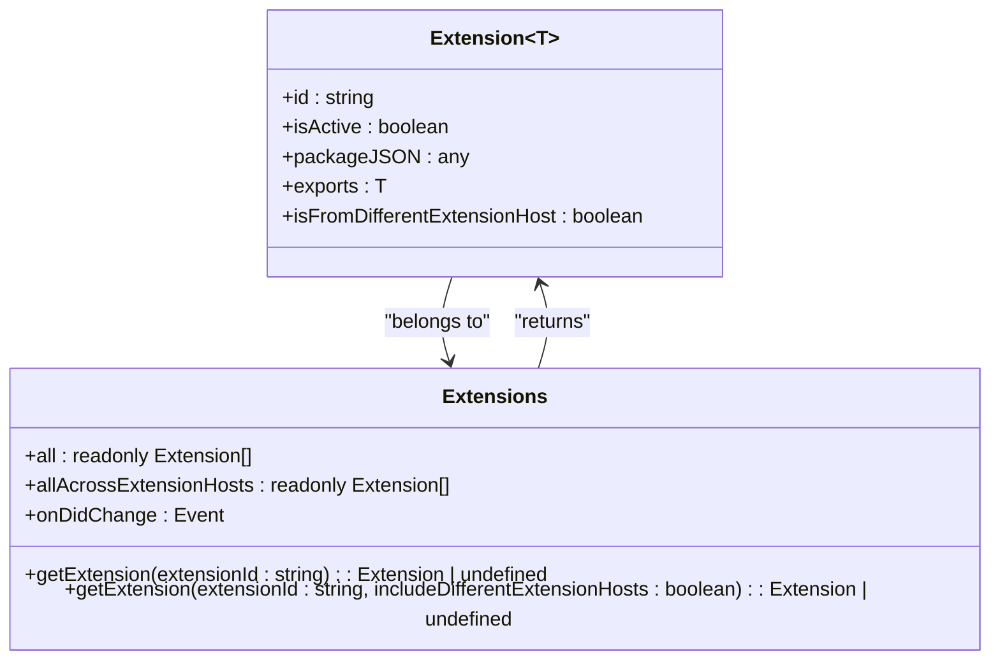
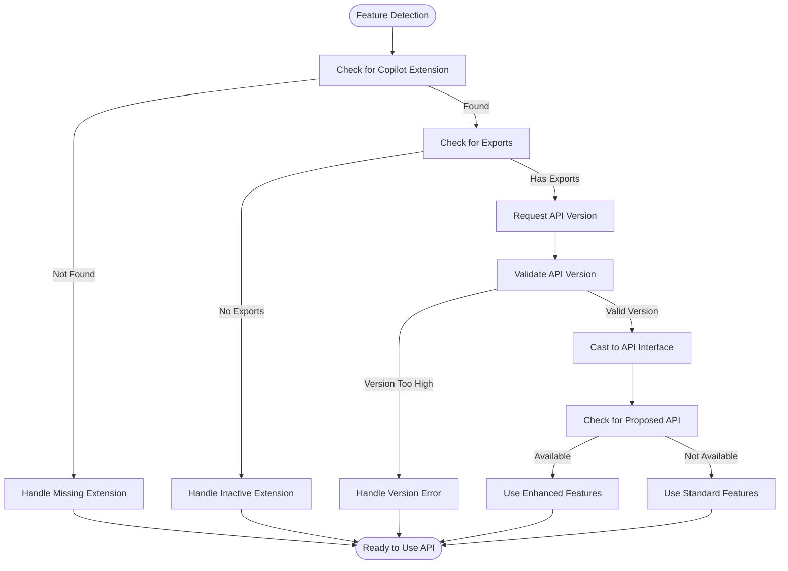

# Extension API

<cite>
**Referenced Files in This Document**   
- [extensionApi.ts](file://src/extension/api/vscode/extensionApi.ts)
- [api.d.ts](file://src/extension/api/vscode/api.d.ts)
- [vscodeContextProviderApi.ts](file://src/extension/api/vscode/vscodeContextProviderApi.ts)
- [vscode.d.ts](file://src/extension/vscode.d.ts)
- [extensionsAny.d.ts](file://src/extension/vscode.proposed.extensionsAny.d.ts)
- [extension.ts](file://src/extension/extension/vscode/extension.ts)
- [inlineCompletions/common/api.ts](file://src/platform/inlineCompletions/common/api.ts)
</cite>

## Table of Contents
1. [Introduction](#introduction)
2. [Extension Activation Lifecycle](#extension-activation-lifecycle)
3. [API Export Patterns](#api-export-patterns)
4. [Inter-Extension Communication](#inter-extension-communication)
5. [Copilot Extension API](#copilot-extension-api)
6. [Proposed Extensions API](#proposed-extensions-api)
7. [Consuming the Copilot API](#consuming-the-copilot-api)
8. [Compatibility and Feature Detection](#compatibility-and-feature-detection)
9. [Common Integration Issues](#common-integration-issues)
10. [Conclusion](#conclusion)

## Introduction

The vscode-copilot-chat extension provides a comprehensive API for integration with other extensions in the VS Code ecosystem. This documentation details the public interfaces exposed by the extension, focusing on the extension activation lifecycle, API export patterns, and inter-extension communication mechanisms. The API enables other extensions to interact with Copilot's functionality, register context providers, and access advanced features through both stable and proposed APIs.

The extension follows VS Code's standard extension architecture, where APIs are exposed through the `activate` function return value. Other extensions can consume these APIs by using the `vscode.extensions.getExtension` method to retrieve the Copilot extension instance and access its exported API surface. The API design emphasizes backward compatibility while providing forward-looking proposed APIs for experimental features.

**Section sources**
- [extension.ts](file://src/extension/extension/vscode/extension.ts#L33-L90)
- [vscode.d.ts](file://src/extension/vscode.d.ts#L17579-L17609)

## Extension Activation Lifecycle

The extension activation lifecycle in vscode-copilot-chat follows a structured pattern that ensures proper initialization and service registration. The activation process begins when VS Code calls the `activate` function, which is implemented through the `baseActivate` function in the extension module. This function serves as the entry point for both web and node.js extension hosts, ensuring consistent behavior across different runtime environments.

During activation, the extension performs several critical steps: it checks the extension mode to prevent activation during testing scenarios unless explicitly forced, verifies the VS Code version to ensure compatibility with pre-release channels, initializes localization resources, and configures development packages when running in non-production environments. The activation process also involves creating an instantiation service that manages dependency injection and service registration throughout the extension.

The activation lifecycle is designed to be asynchronous, allowing for proper initialization of services and contributions before the extension API is made available. The `waitForActivationBlockers` method ensures that any contributions that may block activation are properly awaited before proceeding. This approach provides a robust foundation for the extension's functionality while maintaining responsiveness in the editor.



**Diagram sources **
- [extension.ts](file://src/extension/extension/vscode/extension.ts#L33-L90)

**Section sources**
- [extension.ts](file://src/extension/extension/vscode/extension.ts#L33-L90)

## API Export Patterns

The vscode-copilot-chat extension employs a versioned API export pattern that allows for backward compatibility while supporting future enhancements. The API is exposed through the return value of the `activate` function, following VS Code's standard extension API pattern. The extension returns an object with a `getAPI` method that accepts a version parameter, enabling consumers to request a specific API version.

The API versioning system is implemented with a simple validation mechanism: when a consumer requests an API version, the extension checks if the requested version exceeds the current implementation version. If so, an error is thrown with a clear message instructing the user to upgrade the Copilot extension. This approach ensures that consumers cannot accidentally use API features that don't exist, providing a clear error message that guides users toward resolution.

The actual API implementation is encapsulated in the `CopilotExtensionApi` class, which is instantiated through the dependency injection system. This design allows for proper service injection and dependency management while exposing a clean API surface to consumers. The API currently includes methods for scope selection and context provider registration, with potential for future expansion as new features are developed.

```mermaid
classDiagram
class CopilotExtensionApi {
+static version : number
+selectScope(editor : TextEditor, options : { reason? : string }) : Promise<Selection | undefined>
+getContextProviderAPI(version : 'v1') : ContextProviderApiV1
}
class ContextProviderApiV1 {
+registerContextProvider(provider : ContextProvider) : Disposable
}
class ContextProvider {
+id : string
+selector : DocumentSelector
+resolver : ContextResolver
}
CopilotExtensionApi --> ContextProviderApiV1 : "provides"
ContextProviderApiV1 --> ContextProvider : "registers"
```

**Diagram sources **
- [extensionApi.ts](file://src/extension/api/vscode/extensionApi.ts#L13-L32)
- [vscodeContextProviderApi.ts](file://src/extension/api/vscode/vscodeContextProviderApi.ts#L11-L21)
- [api.d.ts](file://src/extension/api/vscode/api.d.ts#L11-L20)

**Section sources**
- [extension.ts](file://src/extension/extension/vscode/extension.ts#L81-L89)
- [extensionApi.ts](file://src/extension/api/vscode/extensionApi.ts#L13-L32)

## Inter-Extension Communication

Inter-extension communication in the vscode-copilot-chat extension is facilitated through VS Code's standard extension API mechanisms, with additional proposed APIs that enhance cross-extension host communication. The primary method of communication is through the `vscode.extensions.getExtension` function, which allows extensions to retrieve references to other installed extensions and access their exported APIs.

The extension leverages the `getExtension` method to obtain references to other extensions and consume their functionality. This pattern follows VS Code's recommended approach for extension dependencies, where extensions declare their dependencies in the `package.json` file using the `extensionDependencies` field. When retrieving an extension reference, consumers can access the extension's exported API through the `exports` property, enabling direct method calls and data exchange.

For more advanced scenarios, the extension supports proposed APIs that enable communication across different extension hosts. This is particularly important in remote development scenarios where extensions may run in different processes or containers. The proposed `extensionsAny` API provides enhanced capabilities for discovering and interacting with extensions regardless of their execution context, enabling more robust integration patterns in complex development environments.



**Diagram sources **
- [vscode.d.ts](file://src/extension/vscode.d.ts#L17579-L17609)
- [extensionApi.ts](file://src/extension/api/vscode/extensionApi.ts#L13-L32)

**Section sources**
- [vscode.d.ts](file://src/extension/vscode.d.ts#L17579-L17609)
- [extensionApi.ts](file://src/extension/api/vscode/extensionApi.ts#L13-L32)

## Copilot Extension API

The Copilot extension API provides a set of public interfaces that enable other extensions to integrate with Copilot's functionality. The primary API surface is exposed through the `CopilotExtensionApi` class, which serves as the main entry point for external extensions. This API follows a versioned approach, with the current version being 1, allowing for future expansion while maintaining backward compatibility.

The API includes two main components: the core extension API and the context provider API. The core API provides functionality for scope selection, allowing other extensions to leverage Copilot's intelligent code selection capabilities. The `selectScope` method accepts an optional text editor and options object, returning a promise that resolves to a selected scope or undefined if no scope could be determined.

The context provider API enables extensions to contribute additional context to Copilot's prompt generation process. Through the `getContextProviderAPI` method, extensions can obtain a `ContextProviderApiV1` instance and register custom context providers. These providers can supply additional information such as code snippets, traits, or other relevant data that enhances Copilot's understanding of the current development context.

The API design emphasizes type safety and clear contracts, with well-defined interfaces for all components. This ensures that consumers can reliably use the API with proper IntelliSense support and compile-time checking, reducing the likelihood of runtime errors and improving developer experience.

```mermaid
classDiagram
class CopilotExtensionApi {
+static version : 1
+selectScope(editor? : TextEditor, options? : { reason? : string }) : Promise<Selection | undefined>
+getContextProviderAPI(version : 'v1') : ContextProviderApiV1
}
class ContextProviderApiV1 {
+registerContextProvider<T extends SupportedContextItem>(provider : ContextProvider<T>) : Disposable
}
class ContextProvider~T~ {
+id : string
+selector : DocumentSelector
+resolver : ContextResolver~T~
}
class ContextResolver~T~ {
+resolve(request : ResolveRequest, token : CancellationToken) : Promise<T> | Promise<T[]> | AsyncIterable<T>
+resolveOnTimeout?(request : ResolveRequest) : T | readonly T[] | undefined
}
class ResolveRequest {
+completionId : string
+opportunityId? : string
+documentContext : DocumentContext
+activeExperiments : Map<string, string | number | boolean | string[]>
+timeoutEnd : number
+previousUsageStatistics? : ContextUsageStatistics
+source : string
}
class DocumentContext {
+uri : DocumentUri
+languageId : string
+version : number
+position? : Position
+proposedEdits? : ProposedTextEdit[]
}
CopilotExtensionApi --> ContextProviderApiV1 : "provides"
ContextProviderApiV1 --> ContextProvider : "registers"
ContextProvider --> ContextResolver : "implements"
ContextResolver --> ResolveRequest : "receives"
ResolveRequest --> DocumentContext : "contains"
```

**Diagram sources **
- [extensionApi.ts](file://src/extension/api/vscode/extensionApi.ts#L13-L32)
- [vscodeContextProviderApi.ts](file://src/extension/api/vscode/vscodeContextProviderApi.ts#L11-L21)
- [inlineCompletions/common/api.ts](file://src/platform/inlineCompletions/common/api.ts#L8-L204)

**Section sources**
- [extensionApi.ts](file://src/extension/api/vscode/extensionApi.ts#L13-L32)
- [vscodeContextProviderApi.ts](file://src/extension/api/vscode/vscodeContextProviderApi.ts#L11-L21)
- [inlineCompletions/common/api.ts](file://src/platform/inlineCompletions/common/api.ts#L8-L204)

## Proposed Extensions API

The vscode-copilot-chat extension includes proposed APIs that extend the standard VS Code extension functionality, particularly in the area of cross-extension host communication. These proposed APIs are designed to address limitations in the current extension model, especially in remote development scenarios where extensions may run in different processes or containers.

The key proposed API is `extensionsAny`, defined in `vscode.proposed.extensionsAny.d.ts`, which enhances the standard extensions namespace with capabilities for accessing extensions across different extension hosts. This API introduces two important additions: an overload for the `getExtension` method that accepts an `includeDifferentExtensionHosts` parameter, and a new `allAcrossExtensionHosts` property that provides access to all extensions regardless of their host.

The `getExtension` overload allows consumers to specify whether they want to include extensions from different extension hosts in their search. When this parameter is set to true, the method can return extensions that are running in a different process or container, enabling more comprehensive discovery and integration capabilities. This is particularly useful for extensions that need to interact with components in remote development environments.

The `allAcrossExtensionHosts` property provides a read-only array of all extensions across all extension hosts, complementing the standard `all` property which only includes extensions from the current host. Each extension in this collection has an `isFromDifferentExtensionHost` property that indicates whether the extension is associated with a different host, helping consumers understand the execution context of the extensions they discover.

These proposed APIs are protected by feature flags, requiring consumers to explicitly enable them before use. This ensures that extensions using these experimental features are aware of the potential instability and can handle the additional complexity of cross-host communication, such as limitations on API exports from extensions in different hosts.



**Diagram sources **
- [extensionsAny.d.ts](file://src/extension/vscode.proposed.extensionsAny.d.ts#L1-L41)
- [vscode.d.ts](file://src/extension/vscode.d.ts#L17579-L17624)

**Section sources**
- [extensionsAny.d.ts](file://src/extension/vscode.proposed.extensionsAny.d.ts#L1-L41)
- [vscode.d.ts](file://src/extension/vscode.d.ts#L17579-L17624)

## Consuming the Copilot API

Consuming the Copilot API from other extensions follows a standard pattern that ensures proper type safety and version compatibility. The process begins with obtaining a reference to the Copilot extension using the `vscode.extensions.getExtension` method, specifying the extension's identifier "github.copilot". This returns an extension object that may be undefined if the Copilot extension is not installed or not activated.

Once a reference to the Copilot extension is obtained, consumers should check if the extension is active and has exported an API surface. This is done by accessing the `exports` property of the extension object. If the exports are available, consumers can then request a specific API version using the `getAPI` method, passing the desired version number as a parameter.

For type safety, consumers should cast the returned API object to the appropriate interface. This enables IntelliSense support and compile-time type checking, reducing the likelihood of runtime errors. When working with the context provider API, consumers can obtain a versioned API instance by calling `getContextProviderAPI` with the version string "v1" and casting the result to `ContextProviderApiV1`.

The following example demonstrates the complete pattern for consuming the Copilot API:

```typescript
const copilot = vscode.extensions.getExtension("github.copilot");
if (copilot && copilot.exports) {
    try {
        const api = copilot.exports.getAPI(1) as CopilotExtensionApi;
        const contextProviderAPI = api.getContextProviderAPI("v1") as ContextProviderApiV1;
        
        const provider = {
            id: "myContextProvider",
            selector: [{ language: "typescript" }],
            resolver: {
                resolve: async (request, token) => {
                    return [{ name: "customTrait", value: "customValue" }];
                }
            }
        };
        
        const disposable = contextProviderAPI.registerContextProvider(provider);
        context.subscriptions.push(disposable);
    } catch (error) {
        console.error("Failed to access Copilot API:", error);
    }
} else {
    console.warn("Copilot extension not available");
}
```

This pattern includes proper error handling to manage cases where the API version is not supported or other issues occur during API access.

**Section sources**
- [extensionApi.ts](file://src/extension/api/vscode/extensionApi.ts#L13-L32)
- [vscodeContextProviderApi.ts](file://src/extension/api/vscode/vscodeContextProviderApi.ts#L11-L21)
- [inlineCompletions/common/api.ts](file://src/platform/inlineCompletions/common/api.ts#L8-L204)

## Compatibility and Feature Detection

Ensuring compatibility between extensions is critical for maintaining a stable development environment. The vscode-copilot-chat extension employs several strategies for compatibility management and feature detection, helping consumers safely use its API across different versions and configurations.

The primary compatibility mechanism is version checking in the `getAPI` method. When a consumer requests an API version, the extension compares the requested version with its current implementation version. If the requested version exceeds the current version, an error is thrown with a clear message instructing the user to upgrade the Copilot extension. This prevents consumers from accidentally using API features that don't exist, providing a clear path to resolution.

For proposed APIs, the extension uses feature flags to control access to experimental functionality. Consumers must explicitly enable these features before they can be used, typically by checking for the presence of specific proposed API identifiers. This is implemented through functions like `isProposedApiEnabled` and `checkProposedApiEnabled`, which verify that the required feature flag is active before allowing access to the proposed API functionality.

Runtime feature detection is also important, particularly for the proposed `extensionsAny` API. Consumers should check for the presence of the `includeDifferentExtensionHosts` parameter in the `getExtension` method signature or verify that the `allAcrossExtensionHosts` property exists before attempting to use these features. This defensive programming approach ensures that extensions can gracefully handle environments where these proposed APIs are not available.

Type guards and conditional compilation can also be used to provide different implementations based on available features. For example, an extension might use the standard `extensions.all` property when the `extensionsAny` API is not available, falling back to the enhanced `allAcrossExtensionHosts` property when it is available. This allows extensions to provide enhanced functionality in environments that support it while maintaining basic functionality in all environments.



**Diagram sources **
- [extension.ts](file://src/extension/extension/vscode/extension.ts#L81-L89)
- [extensionsAny.d.ts](file://src/extension/vscode.proposed.extensionsAny.d.ts#L1-L41)

**Section sources**
- [extension.ts](file://src/extension/extension/vscode/extension.ts#L81-L89)
- [extensionsAny.d.ts](file://src/extension/vscode.proposed.extensionsAny.d.ts#L1-L41)

## Common Integration Issues

Integrating with the vscode-copilot-chat extension API can present several common challenges that developers should be aware of. Understanding these issues and their solutions is crucial for building robust extensions that work reliably across different environments and configurations.

One of the most frequent issues is API availability timing. The Copilot extension may not be activated when a consuming extension starts, leading to undefined exports when attempting to access the API. To address this, consumers should implement proper activation sequencing, either by declaring a dependency in `extensionDependencies` or by listening to the `extensions.onDidChange` event to detect when the Copilot extension becomes available.

Version incompatibilities are another common issue. As the Copilot API evolves, breaking changes may occur between major versions. Consumers should always specify the exact API version they require and handle the case where the requested version is not available. This includes providing clear error messages to users and potentially offering degraded functionality when newer API features are not available.

Proper error handling is essential when accessing extension exports. Consumers should always check that the extension reference and its exports are defined before attempting to use them. This prevents runtime errors in cases where the Copilot extension is not installed, disabled, or fails to activate properly. Additionally, consumers should wrap API calls in try-catch blocks to handle any exceptions that may be thrown during API usage.

Type casting issues can also occur when consumers assume the structure of the API without proper validation. To avoid this, consumers should use TypeScript interfaces to cast the API objects, ensuring type safety and enabling proper IntelliSense support. When working with proposed APIs, additional runtime checks should be performed to verify that the expected properties and methods are actually present.

Finally, cross-extension host communication presents unique challenges, particularly around API exports. Extensions from different extension hosts may not be able to export APIs due to process isolation, limiting the functionality available to consumers. Developers should design their integrations to gracefully handle these limitations, providing alternative approaches or clear messaging when full functionality is not available.

**Section sources**
- [extension.ts](file://src/extension/extension/vscode/extension.ts#L33-L90)
- [extensionApi.ts](file://src/extension/api/vscode/extensionApi.ts#L13-L32)
- [extensionsAny.d.ts](file://src/extension/vscode.proposed.extensionsAny.d.ts#L1-L41)

## Conclusion

The vscode-copilot-chat extension provides a comprehensive and well-designed API for integration with other extensions in the VS Code ecosystem. Through its versioned API export pattern, robust activation lifecycle, and support for both standard and proposed extension features, it enables rich inter-extension communication and functionality sharing.

The API design emphasizes backward compatibility, type safety, and clear error handling, making it accessible to extension developers while maintaining stability across updates. The inclusion of proposed APIs for cross-extension host communication demonstrates a forward-looking approach that addresses the evolving needs of modern development workflows, particularly in remote and containerized environments.

When integrating with the Copilot API, developers should follow best practices for extension communication, including proper activation sequencing, version compatibility checking, and robust error handling. By leveraging the documented patterns and being aware of common integration issues, extensions can provide seamless and reliable experiences for users.

As the VS Code extension ecosystem continues to evolve, the Copilot extension's API serves as a model for how extensions can provide powerful functionality while maintaining compatibility and stability across different environments and configurations.

[No sources needed since this section summarizes without analyzing specific files]