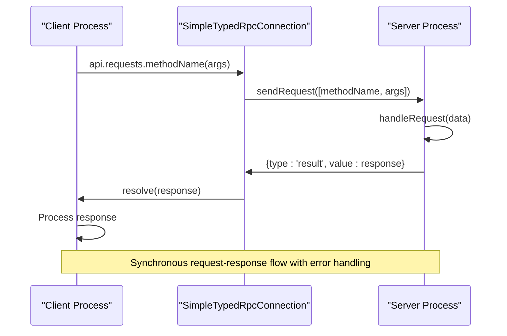
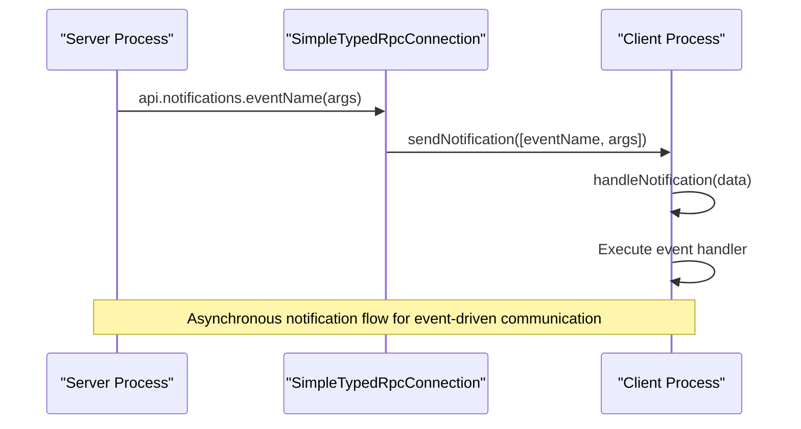
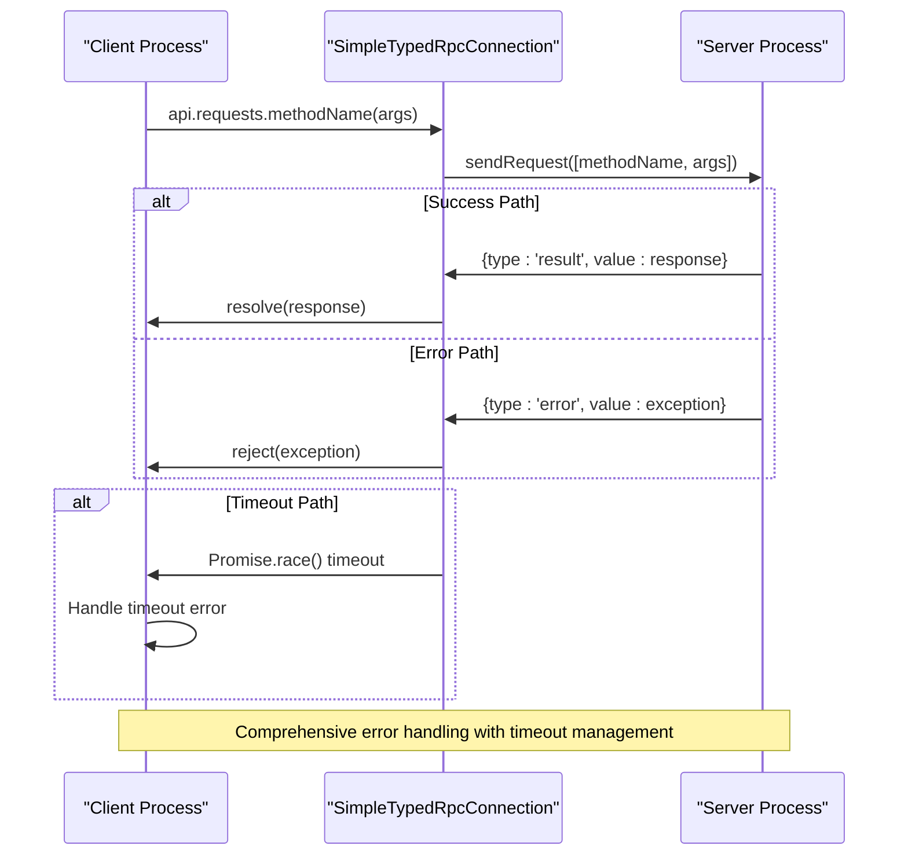
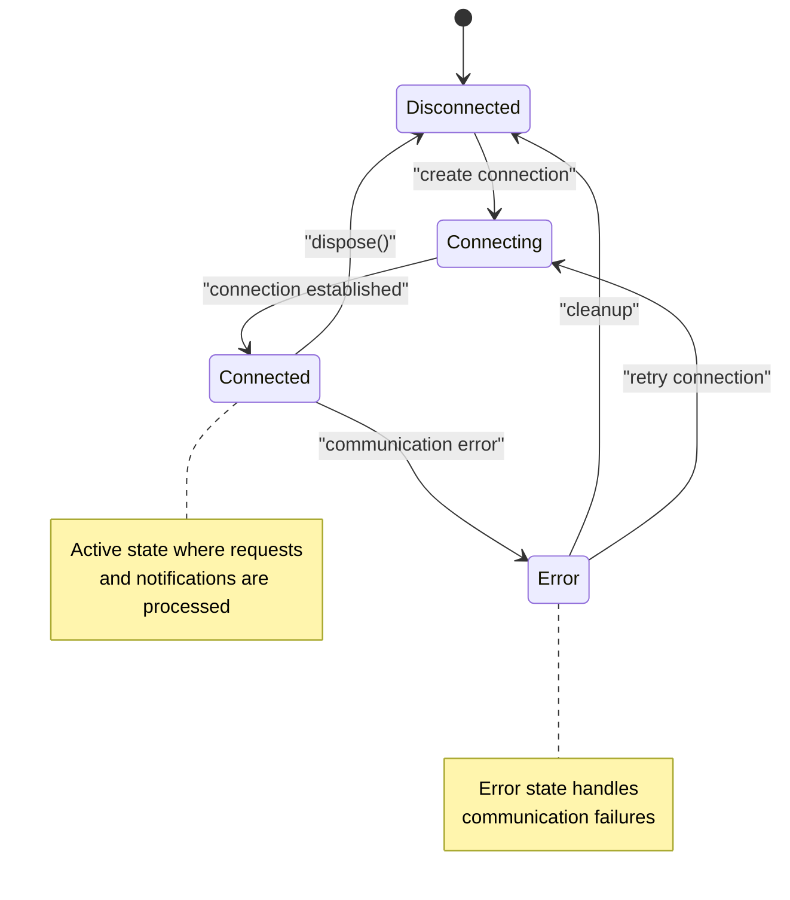

# RPC Communication

<cite>
**Referenced Files in This Document**   
- [rpc.ts](file://src/util/vs/base/common/observableInternal/logging/debugger/rpc.ts)
- [debuggerRpc.ts](file://src/util/vs/base/common/observableInternal/logging/debugger/debuggerRpc.ts)
- [rpc.ts](file://src/extension/onboardDebug/node/copilotDebugWorker/rpc.ts)
- [worker.ts](file://src/util/node/worker.ts)
</cite>

## Table of Contents
1. [Introduction](#introduction)
2. [Core RPC Architecture](#core-rpc-architecture)
3. [SimpleTypedRpcConnection Class](#simpletypedrpcconnection-class)
4. [Request-Response Pattern](#request-response-pattern)
5. [Notification System](#notification-system)
6. [Bidirectional Communication Channels](#bidirectional-communication-channels)
7. [Type Safety Mechanisms](#type-safety-mechanisms)
8. [RPC Implementation Examples](#rpc-implementation-examples)
9. [Error Handling and Timeout Management](#error-handling-and-timeout-management)
10. [Connection Lifecycle Management](#connection-lifecycle-management)
11. [Performance Considerations](#performance-considerations)
12. [Best Practices for RPC Communication](#best-practices-for-rpc-communication)

## Introduction
The vscode-copilot-chat extension implements a robust RPC (Remote Procedure Call) communication system to enable seamless interaction between different processes, including the extension host, webview, and language server. This documentation provides a comprehensive analysis of the RPC architecture, focusing on the SimpleTypedRpcConnection class and related interfaces that form the foundation of the communication system. The RPC system facilitates bidirectional communication through a well-defined request-response pattern and notification system, ensuring type safety and efficient data exchange across process boundaries.

## Core RPC Architecture
The RPC communication system in vscode-copilot-chat is built on a modular architecture that enables reliable and type-safe communication between different components of the extension. The system is designed to handle both synchronous request-response interactions and asynchronous notifications, providing a flexible foundation for inter-process communication.

```mermaid
graph TB
subgraph "Extension Host"
EH[Extension Host Process]
end
subgraph "Webview"
WV[Webview Process]
end
subgraph "Language Server"
LS[Language Server Process]
end
EH < --> |SimpleTypedRpcConnection| WV
EH < --> |SimpleTypedRpcConnection| LS
WV < --> |SimpleTypedRpcConnection| LS
classDef process fill:#f9f,stroke:#333,stroke-width:2px;
class EH,WV,LS process
```

**Diagram sources**
- [rpc.ts](file://src/util/vs/base/common/observableInternal/logging/debugger/rpc.ts#L39-L104)
- [debuggerRpc.ts](file://src/util/vs/base/common/observableInternal/logging/debugger/debuggerRpc.ts#L8-L81)

**Section sources**
- [rpc.ts](file://src/util/vs/base/common/observableInternal/logging/debugger/rpc.ts#L1-L104)
- [debuggerRpc.ts](file://src/util/vs/base/common/observableInternal/logging/debugger/debuggerRpc.ts#L1-L82)

## SimpleTypedRpcConnection Class
The SimpleTypedRpcConnection class is the cornerstone of the RPC system in vscode-copilot-chat, providing a type-safe interface for communication between different processes. This class implements a bidirectional communication channel that supports both request-response patterns and notification-based messaging.

```mermaid
classDiagram
class SimpleTypedRpcConnection {
+api : T
-_channel : IChannel
-_channelFactory : ChannelFactory
-_getHandler : () => Side
+constructor(channelFactory : ChannelFactory, getHandler : () => Side)
+static createHost<T extends API>(channelFactory : ChannelFactory, getHandler : () => T['host']) : SimpleTypedRpcConnection<MakeSideAsync<T['client']>>
+static createClient<T extends API>(channelFactory : ChannelFactory, getHandler : () => T['client']) : SimpleTypedRpcConnection<MakeSideAsync<T['host']>>
}
class IChannel {
+sendNotification(data : unknown) : void
+sendRequest(data : unknown) : Promise<RpcRequestResult>
}
class IChannelHandler {
+handleNotification(notificationData : unknown) : void
+handleRequest(requestData : unknown) : Promise<RpcRequestResult> | RpcRequestResult
}
class API {
+host : Side
+client : Side
}
class Side {
+notifications : Record<string, (...args : any[]) => void>
+requests : Record<string, (...args : any[]) => Promise<unknown> | unknown>
}
SimpleTypedRpcConnection --> IChannel : "uses"
SimpleTypedRpcConnection --> IChannelHandler : "implements"
SimpleTypedRpcConnection --> API : "type parameter"
SimpleTypedRpcConnection --> Side : "type parameter"
```

**Diagram sources**
- [rpc.ts](file://src/util/vs/base/common/observableInternal/logging/debugger/rpc.ts#L39-L104)

**Section sources**
- [rpc.ts](file://src/util/vs/base/common/observableInternal/logging/debugger/rpc.ts#L39-L104)

## Request-Response Pattern
The RPC system implements a robust request-response pattern that enables synchronous communication between processes. When a client sends a request, it receives a promise that resolves with the response from the server, allowing for efficient handling of asynchronous operations across process boundaries.



**Diagram sources**
- [rpc.ts](file://src/util/vs/base/common/observableInternal/logging/debugger/rpc.ts#L75-L85)
- [rpc.ts](file://src/util/vs/base/common/observableInternal/logging/debugger/rpc.ts#L64-L72)

**Section sources**
- [rpc.ts](file://src/util/vs/base/common/observableInternal/logging/debugger/rpc.ts#L75-L85)

## Notification System
The notification system in the RPC architecture enables asynchronous, one-way communication from server to client without requiring a response. This pattern is particularly useful for event-driven scenarios where the server needs to push updates to the client without blocking the execution flow.



**Diagram sources**
- [rpc.ts](file://src/util/vs/base/common/observableInternal/logging/debugger/rpc.ts#L88-L94)
- [rpc.ts](file://src/util/vs/base/common/observableInternal/logging/debugger/rpc.ts#L56-L63)

**Section sources**
- [rpc.ts](file://src/util/vs/base/common/observableInternal/logging/debugger/rpc.ts#L88-L94)

## Bidirectional Communication Channels
The RPC system supports bidirectional communication channels that allow both client and server to initiate communication. This bidirectional capability enables complex interaction patterns where either endpoint can act as both a client and server in different contexts.

```mermaid
flowchart LR
A[Client Process] < --> |Request/Response| B[SimpleTypedRpcConnection]
B < --> |Request/Response| C[Server Process]
C < --> |Notifications| A
A < --> |Notifications| C
subgraph "Client Role"
A
end
subgraph "Server Role"
C
end
style A fill:#f9f,stroke:#333,stroke-width:2px
style C fill:#bbf,stroke:#333,stroke-width:2px
```

**Diagram sources**
- [rpc.ts](file://src/util/vs/base/common/observableInternal/logging/debugger/rpc.ts#L39-L104)
- [debuggerRpc.ts](file://src/util/vs/base/common/observableInternal/logging/debugger/debuggerRpc.ts#L8-L81)

**Section sources**
- [rpc.ts](file://src/util/vs/base/common/observableInternal/logging/debugger/rpc.ts#L39-L104)

## Type Safety Mechanisms
The RPC system employs sophisticated type safety mechanisms to ensure type consistency across process boundaries. The use of TypeScript generics and conditional types enables compile-time type checking for both requests and notifications, reducing runtime errors and improving code maintainability.

```mermaid
classDiagram
class MakeSideAsync {
+notifications : T['notifications']
+requests : { [K in keyof T['requests']] : MakeAsyncIfNot<T['requests'][K]> }
}
class MakeAsyncIfNot {
<<type alias>>
TFn extends (...args : infer TArgs) => infer TResult
TResult extends Promise<unknown> ? TFn : (...args : TArgs) => Promise<TResult>
}
class RpcRequestResult {
<<type alias>>
{ type : 'result'; value : unknown } | { type : 'error'; value : unknown }
}
MakeSideAsync --> MakeAsyncIfNot : "uses"
SimpleTypedRpcConnection --> MakeSideAsync : "type parameter"
IChannel --> RpcRequestResult : "return type"
```

**Diagram sources**
- [rpc.ts](file://src/util/vs/base/common/observableInternal/logging/debugger/rpc.ts#L32-L37)
- [rpc.ts](file://src/util/vs/base/common/observableInternal/logging/debugger/rpc.ts#L20-L21)

**Section sources**
- [rpc.ts](file://src/util/vs/base/common/observableInternal/logging/debugger/rpc.ts#L32-L37)

## RPC Implementation Examples
The RPC system is implemented in various parts of the vscode-copilot-chat extension, demonstrating different usage patterns and integration scenarios. The following examples illustrate how the SimpleTypedRpcConnection is used in practice to enable communication between different components.

### SimpleRPC Implementation
The SimpleRPC class provides a concrete implementation of the RPC system for the copilot debug worker, demonstrating how the RPC protocol is adapted for specific use cases.

```mermaid
classDiagram
class SimpleRPC {
-idCounter : number
-methods : Map<string, (...params : any[]) => Promise<any>>
-pendingRequests : Map<number, { resolve : (result : any) => void; reject : (error : Error) => void }>
-didEnd : boolean
-ended : Promise<void>
+constructor(stream : Duplex)
+registerMethod(method : string, handler : (params : any) => Promise<any>) : void
+callMethod(method : string, params? : any) : Promise<any>
+dispose() : void
-handleData(data : Buffer) : void
}
class ISimpleRPC {
<<interface>>
+registerMethod(method : string, handler : (params : any) => Promise<any>) : void
+callMethod(method : string, params? : any) : Promise<any>
+dispose() : void
}
SimpleRPC --> ISimpleRPC : "implements"
SimpleRPC --> Duplex : "uses"
```

**Diagram sources**
- [rpc.ts](file://src/extension/onboardDebug/node/copilotDebugWorker/rpc.ts#L35-L112)

**Section sources**
- [rpc.ts](file://src/extension/onboardDebug/node/copilotDebugWorker/rpc.ts#L35-L112)

### Worker RPC Proxy
The WorkerWithRpcProxy class demonstrates how the RPC system is integrated with web workers, enabling communication between the main thread and worker threads.

```mermaid
classDiagram
class WorkerWithRpcProxy {
-worker : Worker
-responseHandler : RcpResponseHandler
+proxy : RpcProxy<WorkerProxyType>
+host : HostProxyType
+constructor(worker : Worker, workerProxyType : WorkerProxyType, hostProxyType : HostProxyType)
+dispose() : void
}
class RpcProxy {
<<type alias>>
[K in keyof ProxyType] : ProxyType[K] extends ((...args : infer Args) => infer R) ? (...args : Args) => Promise<Awaited<R>> : never
}
class RcpResponseHandler {
-handlers : Map<number, { resolve : (result : any) => void; reject : (error : Error) => void }>
+handleResponse(id : number, result : any, isError : boolean) : void
+handleError(err : Error) : void
+clear() : void
}
WorkerWithRpcProxy --> RpcProxy : "generates"
WorkerWithRpcProxy --> RcpResponseHandler : "uses"
WorkerWithRpcProxy --> Worker : "communicates with"
```

**Diagram sources**
- [worker.ts](file://src/util/node/worker.ts#L79-L83)
- [worker.ts](file://src/util/node/worker.ts#L61-L63)

**Section sources**
- [worker.ts](file://src/util/node/worker.ts#L61-L83)

## Error Handling and Timeout Management
The RPC system implements comprehensive error handling and timeout management to ensure robust communication between processes. The system handles various error scenarios, including connection failures, timeout conditions, and serialization errors.



**Diagram sources**
- [rpc.ts](file://src/util/vs/base/common/observableInternal/logging/debugger/rpc.ts#L64-L72)
- [rpc.ts](file://src/util/vs/base/common/observableInternal/logging/debugger/rpc.ts#L78-L82)

**Section sources**
- [rpc.ts](file://src/util/vs/base/common/observableInternal/logging/debugger/rpc.ts#L64-L82)

## Connection Lifecycle Management
The RPC system provides robust connection lifecycle management, ensuring proper initialization, maintenance, and cleanup of communication channels between processes. The lifecycle management includes connection establishment, error handling, and graceful shutdown procedures.



**Diagram sources**
- [rpc.ts](file://src/util/vs/base/common/observableInternal/logging/debugger/rpc.ts#L51-L54)
- [rpc.ts](file://src/util/vs/base/common/observableInternal/logging/debugger/rpc.ts#L96-L98)

**Section sources**
- [rpc.ts](file://src/util/vs/base/common/observableInternal/logging/debugger/rpc.ts#L51-L98)

## Performance Considerations
The RPC communication system in vscode-copilot-chat is designed with performance optimization in mind, minimizing overhead and maximizing efficiency in inter-process communication. The system employs several strategies to reduce latency and improve throughput.

### Performance Optimization Strategies
| Strategy | Description | Implementation |
|--------|-----------|---------------|
| **Message Batching** | Combines multiple small messages into larger batches to reduce communication overhead | Implemented through stream-based communication with newline delimiters |
| **Type Erasure** | Minimizes serialization overhead by using simple data structures | Uses arrays for message format [method, args] instead of objects |
| **Connection Reuse** | Maintains persistent connections to avoid repeated connection establishment | Connection lifecycle management with error recovery |
| **Asynchronous Processing** | Enables non-blocking communication to improve responsiveness | Promise-based API with async/await support |
| **Error Minimization** | Reduces error handling overhead through consistent error reporting | Standardized error format with type discrimination |

**Section sources**
- [rpc.ts](file://src/util/vs/base/common/observableInternal/logging/debugger/rpc.ts#L1-L104)
- [rpc.ts](file://src/extension/onboardDebug/node/copilotDebugWorker/rpc.ts#L1-L112)

## Best Practices for RPC Communication
The vscode-copilot-chat extension follows several best practices for RPC communication to ensure reliability, maintainability, and performance. These practices guide the implementation and usage of the RPC system across different components of the extension.

### Recommended Practices
1. **Use Type-Safe Interfaces**: Always define typed request and notification interfaces to leverage compile-time type checking and reduce runtime errors.
2. **Implement Proper Error Handling**: Ensure all RPC calls are wrapped in appropriate error handling mechanisms to gracefully handle communication failures.
3. **Manage Connection Lifecycle**: Properly manage the connection lifecycle by disposing of connections when no longer needed to prevent resource leaks.
4. **Optimize Message Size**: Minimize message size by only sending necessary data and avoiding serialization of complex objects when possible.
5. **Use Asynchronous Patterns**: Leverage asynchronous patterns to prevent blocking the main thread and maintain application responsiveness.
6. **Implement Timeout Mechanisms**: Set appropriate timeouts for RPC calls to prevent indefinite waiting in case of communication failures.
7. **Monitor Performance**: Regularly monitor RPC communication performance to identify and address potential bottlenecks.
8. **Document Interfaces**: Maintain comprehensive documentation of RPC interfaces to facilitate understanding and maintenance.

**Section sources**
- [rpc.ts](file://src/util/vs/base/common/observableInternal/logging/debugger/rpc.ts#L1-L104)
- [worker.ts](file://src/util/node/worker.ts#L61-L83)
- [rpc.ts](file://src/extension/onboardDebug/node/copilotDebugWorker/rpc.ts#L1-L112)