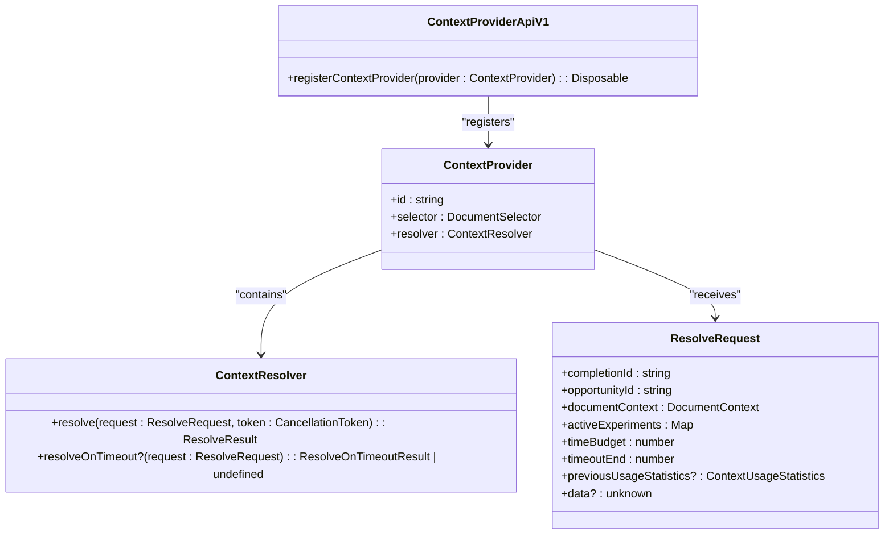
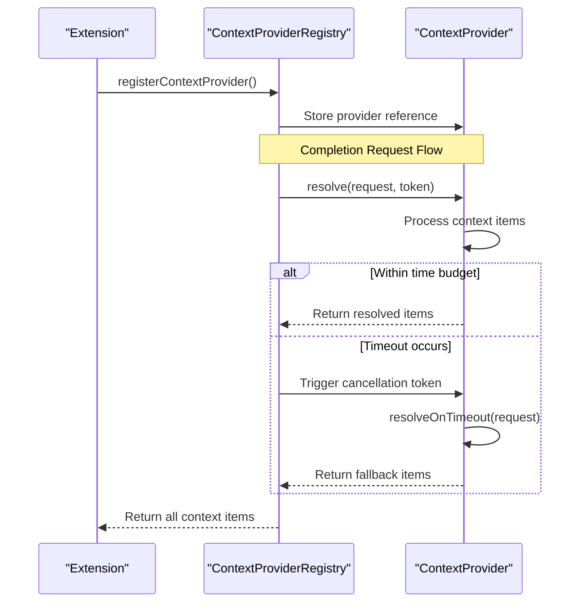
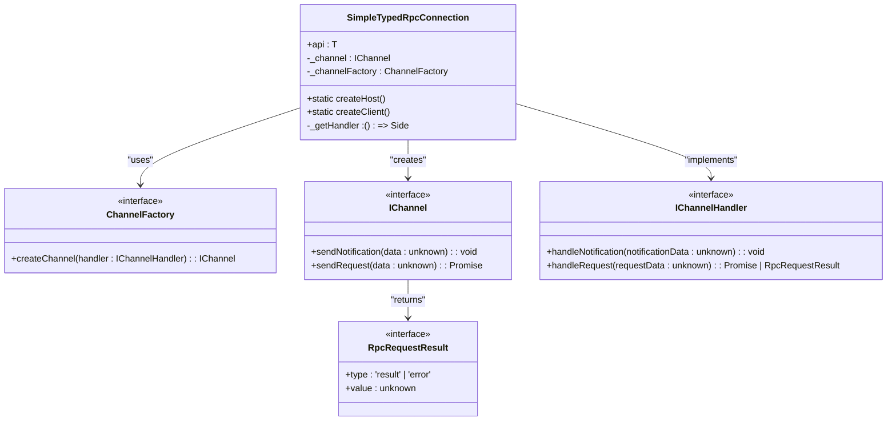
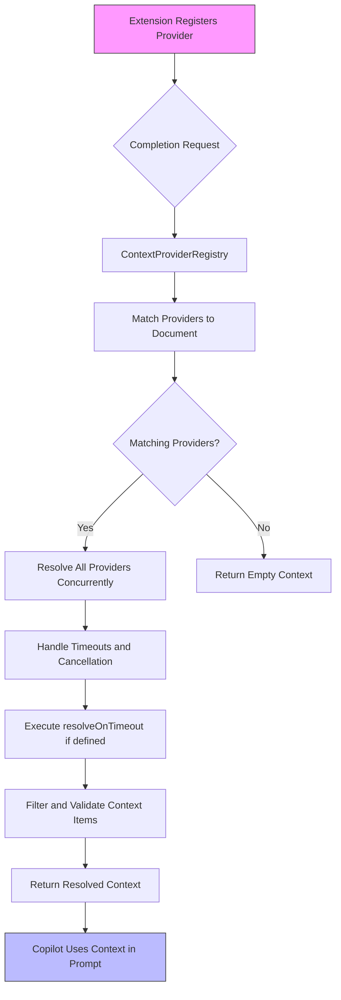

# Service Interfaces

<cite>
**Referenced Files in This Document**   
- [contextProviderApiV1.ts](file://src/extension/completions-core/vscode-node/types/src/contextProviderApiV1.ts)
- [vscodeContextProviderApi.ts](file://src/extension/api/vscode/vscodeContextProviderApi.ts)
- [contextProviderRegistry.ts](file://src/extension/completions-core/vscode-node/lib/src/prompt/contextProviderRegistry.ts)
- [rpc.ts](file://src/util/vs/base/common/observableInternal/logging/debugger/rpc.ts)
- [openai.ts](file://src/platform/networking/common/openai.ts)
- [tokenizer.ts](file://src/platform/tokenizer/node/tokenizer.ts)
- [contextProviderBridge.test.ts](file://src/extension/completions-core/vscode-node/lib/src/prompt/components/test/contextProviderBridge.test.ts)
- [contextProviderRegistry.test.ts](file://src/extension/completions-core/vscode-node/lib/src/prompt/test/contextProviderRegistry.test.ts)
</cite>

## Table of Contents
1. [Introduction](#introduction)
2. [ContextProvider API](#contextprovider-api)
3. [ContextResolver Interface](#contextresolver-interface)
4. [RPC Connection Patterns](#rpc-connection-patterns)
5. [API Usage and Token Tracking](#api-usage-and-token-tracking)
6. [Implementation Examples and Data Flow](#implementation-examples-and-data-flow)
7. [Common Implementation Issues](#common-implementation-issues)
8. [Conclusion](#conclusion)

## Introduction

The vscode-copilot-chat system provides a comprehensive set of service interfaces that enable extensions to enhance Copilot's capabilities by providing additional context for prompts, establishing cross-process communication, and tracking API usage metrics. This documentation details the key service interfaces, focusing on the ContextProvider API (v1) that allows extensions to contribute context items, the RPC connection patterns used for inter-process communication, and the API usage interface that tracks token consumption in completion requests. The system is designed to be extensible, efficient, and robust, with careful consideration for performance, error handling, and proper resource management.

**Section sources**
- [contextProviderApiV1.ts](file://src/extension/completions-core/vscode-node/types/src/contextProviderApiV1.ts)
- [contextProviderRegistry.ts](file://src/extension/completions-core/vscode-node/lib/src/prompt/contextProviderRegistry.ts)

## ContextProvider API

The ContextProvider API (v1) is the primary interface through which extensions can register providers to supply additional context items that Copilot can use in its prompts. This API is exposed as an export of the Copilot extension and can be accessed by casting the exported object to the `ContextProviderApiV1` interface. The API enables extensions to register context providers that are uniquely identified by their ID and associated with specific document types through a document selector.

A `ContextProvider` consists of three key properties:
- **id**: A unique identifier for the provider that must not contain commas or asterisks
- **selector**: A document selector that specifies the file types for which the provider is active
- **resolver**: An object that implements the `ContextResolver` interface to provide context items

When a context provider is registered, it becomes available to contribute context items for completion requests that match its document selector. The system evaluates all registered providers against the current document context and invokes the resolvers of matching providers to obtain context items. Providers that do not match the document context are still tracked but return empty data arrays.

The registration process is managed through the `registerContextProvider` method, which returns a `Disposable` object. This disposable should be properly managed by the extension to ensure clean unregistration when the provider is no longer needed, preventing memory leaks and ensuring proper cleanup.



**Diagram sources**
- [contextProviderApiV1.ts](file://src/extension/completions-core/vscode-node/types/src/contextProviderApiV1.ts)
- [vscodeContextProviderApi.ts](file://src/extension/api/vscode/vscodeContextProviderApi.ts)

**Section sources**
- [contextProviderApiV1.ts](file://src/extension/completions-core/vscode-node/types/src/contextProviderApiV1.ts)
- [vscodeContextProviderApi.ts](file://src/extension/api/vscode/vscodeContextProviderApi.ts)

## ContextResolver Interface

The `ContextResolver` interface defines how context providers resolve context items for Copilot prompts. It consists of a required `resolve` method and an optional `resolveOnTimeout` method, both designed to handle asynchronous operations and time constraints effectively.

The `resolve` method is the primary mechanism for providing context items and returns a `ResolveResult<T>`, which can be a `Promise<T>`, `Promise<readonly T[]>`, or `AsyncIterable<T>`. This flexibility allows providers to return single items, arrays of items, or streams of items asynchronously. The method accepts a `ResolveRequest` object containing information about the completion request and a `CancellationToken` that is triggered when the request exceeds its time budget.

The `resolveOnTimeout` method is an optional fallback mechanism that is invoked when the primary `resolve` method exceeds its time budget. This allows providers to return minimal or cached context items even when the full resolution process cannot complete in time. The fallback items are merged with any items already resolved, ensuring that Copilot receives some context even under time pressure.

The system implements a sophisticated timeout mechanism that balances performance and completeness. When a request is made, a time budget is established based on configuration and experimental settings. If the resolution process exceeds this budget, the cancellation token is triggered, and if a `resolveOnTimeout` method is defined, it is called to provide fallback context. This ensures that the system remains responsive while still attempting to provide valuable context.



**Diagram sources**
- [contextProviderRegistry.ts](file://src/extension/completions-core/vscode-node/lib/src/prompt/contextProviderRegistry.ts)
- [contextProviderApiV1.ts](file://src/extension/completions-core/vscode-node/types/src/contextProviderApiV1.ts)

**Section sources**
- [contextProviderApiV1.ts](file://src/extension/completions-core/vscode-node/types/src/contextProviderApiV1.ts)
- [contextProviderRegistry.ts](file://src/extension/completions-core/vscode-node/lib/src/prompt/contextProviderRegistry.ts)
- [contextProviderRegistry.test.ts](file://src/extension/completions-core/vscode-node/lib/src/prompt/test/contextProviderRegistry.test.ts)

## RPC Connection Patterns

The vscode-copilot-chat system employs RPC (Remote Procedure Call) connections to facilitate communication between different processes, particularly through the `SimpleTypedRpcConnection` class. This implementation provides a type-safe mechanism for handling requests and notifications across process boundaries, enabling seamless integration between the main extension process and worker processes or other isolated execution environments.

The `SimpleTypedRpcConnection` class serves as a bidirectional communication channel that supports both requests (which expect a response) and notifications (which are fire-and-forget messages). It uses a channel factory pattern to create the underlying communication channel and establishes a proxy-based API that exposes the remote methods in a type-safe manner. The connection handles serialization and deserialization of messages, error propagation, and proper cleanup of resources.

Key features of the RPC implementation include:
- Type safety through generic interfaces and proxy objects
- Bidirectional communication with separate request and notification channels
- Error handling and propagation across process boundaries
- Proper resource cleanup through the dispose pattern
- Support for both synchronous and asynchronous method invocations

The RPC system is designed to be transparent to the caller, making remote method invocations appear as if they were local calls while handling the complexities of cross-process communication behind the scenes. This abstraction allows developers to focus on functionality rather than the intricacies of inter-process communication.



**Diagram sources**
- [rpc.ts](file://src/util/vs/base/common/observableInternal/logging/debugger/rpc.ts)

**Section sources**
- [rpc.ts](file://src/util/vs/base/common/observableInternal/logging/debugger/rpc.ts)

## API Usage and Token Tracking

The system provides comprehensive API usage tracking that monitors token consumption in completion requests through the `APIUsage` interface. This interface captures detailed metrics about token usage, including prompt tokens, completion tokens, total tokens, and breakdowns with cached tokens and reasoning tokens.

The `APIUsage` interface includes:
- **prompt_tokens**: Number of tokens in the prompt
- **completion_tokens**: Number of tokens in the generated completion
- **total_tokens**: Total number of tokens used in the request (prompt + completion)
- **prompt_tokens_details**: Breakdown of tokens used in the prompt, including cached_tokens
- **completion_tokens_details**: Breakdown of tokens used in a completion, including reasoning_tokens, accepted_prediction_tokens, and rejected_prediction_tokens

Token tracking is implemented through the tokenizer system, which calculates token lengths for various content types including text, images, and opaque content parts. The tokenizer uses caching to improve performance and provides methods to count tokens for individual messages, message arrays, and tool definitions. This information is crucial for managing context window limits, billing calculations, and performance optimization.

The system also includes mechanisms to adjust token usage for context window limitations, particularly when interfacing with different language models that have varying context window sizes. This ensures that token counts are accurately represented even when the actual context window differs from what the model assumes.

```mermaid
classDiagram
class APIUsage {
+prompt_tokens : number
+completion_tokens : number
+total_tokens : number
+prompt_tokens_details? : {
cached_tokens : number
}
+completion_tokens_details? : {
reasoning_tokens : number
accepted_prediction_tokens : number
rejected_prediction_tokens : number
}
}
class ITokenizer {
+tokenLength(text : string | Raw.ChatCompletionContentPart) : Promise<number>
+countMessageTokens(message : Raw.ChatMessage) : Promise<number>
+countMessagesTokens(messages : Raw.ChatMessage[]) : Promise<number>
+countToolTokens(tools : readonly LanguageModelChatTool[]) : Promise<number>
}
class TokenizerType {
+CL100K = 'cl100k_base'
+O200K = 'o200k_base'
+Llama3 = 'llama3'
}
APIUsage --> ITokenizer : "uses for calculation"
ITokenizer --> TokenizerType : "supports"
```

**Diagram sources**
- [openai.ts](file://src/platform/networking/common/openai.ts)
- [tokenizer.ts](file://src/platform/tokenizer/node/tokenizer.ts)

**Section sources**
- [openai.ts](file://src/platform/networking/common/openai.ts)
- [tokenizer.ts](file://src/platform/tokenizer/node/tokenizer.ts)
- [util.ts](file://src/util/common/tokenizer.ts)

## Implementation Examples and Data Flow

The system demonstrates several concrete implementation patterns for registering, consuming, and managing context providers and their data flow. The data flow begins when an extension registers a context provider through the `ContextProviderApiV1`, which delegates to the `ILanguageContextProviderService` for actual registration.

When a completion request is initiated, the `ContextProviderRegistry` evaluates all registered providers against the current document context using the `matchProviders` method. Providers that match the document selector are processed concurrently using the `resolveAll` utility function, which handles promises and async iterables efficiently. The resolution process respects time budgets and cancellation tokens, ensuring that the system remains responsive.

For example, a test implementation shows a `TestContextProvider` with a `TestContextResolver` that yields context items asynchronously. The registry processes these providers, handles errors appropriately, and merges results from multiple providers. The system also demonstrates how fallback context items are included when timeouts occur, ensuring that Copilot receives some context even when full resolution cannot complete.

The data flow follows a clear pattern:
1. Extension registers context provider
2. Completion request triggers context resolution
3. Registry matches providers to document context
4. Matching providers resolve context items concurrently
5. Results are collected, filtered, and validated
6. Context items are returned for prompt construction

This flow ensures that context provision is efficient, reliable, and scalable, even with multiple providers and complex resolution logic.



**Diagram sources**
- [contextProviderRegistry.ts](file://src/extension/completions-core/vscode-node/lib/src/prompt/contextProviderRegistry.ts)
- [contextProviderBridge.test.ts](file://src/extension/completions-core/vscode-node/lib/src/prompt/components/test/contextProviderBridge.test.ts)

**Section sources**
- [contextProviderRegistry.ts](file://src/extension/completions-core/vscode-node/lib/src/prompt/contextProviderRegistry.ts)
- [contextProviderBridge.test.ts](file://src/extension/completions-core/vscode-node/lib/src/prompt/components/test/contextProviderBridge.test.ts)
- [contextProviderRegistry.test.ts](file://src/extension/completions-core/vscode-node/lib/src/prompt/test/contextProviderRegistry.test.ts)

## Common Implementation Issues

Several common implementation issues arise when working with the service interfaces in the vscode-copilot-chat system, particularly around proper disposal, error handling, and performance considerations.

**Proper Disposal of Registered Providers**: Extensions must properly dispose of registered providers to prevent memory leaks and ensure clean unregistration. The `registerContextProvider` method returns a `Disposable` object that should be managed appropriately, typically by adding it to a collection of disposables that are disposed when the extension is deactivated or when the provider is no longer needed.

**Error Handling in Asynchronous Resolvers**: The `ContextResolver` interface involves asynchronous operations that can fail. Providers should implement robust error handling, particularly in the `resolve` method, to prevent unhandled promise rejections. The system distinguishes between cancellation errors (which are expected when time budgets are exceeded) and other errors (which are logged as unexpected issues).

**Performance Considerations**: When providing context, providers should be mindful of performance implications. The system enforces time budgets for context resolution, and providers should optimize their logic to complete within these constraints. For expensive operations, providers should consider implementing the `resolveOnTimeout` method to provide minimal context when the full resolution cannot complete in time. Additionally, providers should leverage caching where appropriate to avoid redundant computations across multiple requests.

Other considerations include ensuring that context items conform to the expected schema (Trait or CodeSnippet), generating unique IDs for context items when possible, and respecting the importance values to help prioritize context in the prompt construction process.

**Section sources**
- [contextProviderRegistry.ts](file://src/extension/completions-core/vscode-node/lib/src/prompt/contextProviderRegistry.ts)
- [contextProviderApiV1.ts](file://src/extension/completions-core/vscode-node/types/src/contextProviderApiV1.ts)
- [contextProviderRegistry.test.ts](file://src/extension/completions-core/vscode-node/lib/src/prompt/test/contextProviderRegistry.test.ts)

## Conclusion

The service interfaces in the vscode-copilot-chat system provide a robust and extensible framework for enhancing Copilot's capabilities through custom context providers, efficient RPC communication, and comprehensive API usage tracking. The ContextProvider API (v1) enables extensions to contribute valuable context to Copilot prompts in a structured and performant manner, while the RPC patterns facilitate reliable communication between processes. The token tracking system provides detailed insights into API usage, supporting both performance optimization and billing accuracy.

By following the documented patterns and addressing common implementation issues, extensions can effectively integrate with the Copilot system to deliver enhanced developer experiences. The architecture emphasizes type safety, error resilience, and performance efficiency, ensuring that the system remains responsive and reliable even under demanding conditions.