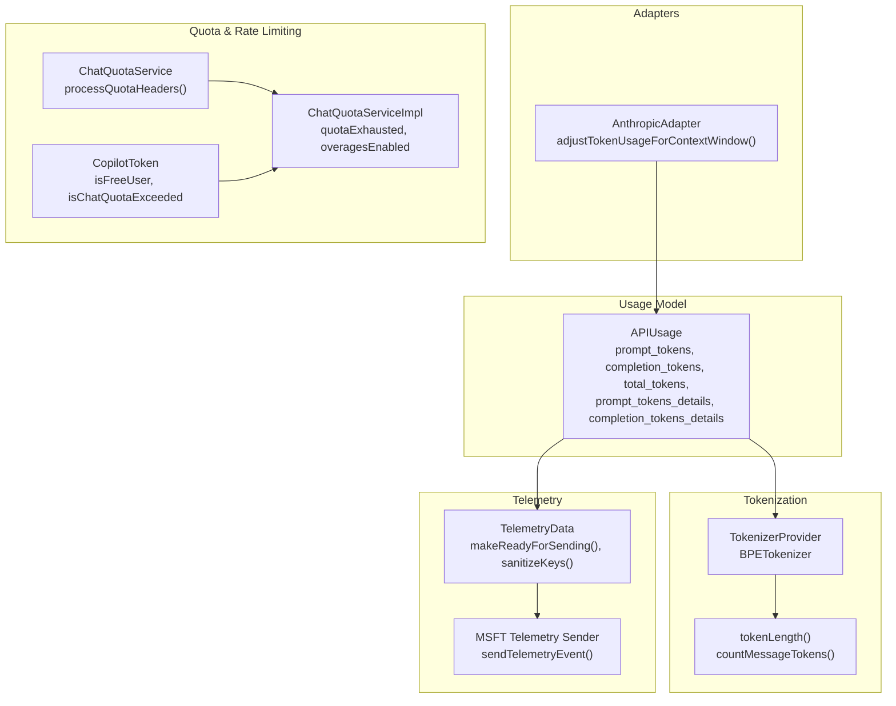
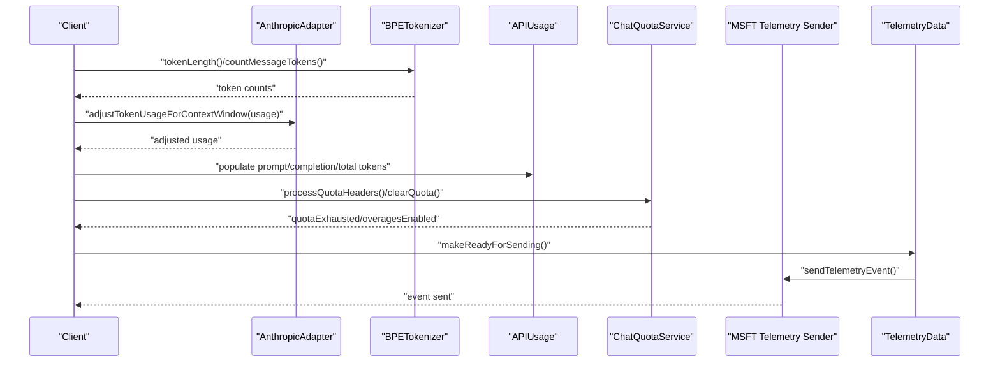
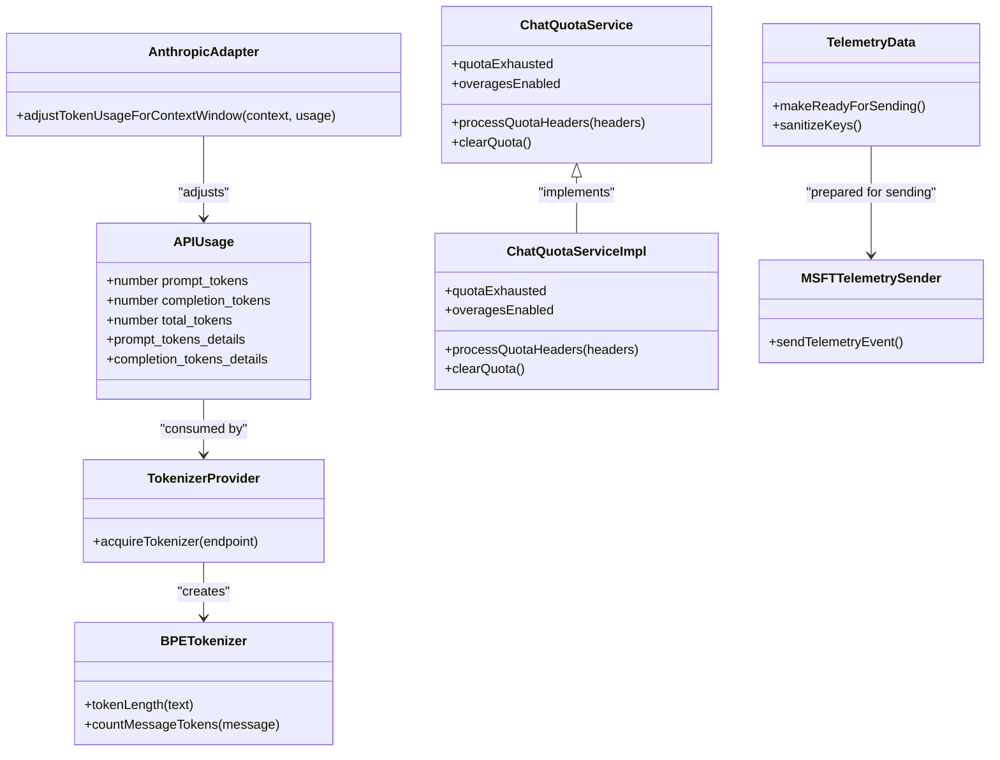

# Usage Tracking

<cite>
**Referenced Files in This Document**
- [openai.ts](file://src/platform/networking/common/openai.ts)
- [anthropicAdapter.ts](file://src/extension/agents/node/adapters/anthropicAdapter.ts)
- [tokenizer.ts](file://src/platform/tokenizer/node/tokenizer.ts)
- [chatQuotaService.ts](file://src/platform/chat/common/chatQuotaService.ts)
- [chatQuotaServiceImpl.ts](file://src/platform/chat/common/chatQuotaServiceImpl.ts)
- [chatQuota.contribution.ts](file://src/extension/chat/vscode-node/chatQuota.contribution.ts)
- [spyingChatMLFetcher.ts](file://test/base/spyingChatMLFetcher.ts)
- [telemetry.ts](file://src/platform/telemetry/common/telemetryData.ts)
- [msftTelemetrySender.ts](file://src/platform/telemetry/common/msftTelemetrySender.ts)
- [chatQuota.contribution.ts](file://src/extension/chat/vscode-node/chatQuota.contribution.ts)
- [chatQuotaService.ts](file://src/platform/chat/common/chatQuotaService.ts)
- [chatQuotaServiceImpl.ts](file://src/platform/chat/common/chatQuotaServiceImpl.ts)
- [commonTypes.ts](file://src/platform/chat/common/commonTypes.ts)
- [copilotToken.ts](file://src/platform/authentication/common/copilotToken.ts)
- [chatParticipantTelemetry.ts](file://src/extension/prompt/node/chatParticipantTelemetry.ts)
- [chatTokens.spec.ts](file://src/platform/openai/node/test/chatTokens.spec.ts)
</cite>

## Table of Contents
1. [Introduction](#introduction)
2. [Project Structure](#project-structure)
3. [Core Components](#core-components)
4. [Architecture Overview](#architecture-overview)
5. [Detailed Component Analysis](#detailed-component-analysis)
6. [Dependency Analysis](#dependency-analysis)
7. [Performance Considerations](#performance-considerations)
8. [Troubleshooting Guide](#troubleshooting-guide)
9. [Conclusion](#conclusion)
10. [Appendices](#appendices)

## Introduction
This document explains the usage tracking system in the vscode-copilot-chat extension. It focuses on how token consumption is tracked for completion requests, including prompt_tokens, completion_tokens, total_tokens, and detailed breakdowns such as cached_tokens and reasoning_tokens. It also covers how usage data is collected, aggregated, and reported through the telemetry system, and how usage relates to rate limiting, quota management, and billing. Finally, it outlines privacy considerations, data retention, and best practices for implementing accurate usage tracking in new features.

## Project Structure
The usage tracking system spans several layers:
- API usage interface and data model for token accounting
- Tokenization utilities for calculating token counts across text, images, and opaque parts
- Adapter logic that adjusts usage for context windows
- Quota and rate-limiting services that interpret provider headers and user quotas
- Telemetry infrastructure that sanitizes and sends usage-related telemetry
- Tests and examples that demonstrate aggregation and usage computation

**Diagram sources**
- [openai.ts](file://src/platform/networking/common/openai.ts#L23-L72)
- [tokenizer.ts](file://src/platform/tokenizer/node/tokenizer.ts#L116-L244)
- [anthropicAdapter.ts](file://src/extension/agents/node/adapters/anthropicAdapter.ts#L227-L259)
- [chatQuotaService.ts](file://src/platform/chat/common/chatQuotaService.ts#L46-L63)
- [chatQuotaServiceImpl.ts](file://src/platform/chat/common/chatQuotaServiceImpl.ts#L40-L96)
- [copilotToken.ts](file://src/platform/authentication/common/copilotToken.ts#L108-L122)
- [telemetry.ts](file://src/platform/telemetry/common/telemetryData.ts#L168-L181)
- [msftTelemetrySender.ts](file://src/platform/telemetry/common/msftTelemetrySender.ts#L75-L90)

**Section sources**
- [openai.ts](file://src/platform/networking/common/openai.ts#L23-L72)
- [tokenizer.ts](file://src/platform/tokenizer/node/tokenizer.ts#L116-L244)
- [anthropicAdapter.ts](file://src/extension/agents/node/adapters/anthropicAdapter.ts#L227-L259)
- [chatQuotaService.ts](file://src/platform/chat/common/chatQuotaService.ts#L46-L63)
- [chatQuotaServiceImpl.ts](file://src/platform/chat/common/chatQuotaServiceImpl.ts#L40-L96)
- [copilotToken.ts](file://src/platform/authentication/common/copilotToken.ts#L108-L122)
- [telemetry.ts](file://src/platform/telemetry/common/telemetryData.ts#L168-L181)
- [msftTelemetrySender.ts](file://src/platform/telemetry/common/msftTelemetrySender.ts#L75-L90)

## Core Components
- APIUsage interface defines the token accounting fields and optional detailed breakdowns for prompt and completion tokens.
- TokenizerProvider and BPETokenizer compute token counts for text, images, and opaque content parts, with caching and worker support.
- AnthropicAdapter adjusts usage to account for differences between the agent’s perceived context window and the real model context window.
- ChatQuotaService parses quota headers and user quota snapshots to determine quota exhaustion and overage eligibility.
- TelemetryData prepares and sanitizes telemetry payloads, including usage-related properties and measurements.

**Section sources**
- [openai.ts](file://src/platform/networking/common/openai.ts#L23-L72)
- [tokenizer.ts](file://src/platform/tokenizer/node/tokenizer.ts#L116-L244)
- [anthropicAdapter.ts](file://src/extension/agents/node/adapters/anthropicAdapter.ts#L227-L259)
- [chatQuotaService.ts](file://src/platform/chat/common/chatQuotaService.ts#L46-L63)
- [chatQuotaServiceImpl.ts](file://src/platform/chat/common/chatQuotaServiceImpl.ts#L40-L96)
- [telemetry.ts](file://src/platform/telemetry/common/telemetryData.ts#L168-L181)

## Architecture Overview
The usage tracking pipeline:
1. Requests are processed and token counts are computed via the tokenizer.
2. Provider-specific adjustments (e.g., context window scaling) are applied.
3. Usage is aggregated and exposed via the APIUsage interface.
4. Quota and rate-limit headers are parsed to enforce limits and inform the UI.
5. Telemetry is sanitized and sent to the appropriate telemetry reporter.

**Diagram sources**
- [tokenizer.ts](file://src/platform/tokenizer/node/tokenizer.ts#L116-L244)
- [anthropicAdapter.ts](file://src/extension/agents/node/adapters/anthropicAdapter.ts#L227-L259)
- [openai.ts](file://src/platform/networking/common/openai.ts#L23-L72)
- [chatQuotaServiceImpl.ts](file://src/platform/chat/common/chatQuotaServiceImpl.ts#L40-L96)
- [telemetry.ts](file://src/platform/telemetry/common/telemetryData.ts#L168-L181)
- [msftTelemetrySender.ts](file://src/platform/telemetry/common/msftTelemetrySender.ts#L75-L90)

## Detailed Component Analysis

### API Usage Interface and Data Model
- Defines prompt_tokens, completion_tokens, total_tokens, and optional prompt_tokens_details and completion_tokens_details.
- completion_tokens_details includes reasoning_tokens and Predicted Outputs fields for billing and context window accounting.

Concrete examples from the codebase:
- APIUsage interface and validator are defined in the networking common module.

**Section sources**
- [openai.ts](file://src/platform/networking/common/openai.ts#L23-L72)

### Tokenization and Counting
- TokenizerProvider exposes acquireTokenizer to get a tokenizer for a given model family.
- BPETokenizer computes token counts for text, images, and opaque parts, with caching and worker support.
- tokenLength handles different content part kinds and returns cached or computed token lengths.
- countMessageTokens adds base token overhead and counts tokens for structured messages and tools.

Concrete examples from the codebase:
- Tokenization tests validate message token counts for various roles and content parts.

**Section sources**
- [tokenizer.ts](file://src/platform/tokenizer/node/tokenizer.ts#L48-L85)
- [tokenizer.ts](file://src/platform/tokenizer/node/tokenizer.ts#L116-L244)
- [tokenizer.ts](file://src/platform/tokenizer/node/tokenizer.ts#L133-L174)
- [chatTokens.spec.ts](file://src/platform/openai/node/test/chatTokens.spec.ts#L13-L53)

### Adapter Adjustments for Context Window
- AnthropicAdapter scales usage to align the agent’s perceived context window with the real model context window, returning adjusted prompt_tokens, completion_tokens, and total_tokens.

**Section sources**
- [anthropicAdapter.ts](file://src/extension/agents/node/adapters/anthropicAdapter.ts#L227-L259)

### Usage Aggregation and Examples
- Tests demonstrate aggregating usage across intercepted requests, summing prompt_tokens, completion_tokens, total_tokens, and prompt_tokens_details.cached_tokens.

**Section sources**
- [spyingChatMLFetcher.ts](file://test/base/spyingChatMLFetcher.ts#L52-L80)

### Quota Management and Rate Limiting
- ChatQuotaService parses quota headers and user quota snapshots to derive quota, used, unlimited, overageUsed, overageEnabled, and resetDate.
- ChatQuotaServiceImpl exposes quotaExhausted and overagesEnabled and clears quota state.
- CopilotToken provides flags for free user quota exhaustion.
- commonTypes maps quota exceeded errors to user-facing messages based on plan.

**Section sources**
- [chatQuotaService.ts](file://src/platform/chat/common/chatQuotaService.ts#L46-L63)
- [chatQuotaServiceImpl.ts](file://src/platform/chat/common/chatQuotaServiceImpl.ts#L22-L34)
- [chatQuotaServiceImpl.ts](file://src/platform/chat/common/chatQuotaServiceImpl.ts#L40-L96)
- [copilotToken.ts](file://src/platform/authentication/common/copilotToken.ts#L108-L122)
- [commonTypes.ts](file://src/platform/chat/common/commonTypes.ts#L233-L252)

### Telemetry Reporting and Privacy
- TelemetryData prepares telemetry payloads, adds editor and configuration properties, sanitizes keys, and updates timing measurements.
- MSFT Telemetry Sender attaches common properties (tid, sku, internal flags) and sends events to external or internal reporters.
- Privacy safeguards include removing repository-related properties for standard telemetry and multiplexing long properties.

**Section sources**
- [telemetry.ts](file://src/platform/telemetry/common/telemetryData.ts#L168-L181)
- [telemetry.ts](file://src/platform/telemetry/common/telemetryData.ts#L190-L208)
- [msftTelemetrySender.ts](file://src/platform/telemetry/common/msftTelemetrySender.ts#L75-L90)

### Relationship Between Usage Tracking and Billing
- APIUsage includes completion_tokens_details.reasoning_tokens and Predicted Outputs fields indicating tokens included in billing and context window limits.
- Tests and adapters show how usage is aggregated and adjusted for billing purposes.

**Section sources**
- [openai.ts](file://src/platform/networking/common/openai.ts#L46-L66)
- [spyingChatMLFetcher.ts](file://test/base/spyingChatMLFetcher.ts#L52-L80)
- [anthropicAdapter.ts](file://src/extension/agents/node/adapters/anthropicAdapter.ts#L227-L259)

### Concrete Examples from the Codebase
- Usage aggregation across multiple requests is demonstrated in the spying fetcher test.
- Token counting for messages is validated in tokenizer tests.
- Adapter usage adjustment demonstrates context window scaling.

**Section sources**
- [spyingChatMLFetcher.ts](file://test/base/spyingChatMLFetcher.ts#L52-L80)
- [chatTokens.spec.ts](file://src/platform/openai/node/test/chatTokens.spec.ts#L13-L53)
- [anthropicAdapter.ts](file://src/extension/agents/node/adapters/anthropicAdapter.ts#L227-L259)

## Dependency Analysis

**Diagram sources**
- [openai.ts](file://src/platform/networking/common/openai.ts#L23-L72)
- [tokenizer.ts](file://src/platform/tokenizer/node/tokenizer.ts#L48-L85)
- [tokenizer.ts](file://src/platform/tokenizer/node/tokenizer.ts#L116-L244)
- [anthropicAdapter.ts](file://src/extension/agents/node/adapters/anthropicAdapter.ts#L227-L259)
- [chatQuotaService.ts](file://src/platform/chat/common/chatQuotaService.ts#L46-L63)
- [chatQuotaServiceImpl.ts](file://src/platform/chat/common/chatQuotaServiceImpl.ts#L40-L96)
- [telemetry.ts](file://src/platform/telemetry/common/telemetryData.ts#L168-L181)
- [msftTelemetrySender.ts](file://src/platform/telemetry/common/msftTelemetrySender.ts#L75-L90)

**Section sources**
- [openai.ts](file://src/platform/networking/common/openai.ts#L23-L72)
- [tokenizer.ts](file://src/platform/tokenizer/node/tokenizer.ts#L48-L85)
- [tokenizer.ts](file://src/platform/tokenizer/node/tokenizer.ts#L116-L244)
- [anthropicAdapter.ts](file://src/extension/agents/node/adapters/anthropicAdapter.ts#L227-L259)
- [chatQuotaService.ts](file://src/platform/chat/common/chatQuotaService.ts#L46-L63)
- [chatQuotaServiceImpl.ts](file://src/platform/chat/common/chatQuotaServiceImpl.ts#L40-L96)
- [telemetry.ts](file://src/platform/telemetry/common/telemetryData.ts#L168-L181)
- [msftTelemetrySender.ts](file://src/platform/telemetry/common/msftTelemetrySender.ts#L75-L90)

## Performance Considerations
- Tokenization caching reduces repeated encoding work for identical text.
- Worker-based tokenization offloads heavy work to background threads and periodically resets stats for monitoring.
- Telemetry sanitization and multiplexing prevent oversized payloads and reduce transmission overhead.
- Adapter usage adjustments avoid unnecessary recomputation by short-circuiting for specific models.

[No sources needed since this section provides general guidance]

## Troubleshooting Guide
- If usage appears incorrect, verify tokenization inputs and content part kinds handled by tokenLength.
- If context window mismatches occur, inspect adapter adjustments for model-specific scaling factors.
- If quota checks fail, confirm quota headers parsing and user quota snapshot processing.
- If telemetry is missing, ensure makeReadyForSending is called and sanitization does not remove required properties.

**Section sources**
- [tokenizer.ts](file://src/platform/tokenizer/node/tokenizer.ts#L133-L174)
- [anthropicAdapter.ts](file://src/extension/agents/node/adapters/anthropicAdapter.ts#L227-L259)
- [chatQuotaServiceImpl.ts](file://src/platform/chat/common/chatQuotaServiceImpl.ts#L40-L96)
- [telemetry.ts](file://src/platform/telemetry/common/telemetryData.ts#L168-L181)

## Conclusion
The vscode-copilot-chat extension implements a robust usage tracking system centered on the APIUsage interface, accurate tokenization, provider-specific adjustments, quota and rate-limit enforcement, and sanitized telemetry reporting. Together, these components provide reliable billing signals, fair usage accounting, and transparent user feedback.

[No sources needed since this section summarizes without analyzing specific files]

## Appendices

### Best Practices for Implementing Accurate Usage Tracking
- Always compute token counts using the tokenizer for text and images; treat opaque content parts conservatively.
- Apply provider-specific adjustments when agent assumptions differ from real model context windows.
- Aggregate usage across streaming chunks and include detailed breakdowns for billing transparency.
- Respect privacy by sanitizing telemetry and removing sensitive properties for standard telemetry.
- Validate tokenization with tests and monitor tokenizer performance via periodic stats.

[No sources needed since this section provides general guidance]