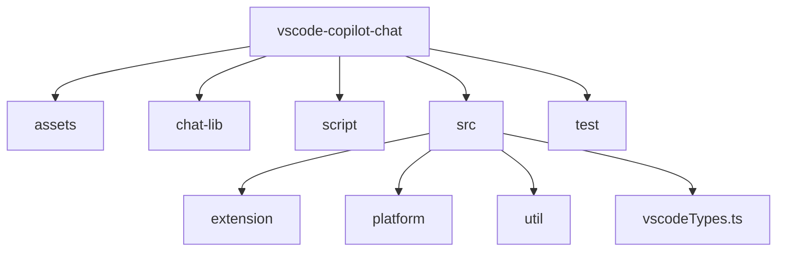
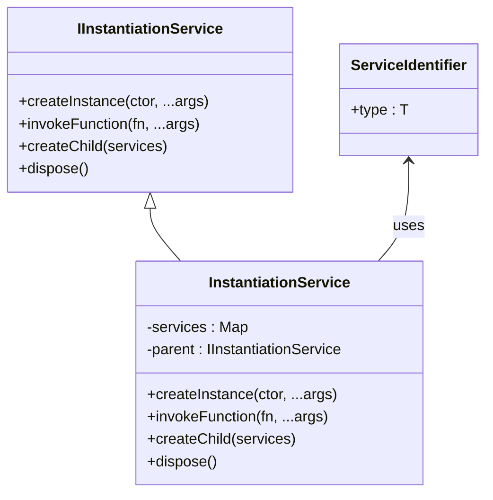
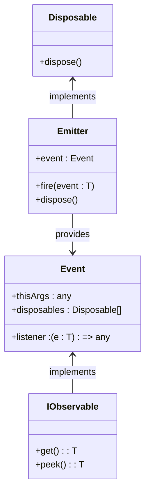
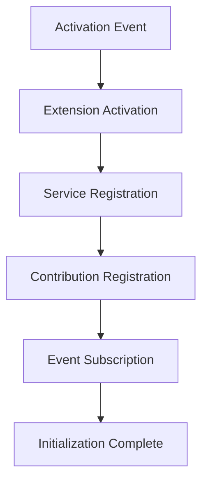
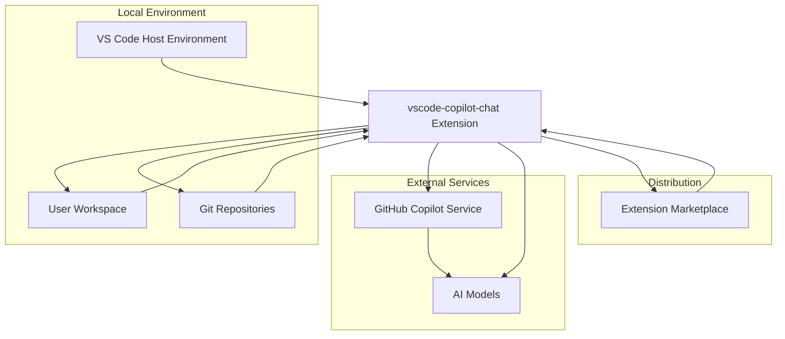

# Architecture and Design

<cite>
**Referenced Files in This Document**   
- [package.json](file://package.json)
- [README.md](file://README.md)
- [src/lib/node/chatLibMain.ts](file://src/lib/node/chatLibMain.ts)
- [src/extension/extension/vscode-node/extension.ts](file://src/extension/extension/vscode-node/extension.ts)
- [src/platform/extContext/common/extensionContext.ts](file://src/platform/extContext/common/extensionContext.ts)
- [src/util/common/services.ts](file://src/util/common/services.ts)
- [src/util/vs/platform/instantiation/common/instantiation.ts](file://src/util/vs/platform/instantiation/common/instantiation.ts)
- [src/util/vs/base/common/observableInternal/base.ts](file://src/util/vs/base/common/observableInternal/base.ts)
</cite>

## Table of Contents
1. [Introduction](#introduction)
2. [Project Structure](#project-structure)
3. [Extension Layer](#extension-layer)
4. [Platform Services](#platform-services)
5. [UI Components](#ui-components)
6. [Architectural Patterns](#architectural-patterns)
7. [Component Interactions](#component-interactions)
8. [Data Flows](#data-flows)
9. [Extension Activation and Lifecycle](#extension-activation-and-lifecycle)
10. [System Context](#system-context)
11. [Cross-Cutting Concerns](#cross-cutting-concerns)
12. [Technology Stack](#technology-stack)
13. [Scalability and Performance](#scalability-and-performance)

## Introduction

The GitHub Copilot Chat extension provides AI-powered programming assistance within Visual Studio Code, offering conversational AI capabilities, inline suggestions, and code generation features. This document details the architectural design of the extension, focusing on its modular structure, platform services, UI components, and the architectural patterns that enable its functionality.

The extension is designed as a companion to the GitHub Copilot inline suggestion feature, providing a comprehensive chat interface for code-related queries and AI-powered coding sessions. It leverages advanced AI models to assist developers with code generation, explanation, refactoring, and debugging tasks.

**Section sources**
- [README.md](file://README.md#L1-L84)

## Project Structure

The vscode-copilot-chat extension follows a well-organized directory structure that separates concerns and facilitates maintainability. The project is divided into several key directories:

- **assets/**: Contains static assets such as agent definitions and prompts
- **chat-lib/**: Houses shared library code for chat functionality
- **script/**: Contains build and utility scripts
- **src/**: The main source code directory with extension implementation
- **test/**: Contains test code and fixtures

The src directory is further organized into:
- **extension/**: Contains the extension-specific implementation
- **platform/**: Provides platform services and abstractions
- **util/**: Contains utility functions and shared infrastructure

This structure enables clear separation between extension logic, platform services, and utility components, supporting the modular architecture of the system.

**Diagram sources **
- [package.json](file://package.json#L1-L800)

## Extension Layer

The extension layer serves as the entry point and integration point with the Visual Studio Code host environment. It is responsible for activation, command registration, and UI integration.

The extension is activated based on specific activation events defined in package.json, including "onStartupFinished", "onLanguageModelChat:copilot", and "onUri". This ensures the extension loads when VS Code starts or when specific Copilot-related events occur.

The extension implementation is organized across multiple files based on the runtime environment:
- **vscode/**: Code that runs in the VS Code extension host
- **vscode-node/**: Code that runs in the Node.js extension host
- **vscode-worker/**: Code that runs in web worker environments

This separation allows the extension to leverage different runtime capabilities while maintaining a consistent API surface.

The extension layer uses a base activation pattern where common functionality is defined in baseActivate, with environment-specific implementations extending this base. This approach promotes code reuse while accommodating platform-specific requirements.

**Section sources**
- [package.json](file://package.json#L81-L88)
- [src/extension/extension/vscode-node/extension.ts](file://src/extension/extension/vscode-node/extension.ts#L1-L44)

## Platform Services

The platform services layer provides foundational capabilities that are consumed by the extension layer and other components. These services abstract away implementation details and provide a consistent interface for common operations.

Key platform services include:
- **Authentication**: Manages authentication with GitHub services
- **Configuration**: Handles configuration management and settings
- **Chat**: Provides chat-specific functionality and quota management
- **Endpoint**: Manages API endpoints and service discovery
- **Environment**: Abstracts environment-specific details
- **File System**: Provides file system operations
- **Git**: Integrates with Git repositories
- **Telemetry**: Handles telemetry and usage data collection

The platform services are designed with dependency injection in mind, using service identifiers to decouple components. Services are registered and resolved through an instantiation service, enabling loose coupling and testability.

The services follow a pattern where interfaces are defined in common directories, with implementations provided in environment-specific directories (e.g., node, vscode). This allows for platform-specific optimizations while maintaining a consistent API.

**Section sources**
- [src/platform/extContext/common/extensionContext.ts](file://src/platform/extContext/common/extensionContext.ts#L1-L14)
- [src/lib/node/chatLibMain.ts](file://src/lib/node/chatLibMain.ts#L57-L98)

## UI Components

The UI components of the Copilot Chat extension provide the user interface for interacting with AI-powered features. These components are integrated into the Visual Studio Code editor through various views and panels.

Key UI components include:
- **Chat View**: The primary interface for conversational AI interactions
- **Inline Chat**: Contextual chat interface within the editor
- **Agent Mode**: Autonomous coding session interface
- **Edit Mode**: Step-by-step coding experience interface
- **Participants**: Context providers that bring code from current files into conversations

The UI components leverage VS Code's proposed API extensions to provide advanced functionality. These include:
- **chatProvider**: Enables custom chat participants
- **chatEditing**: Supports edit operations in chat
- **interactive**: Facilitates interactive coding sessions
- **codeActionAI**: Integrates AI with code actions
- **inlineCompletionsAdditions**: Enhances inline completion capabilities

The UI components are designed to be context-aware, leveraging information from the current workspace, open files, and user preferences to provide relevant assistance. They support slash commands for specific tasks and variables for dynamic content insertion.

**Section sources**
- [package.json](file://package.json#L91-L139)
- [README.md](file://README.md#L34-L43)

## Architectural Patterns

The vscode-copilot-chat extension employs several architectural patterns to achieve its goals of modularity, maintainability, and extensibility.

### Modular Architecture

The extension follows a modular architecture with clear separation between components. The codebase is organized into distinct modules based on functionality and runtime environment. This modularity enables:
- Independent development and testing of components
- Easy extension with new features
- Environment-specific implementations
- Clear dependency management

The modular structure is evident in the directory organization, with separate directories for extension logic, platform services, and utilities. Each module has well-defined interfaces and responsibilities, promoting loose coupling.

### Dependency Injection via Instantiation Service

The extension uses a dependency injection pattern implemented through an instantiation service. This pattern is central to the architecture, enabling:
- Loose coupling between components
- Easy testing through dependency substitution
- Centralized service management
- Runtime service resolution

The instantiation service is implemented in the util/vs/platform/instantiation module and provides capabilities for:
- Service registration and resolution
- Instance creation with dependency injection
- Child service container creation
- Service lifecycle management

Services are identified using service identifiers created with the createDecorator function. Dependencies are declared using the @ syntax in class constructors, allowing the instantiation service to automatically resolve and inject required services.

**Diagram sources **
- [src/util/common/services.ts](file://src/util/common/services.ts#L29-L43)
- [src/util/vs/platform/instantiation/common/instantiation.ts](file://src/util/vs/platform/instantiation/common/instantiation.ts#L39-L133)

### Event-Driven Architecture

The extension employs an event-driven architecture for communication between components. This pattern enables:
- Loose coupling between publishers and subscribers
- Asynchronous processing
- Scalable component interactions
- Responsive user interfaces

Key event patterns used in the extension include:
- **Event<T>**: Represents a typed event that can be subscribed to
- **IObservable<T>**: Represents an observable value that notifies subscribers of changes
- **Emitter**: Facilitates event emission and subscription management

The event-driven architecture is used extensively for:
- UI updates in response to data changes
- Communication between extension components
- Integration with VS Code events
- Telemetry and logging

**Diagram sources **
- [src/util/vs/base/common/observableInternal/base.ts](file://src/util/vs/base/common/observableInternal/base.ts#L1-L35)
- [src/extension/typescriptContext/serverPlugin/fixtures/context/testbed/src/events.ts](file://src/extension/typescriptContext/serverPlugin/fixtures/context/testbed/src/events.ts#L1-L44)

### Adapter Pattern for Platform-Specific Implementations

The extension uses the adapter pattern to provide platform-specific implementations while maintaining a consistent interface. This pattern enables:
- Code reuse across different runtime environments
- Environment-specific optimizations
- Seamless integration with different VS Code extension hosts
- Abstraction of platform differences

The adapter pattern is implemented through:
- Common interfaces defined in shared directories
- Platform-specific implementations in environment-specific directories
- Service registration that selects appropriate implementations based on runtime
- Configuration-driven implementation selection

For example, the extension provides different implementations for:
- Node.js environment (vscode-node)
- Web worker environment (vscode-worker)
- General VS Code environment (vscode)

This approach allows the extension to leverage the capabilities of each runtime while maintaining a consistent API for consumers.

## Component Interactions

The components of the Copilot Chat extension interact through well-defined interfaces and patterns, enabling a cohesive system that integrates AI capabilities with the VS Code editor.

### Extension-Platform Service Interactions

The extension layer interacts with platform services through dependency injection. When a component requires a service, it declares the dependency in its constructor using the @ syntax. The instantiation service resolves these dependencies and injects the appropriate service instances.

For example, the NESProvider class in chatLibMain.ts depends on several services:
- IExperimentationService for feature experimentation
- IConfigurationService for configuration management
- IWorkspaceService for workspace operations
- IDiffService for diff operations

These dependencies are automatically resolved and injected by the instantiation service, enabling loose coupling between components.

### UI-Extension Interactions

The UI components interact with the extension layer through VS Code's extension API and proposed APIs. The extension registers chat participants, commands, and other contribution points that the UI can leverage.

Key interaction points include:
- Chat participants that provide context for conversations
- Slash commands that trigger specific actions
- Variables that insert dynamic content
- Edit operations that modify code directly

The UI components use these contribution points to provide a seamless experience, allowing users to access AI-powered features directly from the editor interface.

### Service-Service Interactions

Platform services interact with each other through their defined interfaces. For example:
- The authentication service provides tokens to the endpoint service
- The configuration service provides settings to other services
- The telemetry service collects data from various components
- The file system service provides file operations to context providers

These interactions are managed through the dependency injection system, ensuring that services can collaborate while remaining loosely coupled.

## Data Flows

The data flows in the Copilot Chat extension follow a structured pattern that moves from user interaction through processing to AI model interaction and back to the user interface.

### Chat Interface Data Flow

When a user interacts with the chat interface, data flows through the following components:

1. **User Input**: The user enters a query or command in the chat interface
2. **Intent Recognition**: The system determines the user's intent (e.g., explain code, generate code)
3. **Context Gathering**: Relevant context is gathered from the workspace, open files, and other sources
4. **Request Construction**: A request is constructed with the user's input and gathered context
5. **AI Model Request**: The request is sent to the AI model through the appropriate endpoint
6. **AI Model**: The AI model processes the request and generates a response
7. **Response Processing**: The response is processed, including citation extraction
8. **Citation Handling**: Source citations are handled appropriately
9. **Response Formatting**: The response is formatted for display
10. **UI Update**: The chat interface is updated with the response

**Diagram sources **
- [src/lib/node/chatLibMain.ts](file://src/lib/node/chatLibMain.ts#L56-L65)

### Context Provider Data Flow

Context providers gather relevant information from the workspace and make it available to the AI model:

1. **Workspace**: The context provider accesses the workspace through VS Code APIs
2. **Content Extraction**: Relevant content is extracted based on the user's query
3. **Content Filtering**: Content is filtered based on relevance and user preferences
4. **Content Formatting**: Content is formatted appropriately for the AI model
5. **Context Cache**: Processed context may be cached for performance
6. **Request Integration**: The context is integrated into the AI request

### AI Model Interaction Data Flow

The interaction with AI models follows a request-response pattern with additional considerations for streaming and error handling:

1. **Request Preparation**: The request is prepared with prompts, context, and parameters
2. **Authentication**: Authentication tokens are added to the request
3. **Endpoint Selection**: The appropriate endpoint is selected based on the request type
4. **Request Transmission**: The request is transmitted to the AI service
5. **Response Streaming**: Responses are streamed back as they become available
6. **Response Processing**: Streamed responses are processed and assembled
7. **Error Handling**: Errors are handled appropriately, with retries if necessary
8. **Result Delivery**: The final result is delivered to the requesting component

## Extension Activation and Lifecycle

The extension activation process follows a structured lifecycle that ensures proper initialization and integration with the VS Code environment.

### Activation Process

The activation process begins when one of the activation events specified in package.json occurs:

1. **Activation Event**: The extension is activated by an event such as "onStartupFinished" or "onLanguageModelChat:copilot"
2. **Extension Activation**: The activate function in extension.ts is called
3. **Service Registration**: Platform services are registered with the instantiation service
4. **Contribution Registration**: The extension registers its contributions (commands, chat participants, etc.)
5. **Event Subscription**: The extension subscribes to relevant VS Code events
6. **Initialization Complete**: The extension is ready to handle user interactions

The activation process uses a base activation pattern where common functionality is defined in baseActivate, with environment-specific implementations extending this base. This ensures consistent initialization across different runtime environments.

### Lifecycle Management

The extension manages its lifecycle through proper disposal of resources and handling of deactivation:

- **Resource Management**: Services and components implement IDisposable to ensure proper cleanup
- **Event Unsubscription**: Event listeners are properly disposed to prevent memory leaks
- **State Persistence**: Important state is persisted across sessions
- **Graceful Deactivation**: The extension handles deactivation events appropriately

The instantiation service plays a key role in lifecycle management by tracking created instances and ensuring they are properly disposed when the service itself is disposed.

**Section sources**
- [src/extension/extension/vscode-node/extension.ts](file://src/extension/extension/vscode-node/extension.ts#L35-L43)

## System Context

The Copilot Chat extension operates within the Visual Studio Code ecosystem, integrating with the editor and external AI services.

The extension interacts with several key components:
- **VS Code Host Environment**: Provides the editor interface, APIs, and runtime
- **GitHub Copilot Service**: Authenticates users and manages subscriptions
- **AI Models**: Processes requests and generates responses
- **User Workspace**: Source of code and context for AI interactions
- **Git Repositories**: Source of version control information
- **Extension Marketplace**: Distribution channel for the extension

This system context enables the extension to provide AI-powered coding assistance that is deeply integrated with the development environment.

**Diagram sources **
- [package.json](file://package.json#L1-L800)
- [README.md](file://README.md#L1-L84)

## Cross-Cutting Concerns

The extension addresses several cross-cutting concerns that affect multiple components and aspects of the system.

### Configuration Management

Configuration management is handled through VS Code's settings system with extension-specific settings:

- **User Preferences**: Customizable settings for behavior and appearance
- **Feature Flags**: Experimental features controlled by configuration
- **Model Parameters**: AI model parameters like temperature and topP
- **Privacy Settings**: Controls for data sharing and telemetry

The configuration service provides a unified interface for accessing settings, with support for default values and workspace-specific overrides.

### Telemetry

Telemetry is implemented to collect usage data and improve the product:

- **Usage Analytics**: Tracks feature usage and user interactions
- **Performance Monitoring**: Measures response times and resource usage
- **Error Reporting**: Collects information about errors and crashes
- **A/B Testing**: Supports experimentation with different features

Telemetry data is collected in accordance with privacy policies and respects user preferences for data sharing.

### Error Handling

The extension implements comprehensive error handling to ensure reliability:

- **Graceful Degradation**: Features fail gracefully when services are unavailable
- **User-Friendly Messages**: Errors are presented in a way that helps users understand and resolve issues
- **Retry Mechanisms**: Transient failures are handled with appropriate retry logic
- **Fallback Strategies**: Alternative approaches are used when primary methods fail

Error handling is implemented at multiple levels, from network requests to UI interactions, ensuring a robust user experience.

**Section sources**
- [package.json](file://package.json#L141-L772)
- [README.md](file://README.md#L71-L73)

## Technology Stack

The Copilot Chat extension is built using a modern technology stack that leverages TypeScript, Node.js, and VS Code's extension APIs.

### Core Technologies

- **TypeScript**: Primary programming language for type safety and developer productivity
- **Node.js**: Runtime environment for server-side components
- **VS Code Extension API**: Integration with the Visual Studio Code editor
- **Proposed APIs**: Access to experimental VS Code features

### Key Dependencies

- **vscode-languageserver-protocol**: For language server protocol integration
- **source-map-support**: For debugging with source maps
- **dotenv**: For environment variable management
- **Vitest**: For testing

The extension also depends on internal libraries and services provided by Microsoft and GitHub for AI capabilities, authentication, and telemetry.

### Version Compatibility

The extension maintains compatibility with specific versions of VS Code and Node.js:

- **VS Code**: Requires version ^1.107.0-20251119
- **Node.js**: Requires version >=22.14.0
- **npm**: Requires version >=9.0.0

The extension releases in lockstep with VS Code due to its deep UI integration, ensuring compatibility with the latest editor features.

**Section sources**
- [package.json](file://package.json#L26-L28)
- [README.md](file://README.md#L48-L52)

## Scalability and Performance

The extension is designed with scalability and performance considerations to handle AI-powered features efficiently.

### Scalability Considerations

- **Modular Architecture**: Enables independent scaling of components
- **Service Abstraction**: Allows for replacement of implementations with more scalable alternatives
- **Caching**: Implements caching at multiple levels to reduce redundant operations
- **Asynchronous Processing**: Uses async/await and promises to avoid blocking the UI

### Performance Optimization

- **Lazy Initialization**: Services and components are initialized on demand
- **Efficient Data Structures**: Uses appropriate data structures for performance-critical operations
- **Batching**: Combines multiple operations when possible to reduce overhead
- **Streaming**: Implements streaming for large responses to provide immediate feedback

### AI-Powered Feature Optimization

Specific optimizations for AI-powered features include:
- **Context Management**: Efficiently gathers and processes relevant context
- **Request Optimization**: Constructs optimal requests to minimize latency
- **Response Processing**: Efficiently processes and displays AI responses
- **Citation Handling**: Manages source citations without impacting performance

These considerations ensure that the extension provides responsive and reliable AI-powered assistance, even with complex queries and large codebases.

**Section sources**
- [README.md](file://README.md#L50-L52)
- [src/lib/node/chatLibMain.ts](file://src/lib/node/chatLibMain.ts#L335-L370)