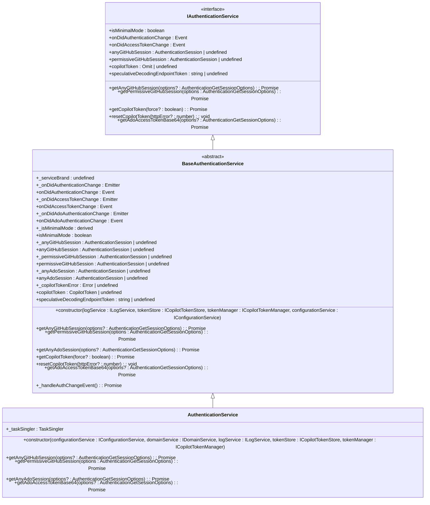
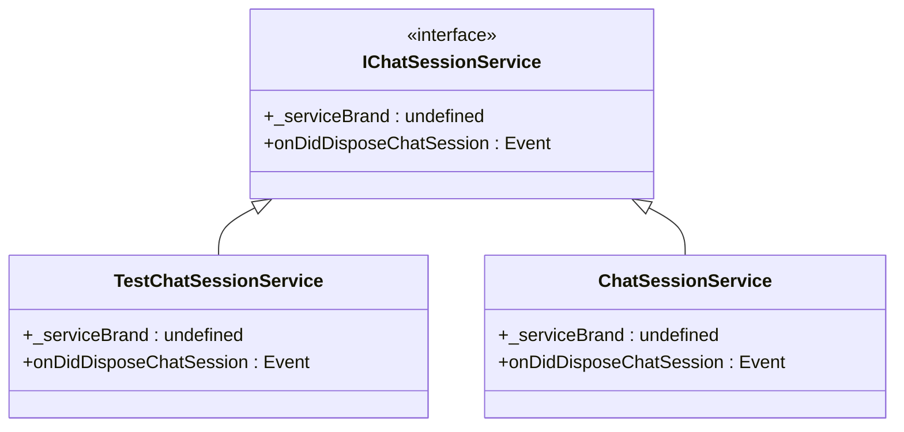

# Adapter Interfaces

<cite>
**Referenced Files in This Document**   
- [authentication.ts](file://src/platform/authentication/common/authentication.ts)
- [chatSessionService.ts](file://src/platform/chat/common/chatSessionService.ts)
- [fileSystemService.ts](file://src/platform/filesystem/common/fileSystemService.ts)
- [authenticationService.ts](file://src/platform/authentication/vscode-node/authenticationService.ts)
- [NodeFileSystemService.ts](file://src/platform/filesystem/node/fileSystemServiceImpl.ts)
- [VSCodeFileSystemService.ts](file://src/platform/filesystem/vscode/fileSystemServiceImpl.ts)
- [chatSessionService.ts](file://src/platform/chat/vscode/chatSessionService.ts)
- [testChatSessionService.ts](file://src/platform/chat/test/common/testChatSessionService.ts)
</cite>

## Table of Contents
1. [Introduction](#introduction)
2. [Core Adapter Interfaces](#core-adapter-interfaces)
3. [Authentication Service Interface](#authentication-service-interface)
4. [Chat Session Service Interface](#chat-session-service-interface)
5. [File System Service Interface](#file-system-service-interface)
6. [Interface Design Principles](#interface-design-principles)
7. [Implementation Patterns](#implementation-patterns)
8. [Best Practices for Interface Design](#best-practices-for-interface-design)
9. [Conclusion](#conclusion)

## Introduction
This document provides a comprehensive analysis of the adapter interfaces in the codebase that define contracts for platform-specific implementations. These interfaces serve as abstraction layers that separate shared business logic from platform-specific behaviors, enabling consistent APIs across different execution environments. The document examines key interfaces such as IAuthenticationService, IChatSessionService, and IFileSystemService, detailing their methods, properties, and event signatures. It also explores the design principles behind interface segregation and dependency inversion used throughout the codebase, along with best practices for maintaining type safety and code consistency.

## Core Adapter Interfaces

The codebase employs a robust adapter pattern through service interfaces that abstract platform-specific implementations. These interfaces are defined in common modules and implemented in platform-specific directories (node, vscode, etc.). The design follows dependency inversion principles, where high-level modules depend on abstractions rather than concrete implementations. This approach enables the same business logic to work across different platforms (Node.js, VS Code, etc.) by injecting the appropriate implementation at runtime.

**Section sources**
- [authentication.ts](file://src/platform/authentication/common/authentication.ts)
- [chatSessionService.ts](file://src/platform/chat/common/chatSessionService.ts)
- [fileSystemService.ts](file://src/platform/filesystem/common/fileSystemService.ts)

## Authentication Service Interface

The IAuthenticationService interface defines the contract for authentication operations across platforms. It provides methods for managing GitHub and Azure DevOps sessions, handling Copilot tokens, and responding to authentication state changes. The interface includes both synchronous properties for checking current authentication state and asynchronous methods for retrieving sessions and tokens.

Key methods include:
- `getAnyGitHubSession`: Retrieves a GitHub session with minimal required scopes
- `getPermissiveGitHubSession`: Retrieves a GitHub session with extended permissions
- `getCopilotToken`: Returns a valid Copilot token, refreshing if necessary
- `resetCopilotToken`: Invalidates the current Copilot token

The interface also exposes events like `onDidAuthenticationChange` to notify consumers of authentication state changes, enabling reactive programming patterns.



**Diagram sources**
- [authentication.ts](file://src/platform/authentication/common/authentication.ts)
- [authenticationService.ts](file://src/platform/authentication/vscode-node/authenticationService.ts)

**Section sources**
- [authentication.ts](file://src/platform/authentication/common/authentication.ts)
- [authenticationService.ts](file://src/platform/authentication/vscode-node/authenticationService.ts)

## Chat Session Service Interface

The IChatSessionService interface provides a minimal contract for managing chat sessions across platforms. It primarily exposes an event that fires when a chat session is disposed, allowing components to react to session lifecycle changes. This interface demonstrates the principle of interface segregation by defining only the essential methods needed for chat session management.

The implementation in VS Code delegates to the VS Code API's `onDidDisposeChatSession` event, while test implementations can provide mock behavior. This abstraction allows the same business logic to work with different chat session providers without modification.



**Diagram sources**
- [chatSessionService.ts](file://src/platform/chat/common/chatSessionService.ts)
- [testChatSessionService.ts](file://src/platform/chat/test/common/testChatSessionService.ts)
- [chatSessionService.ts](file://src/platform/chat/vscode/chatSessionService.ts)

**Section sources**
- [chatSessionService.ts](file://src/platform/chat/common/chatSessionService.ts)
- [testChatSessionService.ts](file://src/platform/chat/test/common/testChatSessionService.ts)
- [chatSessionService.ts](file://src/platform/chat/vscode/chatSessionService.ts)

## File System Service Interface

The IFileSystemService interface defines a comprehensive contract for file system operations across platforms. It extends the VS Code FileSystem interface while adding platform-specific methods and constraints. The interface includes methods for basic file operations (read, write, delete, rename), directory operations, and file system watching.

Key features include:
- File size limits with the `FS_READ_MAX_FILE_SIZE` constant
- Caching utilities for JSON file reading
- Support for both Node.js and VS Code file system APIs
- Platform-specific implementations that handle URI schemes appropriately

The interface demonstrates proper error handling with the `assertReadFileSizeLimit` function that enforces file size constraints and provides appropriate warnings or errors.

```mermaid
classDiagram
class IFileSystemService {
<<interface>>
+_serviceBrand : undefined
+stat(uri : Uri) : Promise<FileStat>
+readDirectory(uri : Uri) : Promise<[string, FileType][]>
+createDirectory(uri : Uri) : Promise<void>
+readFile(uri : Uri, disableLimit? : boolean) : Promise<Uint8Array>
+writeFile(uri : Uri, content : Uint8Array) : Promise<void>
+delete(uri : Uri, options? : { recursive? : boolean; useTrash? : boolean }) : Promise<void>
+rename(oldURI : Uri, newURI : Uri, options? : { overwrite? : boolean }) : Promise<void>
+copy(source : Uri, destination : Uri, options? : { overwrite? : boolean }) : Promise<void>
+isWritableFileSystem(scheme : string) : boolean | undefined
+createFileSystemWatcher(glob : string | RelativePattern) : FileSystemWatcher
}
class NodeFileSystemService {
+_serviceBrand : undefined
+stat(uri : URI) : Promise<FileStat>
+readDirectory(uri : URI) : Promise<[string, FileType][]>
+createDirectory(uri : URI) : Promise<void>
+readFile(uri : URI, disableLimit? : boolean) : Promise<Uint8Array>
+writeFile(uri : URI, content : Uint8Array) : Promise<void>
+delete(uri : URI, options? : { recursive? : boolean; useTrash? : boolean }) : Promise<void>
+rename(oldURI : URI, newURI : URI, options? : { overwrite? : boolean }) : Promise<void>
+copy(source : URI, destination : URI, options? : { overwrite? : boolean }) : Promise<void>
+isWritableFileSystem(scheme : string) : boolean | undefined
+createFileSystemWatcher(glob : string | RelativePattern) : FileSystemWatcher
}
class VSCodeFileSystemService {
+_serviceBrand : undefined
+stat(uri : URI) : Promise<vscode.FileStat>
+readDirectory(uri : URI) : Promise<[string, FileType][]>
+createDirectory(uri : URI) : Promise<void>
+readFile(uri : URI, disableLimit? : boolean) : Promise<Uint8Array>
+writeFile(uri : URI, content : Uint8Array) : Promise<void>
+delete(uri : URI, options? : { recursive? : boolean; useTrash? : boolean }) : Promise<void>
+rename(oldURI : URI, newURI : URI, options? : { overwrite? : boolean }) : Promise<void>
+copy(source : URI, destination : URI, options? : { overwrite? : boolean }) : Promise<void>
+isWritableFileSystem(scheme : string) : boolean
+createFileSystemWatcher(glob : string | vscode.RelativePattern) : vscode.FileSystemWatcher
}
IFileSystemService <|-- NodeFileSystemService
IFileSystemService <|-- VSCodeFileSystemService
```

**Diagram sources**
- [fileSystemService.ts](file://src/platform/filesystem/common/fileSystemService.ts)
- [NodeFileSystemService.ts](file://src/platform/filesystem/node/fileSystemServiceImpl.ts)
- [VSCodeFileSystemService.ts](file://src/platform/filesystem/vscode/fileSystemServiceImpl.ts)

**Section sources**
- [fileSystemService.ts](file://src/platform/filesystem/common/fileSystemService.ts)
- [NodeFileSystemService.ts](file://src/platform/filesystem/node/fileSystemServiceImpl.ts)
- [VSCodeFileSystemService.ts](file://src/platform/filesystem/vscode/fileSystemServiceImpl.ts)

## Interface Design Principles

The codebase follows several key design principles in its interface architecture:

### Interface Segregation
Interfaces are kept focused and minimal, containing only the methods and properties necessary for their specific purpose. For example, IChatSessionService exposes only the `onDidDisposeChatSession` event, avoiding unnecessary bloat.

### Dependency Inversion
High-level modules depend on abstractions (interfaces) rather than concrete implementations. This is achieved through dependency injection, where implementations are provided at runtime based on the execution environment.

### Single Responsibility
Each interface has a clear, well-defined responsibility. IAuthenticationService handles authentication, IChatSessionService manages chat session lifecycle, and IFileSystemService provides file operations.

### Backward Compatibility
Interfaces are designed with backward compatibility in mind. Deprecated methods are marked with comments rather than removed, allowing gradual migration of dependent code.

### Type Safety
The TypeScript implementation ensures type safety across the interface boundaries, preventing common runtime errors and enabling better tooling support.

## Implementation Patterns

The codebase employs several consistent patterns for implementing adapter interfaces:

### Common Interface Definitions
Interfaces are defined in common directories (e.g., `common/`) and imported by platform-specific implementations. This ensures consistency across different platforms.

### Abstract Base Classes
For interfaces with shared functionality, abstract base classes (like BaseAuthenticationService) provide common implementations while leaving platform-specific methods abstract.

### Service Identifiers
The `createServiceIdentifier` function creates unique identifiers for services, enabling dependency injection and service location patterns.

### Platform-Specific Implementations
Implementations are organized by platform (node, vscode, etc.) with clear separation between common abstractions and platform-specific details.

### Testing Support
Test implementations (like TestChatSessionService) provide mock behavior for unit testing, allowing components to be tested in isolation.

## Best Practices for Interface Design

Based on the analysis of the codebase, here are recommended best practices for designing and maintaining adapter interfaces:

### Versioning Strategy
When evolving interfaces, consider creating new interface versions rather than modifying existing ones. This maintains backward compatibility for existing consumers.

### Error Handling
Define clear error handling contracts in interfaces, specifying which methods can throw exceptions and under what conditions.

### Documentation
Provide comprehensive JSDoc comments for all interface members, explaining their purpose, parameters, return values, and potential side effects.

### Extensibility
Design interfaces with extensibility in mind, using optional parameters and configuration objects to accommodate future requirements.

### Performance Considerations
Document performance characteristics of interface methods, especially those that may involve network calls or file I/O operations.

### Testing
Provide test implementations for all interfaces to facilitate unit testing of components that depend on them.

### Consistency
Maintain consistent naming conventions and method signatures across related interfaces to improve developer experience.

## Conclusion
The adapter interfaces in this codebase demonstrate a well-structured approach to abstracting platform-specific implementations behind consistent contracts. By following principles of interface segregation, dependency inversion, and single responsibility, the codebase achieves a high degree of flexibility and maintainability. The clear separation between common abstractions and platform-specific implementations enables the same business logic to work across different execution environments while maintaining type safety and code consistency. These design patterns serve as a strong foundation for building extensible, testable, and maintainable software systems.