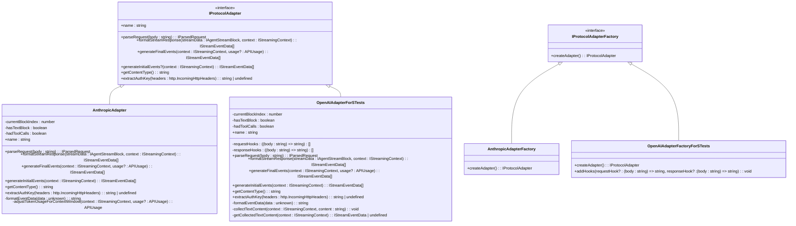
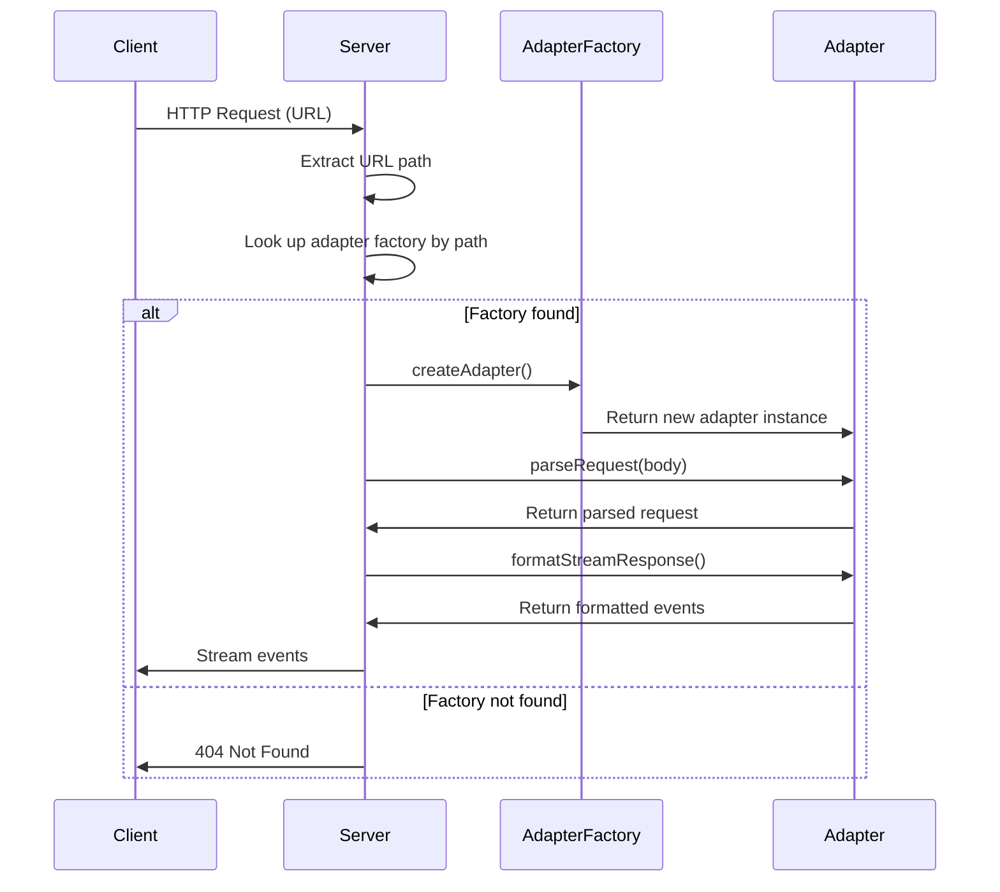

# Adapter Pattern

<cite>
**Referenced Files in This Document**   
- [types.ts](file://src/extension/agents/node/adapters/types.ts)
- [anthropicAdapter.ts](file://src/extension/agents/node/adapters/anthropicAdapter.ts)
- [openaiAdapterForSTests.ts](file://src/extension/agents/node/adapters/openaiAdapterForSTests.ts)
- [langModelServer.ts](file://src/extension/agents/node/langModelServer.ts)
</cite>

## Table of Contents
1. [Introduction](#introduction)
2. [Adapter Pattern Implementation](#adapter-pattern-implementation)
3. [Core Components](#core-components)
4. [Adapter Registration and Resolution](#adapter-registration-and-resolution)
5. [Usage Examples](#usage-examples)
6. [Common Issues and Troubleshooting](#common-issues-and-troubleshooting)
7. [Best Practices](#best-practices)
8. [Conclusion](#conclusion)

## Introduction
The adapter pattern in this codebase enables platform-specific code execution while maintaining a consistent API across different environments. This documentation details how the codebase separates shared business logic from platform-specific implementations, focusing on the adapter interfaces and their implementations for various environments such as node and vscode. The system allows for flexible integration of different protocol adapters, ensuring that the correct implementation is used based on the environment and request context.

## Adapter Pattern Implementation
The adapter pattern is implemented through a set of interfaces and classes that abstract the differences between various protocol implementations. The core of this pattern is defined in the `IProtocolAdapter` interface, which specifies the methods that all adapters must implement. This interface includes methods for parsing requests, formatting stream responses, generating final events, and extracting authentication keys. Each adapter implementation, such as `AnthropicAdapter` and `OpenAIAdapterForSTests`, provides specific functionality tailored to its respective protocol while adhering to the common interface. This design allows the system to handle multiple protocols seamlessly, with each adapter encapsulating the unique aspects of its protocol.

**Section sources**
- [types.ts](file://src/extension/agents/node/adapters/types.ts#L37-L75)
- [anthropicAdapter.ts](file://src/extension/agents/node/adapters/anthropicAdapter.ts#L21-L307)
- [openaiAdapterForSTests.ts](file://src/extension/agents/node/adapters/openaiAdapterForSTests.ts#L32-L368)

## Core Components
The core components of the adapter pattern include the `IProtocolAdapter` interface, the `IProtocolAdapterFactory` interface, and the concrete adapter implementations. The `IProtocolAdapter` interface defines the contract for all adapters, ensuring a consistent API across different implementations. The `IProtocolAdapterFactory` interface provides a way to create instances of adapters, allowing for dynamic instantiation based on the request context. Concrete adapters like `AnthropicAdapter` and `OpenAIAdapterForSTests` implement these interfaces, providing specific logic for handling requests and responses according to their respective protocols. These components work together to enable the system to support multiple protocols without tightly coupling the core logic to any single implementation.

**Diagram sources **
- [types.ts](file://src/extension/agents/node/adapters/types.ts#L37-L75)
- [anthropicAdapter.ts](file://src/extension/agents/node/adapters/anthropicAdapter.ts#L15-L307)
- [openaiAdapterForSTests.ts](file://src/extension/agents/node/adapters/openaiAdapterForSTests.ts#L16-L368)

**Section sources**
- [types.ts](file://src/extension/agents/node/adapters/types.ts#L37-L82)
- [anthropicAdapter.ts](file://src/extension/agents/node/adapters/anthropicAdapter.ts#L15-L307)
- [openaiAdapterForSTests.ts](file://src/extension/agents/node/adapters/openaiAdapterForSTests.ts#L16-L368)

## Adapter Registration and Resolution
Adapters are registered and resolved through a map of adapter factories in the `langModelServer.ts` file. The server maintains a `Map<string, IProtocolAdapterFactory>` where the key is the URL path and the value is the corresponding adapter factory. When a request is received, the server determines the appropriate adapter factory by matching the request URL against the registered paths. For example, the `/v1/messages` path is associated with the `AnthropicAdapterFactory`, while the `/chat/completions` path is associated with the `OpenAIAdapterFactoryForSTests`. This registration mechanism allows the system to dynamically select the correct adapter based on the incoming request, ensuring that the appropriate protocol handling logic is applied.

**Diagram sources **
- [langModelServer.ts](file://src/extension/agents/node/langModelServer.ts#L37-L118)

**Section sources**
- [langModelServer.ts](file://src/extension/agents/node/langModelServer.ts#L37-L118)

## Usage Examples
The adapter pattern is used to handle different protocol requests in a uniform manner. For instance, when a request is made to the `/v1/messages` endpoint, the `AnthropicAdapterFactory` creates an instance of `AnthropicAdapter`, which then processes the request according to the Anthropic protocol. Similarly, requests to the `/chat/completions` endpoint are handled by the `OpenAIAdapterForSTests`, which processes them according to the OpenAI protocol. This approach allows the system to support multiple protocols without requiring changes to the core request handling logic. The adapters ensure that the response format is consistent regardless of the underlying protocol, providing a seamless experience for clients.

**Section sources**
- [anthropicAdapter.ts](file://src/extension/agents/node/adapters/anthropicAdapter.ts#L29-L75)
- [openaiAdapterForSTests.ts](file://src/extension/agents/node/adapters/openaiAdapterForSTests.ts#L43-L107)

## Common Issues and Troubleshooting
Common issues with the adapter pattern implementation include adapter not found errors, platform detection problems, and maintaining API consistency across adapters. Adapter not found errors occur when a request is made to a URL path that does not have a corresponding adapter factory registered. Platform detection problems can arise if the environment is not correctly identified, leading to the wrong adapter being used. Maintaining API consistency across adapters requires careful design to ensure that all adapters provide the same interface and behavior, even when handling different protocols. Troubleshooting these issues involves verifying the registration of adapter factories, checking the request URL paths, and ensuring that the adapter implementations adhere to the defined interfaces.

**Section sources**
- [langModelServer.ts](file://src/extension/agents/node/langModelServer.ts#L64-L118)
- [types.ts](file://src/extension/agents/node/adapters/types.ts#L37-L75)

## Best Practices
Best practices for creating new adapters and ensuring backward compatibility include adhering to the `IProtocolAdapter` interface, thoroughly testing adapter implementations, and documenting any deviations from the standard behavior. When modifying adapter interfaces, it is important to maintain backward compatibility by adding new methods or parameters rather than changing existing ones. New adapters should be tested against a variety of request scenarios to ensure they handle edge cases correctly. Additionally, adapter implementations should be kept as simple as possible, with complex logic delegated to separate services or utilities. This approach makes it easier to maintain and extend the adapter system over time.

**Section sources**
- [types.ts](file://src/extension/agents/node/adapters/types.ts#L37-L75)
- [anthropicAdapter.ts](file://src/extension/agents/node/adapters/anthropicAdapter.ts#L21-L307)
- [openaiAdapterForSTests.ts](file://src/extension/agents/node/adapters/openaiAdapterForSTests.ts#L32-L368)

## Conclusion
The adapter pattern in this codebase provides a flexible and extensible way to handle multiple protocols while maintaining a consistent API. By separating shared business logic from platform-specific implementations, the system can support various protocols without tightly coupling the core logic to any single implementation. The use of adapter factories and a registration mechanism allows for dynamic selection of the appropriate adapter based on the request context, ensuring that the correct protocol handling logic is applied. This design promotes maintainability and scalability, making it easier to add new protocols and adapt to changing requirements.