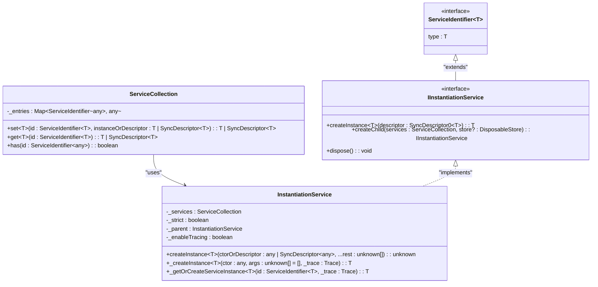
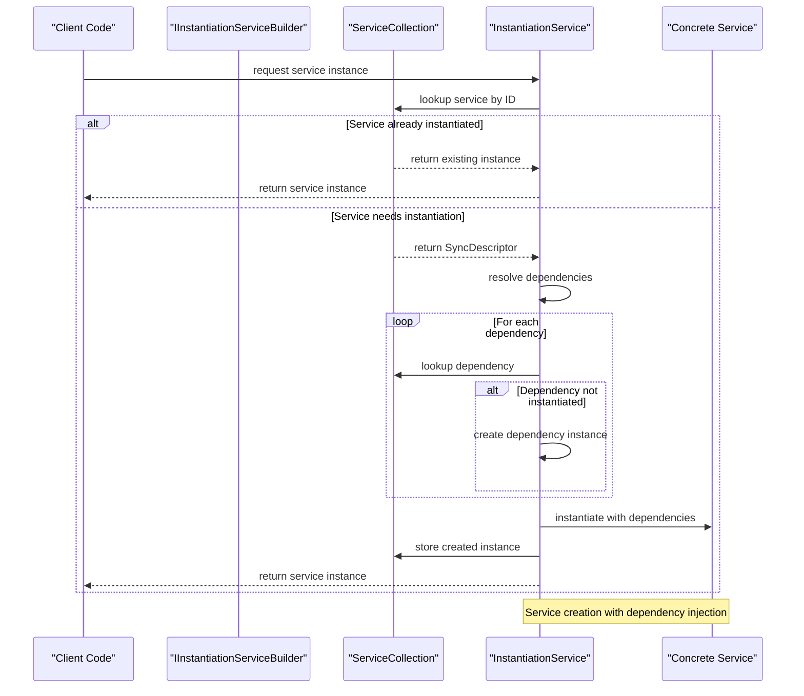
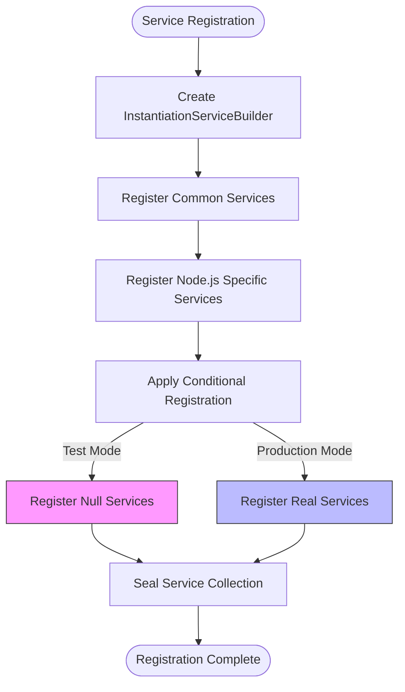
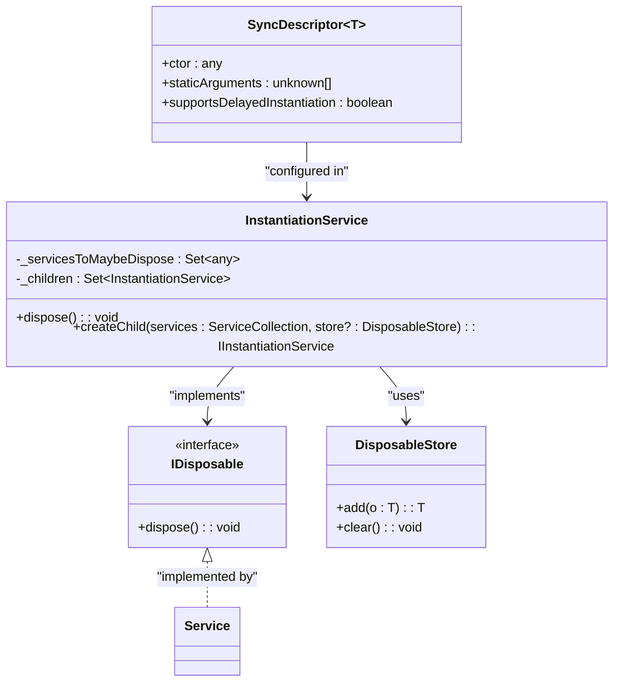
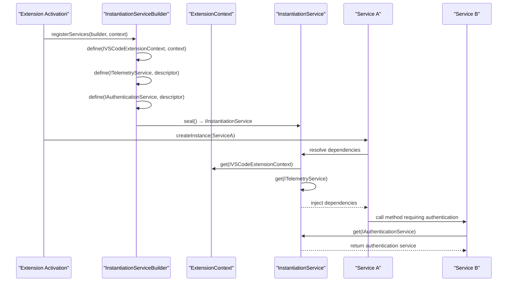
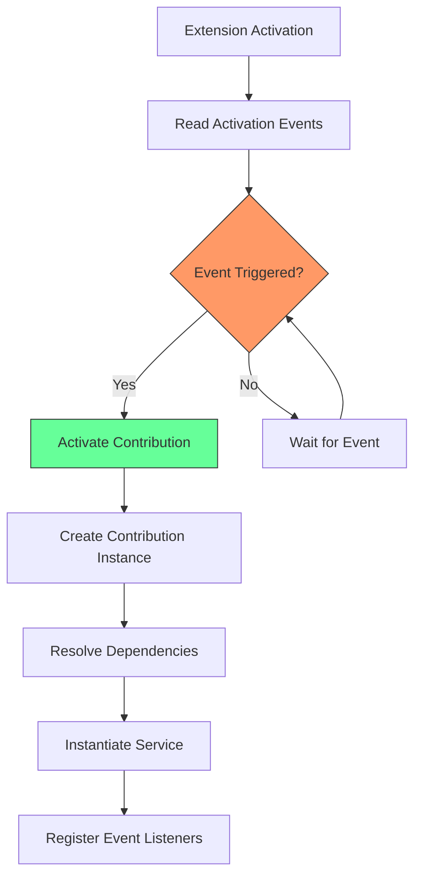
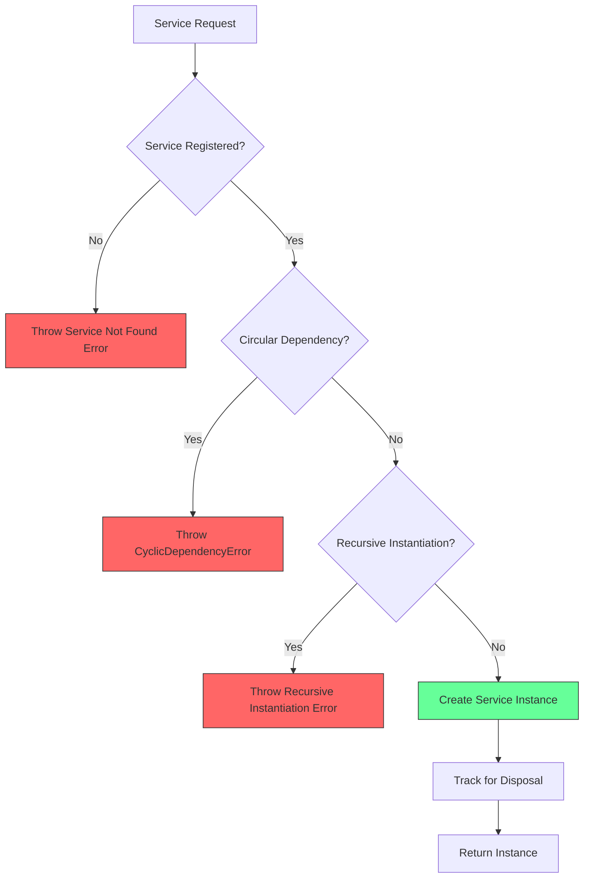

# Adapter Resolution

<cite>
**Referenced Files in This Document**   
- [instantiation.ts](file://src/util/vs/platform/instantiation/common/instantiation.ts)
- [instantiationService.ts](file://src/util/vs/platform/instantiation/common/instantiationService.ts)
- [serviceCollection.ts](file://src/util/vs/platform/instantiation/common/serviceCollection.ts)
- [descriptors.ts](file://src/util/vs/platform/instantiation/common/descriptors.ts)
- [services.ts](file://src/extension/extension/vscode-node/services.ts)
- [services.ts](file://src/extension/extension/vscode/services.ts)
- [extensionContext.ts](file://src/platform/extContext/common/extensionContext.ts)
- [telemetry.ts](file://src/platform/telemetry/common/telemetry.ts)
- [nullTelemetryService.ts](file://src/platform/telemetry/common/nullTelemetryService.ts)
- [telemetryServiceImpl.ts](file://src/platform/telemetry/vscode-node/telemetryServiceImpl.ts)
- [authentication.ts](file://src/platform/authentication/common/authentication.ts)
- [authenticationService.ts](file://src/platform/authentication/vscode-node/authenticationService.ts)
- [extension.ts](file://src/extension/extension/vscode/extension.ts)
- [contributions.ts](file://src/extension/common/contributions.ts)
</cite>

## Table of Contents
1. [Introduction](#introduction)
2. [Dependency Injection and Service Registry](#dependency-injection-and-service-registry)
3. [Adapter Resolution Mechanism](#adapter-resolution-mechanism)
4. [Service Registration Process](#service-registration-process)
5. [Instantiation Patterns and Lifecycle Management](#instantiation-patterns-and-lifecycle-management)
6. [ExtensionContext and InstantiationService Coordination](#extensioncontext-and-instantiationservice-coordination)
7. [Contribution Points and Activation Events](#contribution-points-and-activation-events)
8. [Common Issues and Error Handling](#common-issues-and-error-handling)
9. [Best Practices for Service Registration](#best-practices-for-service-registration)
10. [Conclusion](#conclusion)

## Introduction
The adapter resolution mechanism in the VS Code Copilot extension provides a sophisticated dependency injection system that selects and instantiates platform-specific implementations based on the runtime environment. This document details how the service registry and dependency injection work together to provide the correct adapters for services like ITelemetryService and IAuthenticationService. The system uses a hierarchical service container approach with service decorators to declare dependencies, enabling a clean separation between interface definitions and their concrete implementations. The mechanism supports both eager and lazy instantiation patterns, with proper lifecycle management to ensure resources are disposed of correctly. This architecture allows the extension to provide different implementations for various environments (production, testing, development) while maintaining a consistent interface for consumers.

**Section sources**
- [instantiation.ts](file://src/util/vs/platform/instantiation/common/instantiation.ts#L1-L134)
- [instantiationService.ts](file://src/util/vs/platform/instantiation/common/instantiationService.ts#L1-L485)

## Dependency Injection and Service Registry
The dependency injection system is built around a service registry that maps service identifiers to their implementations. Service identifiers are created using the `createDecorator` function, which generates unique identifiers for each service interface. The registry stores these mappings in a `ServiceCollection`, which is essentially a map from service identifiers to either concrete instances or `SyncDescriptor` objects that describe how to instantiate a service. The `InstantiationService` acts as the central service locator, resolving dependencies by looking up service identifiers in the registry and creating instances as needed. When a service is requested, the instantiation service checks if an instance already exists, and if not, it creates one using the constructor parameters and any dependencies declared with service decorators. The system supports hierarchical service containers through the `createChild` method, allowing child containers to inherit services from their parent while overriding specific implementations.

**Diagram sources **
- [instantiation.ts](file://src/util/vs/platform/instantiation/common/instantiation.ts#L94-L97)
- [serviceCollection.ts](file://src/util/vs/platform/instantiation/common/serviceCollection.ts#L11-L35)
- [instantiationService.ts](file://src/util/vs/platform/instantiation/common/instantiationService.ts#L30-L485)

**Section sources**
- [instantiation.ts](file://src/util/vs/platform/instantiation/common/instantiation.ts#L90-L134)
- [serviceCollection.ts](file://src/util/vs/platform/instantiation/common/serviceCollection.ts#L1-L35)
- [instantiationService.ts](file://src/util/vs/platform/instantiation/common/instantiationService.ts#L30-L485)

## Adapter Resolution Mechanism
The adapter resolution mechanism selects the appropriate platform-specific implementation based on the runtime environment by registering different service implementations conditionally. During service registration, the system evaluates the current environment (such as production, testing, or development mode) and registers the corresponding implementation for each service interface. For example, the telemetry service is registered with a `NullTelemetryService` in test mode to prevent actual telemetry from being sent, while in production mode, it uses the full `TelemetryService` implementation. This conditional registration is achieved through functions like `setupTelemetry` that check the extension mode and register the appropriate service descriptor. The resolution process occurs when a service is first requested, with the instantiation service creating an instance based on the registered descriptor. The system also supports delayed instantiation through the `supportsDelayedInstantiation` flag in `SyncDescriptor`, allowing services to be instantiated only when actually needed rather than at registration time.

**Diagram sources **
- [instantiationService.ts](file://src/util/vs/platform/instantiation/common/instantiationService.ts#L125-L299)
- [services.ts](file://src/extension/extension/vscode-node/services.ts#L218-L235)

**Section sources**
- [instantiationService.ts](file://src/util/vs/platform/instantiation/common/instantiationService.ts#L125-L299)
- [services.ts](file://src/extension/extension/vscode-node/services.ts#L209-L235)

## Service Registration Process
The service registration process begins with the creation of an `InstantiationServiceBuilder` that collects service definitions before sealing them into a final `InstantiationService`. Services are registered using the `define` method, which takes a service identifier and either a concrete instance or a `SyncDescriptor` that describes how to instantiate the service. The registration process is hierarchical, with common services registered first in the base `registerServices` function, followed by platform-specific services in the node.js extension host. Conditional registration is used to provide different implementations based on the runtime environment, such as using `NullTelemetryService` during testing and the full `TelemetryService` in production. The registration process also handles dependencies between services, ensuring that services are instantiated in the correct order, with dependencies created before their consumers. The `seal` method finalizes the service collection, preventing further modifications and creating the immutable service registry.

**Diagram sources **
- [services.ts](file://src/extension/extension/vscode-node/services.ts#L119-L235)
- [services.ts](file://src/extension/extension/vscode/services.ts#L111-L177)
- [services.ts](file://src/util/common/services.ts#L20-L44)

**Section sources**
- [services.ts](file://src/extension/extension/vscode-node/services.ts#L119-L235)
- [services.ts](file://src/extension/extension/vscode/services.ts#L111-L177)
- [services.ts](file://src/util/common/services.ts#L20-L44)

## Instantiation Patterns and Lifecycle Management
The system employs several instantiation patterns to balance performance and resource usage. Eager instantiation is used for services that are likely to be needed immediately, while delayed instantiation (via `supportsDelayedInstantiation`) is used for services that may not be needed during a session. The instantiation process follows a dependency graph, ensuring that services are created in the correct order and that circular dependencies are detected and prevented. Lifecycle management is handled through the disposable pattern, with the `InstantiationService` tracking all created services and disposing of them when the service container is disposed. Child service containers are also tracked and disposed of automatically, preventing memory leaks. The system uses a global graph for tracing instantiation dependencies, which helps detect circular dependencies and provides insights into the service creation process. Services that implement the `IDisposable` interface are automatically disposed of when the service container is disposed, ensuring proper cleanup of resources.

**Diagram sources **
- [descriptors.ts](file://src/util/vs/platform/instantiation/common/descriptors.ts#L8-L24)
- [instantiationService.ts](file://src/util/vs/platform/instantiation/common/instantiationService.ts#L30-L88)
- [instantiation.ts](file://src/util/vs/platform/instantiation/common/instantiation.ts#L33-L34)

**Section sources**
- [instantiationService.ts](file://src/util/vs/platform/instantiation/common/instantiationService.ts#L30-L88)
- [descriptors.ts](file://src/util/vs/platform/instantiation/common/descriptors.ts#L8-L24)

## ExtensionContext and InstantiationService Coordination
The `ExtensionContext` and `InstantiationService` work together to resolve dependencies like `ITelemetryService` and `IAuthenticationService` through a coordinated initialization process. During extension activation, the `baseActivate` function creates an `InstantiationServiceBuilder` and passes it along with the `ExtensionContext` to the service registration functions. The `ExtensionContext` is itself registered as a service using the `IVSCodeExtensionContext` identifier, making it available for injection into other services. This allows services to access extension context information such as storage paths and global state without having a direct reference to the context object. The coordination between these components ensures that all services have access to the necessary runtime information while maintaining loose coupling. The `InstantiationService` uses the service registry to resolve dependencies, injecting the `ExtensionContext` and other required services into constructors automatically based on the service decorators applied to constructor parameters.

**Diagram sources **
- [extension.ts](file://src/extension/extension/vscode/extension.ts#L25-L39)
- [services.ts](file://src/extension/extension/vscode/services.ts#L111-L177)
- [extensionContext.ts](file://src/platform/extContext/common/extensionContext.ts#L9-L13)

**Section sources**
- [extension.ts](file://src/extension/extension/vscode/extension.ts#L25-L39)
- [services.ts](file://src/extension/extension/vscode/services.ts#L111-L177)
- [extensionContext.ts](file://src/platform/extContext/common/extensionContext.ts#L9-L13)

## Contribution Points and Activation Events
Contribution points and activation events play a crucial role in the adapter resolution process by controlling when services are instantiated and activated. The system uses contribution factories to create extension contributions, which are then activated based on specific events. Activation events are defined in the extension manifest and trigger the instantiation of services when certain conditions are met, such as when a specific command is executed or when a particular file type is opened. The `ContributionCollection` class manages these contributions, tracking activation blockers and ensuring that contributions are activated in the correct order. This event-driven approach allows for lazy loading of services, improving startup performance by only instantiating services when they are actually needed. The system also handles dependencies between contributions, ensuring that prerequisite services are activated before dependent ones.

**Diagram sources **
- [contributions.ts](file://src/extension/common/contributions.ts#L27-L77)
- [extension.ts](file://src/extension/extension/vscode/extension.ts#L25-L39)

**Section sources**
- [contributions.ts](file://src/extension/common/contributions.ts#L27-L77)
- [extension.ts](file://src/extension/extension/vscode/extension.ts#L25-L39)

## Common Issues and Error Handling
The adapter resolution system addresses several common issues through comprehensive error handling mechanisms. Service not found errors are handled by the `_throwIfStrict` method, which either logs a warning or throws an error depending on the strict mode setting. Circular dependencies are detected during the instantiation process using a dependency graph, with the system throwing a `CyclicDependencyError` if a cycle is detected. The system prevents recursive instantiation by tracking active instantiations in a set and throwing an error if a service tries to instantiate itself recursively. Proper disposal of adapter instances is ensured through the disposable pattern, with the `InstantiationService` automatically disposing of all created services and child containers when it is disposed. The system also handles cases where services fail to activate by tracking activation errors and continuing with other services, preventing a single failure from blocking the entire extension activation process.

**Diagram sources **
- [instantiationService.ts](file://src/util/vs/platform/instantiation/common/instantiationService.ts#L193-L289)
- [instantiationService.ts](file://src/util/vs/platform/instantiation/common/instantiationService.ts#L206-L219)

**Section sources**
- [instantiationService.ts](file://src/util/vs/platform/instantiation/common/instantiationService.ts#L193-L289)

## Best Practices for Service Registration
Best practices for service registration include registering services as early as possible in the activation process, using conditional registration to provide appropriate implementations for different environments, and minimizing dependencies between services to reduce complexity. Services should be designed with the disposable pattern to ensure proper cleanup of resources, and child service containers should be used to create isolated scopes when needed. The system should avoid circular dependencies by carefully designing the service hierarchy and using lazy references when necessary. Performance can be optimized by using delayed instantiation for services that are not needed immediately, reducing startup time. Error handling should be comprehensive, with clear messages that help diagnose issues during development. Testing should include verification of service resolution in different environments to ensure the correct adapters are selected.

**Section sources**
- [services.ts](file://src/extension/extension/vscode-node/services.ts#L119-L235)
- [services.ts](file://src/extension/extension/vscode/services.ts#L111-L177)
- [instantiationService.ts](file://src/util/vs/platform/instantiation/common/instantiationService.ts#L125-L299)

## Conclusion
The adapter resolution mechanism in the VS Code Copilot extension provides a robust and flexible system for selecting and instantiating platform-specific implementations. By combining a dependency injection framework with conditional service registration, the system can provide appropriate implementations for different runtime environments while maintaining a consistent interface for consumers. The hierarchical service container approach allows for isolated scopes and proper lifecycle management, preventing memory leaks and ensuring resources are cleaned up correctly. The integration with extension activation events enables lazy loading of services, improving performance by only instantiating components when they are actually needed. This architecture supports the extension's need to provide different behaviors in production, testing, and development environments while maintaining code quality and testability.