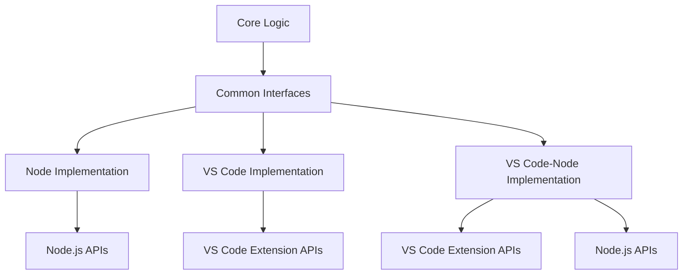
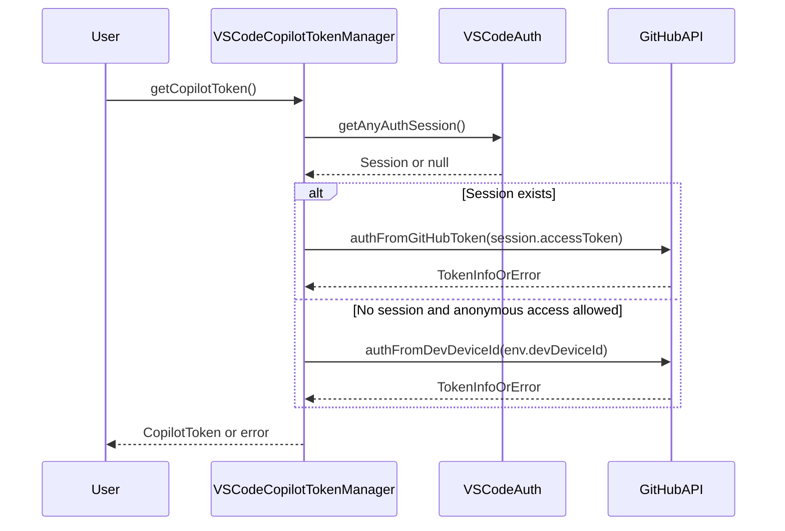
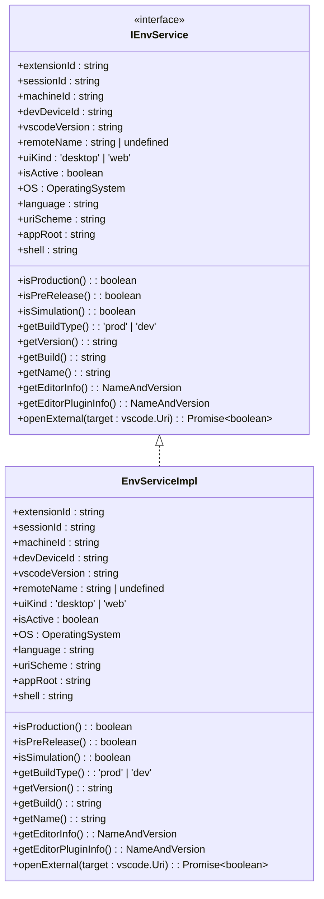
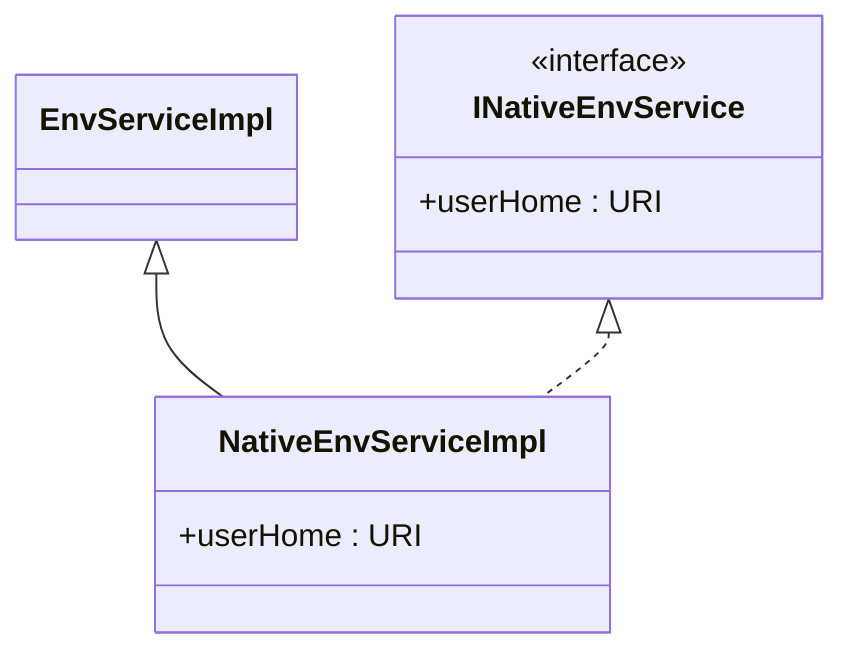

# Platform Implementations

<cite>
**Referenced Files in This Document**   
- [copilotTokenManager.ts](file://src/platform/authentication/common/copilotTokenManager.ts)
- [copilotTokenManager.ts](file://src/platform/authentication/node/copilotTokenManager.ts)
- [copilotTokenManager.ts](file://src/platform/authentication/vscode-node/copilotTokenManager.ts)
- [fileSystemService.ts](file://src/platform/filesystem/common/filesystemService.ts)
- [fileSystemServiceImpl.ts](file://src/platform/filesystem/node/fileSystemServiceImpl.ts)
- [fileSystemServiceImpl.ts](file://src/platform/filesystem/vscode/fileSystemServiceImpl.ts)
- [envServiceImpl.ts](file://src/platform/env/vscode/envServiceImpl.ts)
- [nativeEnvServiceImpl.ts](file://src/platform/env/vscode-node/nativeEnvServiceImpl.ts)
- [session.ts](file://src/platform/authentication/vscode-node/session.ts)
</cite>

## Table of Contents
1. [Introduction](#introduction)
2. [Platform-Specific Architecture](#platform-specific-architecture)
3. [Authentication Implementation](#authentication-implementation)
4. [File System Implementation](#file-system-implementation)
5. [Environment Service Implementation](#environment-service-implementation)
6. [Implementation Patterns](#implementation-patterns)
7. [Best Practices for Platform Adapters](#best-practices-for-platform-adapters)
8. [Conclusion](#conclusion)

## Introduction
The VS Code Copilot Chat extension implements a modular architecture that supports multiple runtime environments through platform-specific adapters. This document details the implementation of these adapters across three primary platforms: VS Code (vscode), Node.js (node), and the combined VS Code and Node.js environment (vscode-node). The architecture enables the extension to leverage platform-specific capabilities while maintaining a clean separation from shared business logic. Key components such as authentication, file system operations, and environment services are implemented with platform-specific adaptations that optimize for their respective runtime contexts.

## Platform-Specific Architecture
The platform-specific implementation follows a layered architecture with common interfaces defined in shared modules and concrete implementations provided in platform-specific directories. The architecture is organized around the principle of dependency inversion, where high-level modules define interfaces that are implemented by lower-level, platform-specific modules. This approach enables the core functionality to remain agnostic of the underlying platform while allowing for optimized implementations that take advantage of platform-specific APIs and constraints.

The platform implementations are organized in the `src/platform` directory, with subdirectories for each platform (`common`, `node`, `vscode`, `vscode-node`). The `common` directory contains shared interfaces and base classes, while the platform-specific directories contain concrete implementations. This structure facilitates code reuse and ensures consistent behavior across platforms while allowing for necessary variations in implementation.



**Diagram sources**
- [copilotTokenManager.ts](file://src/platform/authentication/common/copilotTokenManager.ts)
- [copilotTokenManager.ts](file://src/platform/authentication/node/copilotTokenManager.ts)
- [copilotTokenManager.ts](file://src/platform/authentication/vscode-node/copilotTokenManager.ts)

## Authentication Implementation
The authentication system is implemented with platform-specific adaptations that handle token management and user authentication in different runtime environments. The core authentication logic is defined in the `BaseCopilotTokenManager` class, which provides a foundation for platform-specific implementations.

### Node.js Authentication
In the Node.js environment, authentication is implemented through the `CopilotTokenManagerFromGitHubToken` and `FixedCopilotTokenManager` classes. These implementations rely on environment variables (`GITHUB_PAT`, `GITHUB_OAUTH_TOKEN`) to authenticate users and obtain Copilot tokens. The Node.js implementation is designed for testing and automation scenarios, where authentication can be performed without user interaction.

```mermaid
classDiagram
class BaseCopilotTokenManager {
+_copilotToken : ExtendedTokenInfo
+getCopilotToken(force? : boolean) : Promise~CopilotToken~
+resetCopilotToken(httpError? : number) : void
+authFromGitHubToken(githubToken : string, ghUsername : string) : Promise~TokenInfoOrError~
+authFromDevDeviceId(devDeviceId : string) : Promise~TokenInfoOrError~
}
class CopilotTokenManagerFromGitHubToken {
+githubToken : string
+githubUsername : string
+authenticateAndGetToken() : Promise~TokenInfoOrError~
}
class FixedCopilotTokenManager {
+_completionsToken : string
+completionsToken : string
+checkCopilotToken() : Promise~{status : 'OK'}~
}
BaseCopilotTokenManager <|-- CopilotTokenManagerFromGitHubToken
BaseCopilotTokenManager <|-- FixedCopilotTokenManager
```

**Diagram sources**
- [copilotTokenManager.ts](file://src/platform/authentication/node/copilotTokenManager.ts)

### VS Code-Node Authentication
The VS Code-Node implementation combines VS Code's authentication APIs with Node.js capabilities to provide a seamless authentication experience. The `VSCodeCopilotTokenManager` class extends the base implementation and integrates with VS Code's session management system to obtain GitHub authentication tokens.

The authentication flow begins with checking for an active GitHub session using VS Code's authentication provider. If a session exists, the manager uses the session's access token to obtain a Copilot token. If no session exists and anonymous access is allowed, the manager falls back to using a device ID for authentication.



**Diagram sources**
- [copilotTokenManager.ts](file://src/platform/authentication/vscode-node/copilotTokenManager.ts)
- [session.ts](file://src/platform/authentication/vscode-node/session.ts)

**Section sources**
- [copilotTokenManager.ts](file://src/platform/authentication/vscode-node/copilotTokenManager.ts)
- [session.ts](file://src/platform/authentication/vscode-node/session.ts)

## File System Implementation
The file system implementation provides platform-specific access to file operations, with different implementations optimized for Node.js and VS Code environments.

### Node.js File System
The Node.js implementation uses the built-in `fs` module to provide direct access to the file system. The `NodeFileSystemService` class implements the `IFileSystemService` interface and provides methods for file operations such as reading, writing, and directory management.

The implementation includes safety checks to prevent reading excessively large files, with a configurable limit defined by `FS_READ_MAX_FILE_SIZE`. The service also validates that URIs use the 'file' scheme before performing operations, ensuring that only local file system access is permitted.

```mermaid
classDiagram
class IFileSystemService {
<<interface>>
+stat(uri : Uri) : Promise~FileStat~
+readDirectory(uri : Uri) : Promise~[string, FileType][]~
+createDirectory(uri : Uri) : Promise~void~
+readFile(uri : Uri, disableLimit? : boolean) : Promise~Uint8Array~
+writeFile(uri : Uri, content : Uint8Array) : Promise~void~
+delete(uri : Uri, options? : {recursive? : boolean; useTrash? : boolean}) : Promise~void~
+rename(oldURI : Uri, newURI : Uri, options? : {overwrite? : boolean}) : Promise~void~
+copy(source : Uri, destination : Uri, options? : {overwrite? : boolean}) : Promise~void~
+isWritableFileSystem(scheme : string) : boolean | undefined
+createFileSystemWatcher(glob : string | RelativePattern) : FileSystemWatcher
}
class NodeFileSystemService {
+stat(uri : URI) : Promise~FileStat~
+readDirectory(uri : URI) : Promise~[string, FileType][]~
+createDirectory(uri : URI) : Promise~void~
+readFile(uri : URI, disableLimit? : boolean) : Promise~Uint8Array~
+writeFile(uri : URI, content : Uint8Array) : Promise~void~
+delete(uri : URI, options? : {recursive? : boolean; useTrash? : boolean}) : Promise~void~
+rename(oldURI : URI, newURI : URI, options? : {overwrite? : boolean}) : Promise~void~
+copy(source : URI, destination : URI, options? : {overwrite? : boolean}) : Promise~void~
+isWritableFileSystem(scheme : string) : boolean | undefined
+createFileSystemWatcher(glob : string | RelativePattern) : FileSystemWatcher
}
IFileSystemService <|.. NodeFileSystemService
```

**Diagram sources**
- [fileSystemService.ts](file://src/platform/filesystem/common/filesystemService.ts)
- [fileSystemServiceImpl.ts](file://src/platform/filesystem/node/fileSystemServiceImpl.ts)

### VS Code File System
The VS Code implementation leverages VS Code's workspace file system API to provide access to files within the editor context. The `VSCodeFileSystemService` class implements the same interface as the Node.js version but uses VS Code's `workspace.fs` API for file operations.

This implementation provides additional capabilities such as trash support for file deletion and proper handling of virtual file systems. It also integrates with VS Code's file watching system to monitor file changes.

```mermaid
classDiagram
class VSCodeFileSystemService {
+stat(uri : URI) : Promise~vscode.FileStat~
+readDirectory(uri : URI) : Promise~[string, FileType][]~
+createDirectory(uri : URI) : Promise~void~
+readFile(uri : URI, disableLimit? : boolean) : Promise~Uint8Array~
+writeFile(uri : URI, content : Uint8Array) : Promise~void~
+delete(uri : URI, options? : {recursive? : boolean; useTrash? : boolean}) : Promise~void~
+rename(oldURI : URI, newURI : URI, options? : {overwrite? : boolean}) : Promise~void~
+copy(source : URI, destination : URI, options? : {overwrite? : boolean}) : Promise~void~
+isWritableFileSystem(scheme : string) : boolean
+createFileSystemWatcher(glob : string | vscode.RelativePattern) : vscode.FileSystemWatcher
}
IFileSystemService <|.. VSCodeFileSystemService
```

**Diagram sources**
- [fileSystemService.ts](file://src/platform/filesystem/common/filesystemService.ts)
- [fileSystemServiceImpl.ts](file://src/platform/filesystem/vscode/fileSystemServiceImpl.ts)

**Section sources**
- [fileSystemService.ts](file://src/platform/filesystem/common/filesystemService.ts)
- [fileSystemServiceImpl.ts](file://src/platform/filesystem/node/fileSystemServiceImpl.ts)
- [fileSystemServiceImpl.ts](file://src/platform/filesystem/vscode/fileSystemServiceImpl.ts)

## Environment Service Implementation
The environment service provides access to platform-specific environment information and capabilities.

### VS Code Environment
The VS Code implementation accesses environment information through VS Code's `env` API, providing information such as the user's session ID, machine ID, and development device ID. The service also provides information about the VS Code version and the extension's version.



**Diagram sources**
- [envServiceImpl.ts](file://src/platform/env/vscode/envServiceImpl.ts)

### VS Code-Node Environment
The VS Code-Node implementation extends the VS Code environment service with additional Node.js capabilities, such as access to the user's home directory through the operating system's native APIs.



**Diagram sources**
- [nativeEnvServiceImpl.ts](file://src/platform/env/vscode-node/nativeEnvServiceImpl.ts)

**Section sources**
- [envServiceImpl.ts](file://src/platform/env/vscode/envServiceImpl.ts)
- [nativeEnvServiceImpl.ts](file://src/platform/env/vscode-node/nativeEnvServiceImpl.ts)

## Implementation Patterns
The platform-specific implementations follow several key patterns that ensure consistency, maintainability, and extensibility.

### Interface-Based Design
The architecture relies heavily on interface-based design, with all platform-specific implementations conforming to well-defined interfaces. This approach enables dependency injection and facilitates testing by allowing mock implementations to be substituted for real ones.

### Inheritance and Composition
The implementations use a combination of inheritance and composition to share common functionality while allowing for platform-specific variations. Base classes provide shared functionality, while derived classes implement platform-specific behavior.

### Error Handling and Resilience
The implementations include comprehensive error handling strategies that account for platform-specific failure modes. For example, the authentication system handles HTTP 401 errors by prompting the user to re-authenticate, while the file system implementation includes size limits to prevent memory exhaustion.

### Resource Management
The implementations follow best practices for resource management, including proper disposal of event listeners and cleanup of temporary resources. The use of the Disposable pattern ensures that resources are properly released when no longer needed.

## Best Practices for Platform Adapters
When implementing new platform adapters, the following best practices should be observed:

1. **Define Clear Interfaces**: Ensure that all platform-specific functionality is accessed through well-defined interfaces that abstract away implementation details.

2. **Follow Platform Conventions**: Adhere to the conventions and best practices of the target platform, such as using platform-specific APIs for file operations or authentication.

3. **Handle Platform-Specific Errors**: Implement error handling strategies that account for the unique failure modes of each platform.

4. **Optimize for Performance**: Consider the performance characteristics of each platform and optimize accordingly, such as using asynchronous operations where appropriate.

5. **Ensure Security**: Follow security best practices for each platform, such as validating input and protecting sensitive information.

6. **Provide Comprehensive Testing**: Implement thorough testing for each platform adapter, including unit tests and integration tests that verify correct behavior in the target environment.

7. **Document Platform-Specific Behavior**: Clearly document any platform-specific behavior or limitations that users should be aware of.

## Conclusion
The platform-specific adapter implementations in the VS Code Copilot Chat extension demonstrate a well-structured approach to supporting multiple runtime environments. By leveraging interface-based design, inheritance, and composition, the architecture provides a flexible foundation that can be extended to support additional platforms in the future. The implementations for authentication, file system operations, and environment services showcase how platform-specific capabilities can be integrated while maintaining a clean separation from shared business logic. This approach enables the extension to deliver optimized experiences across different environments while ensuring consistency and maintainability.