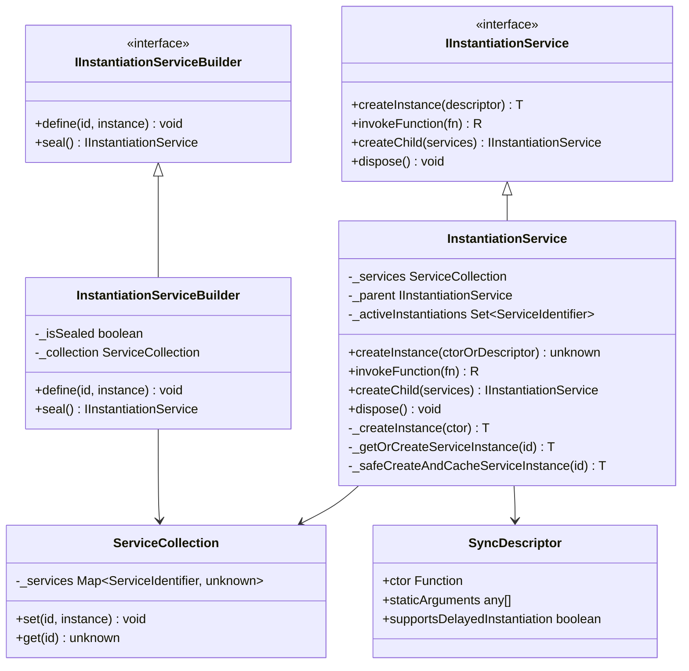
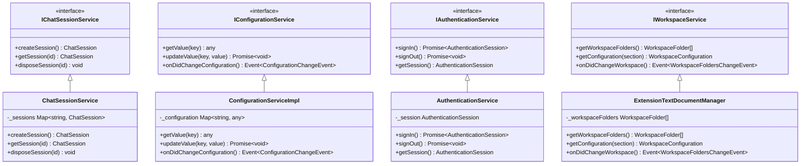
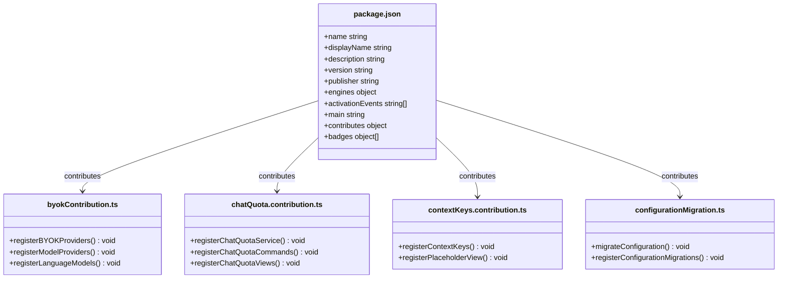
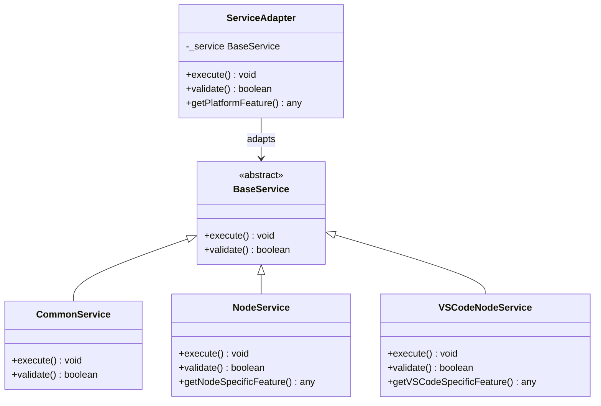
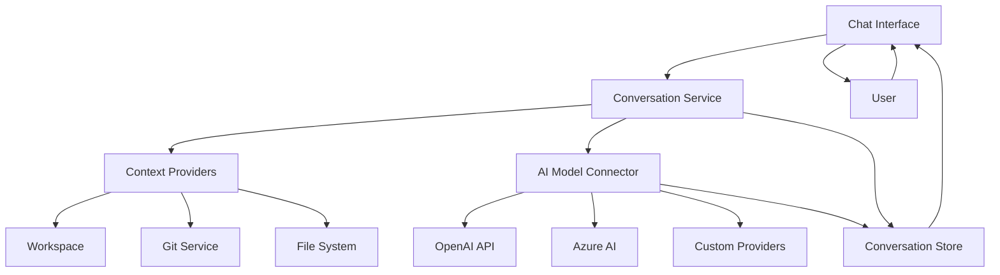
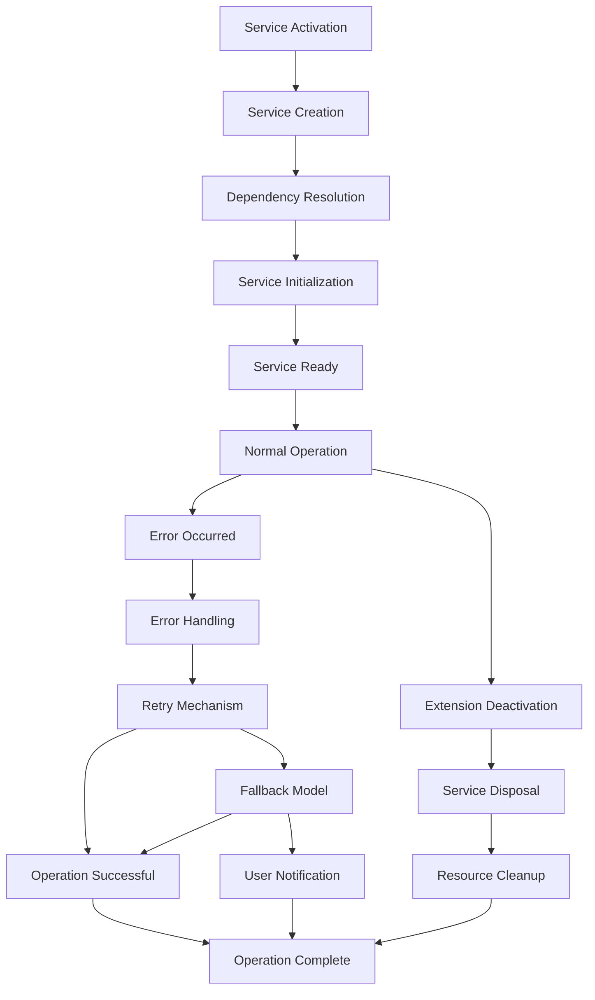

# Component Relationships

<cite>
**Referenced Files in This Document**   
- [package.json](file://package.json)
- [README.md](file://README.md)
- [src/util/common/services.ts](file://src/util/common/services.ts)
- [src/util/vs/platform/instantiation/common/instantiationService.ts](file://src/util/vs/platform/instantiation/common/instantiationService.ts)
- [src/util/vs/platform/instantiation/common/instantiation.ts](file://src/util/vs/platform/instantiation/common/instantiation.ts)
- [src/extension/extension/vscode/services.ts](file://src/extension/extension/vscode/services.ts)
- [src/extension/extension/vscode-node/extension.ts](file://src/extension/extension/vscode-node/extension.ts)
- [src/extension/conversationStore/node/conversationStore.ts](file://src/extension/conversationStore/node/conversationStore.ts)
- [src/extension/prompt/common/conversation.ts](file://src/extension/prompt/common/conversation.ts)
- [src/extension/byok/vscode-node/byokContribution.ts](file://src/extension/byok/vscode-node/byokContribution.ts)
- [src/extension/byok/vscode-node/baseOpenAICompatibleProvider.ts](file://src/extension/byok/vscode-node/baseOpenAICompatibleProvider.ts)
- [src/extension/byok/vscode-node/xAIProvider.ts](file://src/extension/byok/vscode-node/xAIProvider.ts)
- [src/extension/byok/vscode-node/groqProvider.ts](file://src/extension/byok/vscode-node/groqProvider.ts)
- [src/extension/byok/vscode-node/openRouterProvider.ts](file://src/extension/byok/vscode-node/openRouterProvider.ts)
- [src/extension/chat/vscode-node/chatQuota.contribution.ts](file://src/extension/chat/vscode-node/chatQuota.contribution.ts)
- [src/extension/contextKeys/vscode-node/contextKeys.contribution.ts](file://src/extension/contextKeys/vscode-node/contextKeys.contribution.ts)
- [src/extension/configuration/vscode-node/configurationMigration.ts](file://src/extension/configuration/vscode-node/configurationMigration.ts)
</cite>

## Table of Contents
1. [Introduction](#introduction)
2. [Dependency Injection and Instantiation Service](#dependency-injection-and-instantiation-service)
3. [Service-Oriented Architecture](#service-oriented-architecture)
4. [Contribution System](#contribution-system)
5. [Adapter Pattern Implementation](#adapter-pattern-implementation)
6. [Component Relationships and Data Flow](#component-relationships-and-data-flow)
7. [Common Integration Issues and Solutions](#common-integration-issues-and-solutions)
8. [Conclusion](#conclusion)

## Introduction
The vscode-copilot-chat extension implements a sophisticated architecture that enables seamless integration of AI-powered chat features within Visual Studio Code. This document provides a comprehensive analysis of component relationships within the architecture, focusing on key patterns such as dependency injection, service-oriented design, contribution mechanisms, and adapter patterns. The extension leverages a modular design that separates concerns between platform services, extension components, and AI model connectors, enabling extensibility and maintainability. By understanding these relationships, developers can better comprehend how the system wires components together, manages service lifecycles, and handles cross-component communication.

## Dependency Injection and Instantiation Service

The vscode-copilot-chat architecture implements a robust dependency injection pattern using the instantiation service to wire components together. This pattern enables loose coupling between components while maintaining clear dependencies and facilitating testability. The core mechanism revolves around the `IInstantiationService` interface and its implementation, which manages the creation and lifecycle of services throughout the application.

The instantiation service operates through a builder pattern implemented in the `InstantiationServiceBuilder` class, which collects service definitions during the registration phase and then seals them to create an immutable service container. Services are registered using service identifiers created with the `createServiceIdentifier` function, which ensures type safety and prevents naming collisions. During registration, services can be defined as either concrete instances or `SyncDescriptor` objects that describe how to instantiate a service when needed.

**Diagram sources**
- [src/util/common/services.ts](file://src/util/common/services.ts)
- [src/util/vs/platform/instantiation/common/instantiationService.ts](file://src/util/vs/platform/instantiation/common/instantiationService.ts)
- [src/util/vs/platform/instantiation/common/instantiation.ts](file://src/util/vs/platform/instantiation/common/instantiation.ts)

The instantiation service handles complex dependency resolution, including circular dependency detection through a graph-based algorithm that analyzes service dependencies before instantiation. It also supports delayed instantiation for services that should only be created when first accessed, improving startup performance. The service maintains a collection of active instantiations to prevent recursive instantiation and ensures proper disposal of services when the instantiation service itself is disposed.

**Section sources**
- [src/util/common/services.ts](file://src/util/common/services.ts)
- [src/util/vs/platform/instantiation/common/instantiationService.ts](file://src/util/vs/platform/instantiation/common/instantiationService.ts)
- [src/util/vs/platform/instantiation/common/instantiation.ts](file://src/util/vs/platform/instantiation/common/instantiation.ts)

## Service-Oriented Architecture

The vscode-copilot-chat extension implements a service-oriented architecture where platform services are consumed by extension components through well-defined interfaces. This architecture promotes separation of concerns, testability, and extensibility by defining clear contracts between components. Services are organized into logical domains such as authentication, chat, configuration, and workspace management, each providing specific capabilities to the extension.

The service registration process occurs in the `services.ts` file within the extension directory, where all core services are defined and registered with the instantiation service builder. This centralized registration approach ensures that services are consistently available throughout the application. Services are implemented as classes that implement specific interfaces, allowing for easy mocking and testing. The architecture distinguishes between services that run in both web and node.js extension hosts, with a preference for implementing services in the shared location to maximize compatibility.

**Diagram sources**
- [src/extension/extension/vscode/services.ts](file://src/extension/extension/vscode/services.ts)
- [src/platform/chat/common/chatSessionService.ts](file://src/platform/chat/common/chatSessionService.ts)
- [src/platform/configuration/common/configurationService.ts](file://src/platform/configuration/common/configurationService.ts)
- [src/platform/authentication/common/authenticationService.ts](file://src/platform/authentication/common/authenticationService.ts)
- [src/platform/workspace/common/workspaceService.ts](file://src/platform/workspace/common/workspaceService.ts)

The service-oriented architecture enables components to consume platform services without knowing their concrete implementations, promoting loose coupling and facilitating dependency injection. Services can depend on other services through constructor injection, with dependencies declared using the `@IServiceName` decorator pattern. This approach allows for easy replacement of service implementations and supports testing through dependency injection.

**Section sources**
- [src/extension/extension/vscode/services.ts](file://src/extension/extension/vscode/services.ts)

## Contribution System

The vscode-copilot-chat extension implements a contribution system that allows features to register themselves with VS Code through package.json and contribution files. This system enables the extension to declaratively define its capabilities and integrate with the VS Code platform. The contribution mechanism is based on VS Code's extension contribution points, which allow extensions to add commands, views, menus, and other UI elements to the editor.

The package.json file contains the primary contribution declarations, including activation events, commands, menus, and configuration settings. These contributions are processed by VS Code when the extension is activated, enabling the extension's features to be integrated into the editor's UI and command system. Additional contribution files in the extension directory provide more specific registration for features such as authentication, chat quotas, and context keys.

**Diagram sources**
- [package.json](file://package.json)
- [src/extension/byok/vscode-node/byokContribution.ts](file://src/extension/byok/vscode-node/byokContribution.ts)
- [src/extension/chat/vscode-node/chatQuota.contribution.ts](file://src/extension/chat/vscode-node/chatQuota.contribution.ts)
- [src/extension/contextKeys/vscode-node/contextKeys.contribution.ts](file://src/extension/contextKeys/vscode-node/contextKeys.contribution.ts)
- [src/extension/configuration/vscode-node/configurationMigration.ts](file://src/extension/configuration/vscode-node/configurationMigration.ts)

The contribution system follows a hierarchical approach where the main extension file activates the contribution system, which then registers specific features through dedicated contribution files. This modular approach allows for better organization and maintainability of contribution code. The system also supports conditional contributions based on configuration settings or environment variables, enabling features to be enabled or disabled dynamically.

**Section sources**
- [package.json](file://package.json)
- [src/extension/byok/vscode-node/byokContribution.ts](file://src/extension/byok/vscode-node/byokContribution.ts)
- [src/extension/chat/vscode-node/chatQuota.contribution.ts](file://src/extension/chat/vscode-node/chatQuota.contribution.ts)
- [src/extension/contextKeys/vscode-node/contextKeys.contribution.ts](file://src/extension/contextKeys/vscode-node/contextKeys.contribution.ts)
- [src/extension/configuration/vscode-node/configurationMigration.ts](file://src/extension/configuration/vscode-node/configurationMigration.ts)

## Adapter Pattern Implementation

The vscode-copilot-chat architecture implements the adapter pattern to enable platform-specific code (node vs vscode) while maintaining shared business logic. This pattern allows the extension to run in different environments (desktop vs web) while sharing core functionality. The adapter pattern is implemented through a layered architecture where platform-agnostic services are defined in shared locations, and platform-specific implementations are provided in separate directories.

The architecture distinguishes between common, node, and vscode-node directories, with common containing shared business logic, node containing Node.js-specific implementations, and vscode-node containing VS Code-specific implementations. Services are registered with the instantiation service using platform-specific descriptors, allowing the correct implementation to be injected based on the runtime environment. This approach enables the extension to leverage platform-specific capabilities while maintaining a consistent API for business logic.

**Diagram sources**
- [src/extension/extension/vscode/services.ts](file://src/extension/extension/vscode/services.ts)
- [src/extension/byok/common/byokProvider.ts](file://src/extension/byok/common/byokProvider.ts)
- [src/extension/byok/vscode-node/baseOpenAICompatibleProvider.ts](file://src/extension/byok/vscode-node/baseOpenAICompatibleProvider.ts)
- [src/extension/byok/vscode-node/xAIProvider.ts](file://src/extension/byok/vscode-node/xAIProvider.ts)
- [src/extension/byok/vscode-node/groqProvider.ts](file://src/extension/byok/vscode-node/groqProvider.ts)
- [src/extension/byok/vscode-node/openRouterProvider.ts](file://src/extension/byok/vscode-node/openRouterProvider.ts)

The adapter pattern is particularly evident in the BYOK (Bring Your Own Key) functionality, where different AI model providers (xAI, Groq, OpenRouter) implement a common interface while providing platform-specific authentication and API integration. The base `BaseOpenAICompatibleLMProvider` class defines the common interface and shared functionality, while specific provider classes extend this base class to implement provider-specific behavior. This approach allows new providers to be added with minimal changes to the core architecture.

**Section sources**
- [src/extension/byok/vscode-node/baseOpenAICompatibleProvider.ts](file://src/extension/byok/vscode-node/baseOpenAICompatibleProvider.ts)
- [src/extension/byok/vscode-node/xAIProvider.ts](file://src/extension/byok/vscode-node/xAIProvider.ts)
- [src/extension/byok/vscode-node/groqProvider.ts](file://src/extension/byok/vscode-node/groqProvider.ts)
- [src/extension/byok/vscode-node/openRouterProvider.ts](file://src/extension/byok/vscode-node/openRouterProvider.ts)

## Component Relationships and Data Flow

The vscode-copilot-chat extension features a complex network of component relationships that enable the chat interface, conversation store, context providers, and AI model connectors to work together seamlessly. These components are wired together through the dependency injection system, with clear data flow patterns that ensure efficient communication and state management.

The core data flow begins with the chat interface, which captures user input and forwards it to the conversation service. The conversation service manages the conversation state and coordinates with context providers to gather relevant information from the workspace. This contextual information is combined with the user's message and sent to the appropriate AI model connector, which communicates with the underlying AI service. The response is then processed and stored in the conversation store, which maintains the conversation history and provides it back to the chat interface for display.

**Diagram sources**
- [src/extension/conversationStore/node/conversationStore.ts](file://src/extension/conversationStore/node/conversationStore.ts)
- [src/extension/prompt/common/conversation.ts](file://src/extension/prompt/common/conversation.ts)
- [src/extension/extension/vscode/services.ts](file://src/extension/extension/vscode/services.ts)
- [src/extension/byok/vscode-node/byokContribution.ts](file://src/extension/byok/vscode-node/byokContribution.ts)

The conversation store component plays a critical role in maintaining conversation state, using an LRU (Least Recently Used) cache to manage memory usage while preserving recent conversation history. The store is implemented as a service that can be injected into other components, ensuring consistent access to conversation data throughout the application. Context providers are responsible for gathering relevant information from the workspace, such as file contents, git status, and workspace configuration, which is then used to enrich the AI model's context.

**Section sources**
- [src/extension/conversationStore/node/conversationStore.ts](file://src/extension/conversationStore/node/conversationStore.ts)
- [src/extension/prompt/common/conversation.ts](file://src/extension/prompt/common/conversation.ts)

## Common Integration Issues and Solutions

The vscode-copilot-chat extension faces several common integration issues related to service lifecycle management and error propagation between components. These issues arise from the complex interactions between services, the asynchronous nature of AI model requests, and the need to maintain state consistency across different components.

One common issue is service lifecycle management, particularly when dealing with services that have asynchronous initialization or cleanup requirements. The extension addresses this through the use of the `DisposableStore` pattern, which ensures that all services are properly disposed of when the extension is deactivated. Services that implement the `IDisposable` interface are automatically tracked and disposed of, preventing memory leaks and ensuring clean shutdown.

Another common issue is error propagation between components, especially when dealing with network requests to AI models. The extension implements a comprehensive error handling strategy that includes retry mechanisms, fallback models, and user-friendly error messages. Errors are transformed into a standardized format using the `transformErrorForSerialization` function, ensuring consistent error reporting across different components.

**Diagram sources**
- [src/util/vs/base/common/errors.ts](file://src/util/vs/base/common/errors.ts)
- [src/extension/extension/vscode-node/extension.ts](file://src/extension/extension/vscode-node/extension.ts)
- [src/util/common/services.ts](file://src/util/common/services.ts)

The extension also addresses issues related to configuration changes and dynamic service registration. When configuration changes occur, the extension uses event-driven architecture to notify affected services and trigger reinitialization when necessary. This ensures that services are always operating with the most up-to-date configuration and can adapt to changing user preferences.

**Section sources**
- [src/util/vs/base/common/errors.ts](file://src/util/vs/base/common/errors.ts)
- [src/extension/extension/vscode-node/extension.ts](file://src/extension/extension/vscode-node/extension.ts)

## Conclusion
The vscode-copilot-chat extension demonstrates a sophisticated architecture that effectively manages component relationships through dependency injection, service-oriented design, contribution mechanisms, and adapter patterns. The instantiation service provides a robust foundation for dependency management, enabling loose coupling and testability across components. The service-oriented architecture promotes separation of concerns and facilitates extensibility through well-defined interfaces. The contribution system allows features to integrate seamlessly with VS Code, while the adapter pattern enables platform-specific implementations while maintaining shared business logic. By understanding these patterns and their implementation, developers can better comprehend how the extension manages complex interactions between components and handles common integration challenges.