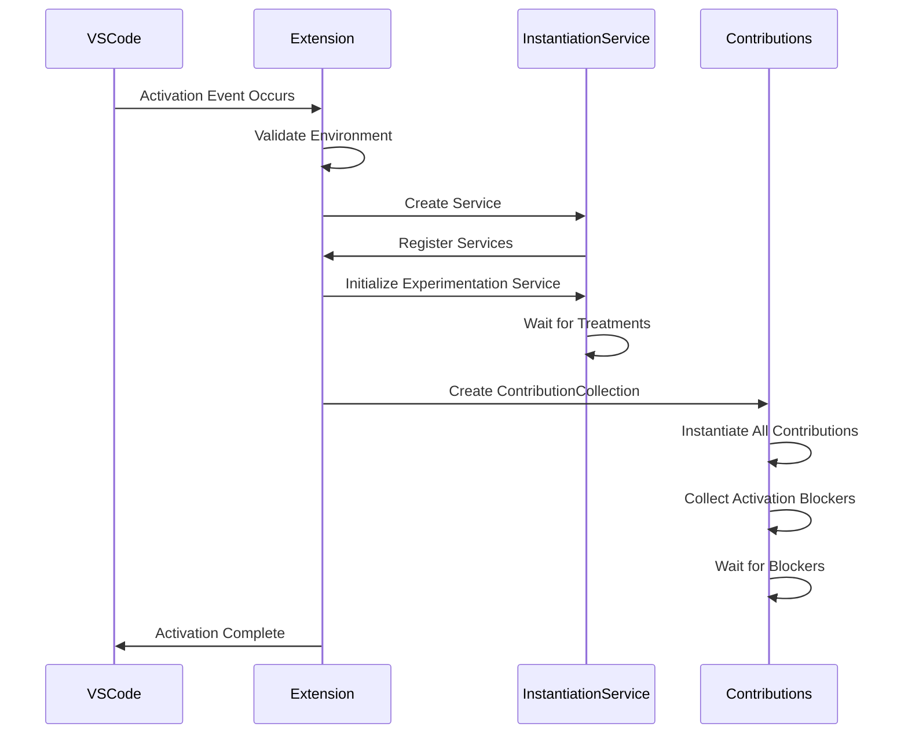
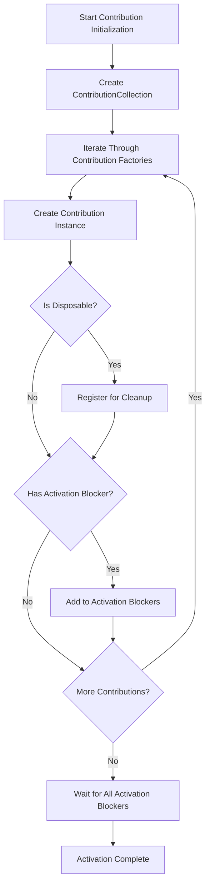
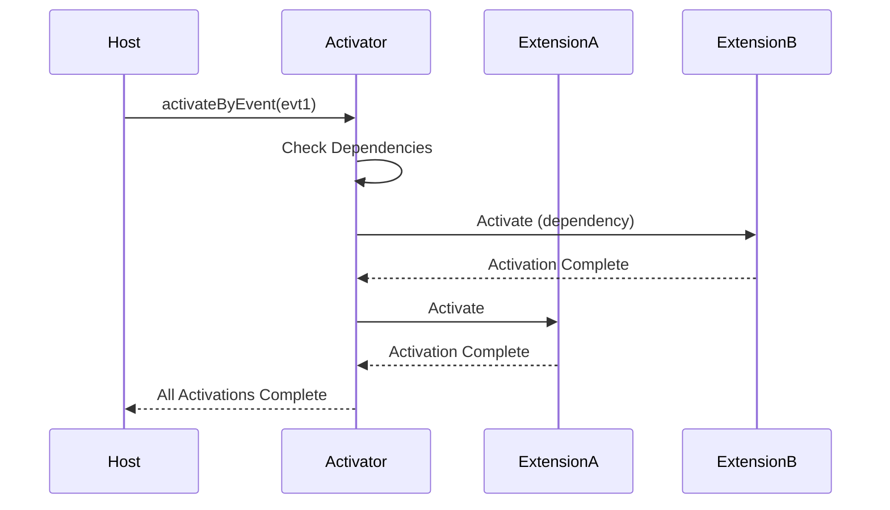

# Activation Sequence

<cite>
**Referenced Files in This Document**   
- [package.json](file://package.json)
- [src/extension/extension/vscode/extension.ts](file://src/extension/extension/vscode/extension.ts)
- [src/extension/common/contributions.ts](file://src/extension/common/contributions.ts)
- [test/simulation/fixtures/codeMapper/extHostExtensionActivator.test.ts](file://test/simulation/fixtures/codeMapper/extHostExtensionActivator.test.ts)
</cite>

## Table of Contents
1. [Introduction](#introduction)
2. [Activation Events in package.json](#activation-events-in-packagejson)
3. [Extension Activation Lifecycle](#extension-activation-lifecycle)
4. [Contribution Initialization](#contribution-initialization)
5. [Dependency Management During Activation](#dependency-management-during-activation)
6. [Performance Considerations](#performance-considerations)
7. [Error Handling During Activation](#error-handing-during-activation)
8. [Best Practices for Extension Activation](#best-practices-for-extension-activation)

## Introduction
This document details the activation sequence and contribution initialization process for the VS Code Copilot Chat extension. It explains how the extension is activated in response to specific events, how contributions are initialized, and the lifecycle from activation event firing to the instantiation of contribution providers and services. The analysis covers the role of activationEvents in package.json, the order of initialization for different contribution types, dependency management, common issues, performance considerations, and best practices for lazy loading.

## Activation Events in package.json
The extension's activation is triggered by specific events defined in the package.json file. These events determine when the extension should be loaded and initialized by VS Code.

```json
"activationEvents": [
    "onStartupFinished",
    "onLanguageModelChat:copilot",
    "onUri",
    "onFileSystem:ccreq",
    "onFileSystem:ccsettings",
    "onCustomAgentsProvider"
]
```

These activation events serve different purposes:
- **onStartupFinished**: Activates the extension when VS Code has completed its startup process
- **onLanguageModelChat:copilot**: Triggers activation when a language model chat session is initiated with the copilot participant
- **onUri**: Activates when a URI handler is invoked
- **onFileSystem:ccreq** and **onFileSystem:ccsettings**: Activate when specific custom file system providers are accessed
- **onCustomAgentsProvider**: Triggers when custom agents are requested

The extension uses multiple activation events to ensure it loads when needed while maintaining optimal performance by avoiding unnecessary early activation.

**Section sources**
- [package.json](file://package.json#L81-L87)

## Extension Activation Lifecycle
The extension activation lifecycle begins when one of the specified activation events occurs. The process is managed through the baseActivate function in the extension module, which coordinates the initialization of services and contributions.

The activation sequence follows these steps:
1. Check if the extension is running in test mode and bypass activation if appropriate
2. Verify the VS Code version compatibility for pre-release extensions
3. Configure localization if available
4. Initialize development packages if not in production
5. Create the instantiation service with registered services
6. Initialize the experimentation service and wait for treatment data
7. Instantiate and initialize all contributions
8. Wait for any activation blockers to complete
9. Return the extension API

The activation process is designed to be efficient while ensuring all necessary components are properly initialized before the extension becomes fully operational.



**Diagram sources**
- [src/extension/extension/vscode/extension.ts](file://src/extension/extension/vscode/extension.ts#L33-L90)

**Section sources**
- [src/extension/extension/vscode/extension.ts](file://src/extension/extension/vscode/extension.ts#L33-L90)

## Contribution Initialization
Contributions are initialized through the ContributionCollection class, which manages the creation and lifecycle of all extension contributions. Each contribution is created via a factory pattern that allows for dependency injection and proper service instantiation.

The contribution initialization process:
1. Iterates through all contribution factories
2. Creates each contribution instance using the instantiation service
3. Registers disposable contributions for proper cleanup
4. Collects any activation blockers (promises that must resolve before activation completes)
5. Waits for all activation blockers to complete before finishing activation

Contributions can implement the IExtensionContribution interface with optional properties:
- **id**: Identifier for the contribution (used in logging)
- **dispose()**: Method called when the contribution is disposed
- **activationBlocker**: Promise that delays activation completion until resolved

This design allows contributions to perform asynchronous initialization work while preventing the extension from becoming fully active until critical components are ready.



**Diagram sources**
- [src/extension/common/contributions.ts](file://src/extension/common/contributions.ts#L41-L77)

**Section sources**
- [src/extension/common/contributions.ts](file://src/extension/common/contributions.ts#L11-L77)

## Dependency Management During Activation
The extension activation system handles dependencies between components through a combination of service registration and contribution ordering. When extensions have dependencies on other extensions, the activation system ensures that dependencies are activated first.

Key aspects of dependency management:
- The ContributionCollection processes contributions in the order they are provided
- Dependencies between extensions are resolved by the VS Code host before activation
- Services are registered in the proper order to ensure dependencies are available
- The experimentation service is initialized early as it may be required by other components

The system prevents race conditions by:
1. Using Promise.allSettled() to wait for all activation blockers
2. Ensuring service dependencies are resolved before contribution creation
3. Processing contributions sequentially to maintain predictable ordering



**Diagram sources**
- [test/simulation/fixtures/codeMapper/extHostExtensionActivator.test.ts](file://test/simulation/fixtures/codeMapper/extHostExtensionActivator.test.ts#L58-L83)

**Section sources**
- [test/simulation/fixtures/codeMapper/extHostExtensionActivator.test.ts](file://test/simulation/fixtures/codeMapper/extHostExtensionActivator.test.ts#L58-L83)

## Performance Considerations
The extension activation process includes several performance optimizations to minimize startup time and improve user experience:

1. **Lazy Initialization**: Non-essential components are initialized asynchronously or on-demand
2. **Non-blocking Operations**: The IIgnoreService is initialized without blocking activation
3. **Parallel Processing**: Multiple activation events can be processed in parallel
4. **Caching**: Experimentation service data is cached and refreshed in the background

Critical performance metrics:
- Activation blockers are timed and logged for monitoring
- The experimentation service loads in the background after initial activation
- Only essential services are required for activation completion

Best practices implemented:
- Avoiding synchronous operations during activation
- Minimizing the number of activation blockers
- Using efficient data structures for contribution management
- Proper error handling to prevent activation failures

**Section sources**
- [src/extension/extension/vscode/extension.ts](file://src/extension/extension/vscode/extension.ts#L100-L104)
- [src/extension/common/contributions.ts](file://src/extension/common/contributions.ts#L60-L66)

## Error Handling During Activation
The extension implements comprehensive error handling during the activation process to ensure robustness and provide meaningful feedback:

1. **Try-catch blocks** around contribution creation to prevent individual failures from blocking overall activation
2. **Logging** of errors with context for debugging
3. **Graceful degradation** when non-critical components fail
4. **Validation** of extension mode and environment before activation

Error scenarios handled:
- Missing dependencies between extensions
- Failed contribution initialization
- Invalid configuration in test environments
- Pre-release extension usage in stable VS Code

The system ensures that activation failures are isolated and don't prevent the entire extension from loading when possible, while still providing appropriate error reporting.

**Section sources**
- [src/extension/common/contributions.ts](file://src/extension/common/contributions.ts#L67-L69)
- [src/extension/extension/vscode/extension.ts](file://src/extension/extension/vscode/extension.ts#L35-L38)

## Best Practices for Extension Activation
Based on the analysis of the Copilot Chat extension, several best practices emerge for efficient and reliable extension activation:

1. **Minimize Activation Events**: Only include necessary activation events to reduce unnecessary loading
2. **Use Activation Blockers Judiciously**: Only block activation for essential components
3. **Implement Proper Dependency Management**: Ensure services and contributions are initialized in the correct order
4. **Optimize Performance**: Avoid synchronous operations and expensive computations during activation
5. **Handle Errors Gracefully**: Prevent single component failures from blocking entire activation
6. **Support Testing Scenarios**: Include special handling for test environments
7. **Monitor Activation Time**: Track and log activation blocker durations
8. **Implement Lazy Loading**: Defer initialization of non-essential components

The extension demonstrates these best practices through its modular architecture, efficient contribution system, and careful management of the activation lifecycle.