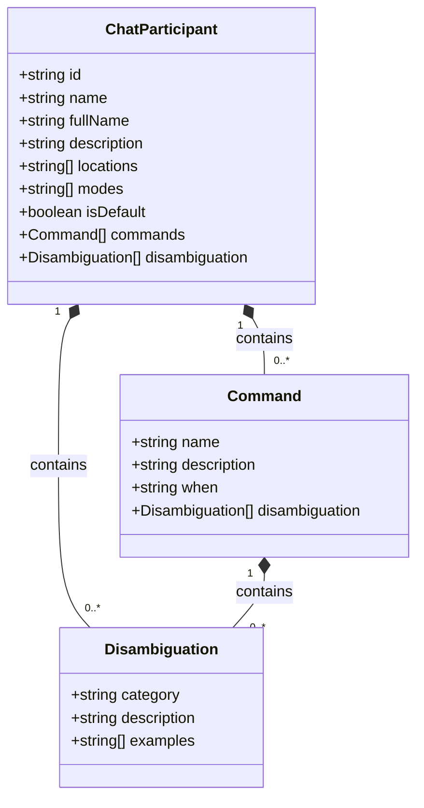
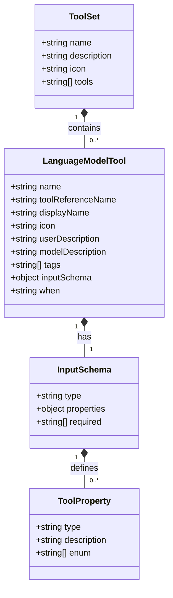
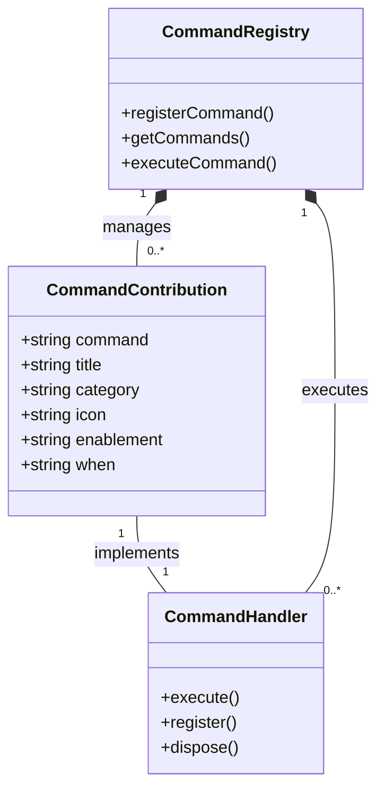
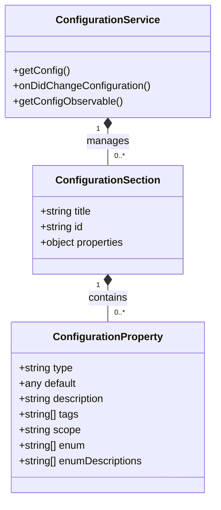
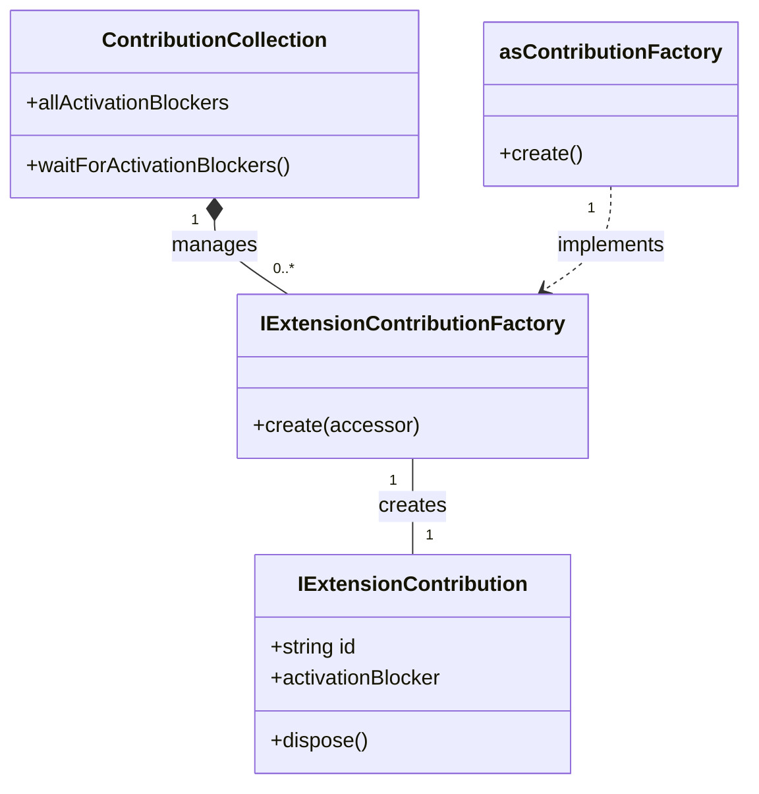

# Contribution Points

<cite>
**Referenced Files in This Document**   
- [package.json](file://package.json)
- [authentication.contribution.ts](file://src/extension/authentication/vscode-node/authentication.contribution.ts)
- [contextKeys.contribution.ts](file://src/extension/contextKeys/vscode-node/contextKeys.contribution.ts)
- [chatQuota.contribution.ts](file://src/extension/chat/vscode-node/chatQuota.contribution.ts)
- [contributions.ts](file://src/extension/common/contributions.ts)
- [vscode-node/contributions.ts](file://src/extension/extension/vscode-node/contributions.ts)
</cite>

## Table of Contents
1. [Introduction](#introduction)
2. [Contribution Types Overview](#contribution-types-overview)
3. [Chat Participants](#chat-participants)
4. [Language Model Tools](#language-model-tools)
5. [Commands](#commands)
6. [Configuration](#configuration)
7. [Implementation Architecture](#implementation-architecture)
8. [Best Practices](#best-practices)
9. [Troubleshooting](#troubleshooting)
10. [Conclusion](#conclusion)

## Introduction
This document provides comprehensive documentation on the contribution points defined in the package.json file of the GitHub Copilot Chat extension and their implementation in the codebase. The contribution system enables the extension to integrate with Visual Studio Code by defining various extension points that provide functionality to users. This document explains how each contribution point maps to specific functionality, the schema and required properties for each contribution type, and how they are implemented in the codebase.

The contribution system follows VS Code's extension contribution model, where contributions are declared in the package.json file under the "contributes" section. Each contribution type has specific properties including identifier, title, and description fields that define its behavior and user interface representation. The implementation connects these declarative contributions to actual functionality through contribution classes that are instantiated during extension activation.

**Section sources**
- [package.json](file://package.json#L1-L100)

## Contribution Types Overview
The GitHub Copilot Chat extension implements several types of contribution points in its package.json file, each serving a specific purpose in the extension's functionality. The main contribution types include chatParticipants, languageModelTools, commands, configuration, languageModelToolSets, chatViewsWelcome, and viewsWelcome. These contribution types work together to provide the complete Copilot Chat experience within VS Code.

The contribution system follows a pattern where declarative contributions in package.json are linked to implementation classes through a contribution factory system. This allows for modular implementation of features while maintaining a clean separation between configuration and code. The contribution points enable the extension to provide AI-powered chat capabilities, code generation, editing assistance, and various other developer productivity features.

Each contribution type has specific schema requirements and properties that must be properly configured for the functionality to work correctly. The implementation classes handle the runtime behavior and integration with VS Code's APIs, while the package.json declarations control the visibility, activation, and user interface aspects of the contributions.

**Section sources**
- [package.json](file://package.json#L141-L140)

## Chat Participants
The `contributes.chatParticipants` contribution point defines the various AI agents and chat interfaces provided by the Copilot extension. Each chat participant represents a different mode or capability of interaction with the AI system. The participants are identified by unique IDs and include properties such as name, fullName, description, locations, and modes.

Key chat participants include:
- `github.copilot.default`: The primary Copilot chat participant that provides general code assistance
- `github.copilot.editingSession`: Provides editing capabilities in the panel view
- `github.copilot.editingSessionEditor`: Provides inline editing capabilities in the editor
- `github.copilot.workspace`: Provides workspace-level understanding and assistance
- `github.copilot.vscode`: Provides VS Code-specific help and configuration assistance

Each participant can have commands associated with it, such as "generate", "edit", "doc", "fix", and "tests", which map to specific AI capabilities. The participants also include disambiguation categories that help route user queries to the appropriate capability based on the context and intent of the request.

The chat participants are implemented through the extension's contribution system, where each participant's functionality is provided by corresponding implementation classes that handle the AI interactions and VS Code integrations.

**Diagram sources**
- [package.json](file://package.json#L1259-L1681)

**Section sources**
- [package.json](file://package.json#L1259-L1681)

## Language Model Tools
The `contributes.languageModelTools` contribution point defines the various AI-powered tools that can be invoked during chat sessions. These tools extend the capabilities of the Copilot system by providing specialized functions for code search, file operations, code editing, and other development tasks. Each tool has a name, displayName, description, and input schema that defines its parameters.

Key language model tools include:
- `copilot_searchCodebase`: Searches the user's workspace for relevant code
- `copilot_searchWorkspaceSymbols`: Searches for code symbols using language services
- `copilot_listCodeUsages`: Lists all usages of a function, class, or variable
- `copilot_getVSCodeAPI`: Provides VS Code API documentation
- `copilot_findFiles`: Searches for files by glob pattern
- `copilot_findTextInFiles`: Performs text search in files
- `copilot_applyPatch`: Edits text files using diff/patch format
- `copilot_readFile`: Reads specific ranges from files
- `copilot_createFile`: Creates new files in the workspace

Each tool includes an inputSchema property that defines the required parameters using JSON Schema. The schema specifies required fields, data types, and descriptions for each parameter. Tools may also include tags that categorize their functionality and when conditions that control when the tool is available.

The tools are organized into tool sets through the `languageModelToolSets` contribution, which groups related tools together for better organization and discovery. Tool sets include "edit", "execute", "read", "search", "vscode", and "web" categories.

**Diagram sources**
- [package.json](file://package.json#L142-L1190)

**Section sources**
- [package.json](file://package.json#L142-L1190)

## Commands
The `contributes.commands` contribution point defines the various commands that can be invoked by users through the VS Code command palette or other UI elements. These commands provide access to the extension's functionality and are implemented by corresponding command handlers in the codebase.

Key command categories include:
- Chat operations: Commands for explaining, generating, fixing, and reviewing code
- Debug and diagnostic commands: Commands for troubleshooting and collecting diagnostics
- Session management: Commands for managing chat sessions and replay
- Configuration: Commands for managing settings and preferences
- Developer tools: Commands for internal debugging and testing

Each command has a command identifier, title, category, and enablement condition. The command identifier follows the pattern "github.copilot.[feature].[action]" for consistent naming. The title is the user-facing label displayed in the UI, while the category groups related commands together in the command palette.

The commands are implemented through the contribution system, where command registrations are handled by contribution classes that instantiate the appropriate command handlers. Many commands are conditional based on configuration settings or user state, using the "when" clause to control their visibility and availability.

**Diagram sources**
- [package.json](file://package.json#L1836-L2372)

**Section sources**
- [package.json](file://package.json#L1836-L2372)

## Configuration
The `contributes.configuration` contribution point defines the various settings that users can configure for the Copilot extension. The configuration is organized into sections including stable, preview, experimental, and advanced, which helps users understand the stability and maturity of each setting.

Key configuration sections include:
- Stable: Production-ready settings that are fully supported
- Preview: Features that are being tested and may change
- Experimental: Early-stage features that may have breaking changes
- Advanced: Settings for advanced users and troubleshooting

Configuration properties include type, default value, description, and scope. Many settings include tags that categorize them (e.g., "preview", "experimental", "advanced") and help with filtering in the settings UI. Some settings are language-overridable, allowing different values for different programming languages.

The configuration system is implemented with a hierarchical approach where settings can be overridden at different levels (application, workspace, folder). The implementation includes observable configuration that allows components to react to setting changes at runtime.

**Diagram sources**
- [package.json](file://package.json#L2373-L3199)

**Section sources**
- [package.json](file://package.json#L2373-L3199)

## Implementation Architecture
The contribution system is implemented through a modular architecture that separates declaration from implementation. The core of the system is defined in the `contributions.ts` file, which establishes the interfaces and patterns for contribution implementation.

The architecture follows these key patterns:
- **Contribution Factory Pattern**: Uses factory functions to create contribution instances, allowing for dependency injection and proper lifecycle management
- **Modular Registration**: Contributions are registered through arrays of factory functions that are processed during extension activation
- **Conditional Activation**: Many contributions are conditionally activated based on configuration settings or user state
- **Lifecycle Management**: Contributions implement IDisposable to ensure proper cleanup of resources

The implementation uses the `IExtensionContributionFactory` interface to define contribution factories, and the `ContributionCollection` class to manage the lifecycle of contributions. The `asContributionFactory` helper function simplifies the creation of factory functions from classes.

Node.js-specific contributions are defined in `vscode-node/contributions.ts`, while shared contributions are in the common contributions file. This separation allows for platform-specific implementations while maintaining a consistent API.

**Diagram sources**
- [src/extension/common/contributions.ts](file://src/extension/common/contributions.ts#L1-L78)
- [src/extension/extension/vscode-node/contributions.ts](file://src/extension/extension/vscode-node/contributions.ts#L63-L96)

**Section sources**
- [src/extension/common/contributions.ts](file://src/extension/common/contributions.ts#L1-L78)
- [src/extension/extension/vscode-node/contributions.ts](file://src/extension/extension/vscode-node/contributions.ts#L63-L96)

## Best Practices
When working with contribution points in the Copilot extension, several best practices should be followed to ensure consistency, maintainability, and proper functionality:

**Naming Conventions**
- Use consistent naming patterns for contribution identifiers (e.g., "github.copilot.[feature].[action]")
- Prefix internal commands with "github.copilot" to avoid namespace conflicts
- Use clear, descriptive names that accurately reflect the functionality

**Scoping and Visibility**
- Use the "when" clause to properly scope contributions based on configuration or state
- Organize configuration settings into appropriate sections (stable, preview, experimental)
- Consider the user experience when determining visibility conditions

**Schema Design**
- Define complete and accurate input schemas for tools with proper required fields
- Provide clear descriptions for all properties and parameters
- Use appropriate data types and validation rules in schemas

**Implementation Patterns**
- Follow the contribution factory pattern for proper dependency injection
- Implement IDisposable for proper resource cleanup
- Use activationBlocker judiciously to avoid delaying extension startup
- Separate node.js-specific contributions from shared ones

**Documentation**
- Provide clear user descriptions for all contributions
- Include examples in configuration schema where appropriate
- Document the purpose and usage of each contribution point

**Section sources**
- [package.json](file://package.json#L141-L3199)
- [src/extension/common/contributions.ts](file://src/extension/common/contributions.ts#L1-L78)

## Troubleshooting
When encountering issues with contribution points, several common problems and their solutions should be considered:

**Configuration Issues**
- Verify that contribution points are properly formatted in package.json
- Check that required properties are present and correctly typed
- Ensure that "when" clauses are correctly specified and evaluate as expected
- Validate JSON schema for tools and configuration properties

**Implementation Issues**
- Verify that contribution factories are properly registered
- Check that dependencies are correctly injected through the accessor
- Ensure that IDisposable is properly implemented for resource cleanup
- Confirm that activationBlocker promises resolve correctly

**Runtime Issues**
- Check that commands are registered and appear in the command palette
- Verify that configuration settings are properly loaded and observable
- Ensure that chat participants are properly initialized and available
- Confirm that tools are available in the appropriate contexts

Debugging can be facilitated by:
- Using the developer console to check for errors
- Enabling debug logging through configuration settings
- Using the "Show Rendered Elements" and "Show Tools" debug commands
- Checking the extension host logs for initialization issues

**Section sources**
- [package.json](file://package.json#L141-L3199)
- [src/extension/common/contributions.ts](file://src/extension/common/contributions.ts#L1-L78)
- [src/extension/extension/vscode-node/contributions.ts](file://src/extension/extension/vscode-node/contributions.ts#L63-L96)

## Conclusion
The contribution system in the GitHub Copilot Chat extension provides a robust framework for integrating AI-powered features into Visual Studio Code. By leveraging VS Code's extension contribution model, the extension is able to provide a rich set of capabilities including chat-based code assistance, code generation, editing, and various developer productivity tools.

The system follows a clean separation between declarative configuration in package.json and implementation in TypeScript classes, making it maintainable and extensible. The use of contribution factories, proper lifecycle management, and conditional activation enables a flexible architecture that can adapt to different user scenarios and configurations.

Understanding the contribution points and their implementation is essential for extending the functionality of the Copilot extension or troubleshooting issues with existing features. The patterns established in this codebase provide a solid foundation for building complex, AI-powered development tools that integrate seamlessly with the VS Code ecosystem.

**Section sources**
- [package.json](file://package.json#L1-L5257)
- [src/extension/common/contributions.ts](file://src/extension/common/contributions.ts#L1-L78)
- [src/extension/extension/vscode-node/contributions.ts](file://src/extension/extension/vscode-node/contributions.ts#L1-L124)