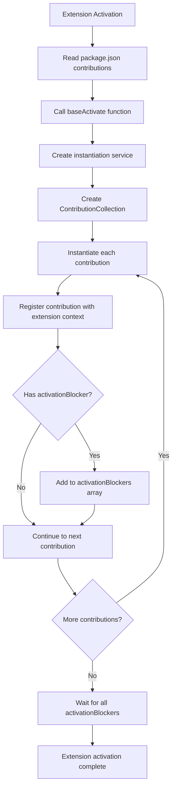

# Contribution System

<cite>
**Referenced Files in This Document**   
- [package.json](file://package.json)
- [src/extension/common/contributions.ts](file://src/extension/common/contributions.ts)
- [src/extension/authentication/vscode-node/authentication.contribution.ts](file://src/extension/authentication/vscode-node/authentication.contribution.ts)
- [src/extension/contextKeys/vscode-node/contextKeys.contribution.ts](file://src/extension/contextKeys/vscode-node/contextKeys.contribution.ts)
- [src/extension/chat/vscode-node/chatQuota.contribution.ts](file://src/extension/chat/vscode-node/chatQuota.contribution.ts)
- [src/extension/extension/vscode/extension.ts](file://src/extension/extension/vscode/extension.ts)
- [src/extension/extension/vscode-node/contributions.ts](file://src/extension/extension/vscode-node/contributions.ts)
</cite>

## Table of Contents
1. [Introduction](#introduction)
2. [Contribution Points in package.json](#contribution-points-in-packagejson)
3. [Contribution Implementation in TypeScript](#contribution-implementation-in-typescript)
4. [Activation Sequence and Lifecycle](#activation-sequence-and-lifecycle)
5. [Types of Contributions](#types-of-contributions)
6. [Contribution Registration Process](#contribution-registration-process)
7. [Common Issues and Troubleshooting](#common-issues-and-troubleshooting)
8. [Best Practices](#best-practices)
9. [Conclusion](#conclusion)

## Introduction
The VS Code contribution system enables extensions to integrate seamlessly with the editor by defining contribution points in the package.json manifest and implementing them in TypeScript files. This document provides a comprehensive analysis of how the contribution system works in the GitHub Copilot Chat extension, covering the definition of contribution points, their implementation, activation sequence, different types of contributions, registration process, common issues, and best practices.

**Section sources**
- [package.json](file://package.json#L1-L100)

## Contribution Points in package.json
Contribution points are defined in the package.json file under the "contributes" section. These declarations tell VS Code what capabilities the extension provides and how they should be integrated into the editor UI and functionality.

The package.json file defines various contribution types including language model tools, commands, menus, views, and keybindings. Each contribution type has specific properties that configure its behavior and appearance.

For example, language model tools are defined under the "languageModelTools" contribution point with properties like name, displayName, icon, userDescription, modelDescription, and inputSchema. These tools represent AI capabilities that can be invoked by the chat system.

```json
"languageModelTools": [
    {
        "name": "copilot_searchCodebase",
        "toolReferenceName": "codebase",
        "displayName": "%copilot.tools.searchCodebase.name%",
        "icon": "$(folder)",
        "userDescription": "%copilot.codebase.tool.description%",
        "modelDescription": "Run a natural language search for relevant code or documentation comments from the user's current workspace.",
        "tags": [
            "codesearch",
            "vscode_codesearch"
        ],
        "inputSchema": {
            "type": "object",
            "properties": {
                "query": {
                    "type": "string",
                    "description": "The query to search the codebase for."
                }
            },
            "required": [
                "query"
            ]
        }
    }
]
```

Other contribution types include commands, which define executable actions; menus, which specify where commands appear in the UI; views, which define custom panels; and keybindings, which associate keyboard shortcuts with commands.

**Section sources**
- [package.json](file://package.json#L140-L500)

## Contribution Implementation in TypeScript
Contributions are implemented in TypeScript files that follow a consistent pattern using the IExtensionContribution interface and ContributionCollection class.

The core contribution infrastructure is defined in src/extension/common/contributions.ts, which exports the IExtensionContribution interface and ContributionCollection class. The IExtensionContribution interface defines the contract for contributions, including optional dispose() and activationBlocker properties.

```typescript
export interface IExtensionContribution {
    id?: string;
    dispose?(): void;
    activationBlocker?: Promise<void>;
}

export class ContributionCollection extends Disposable {
    private readonly allActivationBlockers: Promise<void>[] = [];

    constructor(
        contribs: IExtensionContributionFactory[],
        @ILogService logService: ILogService,
        @IInstantiationService instaService: IInstantiationService,
    ) {
        super();

        for (const contribution of contribs) {
            let instance: IExtensionContribution | void | undefined;
            try {
                instance = instaService.invokeFunction(contribution.create);

                if (isDisposable(instance)) {
                    this._register(instance);
                }

                if (instance?.activationBlocker) {
                    const sw = StopWatch.create();
                    const id = instance.id || 'UNKNOWN';
                    this.allActivationBlockers.push(instance.activationBlocker.finally(() => {
                        logService.info(`activationBlocker from '${id}' took for ${Math.round(sw.elapsed())}ms`);
                    }));
                }
            } catch (error) {
                logService.error(error, `Error while loading contribution`);
            }
        }
    }

    async waitForActivationBlockers(): Promise<void> {
        await Promise.allSettled(this.allActivationBlockers);
    }
}
```

Individual contributions are implemented as classes that implement IExtensionContribution. For example, the AuthenticationContrib class in src/extension/authentication/vscode-node/authentication.contribution.ts handles authentication-related functionality:

```typescript
export class AuthenticationContrib extends Disposable {
    constructor(@IInstantiationService private readonly instantiationService: IInstantiationService) {
        super();
        this.askToUpgradeAuthPermissions();
    }

    private async askToUpgradeAuthPermissions() {
        const authUpgradeAsk = this._register(this.instantiationService.createInstance(AuthUpgradeAsk));
        await authUpgradeAsk.run();
    }
}
```

Similarly, the ContextKeysContribution class in src/extension/contextKeys/vscode-node/contextKeys.contribution.ts manages context keys that control UI visibility:

```typescript
export class ContextKeysContribution extends Disposable {
    private _needsOfflineCheck = false;
    private _scheduledOfflineCheck: TimeoutHandle | undefined;
    private _showLogView = false;

    constructor(
        @IAuthenticationService private readonly _authenticationService: IAuthenticationService,
        @ITelemetryService private readonly _telemetryService: ITelemetryService,
        @IFetcherService private readonly _fetcherService: IFetcherService,
        @ILogService private readonly _logService: ILogService,
        @IConfigurationService private readonly _configService: IConfigurationService,
        @IEnvService private readonly _envService: IEnvService
    ) {
        super();

        void this._inspectContext().catch(console.error);
        void this._updatePermissiveSessionContext().catch(console.error);
        this._register(_authenticationService.onDidAuthenticationChange(async () => await this._onAuthenticationChange()));
        this._register(commands.registerCommand('github.copilot.refreshToken', async () => await this._inspectContext()));
        this._register(commands.registerCommand('github.copilot.debug.showChatLogView', async () => {
            this._showLogView = true;
            await commands.executeCommand('setContext', showLogViewContextKey, true);
            await commands.executeCommand('copilot-chat.focus');
        }));
        this._register({ dispose: () => this._cancelPendingOfflineCheck() });
        this._register(window.onDidChangeWindowState(() => this._runOfflineCheck('Window state change')));

        this._updateShowLogViewContext();
        this._updateDebugContext();
        this._updatePrExtensionInstalledContext();

        const debugReportFeedback = this._configService.getConfigObservable(ConfigKey.TeamInternal.DebugReportFeedback);
        this._register(autorun(reader => {
            commands.executeCommand('setContext', debugReportFeedbackContextKey, debugReportFeedback.read(reader));
        }));

        this._register(extensions.onDidChange(() => {
            this._updatePrExtensionInstalledContext();
        }));
    }
}
```

**Section sources**
- [src/extension/common/contributions.ts](file://src/extension/common/contributions.ts#L1-L78)
- [src/extension/authentication/vscode-node/authentication.contribution.ts](file://src/extension/authentication/vscode-node/authentication.contribution.ts#L1-L113)
- [src/extension/contextKeys/vscode-node/contextKeys.contribution.ts](file://src/extension/contextKeys/vscode-node/contextKeys.contribution.ts#L1-L231)

## Activation Sequence and Lifecycle
The activation sequence for contributions follows a well-defined process that begins with the extension's main entry point and proceeds through contribution registration and initialization.

The activation process starts in src/extension/extension/vscode/extension.ts with the baseActivate function, which is called when the extension is activated. This function handles the core activation logic that is shared across different extension runtimes.

```typescript
export async function baseActivate(configuration: IExtensionActivationConfiguration) {
    const context = configuration.context;
    if (context.extensionMode === ExtensionMode.Test && !configuration.forceActivation && !isScenarioAutomation) {
        return context;
    }

    const isStableVsCode = !(env.appName.includes('Insiders') || env.appName.includes('Exploration') || env.appName.includes('OSS'));
    const showSwitchToReleaseViewCtxKey = 'github.copilot.interactiveSession.switchToReleaseChannel';
    if (context.extension.packageJSON.isPreRelease && isStableVsCode) {
        commands.executeCommand('setContext', showSwitchToReleaseViewCtxKey, true);
        return context;
    } else {
        commands.executeCommand('setContext', showSwitchToReleaseViewCtxKey, undefined);
    }

    if (vscodeL10n.bundle) {
        l10n.config({ contents: vscodeL10n.bundle });
    }

    if (!isProduction) {
        configuration.configureDevPackages?.();
    }

    const instantiationService = createInstantiationService(configuration);

    await instantiationService.invokeFunction(async accessor => {
        const expService = accessor.get(IExperimentationService);

        await expService.hasTreatments();

        const contributions = instantiationService.createInstance(ContributionCollection, configuration.contributions);
        context.subscriptions.push(contributions);
        await contributions.waitForActivationBlockers();
    });

    if (ExtensionMode.Test === context.extensionMode && !isScenarioAutomation) {
        return instantiationService;
    }

    return {
        getAPI(version: number) {
            if (version > CopilotExtensionApi.version) {
                throw new Error('Invalid Copilot Chat extension API version. Please upgrade Copilot Chat.');
            }

            return instantiationService.createInstance(CopilotExtensionApi);
        }
    };
}
```

The activation sequence follows these steps:

1. **Initial Checks**: The function first checks if the extension is running in test mode and should be skipped, or if it's a pre-release version running in stable VS Code.

2. **Localization Setup**: If localization bundles are available, they are configured.

3. **Development Configuration**: In non-production environments, development packages are configured.

4. **Service Initialization**: The instantiation service is created with the necessary services registered.

5. **Contribution Initialization**: The ContributionCollection is created with all contribution factories, and any activation blockers are awaited.

6. **API Exposure**: The extension API is exposed for other extensions to consume.

The actual contribution factories are defined in src/extension/extension/vscode-node/contributions.ts, which aggregates contributions from various parts of the extension:

```typescript
export const vscodeNodeContributions: IExtensionContributionFactory[] = [
    ...vscodeContributions,
    asContributionFactory(ConversationFeature),
    workspaceChunkSearchContribution,
    asContributionFactory(AuthenticationContrib),
    chatBlockLanguageContribution,
    asContributionFactory(LoggingActionsContrib),
    asContributionFactory(ContextKeysContribution),
    asContributionFactory(PlaceholderViewContribution),
    asContributionFactory(CopilotDebugCommandContribution),
    asContributionFactory(DebugCommandsContribution),
    asContributionFactory(LanguageModelAccess),
    asContributionFactory(WalkthroughCommandContribution),
    asContributionFactory(JointCompletionsProviderContribution),
    asContributionFactory(SettingsSchemaFeature),
    asContributionFactory(WorkspaceRecorderFeature),
    asContributionFactory(SurveyCommandContribution),
    asContributionFactory(FeedbackCommandContribution),
    asContributionFactory(InlineCompletionContribution),
    asContributionFactory(NesRenameContribution),
    asContributionFactory(SearchPanelCommands),
    asContributionFactory(ChatQuotaContribution),
    asContributionFactory(NotebookFollowCommands),
    asContributionFactory(PromptFileContextContribution),
    asContributionFactory(DiagnosticsContextContribution),
    asContributionFactory(ChatReplayContribution),
    asContributionFactory(CompletionsUnificationContribution),
    workspaceIndexingContribution,
    asContributionFactory(ChatSessionsContrib),
    asContributionFactory(GitHubMcpContrib)
];
```

Each contribution is instantiated through the asContributionFactory helper function, which creates a factory that uses the instantiation service to create instances of the contribution classes.

**Section sources**
- [src/extension/extension/vscode/extension.ts](file://src/extension/extension/vscode/extension.ts#L1-L108)
- [src/extension/extension/vscode-node/contributions.ts](file://src/extension/extension/vscode-node/contributions.ts#L63-L96)

## Types of Contributions
The GitHub Copilot Chat extension implements several types of contributions, each serving a specific purpose in the extension's functionality.

### Language Model Tools
Language model tools are defined in the package.json under the "languageModelTools" contribution point. These tools represent AI capabilities that can be invoked by the chat system to perform various tasks.

Examples include:
- copilot_searchCodebase: Search for relevant code in the workspace
- copilot_searchWorkspaceSymbols: Search for code symbols using language services
- copilot_listCodeUsages: List all usages of a symbol
- copilot_getVSCodeAPI: Get VS Code API documentation
- copilot_findFiles: Search for files by glob pattern
- copilot_findTextInFiles: Search for text in files
- copilot_applyPatch: Apply edits to files
- copilot_readFile: Read file contents
- copilot_listDirectory: List directory contents

Each tool has a name, toolReferenceName, displayName, icon, userDescription, modelDescription, tags, and inputSchema that defines the parameters it accepts.

### Commands
Commands are executable actions that can be invoked by users or other parts of the system. They are defined in the package.json under the "commands" contribution point and implemented in TypeScript using the commands.registerCommand API.

Examples include:
- github.copilot.chat.triggerPermissiveSignIn: Trigger permissive sign-in
- github.copilot.refreshToken: Refresh authentication token
- github.copilot.debug.showChatLogView: Show chat log view
- chat.enablePremiumOverages: Enable premium overages

Commands can be associated with menus, keybindings, and other UI elements to make them accessible to users.

### Context Keys
Context keys are boolean values that control the visibility and enablement of UI elements. They are managed by the ContextKeysContribution class and set using commands.executeCommand('setContext').

Examples include:
- github.copilot-chat.activated: Indicates if the extension is activated
- github.copilot.offline: Indicates if the extension is offline
- github.copilot.interactiveSession.individual.disabled: Indicates if individual access is disabled
- github.copilot.interactiveSession.individual.expired: Indicates if subscription has expired
- github.copilot.interactiveSession.contactSupport: Indicates if user should contact support
- github.copilot.interactiveSession.enterprise.disabled: Indicates if enterprise access is disabled
- github.copilot.interactiveSession.chatDisabled: Indicates if chat is disabled
- github.copilot.chat.quotaExceeded: Indicates if chat quota has been exceeded

### Chat Participants
Chat participants are AI agents that can participate in chat conversations. They are defined in the package.json under the "chatParticipants" contribution point and implemented as classes that handle chat requests.

### Views
Views are custom panels that can be displayed in the editor. They are defined in the package.json under the "views" contribution point and implemented using webview or other UI components.

### Menus
Menus define where commands appear in the UI, such as in the command palette, editor context menu, or title bar. They are defined in the package.json under the "menus" contribution point.

### Keybindings
Keybindings associate keyboard shortcuts with commands. They are defined in the package.json under the "keybindings" contribution point.

**Section sources**
- [package.json](file://package.json#L140-L500)
- [src/extension/contextKeys/vscode-node/contextKeys.contribution.ts](file://src/extension/contextKeys/vscode-node/contextKeys.contribution.ts#L1-L231)
- [src/extension/chat/vscode-node/chatQuota.contribution.ts](file://src/extension/chat/vscode-node/chatQuota.contribution.ts#L1-L22)

## Contribution Registration Process
The contribution registration process follows a structured approach that ensures all contributions are properly initialized and integrated with the VS Code host.

The process begins with the declaration of contribution points in package.json, which serves as the manifest for what the extension provides. These declarations are read by VS Code when the extension is loaded.

When the extension is activated, the baseActivate function in src/extension/extension/vscode/extension.ts is called with a configuration object that includes the contribution factories. This function creates an instantiation service and uses it to create a ContributionCollection with all the contribution factories.

The ContributionCollection iterates through each contribution factory, invokes the create method to instantiate the contribution, and registers it with the extension context. If a contribution has an activationBlocker promise, it is added to the collection of activation blockers that must be resolved before the extension activation completes.



**Diagram sources**
- [src/extension/extension/vscode/extension.ts](file://src/extension/extension/vscode/extension.ts#L33-L90)
- [src/extension/common/contributions.ts](file://src/extension/common/contributions.ts#L41-L77)

The registration process ensures that:
1. All contributions are instantiated through the dependency injection system
2. Disposable contributions are properly registered for cleanup
3. Activation blockers are awaited before activation completes
4. Errors during contribution creation are logged but don't prevent other contributions from loading

This approach provides a robust and extensible way to register contributions while handling initialization dependencies and ensuring proper cleanup.

**Section sources**
- [src/extension/extension/vscode/extension.ts](file://src/extension/extension/vscode/extension.ts#L33-L90)
- [src/extension/common/contributions.ts](file://src/extension/common/contributions.ts#L41-L77)

## Common Issues and Troubleshooting
Several common issues can occur with contributions, and understanding how to troubleshoot them is essential for maintaining a reliable extension.

### Contribution Not Appearing
When a contribution doesn't appear in the expected location, consider these potential causes:

1. **Activation Events**: Ensure the extension has the correct activation events in package.json. For example, if a contribution should appear when a specific language is opened, include "onLanguage:<language>" in the activationEvents array.

2. **When Clauses**: Check if the contribution has a "when" clause that prevents it from appearing under certain conditions. For example, the copilot_updateUserPreferences tool has "when": "config.github.copilot.chat.enableUserPreferences", so it only appears when that setting is enabled.

3. **Context Keys**: Verify that the required context keys are set. Many UI elements depend on context keys to determine visibility.

4. **Error in Initialization**: Check the developer console for errors during contribution initialization. Exceptions in contribution constructors can prevent them from being registered.

### Activation Timing Problems
Activation timing issues can occur when contributions depend on services or data that aren't ready yet.

1. **Activation Blockers**: Use the activationBlocker property on contributions to delay activation completion until critical initialization is complete. The ContributionCollection waits for all activation blockers before completing activation.

2. **Event Listeners**: Register event listeners early and handle cases where events might have already fired before the listener was registered.

3. **Async Initialization**: Perform expensive initialization asynchronously and provide feedback to users about the extension's state.

### Proper Cleanup of Contributions
Proper cleanup is essential to prevent memory leaks and ensure resources are released when the extension is deactivated.

1. **Disposable Pattern**: Implement the Disposable interface and register disposables with the contribution's _register method. The base class handles calling dispose() when the contribution is cleaned up.

2. **Event Listener Removal**: Ensure all event listeners are removed in the dispose() method.

3. **Command Registration**: Commands registered with commands.registerCommand return a disposable that should be registered for cleanup.

4. **Service Dependencies**: Release references to services and other dependencies in dispose().

### Debugging Tips
1. **Check Developer Console**: The developer console (Help > Toggle Developer Tools) shows errors and warnings from extension code.

2. **Enable Debug Logging**: Some contributions have debug modes that can be enabled to get more detailed logging.

3. **Verify Package.json**: Use JSON validation to ensure the package.json is correctly formatted.

4. **Test Activation Events**: Verify that activation events are triggering as expected by adding console.log statements in the activation function.

**Section sources**
- [src/extension/common/contributions.ts](file://src/extension/common/contributions.ts#L41-L77)
- [src/extension/extension/vscode/extension.ts](file://src/extension/extension/vscode/extension.ts#L72-L75)
- [src/extension/contextKeys/vscode-node/contextKeys.contribution.ts](file://src/extension/contextKeys/vscode-node/contextKeys.contribution.ts#L58-L67)

## Best Practices
Following best practices ensures contributions are reliable, maintainable, and provide a good user experience.

### Defining Contribution Points
1. **Clear Naming**: Use clear, descriptive names for contributions that indicate their purpose.

2. **Localization**: Use localized strings (%key%) for user-facing text to support multiple languages.

3. **Icons**: Use appropriate icons from the Codicon set to make contributions easily recognizable.

4. **Documentation**: Provide clear descriptions in package.json that explain what the contribution does and when it should be used.

5. **Input Validation**: Define comprehensive inputSchema for tools to ensure proper parameter validation.

### Ensuring Compatibility
1. **Version Constraints**: Use the engines.vscode field in package.json to specify the minimum VS Code version required.

2. **Proposed APIs**: When using proposed APIs, document the risks and provide fallbacks when possible.

3. **Backward Compatibility**: Avoid breaking changes in contribution interfaces and APIs.

4. **Testing**: Test contributions across different VS Code versions and configurations.

### Performance Considerations
1. **Lazy Initialization**: Initialize expensive resources only when needed.

2. **Async Operations**: Perform network requests and file operations asynchronously to avoid blocking the UI.

3. **Caching**: Cache results of expensive operations when appropriate.

4. **Throttling**: Throttle frequent operations to avoid overwhelming system resources.

### Error Handling
1. **Graceful Degradation**: Handle errors gracefully and provide meaningful error messages.

2. **Logging**: Log errors with sufficient context to aid debugging.

3. **User Feedback**: Provide feedback to users when operations fail.

4. **Retry Logic**: Implement retry logic for transient failures.

### Code Organization
1. **Separation of Concerns**: Keep contribution implementations focused on a single responsibility.

2. **Modular Design**: Organize contributions into logical modules.

3. **Consistent Patterns**: Follow consistent patterns for contribution implementation.

4. **Documentation**: Document complex contribution logic with comments and documentation.

**Section sources**
- [package.json](file://package.json#L1-L5257)
- [src/extension/common/contributions.ts](file://src/extension/common/contributions.ts#L1-L78)

## Conclusion
The contribution system in VS Code provides a powerful and flexible way to extend the editor's functionality. By defining contribution points in package.json and implementing them in TypeScript files, extensions can integrate seamlessly with the editor UI and provide valuable features to users.

The GitHub Copilot Chat extension demonstrates a sophisticated use of the contribution system, with a well-structured architecture that separates concerns, handles initialization dependencies, and provides a rich set of AI-powered features. The use of the IExtensionContribution interface and ContributionCollection class provides a consistent pattern for contribution implementation and lifecycle management.

Understanding the activation sequence, different types of contributions, registration process, common issues, and best practices is essential for developing reliable and maintainable VS Code extensions. By following these principles, developers can create extensions that provide excellent user experiences while maintaining code quality and performance.