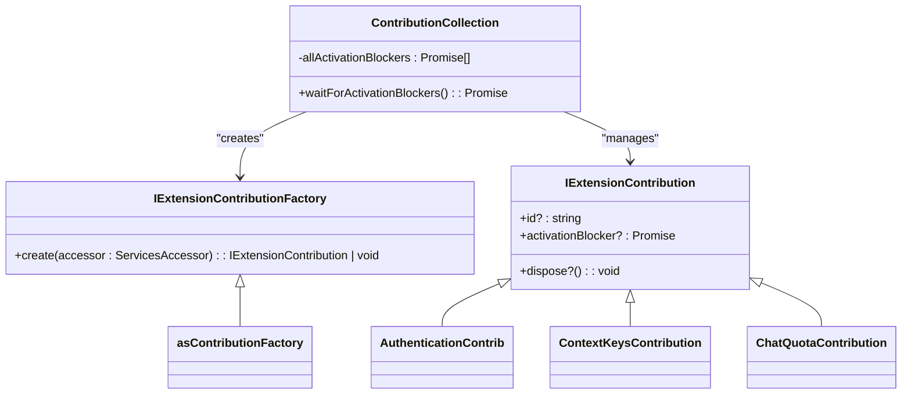
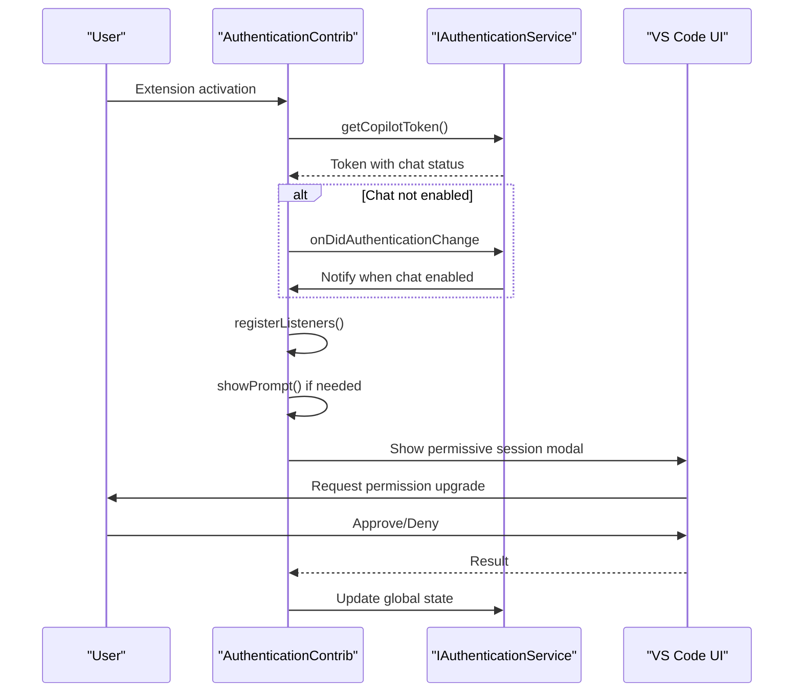
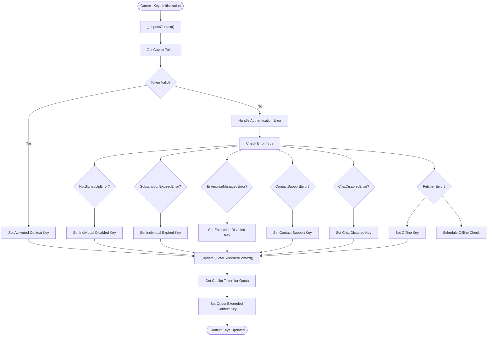
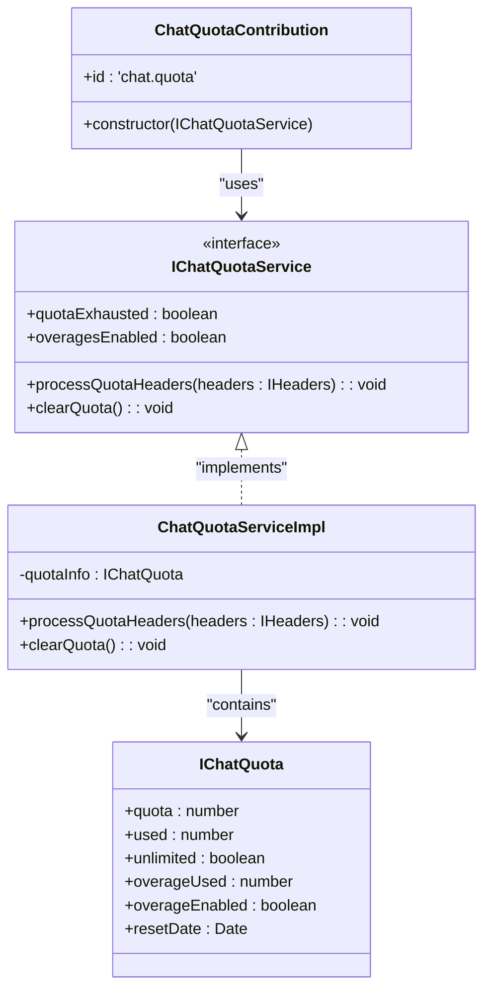
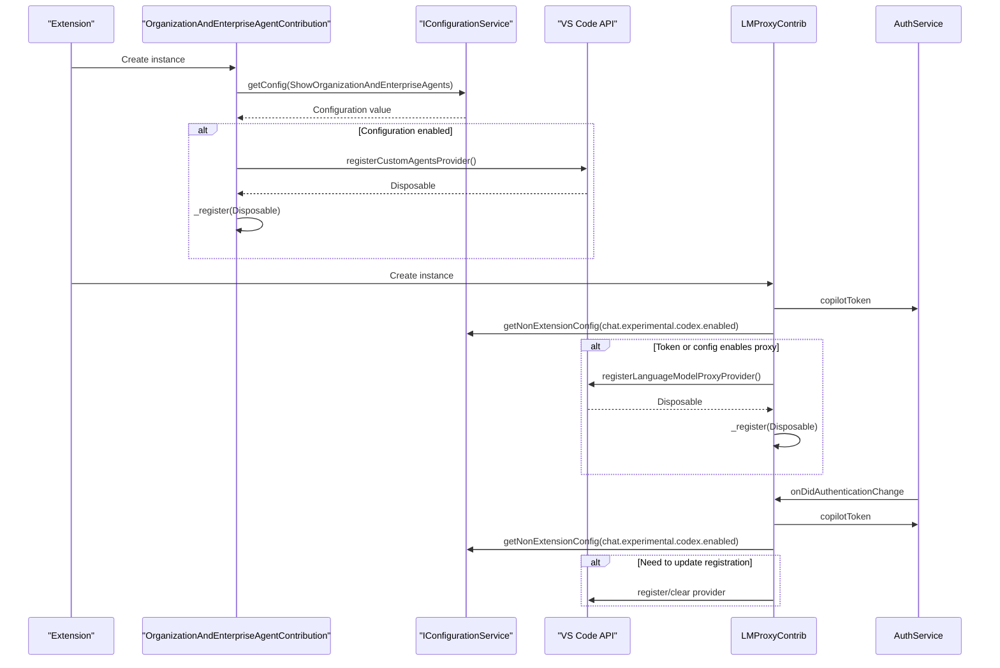
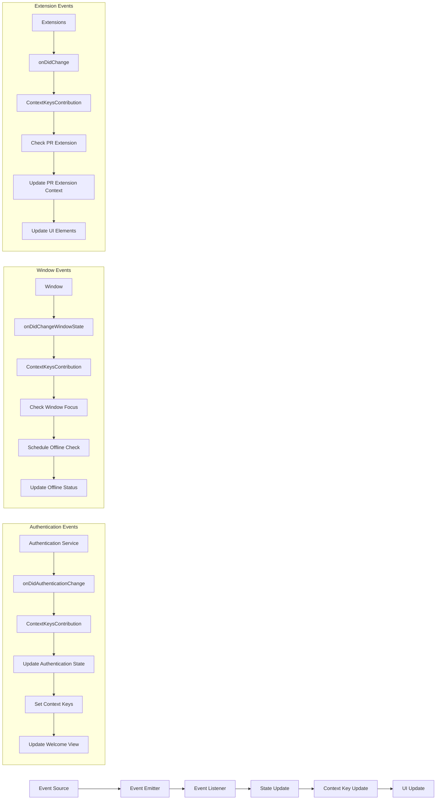
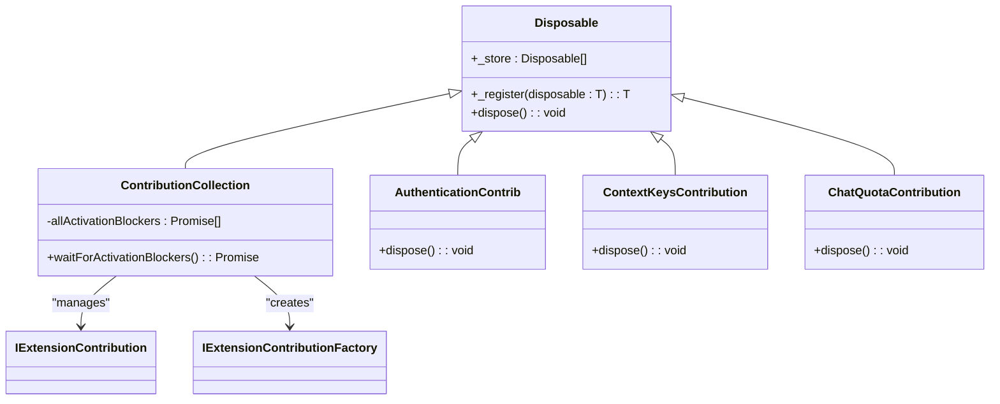

# Contribution Types

<cite>
**Referenced Files in This Document**   
- [contributions.ts](file://src/extension/common/contributions.ts)
- [authentication.contribution.ts](file://src/extension/authentication/vscode-node/authentication.contribution.ts)
- [contextKeys.contribution.ts](file://src/extension/contextKeys/vscode-node/contextKeys.contribution.ts)
- [chatQuota.contribution.ts](file://src/extension/chat/vscode-node/chatQuota.contribution.ts)
- [vscode-node/contributions.ts](file://src/extension/extension/vscode-node/contributions.ts)
- [vscode/contributions.ts](file://src/extension/extension/vscode/contributions.ts)
- [placeholderView.contribution.ts](file://src/extension/contextKeys/vscode-node/placeholderView.contribution.ts)
- [organizationAndEnterpriseAgentContrib.ts](file://src/extension/agents/vscode-node/organizationAndEnterpriseAgentContrib.ts)
- [lmProxyContrib.ts](file://src/extension/externalAgents/vscode-node/lmProxyContrib.ts)
- [chatQuotaService.ts](file://src/platform/chat/common/chatQuotaService.ts)
- [chatQuotaServiceImpl.ts](file://src/platform/chat/common/chatQuotaServiceImpl.ts)
</cite>

## Table of Contents
1. [Introduction](#introduction)
2. [Core Contribution Architecture](#core-contribution-architecture)
3. [Authentication Providers](#authentication-providers)
4. [Context Keys](#context-keys)
5. [Quota Management](#quota-management)
6. [Chat Participants](#chat-participants)
7. [Data Flow and Event Handling](#data-flow-and-event-handling)
8. [State Management and Resource Disposal](#state-management-and-resource-disposal)
9. [Best Practices for Contribution Design](#best-practices-for-contribution-design)
10. [Conclusion](#conclusion)

## Introduction
The VS Code Copilot Chat extension implements a modular contribution system that enables various functionality to be registered and integrated with the host environment. This document provides a comprehensive analysis of the different contribution types, focusing on chat participants, authentication providers, context keys, and quota management. Each contribution type follows specific interface requirements and implementation patterns that ensure proper integration with the VS Code host environment. The contribution system is designed to support both node.js and web extension hosts, with careful consideration for activation timing, resource management, and backward compatibility.

## Core Contribution Architecture

The contribution system in the VS Code Copilot Chat extension is built around a well-defined architecture that enables modular functionality to be registered and managed efficiently. At the core of this system is the `IExtensionContribution` interface defined in `contributions.ts`, which serves as the foundation for all contribution types. This interface provides a standardized way to manage the lifecycle of contributions through optional `dispose()` methods and activation blockers that can delay extension startup when necessary.

The architecture distinguishes between contributions that run in both web and node.js extension hosts versus those that are specific to the node.js environment. This is evident in the organization of contribution files, with `vscode/contributions.ts` containing contributions that can run anywhere, while `vscode-node/contributions.ts` contains those specific to the node.js extension host. The `ContributionCollection` class manages the lifecycle of multiple contributions, handling their activation and ensuring proper disposal when no longer needed.

**Diagram sources**
- [contributions.ts](file://src/extension/common/contributions.ts#L11-L25)
- [contributions.ts](file://src/extension/common/contributions.ts#L27-L29)
- [contributions.ts](file://src/extension/common/contributions.ts#L41-L77)

**Section sources**
- [contributions.ts](file://src/extension/common/contributions.ts#L1-L78)
- [vscode-node/contributions.ts](file://src/extension/extension/vscode-node/contributions.ts#L63-L123)
- [vscode/contributions.ts](file://src/extension/extension/vscode/contributions.ts#L20-L25)

## Authentication Providers

Authentication providers in the VS Code Copilot Chat extension are implemented as contributions that ensure users have the necessary permissions and tokens for accessing chat functionality. The `AuthenticationContrib` class is responsible for managing the authentication flow, particularly focusing on ensuring users have a token that is sufficient for making API calls within the current workspace. This contribution listens to authentication change events and shows prompts when necessary to upgrade permissions.

The authentication system includes a specialized `AuthUpgradeAsk` class that handles the logic for requesting permissive session upgrades. This class registers a command (`github.copilot.chat.triggerPermissiveSignIn`) that can be triggered to show a modal for upgrading authentication permissions. The implementation includes sophisticated logic for determining when to show prompts, including checking if the user already has chat access, monitoring window focus state, and tracking whether prompts have been shown in previous sessions.

**Diagram sources**
- [authentication.contribution.ts](file://src/extension/authentication/vscode-node/authentication.contribution.ts#L17-L113)
- [authentication.contribution.ts](file://src/extension/authentication/vscode-node/authentication.contribution.ts#L31-L113)

**Section sources**
- [authentication.contribution.ts](file://src/extension/authentication/vscode-node/authentication.contribution.ts#L1-L113)
- [vscode.d.ts](file://src/extension/vscode.d.ts#L18320-L18332)

## Context Keys

Context keys in the VS Code Copilot Chat extension are used to manage the state and visibility of various UI elements based on the user's authentication status, quota limits, and other conditions. The `ContextKeysContribution` class is responsible for setting and updating these context keys, which are then used by VS Code to control the visibility of commands, views, and other UI components.

The implementation defines several context keys for different states, including activation status, offline status, individual and enterprise disabled states, contact support requirements, and chat disabled status. These context keys are updated dynamically based on the user's authentication status and quota information. The contribution also manages special context keys for debugging, preview features, and integration with other extensions like the GitHub Pull Request extension.

**Diagram sources**
- [contextKeys.contribution.ts](file://src/extension/contextKeys/vscode-node/contextKeys.contribution.ts#L42-L231)
- [contextKeys.contribution.ts](file://src/extension/contextKeys/vscode-node/contextKeys.contribution.ts#L19-L27)

**Section sources**
- [contextKeys.contribution.ts](file://src/extension/contextKeys/vscode-node/contextKeys.contribution.ts#L1-L231)
- [placeholderView.contribution.ts](file://src/extension/contextKeys/vscode-node/placeholderView.contribution.ts#L1-L89)

## Quota Management

Quota management in the VS Code Copilot Chat extension is implemented through a dedicated contribution that handles the tracking and enforcement of usage limits for chat interactions. The `ChatQuotaContribution` class registers a command (`chat.enablePremiumOverages`) that allows users to enable premium overages when their quota is exhausted. This contribution integrates with the `IChatQuotaService` to access quota information and provide appropriate user feedback.

The quota system processes headers from API responses that contain quota information, parsing values such as entitlement, overage usage, overage permissions, and reset dates. The implementation includes logic to handle both free and premium users differently, with separate quota tracking for chat and premium interactions. When a user's quota is exhausted, the system can redirect them to a management page where they can enable overages or upgrade their plan.

**Diagram sources**
- [chatQuota.contribution.ts](file://src/extension/chat/vscode-node/chatQuota.contribution.ts#L10-L22)
- [chatQuotaService.ts](file://src/platform/chat/common/chatQuotaService.ts#L55-L63)
- [chatQuotaServiceImpl.ts](file://src/platform/chat/common/chatQuotaServiceImpl.ts#L40-L96)

**Section sources**
- [chatQuota.contribution.ts](file://src/extension/chat/vscode-node/chatQuota.contribution.ts#L1-L22)
- [chatQuotaService.ts](file://src/platform/chat/common/chatQuotaService.ts#L1-L63)
- [chatQuotaServiceImpl.ts](file://src/platform/chat/common/chatQuotaServiceImpl.ts#L1-L96)

## Chat Participants

Chat participants in the VS Code Copilot Chat extension are implemented as contributions that register custom agents and language model proxies with the VS Code chat system. These contributions enable integration with external AI services and provide specialized functionality for different use cases. The `OrganizationAndEnterpriseAgentContribution` class registers a provider for organization and enterprise agents, while the `LanguageModelProxyContrib` class registers a proxy provider for language models.

The implementation of chat participants follows a pattern where contributions check configuration settings and authentication status before registering providers. This ensures that providers are only registered when appropriate, such as when a user has the necessary permissions or when specific features are enabled in the configuration. The contributions also listen to authentication change events to dynamically register or unregister providers as the user's authentication status changes.

**Diagram sources**
- [organizationAndEnterpriseAgentContrib.ts](file://src/extension/agents/vscode-node/organizationAndEnterpriseAgentContrib.ts#L13-L31)
- [lmProxyContrib.ts](file://src/extension/externalAgents/vscode-node/lmProxyContrib.ts#L15-L39)

**Section sources**
- [organizationAndEnterpriseAgentContrib.ts](file://src/extension/agents/vscode-node/organizationAndEnterpriseAgentContrib.ts#L1-L31)
- [lmProxyContrib.ts](file://src/extension/externalAgents/vscode-node/lmProxyContrib.ts#L1-L39)
- [vscode-node/contributions.ts](file://src/extension/extension/vscode-node/contributions.ts#L121-L122)

## Data Flow and Event Handling

The data flow and event handling in the VS Code Copilot Chat extension's contribution system follows a well-defined pattern that ensures proper communication between components and responsive behavior to state changes. Contributions typically register listeners for relevant events, such as authentication changes, window state changes, or extension changes, and update their state accordingly.

The event handling system uses VS Code's event API to subscribe to changes and update context keys, register or unregister providers, and trigger UI updates. For example, the `ContextKeysContribution` listens to authentication changes and updates context keys to reflect the current authentication state. Similarly, the `LanguageModelProxyContrib` listens to authentication changes to dynamically register or unregister the language model proxy provider based on the user's permissions.

**Diagram sources**
- [contextKeys.contribution.ts](file://src/extension/contextKeys/vscode-node/contextKeys.contribution.ts#L60-L61)
- [contextKeys.contribution.ts](file://src/extension/contextKeys/vscode-node/contextKeys.contribution.ts#L68-L69)
- [contextKeys.contribution.ts](file://src/extension/contextKeys/vscode-node/contextKeys.contribution.ts#L79-L82)
- [lmProxyContrib.ts](file://src/extension/externalAgents/vscode-node/lmProxyContrib.ts#L37-L38)

**Section sources**
- [contextKeys.contribution.ts](file://src/extension/contextKeys/vscode-node/contextKeys.contribution.ts#L1-L231)
- [lmProxyContrib.ts](file://src/extension/externalAgents/vscode-node/lmProxyContrib.ts#L1-L39)

## State Management and Resource Disposal

State management and resource disposal are critical aspects of the contribution system in the VS Code Copilot Chat extension. Each contribution is responsible for properly managing its state and ensuring that resources are disposed of when no longer needed. This is achieved through the use of the `Disposable` class and the `IExtensionContribution` interface's `dispose()` method.

Contributions register their disposable resources with the parent disposable using the `_register()` method, which ensures that all resources are automatically disposed of when the contribution is disposed. This includes event listeners, command registrations, and any other resources that need to be cleaned up. The system also handles activation blockers, which are promises that delay extension startup until certain conditions are met, ensuring that contributions are properly initialized before the extension becomes fully active.

**Diagram sources**
- [contributions.ts](file://src/extension/common/contributions.ts#L41-L77)
- [authentication.contribution.ts](file://src/extension/authentication/vscode-node/authentication.contribution.ts#L17-L26)
- [contextKeys.contribution.ts](file://src/extension/contextKeys/vscode-node/contextKeys.contribution.ts#L42-L56)
- [chatQuota.contribution.ts](file://src/extension/chat/vscode-node/chatQuota.contribution.ts#L10-L14)

**Section sources**
- [contributions.ts](file://src/extension/common/contributions.ts#L1-L78)
- [authentication.contribution.ts](file://src/extension/authentication/vscode-node/authentication.contribution.ts#L1-L113)
- [contextKeys.contribution.ts](file://src/extension/contextKeys/vscode-node/contextKeys.contribution.ts#L1-L231)
- [chatQuota.contribution.ts](file://src/extension/chat/vscode-node/chatQuota.contribution.ts#L1-L22)

## Best Practices for Contribution Design

Designing new contribution types in the VS Code Copilot Chat extension requires adherence to several best practices to ensure proper integration, maintainability, and backward compatibility. First, contributions should prefer to be implemented in `vscode/contributions.ts` rather than `vscode-node/contributions.ts` whenever possible, as this allows them to run in both web and node.js extension hosts, maximizing their reach and usability.

Contributions should minimize the use of activation blockers, as these can delay extension startup and impact user experience. When activation blockers are necessary, they should be used judiciously and with clear documentation about their impact on startup performance. Additionally, contributions should properly manage their resources by registering disposables with the parent disposable and implementing the `dispose()` method to clean up any resources when the contribution is no longer needed.

Backward compatibility is maintained through careful versioning and feature detection. Contributions should check for the availability of APIs before using them and provide fallback behavior when necessary. Configuration settings should be used to enable or disable features, allowing users to control the behavior of contributions without requiring code changes. Finally, contributions should follow the established patterns for event handling and state management to ensure consistency across the codebase.

## Conclusion

The contribution system in the VS Code Copilot Chat extension provides a robust and flexible framework for integrating various functionality with the host environment. By following well-defined patterns for authentication providers, context keys, quota management, and chat participants, the system ensures that contributions are properly managed and integrated. The architecture supports both web and node.js extension hosts, with careful consideration for resource management, state handling, and backward compatibility. Understanding these contribution types and their implementation patterns is essential for developing new features and maintaining the existing functionality in the extension.