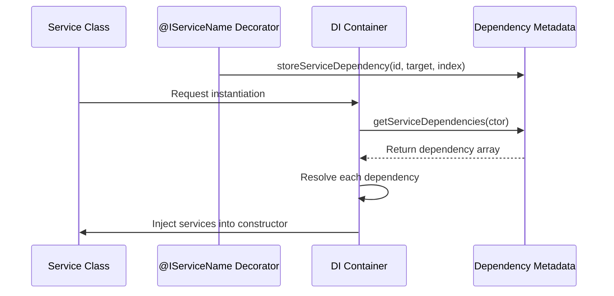
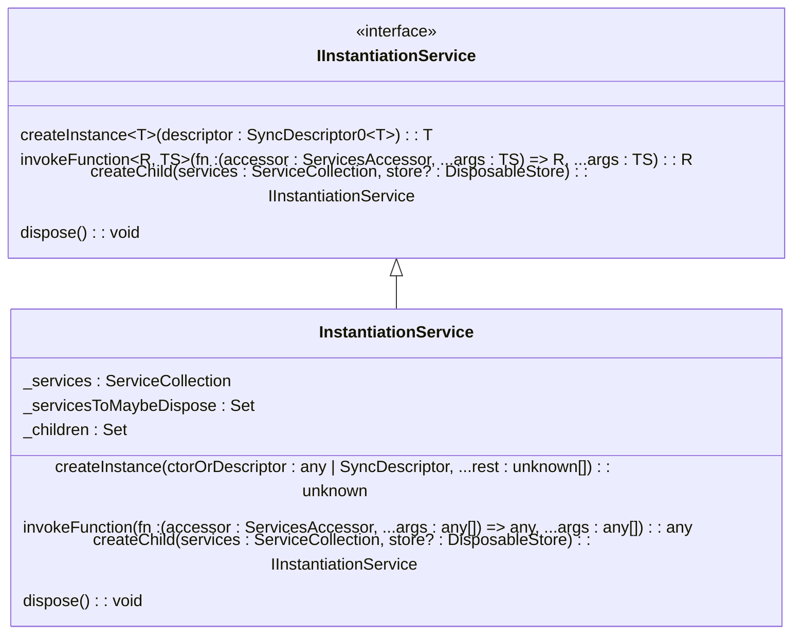
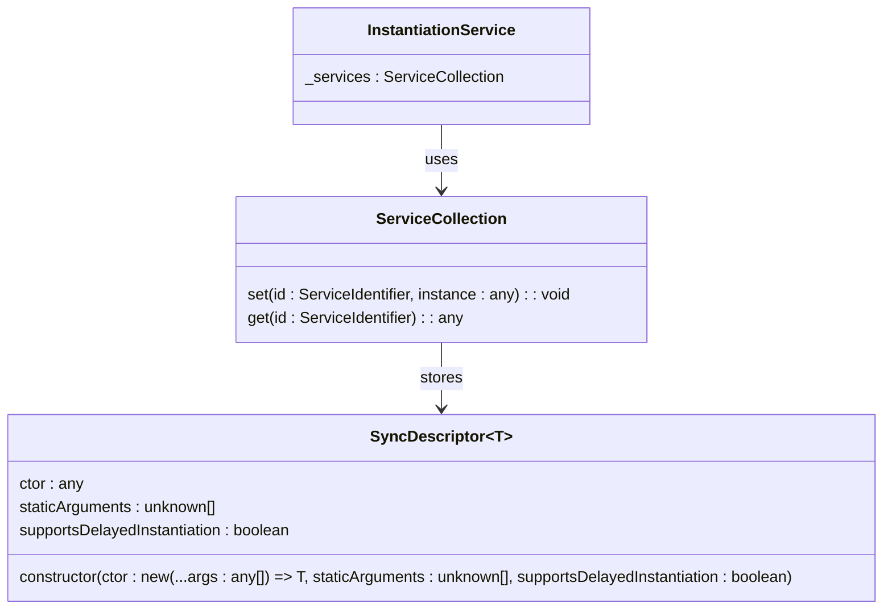
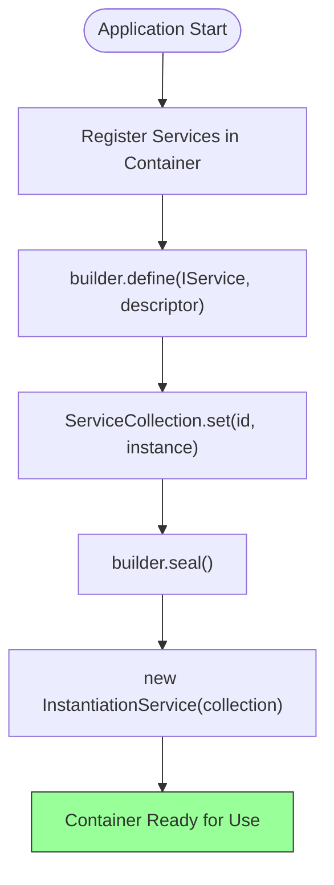
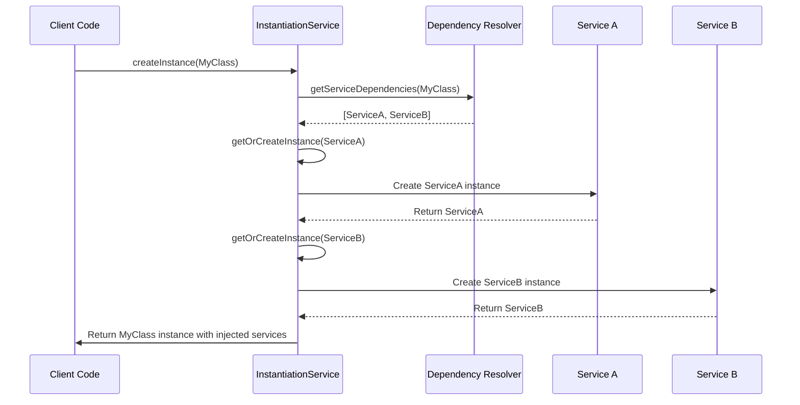
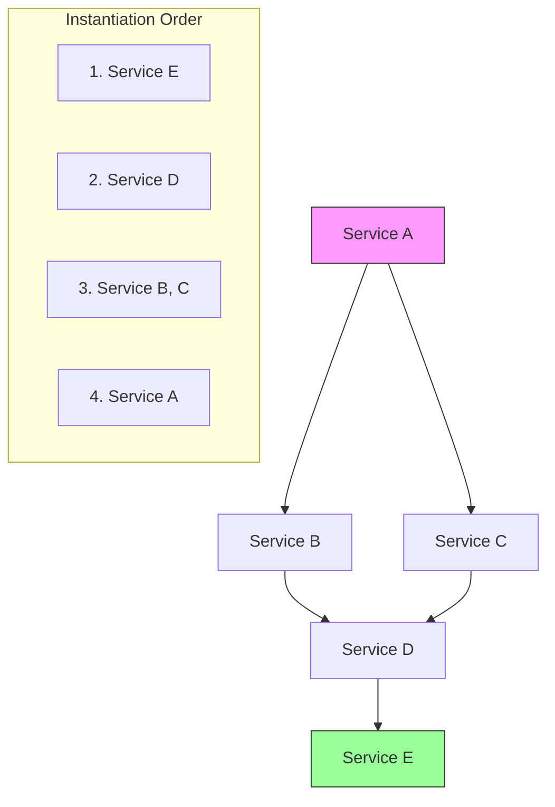
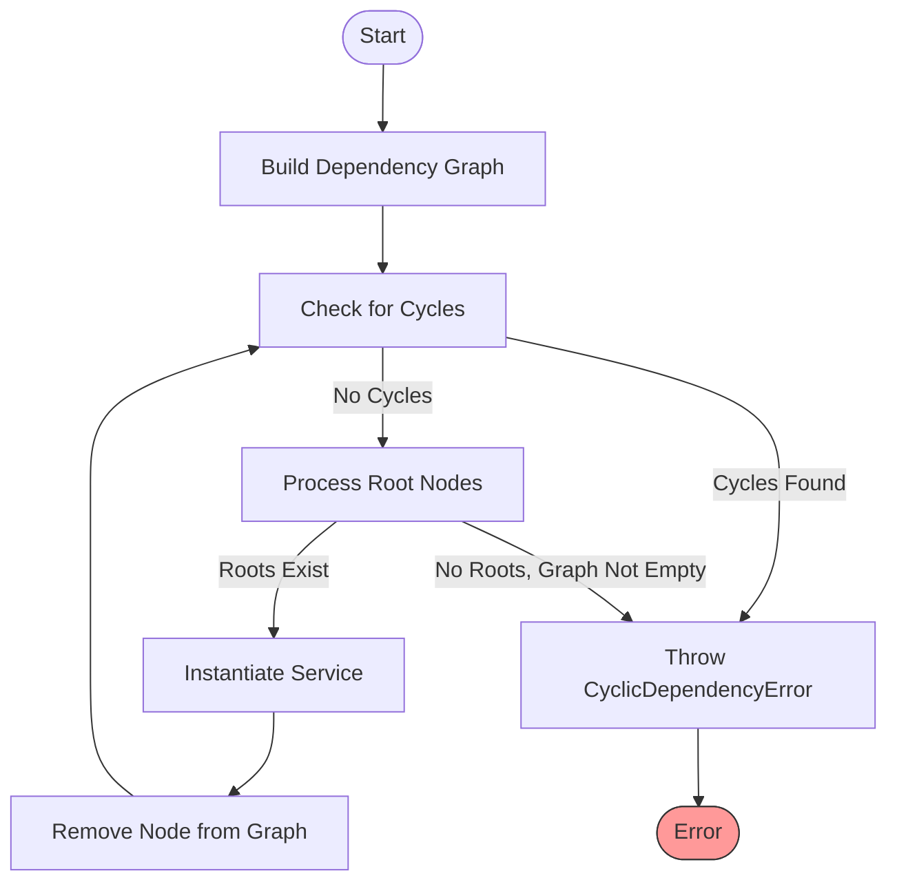
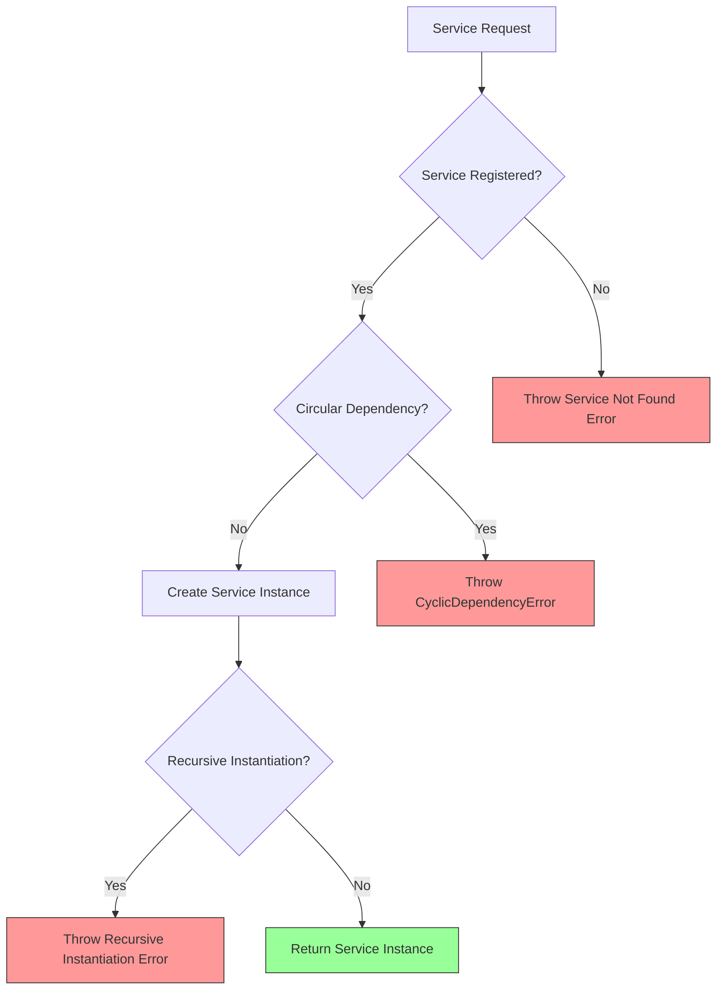
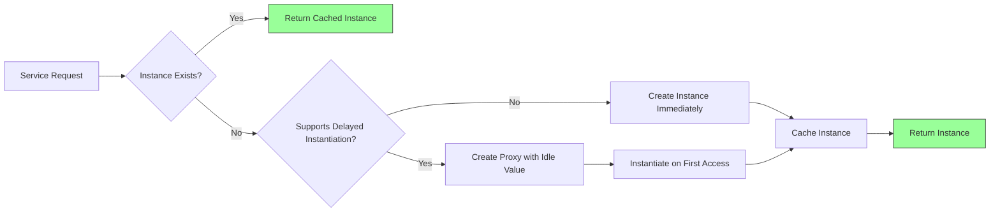

# Dependency Injection

<cite>
**Referenced Files in This Document**   
- [instantiation.ts](file://src/util/vs/platform/instantiation/common/instantiation.ts)
- [instantiationService.ts](file://src/util/vs/platform/instantiation/common/instantiationService.ts)
- [descriptors.ts](file://src/util/vs/platform/instantiation/common/descriptors.ts)
- [services.ts](file://src/util/common/services.ts)
- [services.ts](file://src/extension/extension/vscode/services.ts)
- [services.ts](file://src/platform/test/node/services.ts)
</cite>

## Table of Contents
1. [Introduction](#introduction)
2. [ServiceIdentifier Pattern](#serviceidentifier-pattern)
3. [Service Registration and Decorators](#service-registration-and-decorators)
4. [Instantiation Service and Lifecycle Management](#instantiation-service-and-lifecycle-management)
5. [Descriptor-Based Creation System](#descriptor-based-creation-system)
6. [Service Container and Registration](#service-container-and-registration)
7. [Constructor Parameter Injection](#constructor-parameter-injection)
8. [Graph-Based Instantiation Process](#graph-based-instantiation-process)
9. [Circular Dependency Detection](#circular-dependency-detection)
10. [Common Issues and Error Handling](#common-issues-and-error-handling)
11. [Performance Considerations and Caching](#performance-considerations-and-caching)
12. [Conclusion](#conclusion)

## Introduction
The vscode-copilot-chat extension implements a sophisticated dependency injection (DI) system that manages service lifecycle, resolves dependencies, and prevents circular dependencies. This system is based on a service identifier pattern, decorator-based service registration, and a graph-based instantiation process that ensures proper service creation order. The DI container provides a robust mechanism for managing component dependencies throughout the application, enabling loose coupling and improved testability.

**Section sources**
- [instantiation.ts](file://src/util/vs/platform/instantiation/common/instantiation.ts#L1-L134)
- [instantiationService.ts](file://src/util/vs/platform/instantiation/common/instantiationService.ts#L1-L485)

## ServiceIdentifier Pattern
The ServiceIdentifier pattern in vscode-copilot-chat provides a type-safe mechanism for identifying services within the dependency injection container. Each service is identified by a unique string identifier that is mapped to a specific service interface. The pattern uses a decorator function to create service identifiers that can be used to register and retrieve services from the container.

Service identifiers are implemented as functions that can be applied to constructor parameters, enabling the DI system to determine which services should be injected at runtime. The identifiers are stored in a global map to ensure uniqueness and prevent duplication. When a service is requested, the container uses the service identifier to locate the corresponding service instance or descriptor.

The ServiceIdentifier interface extends a function type with a special `_serviceBrand` property that enables TypeScript to enforce type safety. This approach allows the DI system to maintain type information at compile time while providing a flexible registration mechanism at runtime.

```mermaid
classDiagram
class ServiceIdentifier~T~ {
<<interface>>
(target : Function, key : string, index : number) void
type : T
}
class createDecorator {
createDecorator(serviceId : string) : ServiceIdentifier~T~
}
ServiceIdentifier <.. createDecorator : creates
```

**Diagram sources**
- [instantiation.ts](file://src/util/vs/platform/instantiation/common/instantiation.ts#L94-L133)

**Section sources**
- [instantiation.ts](file://src/util/vs/platform/instantiation/common/instantiation.ts#L94-L133)

## Service Registration and Decorators
The @IServiceName decorator implementation in vscode-copilot-chat enables declarative service registration through parameter decorators. When a service class constructor includes parameters decorated with a service identifier, the DI system automatically resolves and injects the appropriate service instances.

The decorator system works by storing metadata about service dependencies on the constructor function itself. When a class is instantiated, the DI container examines this metadata to determine which services are required. The `storeServiceDependency` function maintains a map of dependencies for each constructor, recording the service identifier and parameter index.

Service registration occurs through the `define` method of the `IInstantiationServiceBuilder` interface, which accepts a service identifier and either a service instance or a `SyncDescriptor`. This registration process establishes the mapping between service identifiers and their implementations, making them available for injection into other components.



**Diagram sources**
- [instantiation.ts](file://src/util/vs/platform/instantiation/common/instantiation.ts#L100-L133)
- [instantiationService.ts](file://src/util/vs/platform/instantiation/common/instantiationService.ts#L143-L172)

**Section sources**
- [instantiation.ts](file://src/util/vs/platform/instantiation/common/instantiation.ts#L100-L133)
- [instantiationService.ts](file://src/util/vs/platform/instantiation/common/instantiationService.ts#L143-L172)

## Instantiation Service and Lifecycle Management
The InstantiationService is the core component responsible for managing service lifecycle and resolving dependencies in the vscode-copilot-chat application. It implements the `IInstantiationService` interface, providing methods for creating instances, invoking functions with service access, and managing child containers.

The service maintains a collection of registered services and handles the creation of service instances on demand. When a service is requested, the instantiation service first checks if an instance already exists. If not, it creates a new instance using the registered descriptor and caches it for future requests. This ensures that services are typically singleton instances within their container scope.

Lifecycle management includes proper disposal of services when the container is disposed. The instantiation service tracks all created service instances and disposes of them in the reverse order of creation when the container is destroyed. It also manages child containers, ensuring that child services are properly disposed when the parent container is disposed.



**Diagram sources**
- [instantiationService.ts](file://src/util/vs/platform/instantiation/common/instantiationService.ts#L30-L89)

**Section sources**
- [instantiationService.ts](file://src/util/vs/platform/instantiation/common/instantiationService.ts#L30-L89)

## Descriptor-Based Creation System
The descriptor-based creation system in vscode-copilot-chat uses the `SyncDescriptor` class to provide metadata for service instantiation. This descriptor contains information about the service constructor, static arguments, and instantiation behavior, enabling the DI container to create service instances with the appropriate configuration.

The `SyncDescriptor` class stores three key pieces of information: the constructor function (`ctor`), an array of static arguments (`staticArguments`), and a flag indicating whether the service supports delayed instantiation (`supportsDelayedInstantiation`). This metadata allows the container to create service instances with the correct parameters and instantiation strategy.

The descriptor system enables flexible service configuration, such as passing specific arguments to service constructors or controlling when services are actually instantiated. For services that support delayed instantiation, the container creates a proxy that instantiates the service only when first accessed, improving startup performance by deferring the creation of rarely-used services.



**Diagram sources**
- [descriptors.ts](file://src/util/vs/platform/instantiation/common/descriptors.ts#L8-L19)
- [instantiationService.ts](file://src/util/vs/platform/instantiation/common/instantiationService.ts#L42-L46)

**Section sources**
- [descriptors.ts](file://src/util/vs/platform/instantiation/common/descriptors.ts#L8-L19)
- [instantiationService.ts](file://src/util/vs/platform/instantiation/common/instantiationService.ts#L42-L46)

## Service Container and Registration
The service container in vscode-copilot-chat is implemented through the `ServiceCollection` class and `IInstantiationServiceBuilder` interface, providing a structured approach to service registration and management. Services are registered in the container using the `define` method, which maps a service identifier to either a service instance or a `SyncDescriptor`.

The registration process occurs during application initialization, typically in service registration modules like `services.ts` files. These modules define all the services required by a particular component or feature, creating a centralized location for service configuration. The `registerServices` function in the extension's services module demonstrates this pattern, registering various services with their corresponding implementations.

The container supports hierarchical service resolution through the `createChild` method, which creates a child container that inherits services from its parent while allowing for overrides. This enables scoped service configurations, such as providing different implementations for testing versus production environments.



**Diagram sources**
- [services.ts](file://src/extension/extension/vscode/services.ts#L111-L176)
- [services.ts](file://src/util/common/services.ts#L20-L43)

**Section sources**
- [services.ts](file://src/extension/extension/vscode/services.ts#L111-L176)
- [services.ts](file://src/util/common/services.ts#L20-L43)

## Constructor Parameter Injection
Constructor parameter injection in vscode-copilot-chat is implemented through the combination of service decorators and the instantiation service's dependency resolution mechanism. When a class is instantiated, the DI container examines the constructor parameters for service dependencies and automatically injects the appropriate service instances.

The injection process begins with the `createInstance` method of the `InstantiationService`, which uses reflection to determine the service dependencies of the target constructor. The `_util.getServiceDependencies` function retrieves the metadata stored by the service decorators, providing a list of service identifiers and their parameter indices.

During instantiation, the container creates an array of service arguments by resolving each dependency through the `_getOrCreateServiceInstance` method. These service arguments are then concatenated with any static arguments and passed to the constructor using `Reflect.construct`. This approach ensures that services are properly injected while maintaining type safety and allowing for additional constructor parameters.



**Diagram sources**
- [instantiationService.ts](file://src/util/vs/platform/instantiation/common/instantiationService.ts#L143-L172)
- [instantiation.ts](file://src/util/vs/platform/instantiation/common/instantiation.ts#L100-L107)

**Section sources**
- [instantiationService.ts](file://src/util/vs/platform/instantiation/common/instantiationService.ts#L143-L172)

## Graph-Based Instantiation Process
The graph-based instantiation process in vscode-copilot-chat ensures proper service creation order and prevents circular dependencies through a directed acyclic graph (DAG) representation of service dependencies. When creating a service with dependencies, the instantiation service builds a dependency graph and performs a topological sort to determine the correct instantiation order.

The process begins by creating a graph where each node represents a service to be instantiated, and edges represent dependencies between services. The algorithm uses a depth-first search approach to traverse the dependency tree, starting from the requested service and exploring all its dependencies. As each dependency is discovered, it's added as a node in the graph with edges to its own dependencies.

Once the complete dependency graph is constructed, the instantiation service performs a topological sort by repeatedly identifying and processing root nodes (services with no unresolved dependencies). This ensures that services are created in the correct order, with dependencies being instantiated before the services that depend on them.



**Diagram sources**
- [instantiationService.ts](file://src/util/vs/platform/instantiation/common/instantiationService.ts#L224-L288)

**Section sources**
- [instantiationService.ts](file://src/util/vs/platform/instantiation/common/instantiationService.ts#L224-L288)

## Circular Dependency Detection
Circular dependency detection in vscode-copilot-chat is implemented through both static analysis during graph construction and runtime protection against recursive instantiation. The system employs multiple mechanisms to identify and prevent circular dependencies that could lead to infinite loops or stack overflows.

During the graph-based instantiation process, the algorithm detects cycles by checking for empty roots while the graph still contains nodes. If no root nodes are found but the graph is not empty, a cycle exists. The system also implements a cycle counter heuristic that throws an error if the traversal exceeds 1000 iterations, preventing infinite loops in complex dependency graphs.

Additionally, the instantiation service maintains a set of actively instantiating services (`_activeInstantiations`) to prevent direct recursion. When a service attempts to instantiate itself directly or through a short cycle, the system detects this through the active instantiations set and throws an error immediately.



**Diagram sources**
- [instantiationService.ts](file://src/util/vs/platform/instantiation/common/instantiationService.ts#L226-L273)
- [instantiationService.ts](file://src/util/vs/platform/instantiation/common/instantiationService.ts#L206-L219)

**Section sources**
- [instantiationService.ts](file://src/util/vs/platform/instantiation/common/instantiationService.ts#L206-L273)

## Common Issues and Error Handling
The dependency injection system in vscode-copilot-chat addresses several common issues through comprehensive error handling and diagnostic capabilities. The most frequent issues include service not found errors, circular dependencies, and improper service disposal.

Service not found errors occur when a requested service has not been registered in the container. The system handles this by checking for the existence of service descriptors in the `_getServiceInstanceOrDescriptor` method and throwing a descriptive error when a service is not found. The strict mode configuration can be used to enforce that all dependencies are properly registered.

Circular dependency errors are detected through the graph-based instantiation process and throw a `CyclicDependencyError` with a detailed message that includes the cycle path. This helps developers identify and resolve dependency loops in their service architecture.

The system also provides protection against recursive instantiation through the `_activeInstantiations` set, which tracks services currently being instantiated and prevents direct recursion. This ensures that even if circular dependencies exist, they are detected and reported rather than causing stack overflows.



**Diagram sources**
- [instantiationService.ts](file://src/util/vs/platform/instantiation/common/instantiationService.ts#L198-L203)
- [instantiationService.ts](file://src/util/vs/platform/instantiation/common/instantiationService.ts#L249-L250)
- [instantiationService.ts](file://src/util/vs/platform/instantiation/common/instantiationService.ts#L210-L212)

**Section sources**
- [instantiationService.ts](file://src/util/vs/platform/instantiation/common/instantiationService.ts#L198-L273)

## Performance Considerations and Caching
The dependency injection system in vscode-copilot-chat incorporates several performance optimizations and caching strategies to minimize overhead and improve application startup time. The primary caching mechanism is the service instance cache within the `ServiceCollection`, which ensures that services are instantiated only once and reused for subsequent requests.

For services that support delayed instantiation, the system uses a proxy pattern with `GlobalIdleValue` to defer instantiation until the service is first accessed. This lazy loading approach improves startup performance by avoiding the creation of services that may not be needed during a particular session.

The system also implements tracing and diagnostic capabilities that can be enabled to identify performance bottlenecks in service instantiation. The `Trace` class records the duration of service creation and invocation, helping developers optimize critical paths in the application.

Memory usage is managed through proper disposal of services when containers are destroyed. The instantiation service tracks all created service instances and disposes of them in the reverse order of creation, preventing memory leaks and ensuring proper cleanup of resources.



**Diagram sources**
- [instantiationService.ts](file://src/util/vs/platform/instantiation/common/instantiationService.ts#L301-L343)
- [instantiationService.ts](file://src/util/vs/platform/instantiation/common/instantiationService.ts#L174-L182)

**Section sources**
- [instantiationService.ts](file://src/util/vs/platform/instantiation/common/instantiationService.ts#L301-L343)

## Conclusion
The dependency injection system in vscode-copilot-chat provides a robust and flexible framework for managing service dependencies and lifecycle. Through the ServiceIdentifier pattern, decorator-based registration, and graph-based instantiation, the system enables loose coupling between components while ensuring proper service creation order and preventing circular dependencies.

Key strengths of the system include its type safety, hierarchical container structure, and comprehensive error handling. The descriptor-based creation system allows for flexible service configuration, while the lazy instantiation capabilities improve performance by deferring the creation of non-essential services.

The implementation draws from proven patterns in software architecture, providing a solid foundation for the extension's complex functionality. By centralizing service management and dependency resolution, the system enhances maintainability, testability, and scalability of the codebase.

**Section sources**
- [instantiation.ts](file://src/util/vs/platform/instantiation/common/instantiation.ts#L1-L134)
- [instantiationService.ts](file://src/util/vs/platform/instantiation/common/instantiationService.ts#L1-L485)
- [descriptors.ts](file://src/util/vs/platform/instantiation/common/descriptors.ts#L1-L24)