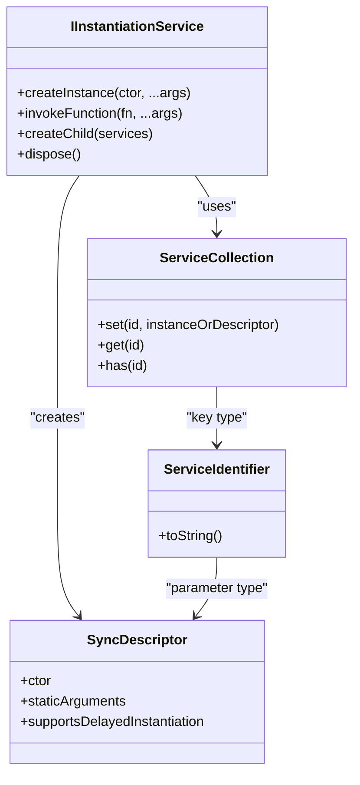
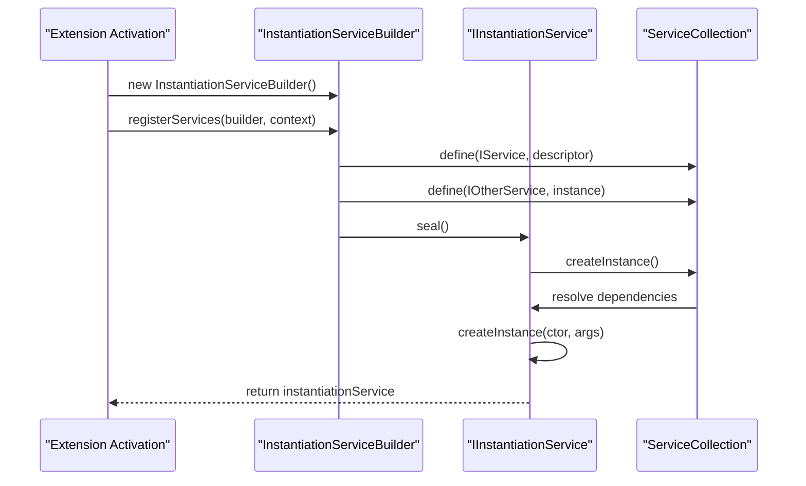
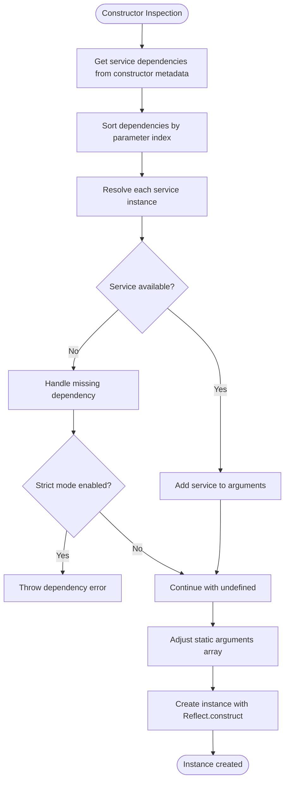
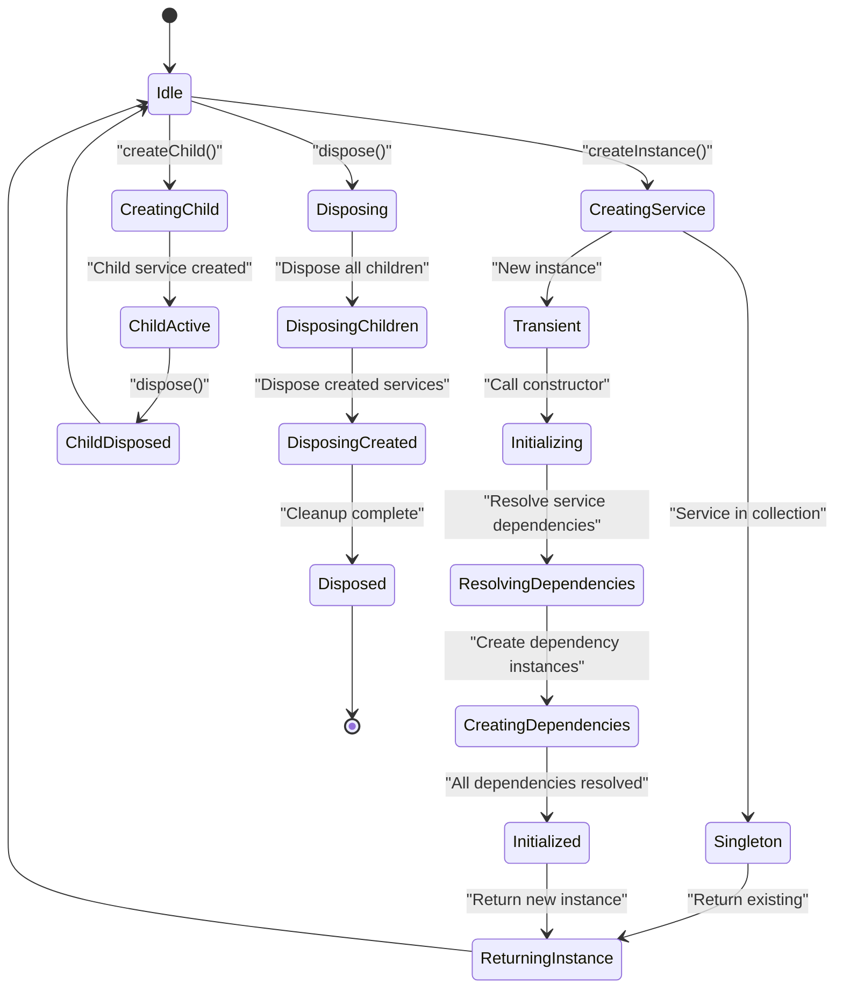
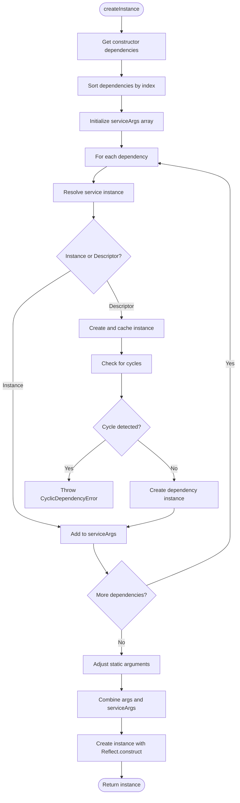
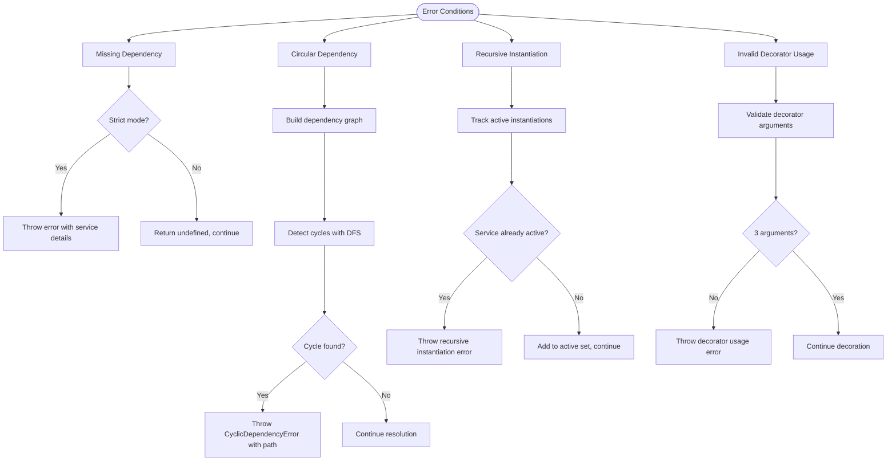
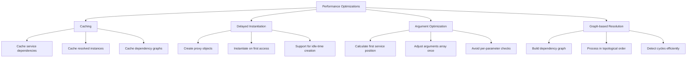
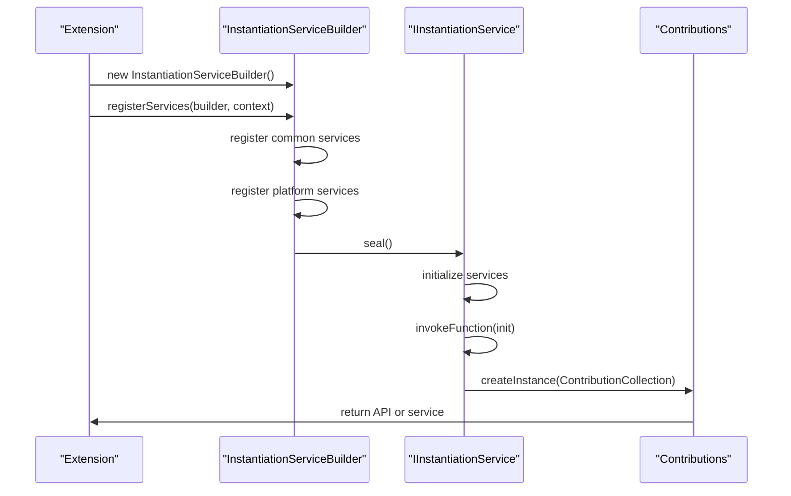

# Dependency Resolution

<cite>
**Referenced Files in This Document**   
- [instantiation.ts](file://src/util/vs/platform/instantiation/common/instantiation.ts)
- [instantiationService.ts](file://src/util/vs/platform/instantiation/common/instantiationService.ts)
- [descriptors.ts](file://src/util/vs/platform/instantiation/common/descriptors.ts)
- [serviceCollection.ts](file://src/util/vs/platform/instantiation/common/serviceCollection.ts)
- [services.ts](file://src/extension/extension/vscode/services.ts)
- [services.ts](file://src/extension/extension/vscode-node/services.ts)
- [extension.ts](file://src/extension/extension/vscode/extension.ts)
- [extension.ts](file://src/extension/extension/vscode-node/extension.ts)
- [services.ts](file://src/util/common/services.ts)
</cite>

## Table of Contents
1. [Introduction](#introduction)
2. [Core Dependency Injection Mechanism](#core-dependency-injection-mechanism)
3. [Service Registration and Instantiation](#service-registration-and-instantiation)
4. [Constructor Parameter Inspection](#constructor-parameter-inspection)
5. [Service Lifecycle and Scopes](#service-lifecycle-and-scopes)
6. [Dependency Resolution Process](#dependency-resolution-process)
7. [Error Handling and Validation](#error-handling-and-validation)
8. [Performance Considerations](#performance-considerations)
9. [Extension Activation Flow](#extension-activation-flow)
10. [Best Practices](#best-practices)

## Introduction

The dependency resolution system in vscode-copilot-chat is a sophisticated inversion of control container that manages the lifecycle and dependencies of services throughout the extension. This system enables loose coupling between components by automatically resolving and injecting dependencies based on type information and constructor signatures. The architecture follows a service locator pattern with dependency injection capabilities, allowing components to declare their dependencies without knowing the concrete implementations.

The system is built on a foundation of TypeScript decorators, reflection, and a custom instantiation service that analyzes constructor parameters to determine required dependencies. This approach enables a clean separation of concerns, where components focus on their business logic while the framework handles the complex task of dependency resolution and object creation.

**Section sources**
- [instantiation.ts](file://src/util/vs/platform/instantiation/common/instantiation.ts#L1-L134)
- [instantiationService.ts](file://src/util/vs/platform/instantiation/common/instantiationService.ts#L1-L485)

## Core Dependency Injection Mechanism

The dependency injection system in vscode-copilot-chat is centered around the `IInstantiationService` interface, which serves as the primary entry point for creating instances and resolving dependencies. The system uses TypeScript decorators to annotate constructor parameters with service identifiers, enabling the instantiation service to inspect constructor signatures at runtime and resolve the appropriate dependencies.

The core mechanism relies on the `createDecorator` function, which generates service identifiers that serve as tokens for dependency lookup. These identifiers are used with the `@IServiceName` decorator pattern to mark constructor parameters that should be resolved by the dependency injection container. When a class is instantiated, the instantiation service analyzes these annotations to determine which services are required and injects the appropriate instances.

The system supports both eager and lazy instantiation through the `SyncDescriptor` class, which can be configured to support delayed instantiation. This allows for optimization of resource usage by deferring the creation of expensive services until they are actually needed, while still maintaining the benefits of dependency injection.

**Diagram sources**
- [instantiation.ts](file://src/util/vs/platform/instantiation/common/instantiation.ts#L39-L133)
- [instantiationService.ts](file://src/util/vs/platform/instantiation/common/instantiationService.ts#L30-L485)
- [descriptors.ts](file://src/util/vs/platform/instantiation/common/descriptors.ts#L8-L24)
- [serviceCollection.ts](file://src/util/vs/platform/instantiation/common/serviceCollection.ts#L11-L35)

**Section sources**
- [instantiation.ts](file://src/util/vs/platform/instantiation/common/instantiation.ts#L39-L133)
- [instantiationService.ts](file://src/util/vs/platform/instantiation/common/instantiationService.ts#L30-L485)

## Service Registration and Instantiation

Service registration in vscode-copilot-chat occurs through the `IInstantiationServiceBuilder` interface, which provides a fluent API for defining services and their implementations. The registration process involves mapping service identifiers to either concrete instances or descriptors that contain information about how to instantiate the service.

The system distinguishes between different types of service registrations:
- **Instance registration**: Direct registration of already-created instances
- **Descriptor registration**: Registration using `SyncDescriptor` which contains the constructor, static arguments, and instantiation options
- **Conditional registration**: Services that are registered based on runtime conditions such as extension mode or environment

During extension activation, services are registered in a specific order, with common services registered first in the `vscode/services.ts` file, followed by platform-specific services in `vscode-node/services.ts`. This hierarchical approach ensures that shared services are available across different execution contexts while allowing platform-specific implementations where needed.

The instantiation process is triggered when a service is requested through `createInstance` or when a function is invoked through `invokeFunction`. The instantiation service resolves all dependencies by recursively creating instances of required services, ensuring that the complete dependency graph is satisfied before returning the requested instance.

**Diagram sources**
- [services.ts](file://src/extension/extension/vscode/services.ts#L111-L177)
- [services.ts](file://src/extension/extension/vscode-node/services.ts#L119-L207)
- [services.ts](file://src/util/common/services.ts#L20-L43)
- [extension.ts](file://src/extension/extension/vscode/extension.ts#L92-L107)

**Section sources**
- [services.ts](file://src/extension/extension/vscode/services.ts#L111-L177)
- [services.ts](file://src/extension/extension/vscode-node/services.ts#L119-L207)
- [services.ts](file://src/util/common/services.ts#L20-L43)

## Constructor Parameter Inspection

The dependency resolution system performs constructor parameter inspection through a combination of TypeScript decorators and runtime reflection. When a service identifier is created using `createDecorator`, it returns a function that can be used as a decorator to mark constructor parameters. This decorator function calls `storeServiceDependency` to record the service identifier and parameter index in a metadata store associated with the constructor.

During instantiation, the `_createInstance` method uses `_util.getServiceDependencies` to retrieve the list of service dependencies for a given constructor. This function accesses the metadata stored on the constructor function to determine which parameters require dependency injection and their corresponding service identifiers. The dependencies are then sorted by index to ensure they are injected in the correct order.

The system handles both service dependencies and regular constructor arguments by calculating the position where service parameters begin. If there's a mismatch between the number of static arguments and the position of the first service parameter, the system automatically adjusts the argument array by padding or truncating it as needed. This flexibility allows services to be instantiated with varying numbers of static arguments while maintaining consistent dependency injection.

The inspection process also supports optional dependencies through the service collection's lookup mechanism, which can return undefined for services that are not registered. This allows components to gracefully handle the absence of certain services rather than failing at instantiation time.

**Diagram sources**
- [instantiation.ts](file://src/util/vs/platform/instantiation/common/instantiation.ts#L100-L108)
- [instantiationService.ts](file://src/util/vs/platform/instantiation/common/instantiationService.ts#L143-L172)
- [instantiation.ts](file://src/util/vs/platform/instantiation/common/instantiation.ts#L21-L23)

**Section sources**
- [instantiation.ts](file://src/util/vs/platform/instantiation/common/instantiation.ts#L100-L133)
- [instantiationService.ts](file://src/util/vs/platform/instantiation/common/instantiationService.ts#L143-L172)

## Service Lifecycle and Scopes

The dependency resolution system in vscode-copilot-chat implements a sophisticated lifecycle management mechanism that handles the creation, usage, and disposal of services. Services can exist in different scopes, including singleton instances that are shared across the application and transient instances that are created fresh for each request.

Singleton services are managed by the service collection, which stores the created instance and returns the same instance on subsequent requests. This is the default behavior for services registered with a `SyncDescriptor`. The instantiation service ensures that singleton services are only created once, even when multiple dependencies request the same service, preventing unnecessary object creation and memory usage.

Transient services can be created by directly calling `createInstance` without registering a descriptor, allowing for multiple instances of the same type with different configurations. The system also supports child instantiation services through the `createChild` method, which inherit all parent services but can override or add new services. Child services form a hierarchy where disposal of a parent service also disposes all its children, creating well-defined lifecycle boundaries.

The system implements automatic disposal of services through the `dispose` method, which disposes all services created by the instantiation service and all its children. However, it does not dispose services that were provided as instances during registration, following the principle that the creator is responsible for disposal. This approach prevents memory leaks while respecting ownership semantics.

**Diagram sources**
- [instantiationService.ts](file://src/util/vs/platform/instantiation/common/instantiationService.ts#L52-L67)
- [instantiationService.ts](file://src/util/vs/platform/instantiation/common/instantiationService.ts#L75-L89)
- [instantiationService.ts](file://src/util/vs/platform/instantiation/common/instantiationService.ts#L209-L219)

**Section sources**
- [instantiationService.ts](file://src/util/vs/platform/instantiation/common/instantiationService.ts#L52-L89)

## Dependency Resolution Process

The dependency resolution process in vscode-copilot-chat is a multi-stage operation that ensures all dependencies are properly resolved before creating an instance. The process begins when `createInstance` is called, which delegates to `_createInstance` to handle the actual instantiation logic.

The first step is to retrieve the service dependencies from the constructor metadata using `_util.getServiceDependencies`. These dependencies are sorted by their parameter index to ensure they are resolved in the correct order. For each dependency, the system calls `_getOrCreateServiceInstance` to either retrieve an existing instance or create a new one.

To handle complex dependency graphs, the system uses a graph-based approach to detect and prevent circular dependencies. It builds a dependency graph during resolution and performs cycle detection using a depth-first search algorithm. If a cycle is detected, a `CyclicDependencyError` is thrown, preventing infinite recursion and helping developers identify problematic dependency patterns.

The resolution process also handles the distinction between services that are already instantiated and those that are represented by descriptors. For descriptor-based services, the system recursively resolves their dependencies before creating the instance, ensuring that the entire dependency tree is satisfied. The system maintains a set of active instantiations to detect and prevent recursive instantiation of the same service, which could lead to stack overflow errors.

**Diagram sources**
- [instantiationService.ts](file://src/util/vs/platform/instantiation/common/instantiationService.ts#L143-L289)
- [instantiationService.ts](file://src/util/vs/platform/instantiation/common/instantiationService.ts#L221-L289)
- [instantiationService.ts](file://src/util/vs/platform/instantiation/common/instantiationService.ts#L206-L219)

**Section sources**
- [instantiationService.ts](file://src/util/vs/platform/instantiation/common/instantiationService.ts#L143-L289)

## Error Handling and Validation

The dependency resolution system includes comprehensive error handling and validation mechanisms to ensure robust operation and provide meaningful feedback when issues occur. The system operates in both strict and non-strict modes, with strict mode enabled by default in production environments.

In strict mode, the system throws errors for missing dependencies, circular dependencies, and recursive instantiation attempts. For missing dependencies, the `_throwIfStrict` method is called with an appropriate error message, which includes the service name and the missing dependency identifier. This helps developers quickly identify and fix registration issues.

Circular dependency detection is implemented using a graph-based algorithm that tracks dependencies during resolution. When a cycle is detected, a `CyclicDependencyError` is thrown with a detailed message that includes the cycle path, making it easier to understand and resolve the issue. The system also includes a heuristic to prevent infinite loops during cycle detection by limiting the number of iterations to 1000.

The system provides validation for decorator usage, ensuring that service decorators are only applied to constructor parameters. It also validates that services are not being instantiated recursively, which could lead to stack overflow errors. These validation checks are performed at runtime and provide immediate feedback during development.

**Diagram sources**
- [instantiationService.ts](file://src/util/vs/platform/instantiation/common/instantiationService.ts#L396-L403)
- [instantiationService.ts](file://src/util/vs/platform/instantiation/common/instantiationService.ts#L226-L273)
- [instantiationService.ts](file://src/util/vs/platform/instantiation/common/instantiationService.ts#L206-L219)
- [instantiation.ts](file://src/util/vs/platform/instantiation/common/instantiation.ts#L119-L121)

**Section sources**
- [instantiationService.ts](file://src/util/vs/platform/instantiation/common/instantiationService.ts#L150-L152)
- [instantiationService.ts](file://src/util/vs/platform/instantiation/common/instantiationService.ts#L248-L250)
- [instantiationService.ts](file://src/util/vs/platform/instantiation/common/instantiationService.ts#L210-L212)

## Performance Considerations

The dependency resolution system in vscode-copilot-chat incorporates several performance optimizations to minimize the overhead of dependency injection while maintaining its flexibility and power. The system uses caching extensively to avoid repeated reflection and dependency analysis, storing service dependencies and resolved instances for quick retrieval.

One key optimization is the support for delayed instantiation through the `supportsDelayedInstantiation` flag in `SyncDescriptor`. When enabled, this creates a proxy object that defers instantiation until the service is actually accessed, allowing expensive services to be created only when needed. This is particularly useful for services that are rarely used or have high initialization costs.

The system also optimizes the argument preparation process by calculating the position of the first service parameter and adjusting the static arguments array accordingly. This avoids the need to iterate through all constructor parameters to determine which ones are services versus regular arguments.

For large dependency graphs, the system uses a graph-based resolution algorithm that processes dependencies in topological order, minimizing the number of recursive calls and preventing redundant work. The cycle detection algorithm includes a heuristic limit to prevent excessive computation in pathological cases.

**Diagram sources**
- [instantiationService.ts](file://src/util/vs/platform/instantiation/common/instantiationService.ts#L308-L343)
- [instantiationService.ts](file://src/util/vs/platform/instantiation/common/instantiationService.ts#L156-L168)
- [instantiationService.ts](file://src/util/vs/platform/instantiation/common/instantiationService.ts#L221-L289)

**Section sources**
- [instantiationService.ts](file://src/util/vs/platform/instantiation/common/instantiationService.ts#L308-L343)
- [instantiationService.ts](file://src/util/vs/platform/instantiation/common/instantiationService.ts#L156-L168)

## Extension Activation Flow

The extension activation process in vscode-copilot-chat follows a well-defined flow that initializes the dependency injection system and registers all required services. The process begins in the platform-specific extension file (e.g., `vscode-node/extension.ts`), which imports the shared activation logic from `vscode/extension.ts`.

The activation flow creates an `InstantiationServiceBuilder` and calls the appropriate `registerServices` function to populate the service collection with all required services. Common services are registered first in `vscode/services.ts`, followed by platform-specific services in `vscode-node/services.ts`. This hierarchical registration ensures that shared services are available across different execution contexts.

Once all services are registered, the builder is sealed to create the final `IInstantiationService` instance. This service is then used to invoke initialization functions and create contribution objects that integrate with the VS Code API. The activation process also handles special cases such as test mode, where certain services are replaced with mock implementations.

The extension returns either the instantiation service (in test mode) or an API object that provides access to extension functionality, ensuring that the dependency injection system remains the central coordinator of application components throughout the extension's lifecycle.

**Diagram sources**
- [extension.ts](file://src/extension/extension/vscode-node/extension.ts#L35-L43)
- [extension.ts](file://src/extension/extension/vscode/extension.ts#L33-L107)
- [services.ts](file://src/extension/extension/vscode/services.ts#L111-L177)
- [services.ts](file://src/extension/extension/vscode-node/services.ts#L119-L207)

**Section sources**
- [extension.ts](file://src/extension/extension/vscode-node/extension.ts#L35-L43)
- [extension.ts](file://src/extension/extension/vscode/extension.ts#L33-L107)

## Best Practices

When working with the dependency resolution system in vscode-copilot-chat, several best practices should be followed to ensure maintainable and efficient code:

1. **Prefer interface-based dependencies**: Register services using interface identifiers rather than concrete classes to promote loose coupling and easier testing.

2. **Minimize constructor dependencies**: Keep constructors simple and avoid complex initialization logic. Use initialization methods for setup that requires asynchronous operations.

3. **Use conditional registration appropriately**: Register platform-specific implementations based on runtime conditions rather than trying to make services work across all platforms.

4. **Handle optional dependencies gracefully**: Design services to work even when optional dependencies are not available, rather than failing at instantiation time.

5. **Be mindful of service lifecycles**: Understand whether a service should be a singleton or transient, and ensure proper disposal of resources when needed.

6. **Avoid circular dependencies**: Structure services to have clear dependency hierarchies, using events or callbacks when bidirectional communication is needed.

7. **Use delayed instantiation for expensive services**: Mark services with high initialization costs as supporting delayed instantiation to improve startup performance.

8. **Test with mock services**: In test environments, replace external dependencies with mock implementations to ensure reliable and fast tests.

Following these practices ensures that the dependency injection system enhances code quality rather than becoming a source of complexity.

**Section sources**
- [services.ts](file://src/extension/extension/vscode/services.ts#L111-L177)
- [services.ts](file://src/extension/extension/vscode-node/services.ts#L119-L207)
- [instantiationService.ts](file://src/util/vs/platform/instantiation/common/instantiationService.ts#L308-L343)