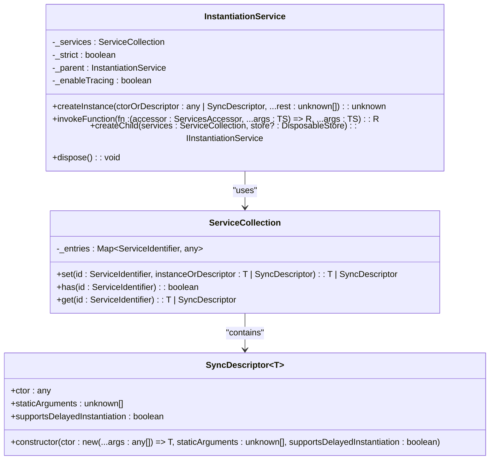
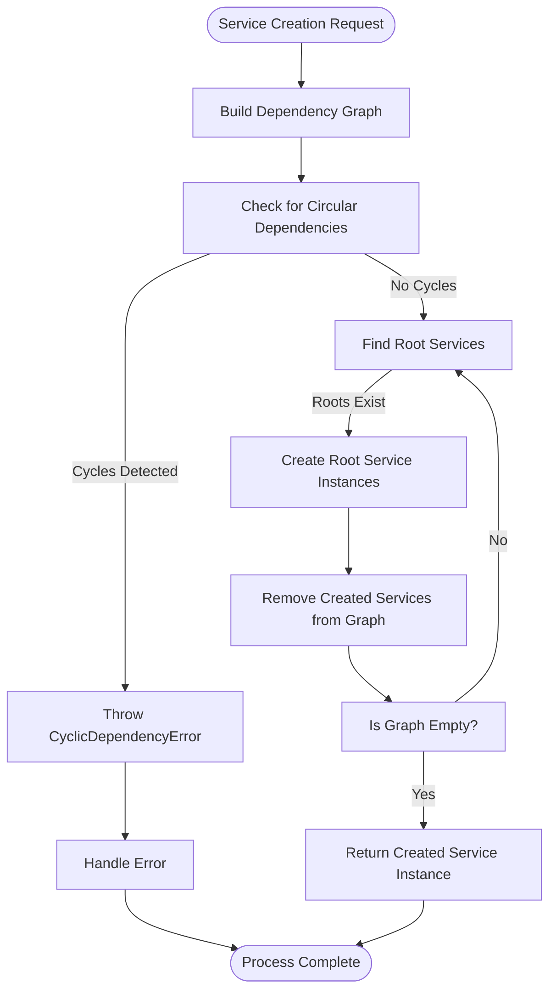
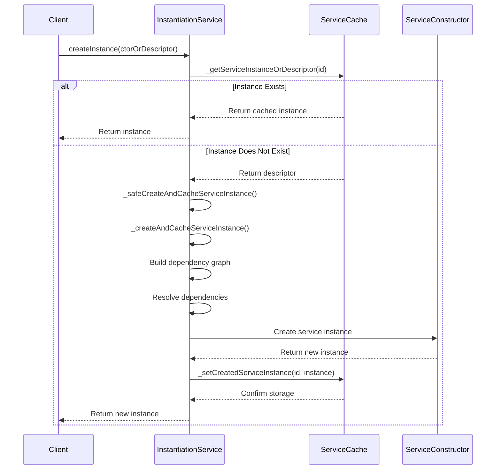
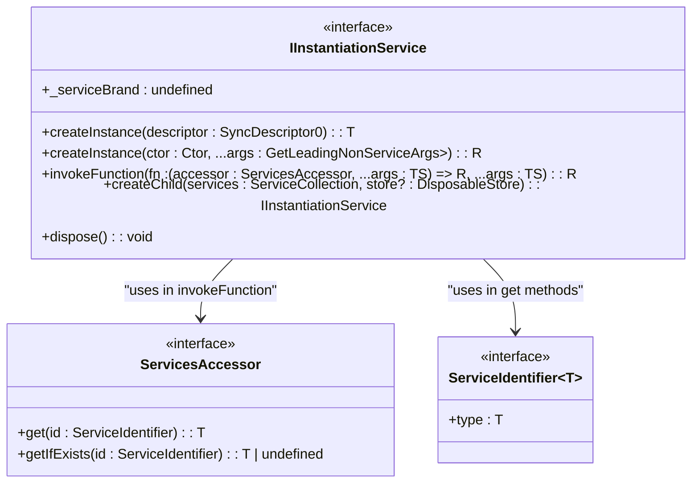
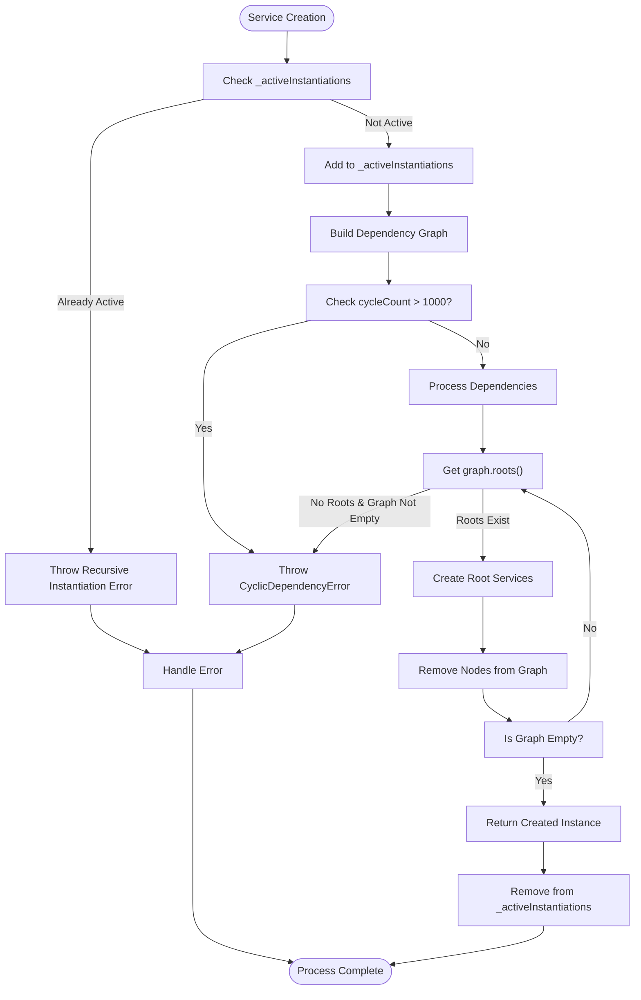
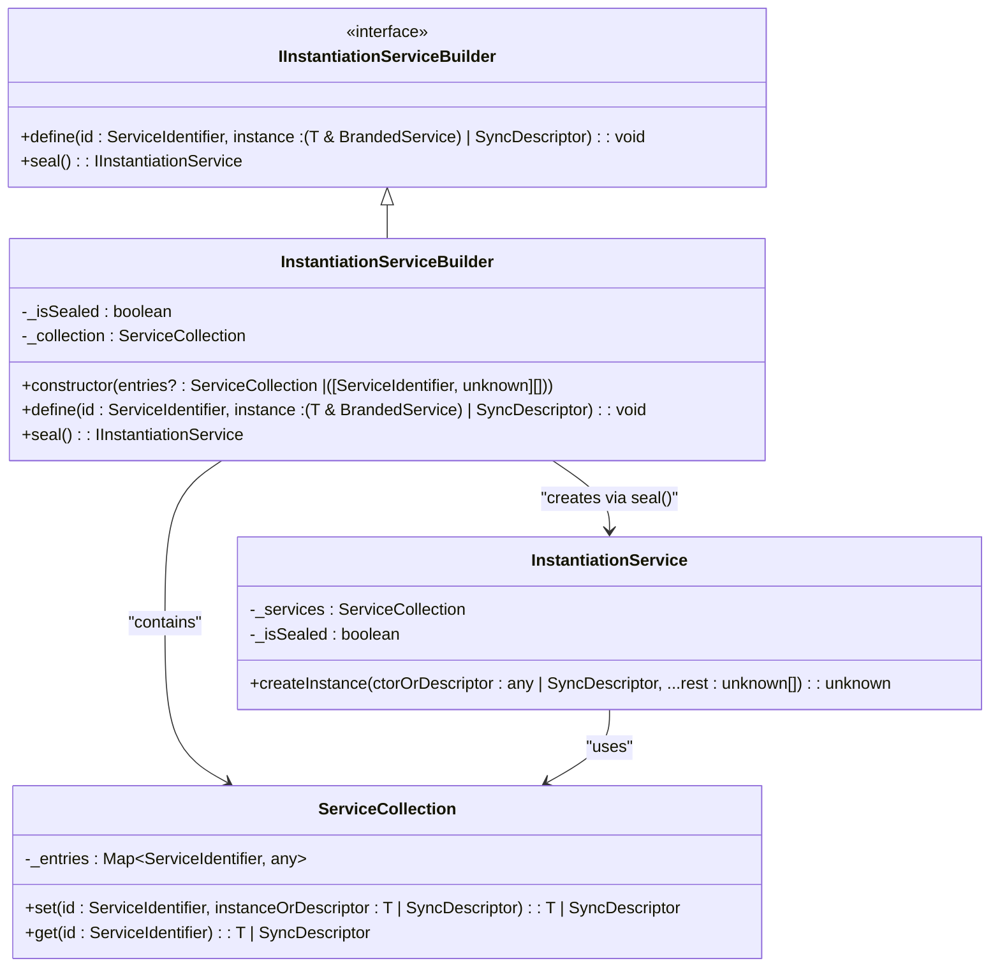

# Instantiation Process

<cite>
**Referenced Files in This Document**   
- [instantiation.ts](file://src/util/vs/platform/instantiation/common/instantiation.ts)
- [instantiationService.ts](file://src/util/vs/platform/instantiation/common/instantiationService.ts)
- [descriptors.ts](file://src/util/vs/platform/instantiation/common/descriptors.ts)
- [serviceCollection.ts](file://src/util/vs/platform/instantiation/common/serviceCollection.ts)
- [services.ts](file://src/util/common/services.ts)
</cite>

## Table of Contents
1. [Introduction](#introduction)
2. [Core Components](#core-components)
3. [Descriptor-Based Service Instantiation](#descriptor-based-service-instantiation)
4. [Graph-Based Dependency Resolution](#graph-based-dependency-resolution)
5. [Lazy Instantiation and Caching](#lazy-instantiation-and-caching)
6. [IInstantiationService Interface](#iinstantiationservice-interface)
7. [Error Handling and Circular Dependency Detection](#error-handling-and-circular-dependency-detection)
8. [Performance Considerations](#performance-considerations)
9. [Service Registration and Builder Pattern](#service-registration-and-builder-pattern)
10. [Conclusion](#conclusion)

## Introduction
The instantiation process in vscode-copilot-chat implements a sophisticated dependency injection system that manages the creation and lifecycle of services throughout the application. This system is built around the InstantiationService, which uses a descriptor-based approach to create service instances on-demand while resolving complex dependency graphs. The architecture ensures that services are created only when needed (lazy instantiation), prevents circular dependencies through graph analysis, and provides robust error handling for service creation failures. This documentation provides a comprehensive analysis of the instantiation mechanism, detailing how services are defined, instantiated, and managed within the application.

## Core Components
The instantiation system in vscode-copilot-chat consists of several key components that work together to manage service creation and dependency injection. The core elements include the IInstantiationService interface, which defines the contract for service creation and access; the InstantiationService implementation that handles the actual instantiation logic; ServiceIdentifier and createDecorator for defining service types; SyncDescriptor for describing service constructors and their dependencies; and ServiceCollection for storing service definitions. These components work in concert to provide a robust dependency injection framework that supports both eager and lazy instantiation of services while maintaining a clean separation between service definition and implementation.

**Section sources**
- [instantiation.ts](file://src/util/vs/platform/instantiation/common/instantiation.ts#L39-L133)
- [instantiationService.ts](file://src/util/vs/platform/instantiation/common/instantiationService.ts#L30-L67)
- [descriptors.ts](file://src/util/vs/platform/instantiation/common/descriptors.ts#L8-L24)
- [serviceCollection.ts](file://src/util/vs/platform/instantiation/common/serviceCollection.ts#L11-L35)

## Descriptor-Based Service Instantiation
The instantiation system uses a descriptor-based approach to define and create service instances. The SyncDescriptor class serves as a blueprint for service creation, containing references to the constructor function, static arguments, and a flag indicating whether the service supports delayed instantiation. When a service is registered with the instantiation service, it is typically associated with a SyncDescriptor that describes how to create an instance of that service. The descriptor pattern allows the instantiation service to defer the actual creation of service instances until they are first requested, enabling lazy loading and efficient resource management. This approach also facilitates the injection of dependencies by allowing the instantiation service to analyze the constructor parameters and resolve any required services before creating the instance.

**Diagram sources**
- [descriptors.ts](file://src/util/vs/platform/instantiation/common/descriptors.ts#L8-L24)
- [serviceCollection.ts](file://src/util/vs/platform/instantiation/common/serviceCollection.ts#L11-L35)
- [instantiationService.ts](file://src/util/vs/platform/instantiation/common/instantiationService.ts#L30-L89)

## Graph-Based Dependency Resolution
The instantiation service employs a sophisticated graph-based algorithm to resolve dependencies and determine the correct creation order for services. When creating a service instance, the system constructs a dependency graph that represents the relationships between services. This graph is used to detect circular dependencies and ensure that services are created in the proper order. The algorithm uses a topological sorting approach, where services with no dependencies (roots) are created first, followed by services that depend on them. The graph traversal continues until all services are created or a circular dependency is detected. This approach prevents infinite recursion during service creation and ensures that all dependencies are satisfied before a service is instantiated.

**Diagram sources**
- [instantiationService.ts](file://src/util/vs/platform/instantiation/common/instantiationService.ts#L221-L288)

## Lazy Instantiation and Caching
The instantiation service implements a lazy instantiation model where service instances are created only when first requested and then cached for subsequent use. This approach optimizes performance by avoiding the creation of unused services and reducing memory consumption. When a service is requested, the instantiation service checks if an instance already exists in its cache. If not, it creates the instance according to the service's descriptor and stores it for future requests. The system also supports delayed instantiation through the GlobalIdleValue class, which allows services to be instantiated during idle periods rather than immediately when needed. This feature is particularly useful for services that are expensive to create but not immediately required for application startup.

**Diagram sources**
- [instantiationService.ts](file://src/util/vs/platform/instantiation/common/instantiationService.ts#L193-L288)
- [instantiationService.ts](file://src/util/vs/platform/instantiation/common/instantiationService.ts#L301-L394)

## IInstantiationService Interface
The IInstantiationService interface defines the contract for service creation and dependency injection in the application. It provides methods for creating service instances, invoking functions with service access, creating child instantiation services, and disposing of resources. The interface serves as a central point for accessing and managing services throughout the application. Key methods include createInstance for instantiating services based on descriptors or constructors, invokeFunction for executing functions with access to services, and createChild for creating isolated service containers that inherit from a parent service. The interface also defines the dispose method for cleaning up resources and ensuring proper cleanup of service instances when they are no longer needed.

**Diagram sources**
- [instantiation.ts](file://src/util/vs/platform/instantiation/common/instantiation.ts#L55-L88)
- [instantiation.ts](file://src/util/vs/platform/instantiation/common/instantiation.ts#L39-L42)

## Error Handling and Circular Dependency Detection
The instantiation service implements comprehensive error handling to manage service creation failures and detect circular dependencies. When creating a service instance, the system performs several validation checks to ensure the integrity of the dependency graph. If a service depends on an unknown service, the system throws an error indicating the missing dependency. The system also detects circular dependencies by tracking active instantiations and using graph analysis to identify cycles in the dependency graph. During graph traversal, if a service is encountered that is already being instantiated, a recursive instantiation error is thrown. Additionally, the system includes a cycle detection heuristic that limits the number of iterations during graph processing to prevent infinite loops. These error handling mechanisms ensure that the application can gracefully handle configuration errors and prevent runtime crashes due to dependency issues.

**Diagram sources**
- [instantiationService.ts](file://src/util/vs/platform/instantiation/common/instantiationService.ts#L209-L288)
- [instantiationService.ts](file://src/util/vs/platform/instantiation/common/instantiationService.ts#L210-L218)

## Performance Considerations
The instantiation system incorporates several performance optimizations to ensure efficient service creation and memory management. The lazy instantiation model prevents unnecessary service creation during application startup, reducing initial load time and memory usage. The caching mechanism ensures that services are created only once and reused across the application, minimizing redundant object creation. The system also supports delayed instantiation through idle value proxies, allowing expensive service creation to occur during idle periods rather than blocking critical application workflows. Additionally, the graph-based dependency resolution algorithm is optimized to minimize redundant processing by tracking seen services and using efficient data structures for graph traversal. These performance considerations enable the application to scale effectively while maintaining responsive user interactions.

**Section sources**
- [instantiationService.ts](file://src/util/vs/platform/instantiation/common/instantiationService.ts#L301-L394)
- [instantiationService.ts](file://src/util/vs/platform/instantiation/common/instantiationService.ts#L221-L288)

## Service Registration and Builder Pattern
The instantiation system uses a builder pattern for service registration, providing a structured approach to defining and configuring services before creating the instantiation service. The InstantiationServiceBuilder class implements the IInstantiationServiceBuilder interface, allowing services to be defined and registered in a controlled manner. This pattern enables the gradual construction of a service collection, with validation to prevent modifications after the builder has been sealed. The builder pattern ensures that all services are properly defined before the instantiation service is created, preventing runtime errors due to missing or misconfigured services. Once all services are registered, the builder's seal method creates an immutable InstantiationService instance that can be used throughout the application.

**Diagram sources**
- [services.ts](file://src/util/common/services.ts#L13-L43)
- [serviceCollection.ts](file://src/util/vs/platform/instantiation/common/serviceCollection.ts#L11-L35)

## Conclusion
The instantiation process in vscode-copilot-chat provides a robust and efficient dependency injection system that manages the creation and lifecycle of services throughout the application. By using a descriptor-based approach with graph-based dependency resolution, the system ensures that services are created in the correct order while preventing circular dependencies. The lazy instantiation model optimizes performance by creating services only when needed and caching them for subsequent use. The comprehensive error handling mechanisms detect and report configuration issues, while the builder pattern provides a structured approach to service registration. This sophisticated instantiation system enables the application to manage complex service dependencies efficiently, ensuring reliable service creation and optimal resource utilization.