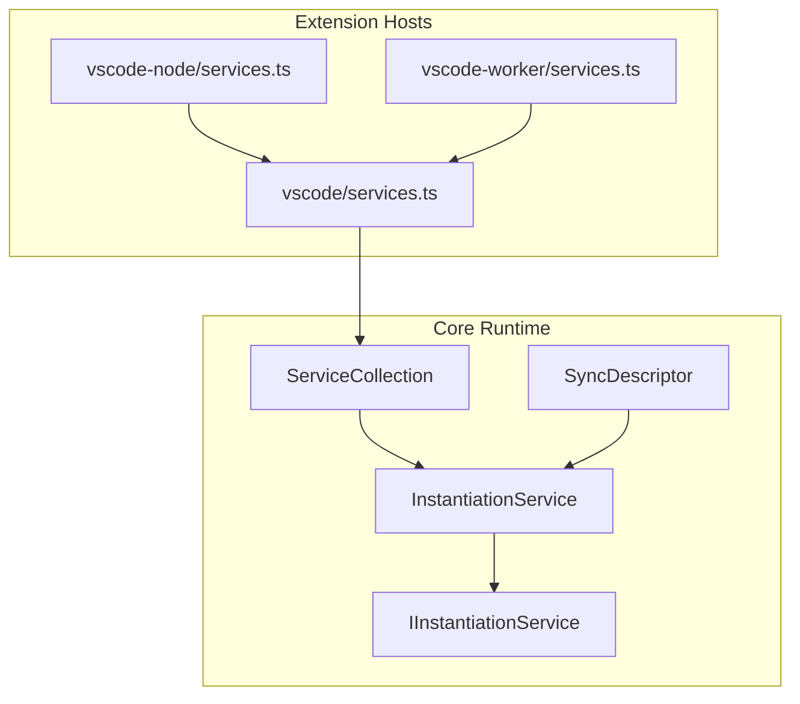
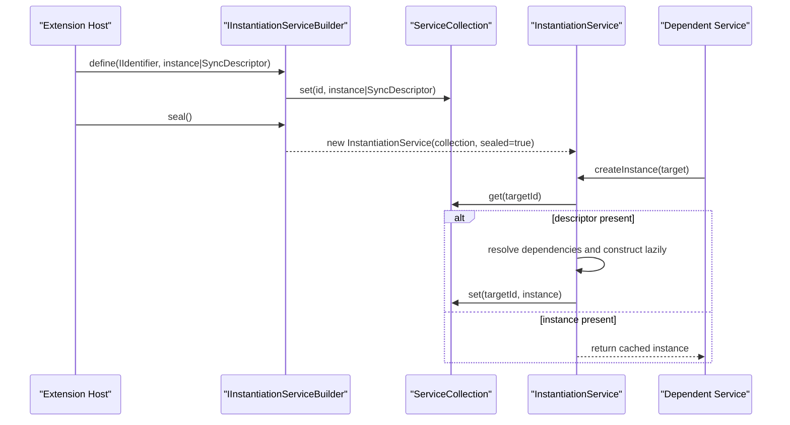
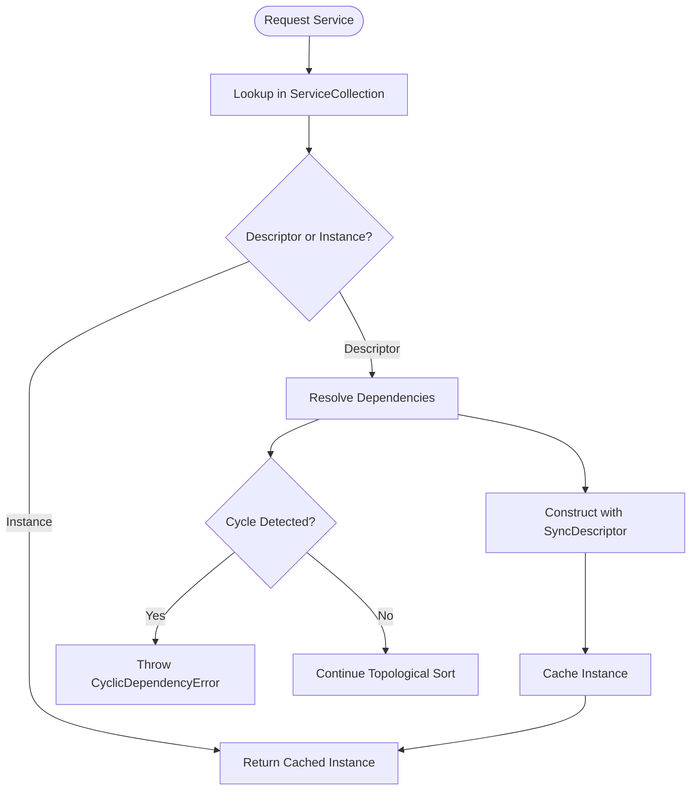

# Service Registration

<cite>
**Referenced Files in This Document**
- [services.ts](file://src/util/common/services.ts)
- [serviceCollection.ts](file://src/util/vs/platform/instantiation/common/serviceCollection.ts)
- [descriptors.ts](file://src/util/vs/platform/instantiation/common/descriptors.ts)
- [instantiation.ts](file://src/util/vs/platform/instantiation/common/instantiation.ts)
- [instantiationService.ts](file://src/util/vs/platform/instantiation/common/instantiationService.ts)
- [services.ts](file://src/extension/extension/vscode/services.ts)
- [services.ts](file://src/extension/extension/vscode-node/services.ts)
- [services.ts](file://src/extension/extension/vscode-worker/services.ts)
- [authentication.ts](file://src/platform/authentication/common/authentication.ts)
- [authenticationService.ts](file://src/platform/authentication/vscode-node/authenticationService.ts)
</cite>

## Table of Contents
1. [Introduction](#introduction)
2. [Project Structure](#project-structure)
3. [Core Components](#core-components)
4. [Architecture Overview](#architecture-overview)
5. [Detailed Component Analysis](#detailed-component-analysis)
6. [Dependency Analysis](#dependency-analysis)
7. [Performance Considerations](#performance-considerations)
8. [Troubleshooting Guide](#troubleshooting-guide)
9. [Conclusion](#conclusion)

## Introduction
This document explains the service registration mechanism used by vscode-copilot-chat. It focuses on how services are registered using the ServiceCollection and descriptors system, the differences between constant descriptors and synchronous descriptors, and how the @IServiceName decorator enables type-safe service identification and injection. It also covers platform services and extension-specific services, common issues such as duplicate registration and overrides, disposal policies, and performance considerations for registration timing and memory usage.

## Project Structure
The service registration system is built on a small set of core files:
- A lightweight builder that wraps ServiceCollection and produces an IInstantiationService
- A ServiceCollection that stores service identifiers and their associated instances or descriptors
- SyncDescriptor for lazy, parameterized service creation
- The instantiation service that resolves dependencies and constructs instances

**Diagram sources**
- [serviceCollection.ts](file://src/util/vs/platform/instantiation/common/serviceCollection.ts#L1-L34)
- [instantiation.ts](file://src/util/vs/platform/instantiation/common/instantiation.ts#L39-L68)
- [instantiationService.ts](file://src/util/vs/platform/instantiation/common/instantiationService.ts#L125-L299)
- [descriptors.ts](file://src/util/vs/platform/instantiation/common/descriptors.ts#L8-L24)
- [services.ts](file://src/extension/extension/vscode/services.ts#L111-L177)
- [services.ts](file://src/extension/extension/vscode-node/services.ts#L119-L207)
- [services.ts](file://src/extension/extension/vscode-worker/services.ts#L18-L20)

**Section sources**
- [serviceCollection.ts](file://src/util/vs/platform/instantiation/common/serviceCollection.ts#L1-L34)
- [instantiation.ts](file://src/util/vs/platform/instantiation/common/instantiation.ts#L39-L68)
- [instantiationService.ts](file://src/util/vs/platform/instantiation/common/instantiationService.ts#L125-L299)
- [descriptors.ts](file://src/util/vs/platform/instantiation/common/descriptors.ts#L8-L24)
- [services.ts](file://src/extension/extension/vscode/services.ts#L111-L177)
- [services.ts](file://src/extension/extension/vscode-node/services.ts#L119-L207)
- [services.ts](file://src/extension/extension/vscode-worker/services.ts#L18-L20)

## Core Components
- ServiceCollection: Stores pairs of ServiceIdentifier and either an instance or a SyncDescriptor. It returns the previously stored value when a duplicate registration occurs, enabling override semantics.
- SyncDescriptor: Holds constructor, static arguments, and a flag indicating whether delayed instantiation is supported. Used to defer construction until the service is first requested.
- IInstantiationServiceBuilder: A thin wrapper around ServiceCollection that prevents further modifications after sealing and returns an IInstantiationService.
- InstantiationService: Resolves dependencies, detects cycles, and constructs instances lazily. It caches constructed instances and enforces safe recursion during instantiation.

Key behaviors:
- Constant descriptors: Passing an instance directly registers it immediately. Subsequent registrations replace the previous entry.
- Synchronous descriptors: Passing a SyncDescriptor defers construction until first use, allowing dependency resolution and avoiding eager allocations.

**Section sources**
- [serviceCollection.ts](file://src/util/vs/platform/instantiation/common/serviceCollection.ts#L1-L34)
- [descriptors.ts](file://src/util/vs/platform/instantiation/common/descriptors.ts#L8-L24)
- [services.ts](file://src/util/common/services.ts#L13-L44)
- [instantiationService.ts](file://src/util/vs/platform/instantiation/common/instantiationService.ts#L125-L299)

## Architecture Overview
The registration pipeline:
1. Extensions define services in host-specific services.ts files.
2. They call builder.define with a ServiceIdentifier and either an instance or a SyncDescriptor.
3. The builder wraps these in a ServiceCollection.
4. The builder seals the collection and produces an IInstantiationService.
5. When a service is requested, InstantiationService resolves dependencies, constructs instances lazily, and caches them.

**Diagram sources**
- [services.ts](file://src/extension/extension/vscode/services.ts#L111-L177)
- [services.ts](file://src/extension/extension/vscode-node/services.ts#L119-L207)
- [services.ts](file://src/util/common/services.ts#L13-L44)
- [serviceCollection.ts](file://src/util/vs/platform/instantiation/common/serviceCollection.ts#L1-L34)
- [instantiationService.ts](file://src/util/vs/platform/instantiation/common/instantiationService.ts#L125-L299)

## Detailed Component Analysis

### ServiceCollection and Override Semantics
- ServiceCollection.set returns the previously stored value for the same identifier. This enables explicit override behavior when a service is registered twice.
- This is the foundation for duplicate registration handling: later registrations replace earlier ones.

Practical implications:
- If you register the same identifier twice, the second registration overrides the first.
- If you need to conditionally register a service (e.g., platform-specific), register the platform-specific variant last to ensure it takes precedence.

**Section sources**
- [serviceCollection.ts](file://src/util/vs/platform/instantiation/common/serviceCollection.ts#L21-L25)

### SyncDescriptor and Lazy Construction
- SyncDescriptor holds constructor, static arguments, and a delayed-instantiation flag.
- When a service is requested, InstantiationService constructs the instance using these descriptors, passing static arguments and resolving injected dependencies.

Benefits:
- Avoids eager allocation of heavy services.
- Enables dependency resolution before construction.
- Supports parameterized construction (e.g., passing configuration).

**Section sources**
- [descriptors.ts](file://src/util/vs/platform/instantiation/common/descriptors.ts#L8-L24)
- [instantiationService.ts](file://src/util/vs/platform/instantiation/common/instantiationService.ts#L125-L299)

### IInstantiationServiceBuilder and Sealing
- IInstantiationServiceBuilder wraps ServiceCollection and exposes define and seal.
- After sealing, further modifications throw an error, preventing accidental reconfiguration.

Best practices:
- Build the collection in a single pass.
- Seal immediately after registration to prevent runtime mutations.

**Section sources**
- [services.ts](file://src/util/common/services.ts#L13-L44)

### Platform Services vs Extension-Specific Services
- Platform services: Defined in the platform layer and exposed via interfaces with createServiceIdentifier. These are consumed by both extension hosts.
- Extension-specific services: Implemented in extension host-specific files and registered conditionally (e.g., node-only services).

Examples from the codebase:
- Platform services (registered in the web host):
  - IAuthenticationChatUpgradeService, ICopilotTokenStore, IDebugOutputService, IDialogService, IEnvService, IFileSystemService, IHeaderContributors, INotebookService, INotebookSummaryTracker, IAlternativeNotebookContentService, IAlternativeNotebookContentEditGenerator, IRemoteRepositoriesService, ITabsAndEditorsService, ITerminalService, ITestProvider, IUrlOpener, INotificationService, IVSCodeExtensionContext, IWorkbenchService, IConversationOptions, IChatSessionService, IConfigurationService, ILogService, IChatQuotaService, ITasksService, IGitExtensionService, IGitService, IOctoKitService, IReviewService, ILanguageDiagnosticsService, ILanguageFeaturesService, IRunCommandExecutionService, ISimulationTestContext, IWorkspaceService, IExtensionsService, ICombinedEmbeddingIndex, IProjectTemplatesIndex, IBlockedExtensionService, IEditLogService, IMultiFileEditInternalTelemetryService, ICustomInstructionsService, ILaunchConfigService, ISurveyService, IEditSurvivalTrackerService, IPromptPathRepresentationService, IPromptsService, IReleaseNotesService, ISnippyService, IInteractiveSessionService, IAuthenticationChatUpgradeService, IEmbeddingsComputer, IToolGroupingService, IToolEmbeddingsComputer, IToolGroupingCache, IMergeConflictService, IEditToolLearningService.
- Node-specific services (registered in the node host):
  - IAutomodeService, IConversationStore, IDiffService, ITokenizerProvider, IToolsService, IRequestLogger, INativeEnvService, IFetcherService, IDomainService, ICAPIClientService, IImageService, ITelemetryUserConfig, ICopilotTokenManager, IAuthenticationService, IEndpointProvider, IIgnoreService, ITestGenInfoStorage, IParserService, IIntentService, INaiveChunkingService, IWorkspaceFileIndex, IChunkingEndpointClient, ICommandService, IDocsSearchClient, ISearchService, ITestDepsResolver, ISetupTestsDetector, IWorkspaceMutationManager, IScopeSelector, IGitDiffService, IGitCommitMessageService, IGithubRepositoryService, IDevContainerConfigurationService, IChatAgentService, ILinkifyService, IChatMLFetcher, IFeedbackReporter, IApiEmbeddingsIndex, IGithubCodeSearchService, IAdoCodeSearchService, IWorkspaceChunkSearchService, ISettingsEditorSearchService, INewWorkspacePreviewContentManager, IPromptVariablesService, IPromptWorkspaceLabels, IUserFeedbackService, IDebugCommandToConfigConverter, IDebuggableCommandIdentifier, ILanguageToolsProvider, ICodeMapperService, ICompletionsFetchService, IFixCookbookService, ILanguageContextService, ILanguageContextProviderService, IWorkspaceListenerService, ICodeSearchAuthenticationService, ITodoListContextProvider, IGithubAvailableEmbeddingTypesService, IRerankerService.

These registrations demonstrate:
- Constant descriptors for simple, lightweight instances (e.g., configuration options).
- Synchronous descriptors for services that require constructor parameters or dependency injection.

**Section sources**
- [services.ts](file://src/extension/extension/vscode/services.ts#L111-L177)
- [services.ts](file://src/extension/extension/vscode-node/services.ts#L119-L207)

### @IServiceName Decorator and Type Safety
- The createDecorator function defines a ServiceIdentifier and records dependency metadata for constructor parameters.
- The decorator can only be used to decorate a parameter; misuse throws an error.
- This ensures type-safe injection and enables the instantiation service to resolve dependencies by position.

Usage example:
- The AuthenticationService constructor uses @IAuthenticationService, @IDomainService, @ILogService, @ICopilotTokenStore, and @ICopilotTokenManager to receive its dependencies.

Benefits:
- Compile-time safety for service identifiers.
- Automatic dependency discovery for constructor injection.

**Section sources**
- [instantiation.ts](file://src/util/vs/platform/instantiation/common/instantiation.ts#L109-L133)
- [authentication.ts](file://src/platform/authentication/common/authentication.ts#L32-L32)
- [authenticationService.ts](file://src/platform/authentication/vscode-node/authenticationService.ts#L19-L27)

### Example Registration Patterns
- Constant descriptors:
  - IConversationOptions is registered as a plain object with brand marker and default values.
  - IVSCodeExtensionContext is registered as a direct instance (forced branding).
- Synchronous descriptors:
  - Most services are registered via SyncDescriptor with constructor and optional static arguments.
  - Conditional registrations (e.g., telemetry, authentication, ignore service) depend on extension mode and scenario automation flags.

These patterns illustrate:
- Lightweight, immediate registration for simple values.
- Deferred construction for complex services with dependencies.

**Section sources**
- [services.ts](file://src/extension/extension/vscode/services.ts#L133-L140)
- [services.ts](file://src/extension/extension/vscode-node/services.ts#L137-L152)
- [services.ts](file://src/extension/extension/vscode-node/services.ts#L154-L162)

## Dependency Analysis
The instantiation service enforces dependency ordering and detects cycles:
- It collects service dependencies from constructors decorated with @IServiceName.
- It constructs instances in dependency order, caching results.
- It guards against recursive instantiation and cyclic dependencies.

**Diagram sources**
- [instantiationService.ts](file://src/util/vs/platform/instantiation/common/instantiationService.ts#L193-L299)
- [descriptors.ts](file://src/util/vs/platform/instantiation/common/descriptors.ts#L8-L24)

**Section sources**
- [instantiationService.ts](file://src/util/vs/platform/instantiation/common/instantiationService.ts#L193-L299)

## Performance Considerations
- Registration timing:
  - Register early in the extension lifecycle to avoid missing dependencies.
  - Prefer synchronous descriptors for services that are expensive to construct but rarely used.
- Memory usage:
  - Constant descriptors keep instances alive; consider switching to descriptors for services that are heavy or rarely needed.
  - Avoid registering the same identifier multiple times; rely on override semantics to minimize redundant allocations.
- Dependency graphs:
  - Keep dependency graphs shallow and acyclic to reduce instantiation overhead.
  - Use minimal dependencies in constructors to speed up initial startup.

[No sources needed since this section provides general guidance]

## Troubleshooting Guide
- Duplicate service registration:
  - Behavior: Later registrations override earlier ones. Verify the last registration wins.
  - Action: Ensure platform-specific registrations occur after common ones and last.
- Service override policies:
  - Use ServiceCollection.set return value to detect overrides if needed.
  - Prefer explicit override by re-registering the same identifier.
- Proper disposal of registered services:
  - Services that implement IDisposable should be managed by a container that tracks disposables.
  - Use DisposableStore or similar patterns to ensure resources are released when the extension shuts down.
- Common instantiation errors:
  - Unknown service dependency: Ensure all dependencies are registered before requesting the service.
  - Recursive instantiation: Remove circular dependencies in constructors.
  - Cyclic dependency detected: Reorder dependencies or refactor constructors to break cycles.

**Section sources**
- [serviceCollection.ts](file://src/util/vs/platform/instantiation/common/serviceCollection.ts#L21-L25)
- [instantiationService.ts](file://src/util/vs/platform/instantiation/common/instantiationService.ts#L193-L299)

## Conclusion
The vscode-copilot-chat service registration mechanism leverages a small, robust core: ServiceCollection for storage and override semantics, SyncDescriptor for lazy construction, and IInstantiationServiceBuilder for safe, sealed configuration. The @IServiceName decorator provides type-safe, compile-checked dependency injection. Platform services are registered in the web host, with node-specific services layered on top. By following the patterns demonstrated in the extension services files—using constant descriptors for simple values and synchronous descriptors for complex, parameterized services—you can achieve predictable, efficient, and maintainable service lifecycles.