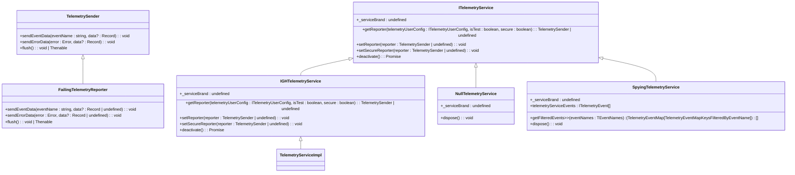

# Core Services

<cite>
**Referenced Files in This Document**   
- [chatSessionService.ts](file://src/platform/chat/common/chatSessionService.ts)
- [configurationService.ts](file://src/platform/configuration/common/configurationService.ts)
- [workspaceService.ts](file://src/platform/workspace/common/workspaceService.ts)
- [endpointProvider.ts](file://src/platform/endpoint/common/endpointProvider.ts)
- [telemetryServiceImpl.ts](file://src/platform/telemetry/vscode-node/telemetryServiceImpl.ts)
</cite>

## Table of Contents
1. [Introduction](#introduction)
2. [Core Services Overview](#core-services-overview)
3. [Chat Session Service](#chat-session-service)
4. [Configuration Service](#configuration-service)
5. [Workspace Service](#workspace-service)
6. [Telemetry Service](#telemetry-service)
7. [Endpoint Provider](#endpoint-provider)
8. [Service Interactions and Integration](#service-interactions-and-integration)
9. [Error Handling and Lifecycle Management](#error-handling-and-lifecycle-management)
10. [Performance Considerations](#performance-considerations)
11. [Common Issues and Best Practices](#common-issues-and-best-practices)

## Introduction

The vscode-copilot-chat extension relies on a set of core services that provide foundational functionality for managing conversations, user settings, workspace operations, telemetry collection, and AI model connectivity. These services form the backbone of the extension's architecture, enabling seamless integration between the user interface and backend systems. This document provides a comprehensive analysis of these core services, detailing their implementation, responsibilities, interfaces, and interactions.

The services are designed with a clear separation of concerns, following dependency injection patterns to ensure testability and maintainability. Each service exposes a well-defined interface while providing platform-specific implementations that adapt to the VS Code environment. The architecture emphasizes extensibility, allowing for different implementations in various contexts (e.g., testing vs. production).

**Section sources**
- [chatSessionService.ts](file://src/platform/chat/common/chatSessionService.ts#L1-L15)
- [configurationService.ts](file://src/platform/configuration/common/configurationService.ts#L1-L800)
- [workspaceService.ts](file://src/platform/workspace/common/workspaceService.ts#L1-L227)
- [endpointProvider.ts](file://src/platform/endpoint/common/endpointProvider.ts#L1-L147)

## Core Services Overview

The core services in vscode-copilot-chat are designed to handle specific domains of functionality while maintaining loose coupling between components. The architecture follows a service-oriented pattern where each service is responsible for a distinct aspect of the application's behavior.

The services are organized around key functional areas:
- **Chat Session Service**: Manages conversation state and lifecycle
- **Configuration Service**: Handles user settings and preferences
- **Workspace Service**: Provides access to workspace operations and file system
- **Telemetry Service**: Collects and reports usage data and diagnostics
- **Endpoint Provider**: Manages connectivity to AI models and services

These services are implemented using interface-based design with dependency injection, allowing for easy substitution of implementations in different contexts (e.g., testing, different platforms). The services are registered with the extension's service container and can be injected into other components as dependencies.


**Diagram sources**
- [chatSessionService.ts](file://src/platform/chat/common/chatSessionService.ts#L1-L15)
- [configurationService.ts](file://src/platform/configuration/common/configurationService.ts#L1-L800)
- [workspaceService.ts](file://src/platform/workspace/common/workspaceService.ts#L1-L227)
- [endpointProvider.ts](file://src/platform/endpoint/common/endpointProvider.ts#L1-L147)

## Chat Session Service

The ChatSessionService manages the lifecycle and state of chat conversations within the vscode-copilot-chat extension. It serves as a bridge between the extension's chat functionality and VS Code's built-in chat API, providing a clean interface for other components to interact with chat sessions.

The service is defined by the `IChatSessionService` interface, which exposes an event `onDidDisposeChatSession` that fires when a chat session is disposed. The implementation in `chatSessionService.ts` delegates directly to VS Code's chat API, specifically the `vscode.chat.onDidDisposeChatSession` event.

The service follows a lightweight wrapper pattern, primarily serving to abstract the VS Code API and provide type safety through the defined interface. This approach allows for easier testing and potential future modifications without affecting dependent components. The service does not maintain its own state but rather acts as a pass-through to the underlying VS Code chat system.

**Section sources**
- [chatSessionService.ts](file://src/platform/chat/common/chatSessionService.ts#L1-L15)
- [chatSessionService.ts](file://src/platform/chat/vscode/chatSessionService.ts#L1-L16)

## Configuration Service

The ConfigurationService provides a comprehensive system for managing user settings and configuration in the vscode-copilot-chat extension. It offers a robust API for accessing, modifying, and observing configuration values, with support for various configuration scopes and advanced features like experimentation-based configurations.

The service is defined by the `IConfigurationService` interface, which includes methods for:
- Getting configuration values with type safety
- Observing configuration changes through observables
- Inspecting configuration values across different scopes
- Setting configuration values
- Handling experimentation-based configurations

The implementation includes several key features:
- **Configuration Registry**: A global registry that tracks all registered configuration settings
- **Configuration Migration**: Support for migrating settings from old keys to new keys
- **Team/Internal Settings**: Special handling for settings that are only available to team members or internal users
- **Observable Configuration**: Integration with VS Code's event system to provide reactive configuration updates

The service also handles advanced scenarios like configuration value validation, default value management, and experimentation treatment updates. It provides both synchronous and asynchronous access patterns, with the observable pattern enabling reactive programming approaches in dependent components.

```mermaid
classDiagram
class IConfigurationService {
+_serviceBrand : undefined
+getConfig<T>(key : Config<T>, scope? : ConfigurationScope) : T
+getConfigObservable<T>(key : Config<T>) : IObservable<T>
+inspectConfig<T>(key : BaseConfig<T>, scope? : ConfigurationScope) : InspectConfigResult<T> | undefined
+isConfigured<T>(key : BaseConfig<T>, scope? : ConfigurationScope) : boolean
+getNonExtensionConfig<T>(configKey : string) : T | undefined
+setConfig<T>(key : BaseConfig<T>, value : T) : Thenable<void>
+getExperimentBasedConfig<T extends ExperimentBasedConfigType>(key : ExperimentBasedConfig<T>, experimentationService : IExperimentationService, scope? : ConfigurationScope) : T
+getExperimentBasedConfigObservable<T extends ExperimentBasedConfigType>(key : ExperimentBasedConfig<T>, experimentationService : IExperimentationService) : IObservable<T>
+getConfigMixedWithDefaults<T>(key : Config<T>) : T
+getDefaultValue<T>(key : Config<T>) : T
+onDidChangeConfiguration : Event<ConfigurationChangeEvent>
+updateExperimentBasedConfiguration(treatments : string[]) : void
+dumpConfig() : { [key : string] : string }
}
class AbstractConfigurationService {
+_serviceBrand : undefined
+_onDidChangeConfiguration : Emitter<ConfigurationChangeEvent>
+onDidChangeConfiguration : Event<ConfigurationChangeEvent>
+_isInternal : boolean
+_isTeamMember : boolean
+getConfigMixedWithDefaults<T>(key : Config<T>) : T
+getDefaultValue<T>(key : BaseConfig<T>) : T
+_setUserInfo(userInfo : { isInternal : boolean; isTeamMember : boolean; teamMemberUsername? : string }) : void
+isConfigured<T>(key : BaseConfig<T>, scope? : ConfigurationScope) : boolean
+_isUsingTeamDefault(key : BaseConfig<any>) : boolean
}
IConfigurationService <|-- AbstractConfigurationService
AbstractConfigurationService <|-- ConcreteConfigurationService
```

**Diagram sources**
- [configurationService.ts](file://src/platform/configuration/common/configurationService.ts#L79-L163)

## Workspace Service

The WorkspaceService provides access to workspace-related functionality in the vscode-copilot-chat extension. It serves as an abstraction layer over VS Code's workspace API, offering a consistent interface for interacting with text documents, notebook documents, and workspace folders.

The service is defined by the `IWorkspaceService` interface, which includes properties and methods for:
- Accessing open text and notebook documents
- Listening to document lifecycle events (open, close, change)
- Opening and showing documents
- Working with workspace folders and relative paths
- Applying workspace edits

The implementation includes an abstract base class `AbstractWorkspaceService` that provides common functionality, with concrete implementations for different environments. The service also includes utility functions like `getWorkspaceFileDisplayPath` for formatting file paths relative to workspace folders.

Key features of the WorkspaceService include:
- **Document Snapshots**: Methods for creating snapshots of text and notebook documents
- **Relative Path Resolution**: Helper methods for converting absolute paths to workspace-relative paths
- **Workspace Loading**: Support for ensuring virtual workspaces are fully loaded before use
- **Null Implementation**: A `NullWorkspaceService` for testing scenarios

The service acts as a facade over VS Code's workspace API, providing type safety and additional utility methods while maintaining compatibility with the underlying platform.


**Diagram sources**
- [workspaceService.ts](file://src/platform/workspace/common/workspaceService.ts#L19-L52)

## Telemetry Service

The TelemetryService is responsible for collecting and reporting usage data, diagnostics, and performance metrics from the vscode-copilot-chat extension. It provides a structured system for monitoring the extension's behavior in production environments while respecting user privacy settings.

The service architecture includes multiple implementations for different scenarios:
- **Production Implementation**: Sends telemetry data to Microsoft's telemetry systems
- **Null Implementation**: Used when telemetry is disabled
- **Failing Implementation**: Used in tests to ensure telemetry calls are properly guarded
- **Spying Implementation**: Used in tests to intercept and verify telemetry events

The telemetry system is designed with several key principles:
- **Privacy Compliance**: Respects user telemetry preferences and only sends data when permitted
- **Error Handling**: Graceful degradation when telemetry systems are unavailable
- **Performance**: Minimal impact on extension performance through asynchronous processing
- **Extensibility**: Support for multiple telemetry destinations and secure vs. insecure channels

The service integrates with VS Code's telemetry API while adding additional layers of validation, sanitization, and multiplexing to handle large property values. It also supports enhanced telemetry for authenticated users, providing richer data for product improvement.



**Diagram sources**
- [telemetryServiceImpl.ts](file://src/platform/telemetry/vscode-node/telemetryServiceImpl.ts#L1-L131)
- [ghTelemetryService.ts](file://src/platform/telemetry/common/ghTelemetryService.ts#L20-L56)
- [failingTelemetryReporter.ts](file://src/platform/telemetry/common/failingTelemetryReporter.ts#L1-L18)
- [nullTelemetryService.ts](file://src/platform/telemetry/common/nullTelemetryService.ts#L1-L13)
- [spyingTelemetryService.ts](file://src/platform/telemetry/node/spyingTelemetryService.ts#L1-L35)

## Endpoint Provider

The EndpointProvider service manages connectivity to AI models and services in the vscode-copilot-chat extension. It serves as the central point for discovering and accessing different AI endpoints, including chat completions, responses, and embeddings services.

The service is defined by the `IEndpointProvider` interface, which includes methods for:
- Retrieving all available completion models
- Getting chat endpoints for specific requests or model families
- Obtaining embeddings endpoints
- Managing model capabilities and policies

Key features of the EndpointProvider include:
- **Model Capabilities**: Detailed information about model capabilities, including token limits, supported features (tool calls, streaming, vision), and tokenizer types
- **Endpoint Families**: Categorization of endpoints into families (e.g., gpt-4.1, copilot-base) for easier management
- **Model Policies**: Support for model state (enabled, disabled, unconfigured) and terms of use
- **Custom Models**: Support for custom model configurations with owner and key names

The service also defines type guards for safely working with different model types (chat, embeddings, completion) and ensures type safety when accessing model capabilities. It integrates with the authentication system to ensure proper access to endpoints based on user permissions.

```mermaid
classDiagram
class IEndpointProvider {
+_serviceBrand : undefined
+getAllCompletionModels(forceRefresh? : boolean) : Promise<ICompletionModelInformation[]>
+getAllChatEndpoints() : Promise<IChatEndpoint[]>
+getChatEndpoint(requestOrFamily : LanguageModelChat | ChatRequest | ChatEndpointFamily) : Promise<IChatEndpoint>
+getEmbeddingsEndpoint(family? : EmbeddingsEndpointFamily) : Promise<IEmbeddingsEndpoint>
}
class IChatModelCapabilities {
+type : 'chat'
+family : string
+tokenizer : TokenizerType
+limits? : { max_prompt_tokens? : number; max_output_tokens? : number; max_context_window_tokens? : number }
+supports : { parallel_tool_calls? : boolean; tool_calls? : boolean; streaming : boolean | undefined; vision? : boolean; prediction? : boolean; thinking? : boolean }
}
class IEmbeddingModelCapabilities {
+type : 'embeddings'
+family : string
+tokenizer : TokenizerType
+limits? : { max_inputs? : number }
}
class ICompletionModelCapabilities {
+type : 'completion'
+family : string
+tokenizer : TokenizerType
}
class IModelAPIResponse {
+id : string
+name : string
+policy? : ModelPolicy
+model_picker_enabled : boolean
+preview? : boolean
+is_chat_default : boolean
+is_chat_fallback : boolean
+version : string
+warning_messages? : { code : string; message : string }[]
+info_messages? : { code : string; message : string }[]
+billing? : { is_premium : boolean; multiplier : number; restricted_to? : string[] }
+capabilities : IChatModelCapabilities | ICompletionModelCapabilities | IEmbeddingModelCapabilities
+supported_endpoints? : ModelSupportedEndpoint[]
+custom_model? : { key_name : string; owner_name : string }
}
class IChatModelInformation {
+id : string
+name : string
+policy? : ModelPolicy
+model_picker_enabled : boolean
+preview? : boolean
+is_chat_default : boolean
+is_chat_fallback : boolean
+version : string
+warning_messages? : { code : string; message : string }[]
+info_messages? : { code : string; message : string }[]
+billing? : { is_premium : boolean; multiplier : number; restricted_to? : string[] }
+capabilities : IChatModelCapabilities
+supported_endpoints? : ModelSupportedEndpoint[]
+custom_model? : { key_name : string; owner_name : string }
+urlOrRequestMetadata? : string | RequestMetadata
+requestHeaders? : Readonly<Record<string, string>>
+zeroDataRetentionEnabled? : boolean
}
class IEmbeddingModelInformation {
+id : string
+name : string
+policy? : ModelPolicy
+model_picker_enabled : boolean
+preview? : boolean
+is_chat_default : boolean
+is_chat_fallback : boolean
+version : string
+warning_messages? : { code : string; message : string }[]
+info_messages? : { code : string; message : string }[]
+billing? : { is_premium : boolean; multiplier : number; restricted_to? : string[] }
+capabilities : IEmbeddingModelCapabilities
+supported_endpoints? : ModelSupportedEndpoint[]
+custom_model? : { key_name : string; owner_name : string }
}
class ICompletionModelInformation {
+id : string
+name : string
+policy? : ModelPolicy
+model_picker_enabled : boolean
+preview? : boolean
+is_chat_default : boolean
+is_chat_fallback : boolean
+version : string
+warning_messages? : { code : string; message : string }[]
+info_messages? : { code : string; message : string }[]
+billing? : { is_premium : boolean; multiplier : number; restricted_to? : string[] }
+capabilities : ICompletionModelCapabilities
+supported_endpoints? : ModelSupportedEndpoint[]
+custom_model? : { key_name : string; owner_name : string }
}
IEndpointProvider <|-- ConcreteEndpointProvider
IChatModelCapabilities <|-- IChatModelInformation
IEmbeddingModelCapabilities <|-- IEmbeddingModelInformation
ICompletionModelCapabilities <|-- ICompletionModelInformation
```

**Diagram sources**
- [endpointProvider.ts](file://src/platform/endpoint/common/endpointProvider.ts#L121-L146)

## Service Interactions and Integration

The core services in vscode-copilot-chat work together to provide a cohesive experience for users. These services are designed to be loosely coupled while maintaining well-defined integration points that enable seamless collaboration.

The primary integration patterns include:
- **Dependency Injection**: Services are injected into components that need them, promoting testability and loose coupling
- **Event-Driven Communication**: Services use events to communicate state changes to interested parties
- **Configuration-Driven Behavior**: Services respond to configuration changes to modify their behavior
- **Telemetry Integration**: All services integrate with the telemetry system to provide usage insights

For example, when a user initiates a chat conversation:
1. The UI component requests a chat session through the ChatSessionService
2. The service interacts with VS Code's chat API to create the session
3. ConfigurationService provides user preferences that influence the chat behavior
4. WorkspaceService supplies context about open files and workspace structure
5. EndpointProvider determines the appropriate AI model endpoint
6. TelemetryService records the interaction for analysis

The services also integrate through shared data structures and utilities. For instance, the ConfigurationService uses the workspace context to determine configuration scope, while the TelemetryService uses configuration settings to determine what data to collect.


**Diagram sources**
- [chatSessionService.ts](file://src/platform/chat/common/chatSessionService.ts#L1-L15)
- [configurationService.ts](file://src/platform/configuration/common/configurationService.ts#L1-L800)
- [workspaceService.ts](file://src/platform/workspace/common/workspaceService.ts#L1-L227)
- [endpointProvider.ts](file://src/platform/endpoint/common/endpointProvider.ts#L1-L147)
- [telemetryServiceImpl.ts](file://src/platform/telemetry/vscode-node/telemetryServiceImpl.ts#L1-L131)

## Error Handling and Lifecycle Management

The core services in vscode-copilot-chat implement robust error handling and lifecycle management patterns to ensure reliability and proper resource management.

Key error handling strategies include:
- **Graceful Degradation**: Services continue to function with reduced capabilities when errors occur
- **Error Boundaries**: Critical operations are wrapped in error handling to prevent cascading failures
- **Retry Mechanisms**: Transient failures are handled with appropriate retry logic
- **User Feedback**: Errors are communicated to users in a clear and actionable manner

Lifecycle management is handled through several patterns:
- **Disposable Pattern**: Services implement disposal logic to clean up resources
- **Event Subscription Management**: Event listeners are properly cleaned up to prevent memory leaks
- **Initialization Sequencing**: Services are initialized in the correct order to avoid dependency issues
- **Configuration Change Handling**: Services respond appropriately to configuration changes

For example, the TelemetryService implements a deactivate method that ensures all pending events are flushed before shutdown. The ConfigurationService listens for configuration changes and updates its internal state accordingly. The WorkspaceService ensures virtual workspaces are fully loaded before use.

The services also implement proper disposal patterns, with the NullWorkspaceService demonstrating how to clean up event emitters and other resources when a service is no longer needed.

**Section sources**
- [telemetryServiceImpl.ts](file://src/platform/telemetry/vscode-node/telemetryServiceImpl.ts#L42-L55)
- [workspaceService.ts](file://src/platform/workspace/common/workspaceService.ts#L223-L225)
- [configurationService.ts](file://src/platform/configuration/common/configurationService.ts#L176-L186)

## Performance Considerations

The core services in vscode-copilot-chat are designed with performance as a key consideration, implementing various optimizations to ensure responsive user experiences.

Key performance strategies include:
- **Caching**: Frequently accessed data is cached to reduce redundant operations
- **Lazy Initialization**: Services are initialized only when needed
- **Asynchronous Operations**: Long-running operations are performed asynchronously to avoid blocking the UI
- **Batching**: Related operations are batched to reduce overhead
- **Memory Management**: Resources are properly cleaned up to prevent memory leaks

The ConfigurationService, for example, caches observable instances to avoid recreating them for the same configuration key. The TelemetryService batches events and sends them asynchronously to minimize impact on extension performance. The WorkspaceService provides methods for efficiently accessing document snapshots without loading the full document content.

For high-frequency service calls, the services implement optimization patterns such as:
- **Debouncing**: Rapid successive calls are consolidated
- **Throttling**: Calls are rate-limited to prevent overwhelming systems
- **Memoization**: Results of expensive operations are cached
- **Connection Pooling**: Network connections are reused when possible

These performance considerations ensure that the extension remains responsive even under heavy usage patterns.

**Section sources**
- [configurationService.ts](file://src/platform/configuration/common/configurationService.ts#L284-L301)
- [telemetryServiceImpl.ts](file://src/platform/telemetry/vscode-node/telemetryServiceImpl.ts#L1-L131)

## Common Issues and Best Practices

When working with the core services in vscode-copilot-chat, several common issues and best practices should be considered.

**Service Initialization Timing**
- Services should be accessed only after the extension has fully initialized
- Use async initialization patterns when services depend on external resources
- Implement proper error handling for cases where services are not yet available

**Configuration Updates Propagation**
- Use observables for reactive configuration updates rather than polling
- Ensure configuration change handlers are properly disposed
- Be aware of configuration scope (global, workspace, folder) when reading values

**Proper Disposal Patterns**
- Always dispose of event subscriptions to prevent memory leaks
- Implement the Disposable pattern for services that manage resources
- Clean up temporary files and network connections when services are disposed

**Error Handling Best Practices**
- Implement comprehensive error handling at service boundaries
- Provide meaningful error messages to users
- Log errors for diagnostic purposes while respecting privacy

**Performance Optimization**
- Use the observable pattern for frequently changing data
- Avoid synchronous blocking operations in the main thread
- Implement caching for expensive operations
- Monitor service performance and optimize bottlenecks

By following these best practices, developers can ensure reliable and performant integration with the core services while avoiding common pitfalls.

**Section sources**
- [configurationService.ts](file://src/platform/configuration/common/configurationService.ts#L276-L301)
- [telemetryServiceImpl.ts](file://src/platform/telemetry/vscode-node/telemetryServiceImpl.ts#L42-L55)
- [workspaceService.ts](file://src/platform/workspace/common/workspaceService.ts#L223-L225)