# Platform Services

<cite>
**Referenced Files in This Document**   
- [gitService.ts](file://src/platform/git/common/gitService.ts)
- [githubService.ts](file://src/platform/github/common/githubService.ts)
- [languageContextProviderService.ts](file://src/platform/languageContextProvider/common/languageContextProviderService.ts)
- [notebookService.ts](file://src/platform/notebook/common/notebookService.ts)
- [terminalService.ts](file://src/platform/terminal/common/terminalService.ts)
- [githubRepositoryService.ts](file://src/platform/github/node/githubRepositoryService.ts)
</cite>

## Table of Contents
1. [Introduction](#introduction)
2. [Authentication Service](#authentication-service)
3. [Git Service](#git-service)
4. [GitHub Service](#github-service)
5. [Language Context Provider Service](#language-context-provider-service)
6. [Notebook Service](#notebook-service)
7. [Terminal Service](#terminal-service)
8. [Integration Patterns](#integration-patterns)
9. [Common Integration Challenges](#common-integration-challenges)
10. [Performance Considerations](#performance-considerations)
11. [Error Handling Strategies](#error-handling-strategies)
12. [Conclusion](#conclusion)

## Introduction
The platform services architecture provides a comprehensive integration layer between development tools and environments, abstracting platform-specific details while offering consistent interfaces for extension features. These services enable seamless interaction with version control systems, language-specific contexts, notebook environments, and terminal operations, forming the foundation for advanced AI-assisted development capabilities. The services are designed with modularity, extensibility, and resilience in mind, ensuring reliable performance across diverse development scenarios.

## Authentication Service
The authentication framework provides secure access to platform resources through token-based authentication mechanisms. While the specific implementation details are not fully accessible in the current context, the service architecture follows standard authentication patterns for integrating with external systems like GitHub. The service manages authentication sessions, token storage, and renewal processes, ensuring secure access to protected resources while maintaining user privacy. It serves as a critical gateway for all services that require access to authenticated resources, particularly the GitHub integration components.

**Section sources**
- [githubRepositoryService.ts](file://src/platform/github/node/githubRepositoryService.ts#L5-L23)

## Git Service
The Git Service provides a comprehensive interface for version control operations, abstracting the underlying Git implementation details. The service offers both high-level and low-level operations for repository management, change tracking, and history navigation.

### Core Interface and Capabilities
The IGitService interface defines a rich set of operations for Git repository interaction:

```mermaid
classDiagram
class IGitService {
+_serviceBrand : undefined
+onDidOpenRepository : Event<RepoContext>
+onDidCloseRepository : Event<RepoContext>
+onDidFinishInitialization : Event<void>
+activeRepository : IObservable<RepoContext | undefined>
+repositories : Array<RepoContext>
+isInitialized : boolean
+getRepository(uri : URI) : Promise<RepoContext | undefined>
+getRepositoryFetchUrls(uri : URI) : Promise<Pick<RepoContext, 'rootUri' | 'remoteFetchUrls'> | undefined>
+initialize() : Promise<void>
+add(uri : URI, paths : string[]) : Promise<void>
+log(uri : URI, options? : LogOptions) : Promise<Commit[] | undefined>
+diffBetween(uri : URI, ref1 : string, ref2 : string) : Promise<Change[] | undefined>
+diffWith(uri : URI, ref : string) : Promise<Change[] | undefined>
+diffIndexWithHEADShortStats(uri : URI) : Promise<CommitShortStat | undefined>
+fetch(uri : URI, remote? : string, ref? : string, depth? : number) : Promise<void>
+getMergeBase(uri : URI, ref1 : string, ref2 : string) : Promise<string | undefined>
+createWorktree(uri : URI, options? : { path? : string; commitish? : string; branch? : string }) : Promise<string | undefined>
+deleteWorktree(uri : URI, path : string, options? : { force? : boolean }) : Promise<void>
+migrateChanges(uri : URI, sourceRepositoryUri : URI, options? : { confirmation? : boolean; deleteFromSource? : boolean; untracked? : boolean }) : Promise<void>
}
class RepoContext {
+rootUri : URI
+headBranchName : string | undefined
+headCommitHash : string | undefined
+upstreamBranchName : string | undefined
+upstreamRemote : string | undefined
+isRebasing : boolean
+remoteFetchUrls? : Array<string | undefined>
+remotes : string[]
+changes : { mergeChanges : Change[]; indexChanges : Change[]; workingTree : Change[]; untrackedChanges : Change[] } | undefined
+headBranchNameObs : IObservable<string | undefined>
+headCommitHashObs : IObservable<string | undefined>
+upstreamBranchNameObs : IObservable<string | undefined>
+upstreamRemoteObs : IObservable<string | undefined>
+isRebasingObs : IObservable<boolean>
+isIgnored(uri : URI) : Promise<boolean>
}
IGitService --> RepoContext : "manages"
```

**Diagram sources **
- [gitService.ts](file://src/platform/git/common/gitService.ts#L37-L67)

### Repository Context Management
The service maintains a repository context that encapsulates the state of a Git repository, including branch information, commit history, and working directory changes. This context is observable, allowing consumers to react to changes in repository state in real-time. The service also provides utilities for extracting repository information from remote URLs, supporting both GitHub and Azure DevOps repositories.

### Key Implementation Patterns
The Git Service implementation follows several important patterns:
- **Event-driven architecture**: The service emits events when repositories are opened, closed, or initialized
- **Observable state**: Repository state is exposed through observable properties for reactive programming
- **Repository abstraction**: Provides a consistent interface regardless of the underlying Git implementation
- **Error resilience**: Operations are designed to handle common Git errors gracefully

**Section sources**
- [gitService.ts](file://src/platform/git/common/gitService.ts#L1-L343)

## GitHub Service
The GitHub Service provides integration with GitHub's API, enabling access to repository metadata, pull requests, and other GitHub-specific features. The service acts as a bridge between the local development environment and GitHub's cloud services.

### Core Interface and Capabilities
The IGithubRepositoryService and IOctoKitService interfaces define the GitHub integration capabilities:

```mermaid
classDiagram
class IGithubRepositoryService {
+_serviceBrand : undefined
+isAvailable(org : string, repo : string) : Promise<boolean>
+getRepositoryInfo(owner : string, repo : string) : Promise<IGetRepositoryInfoResponseData>
+getRepositoryItems(org : string, repo : string, path : string) : Promise<GithubRepositoryItem[]>
+getRepositoryItemContent(org : string, repo : string, path : string) : Promise<Uint8Array | undefined>
}
class IOctoKitService {
+_serviceBrand : undefined
+getCurrentAuthedUser() : Promise<IOctoKitUser | undefined>
+getCopilotPullRequestsForUser(owner : string, repo : string) : Promise<PullRequestSearchItem[]>
+getCopilotSessionsForPR(prId : string) : Promise<SessionInfo[]>
+getSessionLogs(sessionId : string) : Promise<string>
+getSessionInfo(sessionId : string) : Promise<SessionInfo | undefined>
+postCopilotAgentJob(owner : string, name : string, apiVersion : string, payload : RemoteAgentJobPayload) : Promise<RemoteAgentJobResponse | ErrorResponseWithStatusCode | undefined>
+getJobByJobId(owner : string, repo : string, jobId : string, userAgent : string) : Promise<JobInfo | undefined>
+getJobBySessionId(owner : string, repo : string, sessionId : string, userAgent : string) : Promise<JobInfo | undefined>
+addPullRequestComment(pullRequestId : string, commentBody : string) : Promise<PullRequestComment | null>
+getAllOpenSessions(nwo? : string) : Promise<SessionInfo[]>
+getPullRequestFromGlobalId(globalId : string) : Promise<PullRequestSearchItem | null>
+getCustomAgents(owner : string, repo : string, options? : CustomAgentListOptions) : Promise<CustomAgentListItem[]>
+getCustomAgentDetails(owner : string, repo : string, agentName : string, version? : string) : Promise<CustomAgentDetails | undefined>
+getPullRequestFiles(owner : string, repo : string, pullNumber : number) : Promise<PullRequestFile[]>
+closePullRequest(owner : string, repo : string, pullNumber : number) : Promise<boolean>
+getFileContent(owner : string, repo : string, ref : string, path : string) : Promise<string>
}
class BaseOctoKitService {
+_capiClientService : ICAPIClientService
+_fetcherService : IFetcherService
+_logService : ILogService
+_telemetryService : ITelemetryService
+getCurrentAuthedUserWithToken(token : string) : Promise<IOctoKitUser | undefined>
+getTeamMembershipWithToken(teamId : number, token : string, username : string) : Promise<any | undefined>
+_makeGHAPIRequest(routeSlug : string, method : 'GET' | 'POST', token : string, body? : { [key : string] : any }) : Promise<any>
+getCopilotPullRequestForUserWithToken(owner : string, repo : string, user : string, token : string) : Promise<PullRequestSearchItem[]>
+addPullRequestCommentWithToken(pullRequestId : string, commentBody : string, token : string) : Promise<PullRequestComment | null>
+getPullRequestFromSessionWithToken(globalId : string, token : string) : Promise<PullRequestSearchItem | null>
+getPullRequestFilesWithToken(owner : string, repo : string, pullNumber : number, token : string) : Promise<PullRequestFile[]>
+closePullRequestWithToken(owner : string, repo : string, pullNumber : number, token : string) : Promise<boolean>
+getFileContentWithToken(owner : string, repo : string, ref : string, path : string, token : string) : Promise<string>
}
IGithubRepositoryService --> BaseOctoKitService : "extends"
IOctoKitService --> BaseOctoKitService : "extends"
```

**Diagram sources **
- [githubService.ts](file://src/platform/github/common/githubService.ts#L57-L312)

### Authentication Integration
The GitHub Service integrates with the authentication framework to access protected resources. The implementation uses authentication tokens from the authentication service to make authorized API requests:

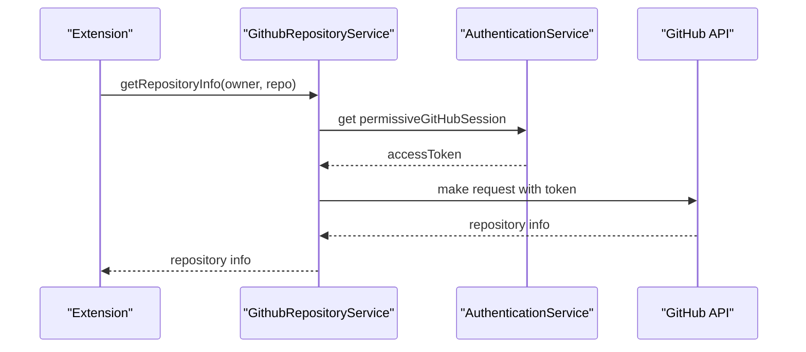

**Diagram sources **
- [githubRepositoryService.ts](file://src/platform/github/node/githubRepositoryService.ts#L12-L44)

### Repository Information Caching
The service implements a caching mechanism to improve performance and reduce API calls:

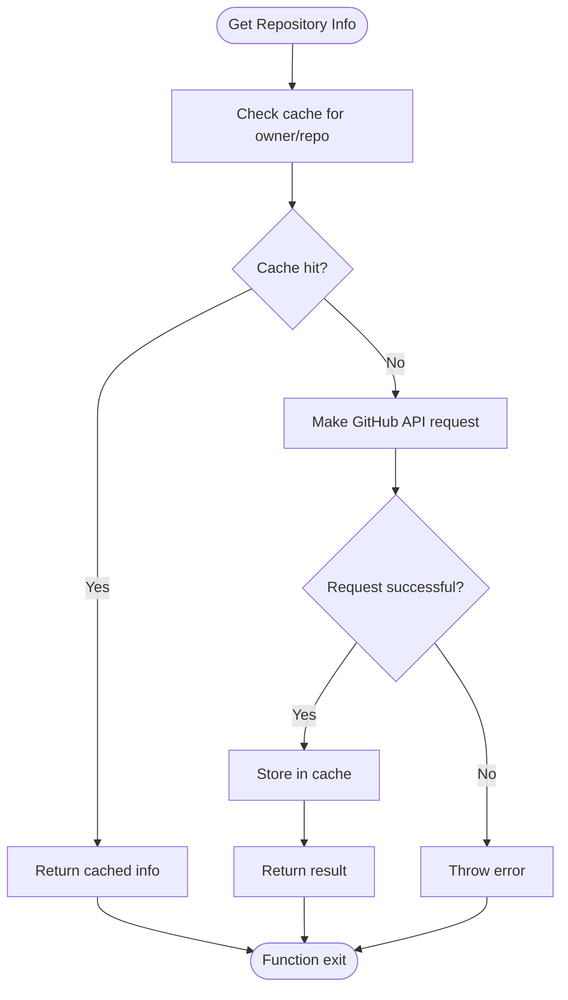

**Diagram sources **
- [githubRepositoryService.ts](file://src/platform/github/node/githubRepositoryService.ts#L26-L44)

**Section sources**
- [githubService.ts](file://src/platform/github/common/githubService.ts#L1-L395)
- [githubRepositoryService.ts](file://src/platform/github/node/githubRepositoryService.ts#L1-L105)

## Language Context Provider Service
The Language Context Provider Service enables language-specific context retrieval, allowing the system to understand and respond to code in various programming languages.

### Core Interface and Capabilities
The ILanguageContextProviderService interface defines the service's capabilities:

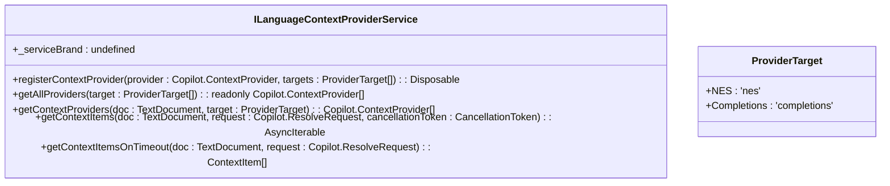

**Diagram sources **
- [languageContextProviderService.ts](file://src/platform/languageContextProvider/common/languageContextProviderService.ts#L16-L31)

### Context Provider Registration
The service allows registration of context providers for different language features:

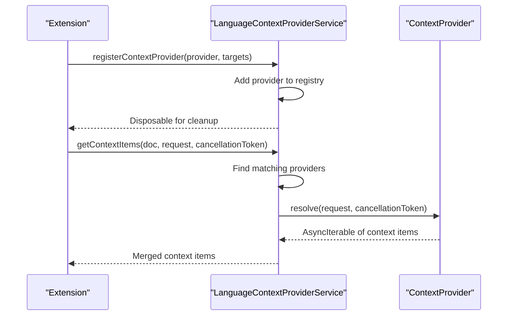

**Diagram sources **
- [languageContextProviderService.ts](file://src/platform/languageContextProvider/common/languageContextProviderService.ts#L21-L27)

### Targeted Context Provision
The service supports different target types for context provision, allowing providers to specialize in specific use cases:

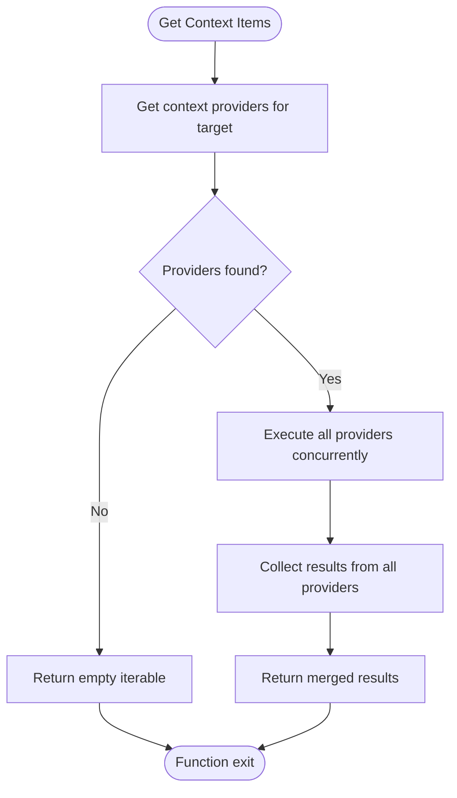

**Diagram sources **
- [languageContextProviderService.ts](file://src/platform/languageContextProvider/common/languageContextProviderService.ts#L27-L30)

**Section sources**
- [languageContextProviderService.ts](file://src/platform/languageContextProvider/common/languageContextProviderService.ts#L1-L31)

## Notebook Service
The Notebook Service provides functionality for working with notebook documents, including variable inspection, package management, and cell execution.

### Core Interface and Capabilities
The INotebookService interface defines the service's capabilities:

```mermaid
classDiagram
class INotebookService {
+_serviceBrand : undefined
+getVariables(notebook : Uri) : Promise<VariablesResult[]>
+getPipPackages(notebook : Uri) : Promise<PipPackage[]>
+getCellExecutions(notebook : Uri) : NotebookCell[]
+runCells(notebook : Uri, range : { start : number; end : number }, autoReveal : boolean) : Promise<void>
+trackAgentUsage() : void
+setFollowState(state : boolean) : void
+getFollowState() : boolean
+ensureKernelSelected(notebook : Uri) : Promise<void>
+hasSupportedNotebooks(uri : Uri) : boolean
+setVariables(notebook : Uri, variables : VariablesResult[]) : void
}
class Variable {
+name : string
+value : string
+type? : string
+summary? : string
}
class VariablesResult {
+variable : Variable
+hasNamedChildren : boolean
+indexedChildrenCount : number
}
class PipPackage {
+name : string
+version : string
}
INotebookService --> Variable : "returns"
INotebookService --> VariablesResult : "returns"
INotebookService --> PipPackage : "returns"
```

**Diagram sources **
- [notebookService.ts](file://src/platform/notebook/common/notebookService.ts#L28-L43)

### Variable and Package Inspection
The service provides methods to inspect variables and installed packages within a notebook:

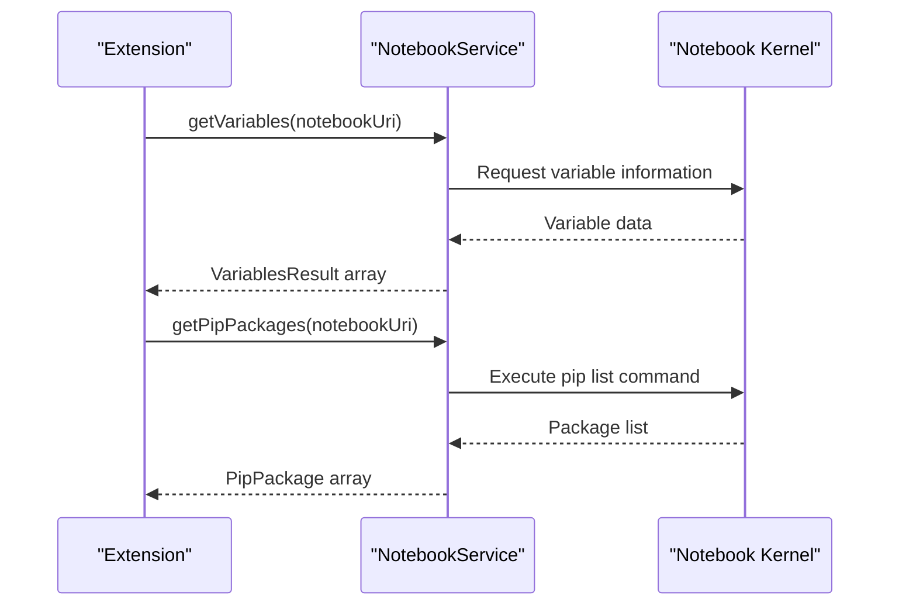

**Diagram sources **
- [notebookService.ts](file://src/platform/notebook/common/notebookService.ts#L32-L33)

### Cell Execution and State Management
The service manages notebook execution state and provides utilities for cell execution:

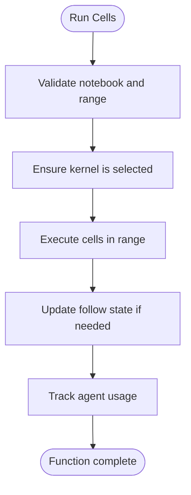

**Diagram sources **
- [notebookService.ts](file://src/platform/notebook/common/notebookService.ts#L35-L37)

**Section sources**
- [notebookService.ts](file://src/platform/notebook/common/notebookService.ts#L1-L43)

## Terminal Service
The Terminal Service provides integration with terminal operations, enabling command execution, output monitoring, and environment management.

### Core Interface and Capabilities
The ITerminalService interface defines the service's capabilities:

```mermaid
classDiagram
class ITerminalService {
+_serviceBrand : undefined
+terminalBuffer : string
+terminalLastCommand : vscode.TerminalExecutedCommand | undefined
+terminalSelection : string
+terminalShellType : string
+onDidChangeTerminalShellIntegration : vscode.Event<vscode.TerminalShellIntegrationChangeEvent>
+onDidEndTerminalShellExecution : vscode.Event<vscode.TerminalShellExecutionEndEvent>
+onDidCloseTerminal : vscode.Event<vscode.Terminal>
+onDidWriteTerminalData : vscode.Event<vscode.TerminalDataWriteEvent>
+createTerminal(name? : string, shellPath? : string, shellArgs? : readonly string[] | string) : vscode.Terminal
+createTerminal(options : vscode.TerminalOptions) : vscode.Terminal
+createTerminal(options : vscode.ExtensionTerminalOptions) : vscode.Terminal
+getBufferForTerminal(terminal : vscode.Terminal, maxChars? : number) : string
+getBufferWithPid(pid : number, maxChars? : number) : Promise<string>
+getLastCommandForTerminal(terminal : vscode.Terminal) : vscode.TerminalExecutedCommand | undefined
+contributePath(contributor : string, pathLocation : string, description? : string | { command : string }, prepend? : boolean) : void
+removePathContribution(contributor : string) : void
+terminals : readonly vscode.Terminal[]
}
class ShellIntegrationQuality {
+None : 'none'
+Basic : 'basic'
+Rich : 'rich'
}
class NullTerminalService {
+Instance : NullTerminalService
+terminalBuffer : string
+terminalLastCommand : vscode.TerminalExecutedCommand | undefined
+terminalSelection : string
+terminalShellType : string
+createTerminal() : vscode.Terminal
+getBufferForTerminal() : string
+getBufferWithPid() : Promise<string>
+getLastCommandForTerminal() : vscode.TerminalExecutedCommand | undefined
+contributePath() : void
+removePathContribution() : void
}
ITerminalService --> ShellIntegrationQuality : "uses"
NullTerminalService --|> ITerminalService : "implements"
```

**Diagram sources **
- [terminalService.ts](file://src/platform/terminal/common/terminalService.ts#L11-L181)

### Terminal Creation and Management
The service provides methods to create and manage terminal instances:

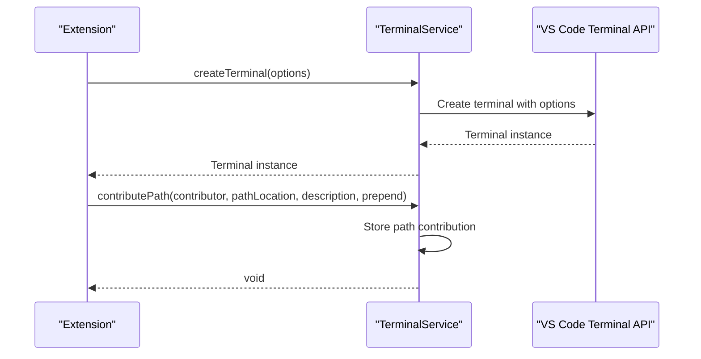

**Diagram sources **
- [terminalService.ts](file://src/platform/terminal/common/terminalService.ts#L33-L71)

### Output and Command Monitoring
The service enables monitoring of terminal output and executed commands:

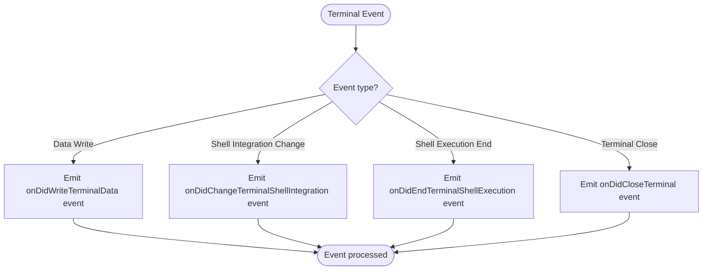

**Diagram sources **
- [terminalService.ts](file://src/platform/terminal/common/terminalService.ts#L25-L28)

**Section sources**
- [terminalService.ts](file://src/platform/terminal/common/terminalService.ts#L1-L181)

## Integration Patterns
The platform services follow consistent patterns for integration with extension features, ensuring a cohesive and predictable API surface.

### Service Abstraction and Dependency Injection
The services use a dependency injection pattern to manage dependencies and promote testability:

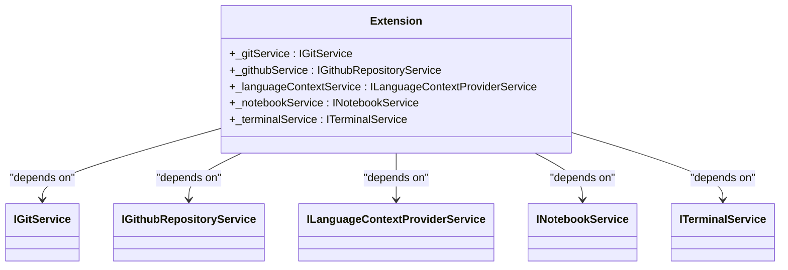

**Diagram sources **
- [gitService.ts](file://src/platform/git/common/gitService.ts#L37-L67)
- [githubService.ts](file://src/platform/github/common/githubService.ts#L57-L312)
- [languageContextProviderService.ts](file://src/platform/languageContextProvider/common/languageContextProviderService.ts#L16-L31)
- [notebookService.ts](file://src/platform/notebook/common/notebookService.ts#L28-L43)
- [terminalService.ts](file://src/platform/terminal/common/terminalService.ts#L11-L181)

### Event-Driven Architecture
The services use an event-driven architecture to communicate state changes:

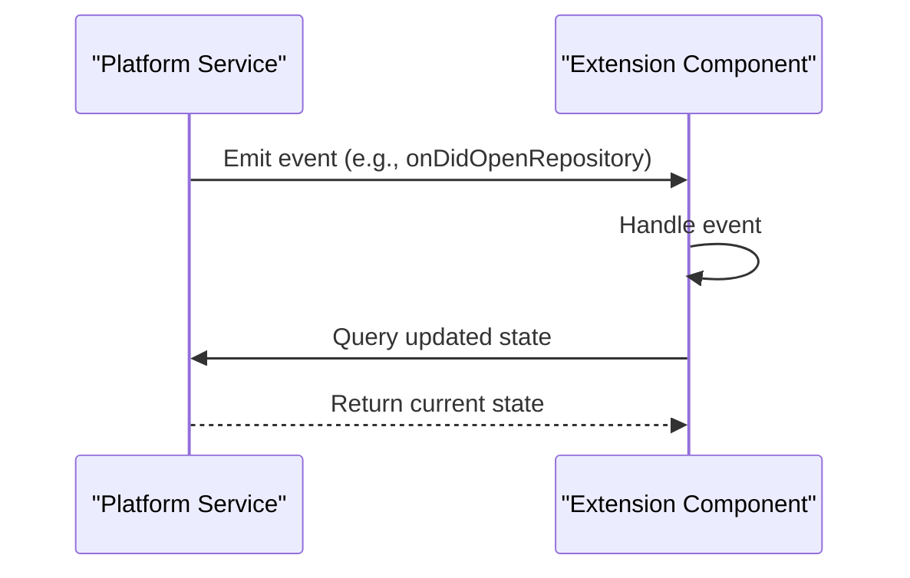

### Observable State Management
Many services use observable patterns for reactive state management:

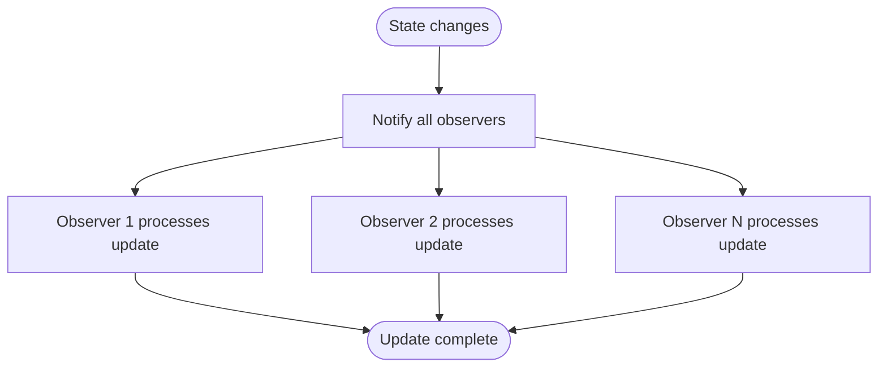

**Section sources**
- [gitService.ts](file://src/platform/git/common/gitService.ts#L43-L45)
- [terminalService.ts](file://src/platform/terminal/common/terminalService.ts#L25-L28)

## Common Integration Challenges
The platform services address several common integration challenges to ensure reliable operation in diverse development environments.

### Authentication Token Management
Managing authentication tokens securely and efficiently is a critical challenge:

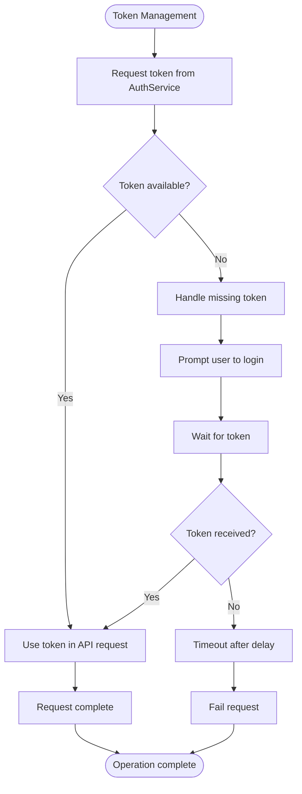

### Git Repository State Synchronization
Keeping the local Git state synchronized with the repository can be challenging:

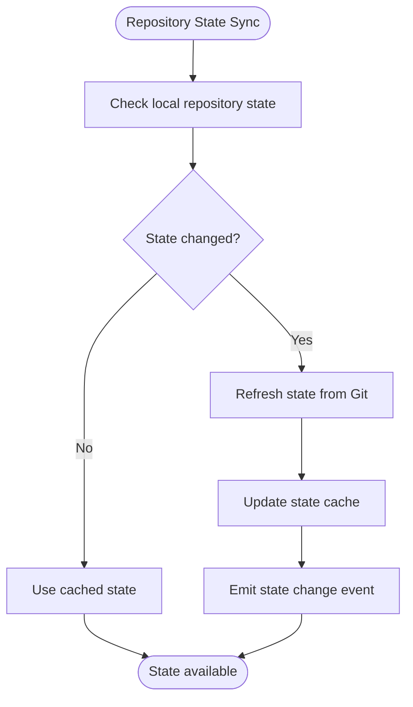

### Terminal Command Execution
Executing commands in terminals requires careful handling of various edge cases:

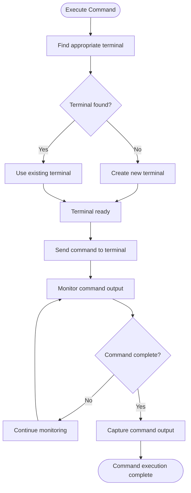

**Section sources**
- [githubRepositoryService.ts](file://src/platform/github/node/githubRepositoryService.ts#L27-L28)
- [gitService.ts](file://src/platform/git/common/gitService.ts#L52-L67)
- [terminalService.ts](file://src/platform/terminal/common/terminalService.ts#L33-L36)

## Performance Considerations
The platform services incorporate several performance optimizations to ensure responsive operation.

### Caching Strategies
Services implement caching to reduce redundant operations:

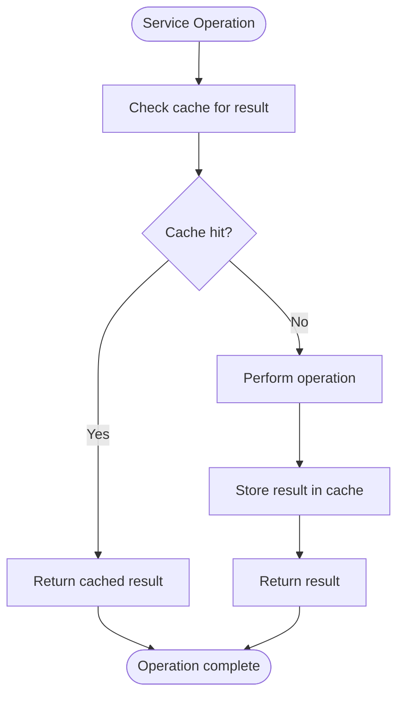

### Asynchronous Operations
Services use asynchronous patterns to avoid blocking the main thread:

```mermaid
flowchart TD
Start([Initiate Operation]) --> NonBlocking["Return promise immediately"]
NonBlocking --> BackgroundTask["Perform operation in background"]
BackgroundTask --> ResolvePromise["Resolve promise with result"]
ResolvePromise --> End([Operation complete])
```

### Resource Management
Services carefully manage resources to prevent memory leaks:

```mermaid
flowchart TD
Start([Service Creation]) --> RegisterDisposables["Register disposables"]
RegisterDisposables --> UseService["Use service"]
UseService --> DisposeService["Dispose service"]
DisposeService --> Cleanup["Cleanup all disposables"]
Cleanup --> End([Resources released])
```

**Section sources**
- [githubRepositoryService.ts](file://src/platform/github/node/githubRepositoryService.ts#L16-L44)
- [gitService.ts](file://src/platform/git/common/gitService.ts#L52-L67)
- [terminalService.ts](file://src/platform/terminal/common/terminalService.ts#L88-L171)

## Error Handling Strategies
The platform services implement robust error handling to ensure graceful degradation.

### Retry Mechanisms
Services implement retry logic for transient failures:

```mermaid
flowchart TD
Start([Operation]) --> Attempt["Attempt operation"]
Attempt --> Success{"Success?"}
Success --> |Yes| ReturnResult["Return result"]
Success --> |No| RetryCount{"Retry count < max?"}
RetryCount --> |Yes| Wait["Wait with exponential backoff"]
Wait --> Attempt
RetryCount --> |No| FailOperation["Fail operation"]
ReturnResult --> End([Complete])
FailOperation --> End
```

### Graceful Degradation
Services provide fallback behavior when features are unavailable:

```mermaid
flowchart TD
Start([Feature Request]) --> CheckAvailability["Check if feature available"]
CheckAvailability --> Available{"Feature available?"}
Available --> |Yes| ExecuteFeature["Execute feature"]
Available --> |No| ProvideFallback["Provide fallback behavior"]
ExecuteFeature --> ReturnResult["Return result"]
ProvideFallback --> ReturnFallback["Return fallback result"]
ReturnResult --> End([Complete])
ReturnFallback --> End
```

### Error Reporting
Services include comprehensive error reporting for debugging:

```mermaid
flowchart TD
Start([Error occurs]) --> LogError["Log error with context"]
LogError --> ReportTelemetry["Report to telemetry"]
ReportTelemetry --> NotifyUser["Notify user if appropriate"]
NotifyUser --> End([Error handled])
```

**Section sources**
- [githubRepositoryService.ts](file://src/platform/github/node/githubRepositoryService.ts#L46-L53)
- [gitService.ts](file://src/platform/git/common/gitService.ts#L52-L67)
- [terminalService.ts](file://src/platform/terminal/common/terminalService.ts#L163-L170)

## Conclusion
The platform services provide a robust foundation for integrating development tools and environments, offering consistent interfaces that abstract platform-specific details. These services enable powerful extension features by providing access to version control, language context, notebook functionality, and terminal operations. The architecture emphasizes modularity, resilience, and performance, with comprehensive error handling and graceful degradation strategies. By following consistent patterns for service abstraction, dependency injection, and event-driven communication, the platform services create a cohesive ecosystem that supports advanced AI-assisted development capabilities. The implementation demonstrates careful attention to authentication security, state synchronization, and resource management, ensuring reliable operation across diverse development scenarios.