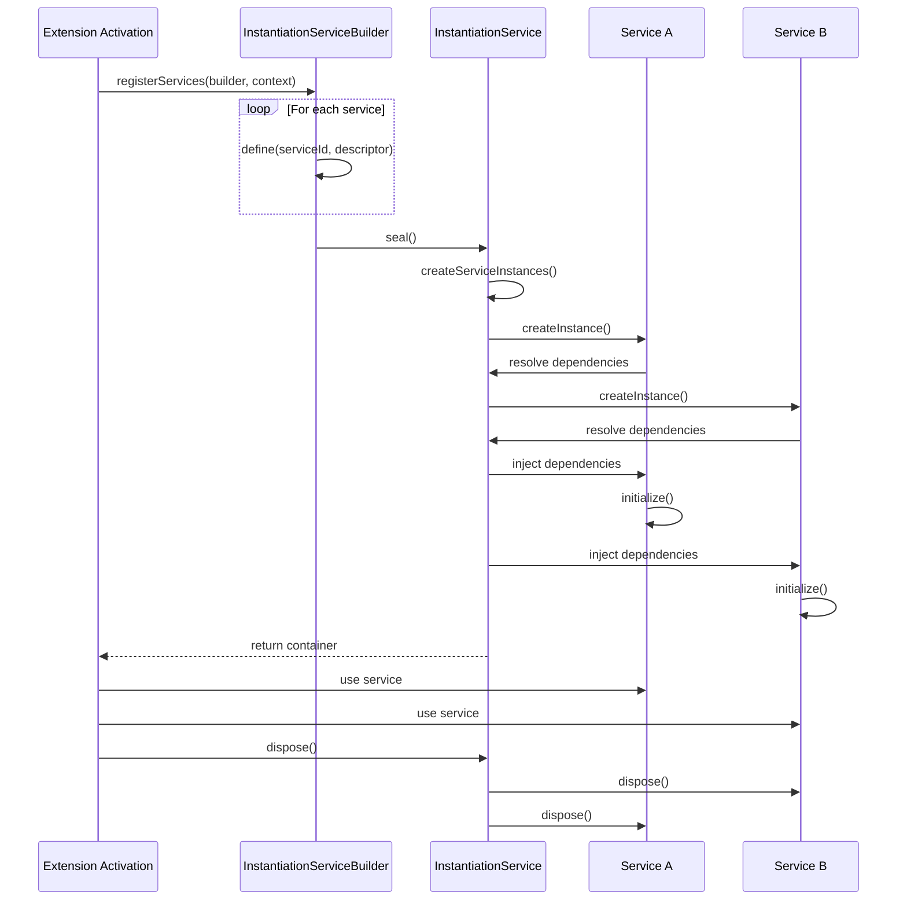
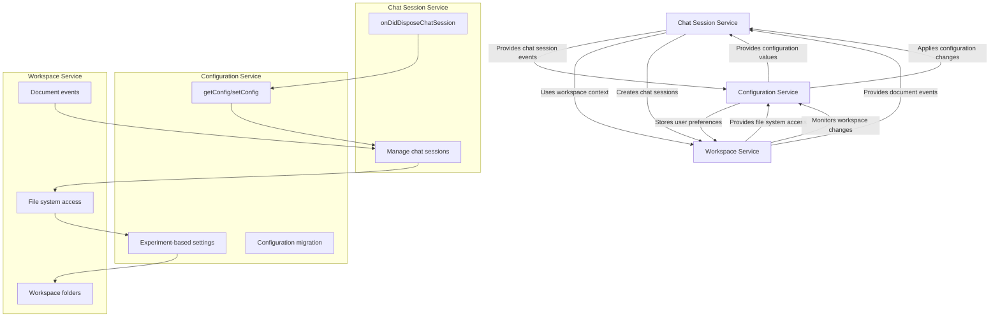
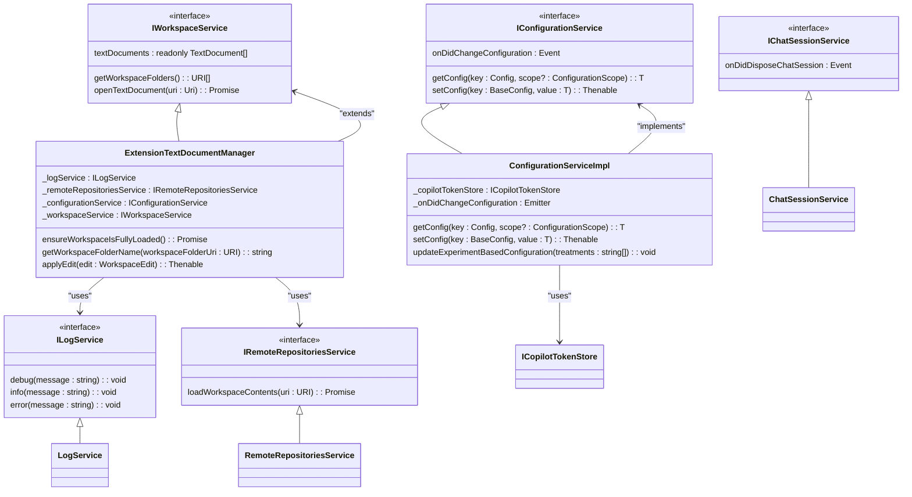
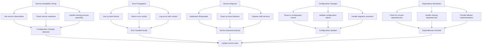
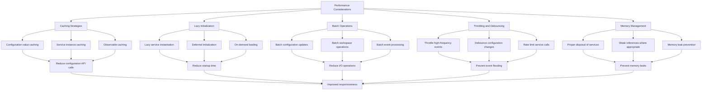

# Service Architecture

<cite>
**Referenced Files in This Document**   
- [chatSessionService.ts](file://src/platform/chat/common/chatSessionService.ts)
- [configurationService.ts](file://src/platform/configuration/common/configurationService.ts)
- [workspaceService.ts](file://src/platform/workspace/common/workspaceService.ts)
- [configurationServiceImpl.ts](file://src/platform/configuration/vscode/configurationServiceImpl.ts)
- [workspaceServiceImpl.ts](file://src/platform/workspace/vscode/workspaceServiceImpl.ts)
- [services.ts](file://src/util/common/services.ts)
- [instantiation.ts](file://src/util/vs/platform/instantiation/common/instantiation.ts)
- [instantiationService.ts](file://src/util/vs/platform/instantiation/common/instantiationService.ts)
- [extension.ts](file://src/extension/extension/vscode/extension.ts)
</cite>

## Table of Contents
1. [Introduction](#introduction)
2. [Service Interface Patterns](#service-interface-patterns)
3. [Service Implementation Strategies](#service-implementation-strategies)
4. [Service Lifecycle Management](#service-lifecycle-management)
5. [Core Service Interactions](#core-service-interactions)
6. [Service Composition Patterns](#service-composition-patterns)
7. [Integration Issues and Error Handling](#integration-issues-and-error-handling)
8. [Performance Considerations](#performance-considerations)
9. [Conclusion](#conclusion)

## Introduction
The vscode-copilot-chat extension implements a service-oriented architecture that provides shared functionality across various extension components. This architecture is built on a dependency injection system that manages service lifecycle, resolves dependencies, and enables loose coupling between components. The core services such as chatSessionService, configurationService, and workspaceService provide essential capabilities that are consumed throughout the codebase. This document details the service architecture, interface patterns, implementation strategies, and interaction patterns that form the foundation of the extension's functionality.

**Section sources**
- [chatSessionService.ts](file://src/platform/chat/common/chatSessionService.ts#L1-L15)
- [configurationService.ts](file://src/platform/configuration/common/configurationService.ts#L1-L892)
- [workspaceService.ts](file://src/platform/workspace/common/workspaceService.ts#L1-L227)

## Service Interface Patterns

The service architecture in vscode-copilot-chat follows a consistent interface pattern based on TypeScript interfaces and service identifiers. Each service is defined as an interface with a corresponding service identifier that enables dependency injection.

```mermaid
classDiagram
class IChatSessionService {
<<interface>>
onDidDisposeChatSession : Event<string>
}
class IConfigurationService {
<<interface>>
getConfig<T>(key : Config<T>, scope? : ConfigurationScope) : T
inspectConfig<T>(key : BaseConfig<T>, scope? : ConfigurationScope) : InspectConfigResult<T> | undefined
isConfigured<T>(key : BaseConfig<T>, scope? : ConfigurationScope) : boolean
getNonExtensionConfig<T>(configKey : string) : T | undefined
setConfig<T>(key : BaseConfig<T>, value : T) : Thenable<void>
getExperimentBasedConfig<T extends ExperimentBasedConfigType>(key : ExperimentBasedConfig<T>, experimentationService : IExperimentationService, scope? : ConfigurationScope) : T
onDidChangeConfiguration : Event<ConfigurationChangeEvent>
updateExperimentBasedConfiguration(treatments : string[]) : void
dumpConfig() : { [key : string] : string }
}
class IWorkspaceService {
<<interface>>
textDocuments : readonly TextDocument[]
notebookDocuments : readonly NotebookDocument[]
onDidOpenTextDocument : Event<TextDocument>
onDidCloseTextDocument : Event<TextDocument>
onDidOpenNotebookDocument : Event<NotebookDocument>
onDidCloseNotebookDocument : Event<NotebookDocument>
onDidChangeTextDocument : Event<TextDocumentChangeEvent>
onDidChangeNotebookDocument : Event<NotebookDocumentChangeEvent>
onDidChangeWorkspaceFolders : Event<WorkspaceFoldersChangeEvent>
onDidChangeTextEditorSelection : Event<TextEditorSelectionChangeEvent>
openTextDocument(uri : Uri) : Promise<TextDocument>
fs : FileSystem
showTextDocument(document : TextDocument) : Promise<void>
openNotebookDocument(uri : Uri) : Promise<NotebookDocument>
openNotebookDocument(notebookType : string, content? : NotebookData) : Promise<NotebookDocument>
getWorkspaceFolders() : URI[]
getWorkspaceFolder(resource : URI) : URI | undefined
getWorkspaceFolderName(workspaceFolderUri : URI) : string
asRelativePath(pathOrUri : string | Uri, includeWorkspaceFolder? : boolean) : string
applyEdit(edit : WorkspaceEdit) : Thenable<boolean>
ensureWorkspaceIsFullyLoaded() : Promise<void>
}
IChatSessionService <|-- ChatSessionService
IConfigurationService <|-- ConfigurationServiceImpl
IWorkspaceService <|-- ExtensionTextDocumentManager
```

**Diagram sources**
- [chatSessionService.ts](file://src/platform/chat/common/chatSessionService.ts#L9-L15)
- [configurationService.ts](file://src/platform/configuration/common/configurationService.ts#L27-L163)
- [workspaceService.ts](file://src/platform/workspace/common/workspaceService.ts#L17-L52)

The service interfaces follow several key patterns:

1. **Service Branding**: Each interface includes a `_serviceBrand` property set to `undefined` to enable TypeScript structural typing while preventing accidental implementation by unrelated classes.

2. **Event-based Communication**: Services expose events (using the `Event` type from VS Code) to enable reactive programming patterns and decouple service consumers from implementation details.

3. **Generic Methods**: Configuration-related services use generic methods to provide type-safe access to configuration values.

4. **Consistent Naming**: Service interfaces follow the naming convention `I<ServiceName>` and are defined in the `common` subdirectory of their respective platform modules.

The service identifier system is implemented through the `createServiceIdentifier` function, which creates unique identifiers for each service type. This enables the dependency injection container to resolve services by their interface rather than concrete implementations.

**Section sources**
- [chatSessionService.ts](file://src/platform/chat/common/chatSessionService.ts#L9-L15)
- [configurationService.ts](file://src/platform/configuration/common/configurationService.ts#L27-L163)
- [workspaceService.ts](file://src/platform/workspace/common/workspaceService.ts#L17-L52)
- [services.ts](file://src/util/common/services.ts#L11-L11)

## Service Implementation Strategies

The service implementation strategy in vscode-copilot-chat follows a layered architecture with abstract base classes and concrete implementations. This approach enables code reuse, testability, and flexibility in service composition.

```mermaid
classDiagram
class AbstractConfigurationService {
<<abstract>>
_onDidChangeConfiguration : Emitter<ConfigurationChangeEvent>
onDidChangeConfiguration : Event<ConfigurationChangeEvent>
_isInternal : boolean
_isTeamMember : boolean
getConfigMixedWithDefaults<T>(key : Config<T>) : T
getDefaultValue<T>(key : BaseConfig<T>) : T
_isUsingTeamDefault(key : BaseConfig<any>) : boolean
isConfigured<T>(key : BaseConfig<T>, scope? : ConfigurationScope) : boolean
getConfigObservable<T>(key : Config<T>) : IObservable<T>
getExperimentBasedConfigObservable<T extends ExperimentBasedConfigType>(key : ExperimentBasedConfig<T>, experimentationService : IExperimentationService) : IObservable<T>
updateExperimentBasedConfiguration(treatments : string[]) : void
}
class ConfigurationServiceImpl {
config : WorkspaceConfiguration
getConfig<T>(key : Config<T>, scope? : ConfigurationScope) : T
inspectConfig<T>(key : BaseConfig<T>, scope? : ConfigurationScope) : InspectConfigResult<T> | undefined
getNonExtensionConfig<T>(configKey : string) : T | undefined
setConfig<T>(key : BaseConfig<T>, value : T) : Thenable<void>
getExperimentBasedConfig<T extends ExperimentBasedConfigType>(key : ExperimentBasedConfig<T>, experimentationService : IExperimentationService, scope? : ConfigurationScope) : T
dumpConfig() : { [key : string] : string }
updateExperimentBasedConfiguration(treatments : string[]) : void
}
class AbstractWorkspaceService {
<<abstract>>
textDocuments : readonly TextDocument[]
notebookDocuments : readonly NotebookDocument[]
onDidOpenTextDocument : Event<TextDocument>
onDidCloseTextDocument : Event<TextDocument>
onDidOpenNotebookDocument : Event<NotebookDocument>
onDidCloseNotebookDocument : Event<NotebookDocument>
onDidChangeTextDocument : Event<TextDocumentChangeEvent>
onDidChangeNotebookDocument : Event<NotebookDocumentChangeEvent>
onDidChangeWorkspaceFolders : Event<WorkspaceFoldersChangeEvent>
onDidChangeTextEditorSelection : Event<TextEditorSelectionChangeEvent>
openTextDocument(uri : Uri) : Promise<TextDocument>
fs : FileSystem
showTextDocument(document : TextDocument) : Promise<void>
openNotebookDocument(uri : Uri) : Promise<NotebookDocument>
openNotebookDocument(notebookType : string, content? : NotebookData) : Promise<NotebookDocument>
getWorkspaceFolders() : URI[]
getWorkspaceFolder(resource : URI) : URI | undefined
getWorkspaceFolderName(workspaceFolderUri : URI) : string
asRelativePath(pathOrUri : string | Uri, includeWorkspaceFolder? : boolean) : string
applyEdit(edit : WorkspaceEdit) : Thenable<boolean>
ensureWorkspaceIsFullyLoaded() : Promise<void>
showWorkspaceFolderPicker() : Promise<WorkspaceFolder | undefined>
openTextDocumentAndSnapshot(uri : Uri) : Promise<TextDocumentSnapshot>
openNotebookDocumentAndSnapshot(uri : Uri, format : 'xml' | 'json' | 'text') : Promise<NotebookDocumentSnapshot>
}
class ExtensionTextDocumentManager {
_fullyLoadedPromise : Promise<void> | undefined
_logService : ILogService
_remoteRepositoriesService : IRemoteRepositoriesService
textDocuments : readonly TextDocument[]
onDidOpenTextDocument : Event<TextDocument>
onDidChangeTextDocument : Event<TextDocumentChangeEvent>
onDidOpenNotebookDocument : Event<NotebookDocument>
onDidCloseNotebookDocument : Event<NotebookDocument>
onDidCloseTextDocument : Event<TextDocumentChangeEvent>
onDidChangeWorkspaceFolders : Event<WorkspaceFoldersChangeEvent>
onDidChangeNotebookDocument : Event<NotebookDocumentChangeEvent>
onDidChangeTextEditorSelection : Event<TextEditorSelectionChangeEvent>
openTextDocument(uri : Uri) : Promise<TextDocument>
fs : FileSystem
showTextDocument(document : TextDocument) : Promise<void>
openNotebookDocument(uri : Uri) : Promise<NotebookDocument>
openNotebookDocument(notebookType : string, content? : NotebookData) : Promise<NotebookDocument>
getWorkspaceFolders() : URI[]
getWorkspaceFolderName(workspaceFolderUri : URI) : string
asRelativePath(pathOrUri : string | Uri, includeWorkspaceFolder? : boolean) : string
applyEdit(edit : WorkspaceEdit) : Thenable<boolean>
ensureWorkspaceIsFullyLoaded() : Promise<void>
showWorkspaceFolderPicker() : Promise<WorkspaceFolder | undefined>
}
AbstractConfigurationService <|-- ConfigurationServiceImpl
AbstractWorkspaceService <|-- ExtensionTextDocumentManager
```

**Diagram sources**
- [configurationService.ts](file://src/platform/configuration/common/configurationService.ts#L167-L332)
- [configurationServiceImpl.ts](file://src/platform/configuration/vscode/configurationServiceImpl.ts#L22-L315)
- [workspaceService.ts](file://src/platform/workspace/common/workspaceService.ts#L54-L125)
- [workspaceServiceImpl.ts](file://src/platform/workspace/vscode/workspaceServiceImpl.ts#L14-L113)

The implementation strategy follows several key principles:

1. **Abstract Base Classes**: Each service has an abstract base class (e.g., `AbstractConfigurationService`, `AbstractWorkspaceService`) that provides common functionality and implements shared methods.

2. **Platform-specific Implementations**: Concrete implementations are located in platform-specific directories (e.g., `vscode` directory) and extend the abstract base classes.

3. **Dependency Injection**: Services declare their dependencies through constructor parameters decorated with service identifiers (e.g., `@ICopilotTokenStore`, `@ILogService`).

4. **Event-driven Architecture**: Services use event emitters to communicate state changes to consumers without creating tight coupling.

5. **Configuration Registry**: The configuration service uses a global registry (`globalConfigRegistry`) to manage all configuration settings, enabling centralized validation and migration.

The `ConfigurationServiceImpl` demonstrates a sophisticated implementation strategy that handles multiple configuration sources, including:
- VS Code workspace configuration
- Experimentation service values
- Default values with team and internal overrides
- Advanced settings with flat and object-style access patterns

**Section sources**
- [configurationService.ts](file://src/platform/configuration/common/configurationService.ts#L167-L332)
- [configurationServiceImpl.ts](file://src/platform/configuration/vscode/configurationServiceImpl.ts#L22-L315)
- [workspaceService.ts](file://src/platform/workspace/common/workspaceService.ts#L54-L125)
- [workspaceServiceImpl.ts](file://src/platform/workspace/vscode/workspaceServiceImpl.ts#L14-L113)

## Service Lifecycle Management

The service lifecycle management in vscode-copilot-chat is handled by a sophisticated dependency injection container that manages service creation, disposal, and error handling. The lifecycle follows a well-defined pattern from activation to disposal.



**Diagram sources**
- [extension.ts](file://src/extension/extension/vscode/extension.ts#L25-L39)
- [instantiationService.ts](file://src/util/vs/platform/instantiation/common/instantiationService.ts#L125-L299)
- [instantiation.ts](file://src/util/vs/platform/instantiation/common/instantiation.ts#L109-L133)

The service lifecycle consists of the following phases:

1. **Registration**: During extension activation, services are registered with the `InstantiationServiceBuilder` through the `registerServices` callback.

2. **Sealing**: The builder is sealed to create an `InstantiationService` container that manages service instances.

3. **Instantiation**: Services are created on-demand when first requested, with dependencies automatically resolved and injected.

4. **Activation**: Services may perform initialization tasks when created, often subscribing to events or setting up internal state.

5. **Usage**: Services are used throughout the application lifecycle to provide shared functionality.

6. **Disposal**: When the extension is deactivated, services are disposed of in reverse order of creation to clean up resources.

The dependency injection container implements several key features for lifecycle management:

- **Lazy Instantiation**: Services are only created when first requested, reducing startup time and memory usage.
- **Circular Dependency Detection**: The container detects and prevents circular dependencies between services.
- **Recursive Disposal**: The container ensures all services are properly disposed of when the extension is deactivated.
- **Error Handling**: The container provides detailed error messages for missing dependencies or instantiation failures.

The `InstantiationService` class implements a sophisticated algorithm for service creation that handles dependency resolution, cycle detection, and error reporting. It uses a graph-based approach to resolve dependencies and ensure services are created in the correct order.

**Section sources**
- [extension.ts](file://src/extension/extension/vscode/extension.ts#L25-L39)
- [instantiationService.ts](file://src/util/vs/platform/instantiation/common/instantiationService.ts#L125-L299)
- [instantiation.ts](file://src/util/vs/platform/instantiation/common/instantiation.ts#L109-L133)

## Core Service Interactions

The core services in vscode-copilot-chat interact through well-defined interfaces and patterns that enable loose coupling and flexible composition. The primary services—chatSessionService, configurationService, and workspaceService—work together to provide the extension's functionality.



**Diagram sources**
- [chatSessionService.ts](file://src/platform/chat/common/chatSessionService.ts#L1-L15)
- [configurationService.ts](file://src/platform/configuration/common/configurationService.ts#L1-L892)
- [workspaceService.ts](file://src/platform/workspace/common/workspaceService.ts#L1-L227)

The interaction patterns between core services include:

1. **Configuration-Driven Behavior**: The `configurationService` provides configuration values that control the behavior of other services. For example, feature flags and model preferences from the configuration service influence how the `chatSessionService` operates.

2. **Workspace Context Provision**: The `workspaceService` provides access to workspace files, documents, and folders, which the `chatSessionService` uses to provide context for chat sessions.

3. **Event Propagation**: Services communicate through events rather than direct method calls. For example, the `chatSessionService` emits events when chat sessions are disposed, which other components can react to.

4. **Dependency Injection**: Services are injected into each other through the dependency injection container, enabling loose coupling and testability.

5. **Configuration Migration**: The `configurationService` handles migration of settings from old to new formats, ensuring backward compatibility while evolving the configuration schema.

The `configurationService` plays a central role in coordinating interactions between services by:
- Providing experiment-based configuration values that can enable or disable features across the application
- Managing configuration migrations that affect multiple services
- Exposing observables for configuration changes that services can react to
- Validating configuration values before they are used by other services

**Section sources**
- [chatSessionService.ts](file://src/platform/chat/common/chatSessionService.ts#L1-L15)
- [configurationService.ts](file://src/platform/configuration/common/configurationService.ts#L1-L892)
- [workspaceService.ts](file://src/platform/workspace/common/workspaceService.ts#L1-L227)

## Service Composition Patterns

The service architecture in vscode-copilot-chat employs several composition patterns that enable higher-level services to orchestrate multiple lower-level services. These patterns promote code reuse, maintainability, and flexibility in the system design.



**Diagram sources**
- [configurationServiceImpl.ts](file://src/platform/configuration/vscode/configurationServiceImpl.ts#L22-L315)
- [workspaceServiceImpl.ts](file://src/platform/workspace/vscode/workspaceServiceImpl.ts#L14-L113)
- [configurationService.ts](file://src/platform/configuration/common/configurationService.ts#L27-L163)
- [workspaceService.ts](file://src/platform/workspace/common/workspaceService.ts#L17-L52)

The primary service composition patterns include:

1. **Dependency Aggregation**: Higher-level services aggregate multiple lower-level services to provide coordinated functionality. For example, the `ExtensionTextDocumentManager` combines logging, remote repository access, configuration, and workspace services to manage workspace operations.

2. **Abstract Base Classes with Mixins**: Services use abstract base classes that provide common functionality, which is then extended by platform-specific implementations. This pattern enables code reuse while allowing platform-specific adaptations.

3. **Event Coordination**: Services coordinate their behavior through events rather than direct method calls. For example, when configuration changes, the `configurationService` emits an event that other services can react to.

4. **Configuration-Driven Composition**: The composition of services is influenced by configuration values, allowing the system behavior to be modified without code changes.

5. **Layered Architecture**: Services are organized in layers, with higher-level services depending on lower-level ones but not vice versa. This creates a clear dependency hierarchy and prevents circular dependencies.

The `ConfigurationServiceImpl` demonstrates sophisticated composition by:
- Depending on the `ICopilotTokenStore` service to determine user permissions
- Using VS Code's workspace configuration API to read and write settings
- Integrating with the experimentation service to provide experiment-based configuration values
- Managing configuration migrations that affect multiple parts of the system

**Section sources**
- [configurationServiceImpl.ts](file://src/platform/configuration/vscode/configurationServiceImpl.ts#L22-L315)
- [workspaceServiceImpl.ts](file://src/platform/workspace/vscode/workspaceServiceImpl.ts#L14-L113)

## Integration Issues and Error Handling

The service architecture in vscode-copilot-chat addresses common integration issues through robust error handling, proper service disposal, and careful management of service availability timing.



**Diagram sources**
- [instantiationService.ts](file://src/util/vs/platform/instantiation/common/instantiationService.ts#L125-L299)
- [configurationService.ts](file://src/platform/configuration/common/configurationService.ts#L167-L332)
- [workspaceService.ts](file://src/platform/workspace/common/workspaceService.ts#L132-L227)

Key integration issues and their solutions include:

1. **Service Availability Timing**: Services may not be available immediately when needed. The architecture addresses this by:
   - Using lazy instantiation to create services on-demand
   - Providing observables for configuration changes that services can react to
   - Implementing readiness checks before using services

2. **Error Propagation**: Errors in one service should not crash the entire extension. The architecture handles this by:
   - Using try-catch blocks around service calls
   - Returning error results rather than throwing exceptions
   - Logging errors with sufficient context for debugging

3. **Proper Service Disposal**: Services must clean up resources when disposed. The architecture ensures this by:
   - Implementing the `IDisposable` interface for all services
   - Using `DisposableStore` to manage multiple disposables
   - Cleaning up event listeners and other resources in the dispose method

4. **Configuration Change Handling**: Configuration changes can affect multiple services. The architecture handles this by:
   - Emitting events when configuration changes
   - Providing methods to validate configuration values
   - Implementing configuration migration strategies

5. **Dependency Resolution**: The dependency injection container handles dependency resolution issues by:
   - Detecting and preventing circular dependencies
   - Providing clear error messages for missing dependencies
   - Supporting fallback implementations for optional dependencies

The `InstantiationService` class implements robust error handling for service creation, including:
- Cycle detection to prevent infinite recursion
- Strict mode that throws errors for missing dependencies
- Tracing to help diagnose instantiation issues
- Parent-child service relationships for hierarchical disposal

**Section sources**
- [instantiationService.ts](file://src/util/vs/platform/instantiation/common/instantiationService.ts#L125-L299)
- [configurationService.ts](file://src/platform/configuration/common/configurationService.ts#L167-L332)
- [workspaceService.ts](file://src/platform/workspace/common/workspaceService.ts#L132-L227)

## Performance Considerations

The service architecture in vscode-copilot-chat incorporates several performance optimizations to ensure responsive operation and efficient resource usage, particularly for high-frequency service interactions.



**Diagram sources**
- [configurationService.ts](file://src/platform/configuration/common/configurationService.ts#L277-L301)
- [instantiationService.ts](file://src/util/vs/platform/instantiation/common/instantiationService.ts#L174-L182)
- [workspaceService.ts](file://src/platform/workspace/common/workspaceService.ts#L109-L113)

Key performance considerations and optimization strategies include:

1. **Caching Strategies**: The architecture employs several caching mechanisms to reduce redundant operations:
   - Configuration values are cached to minimize calls to the VS Code configuration API
   - Service instances are cached by the dependency injection container to avoid repeated creation
   - Observables are cached to prevent recreating event subscriptions

2. **Lazy Initialization**: Services are instantiated only when needed, reducing startup time and memory usage:
   - Services are created on-demand when first requested
   - Expensive initialization tasks are deferred until necessary
   - Resources are loaded only when required

3. **Batch Operations**: Related operations are batched to reduce overhead:
   - Configuration updates are batched where possible
   - Workspace operations are optimized to minimize I/O
   - Events are processed in batches to reduce processing overhead

4. **Throttling and Debouncing**: High-frequency operations are controlled to prevent performance issues:
   - Configuration change events are debounced to avoid excessive processing
   - Service calls are rate-limited to prevent overwhelming external systems
   - Events are throttled to prevent flooding the system

5. **Memory Management**: The architecture includes mechanisms to prevent memory leaks:
   - Services implement proper disposal patterns to clean up resources
   - Event listeners are removed when no longer needed
   - References are managed to prevent accidental retention

The `configurationService` implements specific performance optimizations:
- Caching of configuration observables to prevent recreating subscriptions
- Batched handling of configuration change events
- Efficient comparison of configuration values to minimize unnecessary updates

The dependency injection container also contributes to performance by:
- Caching service instances to avoid repeated creation
- Optimizing dependency resolution through graph-based algorithms
- Providing efficient disposal of service hierarchies

**Section sources**
- [configurationService.ts](file://src/platform/configuration/common/configurationService.ts#L277-L301)
- [instantiationService.ts](file://src/util/vs/platform/instantiation/common/instantiationService.ts#L174-L182)
- [workspaceService.ts](file://src/platform/workspace/common/workspaceService.ts#L109-L113)

## Conclusion

The service-oriented architecture of vscode-copilot-chat provides a robust foundation for the extension's functionality, enabling shared services to be used across multiple components while maintaining loose coupling and high maintainability. The architecture is built on a sophisticated dependency injection system that manages service lifecycle, resolves dependencies, and handles error conditions.

Key architectural strengths include:
- Clear separation of concerns through well-defined service interfaces
- Flexible composition patterns that enable higher-level services to orchestrate multiple lower-level ones
- Robust lifecycle management that ensures proper initialization and disposal
- Comprehensive error handling that prevents failures in one service from affecting others
- Performance optimizations that ensure responsive operation even with high-frequency service interactions

The core services—chatSessionService, configurationService, and workspaceService—work together through well-defined interfaces and patterns to provide the extension's functionality. The architecture demonstrates best practices in service-oriented design, including dependency injection, event-driven communication, and layered organization.

This architecture enables the extension to be extensible, maintainable, and performant, providing a solid foundation for future enhancements and feature development.

**Section sources**
- [chatSessionService.ts](file://src/platform/chat/common/chatSessionService.ts#L1-L15)
- [configurationService.ts](file://src/platform/configuration/common/configurationService.ts#L1-L892)
- [workspaceService.ts](file://src/platform/workspace/common/workspaceService.ts#L1-L227)
- [instantiationService.ts](file://src/util/vs/platform/instantiation/common/instantiationService.ts#L125-L299)
- [extension.ts](file://src/extension/extension/vscode/extension.ts#L25-L39)