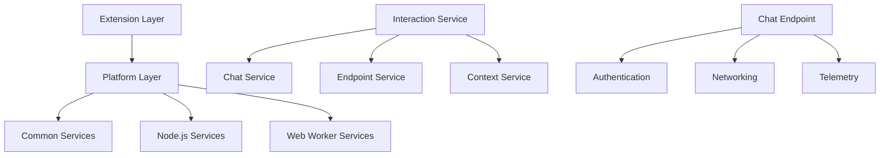
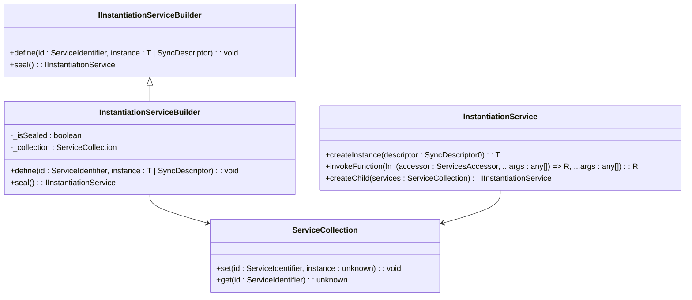
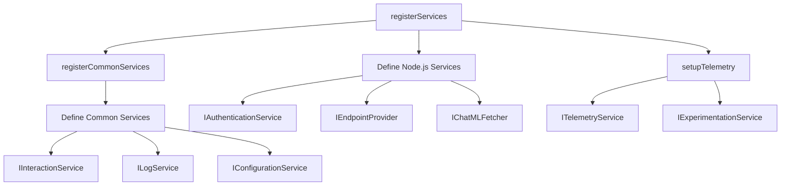
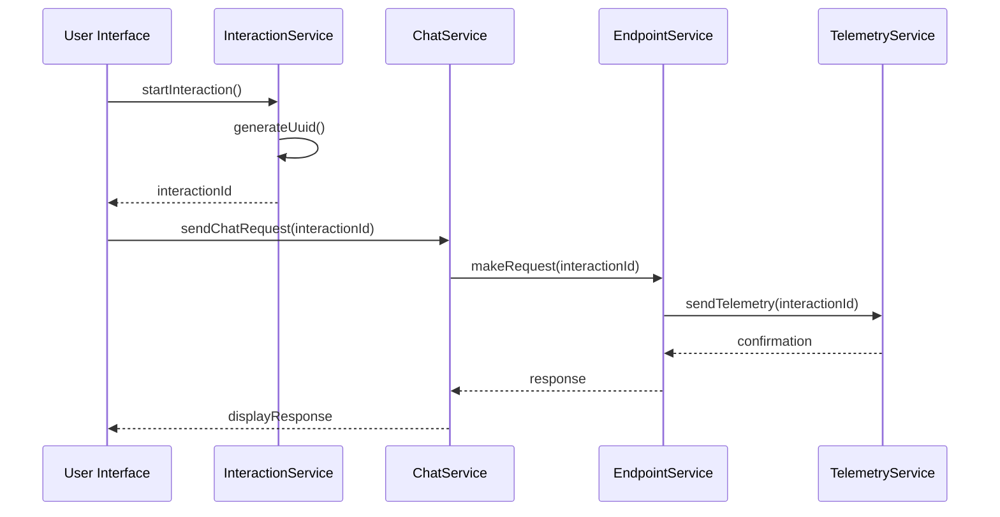
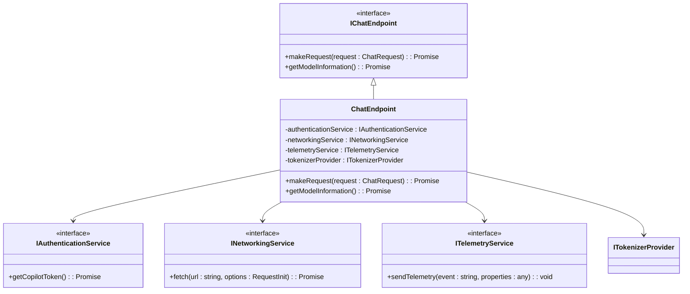
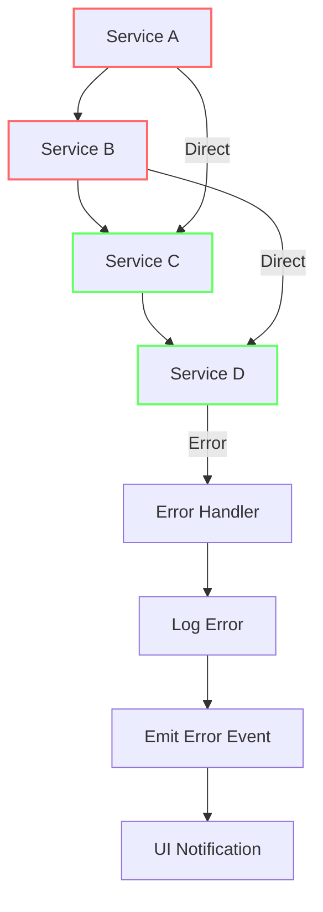
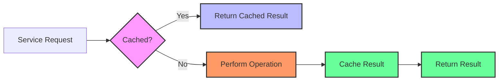

# Service Composition

<cite>
**Referenced Files in This Document**   
- [services.ts](file://src/extension/extension/vscode/services.ts)
- [services.ts](file://src/extension/extension/vscode-node/services.ts)
- [interactionService.ts](file://src/platform/chat/common/interactionService.ts)
- [chatEndpoint.ts](file://src/platform/endpoint/node/chatEndpoint.ts)
- [endpointProvider.ts](file://src/platform/endpoint/common/endpointProvider.ts)
- [authentication.ts](file://src/platform/authentication/common/authentication.ts)
- [instantiationService.ts](file://src/util/vs/platform/instantiation/common/instantiationService.ts)
- [instantiation.ts](file://src/util/vs/platform/instantiation/common/instantiation.ts)
</cite>

## Table of Contents
1. [Introduction](#introduction)
2. [Service Composition Patterns](#service-composition-patterns)
3. [Service Registration and Dependency Injection](#service-registration-and-dependency-injection)
4. [Extension Layer Service Composition](#extension-layer-service-composition)
5. [Interaction Service Coordination](#interaction-service-coordination)
6. [Chat Endpoint Composition](#chat-endpoint-composition)
7. [Common Service Composition Issues](#common-service-composition-issues)
8. [Performance Considerations](#performance-considerations)
9. [Conclusion](#conclusion)

## Introduction
The vscode-copilot-chat extension employs a sophisticated service composition architecture to orchestrate complex AI-powered features. This document details the service composition patterns used throughout the codebase, focusing on how higher-level services coordinate multiple lower-level services to implement functionality. The system leverages a dependency injection framework based on the instantiation service pattern, enabling flexible service registration and resolution. Key components like the interaction service coordinate between chat, endpoint, and context services during conversation processing, while the chat endpoint composes authentication, networking, and telemetry services for AI model communication.

**Section sources**
- [services.ts](file://src/extension/extension/vscode/services.ts#L1-L177)
- [services.ts](file://src/extension/extension/vscode-node/services.ts#L1-L236)

## Service Composition Patterns
The vscode-copilot-chat extension implements a layered service composition architecture that separates concerns across different execution environments. The system follows a hierarchical pattern where services are organized by their execution context and capabilities. The primary composition patterns include:

1. **Layered Service Architecture**: Services are organized into three distinct layers based on their execution environment:
   - Common services that run in both web and node.js extension hosts
   - Node.js-specific services that require access to file system or other node.js APIs
   - Web worker services that run in isolated web worker contexts

2. **Service Orchestration**: Higher-level services coordinate multiple lower-level services to implement complex features. For example, the interaction service orchestrates chat, endpoint, and context services during conversation processing, while the chat endpoint composes authentication, networking, and telemetry services for AI model communication.

3. **Feature-Specific Composition**: The extension layer composes platform services to provide feature-specific functionality. This pattern allows for the creation of specialized services that combine multiple platform capabilities to deliver cohesive user experiences.

**Diagram sources**
- [services.ts](file://src/extension/extension/vscode/services.ts#L111-L176)
- [services.ts](file://src/extension/extension/vscode-node/services.ts#L119-L207)

**Section sources**
- [services.ts](file://src/extension/extension/vscode/services.ts#L111-L176)
- [services.ts](file://src/extension/extension/vscode-node/services.ts#L119-L207)

## Service Registration and Dependency Injection
The vscode-copilot-chat extension implements a robust service registration and dependency injection mechanism using the instantiation service pattern. This pattern enables flexible service composition and dependency management throughout the application.

The core of this system is the `IInstantiationServiceBuilder` interface, which provides a fluent API for defining and sealing service collections. Services are registered using service identifiers created with the `createServiceIdentifier` function, which ensures type safety and prevents naming conflicts.

**Diagram sources**
- [services.ts](file://src/util/common/services.ts#L13-L43)
- [instantiationService.ts](file://src/util/vs/platform/instantiation/common/instantiationService.ts#L125-L343)
- [instantiation.ts](file://src/util/vs/platform/instantiation/common/instantiation.ts#L39-L133)

**Section sources**
- [services.ts](file://src/util/common/services.ts#L13-L43)
- [instantiationService.ts](file://src/util/vs/platform/instantiation/common/instantiationService.ts#L125-L343)
- [instantiation.ts](file://src/util/vs/platform/instantiation/common/instantiation.ts#L39-L133)

## Extension Layer Service Composition
The extension layer services.ts files demonstrate how platform services are composed to provide feature-specific functionality. The architecture follows a hierarchical pattern where common services are defined in the vscode/services.ts file, while environment-specific services are defined in vscode-node/services.ts and vscode-worker/services.ts.

The `registerServices` function in each services.ts file uses the `IInstantiationServiceBuilder` to define service instances and descriptors. Services are registered with their interfaces as identifiers and their implementations as instances or synchronous descriptors. This pattern allows for both immediate instantiation of simple services and deferred instantiation of complex services.

**Diagram sources**
- [services.ts](file://src/extension/extension/vscode/services.ts#L111-L176)
- [services.ts](file://src/extension/extension/vscode-node/services.ts#L119-L207)

**Section sources**
- [services.ts](file://src/extension/extension/vscode/services.ts#L111-L176)
- [services.ts](file://src/extension/extension/vscode-node/services.ts#L119-L207)

## Interaction Service Coordination
The interaction service plays a critical role in coordinating between chat, endpoint, and context services during conversation processing. Implemented as the `InteractionService` class, this service tracks user interactions with the chat interface and provides a unique interaction ID for grouping related requests.

The service uses a simple but effective pattern of generating a new UUID when a new interaction begins. This interaction ID is then used for telemetry collection to group related requests and responses, providing valuable insights into user behavior and conversation patterns.

**Diagram sources**
- [interactionService.ts](file://src/platform/chat/common/interactionService.ts#L1-L36)

**Section sources**
- [interactionService.ts](file://src/platform/chat/common/interactionService.ts#L1-L36)

## Chat Endpoint Composition
The chat endpoint service composes multiple lower-level services to handle AI model communication. This service acts as a facade that coordinates authentication, networking, and telemetry services to provide a unified interface for chat functionality.

The endpoint composition follows a dependency injection pattern where the chat endpoint receives instances of authentication, networking, and telemetry services through its constructor. This allows for flexible configuration and testing, as different implementations can be injected based on the execution environment.

**Diagram sources**
- [chatEndpoint.ts](file://src/platform/endpoint/node/chatEndpoint.ts)
- [endpointProvider.ts](file://src/platform/endpoint/common/endpointProvider.ts#L1-L147)
- [authentication.ts](file://src/platform/authentication/common/authentication.ts#L1-L316)

**Section sources**
- [chatEndpoint.ts](file://src/platform/endpoint/node/chatEndpoint.ts)
- [endpointProvider.ts](file://src/platform/endpoint/common/endpointProvider.ts#L1-L147)

## Common Service Composition Issues
The vscode-copilot-chat extension addresses several common issues in service composition, including circular dependencies, service availability timing, and error propagation across service boundaries.

### Circular Dependencies
The system prevents circular dependencies through careful service design and the use of the instantiation service's cycle detection capabilities. The `InstantiationService` class includes built-in cycle detection that throws a `CyclicDependencyError` when circular dependencies are detected during service creation.

### Service Availability Timing
Service availability is managed through the use of synchronous descriptors and lazy instantiation. Services that are expensive to create or have complex dependencies can be registered as synchronous descriptors, which are only instantiated when first requested.

### Error Propagation
Error handling across service boundaries is implemented through a combination of try-catch blocks and event-driven error reporting. Services that depend on other services wrap calls in try-catch blocks and emit error events when exceptions occur, allowing higher-level components to handle errors appropriately.

**Section sources**
- [instantiationService.ts](file://src/util/vs/platform/instantiation/common/instantiationService.ts#L209-L288)
- [authentication.ts](file://src/platform/authentication/common/authentication.ts#L215-L233)

## Performance Considerations
The service composition architecture in vscode-copilot-chat includes several performance optimizations to reduce service call overhead and improve responsiveness.

### Service Instantiation Optimization
The system uses lazy instantiation for services that are expensive to create or may not be needed during a user session. The `InstantiationService` class supports delayed instantiation through the `supportsDelayedInstantiation` parameter, which creates a proxy object that is only instantiated when first accessed.

### Caching Strategies
Several services implement caching to avoid redundant operations. For example, the token store caches authentication tokens to avoid repeated network requests, and the configuration service caches configuration values to prevent repeated file system access.

### Asynchronous Operations
The architecture leverages asynchronous operations extensively to prevent blocking the main thread. Service methods that perform I/O operations return promises, allowing the calling code to continue execution while waiting for the operation to complete.

**Section sources**
- [instantiationService.ts](file://src/util/vs/platform/instantiation/common/instantiationService.ts#L308-L343)
- [authentication.ts](file://src/platform/authentication/common/authentication.ts#L215-L233)

## Conclusion
The service composition patterns in vscode-copilot-chat demonstrate a sophisticated approach to organizing and coordinating complex functionality. By leveraging the instantiation service pattern for dependency injection, the system achieves a high degree of modularity and flexibility. The layered architecture separates concerns across different execution environments, while the orchestration of services through components like the interaction service and chat endpoint enables cohesive user experiences. The system effectively addresses common service composition challenges and includes performance optimizations to ensure responsiveness. This architecture provides a solid foundation for extending the extension with new features while maintaining code quality and maintainability.