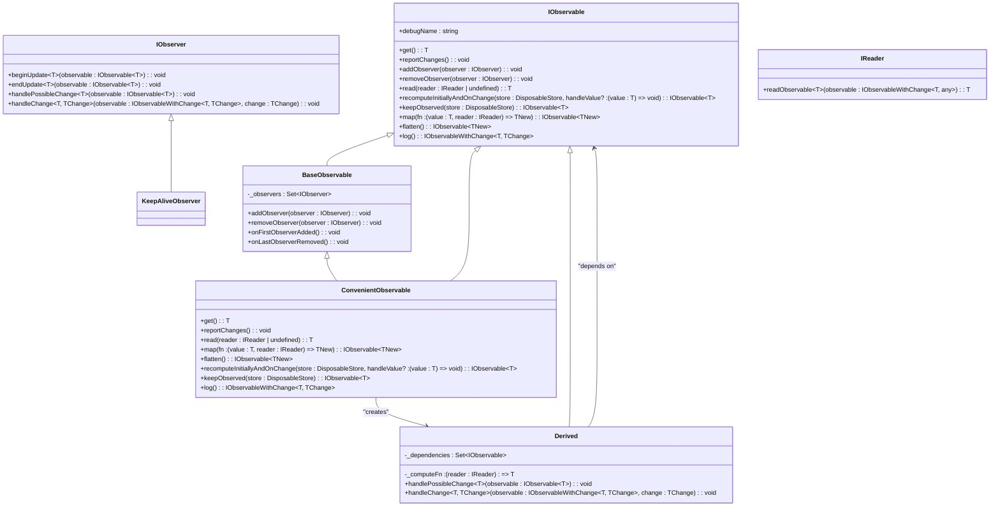
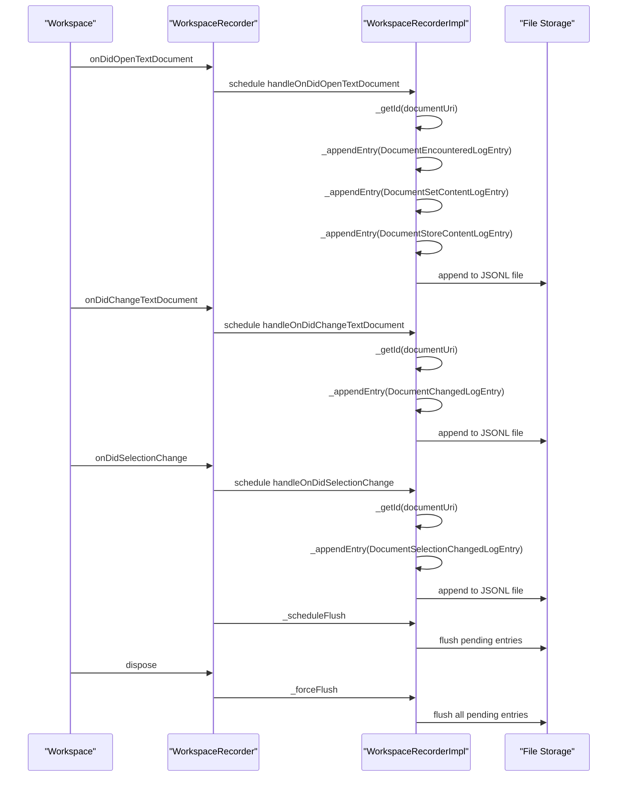
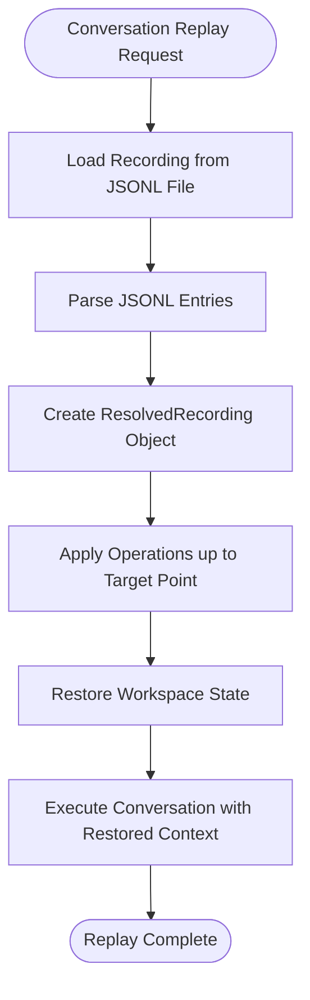

# Context Caching

<cite>
**Referenced Files in This Document**   
- [workspaceRecorder.ts](file://src/extension/workspaceRecorder/vscode-node/workspaceRecorder.ts)
- [workspaceLog.ts](file://src/platform/workspaceRecorder/common/workspaceLog.ts)
- [safeFileWriteUtils.ts](file://src/extension/workspaceRecorder/vscode-node/safeFileWriteUtils.ts)
- [workspaceRecorderFeature.ts](file://src/extension/workspaceRecorder/vscode-node/workspaceRecorderFeature.ts)
- [jsonlUtil.ts](file://src/extension/workspaceRecorder/common/jsonlUtil.ts)
- [cache.ts](file://src/util/common/cache.ts)
- [baseObservable.ts](file://src/util/vs/base/common/observableInternal/observables/baseObservable.ts)
- [utils.ts](file://src/util/vs/base/common/observableInternal/utils/utils.ts)
- [base.ts](file://src/util/vs/base/common/observableInternal/base.ts)
</cite>

## Table of Contents
1. [Introduction](#introduction)
2. [Context Caching Overview](#context-caching-overview)
3. [Workspace Recorder Implementation](#workspace-recorder-implementation)
4. [JSONL-Based Storage Format](#jsonl-based-storage-format)
5. [Observable Utilities and Change Detection](#observable-utilities-and-change-detection)
6. [Memory Management and Cache Persistence](#memory-management-and-cache-persistence)
7. [Cache Synchronization with Workspace State](#cache-synchronization-with-workspace-state)
8. [Usage Scenarios](#usage-scenarios)
9. [Conclusion](#conclusion)

## Introduction
The vscode-copilot-chat extension implements a sophisticated context caching system to optimize performance and maintain a persistent record of workspace state. This documentation details the architecture and implementation of the context caching mechanism, focusing on the workspaceRecorder component, JSONL-based storage format, observable utilities for change detection, and memory management strategies. The system enables efficient context restoration, conversation replay, and workspace recovery by maintaining a detailed history of workspace operations.

**Section sources**
- [workspaceRecorder.ts](file://src/extension/workspaceRecorder/vscode-node/workspaceRecorder.ts#L1-L318)
- [workspaceLog.ts](file://src/platform/workspaceRecorder/common/workspaceLog.ts#L1-L128)

## Context Caching Overview
The context caching system in vscode-copilot-chat is designed to optimize performance by maintaining a persistent record of workspace state and context information. The core component of this system is the workspaceRecorder, which captures and stores workspace operations in a structured format. This allows for efficient context restoration and enables features like conversation replay and workspace recovery.

The caching mechanism serves multiple purposes:
- **Performance optimization**: By caching workspace state, the system reduces the need to recompute context information
- **State persistence**: Workspace changes are recorded persistently, enabling recovery from crashes or restarts
- **Context restoration**: The system can restore the exact workspace state at any point in time
- **Change tracking**: All modifications to the workspace are tracked and can be replayed

The cache is implemented using a combination of in-memory data structures and persistent storage, with careful attention to memory management and performance considerations.

**Section sources**
- [workspaceRecorder.ts](file://src/extension/workspaceRecorder/vscode-node/workspaceRecorder.ts#L1-L318)
- [workspaceLog.ts](file://src/platform/workspaceRecorder/common/workspaceLog.ts#L1-L128)

## Workspace Recorder Implementation
The workspaceRecorder is the central component responsible for maintaining a persistent record of workspace changes. It captures various workspace events and stores them in a structured format for later retrieval and analysis.

```mermaid
classDiagram
class WorkspaceRecorder {
+repoRootUri : string
+recordingDirPath : string
+logFilePath : string
+handleOnDidOpenTextDocument(documentUri, initialText, newModelVersion)
+handleOnDidCloseTextDocument(documentUri)
+handleOnDidShowTextDocument(documentUri)
+handleOnDidHideTextDocument(documentUri)
+handleOnDidChangeTextDocument(documentUri, edit, newModelVersion, metadata)
+handleOnDidFocusedDocumentChange(documentUri)
+handleOnDidSelectionChange(documentUri, selection)
+handleEvent(time, data)
+handleDocumentEvent(documentUri, time, data)
+addBookmark()
}
class WorkspaceRecorderImpl {
-state : FlushableJSONFile~WorkspaceRecordingState~
-log : FlushableSafeJSONLFile~LogEntry~
-context : IWorkspaceRecorderContext
-_documentInitialTexts : Map~string, {value : string, time : number, initialModelVersion : number}~
+create(repoRootUri, recordingDirPath, logFilePath, context)
+handleOnDidOpenTextDocument(time, documentUri, initialText, initialModelVersion)
+handleOnDidCloseTextDocument(time, documentUri)
+handleOnDidShowTextDocument(time, documentUri)
+handleOnDidHideTextDocument(time, documentUri)
+handleOnDidChangeTextDocument(time, documentUri, edit, newModelVersion, metadata)
+handleOnDidFocusedDocumentChange(time, documentUri)
+handleOnDidSelectionChange(time, documentUri, selection)
+addBookmark(time)
+handleDocumentEvent(time, documentUri, data)
+handleEvent(time, data)
-_getId(documentUri)
-_scheduleFlush()
-_forceFlush()
-_appendEntry(entry)
}
class IWorkspaceRecorderContext {
+isIgnoredDocument(documentUri) : Promise~boolean~
}
WorkspaceRecorder --> WorkspaceRecorderImpl : "delegates to"
WorkspaceRecorder --> IWorkspaceRecorderContext : "uses"
WorkspaceRecorderImpl --> FlushableJSONFile : "uses"
WorkspaceRecorderImpl --> FlushableSafeJSONLFile : "uses"
```

**Diagram sources**
- [workspaceRecorder.ts](file://src/extension/workspaceRecorder/vscode-node/workspaceRecorder.ts#L24-L318)

The WorkspaceRecorder class acts as a facade that handles incoming workspace events and delegates the actual recording to the WorkspaceRecorderImpl. The implementation uses a task queue to ensure that recording operations are processed sequentially and efficiently.

Key features of the workspace recorder include:
- **Event handling**: The recorder captures various workspace events such as document opening, closing, content changes, focus changes, and selection changes
- **Document identification**: Each document is assigned a unique ID based on its relative path within the repository
- **Content hashing**: Document content is hashed to detect changes and avoid redundant storage
- **Log rotation**: The system implements log rotation to manage file size and prevent excessive disk usage
- **State persistence**: The recorder maintains state information in a JSON file to track document IDs and content hashes across sessions

The recorder also supports bookmarking, allowing users to mark specific points in the recording for easy reference later.

**Section sources**
- [workspaceRecorder.ts](file://src/extension/workspaceRecorder/vscode-node/workspaceRecorder.ts#L24-L318)
- [workspaceRecorderFeature.ts](file://src/extension/workspaceRecorder/vscode-node/workspaceRecorderFeature.ts#L32-L288)

## JSONL-Based Storage Format
The context caching system uses a JSONL (JSON Lines) format for storing workspace operations. This format stores each log entry as a separate JSON object on its own line, enabling efficient incremental updates and streaming processing.

```mermaid
erDiagram
HEADER_LOG_ENTRY ||--o{ LOG_ENTRY : contains
APPLICATION_START_LOG_ENTRY ||--o{ LOG_ENTRY : contains
DOCUMENT_SET_CONTENT_LOG_ENTRY ||--o{ LOG_ENTRY : contains
DOCUMENT_STORE_CONTENT_LOG_ENTRY ||--o{ LOG_ENTRY : contains
DOCUMENT_RESTORE_CONTENT_LOG_ENTRY ||--o{ LOG_ENTRY : contains
DOCUMENT_OPENED_LOG_ENTRY ||--o{ LOG_ENTRY : contains
DOCUMENT_CLOSED_LOG_ENTRY ||--o{ LOG_ENTRY : contains
DOCUMENT_CHANGED_LOG_ENTRY ||--o{ LOG_ENTRY : contains
DOCUMENT_FOCUS_CHANGED_LOG_ENTRY ||--o{ LOG_ENTRY : contains
DOCUMENT_SELECTION_CHANGED_LOG_ENTRY ||--o{ LOG_ENTRY : contains
DOCUMENT_ENCOUNTERED_LOG_ENTRY ||--o{ LOG_ENTRY : contains
META_LOG_ENTRY ||--o{ LOG_ENTRY : contains
BOOKMARK_LOG_ENTRY ||--o{ LOG_ENTRY : contains
DOCUMENT_EVENT_LOG_ENTRY ||--o{ LOG_ENTRY : contains
EVENT_LOG_ENTRY ||--o{ LOG_ENTRY : contains
LOG_ENTRY {
string kind
number time
}
HEADER_LOG_ENTRY {
string documentType
string repoRootUri
string uuid
number revision
}
APPLICATION_START_LOG_ENTRY {
string commitHash
}
DOCUMENT_SET_CONTENT_LOG_ENTRY {
number id
string content
number v
}
DOCUMENT_STORE_CONTENT_LOG_ENTRY {
number id
string contentId
number v
}
DOCUMENT_RESTORE_CONTENT_LOG_ENTRY {
number id
string contentId
number v
}
DOCUMENT_OPENED_LOG_ENTRY {
number id
}
DOCUMENT_CLOSED_LOG_ENTRY {
number id
}
DOCUMENT_CHANGED_LOG_ENTRY {
number id
ISerializedEdit edit
number v
IChangedMetadata metadata
}
DOCUMENT_FOCUS_CHANGED_LOG_ENTRY {
number id
}
DOCUMENT_SELECTION_CHANGED_LOG_ENTRY {
number id
ISerializedOffsetRange[] selection
}
DOCUMENT_ENCOUNTERED_LOG_ENTRY {
number id
string relativePath
}
DOCUMENT_EVENT_LOG_ENTRY {
number id
unknown data
}
EVENT_LOG_ENTRY {
unknown data
}
META_LOG_ENTRY {
unknown data
}
BOOKMARK_LOG_ENTRY {
}
```



**Diagram sources**
- [workspaceLog.ts](file://src/platform/workspaceRecorder/common/workspaceLog.ts#L11-L75)

The JSONL format provides several advantages for the context caching system:
- **Incremental updates**: New entries can be appended to the file without modifying existing content
- **Streaming processing**: Entries can be read and processed one at a time, reducing memory usage
- **Fault tolerance**: If a write operation fails, only the last entry may be lost, not the entire log
- **Human readability**: The format is easy to inspect and debug

The system defines various log entry types to capture different kinds of workspace operations:
- **HeaderLogEntry**: Contains metadata about the recording, including the repository root URI and a unique identifier
- **ApplicationStartLogEntry**: Records when the application starts, including the commit hash
- **DocumentSetContentLogEntry**: Stores the initial content of a document
- **DocumentStoreContentLogEntry**: Stores a hash of document content for reference
- **DocumentRestoreContentLogEntry**: References a previously stored content hash
- **DocumentChangedLogEntry**: Records text edits to a document
- **DocumentSelectionChangedLogEntry**: Records changes to the text selection
- **BookmarkLogEntry**: Marks a specific point in the recording

The use of JSONL format enables efficient storage and retrieval of workspace operations while supporting incremental updates and maintaining data integrity.

**Section sources**
- [workspaceLog.ts](file://src/platform/workspaceRecorder/common/workspaceLog.ts#L1-L128)
- [jsonlUtil.ts](file://src/extension/workspaceRecorder/common/jsonlUtil.ts#L1-L28)
- [safeFileWriteUtils.ts](file://src/extension/workspaceRecorder/vscode-node/safeFileWriteUtils.ts#L81-L123)

## Observable Utilities and Change Detection
The context caching system leverages observable utilities to enable efficient change detection and cache invalidation. These utilities provide a reactive programming model that allows components to respond to changes in workspace state without polling or manual notification.



**Diagram sources**
- [base.ts](file://src/util/vs/base/common/observableInternal/base.ts#L15-L110)
- [baseObservable.ts](file://src/util/vs/base/common/observableInternal/observables/baseObservable.ts#L138-L182)
- [utils.ts](file://src/util/vs/base/common/observableInternal/utils/utils.ts#L187-L215)

The observable system provides several key capabilities for the context caching implementation:
- **Reactive updates**: Components can automatically respond to changes in workspace state
- **Dependency tracking**: The system tracks dependencies between observables to ensure proper update ordering
- **Change batching**: Multiple changes can be batched together to improve performance
- **Memory management**: Observers are automatically cleaned up when no longer needed

The system implements several utility functions to enhance the observable pattern:
- **derivedObservableWithCache**: Creates a derived observable that caches its last computed value
- **derivedObservableWithWritableCache**: Extends the cached derived observable with methods to clear or set the cache
- **keepObserved**: Ensures an observable remains observed to maintain its cache
- **recomputeInitiallyAndOnChange**: Forces an observable to compute its value eagerly and respond to changes

These utilities enable efficient change detection and cache invalidation, ensuring that the context cache remains consistent with the current workspace state.

**Section sources**
- [base.ts](file://src/util/vs/base/common/observableInternal/base.ts#L1-L214)
- [baseObservable.ts](file://src/util/vs/base/common/observableInternal/observables/baseObservable.ts#L1-L183)
- [utils.ts](file://src/util/vs/base/common/observableInternal/utils/utils.ts#L1-L282)

## Memory Management and Cache Persistence
The context caching system implements sophisticated memory management and cache persistence mechanisms to balance performance, memory usage, and data durability.

```mermaid
classDiagram
class LRUCache {
-_capacity : number
-_cache : Map~string, Node~T~~
-_head : Node~T~
-_tail : Node~T~
+clear() : void
+deleteKey(key : string) : T | undefined
+get(key : string) : T | undefined
+keys() : string[]
+getValues() : T[]
+put(key : string, value : T) : [string, T] | undefined
+entries() : [string, T][]
-_addNode(node : Node~T~) : void
-_removeNode(node : Node~T~) : void
-_moveToHead(node : Node~T~) : void
-_popTail() : Node~T~
}
class DisposablesLRUCache {
-actual : LRUCache~T~
+dispose() : void
+clear() : void
+deleteKey(key : string) : void
+get(key : string) : T | undefined
+keys() : string[]
+getValues() : T[]
+put(key : string, value : T) : void
}
class FlushableJSONFile {
-_value : T
-_dirty : boolean
-_exists : boolean
+filePath : string
+setValue(value : T) : void
+flushAsync() : Promise~void~
+flushSync() : void
}
class FlushableSafeJSONLFile {
-_lock : boolean
-_newEntries : string[]
+filePath : string
+appendEntry(data : T) : void
+flushAsync() : Promise~void~
+flushSync() : void
-_getTextAndClear() : string
}
class Node {
+key : string
+value : T
+prev : Node~T~ | null
+next : Node~T~ | null
}
LRUCache --> Node : "contains"
DisposablesLRUCache --> LRUCache : "wraps"
FlushableJSONFile --> "temp file" : "writes to"
FlushableSafeJSONLFile --> "append file" : "writes to"
```

**Diagram sources**
- [cache.ts](file://src/util/common/cache.ts#L20-L194)
- [safeFileWriteUtils.ts](file://src/extension/workspaceRecorder/vscode-node/safeFileWriteUtils.ts#L11-L133)

The memory management strategy combines in-memory caching with persistent storage:
- **LRU Cache**: The system uses a Least Recently Used (LRU) cache to manage memory usage, automatically evicting the least recently accessed items when the cache reaches its capacity
- **Disposable Integration**: For objects that implement IDisposable, the DisposablesLRUCache ensures proper cleanup when items are evicted from the cache
- **Batched Writing**: Changes are batched and written to disk periodically to minimize I/O operations
- **Atomic Updates**: The system uses temporary files and atomic renames to ensure data integrity during writes
- **Log Rotation**: Large log files are rotated to prevent excessive disk usage and improve performance

The cache persistence mechanism ensures data durability while maintaining performance:
- **Delayed Flushing**: Changes are not immediately written to disk but are batched and flushed periodically
- **Forced Flushing**: The system ensures all pending changes are written to disk when the recorder is disposed
- **Error Handling**: The implementation includes robust error handling to prevent data loss during write operations
- **File Locking**: The system uses locking to prevent concurrent writes to the same file

These memory management and persistence strategies ensure that the context cache remains efficient and reliable, even with large workspaces and frequent changes.

**Section sources**
- [cache.ts](file://src/util/common/cache.ts#L1-L194)
- [safeFileWriteUtils.ts](file://src/extension/workspaceRecorder/vscode-node/safeFileWriteUtils.ts#L1-L133)
- [workspaceRecorder.ts](file://src/extension/workspaceRecorder/vscode-node/workspaceRecorder.ts#L285-L307)

## Cache Synchronization with Workspace State
The context caching system maintains synchronization between the cached context and the current workspace state through a combination of event handling, change detection, and state reconciliation.



**Diagram sources**
- [workspaceRecorder.ts](file://src/extension/workspaceRecorder/vscode-node/workspaceRecorder.ts#L38-L78)
- [workspaceRecorderFeature.ts](file://src/extension/workspaceRecorder/vscode-node/workspaceRecorderFeature.ts#L141-L181)

The synchronization process involves several key steps:
- **Event Registration**: The workspaceRecorderFeature registers event listeners for various workspace events, including document opening, content changes, and selection changes
- **Event Delegation**: When an event occurs, it is delegated to the appropriate handler method on the WorkspaceRecorder
- **Task Scheduling**: Events are processed through a task queue to ensure sequential processing and prevent race conditions
- **Document Identification**: Each document is assigned a unique ID based on its relative path, allowing consistent tracking across events
- **Content Hashing**: Document content is hashed to detect changes and avoid redundant storage
- **State Tracking**: The system maintains state information in a JSON file to track document IDs and content hashes across sessions
- **Incremental Updates**: Changes are written to the JSONL file incrementally, with periodic flushing to disk
- **Final Synchronization**: When the recorder is disposed, all pending changes are forcefully flushed to ensure data integrity

The system also handles edge cases such as ignored documents (determined by .gitignore rules) and notebook documents, ensuring that all relevant workspace changes are captured while excluding irrelevant ones.

This synchronization mechanism ensures that the cached context remains consistent with the actual workspace state, enabling reliable context restoration and workspace recovery.

**Section sources**
- [workspaceRecorder.ts](file://src/extension/workspaceRecorder/vscode-node/workspaceRecorder.ts#L38-L307)
- [workspaceRecorderFeature.ts](file://src/extension/workspaceRecorder/vscode-node/workspaceRecorderFeature.ts#L141-L181)

## Usage Scenarios
The context caching system supports several important usage scenarios that enhance the functionality of the vscode-copilot-chat extension.

### Conversation Replay
The system enables conversation replay by maintaining a complete history of workspace changes. When a user wants to replay a conversation, the system can reconstruct the exact workspace state at any point in time, allowing the AI assistant to provide contextually accurate responses.



**Diagram sources**
- [workspaceLog.ts](file://src/platform/workspaceRecorder/common/workspaceLog.ts#L1-L128)
- [resolvedRecording.ts](file://src/platform/workspaceRecorder/common/resolvedRecording/resolvedRecording.ts#L95-L136)

### Workspace Recovery
In the event of a crash or unexpected shutdown, the context caching system enables workspace recovery by restoring the last known state. The system can reconstruct the workspace from the recorded operations, minimizing data loss and reducing recovery time.

The recovery process involves:
- Loading the most recent recording file
- Parsing the JSONL entries
- Applying the operations in sequence to reconstruct the workspace state
- Restoring document content, selection, and focus state

### Performance Optimization
The caching system optimizes performance by:
- Reducing the need to recompute context information
- Enabling quick restoration of previous workspace states
- Minimizing I/O operations through batched writing and efficient storage format
- Using in-memory caching for frequently accessed data

These usage scenarios demonstrate the value of the context caching system in enhancing the user experience and reliability of the vscode-copilot-chat extension.

**Section sources**
- [workspaceRecorder.ts](file://src/extension/workspaceRecorder/vscode-node/workspaceRecorder.ts#L1-L318)
- [workspaceLog.ts](file://src/platform/workspaceRecorder/common/workspaceLog.ts#L1-L128)
- [workspaceRecorderFeature.ts](file://src/extension/workspaceRecorder/vscode-node/workspaceRecorderFeature.ts#L1-L288)

## Conclusion
The context caching system in vscode-copilot-chat provides a robust foundation for maintaining workspace state and optimizing performance. By leveraging the workspaceRecorder component, JSONL-based storage format, observable utilities, and sophisticated memory management strategies, the system enables efficient context restoration, conversation replay, and workspace recovery.

Key strengths of the implementation include:
- **Comprehensive event capture**: The system captures a wide range of workspace events, providing a complete history of changes
- **Efficient storage**: The JSONL format enables incremental updates and streaming processing
- **Reactive architecture**: Observable utilities enable efficient change detection and cache invalidation
- **Robust persistence**: The system ensures data integrity through atomic updates and forced flushing
- **Scalable design**: The LRU cache and log rotation mechanisms prevent excessive memory and disk usage

The context caching system demonstrates a well-architected approach to maintaining workspace state, balancing performance, memory usage, and data durability. This foundation enables advanced features like conversation replay and workspace recovery, enhancing the overall user experience of the vscode-copilot-chat extension.