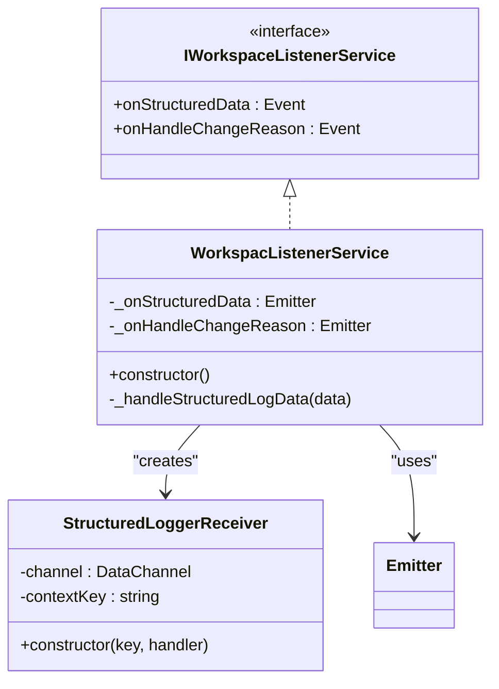
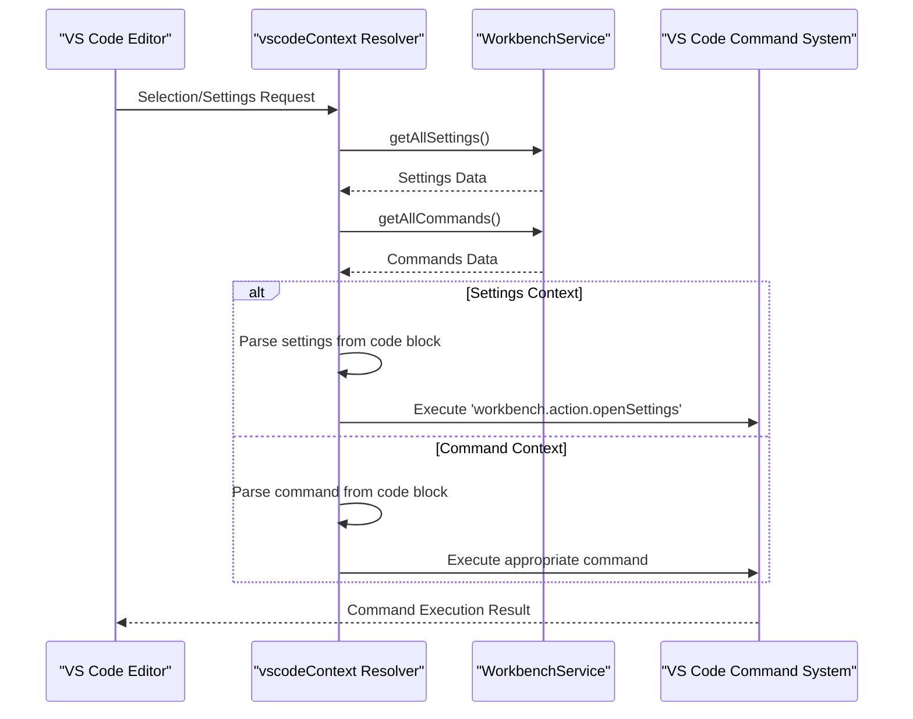
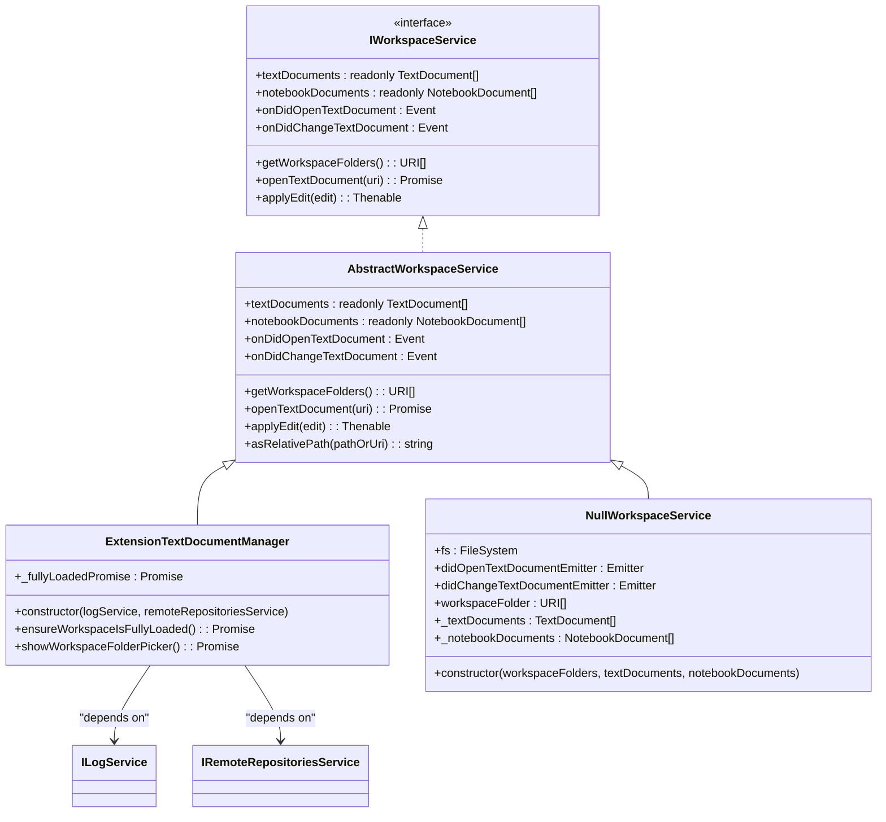
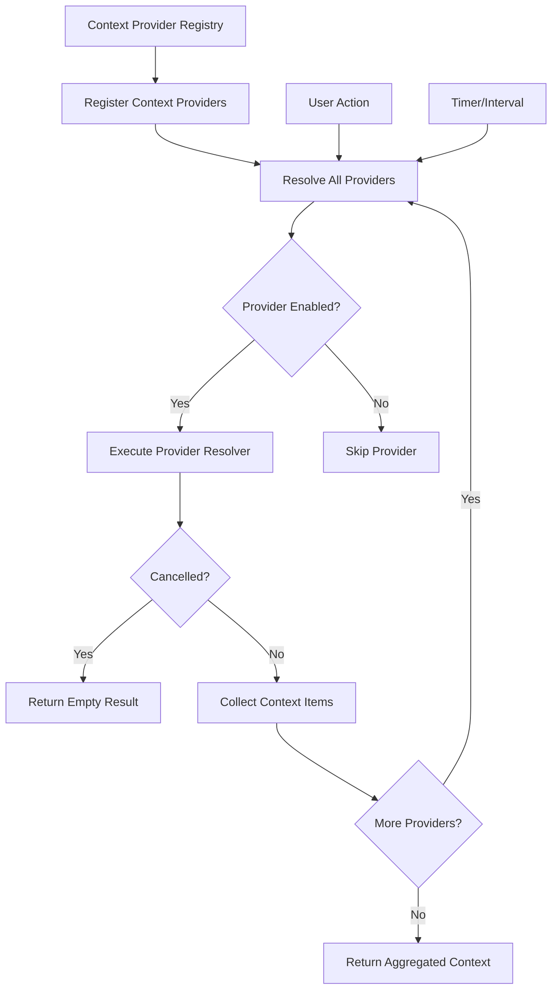
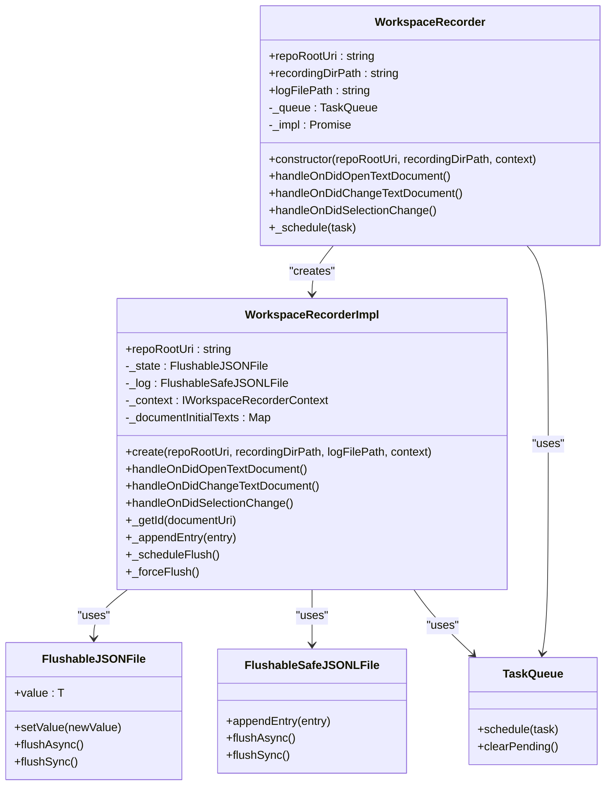
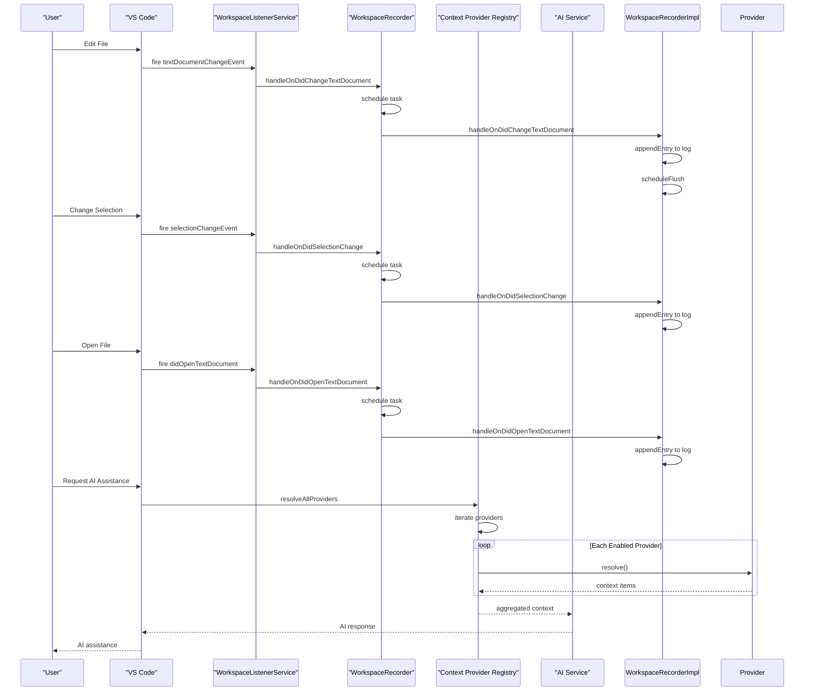

# Context Collection

<cite>
**Referenced Files in This Document**   
- [vscodeContext.ts](file://src/extension/context/node/resolvers/vscodeContext.ts)
- [workspaceListenerService.ts](file://src/extension/workspaceRecorder/vscode-node/workspaceListenerService.ts)
- [workspaceService.ts](file://src/platform/workspace/common/workspaceService.ts)
- [workspaceServiceImpl.ts](file://src/platform/workspace/vscode/workspaceServiceImpl.ts)
- [workspaceRecorder.ts](file://src/extension/workspaceRecorder/vscode-node/workspaceRecorder.ts)
- [contextProviderRegistry.ts](file://src/extension/completions-core/vscode-node/lib/src/prompt/contextProviderRegistry.ts)
</cite>

## Table of Contents
1. [Introduction](#introduction)
2. [Workspace State Monitoring](#workspace-state-monitoring)
3. [Editor Context Extraction](#editor-context-extraction)
4. [Context Provider Integration](#context-provider-integration)
5. [Event Throttling and Change Detection](#event-throttling-and-change-detection)
6. [Data Flow and User Actions](#data-flow-and-user-actions)
7. [Conclusion](#conclusion)

## Introduction
This document provides a comprehensive analysis of the context collection system in vscode-copilot-chat. The system captures workspace state changes through event listeners and service integrations to provide relevant context for AI-powered features. The documentation focuses on the mechanisms for monitoring file operations, text edits, git status changes, and editor state, as well as how this information is aggregated and utilized by context providers.

## Workspace State Monitoring

The context collection system in vscode-copilot-chat relies on the WorkspaceListenerService to monitor workspace state changes. This service acts as a central hub for capturing various workspace events and propagating them to interested components.

**Diagram sources**
- [workspaceListenerService.ts](file://src/extension/workspaceRecorder/common/workspaceListenerService.ts#L11-L39)
- [workspaceListenerService.ts](file://src/extension/workspaceRecorder/vscode-node/workspaceListenerService.ts#L12-L68)

The WorkspaceListenerService implements the IWorkspaceListenerService interface and uses VS Code's data channel mechanism to receive structured log data. It listens for events related to inline suggestions, fetch operations, and text model changes. When events are received through the structured logger, they are processed and emitted through the service's event emitters for consumption by other components.

**Section sources**
- [workspaceListenerService.ts](file://src/extension/workspaceRecorder/common/workspaceListenerService.ts#L11-L39)
- [workspaceListenerService.ts](file://src/extension/workspaceRecorder/vscode-node/workspaceListenerService.ts#L12-L68)

## Editor Context Extraction

The extraction of current editor state is handled by the vscodeContext module, which captures information about the active file, selection range, and cursor position. This information is crucial for providing contextually relevant AI assistance.

**Diagram sources**
- [vscodeContext.ts](file://src/extension/context/node/resolvers/vscodeContext.ts#L1-L149)

The vscodeContext module provides the `parseSettingsAndCommands` function that processes raw Markdown content containing code blocks with JSON data. This function extracts settings and commands to show as options to the user. It handles both settings and command types, creating appropriate VS Code commands to open the settings editor or command palette with pre-filled filters.

The context extraction process involves:
1. Parsing the code block to extract JSON content
2. Validating the JSON structure and removing trailing commas
3. Checking for settings or commands in the parsed data
4. For settings: creating a command to open the settings editor with specific queries
5. For commands: creating a command to open the command palette with specific filters

**Section sources**
- [vscodeContext.ts](file://src/extension/context/node/resolvers/vscodeContext.ts#L1-L149)
- [vscodeContext.spec.ts](file://src/extension/context/node/resolvers/test/vscodeContext.spec.ts#L1-L344)

## Context Provider Integration

The integration between workspaceService and context providers is facilitated through a registry pattern that allows various context providers to contribute relevant information based on the current workspace state.

**Diagram sources**
- [workspaceService.ts](file://src/platform/workspace/common/workspaceService.ts#L17-L227)
- [workspaceServiceImpl.ts](file://src/platform/workspace/vscode/workspaceServiceImpl.ts#L14-L113)

The workspace service architecture follows a layered pattern with an interface (IWorkspaceService), an abstract base class (AbstractWorkspaceService), and concrete implementations. The ExtensionTextDocumentManager is the primary implementation that integrates with VS Code's workspace APIs, while the NullWorkspaceService provides a mock implementation for testing purposes.

Context providers register themselves with the context provider registry, which then resolves and aggregates context items based on the current document context. The registry supports various types of context providers, including those for code snippets, traits, and other contextual information.

**Diagram sources**
- [contextProviderRegistry.ts](file://src/extension/completions-core/vscode-node/lib/src/prompt/contextProviderRegistry.ts)

The context provider registry manages the lifecycle of context providers, handling registration, unregistration, and resolution of context items. When resolving context, the registry iterates through all registered providers, checks if they are enabled, and executes their resolvers to collect context items. The resolution process supports cancellation through cancellation tokens, allowing for efficient resource management when requests are no longer needed.

**Section sources**
- [workspaceService.ts](file://src/platform/workspace/common/workspaceService.ts#L17-L227)
- [workspaceServiceImpl.ts](file://src/platform/workspace/vscode/workspaceServiceImpl.ts#L14-L113)
- [contextProviderRegistry.ts](file://src/extension/completions-core/vscode-node/lib/src/prompt/contextProviderRegistry.ts)

## Event Throttling and Change Detection

The workspace recording system implements sophisticated change detection and event throttling mechanisms to efficiently capture workspace state changes without overwhelming system resources.

**Diagram sources**
- [workspaceRecorder.ts](file://src/extension/workspaceRecorder/vscode-node/workspaceRecorder.ts#L24-L318)

The WorkspaceRecorder class serves as a facade for recording workspace events, delegating the actual implementation to WorkspaceRecorderImpl. The recorder uses a TaskQueue to serialize operations and prevent race conditions when handling concurrent events. This ensures that events are processed in the correct order and that file operations are properly synchronized.

Key aspects of the event throttling and change detection system include:

1. **Task Queue**: All operations are scheduled through a TaskQueue, which ensures that operations are executed sequentially and prevents race conditions.

2. **Delayed Flushing**: Changes to the state and log files are not immediately written to disk. Instead, a flush operation is scheduled with a 10-second delay, allowing multiple changes to be batched together.

3. **Log Rotation**: When the log file exceeds 20MB, it is automatically rotated to prevent excessive file sizes. The rotated logs are timestamped and numbered for easy identification.

4. **State Management**: The recorder maintains state information about documents, including their content hashes and model versions, to detect changes and avoid redundant operations.

5. **Content Hashing**: Document content is hashed using SHA-1 to efficiently detect changes and support content restoration from previous states.

The system also implements change detection at multiple levels:
- Document opening/closing
- Text content changes
- Selection changes
- Focus changes
- Document visibility changes

Each change is recorded with a timestamp, document identifier, and relevant metadata, creating a comprehensive history of workspace activity that can be used for context collection and analysis.

**Section sources**
- [workspaceRecorder.ts](file://src/extension/workspaceRecorder/vscode-node/workspaceRecorder.ts#L24-L318)

## Data Flow and User Actions

The context collection system responds to various user actions by capturing relevant workspace state and propagating it through the system for AI assistance. The data flow follows a consistent pattern from VS Code events to context providers.

**Diagram sources**
- [workspaceListenerService.ts](file://src/extension/workspaceRecorder/vscode-node/workspaceListenerService.ts#L12-L68)
- [workspaceRecorder.ts](file://src/extension/workspaceRecorder/vscode-node/workspaceRecorder.ts#L24-L318)
- [contextProviderRegistry.ts](file://src/extension/completions-core/vscode-node/lib/src/prompt/contextProviderRegistry.ts)

Different user actions trigger specific context collection workflows:

1. **File Operations**: When a user opens, closes, or switches between files, the system captures the document state, including content, selection, and metadata.

2. **Text Edits**: Any text modification triggers a change event that records the edit operation, including the specific changes made and the context in which they occurred.

3. **Selection Changes**: Changes to the cursor position or selection range are recorded to maintain awareness of the user's focus area.

4. **Command Execution**: When users execute commands that affect workspace state, these actions are captured and can influence the context provided to AI services.

5. **Git Operations**: Changes to git status, such as staging files or switching branches, are monitored to provide version control context.

6. **Workspace Navigation**: Moving between different parts of the workspace, such as opening new folders or switching between projects, triggers context updates.

The system handles partial updates efficiently by only transmitting changed information rather than the complete workspace state. This optimization reduces bandwidth usage and improves responsiveness. The context provider registry supports incremental updates by allowing providers to return only the changes since the last request, rather than the complete context.

**Section sources**
- [workspaceListenerService.ts](file://src/extension/workspaceRecorder/vscode-node/workspaceListenerService.ts#L12-L68)
- [workspaceRecorder.ts](file://src/extension/workspaceRecorder/vscode-node/workspaceRecorder.ts#L24-L318)
- [contextProviderRegistry.ts](file://src/extension/completions-core/vscode-node/lib/src/prompt/contextProviderRegistry.ts)

## Conclusion

The context collection system in vscode-copilot-chat is a sophisticated framework that captures workspace state changes through event listeners and service integrations. The system is built around several key components:

1. **WorkspaceListenerService**: Monitors workspace events and propagates them to interested components through a structured event system.

2. **vscodeContext**: Extracts current editor state including active file, selection range, and cursor position, providing essential context for AI assistance.

3. **WorkspaceService**: Provides a unified interface for accessing workspace information and managing workspace operations, with implementations that integrate with VS Code's native APIs.

4. **Context Provider Registry**: Aggregates context from multiple sources, allowing different providers to contribute relevant information based on the current context.

5. **WorkspaceRecorder**: Implements event throttling and change detection, efficiently capturing workspace state changes while minimizing resource usage.

The system demonstrates several best practices in event-driven architecture, including proper event handling, efficient change detection, and intelligent resource management through throttling and batching. By capturing a comprehensive history of workspace activity, the system enables AI-powered features to provide contextually relevant assistance that understands the user's current workflow and intentions.

The integration between these components creates a robust foundation for AI-assisted development, allowing the system to understand not just the current state of the code, but also the evolution of that state over time. This temporal understanding enables more sophisticated assistance, such as suggesting completions based on recent editing patterns or providing explanations that reference previous changes to the codebase.