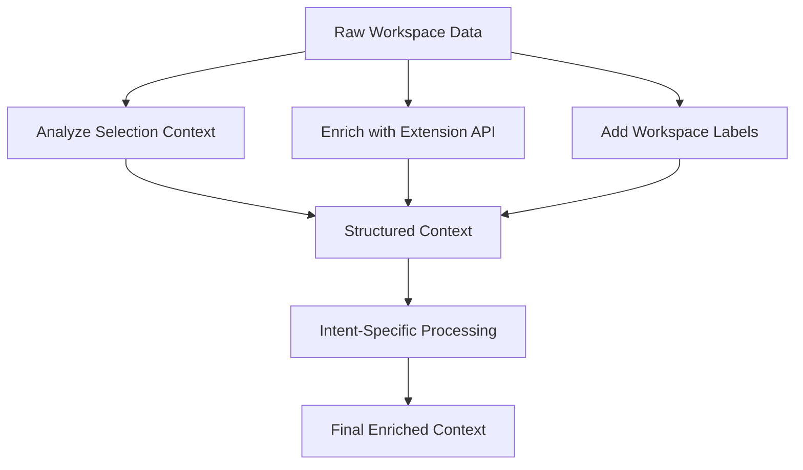
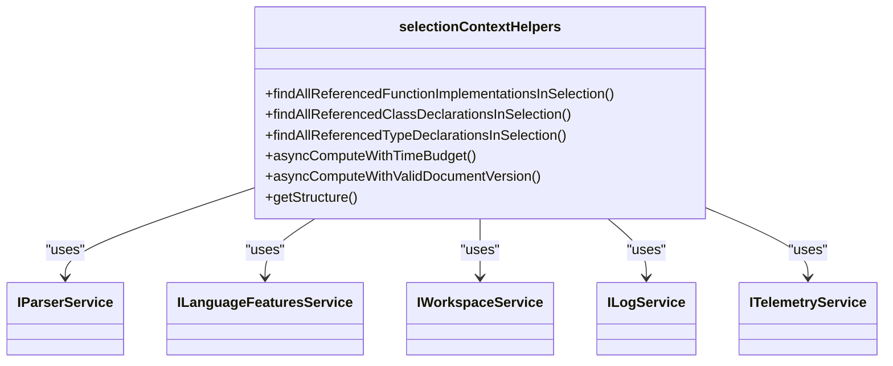
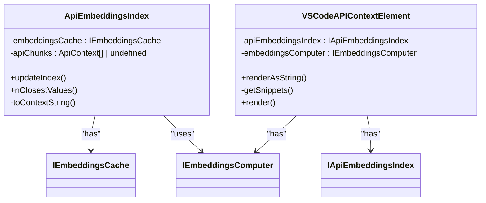
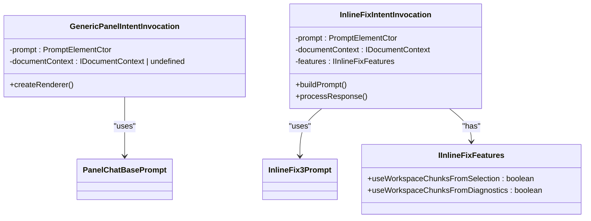
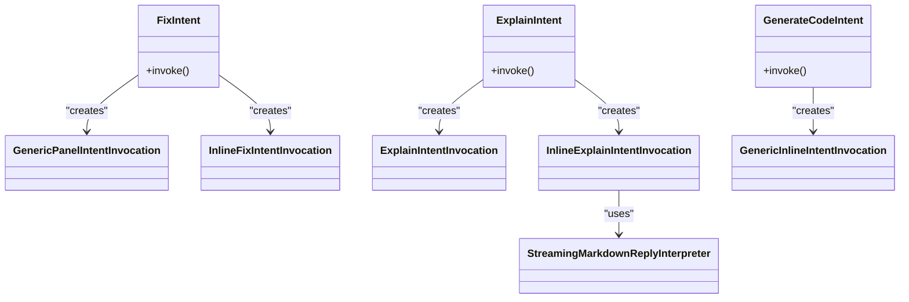

# Context Enrichment

<cite>
**Referenced Files in This Document**   
- [selectionContextHelpers.ts](file://src/extension/context/node/resolvers/selectionContextHelpers.ts)
- [extensionApi.tsx](file://src/extension/context/node/resolvers/extensionApi.tsx)
- [promptWorkspaceLabels.ts](file://src/extension/context/node/resolvers/promptWorkspaceLabels.ts)
- [vscodeContext.ts](file://src/extension/context/node/resolvers/vscodeContext.ts)
- [fixIntent.ts](file://src/extension/intents/node/fixIntent.ts)
- [explainIntent.ts](file://src/extension/intents/node/explainIntent.ts)
- [generateCodeIntent.ts](file://src/extension/intents/node/generateCodeIntent.ts)
- [genericPanelIntentInvocation.ts](file://src/extension/context/node/resolvers/genericPanelIntentInvocation.ts)
- [inlineFixIntentInvocation.ts](file://src/extension/context/node/resolvers/inlineFixIntentInvocation.ts)
</cite>

## Table of Contents
1. [Introduction](#introduction)
2. [Context Enrichment Pipeline](#context-enrichment-pipeline)
3. [Selection Context Analysis](#selection-context-analysis)
4. [Extension API Context Enrichment](#extension-api-context-enrichment)
5. [Workspace Labels and Metadata](#workspace-labels-and-metadata)
6. [Interaction Mode Context Structuring](#interaction-mode-context-structuring)
7. [Intent-Specific Context Enrichment](#intent-specific-context-enrichment)
8. [Conclusion](#conclusion)

## Introduction

The context enrichment system in vscode-copilot-chat transforms raw workspace data into semantically meaningful context for AI processing. This documentation details how the extension analyzes code structure around the cursor, identifies relevant context boundaries, and enriches prompts with information about available commands and capabilities. The system supports different interaction modes (inline chat vs panel chat) and performs intent-specific context enrichment for various development tasks such as fixing, explaining, and generating code.

**Section sources**
- [selectionContextHelpers.ts](file://src/extension/context/node/resolvers/selectionContextHelpers.ts#L1-L349)
- [extensionApi.tsx](file://src/extension/context/node/resolvers/extensionApi.tsx#L1-L114)

## Context Enrichment Pipeline

The context enrichment pipeline in vscode-copilot-chat consists of multiple stages that transform raw workspace data into structured, semantically meaningful context for AI processing. The pipeline begins with raw workspace data including the current document, selection, and workspace structure. This data is then processed through various enrichment mechanisms that add semantic meaning and relevant context.

The pipeline follows a modular architecture where different components handle specific aspects of context enrichment. The selectionContextHelpers analyzes code structure around the cursor, extensionApi.tsx enriches context with information about available commands and capabilities, and promptWorkspaceLabels adds workspace labels and metadata. These components work together to create a comprehensive context that enables the AI to provide more relevant and accurate responses.

The pipeline is designed to be efficient and responsive, using time-budgeted computations and document version validation to ensure performance. It also supports different interaction modes and intent-specific context enrichment, allowing the system to adapt to various development scenarios.



**Diagram sources**
- [selectionContextHelpers.ts](file://src/extension/context/node/resolvers/selectionContextHelpers.ts#L1-L349)
- [extensionApi.tsx](file://src/extension/context/node/resolvers/extensionApi.tsx#L1-L114)
- [promptWorkspaceLabels.ts](file://src/extension/context/node/resolvers/promptWorkspaceLabels.ts#L1-L514)

**Section sources**
- [selectionContextHelpers.ts](file://src/extension/context/node/resolvers/selectionContextHelpers.ts#L1-L349)
- [extensionApi.tsx](file://src/extension/context/node/resolvers/extensionApi.tsx#L1-L114)
- [promptWorkspaceLabels.ts](file://src/extension/context/node/resolvers/promptWorkspaceLabels.ts#L1-L514)

## Selection Context Analysis

The selectionContextHelpers module plays a crucial role in analyzing code structure around the cursor and identifying relevant context boundaries. It uses TreeSitter AST parsing to understand the code structure and extract meaningful context from the selected code.

The module provides several functions for finding referenced functions, classes, and type declarations within the selection. These functions use a combination of TreeSitter parsing and language server features to identify relevant code elements. For example, the findAllReferencedFunctionImplementationsInSelection function parses all function calls in the given selection and then finds their implementations or definitions using the language server.

The context analysis is performed with time budgeting to ensure responsiveness. The asyncComputeWithTimeBudget function wraps computations with a timeout, ensuring that the analysis doesn't block the UI for too long. Additionally, the asyncComputeWithValidDocumentVersion function ensures that the document version remains consistent during the computation, retrying up to three times if the document changes during processing.

The module also includes utility functions like getStructure which combines TreeSitter parsing with indentation-based structure analysis as a fallback when TreeSitter parsing is not available.



**Diagram sources**
- [selectionContextHelpers.ts](file://src/extension/context/node/resolvers/selectionContextHelpers.ts#L1-L349)

**Section sources**
- [selectionContextHelpers.ts](file://src/extension/context/node/resolvers/selectionContextHelpers.ts#L1-L349)

## Extension API Context Enrichment

The extensionApi.tsx module enriches context with information about available commands and capabilities in the VS Code environment. It provides a mechanism to include relevant API reference code snippets and command information in the prompt context.

The ApiEmbeddingsIndex class manages an index of API context information, including code snippets from vscode.d.ts, command information, and documentation code blocks. This index is used to find relevant API references based on the user's query. The index can use either a remote or local cache, with the cache version based on the VS Code version.

The VSCodeAPIContextElement class is a prompt element that renders API context information. It computes embeddings for the user's query and finds the most relevant API snippets using semantic similarity. The rendered context includes potentially relevant code samples related to VS Code extension development, which can help the AI provide more accurate responses.

The context enrichment process is asynchronous and supports cancellation through CancellationToken. The getSnippets method computes embeddings for the query and retrieves the closest matching API snippets from the index.



**Diagram sources**
- [extensionApi.tsx](file://src/extension/context/node/resolvers/extensionApi.tsx#L1-L114)

**Section sources**
- [extensionApi.tsx](file://src/extension/context/node/resolvers/extensionApi.tsx#L1-L114)

## Workspace Labels and Metadata

The promptWorkspaceLabels module adds workspace labels and metadata to the context, providing information about the project's technology stack and dependencies. This helps the AI understand the context of the code and provide more relevant suggestions.

The module implements a strategy pattern with BasicPromptWorkspaceLabels and ExpandedPromptWorkspaceLabels classes. The strategy is determined by configuration, allowing users to control the level of detail in the workspace labels. The basic strategy identifies common indicators like package.json, tsconfig.json, and other project files to determine the technology stack.

The expanded strategy provides more detailed information by analyzing the content of configuration files. For example, it parses package.json to identify specific frameworks and libraries used in the project, and analyzes CMakeLists.txt to determine C++ standard versions. It also processes Python requirements files to identify popular packages used in the project.

The module uses a map of filename indicators and content indicators to determine labels. Filename indicators are based on the presence of specific files, while content indicators parse the file contents to extract additional information. The collected labels are deduplicated and sorted before being included in the context.

```mermaid
classDiagram
class PromptWorkspaceLabels {
-basicWorkspaceLabels : IPromptWorkspaceLabelsStrategy
-expandedWorkspaceLabels : IPromptWorkspaceLabelsStrategy
-strategy : PromptWorkspaceLabelsStrategy
+labels : string[]
+collectContext()
}
class BasicPromptWorkspaceLabels {
-indicators : Map<string, string[]>
-contentIndicators : Map<string, (contents : string) => string[]>
-_labels : string[]
+labels : string[]
+collectContext()
-initIndicators()
-collectCMakeListsTxtIndicators()
-collectPackageJsonIndicators()
}
class ExpandedPromptWorkspaceLabels {
+collectPackageJsonIndicatorsExpanded()
+collectPythonRequirementsIndicators()
+collectPythonTomlIndicators()
}
PromptWorkspaceLabels --> IPromptWorkspaceLabelsStrategy : "has"
BasicPromptWorkspaceLabels --> IWorkspaceService : "uses"
BasicPromptWorkspaceLabels --> IFileSystemService : "uses"
BasicPromptWorkspaceLabels --> IIgnoreService : "uses"
ExpandedPromptWorkspaceLabels --|> BasicPromptWorkspaceLabels : "extends"
```

**Diagram sources**
- [promptWorkspaceLabels.ts](file://src/extension/context/node/resolvers/promptWorkspaceLabels.ts#L1-L514)

**Section sources**
- [promptWorkspaceLabels.ts](file://src/extension/context/node/resolvers/promptWorkspaceLabels.ts#L1-L514)

## Interaction Mode Context Structuring

The context enrichment system structures context differently for various interaction modes, primarily distinguishing between inline chat and panel chat. This section explains how context is structured for these different modes.

For panel chat interactions, the genericPanelIntentInvocation class handles the creation of the prompt renderer. It accepts a document context and prompt context, and creates a renderer that combines these elements into a structured prompt. The PanelChatBasePrompt serves as the foundation for panel chat prompts, providing a consistent structure across different intents.

For inline chat interactions, the context structuring is more focused on the specific code selection and its immediate context. The inlineFixIntentInvocation class demonstrates this approach, where the prompt includes specific features for inline fix operations. The context includes information about whether to use workspace chunks from the selection or diagnostics.

The system also handles notebook interactions through specialized prompt classes like InlineFixNotebookPrompt, which are designed to work with notebook cells and their unique context requirements.



**Diagram sources**
- [genericPanelIntentInvocation.ts](file://src/extension/context/node/resolvers/genericPanelIntentInvocation.ts#L1-L49)
- [inlineFixIntentInvocation.ts](file://src/extension/context/node/resolvers/inlineFixIntentInvocation.ts#L1-L66)

**Section sources**
- [genericPanelIntentInvocation.ts](file://src/extension/context/node/resolvers/genericPanelIntentInvocation.ts#L1-L49)
- [inlineFixIntentInvocation.ts](file://src/extension/context/node/resolvers/inlineFixIntentInvocation.ts#L1-L66)

## Intent-Specific Context Enrichment

The context enrichment system performs intent-specific processing for different development tasks such as fixing, explaining, and generating code. Each intent has its own invocation strategy and context requirements.

For the fix intent, the FixIntent class creates different invocation types based on the location. In the panel, it uses GenericPanelIntentInvocation with PanelChatFixPrompt, while in the editor it uses InlineFixIntentInvocation with either InlineFix3Prompt or InlineFixNotebookPrompt depending on whether the context is a notebook. The fix intent also includes features for using workspace chunks on retry attempts.

For the explain intent, the ExplainIntent class handles both panel and inline explanations. The InlineExplainIntentInvocation uses a StreamingMarkdownReplyInterpreter to process the response, allowing for real-time rendering of the explanation. The explain intent automatically sets a default query if none is provided by the user.

For the generate intent, the GenerateCodeIntent class uses GenericInlineIntentInvocation with a specific edit strategy (ForceInsertion) to ensure that new code is generated at the cursor position.



**Diagram sources**
- [fixIntent.ts](file://src/extension/intents/node/fixIntent.ts#L1-L64)
- [explainIntent.ts](file://src/extension/intents/node/explainIntent.ts#L1-L91)
- [generateCodeIntent.ts](file://src/extension/intents/node/generateCodeIntent.ts#L1-L39)

**Section sources**
- [fixIntent.ts](file://src/extension/intents/node/fixIntent.ts#L1-L64)
- [explainIntent.ts](file://src/extension/intents/node/explainIntent.ts#L1-L91)
- [generateCodeIntent.ts](file://src/extension/intents/node/generateCodeIntent.ts#L1-L39)

## Conclusion

The context enrichment system in vscode-copilot-chat is a sophisticated pipeline that transforms raw workspace data into semantically meaningful context for AI processing. By analyzing code structure around the cursor, enriching context with extension API information, and adding workspace labels and metadata, the system provides a comprehensive context that enables the AI to deliver more relevant and accurate responses.

The system's modular architecture allows for different interaction modes and intent-specific context enrichment, making it adaptable to various development scenarios. The use of time-budgeted computations and document version validation ensures responsiveness and reliability.

The context enrichment pipeline demonstrates a thoughtful approach to balancing comprehensive context with performance considerations, providing developers with a powerful tool for code understanding and generation.