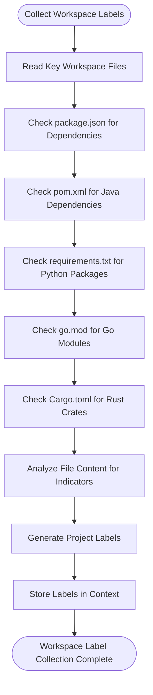

# Context Propagation

<cite>
**Referenced Files in This Document**   
- [conversationStore.ts](file://src/extension/conversationStore/node/conversationStore.ts)
- [languageContextProviderService.ts](file://src/extension/languageContextProvider/vscode-node/languageContextProviderService.ts)
- [promptWorkspaceLabels.ts](file://src/extension/context/node/resolvers/promptWorkspaceLabels.ts)
- [inlineChatSelection.ts](file://src/extension/context/node/resolvers/inlineChatSelection.ts)
- [fixSelection.ts](file://src/extension/context/node/resolvers/fixSelection.ts)
- [selectionContextHelpers.ts](file://src/extension/context/node/resolvers/selectionContextHelpers.ts)
- [workspaceListenerService.ts](file://src/extension/workspaceRecorder/vscode-node/workspaceListenerService.ts)
- [workspaceLog.ts](file://src/platform/workspaceRecorder/common/workspaceLog.ts)
- [vscodeContext.ts](file://src/extension/context/node/resolvers/vscodeContext.ts)
</cite>

## Table of Contents
1. [Introduction](#introduction)
2. [Project Structure](#project-structure)
3. [Core Components](#core-components)
4. [Architecture Overview](#architecture-overview)
5. [Detailed Component Analysis](#detailed-component-analysis)
6. [Dependency Analysis](#dependency-analysis)
7. [Performance Considerations](#performance-considerations)
8. [Troubleshooting Guide](#troubleshooting-guide)
9. [Conclusion](#conclusion)

## Introduction
This document provides a comprehensive analysis of context propagation in the vscode-copilot-chat extension. It details how workspace context is captured, transformed, and propagated through the system to enable intelligent AI-assisted coding. The documentation covers the architecture of context providers, the context enrichment process, data flow patterns, caching strategies, and performance considerations that ensure responsive editor interactions while providing rich contextual information to AI models.

## Project Structure
The vscode-copilot-chat project is organized into several key directories that support context propagation functionality:

- **src/extension/context**: Contains context resolver implementations for different scenarios (inline chat, fix commands, workspace labels)
- **src/extension/languageContextProvider**: Implements the core context provider service that manages and coordinates context collection
- **src/extension/conversationStore**: Manages storage and retrieval of conversation context
- **src/extension/workspaceRecorder**: Handles workspace event listening and recording
- **src/platform/workspaceRecorder**: Contains common interfaces and data structures for workspace context logging
- **src/extension/prompt**: Contains components for prompt generation and context rendering

The architecture follows a modular design with clear separation between context collection, processing, storage, and consumption layers.


**Diagram sources**
- [workspaceListenerService.ts](file://src/extension/workspaceRecorder/vscode-node/workspaceListenerService.ts)
- [languageContextProviderService.ts](file://src/extension/languageContextProvider/vscode-node/languageContextProviderService.ts)
- [conversationStore.ts](file://src/extension/conversationStore/node/conversationStore.ts)

## Core Components
The context propagation system in vscode-copilot-chat consists of several core components that work together to capture, enrich, and deliver contextual information. The system is built around a provider-based architecture where specialized context providers collect different types of information from the workspace. These providers are registered with a central context provider service that coordinates their execution and aggregates their results.

Context is collected from multiple sources including the current file, selection, project structure, git status, and workspace configuration. This raw data is then transformed into meaningful context that can be consumed by AI models. The enriched context is stored in a conversation store that maintains the context across interactions, enabling the AI to maintain awareness of the conversation history and previous context.

The system employs sophisticated caching and change detection mechanisms to optimize performance and minimize the impact on editor responsiveness. Context providers are designed to be incremental, only collecting and processing data that has changed since the last context update.

**Section sources**
- [conversationStore.ts](file://src/extension/conversationStore/node/conversationStore.ts)
- [languageContextProviderService.ts](file://src/extension/languageContextProvider/vscode-node/languageContextProviderService.ts)
- [promptWorkspaceLabels.ts](file://src/extension/context/node/resolvers/promptWorkspaceLabels.ts)

## Architecture Overview
The context propagation architecture in vscode-copilot-chat follows a layered approach with clear separation of concerns. At the foundation are workspace listeners that detect changes in the editor state, file system, and other workspace elements. These listeners trigger context updates when significant changes occur.

Above the listeners are context providers, which are specialized components responsible for collecting specific types of context. Providers are registered with the context provider service and are selected based on the current document and context requirements. Each provider implements a resolver interface that defines how context is collected and returned.

The context provider service acts as the central coordinator, managing the lifecycle of context providers and aggregating their results. It handles provider registration, selection, and execution, ensuring that context is collected efficiently and consistently.

Collected context is then enriched and transformed before being stored in the conversation store. The conversation store uses an LRU cache to manage memory usage and ensure that recent context is readily available while older context is evicted when necessary.


**Diagram sources**
- [workspaceListenerService.ts](file://src/extension/workspaceRecorder/vscode-node/workspaceListenerService.ts)
- [languageContextProviderService.ts](file://src/extension/languageContextProvider/vscode-node/languageContextProviderService.ts)
- [conversationStore.ts](file://src/extension/conversationStore/node/conversationStore.ts)

## Detailed Component Analysis

### Context Provider Service
The context provider service is the central component responsible for managing context providers and coordinating context collection. It implements a service interface that allows for provider registration, selection, and execution.

```mermaid
classDiagram
class ILanguageContextProviderService {
+_serviceBrand : undefined
+registerContextProvider(provider, targets) : Disposable
+getAllProviders(target) : readonly ContextProvider[]
+getContextProviders(doc, target) : ContextProvider[]
+getContextItems(doc, request, cancellationToken) : AsyncIterable~ContextItem~
+getContextItemsOnTimeout(doc, request) : ContextItem[]
}
class LanguageContextProviderService {
+_serviceBrand : undefined
-providers : {provider, targets}[]
+registerContextProvider(provider, targets) : Disposable
+getAllProviders(target) : readonly ContextProvider[]
+getContextProviders(doc, target) : ContextProvider[]
+getContextItems(doc, request, cancellationToken) : AsyncIterable~ContextItem~
+getContextItemsOnTimeout(doc, request) : ContextItem[]
-convertCopilotContextItem(item) : ContextItem
-convertImportanceToPriority(importance) : number
}
ILanguageContextProviderService <|-- LanguageContextProviderService
```

**Diagram sources**
- [languageContextProviderService.ts](file://src/extension/languageContextProvider/vscode-node/languageContextProviderService.ts)

### Context Providers
Context providers are specialized components that collect specific types of context from the workspace. They are registered with the context provider service and are selected based on document type and context requirements.

#### Inline Chat Selection Provider
This provider collects context related to the current selection in inline chat scenarios, including code above and below the selection, surrounding functions, and related code elements.


**Diagram sources**
- [inlineChatSelection.ts](file://src/extension/context/node/resolvers/inlineChatSelection.ts)
- [selectionContextHelpers.ts](file://src/extension/context/node/resolvers/selectionContextHelpers.ts)

#### Fix Selection Provider
This provider specializes in collecting context for the /fix command, focusing on diagnostic information, error ranges, and surrounding code that may be relevant to fixing the issue.


**Diagram sources**
- [fixSelection.ts](file://src/extension/context/node/resolvers/fixSelection.ts)

#### Workspace Labels Provider
This provider analyzes the workspace structure to identify project characteristics such as programming languages, frameworks, and tools being used based on file presence and content.



**Diagram sources**
- [promptWorkspaceLabels.ts](file://src/extension/context/node/resolvers/promptWorkspaceLabels.ts)

### Conversation Store
The conversation store manages the storage and retrieval of conversation context, maintaining state across interactions and ensuring context persistence.


**Diagram sources**
- [conversationStore.ts](file://src/extension/conversationStore/node/conversationStore.ts)

**Section sources**
- [conversationStore.ts](file://src/extension/conversationStore/node/conversationStore.ts)
- [inlineChatSelection.ts](file://src/extension/context/node/resolvers/inlineChatSelection.ts)
- [fixSelection.ts](file://src/extension/context/node/resolvers/fixSelection.ts)
- [promptWorkspaceLabels.ts](file://src/extension/context/node/resolvers/promptWorkspaceLabels.ts)

## Dependency Analysis
The context propagation system has a well-defined dependency structure that ensures loose coupling between components while maintaining clear data flow.


The context provider service depends on various platform services to collect context, including file system access, workspace services, language features, and telemetry. Context providers have dependencies on specific services based on their function, such as the parser service for code analysis or the workspace service for folder information.

The conversation store has minimal dependencies, primarily relying on the LRU cache implementation for memory management. This design allows the store to be lightweight and efficient.

Circular dependencies are avoided through the use of service interfaces and dependency injection. Components depend on abstractions rather than concrete implementations, allowing for flexibility and testability.

**Diagram sources**
- [languageContextProviderService.ts](file://src/extension/languageContextProvider/vscode-node/languageContextProviderService.ts)
- [conversationStore.ts](file://src/extension/conversationStore/node/conversationStore.ts)
- [workspaceListenerService.ts](file://src/extension/workspaceRecorder/vscode-node/workspaceListenerService.ts)

**Section sources**
- [languageContextProviderService.ts](file://src/extension/languageContextProvider/vscode-node/languageContextProviderService.ts)
- [conversationStore.ts](file://src/extension/conversationStore/node/conversationStore.ts)

## Performance Considerations
The context propagation system is designed with performance as a critical consideration, balancing the need for rich context with the requirement for editor responsiveness.

Context collection is optimized through several strategies:
- **Incremental updates**: Only changed context is collected and processed
- **Caching**: Results are cached to avoid redundant computation
- **Time budgeting**: Operations are given time limits to prevent blocking
- **Asynchronous execution**: Context collection happens in the background

The system employs an LRU (Least Recently Used) cache in the conversation store with a capacity of 1000 conversations, which helps manage memory usage while keeping recent context readily available. Context providers are designed to be lightweight and efficient, with timeouts to prevent long-running operations from impacting editor performance.

Change detection is implemented through workspace listeners that monitor for significant changes, avoiding unnecessary context updates. The system also uses document version tracking to ensure context consistency and avoid race conditions when files are modified during context collection.

Resource usage is carefully monitored, with telemetry reporting on context collection performance and memory usage. This allows for ongoing optimization and identification of performance bottlenecks.

**Section sources**
- [conversationStore.ts](file://src/extension/conversationStore/node/conversationStore.ts)
- [selectionContextHelpers.ts](file://src/extension/context/node/resolvers/selectionContextHelpers.ts)
- [workspaceListenerService.ts](file://src/extension/workspaceRecorder/vscode-node/workspaceListenerService.ts)

## Troubleshooting Guide
When diagnosing issues with context propagation, consider the following common scenarios:

1. **Missing context in AI responses**: Verify that context providers are properly registered and that the context provider service is functioning correctly. Check the console for any errors during context collection.

2. **Performance issues**: Monitor the time taken for context collection operations. Long-running operations may indicate issues with specific context providers or resource constraints.

3. **Stale context**: Ensure that workspace listeners are properly detecting changes and triggering context updates. Verify that the conversation store is being updated with new context.

4. **Memory usage concerns**: Monitor the size of the conversation store and context caches. The LRU cache should automatically manage memory usage, but excessive context collection may indicate configuration issues.

5. **Provider registration failures**: Check for errors during context provider registration, particularly related to invalid provider IDs or duplicate registrations.

The system includes comprehensive logging and telemetry that can be used to trace context propagation issues. Enable verbose logging to see detailed information about context collection, provider execution, and store operations.

**Section sources**
- [languageContextProviderService.ts](file://src/extension/languageContextProvider/vscode-node/languageContextProviderService.ts)
- [conversationStore.ts](file://src/extension/conversationStore/node/conversationStore.ts)
- [workspaceListenerService.ts](file://src/extension/workspaceRecorder/vscode-node/workspaceListenerService.ts)

## Conclusion
The context propagation system in vscode-copilot-chat provides a robust and efficient mechanism for capturing, transforming, and delivering workspace context to AI models. Through a modular architecture of context providers, a central coordination service, and optimized storage, the system delivers rich contextual information while maintaining editor responsiveness.

Key strengths of the system include its extensible provider model, efficient caching strategies, and careful attention to performance. The architecture allows for easy addition of new context sources while maintaining clean separation between components.

Future enhancements could include more sophisticated change detection, improved context relevance scoring, and enhanced caching strategies for better performance in large codebases. The system provides a solid foundation for AI-assisted development that can be extended to support increasingly complex coding scenarios.