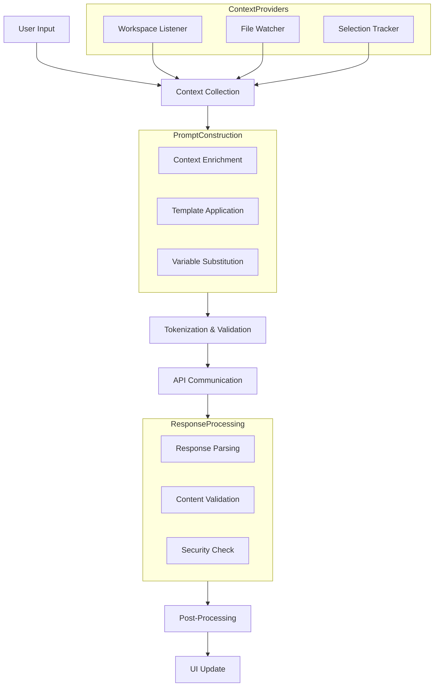
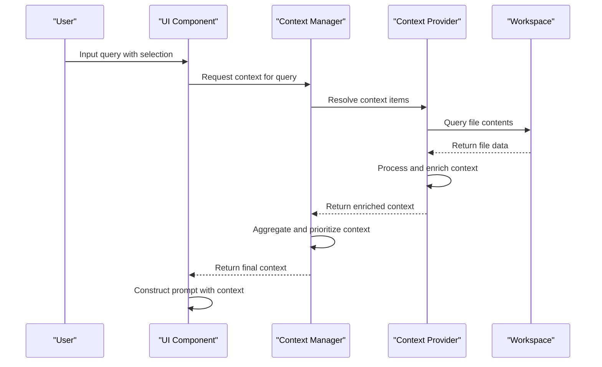
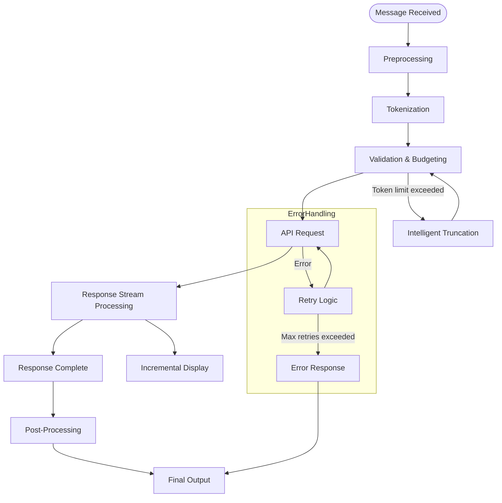
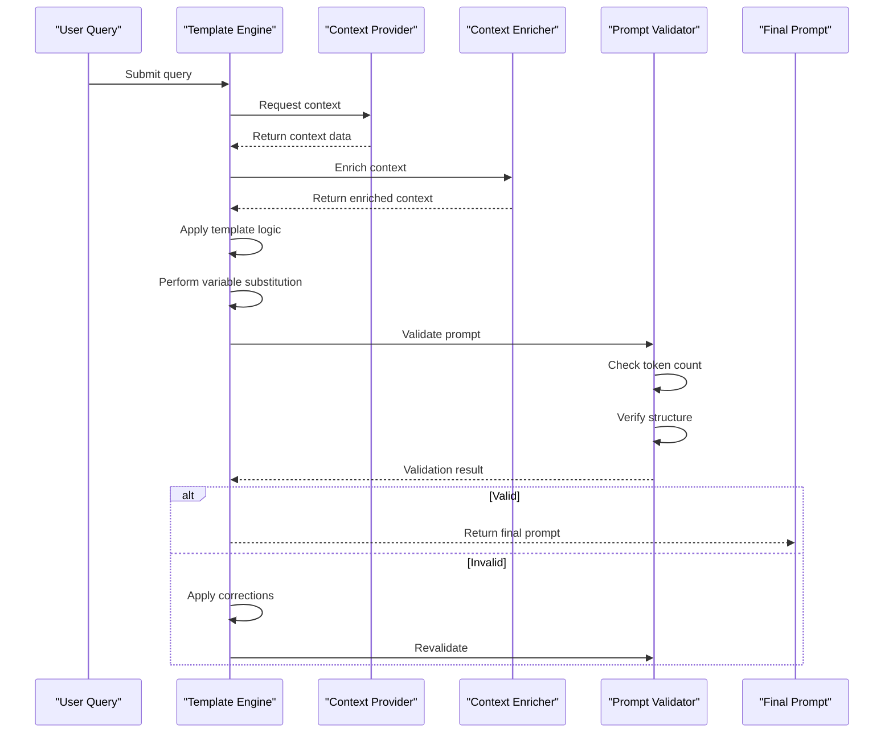
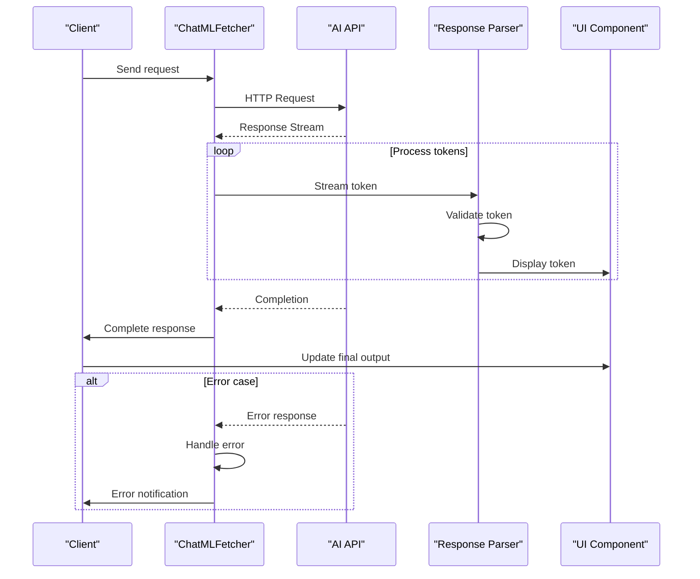
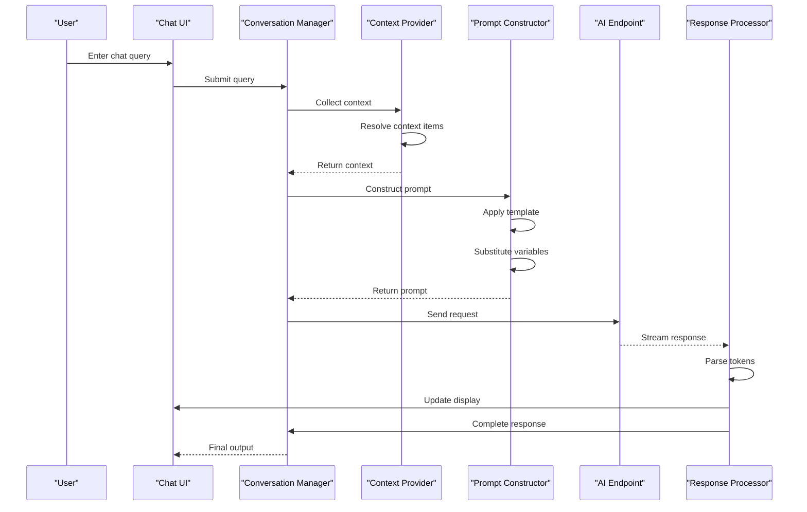
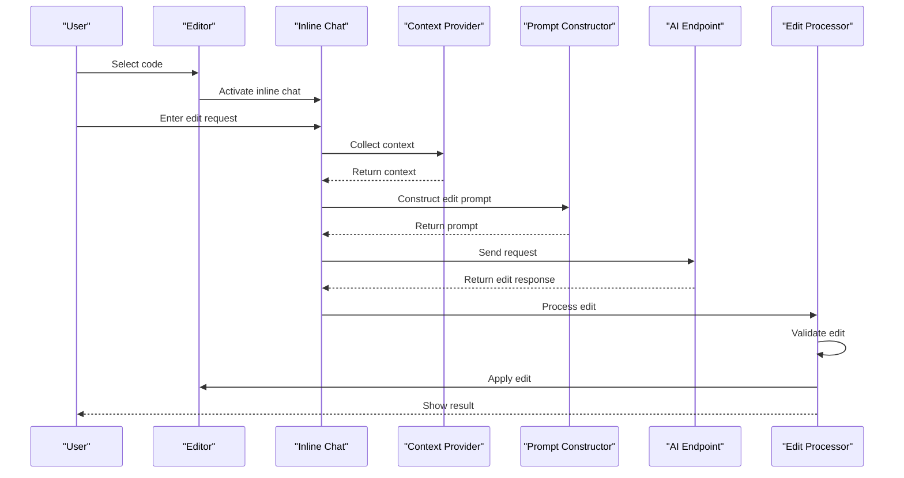
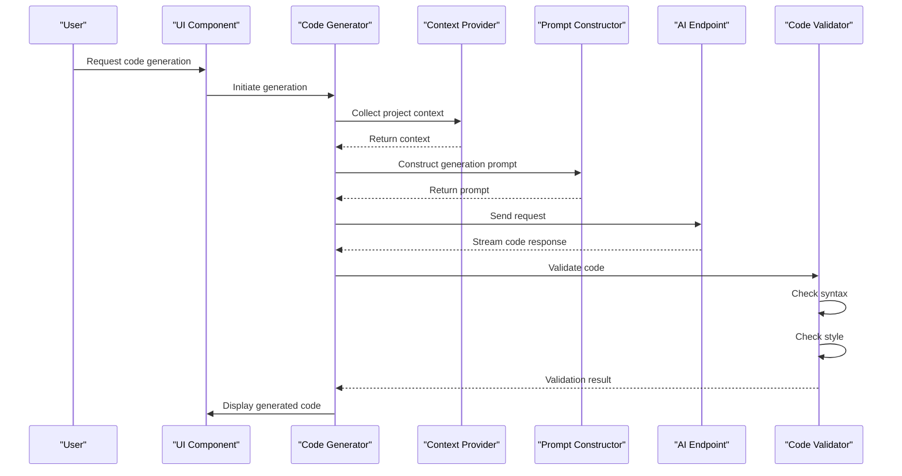

# Data Flow

<cite>
**Referenced Files in This Document**   
- [languageModelChatMessageHelpers.ts](file://src/extension/conversation/common/languageModelChatMessageHelpers.ts)
- [tokenizer.ts](file://src/platform/tokenizer/node/tokenizer.ts)
- [codebaseTool.tsx](file://src/extension/tools/node/codebaseTool.tsx)
- [agentPrompt.tsx](file://src/extension/prompts/node/agent/agentPrompt.tsx)
- [chatMLFetcher.ts](file://src/extension/prompt/node/chatMLFetcher.ts)
- [requestLoggerImpl.ts](file://src/extension/prompt/vscode-node/requestLoggerImpl.ts)
- [oaiLanguageModelServer.ts](file://src/extension/externalAgents/node/oaiLanguageModelServer.ts)
- [conversationFeature.ts](file://src/extension/conversation/vscode-node/conversationFeature.ts)
- [workspaceContextResolver.ts](file://src/extension/context/node/resolvers/workspaceContextResolver.ts)
- [promptRenderer.tsx](file://src/extension/completions-core/vscode-node/lib/src/prompt/components/completionsPromptRenderer.tsx)
- [cascadingPromptFactory.ts](file://src/extension/completions-core/vscode-node/lib/src/prompt/completionsPromptFactory/cascadingPromptFactory.ts)
- [contextProviderStatistics.ts](file://src/extension/completions-core/vscode-node/lib/src/prompt/contextProviderStatistics.ts)
</cite>

## Table of Contents
1. [Introduction](#introduction)
2. [Data Flow Overview](#data-flow-overview)
3. [Context Data Flow](#context-data-flow)
4. [Message Lifecycle](#message-lifecycle)
5. [Prompt Construction](#prompt-construction)
6. [AI Communication and Response Processing](#ai-communication-and-response-processing)
7. [Performance Considerations](#performance-considerations)
8. [Sequence Diagrams](#sequence-diagrams)
9. [Conclusion](#conclusion)

## Introduction

The vscode-copilot-chat extension implements a sophisticated data flow system that processes user input through multiple stages to generate AI-powered responses. This documentation details the complete pathway from user input through processing to AI response generation and UI update. The system handles various scenarios including chat queries, inline edits, and code generation, with a focus on context enrichment, prompt templating, and response formatting.

The architecture is designed to efficiently manage context data from workspace listeners to context providers, then to prompt construction and finally to the AI model. Each stage involves specific data transformations, tokenization processes, and optimization strategies to ensure responsive and accurate AI interactions.

**Section sources**
- [README.md](file://README.md#L1-L84)

## Data Flow Overview

The data flow in vscode-copilot-chat follows a structured pipeline that begins with user input and ends with AI-generated content displayed in the UI. The process can be broken down into several key phases: context collection, prompt construction, AI communication, response processing, and UI update.

The system leverages a modular architecture where different components handle specific aspects of the data flow. Context providers collect relevant information from the workspace, which is then processed and formatted into prompts. These prompts are sent to AI endpoints through a fetcher layer that handles API communication, error handling, and rate limiting. The responses are parsed, post-processed, and rendered in the appropriate UI components.

A critical aspect of the data flow is token management, where the system must ensure that prompts stay within the token limits of the AI models while maximizing the amount of relevant context. This involves sophisticated token counting, context prioritization, and content truncation strategies.

**Diagram sources **
- [conversationFeature.ts](file://src/extension/conversation/vscode-node/conversationFeature.ts)
- [workspaceContextResolver.ts](file://src/extension/context/node/resolvers/workspaceContextResolver.ts)

## Context Data Flow

The context data flow in vscode-copilot-chat begins with workspace listeners that monitor various aspects of the development environment. These listeners collect information about open files, selection ranges, workspace structure, and other relevant context that can inform AI responses.

Context providers are responsible for resolving and enriching this raw context data. They implement specific logic to extract meaningful information from the workspace, such as file contents, code structure, and project dependencies. The context providers are designed to be extensible, allowing for custom context types to be added as needed.

The collected context is then processed through a series of transformations to prepare it for prompt construction. This includes filtering irrelevant information, prioritizing important context based on relevance and recency, and formatting the data in a way that is optimal for the AI model. The system uses a token-based budgeting approach to ensure that the most valuable context is included within the constraints of the AI model's token limits.

Context data is organized into a hierarchical structure that reflects the relationships between different pieces of information. This structure is preserved during serialization and transmission to maintain the semantic relationships between context elements. The system also implements caching strategies to avoid redundant context collection and improve performance.

**Diagram sources **
- [workspaceContextResolver.ts](file://src/extension/context/node/resolvers/workspaceContextResolver.ts)
- [conversationFeature.ts](file://src/extension/conversation/vscode-node/conversationFeature.ts)

**Section sources**
- [workspaceContextResolver.ts](file://src/extension/context/node/resolvers/workspaceContextResolver.ts)
- [contextProviderStatistics.ts](file://src/extension/completions-core/vscode-node/lib/src/prompt/contextProviderStatistics.ts)

## Message Lifecycle

The message lifecycle in vscode-copilot-chat encompasses the complete journey of a user query from input to AI response. This lifecycle includes preprocessing, tokenization, API communication, response parsing, and post-processing stages that ensure reliable and secure AI interactions.

When a user submits a query, the system first performs preprocessing to clean and normalize the input. This includes removing extraneous whitespace, normalizing line endings, and applying any necessary text transformations. The preprocessed message is then combined with the collected context data to form the basis of the AI prompt.

Tokenization is a critical step in the message lifecycle, where the system calculates the token count of the combined message and context. The tokenizer implementation supports multiple tokenization schemes (CL100K, O200K) to match different AI models. The system uses an LRU cache to optimize token counting performance, avoiding redundant calculations for repeated text segments.

Before sending the request to the AI endpoint, the system validates that the total token count is within the model's limits. If necessary, the system applies intelligent truncation strategies to reduce the token count while preserving the most important information. This may involve removing older conversation history, compressing less relevant context, or applying other content reduction techniques.

The response parsing stage handles the incoming AI response, which may arrive as a stream of tokens or a complete message. The system processes the response incrementally, allowing for real-time display of the AI's output. Post-processing steps include content validation, security checks, and formatting adjustments to ensure the response is appropriate and properly formatted for display.

**Diagram sources **
- [tokenizer.ts](file://src/platform/tokenizer/node/tokenizer.ts)
- [chatMLFetcher.ts](file://src/extension/prompt/node/chatMLFetcher.ts)

**Section sources**
- [tokenizer.ts](file://src/platform/tokenizer/node/tokenizer.ts)
- [chatMLFetcher.ts](file://src/extension/prompt/node/chatMLFetcher.ts)

## Prompt Construction

Prompt construction in vscode-copilot-chat is a sophisticated process that combines user queries, context data, and template logic to create effective AI prompts. The system uses a component-based approach where different elements contribute to the final prompt structure.

The prompt construction process begins with template selection based on the query type and context. Different templates are used for various scenarios such as chat queries, inline edits, code generation, and debugging assistance. Each template defines the structure and content organization for the prompt.

Context enrichment is a key aspect of prompt construction, where relevant workspace information is integrated into the prompt. This includes file contents, code structure, project dependencies, and other contextual data that helps the AI understand the development environment. The system prioritizes context based on relevance, recency, and token efficiency.

Variable substitution is applied to replace template placeholders with actual values from the context. This includes user-specific information, workspace metadata, and dynamic content that changes based on the current development state. The system also supports conditional content inclusion, where certain prompt elements are included or excluded based on context conditions.

The final prompt is validated for token count and structural integrity before being sent to the AI model. The system ensures that the prompt adheres to the expected format for the target AI model, including proper role tags, message boundaries, and special tokens. Error handling is implemented to gracefully manage cases where prompt construction fails or produces invalid output.

**Diagram sources **
- [promptRenderer.tsx](file://src/extension/completions-core/vscode-node/lib/src/prompt/components/completionsPromptRenderer.tsx)
- [cascadingPromptFactory.ts](file://src/extension/completions-core/vscode-node/lib/src/prompt/completionsPromptFactory/cascadingPromptFactory.ts)

**Section sources**
- [promptRenderer.tsx](file://src/extension/completions-core/vscode-node/lib/src/prompt/components/completionsPromptRenderer.tsx)
- [agentPrompt.tsx](file://src/extension/prompts/node/agent/agentPrompt.tsx)

## AI Communication and Response Processing

The AI communication and response processing system in vscode-copilot-chat handles the interaction between the extension and AI endpoints. This includes API request construction, network communication, response parsing, and error handling.

The communication layer uses a fetcher pattern to abstract the details of API interaction. The chatMLFetcher component is responsible for constructing HTTP requests, managing authentication, and handling the request-response cycle. It supports both streaming and non-streaming responses, allowing for real-time display of AI output.

Request construction involves formatting the prompt according to the API requirements of the target AI model. This includes setting appropriate headers, query parameters, and request body structure. The system includes support for various AI providers and models, with configuration options to customize the request format for each endpoint.

Error handling is a critical aspect of the communication system, with comprehensive strategies for dealing with network issues, rate limiting, and API errors. The system implements retry logic with exponential backoff for transient failures, and provides meaningful error messages to users when requests fail. Rate limiting is handled by tracking usage and implementing appropriate delays between requests.

Response processing involves parsing the AI model's output and converting it into a format suitable for display in the UI. For streaming responses, the system processes tokens incrementally, allowing users to see the AI's output as it is generated. The response parser handles various content types including plain text, code blocks, and structured data.

Post-processing steps include content validation, security checks, and formatting adjustments. The system verifies that the response is appropriate and free from potentially harmful content. It also applies formatting rules to ensure consistent presentation of code blocks, markdown, and other structured elements.

**Diagram sources **
- [chatMLFetcher.ts](file://src/extension/prompt/node/chatMLFetcher.ts)
- [oaiLanguageModelServer.ts](file://src/extension/externalAgents/node/oaiLanguageModelServer.ts)

**Section sources**
- [chatMLFetcher.ts](file://src/extension/prompt/node/chatMLFetcher.ts)
- [requestLoggerImpl.ts](file://src/extension/prompt/vscode-node/requestLoggerImpl.ts)

## Performance Considerations

The vscode-copilot-chat extension implements several performance optimizations to ensure responsive AI interactions while managing computational and network resources efficiently. These optimizations address data serialization, caching strategies, and memory management during data processing.

Data serialization is optimized through efficient data structures and minimal serialization overhead. The system uses JSON-based formats for data exchange, with careful attention to payload size and structure. Binary data is encoded using efficient formats like base64, and large data transfers are chunked to prevent memory issues.

Caching strategies are implemented at multiple levels to reduce redundant operations. The tokenizer uses an LRU cache to store token counts for frequently used text segments, avoiding repeated tokenization calculations. Context data is cached based on file paths and timestamps, allowing for quick retrieval of previously collected context. The system also implements request caching to avoid duplicate API calls for identical queries.

Memory management is critical during data processing, especially when handling large codebases or complex queries. The system uses streaming processing for large data sets, avoiding the need to load entire files into memory. Object pooling is used for frequently created and destroyed objects to reduce garbage collection overhead. The extension also implements memory pressure monitoring to adjust processing intensity based on available system resources.

Token counting and budgeting are optimized through approximate calculations and early termination. The system uses character-length approximations for quick token estimates, falling back to precise tokenization only when necessary. Budgeting calculations are performed incrementally, allowing the system to stop context collection once the token limit is reached.

Network performance is optimized through connection pooling, request batching, and compression. The system maintains persistent connections to AI endpoints to reduce connection overhead. Multiple small requests are batched when possible, and response compression is used to reduce bandwidth usage.

```mermaid
flowchart TD
subgraph PerformanceOptimizations
Caching["Caching Strategies"]
MemoryManagement["Memory Management"]
NetworkOptimization["Network Optimization"]
TokenizationOptimization["Tokenization Optimization"]
end
Caching --> |LRU Cache| Tokenizer["Tokenizer"]
Caching --> |Context Cache| ContextProvider["Context Provider"]
Caching --> |Request Cache| Fetcher["ChatMLFetcher"]
MemoryManagement --> |Streaming| DataProcessing["Data Processing"]
MemoryManagement --> |Object Pooling| ObjectCreation["Object Creation"]
MemoryManagement --> |Memory Monitoring| SystemResources["System Resources"]
NetworkOptimization --> |Connection Pooling| APICommunication["API Communication"]
NetworkOptimization --> |Request Batching| RequestHandling["Request Handling"]
NetworkOptimization --> |Compression| DataTransfer["Data Transfer"]
TokenizationOptimization --> |Approximate Counting| TokenCounting["Token Counting"]
TokenizationOptimization --> |Incremental Budgeting| PromptConstruction["Prompt Construction"]
```

**Diagram sources **
- [tokenizer.ts](file://src/platform/tokenizer/node/tokenizer.ts)
- [chatMLFetcher.ts](file://src/extension/prompt/node/chatMLFetcher.ts)

**Section sources**
- [tokenizer.ts](file://src/platform/tokenizer/node/tokenizer.ts)
- [chatMLFetcher.ts](file://src/extension/prompt/node/chatMLFetcher.ts)

## Sequence Diagrams

This section provides detailed sequence diagrams for key scenarios in the vscode-copilot-chat data flow, illustrating the interactions between components for chat queries, inline edits, and code generation.

### Chat Query Sequence

**Diagram sources **
- [conversationFeature.ts](file://src/extension/conversation/vscode-node/conversationFeature.ts)
- [promptRenderer.tsx](file://src/extension/completions-core/vscode-node/lib/src/prompt/components/completionsPromptRenderer.tsx)

### Inline Edit Sequence

**Diagram sources **
- [codebaseTool.tsx](file://src/extension/tools/node/codebaseTool.tsx)
- [conversationFeature.ts](file://src/extension/conversation/vscode-node/conversationFeature.ts)

### Code Generation Sequence

**Diagram sources **
- [agentPrompt.tsx](file://src/extension/prompts/node/agent/agentPrompt.tsx)
- [conversationFeature.ts](file://src/extension/conversation/vscode-node/conversationFeature.ts)

## Conclusion

The data flow architecture in vscode-copilot-chat demonstrates a sophisticated and well-structured approach to AI-powered development assistance. By carefully orchestrating the flow of data from user input through context collection, prompt construction, AI communication, and response processing, the system delivers responsive and contextually relevant AI interactions.

Key strengths of the architecture include its modular design, which allows for extensibility and maintainability, and its comprehensive handling of performance considerations through caching, memory management, and optimization strategies. The system's attention to token management and context prioritization ensures efficient use of AI model capabilities while maintaining responsiveness.

The implementation of robust error handling and security measures provides a reliable user experience, while the support for streaming responses enables real-time interaction with the AI. The extensible context provider system allows for rich integration with the development environment, making the AI assistance highly relevant to the user's current task.

Future enhancements could include more sophisticated context relevance scoring, adaptive token budgeting based on query complexity, and enhanced caching strategies for frequently accessed context. The architecture provides a solid foundation for these and other improvements, ensuring that vscode-copilot-chat can continue to evolve as AI capabilities advance.

[No sources needed since this section summarizes without analyzing specific files]