# Prompt Assembly

<cite>
**Referenced Files in This Document**   
- [chatParticipantRequestHandler.ts](file://src/extension/prompt/node/chatParticipantRequestHandler.ts)
- [contextProviderRegistry.ts](file://src/extension/completions-core/vscode-node/lib/src/prompt/contextProviderRegistry.ts)
- [contextProviderBridge.ts](file://src/extension/completions-core/vscode-node/lib/src/prompt/components/contextProviderBridge.ts)
- [documentContext.ts](file://src/extension/prompt/node/documentContext.ts)
- [diagnosticsContextProvider.ts](file://src/extension/diagnosticsContext/vscode/diagnosticsContextProvider.ts)
- [promptContextModel.ts](file://src/platform/workspaceState/common/promptContextModel.ts)
- [vscodeContext.ts](file://src/extension/context/node/resolvers/vscodeContext.ts)
</cite>

## Table of Contents
1. [Introduction](#introduction)
2. [Prompt Assembly Pipeline](#prompt-assembly-pipeline)
3. [Context Providers](#context-providers)
4. [Conversation History Formatting](#conversation-history-formatting)
5. [Current Document Context Injection](#current-document-context-injection)
6. [Selection Context Handling](#selection-context-handling)
7. [Instruction Message Insertion](#instruction-message-insertion)
8. [Multi-File Edit Prompt Assembly](#multi-file-edit-prompt-assembly)
9. [Code Explanation with Type Information](#code-explanation-with-type-information)
10. [Refactoring Operations](#refactoring-operations)
11. [Error Handling in Context Retrieval](#error-handling-in-context-retrieval)
12. [Context Prioritization and Token Limit Management](#context-prioritization-and-token-limit-management)
13. [Architecture Overview](#architecture-overview)

## Introduction
The prompt assembly process in vscode-copilot-chat is a sophisticated system that orchestrates the construction of complete prompts by combining template elements with dynamic context. This documentation details how the chatParticipantRequestHandler coordinates the assembly pipeline, integrating conversation history, current document context, selection context, and instruction messages to create comprehensive prompts for AI interactions. The system leverages various context providers to enrich prompts with relevant information from files, symbols, and diagnostics, ensuring that the AI receives sufficient context to generate meaningful responses.

## Prompt Assembly Pipeline
The prompt assembly pipeline is orchestrated by the chatParticipantRequestHandler, which manages the entire process from request reception to prompt construction and response handling. The pipeline follows a structured sequence of operations to ensure comprehensive context collection and proper prompt formatting.

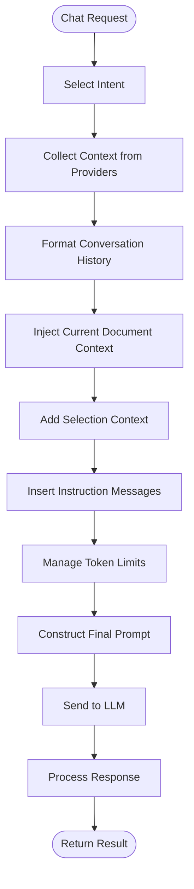

**Diagram sources**
- [chatParticipantRequestHandler.ts](file://src/extension/prompt/node/chatParticipantRequestHandler.ts#L58-L466)

**Section sources**
- [chatParticipantRequestHandler.ts](file://src/extension/prompt/node/chatParticipantRequestHandler.ts#L58-L466)

## Context Providers
Context providers are responsible for supplying specific types of contextual information to the prompt assembly process. These providers implement a standardized interface and are registered with the context provider registry, which manages their lifecycle and invocation.

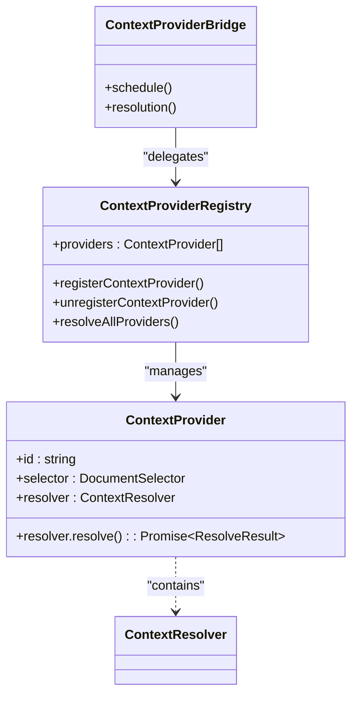

**Diagram sources**
- [contextProviderRegistry.ts](file://src/extension/completions-core/vscode-node/lib/src/prompt/contextProviderRegistry.ts#L60-L540)
- [contextProviderBridge.ts](file://src/extension/completions-core/vscode-node/lib/src/prompt/components/contextProviderBridge.ts#L14-L72)

**Section sources**
- [contextProviderRegistry.ts](file://src/extension/completions-core/vscode-node/lib/src/prompt/contextProviderRegistry.ts#L60-L540)
- [contextProviderBridge.ts](file://src/extension/completions-core/vscode-node/lib/src/prompt/components/contextProviderBridge.ts#L14-L72)

## Conversation History Formatting
The conversation history formatting component processes previous interactions to provide context for the current request. It serializes past turns, normalizes summaries, and ensures that the conversation flow is preserved in the prompt.

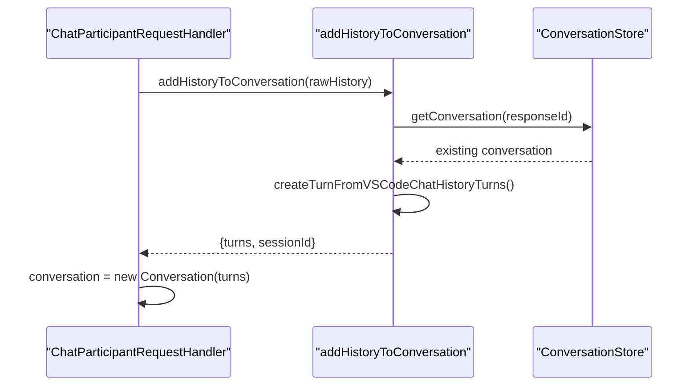

**Diagram sources**
- [chatParticipantRequestHandler.ts](file://src/extension/prompt/node/chatParticipantRequestHandler.ts#L327-L466)

**Section sources**
- [chatParticipantRequestHandler.ts](file://src/extension/prompt/node/chatParticipantRequestHandler.ts#L327-L466)

## Current Document Context Injection
The document context injection process captures essential information about the current document, including its content, language, and formatting preferences. This information is crucial for generating contextually appropriate responses.

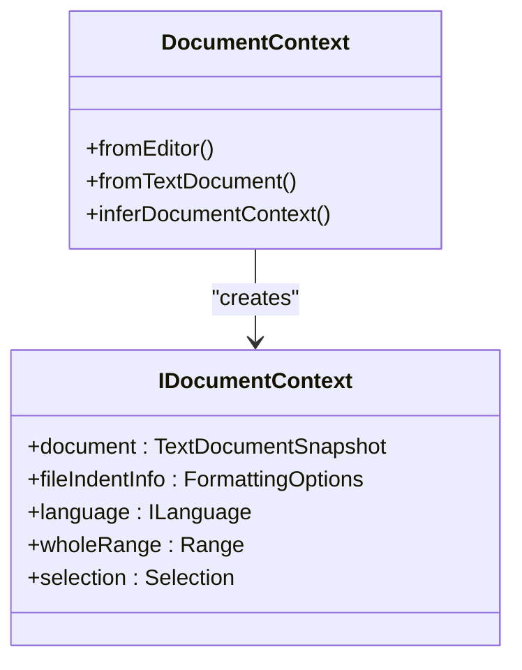

**Diagram sources**
- [documentContext.ts](file://src/extension/prompt/node/documentContext.ts#L15-L107)

**Section sources**
- [documentContext.ts](file://src/extension/prompt/node/documentContext.ts#L15-L107)

## Selection Context Handling
Selection context handling captures the user's current selection in the editor and incorporates it into the prompt. This allows the AI to focus on the specific code or text that the user is interested in.

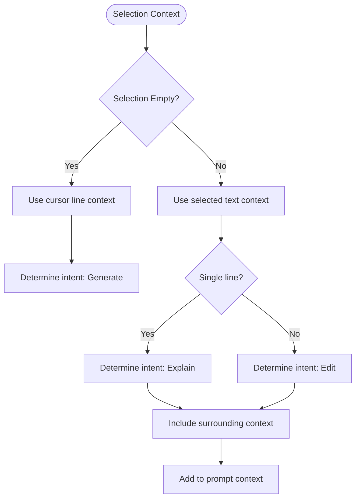

**Section sources**
- [chatParticipantRequestHandler.ts](file://src/extension/prompt/node/chatParticipantRequestHandler.ts#L285-L302)

## Instruction Message Insertion
Instruction message insertion adds system-level instructions and constraints to the prompt, guiding the AI's behavior and response format. These instructions ensure that the AI adheres to specific guidelines and produces responses in the expected format.

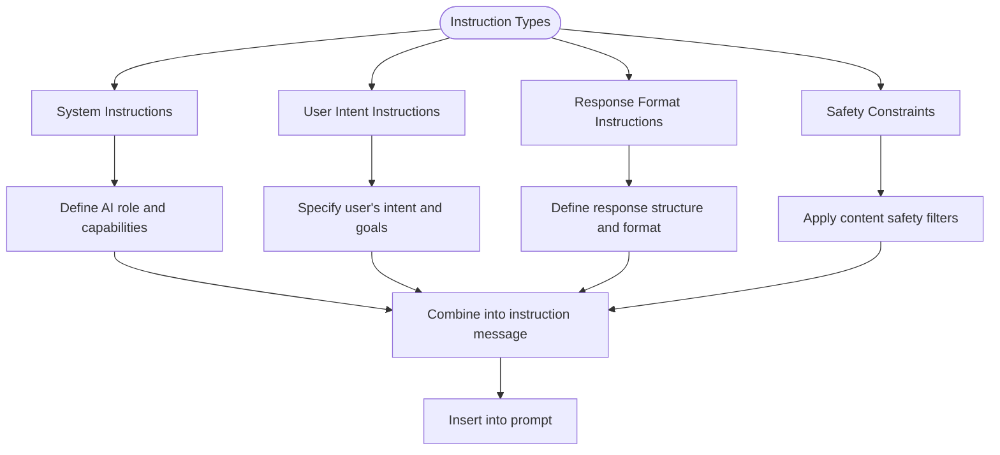

**Section sources**
- [chatParticipantRequestHandler.ts](file://src/extension/prompt/node/chatParticipantRequestHandler.ts#L233-L243)

## Multi-File Edit Prompt Assembly
The multi-file edit prompt assembly process handles requests that involve changes across multiple files. It coordinates the collection of context from all relevant files and ensures that the prompt contains sufficient information for the AI to generate comprehensive edits.

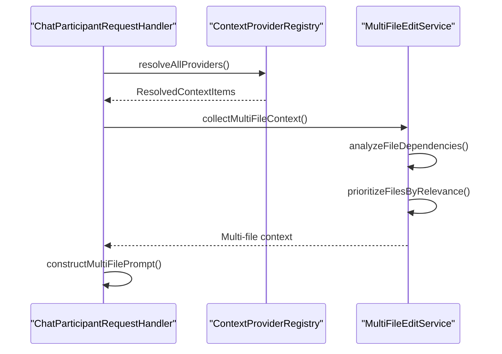

**Section sources**
- [contextProviderRegistry.ts](file://src/extension/completions-core/vscode-node/lib/src/prompt/contextProviderRegistry.ts#L134-L312)
- [chatParticipantRequestHandler.ts](file://src/extension/prompt/node/chatParticipantRequestHandler.ts#L203-L278)

## Code Explanation with Type Information
The code explanation process with type information enriches prompts with detailed type information from the codebase. This allows the AI to provide more accurate and insightful explanations of code functionality.

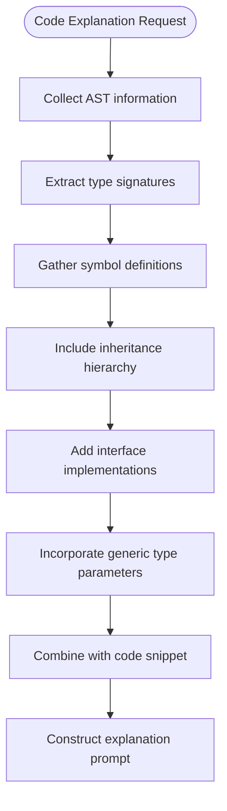

**Section sources**
- [contextProviderRegistry.ts](file://src/extension/completions-core/vscode-node/lib/src/prompt/contextProviderRegistry.ts#L134-L312)
- [diagnosticsContextProvider.ts](file://src/extension/diagnosticsContext/vscode/diagnosticsContextProvider.ts)

## Refactoring Operations
The refactoring operations prompt assembly process handles requests for code refactoring. It analyzes the code structure, identifies refactoring opportunities, and provides the AI with comprehensive context to suggest meaningful improvements.

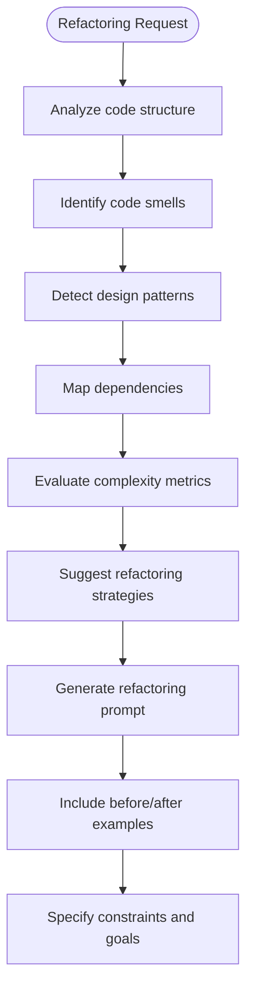

**Section sources**
- [contextProviderRegistry.ts](file://src/extension/completions-core/vscode-node/lib/src/prompt/contextProviderRegistry.ts#L134-L312)
- [chatParticipantRequestHandler.ts](file://src/extension/prompt/node/chatParticipantRequestHandler.ts#L203-L278)

## Error Handling in Context Retrieval
The error handling mechanism for context retrieval ensures robust operation when context providers fail to deliver information. It implements graceful degradation and fallback strategies to maintain functionality.

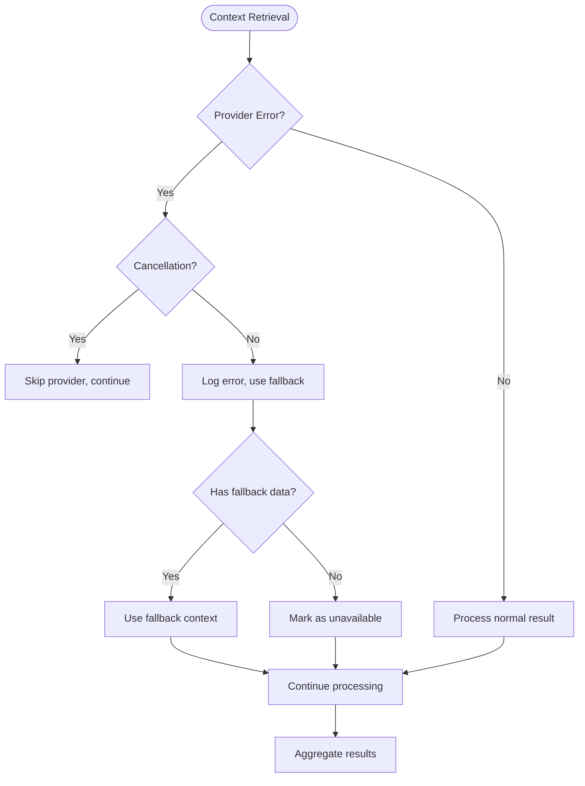

**Section sources**
- [contextProviderRegistry.ts](file://src/extension/completions-core/vscode-node/lib/src/prompt/contextProviderRegistry.ts#L255-L286)

## Context Prioritization and Token Limit Management
The context prioritization and token limit management system ensures that prompts remain within token constraints while preserving the most valuable information. It implements a sophisticated ranking and filtering mechanism to optimize context usage.

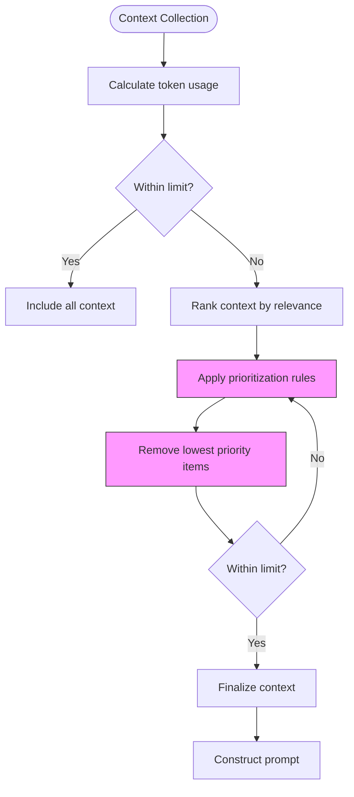

**Section sources**
- [contextProviderRegistry.ts](file://src/extension/completions-core/vscode-node/lib/src/prompt/contextProviderRegistry.ts#L206-L217)
- [chatParticipantRequestHandler.ts](file://src/extension/prompt/node/chatParticipantRequestHandler.ts#L203-L278)

## Architecture Overview
The prompt assembly architecture in vscode-copilot-chat is a modular system that integrates various components to create comprehensive prompts for AI interactions. The architecture follows a clean separation of concerns, with distinct components handling different aspects of the prompt assembly process.

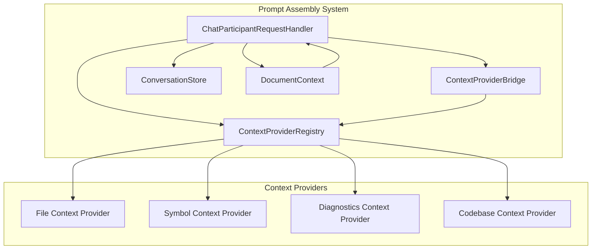

**Diagram sources**
- [chatParticipantRequestHandler.ts](file://src/extension/prompt/node/chatParticipantRequestHandler.ts#L58-L466)
- [contextProviderRegistry.ts](file://src/extension/completions-core/vscode-node/lib/src/prompt/contextProviderRegistry.ts#L60-L540)
- [contextProviderBridge.ts](file://src/extension/completions-core/vscode-node/lib/src/prompt/components/contextProviderBridge.ts#L14-L72)

**Section sources**
- [chatParticipantRequestHandler.ts](file://src/extension/prompt/node/chatParticipantRequestHandler.ts#L58-L466)
- [contextProviderRegistry.ts](file://src/extension/completions-core/vscode-node/lib/src/prompt/contextProviderRegistry.ts#L60-L540)
- [contextProviderBridge.ts](file://src/extension/completions-core/vscode-node/lib/src/prompt/components/contextProviderBridge.ts#L14-L72)