# Prompt Construction

<cite>
**Referenced Files in This Document**   
- [chatParticipantRequestHandler.ts](file://src/extension/prompt/node/chatParticipantRequestHandler.ts)
- [defaultIntentRequestHandler.ts](file://src/extension/prompt/node/defaultIntentRequestHandler.ts)
- [instructionMessage.tsx](file://src/extension/prompts/node/base/instructionMessage.tsx)
- [explain.tsx](file://src/extension/prompts/node/panel/explain.tsx)
- [inlineChatGenerateCodePrompt.tsx](file://src/extension/prompts/node/inline/inlineChatGenerateCodePrompt.tsx)
- [intentDetector.tsx](file://src/extension/prompt/node/intentDetector.tsx)
- [promptRenderer.ts](file://src/extension/prompts/node/base/promptRenderer.ts)
- [safetyRules.tsx](file://src/extension/prompts/node/base/safetyRules.tsx)
- [conversationHistory.tsx](file://src/extension/prompts/node/panel/conversationHistory.tsx)
- [documentContext.ts](file://src/extension/prompt/node/documentContext.ts)
</cite>

## Table of Contents
1. [Introduction](#introduction)
2. [Prompt Construction Process](#prompt-construction-process)
3. [Intent Detection and Selection](#intent-detection-and-selection)
4. [Chat Participant Request Handler](#chat-participant-request-handler)
5. [Prompt Template Structure](#prompt-template-structure)
6. [Context Integration](#context-integration)
7. [Token Management and Truncation](#token-management-and-truncation)
8. [Security Considerations](#security-considerations)
9. [Conclusion](#conclusion)

## Introduction

The prompt construction system in vscode-copilot-chat transforms user intent and context data into structured prompts for AI models. This documentation details the process of how prompts are assembled, serialized, and optimized for different scenarios such as code explanation, generation, and refactoring. The system leverages a sophisticated architecture that combines intent detection, context integration, and template selection to create effective prompts that maximize the AI model's capabilities while maintaining security and efficiency.

The core of the prompt construction process revolves around the `chatParticipantRequestHandler`, which orchestrates the entire flow from receiving a user request to generating the final prompt. This handler works in conjunction with various components including intent detectors, prompt templates, and context providers to create a comprehensive and contextually relevant prompt for the AI model.

**Section sources**
- [chatParticipantRequestHandler.ts](file://src/extension/prompt/node/chatParticipantRequestHandler.ts#L58-L466)

## Prompt Construction Process

The prompt construction process in vscode-copilot-chat follows a systematic approach to transform user requests into structured prompts that can be effectively processed by AI models. The process begins when a user submits a request through the chat interface, which is then handled by the `ChatParticipantRequestHandler` class. This handler serves as the central orchestrator of the prompt construction workflow.

The process starts with the initialization of the handler, which receives the raw chat history, current request, response stream, cancellation token, and chat agent arguments. The handler first determines the chat location (Editor, Notebook, or Panel) and creates a conversation object that combines the existing history with the current request. This conversation object serves as the foundation for all subsequent processing.

**Diagram sources**
- [chatParticipantRequestHandler.ts](file://src/extension/prompt/node/chatParticipantRequestHandler.ts#L58-L466)
- [defaultIntentRequestHandler.ts](file://src/extension/prompt/node/defaultIntentRequestHandler.ts#L71-L765)

**Section sources**
- [chatParticipantRequestHandler.ts](file://src/extension/prompt/node/chatParticipantRequestHandler.ts#L58-L466)
- [defaultIntentRequestHandler.ts](file://src/extension/prompt/node/defaultIntentRequestHandler.ts#L71-L765)

## Intent Detection and Selection

Intent detection is a critical component of the prompt construction process, responsible for determining the user's intended action based on their request and context. The system uses the `IntentDetector` class to analyze user queries and select the appropriate intent, which then determines the prompt template and processing logic to be used.

The intent detection process begins by examining the user's message text, conversation history, and current document context. The detector first checks for any explicit commands or agent references in the request. If no explicit intent is detected, the system applies heuristics based on the current context, such as whether the user has selected code in the editor or if they are working in an empty line.

**Diagram sources**
- [intentDetector.tsx](file://src/extension/prompt/node/intentDetector.tsx#L41-L656)
- [chatParticipantRequestHandler.ts](file://src/extension/prompt/node/chatParticipantRequestHandler.ts#L58-L466)

**Section sources**
- [intentDetector.tsx](file://src/extension/prompt/node/intentDetector.tsx#L41-L656)

## Chat Participant Request Handler

The `ChatParticipantRequestHandler` is the central component responsible for processing chat requests and constructing prompts. This handler serves as the entry point for all chat interactions and coordinates the various components involved in prompt construction.

The handler's primary responsibilities include:
- Determining the chat location (Editor, Notebook, or Panel)
- Creating and managing the conversation state
- Detecting and selecting the appropriate intent
- Sanitizing variables and references
- Orchestrating the prompt construction process

The handler initializes with the raw history, current request, response stream, and other necessary dependencies. It then creates a conversation object that combines the existing history with the current request, normalizing any summaries in the process. The handler also infers the document context based on the request location and active editor state.

One of the key functions of the handler is variable sanitization, which filters out references to files that are ignored by the Copilot system. This is accomplished by checking each reference against the ignore service and removing any that match ignored patterns. The handler also handles authentication upgrades when necessary, particularly when workspace-level operations require additional permissions.

**Diagram sources**
- [chatParticipantRequestHandler.ts](file://src/extension/prompt/node/chatParticipantRequestHandler.ts#L58-L466)

**Section sources**
- [chatParticipantRequestHandler.ts](file://src/extension/prompt/node/chatParticipantRequestHandler.ts#L58-L466)

## Prompt Template Structure

The prompt template system in vscode-copilot-chat is designed to provide structured and contextually appropriate instructions to the AI model. Templates are implemented as React-like components using the `@vscode/prompt-tsx` library, allowing for a declarative approach to prompt construction.

Each prompt template follows a consistent structure that includes system messages, instruction messages, and context-specific elements. The structure varies depending on the intent and location, with different templates for code explanation, generation, refactoring, and other scenarios.

The base template structure includes:
- System message with identity and safety rules
- Instruction message with task-specific guidelines
- Conversation history with appropriate context
- Current selection and document context
- Tool references and variables
- User query and additional context

For example, the code explanation template includes specific instructions for being a "world-class coding tutor" and provides guidelines for balancing high-level concepts with granular details. The template also includes rules for thinking step by step, asking clarifying questions when needed, and providing suggestions for code improvement.

**Diagram sources**
- [explain.tsx](file://src/extension/prompts/node/panel/explain.tsx#L27-L105)
- [inlineChatGenerateCodePrompt.tsx](file://src/extension/prompts/node/inline/inlineChatGenerateCodePrompt.tsx#L28-L116)
- [instructionMessage.tsx](file://src/extension/prompts/node/base/instructionMessage.tsx#L10-L20)

**Section sources**
- [explain.tsx](file://src/extension/prompts/node/panel/explain.tsx#L27-L105)
- [inlineChatGenerateCodePrompt.tsx](file://src/extension/prompts/node/inline/inlineChatGenerateCodePrompt.tsx#L28-L116)

## Context Integration

Context integration is a crucial aspect of prompt construction, ensuring that the AI model has access to relevant information about the user's current situation. The system integrates various types of context, including conversation history, document state, selection information, and project metadata.

The context integration process begins with the creation of a document context object, which captures information about the current document, selection, and formatting preferences. This context is used to tailor the prompt to the specific coding environment and user preferences.

Conversation history is integrated using the `ConversationHistory` component, which manages the inclusion of previous interactions while respecting token limits. The system intelligently filters out turns that were filtered due to prompt safety concerns and handles the serialization of complex data types.

**Diagram sources**
- [documentContext.ts](file://src/extension/prompt/node/documentContext.ts#L15-L107)
- [conversationHistory.tsx](file://src/extension/prompts/node/panel/conversationHistory.tsx#L20-L182)
- [chatParticipantRequestHandler.ts](file://src/extension/prompt/node/chatParticipantRequestHandler.ts#L38-L40)

**Section sources**
- [documentContext.ts](file://src/extension/prompt/node/documentContext.ts#L15-L107)
- [conversationHistory.tsx](file://src/extension/prompts/node/panel/conversationHistory.tsx#L20-L182)

## Token Management and Truncation

Token management is a critical aspect of prompt construction, ensuring that prompts remain within the model's token limits while preserving the most important information. The system employs a sophisticated token counting and truncation strategy to optimize prompt efficiency.

The token counting process is handled by the `PromptRenderer` class, which uses a tokenizer provider to accurately count tokens in the generated prompt. The renderer integrates with the `ITokenizerProvider` service to acquire the appropriate tokenizer for the target model, ensuring accurate token counts that reflect the actual model constraints.

The system implements several strategies for managing token usage:
- Prioritized list components that ensure important elements are included first
- Token limits that automatically truncate less important content
- Intelligent context filtering that removes redundant information
- Dynamic template selection based on available token budget

The `TokenLimit` component is used to enforce maximum token counts on specific sections of the prompt, such as conversation history. This component ensures that the history does not consume an excessive portion of the token budget, leaving room for other important context.

```mermaid
flowchart TD
Start([Prompt Construction]) --> TokenCounting["Token Counting"]
TokenCounting --> PriorityAssignment["Assign Element Priorities"]
PriorityAssignment --> BudgetAllocation["Allocate Token Budget"]
BudgetAllocation --> TruncationStrategy["Apply Truncation Strategy"]
TruncationStrategy --> HistoryTruncation["Truncate Conversation History"]
TruncationStrategy --> ContextFiltering["Filter Redundant Context"]
TruncationStrategy --> VariableOptimization["Optimize Variables"]
HistoryTruncation --> FinalValidation["Validate Token Count"]
ContextFiltering --> FinalValidation
VariableOptimization --> FinalValidation
FinalValidation --> End([Final Prompt])
```

**Diagram sources**
- [promptRenderer.ts](file://src/extension/prompts/node/base/promptRenderer.ts#L56-L223)
- [conversationHistory.tsx](file://src/extension/prompts/node/panel/conversationHistory.tsx#L20-L182)

**Section sources**
- [promptRenderer.ts](file://src/extension/prompts/node/base/promptRenderer.ts#L56-L223)

## Security Considerations

Security is a paramount concern in the prompt construction process, with multiple layers of protection against prompt injection and sensitive data exposure. The system implements comprehensive security measures to ensure user data privacy and prevent malicious exploitation.

The primary security mechanism is variable sanitization, which filters out references to files that are ignored by the Copilot system. This is accomplished through the `sanitizeVariables` method in the `ChatParticipantRequestHandler` class, which checks each reference against the ignore service and removes any that match ignored patterns.

The system also implements safety rules that are included in the system message of each prompt. These rules instruct the AI model to follow Microsoft content policies, avoid copyright violations, and respond appropriately to requests for harmful content. The `LegacySafetyRules` component enforces these guidelines by including specific instructions in the prompt.

Additionally, the system handles authentication upgrades securely, particularly when workspace-level operations require additional permissions. The `shouldAskForPermissiveAuth` method checks whether additional authentication is needed and prompts the user appropriately without exposing sensitive information.

**Diagram sources**
- [chatParticipantRequestHandler.ts](file://src/extension/prompt/node/chatParticipantRequestHandler.ts#L58-L466)
- [safetyRules.tsx](file://src/extension/prompts/node/base/safetyRules.tsx#L8-L45)

**Section sources**
- [chatParticipantRequestHandler.ts](file://src/extension/prompt/node/chatParticipantRequestHandler.ts#L58-L466)
- [safetyRules.tsx](file://src/extension/prompts/node/base/safetyRules.tsx#L8-L45)

## Conclusion

The prompt construction system in vscode-copilot-chat represents a sophisticated and well-architected solution for transforming user intent and context into effective AI prompts. By combining intent detection, context integration, template selection, and security measures, the system creates optimized prompts that maximize the AI model's capabilities while maintaining user privacy and security.

The modular design of the system, with clear separation of concerns between components like the `ChatParticipantRequestHandler`, `IntentDetector`, and various prompt templates, allows for flexible and extensible prompt construction. The use of declarative prompt templates with the `@vscode/prompt-tsx` library enables clean and maintainable code that is easy to understand and modify.

The system's comprehensive approach to token management ensures that prompts remain within model constraints while preserving the most important information. The intelligent context integration and filtering mechanisms provide the AI model with relevant information without overwhelming it with unnecessary details.

Overall, the prompt construction system demonstrates a thoughtful balance between functionality, performance, and security, providing a robust foundation for effective AI-assisted coding in Visual Studio Code.