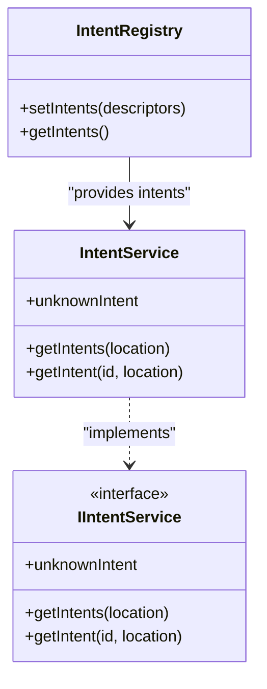
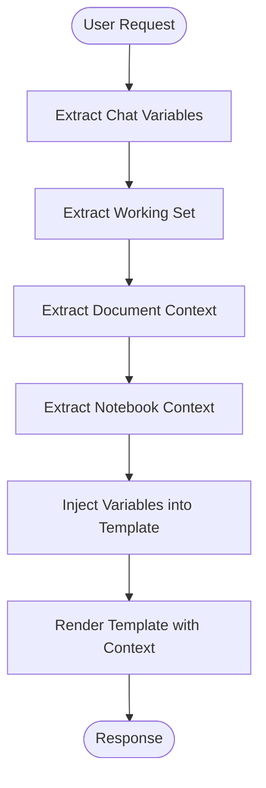
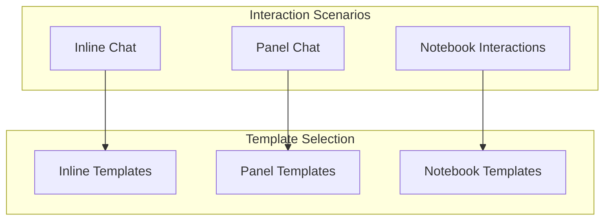
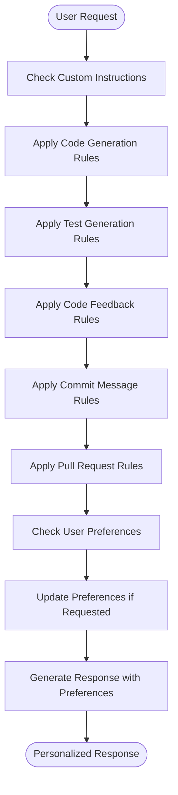

# Template Selection

<cite>
**Referenced Files in This Document**   
- [intentDetector.tsx](file://src/extension/prompt/node/intentDetector.tsx)
- [intentRegistry.ts](file://src/extension/prompt/node/intentRegistry.ts)
- [intentService.ts](file://src/extension/intents/node/intentService.ts)
- [allIntents.ts](file://src/extension/intents/node/allIntents.ts)
- [promptRegistry.ts](file://src/extension/prompts/node/agent/promptRegistry.ts)
- [customInstructions.tsx](file://src/extension/prompts/node/panel/customInstructions.tsx)
- [preferences.tsx](file://src/extension/prompts/node/panel/preferences.tsx)
- [userPreferencesTool.tsx](file://src/extension/tools/node/userPreferencesTool.tsx)
- [inlineChatNotebookGeneratePrompt.tsx](file://src/extension/prompts/node/inline/inlineChatNotebookGeneratePrompt.tsx)
- [inlineChatNotebookCommonPromptElements.tsx](file://src/extension/prompts/node/inline/inlineChatNotebookCommonPromptElements.tsx)
- [notebookEditCodePrompt.tsx](file://src/extension/prompts/node/panel/notebookEditCodePrompt.tsx)
</cite>

## Table of Contents
1. [Introduction](#introduction)
2. [Intent Detection System](#intent-detection-system)
3. [Intent Registry and Service](#intent-registry-and-service)
4. [Template Selection Process](#template-selection-process)
5. [Context Variable Identification](#context-variable-identification)
6. [Template Selection by Scenario](#template-selection-by-scenario)
7. [Fallback Mechanisms](#fallback-mechanisms)
8. [Custom Instructions and User Preferences](#custom-instructions-and-user-preferences)
9. [Conclusion](#conclusion)

## Introduction

The template selection process in vscode-copilot-chat is a sophisticated system that determines the appropriate response template based on user intent, context, and preferences. This documentation details how the system detects user intent from input and context using the intentDetector and intentRegistry components, maps detected intents to corresponding prompt templates, and handles various scenarios across different interaction modes.

The system employs a multi-layered approach to understand user requests, leveraging both explicit commands and implicit context from the editor state to select the most appropriate template for generating responses. This ensures that Copilot provides relevant and contextually appropriate assistance across various development scenarios.

## Intent Detection System

The intent detection system in vscode-copilot-chat analyzes user input and context to determine the most likely intent behind a request. The core component responsible for this functionality is the IntentDetector class, which implements the ChatParticipantDetectionProvider interface.

The detection process begins when a user submits a chat request. The IntentDetector evaluates the request in the context of the current editor state, including the active document, selection, and conversation history. It uses a combination of rule-based heuristics and AI-powered analysis to identify the user's intent.

Key aspects of the intent detection system include:

1. **Location-based detection**: The system differentiates between panel chat (ChatLocation.Panel) and inline chat (ChatLocation.Editor) contexts, applying different detection logic for each scenario.

2. **Preferred intent determination**: The system can determine a preferred intent based on contextual cues. For example, when the selection is empty and on a whitespace line in the editor, the system prefers the "generate" intent. When multiple lines are selected, it prefers the "edit" intent.

3. **AI-powered classification**: The system uses a specialized AI model to classify user requests into specific intent categories. This is accomplished through the IntentDetectionPrompt, which presents the AI with a structured prompt containing the user's question, current file context, and available functions.

4. **Command mapping**: Detected intents are mapped to specific commands that trigger appropriate response templates. The system supports intents such as editCode, explain, generate, and fix.

The intent detection process is governed by the detectIntent method in the IntentDetector class, which coordinates the analysis of user input and context to determine the most appropriate response strategy.

**Section sources**
- [intentDetector.tsx](file://src/extension/prompt/node/intentDetector.tsx#L149-L164)
- [intentDetector.tsx](file://src/extension/prompt/node/intentDetector.tsx#L171-L253)

## Intent Registry and Service

The intent registry and service components form the backbone of the template selection system, providing a structured way to manage and access different intents and their corresponding handlers.

The IntentRegistry is a singleton class that maintains a collection of intent descriptors. It provides methods to register new intents and retrieve the complete list of available intents. The registry uses SyncDescriptor objects to represent intents, allowing for lazy instantiation and dependency injection.

The IntentService class serves as the primary interface for working with intents. It implements the IIntentService interface and provides the following key methods:

1. **getIntents(location)**: Returns all intents that are valid for a specific chat location (panel or editor).
2. **getIntent(id, location)**: Retrieves a specific intent by its identifier and location.
3. **unknownIntent**: Provides access to the default "unknown" intent handler.

The service uses lazy initialization to create intent instances only when needed, improving performance by avoiding unnecessary object creation. When an intent is requested, the service checks its internal cache and creates the intent instance using the instantiation service if it doesn't already exist.

The system is designed to be extensible, allowing new intents to be added through the registry. Each intent is associated with specific locations where it can be used, ensuring that inappropriate intents are not available in certain contexts.

**Diagram sources**
- [intentRegistry.ts](file://src/extension/prompt/node/intentRegistry.ts#L19-L30)
- [intentService.ts](file://src/extension/intents/node/intentService.ts#L24-L58)

**Section sources**
- [intentRegistry.ts](file://src/extension/prompt/node/intentRegistry.ts#L1-L30)
- [intentService.ts](file://src/extension/intents/node/intentService.ts#L1-L58)

## Template Selection Process

The template selection process in vscode-copilot-chat is a multi-step workflow that transforms user input into an appropriate response template. This process begins with intent detection and culminates in the selection and rendering of the appropriate prompt template.

When a user submits a request, the system follows this sequence:

1. **Intent Detection**: The IntentDetector analyzes the user's input and context to determine the most likely intent. This involves examining the chat location, document context, selection state, and conversation history.

2. **Intent Validation**: The detected intent is validated and potentially overridden based on additional context. For example, an "edit" intent might be changed to "generate" if the selection is empty and on a whitespace line.

3. **Template Mapping**: The validated intent is mapped to a specific template. This mapping is managed by the intent service, which associates each intent with a corresponding prompt element.

4. **Template Rendering**: The selected template is rendered with the appropriate context variables and user preferences.

The system uses a hierarchical approach to template selection, with different templates available for different contexts. For example, inline chat in the editor uses different templates than panel chat, and notebook interactions have their own specialized templates.

The template selection process is designed to be both flexible and predictable, ensuring that users receive consistent responses while allowing for context-specific variations.

**Section sources**
- [intentDetector.tsx](file://src/extension/prompt/node/intentDetector.tsx#L149-L369)
- [intentService.ts](file://src/extension/intents/node/intentService.ts#L49-L57)

## Context Variable Identification

The context variable identification system in vscode-copilot-chat extracts relevant information from the current editor state and workspace to enrich prompt templates. This system ensures that responses are grounded in the user's current development context.

Context variables are identified through several mechanisms:

1. **Chat Variables**: The system extracts variables from the chat request references, including file paths, document locations, and other contextual information. The DocInfoTool class is responsible for processing these variables and extracting file paths.

2. **Working Set**: The system considers the current working set of files, which includes recently accessed or relevant files in the workspace. This information is used to provide broader context for responses.

3. **Document Context**: For editor-based interactions, the system captures the current document context, including the active document, selection range, and surrounding code.

4. **Notebook Context**: For notebook interactions, the system identifies notebook-specific context, including cell types, execution order, and output states.

The context identification process is integrated with the template rendering system, ensuring that relevant context variables are automatically injected into templates. This allows templates to reference specific files, code segments, and workspace elements without requiring the user to explicitly mention them.

**Diagram sources**
- [docTool.tsx](file://src/extension/tools/node/docTool.tsx#L71-L103)
- [inlineChatNotebookCommonPromptElements.tsx](file://src/extension/prompts/node/inline/inlineChatNotebookCommonPromptElements.tsx#L395-L428)

**Section sources**
- [docTool.tsx](file://src/extension/tools/node/docTool.tsx#L71-L103)
- [inlineChatNotebookCommonPromptElements.tsx](file://src/extension/prompts/node/inline/inlineChatNotebookCommonPromptElements.tsx#L395-L428)

## Template Selection by Scenario

The template selection system in vscode-copilot-chat adapts to different interaction scenarios, providing specialized templates for various contexts. This section details how template selection works in different scenarios.

### Inline Chat
For inline chat interactions in the editor, the system uses specialized templates that are aware of the immediate code context. When a user selects code and invokes Copilot, the system detects the "edit" intent and selects an appropriate edit template. If the cursor is on an empty line, the system prefers the "generate" intent and selects a code generation template.

The inline chat templates are designed to be concise and focused, providing responses that can be easily integrated into the existing code. These templates often include contextual information about the surrounding code structure and coding patterns.

### Panel Chat
Panel chat interactions use more comprehensive templates that can handle broader queries and multi-step conversations. The system selects templates based on the detected intent, such as "explain" for code explanation requests or "fix" for error resolution.

Panel chat templates often include more extensive context about the workspace and project structure, allowing for more comprehensive responses. These templates may also incorporate conversation history to maintain context across multiple exchanges.

### Notebook Interactions
Notebook interactions use specialized templates that understand the unique structure of notebooks, which combine code, markdown, and output cells. The system detects notebook-specific intents and selects templates that can handle the interleaved nature of notebook content.

For example, when generating code in a notebook, the system uses templates that understand the relationship between code cells and markdown documentation. When editing a notebook, the templates account for the potential impact on subsequent cells and their outputs.

**Diagram sources**
- [inlineChatNotebookGeneratePrompt.tsx](file://src/extension/prompts/node/inline/inlineChatNotebookGeneratePrompt.tsx#L226-L252)
- [notebookEditCodePrompt.tsx](file://src/extension/prompts/node/panel/notebookEditCodePrompt.tsx#L63-L89)

**Section sources**
- [inlineChatNotebookGeneratePrompt.tsx](file://src/extension/prompts/node/inline/inlineChatNotebookGeneratePrompt.tsx#L63-L252)
- [notebookEditCodePrompt.tsx](file://src/extension/prompts/node/panel/notebookEditCodePrompt.tsx#L63-L89)

## Fallback Mechanisms

The template selection system includes robust fallback mechanisms to handle cases where no specific template matches the detected intent. These mechanisms ensure that users receive helpful responses even when the system cannot determine a precise intent.

The primary fallback mechanism is the "unknown" intent handler, which is invoked when the system cannot confidently identify a specific intent. The unknown intent handler uses a general-purpose template that attempts to understand and respond to the user's request in a flexible manner.

Additional fallback strategies include:

1. **Preferred Intent Fallback**: When no intent is detected, the system may fall back to a preferred intent based on contextual cues, such as the cursor position or selection state.

2. **Third-Party Participant Fallback**: If the detected intent is "unknown" and third-party participants are available, the system attempts to detect an intent from these participants instead.

3. **Command-Based Fallback**: For certain legacy commands (like "/fixTestFailure"), the system maps them to existing intents (like "fix") to maintain backward compatibility.

4. **Default Template Fallback**: When no specific template is available, the system uses a default template that provides general assistance and prompts the user for clarification.

These fallback mechanisms work together to ensure that the system can respond appropriately to a wide range of user inputs, even when the intent is ambiguous or unrecognized.

**Section sources**
- [intentDetector.tsx](file://src/extension/prompt/node/intentDetector.tsx#L113-L131)
- [intentService.ts](file://src/extension/intents/node/intentService.ts#L40-L47)

## Custom Instructions and User Preferences

The template selection system incorporates custom instructions and user preferences to personalize responses and align them with the user's coding style and requirements.

### Custom Instructions
Users can provide custom instructions that influence template selection and response generation. These instructions are managed through the CustomInstructions service and can be configured for different scenarios:

1. **Code Generation Instructions**: Guidelines for how code should be generated, including style preferences and architectural patterns.
2. **Test Generation Instructions**: Specific requirements for test code, such as testing frameworks and coverage expectations.
3. **Code Feedback Instructions**: Preferences for code review comments and suggestions.
4. **Commit Message Instructions**: Guidelines for generating commit messages.
5. **Pull Request Instructions**: Requirements for pull request descriptions.

The system retrieves these instructions from configuration settings and injects them into relevant templates, ensuring that responses adhere to the user's preferences.

### User Preferences
User preferences are stored in a dedicated file (copilotUserPreferences.md) in the extension's global storage. The Preferences component retrieves these preferences and incorporates them into the response templates.

The UserPreferencesTool allows users to update their preferences through natural language commands. When a user requests to update their preferences, the tool reads the current preferences, generates updated content based on the user's request, and saves the changes.

This system enables users to train Copilot to understand their coding style, project requirements, and personal preferences, resulting in more personalized and relevant assistance.

**Diagram sources**
- [customInstructions.tsx](file://src/extension/prompts/node/panel/customInstructions.tsx#L104-L130)
- [preferences.tsx](file://src/extension/prompts/node/panel/preferences.tsx#L13-L44)
- [userPreferencesTool.tsx](file://src/extension/tools/node/userPreferencesTool.tsx#L69-L95)

**Section sources**
- [customInstructions.tsx](file://src/extension/prompts/node/panel/customInstructions.tsx#L104-L130)
- [preferences.tsx](file://src/extension/prompts/node/panel/preferences.tsx#L13-L44)
- [userPreferencesTool.tsx](file://src/extension/tools/node/userPreferencesTool.tsx#L69-L95)

## Conclusion

The template selection system in vscode-copilot-chat is a sophisticated framework that combines intent detection, context awareness, and user preferences to deliver relevant and personalized responses. By analyzing user input and editor context, the system accurately detects user intent and selects the most appropriate template for generating responses.

The system's architecture, built around the IntentDetector, IntentRegistry, and IntentService components, provides a flexible and extensible foundation for handling various development scenarios. The integration of context variables ensures that responses are grounded in the user's current work, while the support for custom instructions and user preferences enables personalized assistance.

The fallback mechanisms ensure robustness, allowing the system to provide helpful responses even when the intent is ambiguous. The specialized templates for different interaction modes (inline chat, panel chat, and notebook interactions) demonstrate the system's adaptability to various development workflows.

Overall, the template selection process represents a comprehensive approach to AI-assisted development, balancing automation with user control and personalization to enhance developer productivity and code quality.