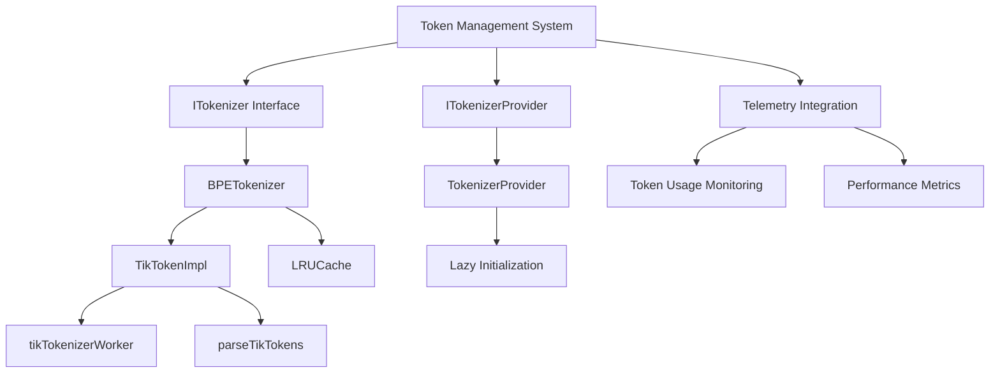
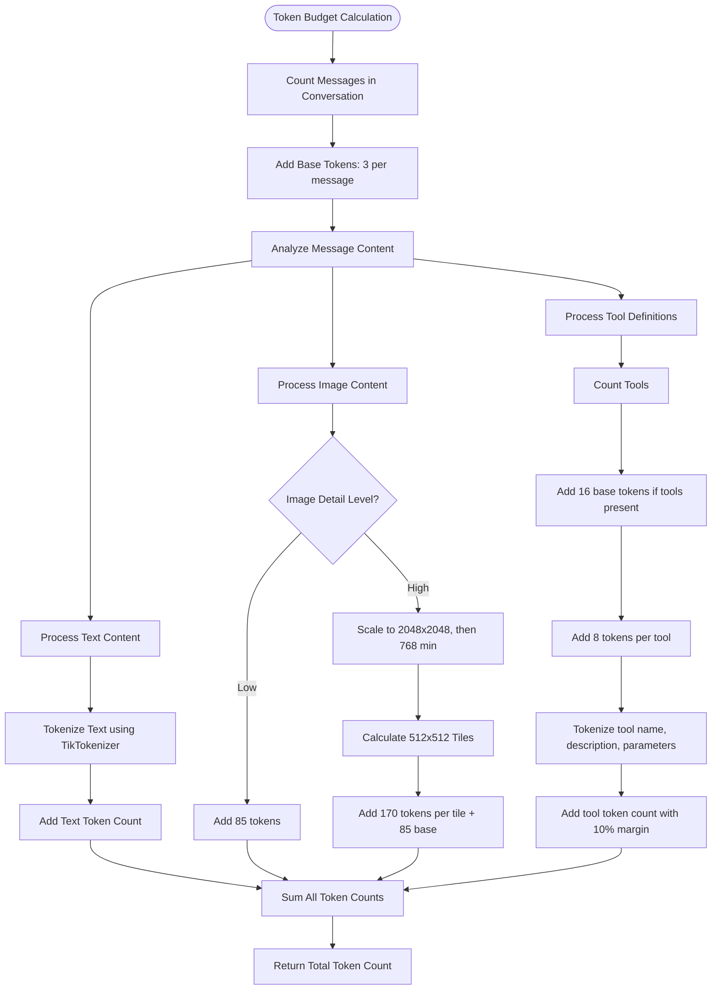
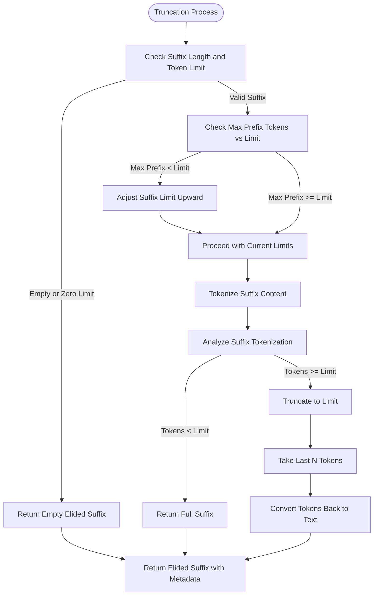
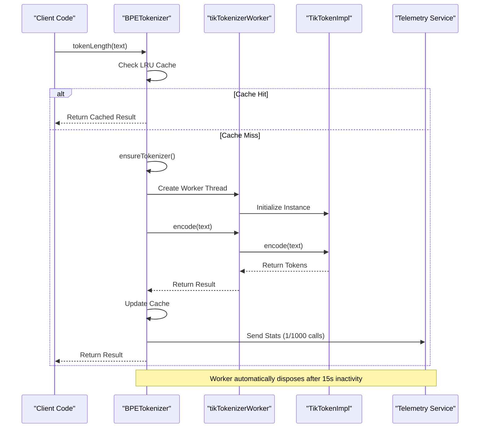
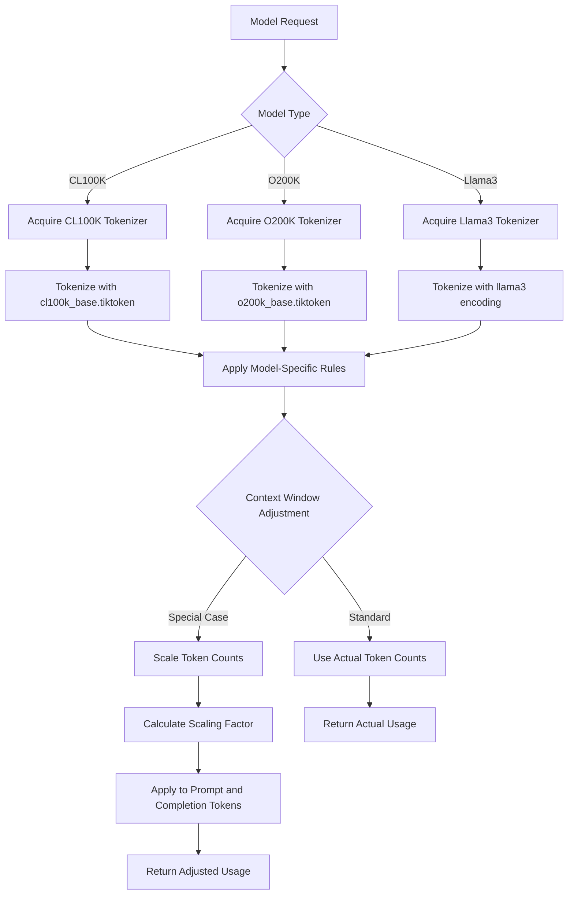
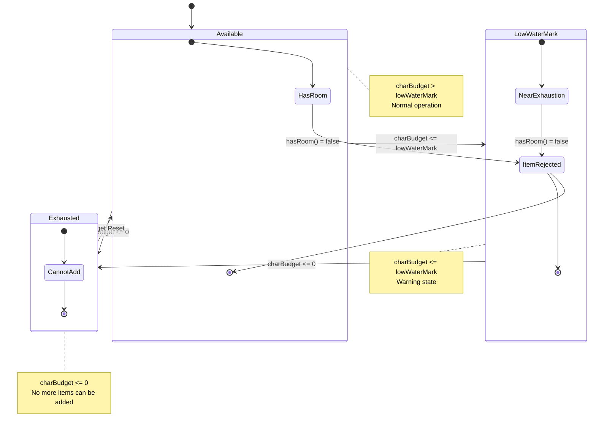

# Token Management

<cite>
**Referenced Files in This Document**   
- [tokenizer.ts](file://src/platform/tokenizer/node/tokenizer.ts)
- [tikTokenizerImpl.ts](file://src/platform/tokenizer/node/tikTokenizerImpl.ts)
- [tikTokenizerWorker.ts](file://src/platform/tokenizer/node/tikTokenizerWorker.ts)
- [parseTikTokens.ts](file://src/platform/tokenizer/node/parseTikTokens.ts)
- [util/common/tokenizer.ts](file://src/util/common/tokenizer.ts)
- [anthropicAdapter.ts](file://src/extension/agents/node/adapters/anthropicAdapter.ts)
- [customOAIModelConfigurator.ts](file://src/extension/byok/vscode-node/customOAIModelConfigurator.ts)
- [cursorContext.ts](file://src/extension/completions-core/vscode-node/prompt/src/snippetInclusion/cursorContext.ts)
- [elision.ts](file://src/extension/completions-core/vscode-node/lib/src/prompt/components/elision.ts)
- [contextProvider.ts](file://src/extension/typescriptContext/serverPlugin/src/common/contextProvider.ts)
- [telemetry.ts](file://src/extension/completions-core/vscode-node/lib/src/telemetry.ts)
- [telemetryData.ts](file://src/platform/telemetry/common/telemetryData.ts)
</cite>

## Table of Contents
1. [Introduction](#introduction)
2. [Tokenization System Architecture](#tokenization-system-architecture)
3. [Core Tokenization Implementation](#core-tokenization-implementation)
4. [Token Budgeting Strategy](#token-budgeting-strategy)
5. [Context Truncation Algorithms](#context-truncation-algorithms)
6. [Telemetry and Performance Optimization](#telemetry-and-performance-optimization)
7. [Multi-Model Context Window Management](#multi-model-context-window-management)
8. [Trade-offs Between Context Completeness and Response Quality](#trade-offs-between-context-completeness-and-response-quality)
9. [Conclusion](#conclusion)

## Introduction
The token management system in vscode-copilot-chat is a sophisticated framework designed to efficiently handle the tokenization, budgeting, and truncation of prompts for AI model interactions. This documentation provides a comprehensive analysis of how the system calculates token counts using the tokenizer and tikTokenizerImpl components, implements token budgeting strategies that reserve tokens for both prompt context and AI model responses, and applies intelligent truncation algorithms to prioritize important context when content exceeds token limits. The system also incorporates telemetry collection for monitoring token usage patterns and performance optimization, while accommodating different AI models with varying context window sizes through dynamic token management.

**Section sources**
- [tokenizer.ts](file://src/platform/tokenizer/node/tokenizer.ts#L1-L359)
- [util/common/tokenizer.ts](file://src/util/common/tokenizer.ts#L1-L30)

## Tokenization System Architecture
The token management system in vscode-copilot-chat is built around a modular architecture that separates concerns between tokenization, budgeting, truncation, and telemetry. At its core, the system implements the ITokenizer interface which defines the contract for token counting operations across different model types. The architecture employs a provider pattern through the ITokenizerProvider interface, allowing for the acquisition of appropriate tokenizer instances based on the target model's requirements.

The system is designed with performance optimization in mind, incorporating caching mechanisms and worker thread isolation to prevent UI thread blocking during intensive tokenization operations. The architecture supports multiple tokenizer types through the TokenizerType enum, currently including CL100K, O200K, and Llama3 encodings, enabling compatibility with various AI models that have different tokenization schemes.



**Diagram sources**
- [tokenizer.ts](file://src/platform/tokenizer/node/tokenizer.ts#L1-L359)
- [util/common/tokenizer.ts](file://src/util/common/tokenizer.ts#L1-L30)

**Section sources**
- [tokenizer.ts](file://src/platform/tokenizer/node/tokenizer.ts#L1-L359)
- [util/common/tokenizer.ts](file://src/util/common/tokenizer.ts#L1-L30)

## Core Tokenization Implementation
The core tokenization implementation in vscode-copilot-chat is centered around the TikTokenImpl class, which serves as the primary interface to the underlying tokenization engine. This implementation leverages the @microsoft/tiktokenizer library to provide accurate token counting for various text inputs. The TikTokenImpl class maintains a singleton pattern through its static instance property, ensuring efficient resource utilization across the application.

The tokenization process begins with the initialization of tokenizer instances through the init method, which loads token dictionaries from file and configures the tokenizer with appropriate special tokens and regex patterns based on the encoder type. For production builds, the system uses compressed binary token dictionaries loaded through the parseTikTokenBinary function, which implements a variable-length quantity encoding scheme for efficient storage and retrieval.

```mermaid
classDiagram
class TikTokenImpl {
-static _instance : TikTokenImpl
-_values : (TikTokenizer | undefined)[]
-_stats : {encodeDuration : MovingAverage, textLength : MovingAverage, callCount : number}
+static get instance() : TikTokenImpl
+init(tokenFilePath : string, encoderName : string, useBinaryTokens : boolean) : number
+encode(handle : number, text : string, allowedSpecial? : readonly string[]) : number[]
+destroy(handle : number)
+resetStats() : {callCount : number, encodeDuration : number, textLength : number}
}
class BPETokenizer {
-_tokenizer : Promise<TikTokenWorker>
-_cache : LRUCache<number>
-baseTokensPerMessage : number
-baseTokensPerName : number
+mode : OutputMode.Raw
+countMessagesTokens(messages : Raw.ChatMessage[]) : Promise<number>
+tokenLength(text : string | Raw.ChatCompletionContentPart) : Promise<number>
+countMessageTokens(message : Raw.ChatMessage) : Promise<number>
+countToolTokens(tools : LanguageModelChatTool[]) : Promise<number>
+ensureTokenizer() : Promise<TikTokenWorker>
+doInitTokenizer() : Promise<TikTokenWorker>
}
class ITokenizer {
<<interface>>
+tokenLength(text : string | Raw.ChatCompletionContentPart) : Promise<number>
+countMessageTokens(message : Raw.ChatMessage) : Promise<number>
+countMessagesTokens(messages : Raw.ChatMessage[]) : Promise<number>
+countToolTokens(tools : readonly LanguageModelChatTool[]) : Promise<number>
}
BPETokenizer --> ITokenizer : "implements"
BPETokenizer --> TikTokenImpl : "uses"
BPETokenizer --> LRUCache : "uses"
```

**Diagram sources**
- [tikTokenizerImpl.ts](file://src/platform/tokenizer/node/tikTokenizerImpl.ts#L1-L75)
- [tokenizer.ts](file://src/platform/tokenizer/node/tokenizer.ts#L1-L359)

**Section sources**
- [tikTokenizerImpl.ts](file://src/platform/tokenizer/node/tikTokenizerImpl.ts#L1-L75)
- [tokenizer.ts](file://src/platform/tokenizer/node/tokenizer.ts#L1-L359)
- [parseTikTokens.ts](file://src/platform/tokenizer/node/parseTikTokens.ts#L1-L24)

## Token Budgeting Strategy
The token budgeting strategy in vscode-copilot-chat implements a comprehensive approach to managing token allocation between prompt context and AI model responses. The system reserves a base allocation of 3 tokens for each completion request (BaseTokensPerCompletion) to account for the special tokens and role name required in the response priming. Additionally, each message in the conversation history consumes 3 base tokens (BaseTokensPerMessage), with an additional token allocated for any named messages (BaseTokensPerName).

The budgeting system incorporates specialized handling for different content types, including text, images, and tool definitions. For image content, the system calculates token costs based on the image dimensions and detail level, following OpenAI's vision API guidelines. Low-detail images are assigned a fixed cost of 85 tokens, while high-detail images are processed through a scaling algorithm that divides the image into 512x512 tiles, with each tile costing 170 tokens plus an additional 85 tokens for the overall image.



**Diagram sources**
- [tokenizer.ts](file://src/platform/tokenizer/node/tokenizer.ts#L37-L45)
- [tokenizer.ts](file://src/platform/tokenizer/node/tokenizer.ts#L334-L356)

**Section sources**
- [tokenizer.ts](file://src/platform/tokenizer/node/tokenizer.ts#L37-L359)

## Context Truncation Algorithms
The context truncation algorithms in vscode-copilot-chat employ a sophisticated prioritization strategy to preserve the most important context when token limits are exceeded. The system implements both prefix and suffix elision strategies, with special handling for the current selection and conversation turns. The truncation process begins by identifying elidable blocks of content and calculating the maximum prefix tokens that can be preserved.

For suffix handling, the algorithm adapts the original implementation with several key modifications: when the token limit is less than the edit distance, the system returns the first tokens of the new suffix rather than throwing an error; when using cached suffixes, the system enforces the token limit; and remaining tokens are returned to the caller for handling rather than modifying limits in place. This approach ensures graceful degradation of context quality while maintaining system stability.



**Diagram sources**
- [elision.ts](file://src/extension/completions-core/vscode-node/lib/src/prompt/components/elision.ts#L137-L173)

**Section sources**
- [elision.ts](file://src/extension/completions-core/vscode-node/lib/src/prompt/components/elision.ts#L137-L173)
- [cursorContext.ts](file://src/extension/completions-core/vscode-node/prompt/src/snippetInclusion/cursorContext.ts#L38-L70)

## Telemetry and Performance Optimization
The token management system incorporates comprehensive telemetry collection to monitor token usage patterns and optimize performance. The system collects detailed metrics on tokenization operations, including call count, encode duration, and text length averages, which are reported through the telemetry service. These metrics are sampled at a rate of 1/1000 calls to minimize performance impact while still providing valuable insights into system behavior.

Performance optimization is achieved through multiple mechanisms: an LRU cache with 5000 entries for string-to-token-length lookups, worker thread isolation for CPU-intensive operations, and lazy initialization of tokenizer instances. The worker thread implementation uses a proxy pattern with message passing to execute tokenization in a separate thread, preventing UI thread blocking. A timeout mechanism automatically disposes of worker resources after 15 seconds of inactivity, ensuring efficient resource management.



**Diagram sources**
- [tokenizer.ts](file://src/platform/tokenizer/node/tokenizer.ts#L264-L327)
- [tikTokenizerWorker.ts](file://src/platform/tokenizer/node/tikTokenizerWorker.ts#L1-L25)

**Section sources**
- [tokenizer.ts](file://src/platform/tokenizer/node/tokenizer.ts#L309-L321)
- [telemetry.ts](file://src/extension/completions-core/vscode-node/lib/src/telemetry.ts#L72-L270)
- [telemetryData.ts](file://src/platform/telemetry/common/telemetryData.ts#L34-L63)

## Multi-Model Context Window Management
The token management system accommodates different AI models with varying context window sizes through a dynamic token management approach. The system uses the TokenizerType enum to identify the appropriate tokenizer for each model family, with current support for CL100K, O200K, and Llama3 encodings. The TokenizerProvider class implements lazy initialization of tokenizer instances, creating them only when needed and reusing them across requests.

For models with different context window assumptions, the system implements token usage adjustment algorithms. In the anthropicAdapter, for example, the adjustTokenUsageForContextWindow method scales token counts to make the agent believe it has a larger context window (200k tokens) than the actual limit. This is achieved through a scaling factor calculated as the ratio of the assumed context limit to the real context limit, applied to both prompt and completion tokens.



**Diagram sources**
- [tokenizer.ts](file://src/platform/tokenizer/node/tokenizer.ts#L48-L84)
- [anthropicAdapter.ts](file://src/extension/agents/node/adapters/anthropicAdapter.ts#L227-L259)

**Section sources**
- [tokenizer.ts](file://src/platform/tokenizer/node/tokenizer.ts#L48-L84)
- [anthropicAdapter.ts](file://src/extension/agents/node/adapters/anthropicAdapter.ts#L227-L259)
- [customOAIModelConfigurator.ts](file://src/extension/byok/vscode-node/customOAIModelConfigurator.ts#L535-L568)

## Trade-offs Between Context Completeness and Response Quality
The token management system in vscode-copilot-chat navigates complex trade-offs between context completeness and response quality. The system implements a character budget class that tracks available resources and determines when to reject additional context items. This budget includes a low water mark (default 256 characters) that prevents complete exhaustion, ensuring some capacity remains for essential operations.

When the token budget is exhausted, the system throws a TokenBudgetExhaustedError, signaling that no further context can be added. The budget tracking includes mechanisms to detect when items have been rejected, allowing higher-level components to make informed decisions about context prioritization. The system balances the need for comprehensive context with the requirement for high-quality responses by reserving tokens for the AI model's output, ensuring that even with extensive context, the model has sufficient capacity to generate meaningful responses.



**Diagram sources**
- [contextProvider.ts](file://src/extension/typescriptContext/serverPlugin/src/common/contextProvider.ts#L1231-L1273)

**Section sources**
- [contextProvider.ts](file://src/extension/typescriptContext/serverPlugin/src/common/contextProvider.ts#L1225-L1273)

## Conclusion
The token management system in vscode-copilot-chat represents a sophisticated and well-architected solution for handling the complex requirements of AI-powered code assistance. By implementing a modular tokenization framework with support for multiple encoding schemes, the system ensures compatibility with various AI models while maintaining high performance through caching and worker thread isolation. The comprehensive token budgeting strategy carefully balances the allocation of tokens between prompt context and model responses, preserving the quality of AI interactions even with extensive context.

The intelligent truncation algorithms prioritize important context such as current selections and recent conversation turns, ensuring that the most relevant information is preserved when token limits are exceeded. Integrated telemetry collection provides valuable insights into token usage patterns and performance characteristics, enabling continuous optimization of the system. The dynamic management of different context window sizes across AI models demonstrates the system's flexibility and adaptability to evolving AI capabilities.

This comprehensive approach to token management enables vscode-copilot-chat to deliver high-quality AI assistance while efficiently managing computational resources and providing a responsive user experience.