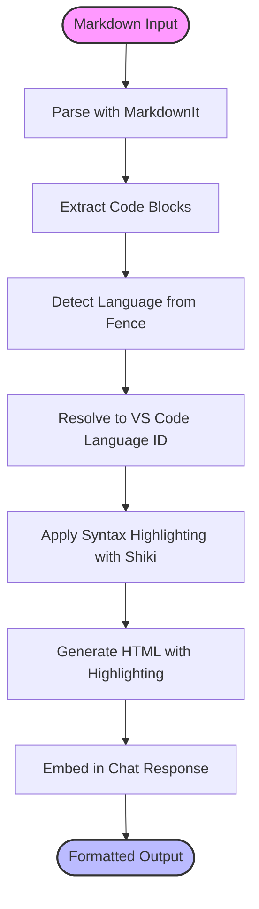

# Output Formatting

<cite>
**Referenced Files in This Document**   
- [codeBlockProcessor.ts](file://src/extension/codeBlocks/node/codeBlockProcessor.ts)
- [modelFilePathLinkifier.ts](file://src/extension/linkify/common/modelFilePathLinkifier.ts)
- [markdown.ts](file://src/util/common/markdown.ts)
- [chatResponseStreamImpl.ts](file://src/util/common/chatResponseStreamImpl.ts)
- [languages.ts](file://src/util/common/languages.ts)
- [highlighter.ts](file://src/extension/completions-core/vscode-node/extension/src/panelShared/highlighter.ts)
</cite>

## Table of Contents
1. [Introduction](#introduction)
2. [Core Components](#core-components)
3. [Code Block Processing](#code-block-processing)
4. [Linkification System](#linkification-system)
5. [Markdown Rendering and Syntax Highlighting](#markdown-rendering-and-syntax-highlighting)
6. [Streaming Output Formatting](#streaming-output-formatting)
7. [Content Type Formatting Rules](#content-type-formatting-rules)
8. [Customization Options](#customization-options)
9. [Example Formatted Outputs](#example-formatted-outputs)
10. [Conclusion](#conclusion)

## Introduction
The output formatting system in vscode-copilot-chat transforms parsed response data into rich UI elements that enhance user interaction and comprehension. This system handles the conversion of plain text responses into formatted content with code blocks, markdown rendering, and interactive components. It implements a sophisticated linkification process that converts file paths, symbols, and URLs into clickable references, enabling seamless navigation within the development environment. The formatting rules are designed to handle various content types including code, documentation, and error messages, with appropriate syntax highlighting applied based on language detection. The system supports progressive rendering of content as it arrives through streaming output formatting, providing immediate feedback to users during response generation. This documentation provides a comprehensive overview of the architecture, implementation, and capabilities of this output formatting system.

## Core Components
The output formatting system in vscode-copilot-chat consists of several interconnected components that work together to transform raw response data into rich, interactive UI elements. The system is built around a streaming architecture that processes content as it arrives from the language model, enabling progressive rendering in the chat interface. Key components include the CodeBlockProcessor which identifies and processes code blocks in markdown content, the linkification system that converts file paths and symbols into clickable references, and the syntax highlighting engine that applies appropriate styling to code blocks based on detected language. The system also includes utilities for handling different content types and formatting rules, ensuring consistent presentation across various response types. These components work in concert to provide a seamless user experience with properly formatted content that maintains the integrity of the original response while enhancing readability and interactivity.

**Section sources**
- [codeBlockProcessor.ts](file://src/extension/codeBlocks/node/codeBlockProcessor.ts#L1-L378)
- [modelFilePathLinkifier.ts](file://src/extension/linkify/common/modelFilePathLinkifier.ts#L1-L266)
- [highlighter.ts](file://src/extension/completions-core/vscode-node/extension/src/panelShared/highlighter.ts#L1-L118)

## Code Block Processing
The code block processing system in vscode-copilot-chat is responsible for identifying, extracting, and handling code blocks within markdown responses. The CodeBlockProcessor class implements a state machine that tracks the parsing context as it processes markdown text line by line, detecting the opening and closing of code blocks using fence patterns (triple backticks or tildes). When a code block is detected, the processor extracts the language identifier from the opening fence and processes any file path information that may be included in the first line of the code block. The system maintains separate buffers for content before and within code blocks, allowing it to properly handle nested code blocks and preserve the structure of the original content. For code blocks that include file paths, the processor resolves these paths to URI references using the IPromptPathRepresentationService, enabling the system to associate code blocks with specific files in the workspace. The processor also handles vulnerabilities information that may be associated with code blocks, passing this information along with the formatted content to ensure security concerns are properly communicated to users.

```mermaid
classDiagram
class CodeBlockProcessor {
+_lastIncompleteLine : MarkdownString
+_currentBlock : {info, fence, firstLine}
+_code : string[]
+_markdownBeforeBlock : string[]
+_nestingLevel : number
+_index : number
+_state : State
+processMarkdown(markdown : string | MarkdownString, vulnerabilities? : ChatVulnerability[]) : void
+processCodeblockUri(uri : Uri) : void
+flush() : void
}
class CodeBlockTrackingChatResponseStream {
+_codeBlockProcessor : CodeBlockProcessor
+_codeBlocks : CodeBlock[]
+markdown(value : string | MarkdownString) : void
+markdownWithVulnerabilities(value : string | MarkdownString, vulnerabilities : ChatVulnerability[]) : void
+codeblockUri(uri : Uri) : void
+push(part : ChatResponsePart) : void
+finish() : CodeBlocksMetadata
}
CodeBlockTrackingChatResponseStream --> CodeBlockProcessor : "uses"
CodeBlockProcessor --> CodeBlock : "emits"
```

**Diagram sources **
- [codeBlockProcessor.ts](file://src/extension/codeBlocks/node/codeBlockProcessor.ts#L128-L378)

**Section sources**
- [codeBlockProcessor.ts](file://src/extension/codeBlocks/node/codeBlockProcessor.ts#L1-L378)

## Linkification System
The linkification system in vscode-copilot-chat converts file paths, symbols, and URLs into clickable references that enhance navigation and interaction within the chat interface. The system is implemented through the ModelFilePathLinkifier class, which uses regular expressions to identify markdown links that contain file paths in their text or target portions. When a potential file path link is detected, the system normalizes the path by converting backslashes to forward slashes and decoding any URL-encoded characters. It then attempts to resolve the path to a URI by checking against workspace folders, supporting both absolute and relative paths. For links that include line anchors (e.g., #L10-15), the system parses these anchors to create location references that can navigate directly to specific lines in files. The linkification process also handles symbolic links by creating LinkifySymbolAnchor objects that reference symbols in specific files, enabling navigation to symbol definitions. The system supports files with spaces in their names by properly handling URL-encoded spaces in the link targets. This comprehensive linkification approach ensures that users can easily navigate to referenced files and locations directly from the chat responses.


**Diagram sources **
- [modelFilePathLinkifier.ts](file://src/extension/linkify/common/modelFilePathLinkifier.ts#L1-L266)

**Section sources**
- [modelFilePathLinkifier.ts](file://src/extension/linkify/common/modelFilePathLinkifier.ts#L1-L266)

## Markdown Rendering and Syntax Highlighting
The markdown rendering and syntax highlighting system in vscode-copilot-chat transforms plain text responses into richly formatted content with proper syntax highlighting for code blocks. The system uses the MarkdownIt library to parse markdown content and extract code blocks, which are then processed separately to apply syntax highlighting. For code block language identification, the system maintains a comprehensive mapping between markdown language identifiers and VS Code language IDs in the languages.ts file, supporting a wide range of programming languages and their various aliases. The syntax highlighting is implemented using the Shiki library, which provides high-quality syntax highlighting with support for multiple themes that match the user's current VS Code theme. The highlighter system automatically detects the user's current color theme and applies the appropriate syntax highlighting theme, ensuring consistency with the overall editor appearance. For languages not natively supported by Shiki, the system can load additional language grammars dynamically. The rendering process preserves the original code content while adding HTML markup for syntax highlighting, which is then embedded in the chat response as HTML content.



**Diagram sources **
- [highlighter.ts](file://src/extension/completions-core/vscode-node/extension/src/panelShared/highlighter.ts#L1-L118)
- [languages.ts](file://src/util/common/languages.ts#L1-L941)

**Section sources**
- [highlighter.ts](file://src/extension/completions-core/vscode-node/extension/src/panelShared/highlighter.ts#L1-L118)
- [languages.ts](file://src/util/common/languages.ts#L1-L941)

## Streaming Output Formatting
The streaming output formatting system in vscode-copilot-chat enables progressive rendering of responses as they are generated by the language model. This system is built around the ChatResponseStream interface, which allows content to be pushed incrementally to the chat interface rather than waiting for the complete response. The CodeBlockTrackingChatResponseStream class acts as a wrapper around the base response stream, intercepting markdown content and processing it for code blocks and file paths before forwarding it to the underlying stream. As each portion of the response arrives, the system processes it immediately, extracting code blocks and resolving file paths in real-time. This approach provides immediate feedback to users, with content appearing in the chat interface as soon as it is available. The streaming system also handles special content types like thinking progress indicators, which are displayed as the model is generating the response. For code blocks that include file paths, the system resolves these paths to URIs as they are encountered, enabling early detection of file references even before the complete response is received. This streaming architecture ensures a responsive user experience while maintaining the integrity of the formatting and linkification processes.


**Diagram sources **
- [codeBlockProcessor.ts](file://src/extension/codeBlocks/node/codeBlockProcessor.ts#L1-L378)
- [chatResponseStreamImpl.ts](file://src/util/common/chatResponseStreamImpl.ts#L1-L174)

**Section sources**
- [codeBlockProcessor.ts](file://src/extension/codeBlocks/node/codeBlockProcessor.ts#L1-L378)
- [chatResponseStreamImpl.ts](file://src/util/common/chatResponseStreamImpl.ts#L1-L174)

## Content Type Formatting Rules
The output formatting system in vscode-copilot-chat applies specific rules for different content types to ensure appropriate presentation and functionality. For code content, the system identifies code blocks using markdown fence syntax and applies syntax highlighting based on the specified or detected language. Code blocks may include file paths in comments on the first line, which are extracted and resolved to URIs for navigation purposes. Documentation content is rendered with standard markdown formatting, including headings, lists, and emphasis, while preserving the structure and readability of the original content. Error messages and warnings are formatted with specific styling to draw attention to critical information, often using warning or error icons and distinct colors. The system also handles special content types like file trees, which are presented in a hierarchical format with appropriate indentation and icons. For responses that include multiple code blocks or file references, the system maintains the relative positioning and context of each element, ensuring that the overall structure of the response is preserved. The formatting rules are designed to balance visual clarity with functional utility, providing users with both readable content and interactive elements that enhance productivity.

**Section sources**
- [codeBlockProcessor.ts](file://src/extension/codeBlocks/node/codeBlockProcessor.ts#L1-L378)
- [markdown.ts](file://src/util/common/markdown.ts#L1-L165)

## Customization Options
The output formatting system in vscode-copilot-chat provides several customization options that allow users to tailor the presentation of responses to their preferences. Users can configure the appearance of code blocks through VS Code's theme settings, with the system automatically adapting to the selected color theme. The linkification behavior can be influenced by workspace configuration, particularly regarding how file paths are resolved and displayed. For users working with specific programming languages, the system supports custom language aliases and extensions through the languages configuration, allowing for more accurate language detection and syntax highlighting. The system also respects VS Code's markdown rendering settings, ensuring consistency with the editor's overall behavior. Additionally, users can control the display of certain interactive elements like buttons and progress indicators through extension settings. The streaming behavior and progressive rendering cannot be disabled, as it is fundamental to the responsiveness of the chat interface, but users can observe the incremental nature of content arrival as a feature rather than a limitation. These customization options provide flexibility while maintaining the core functionality and usability of the output formatting system.

**Section sources**
- [highlighter.ts](file://src/extension/completions-core/vscode-node/extension/src/panelShared/highlighter.ts#L1-L118)
- [languages.ts](file://src/util/common/languages.ts#L1-L941)

## Example Formatted Outputs
The output formatting system produces various types of formatted content depending on the response type and content. For code generation responses, the system renders code blocks with syntax highlighting and may include file path references that are converted to clickable links. Documentation responses are presented with proper markdown formatting, including headings, lists, and code snippets. Error messages and warnings are displayed with distinctive styling to highlight important information. When the response includes multiple file references, these are presented as a list of clickable links with appropriate context. Code explanations include both the original code and explanatory text, with the code properly highlighted and the explanation formatted for readability. The system also handles complex responses that combine multiple content types, such as a solution that includes code changes, documentation updates, and configuration modifications, presenting each component in an organized and visually distinct manner. These examples demonstrate the system's ability to transform raw text responses into rich, interactive content that enhances user understanding and facilitates action.

**Section sources**
- [codeBlockProcessor.ts](file://src/extension/codeBlocks/node/codeBlockProcessor.ts#L1-L378)
- [modelFilePathLinkifier.ts](file://src/extension/linkify/common/modelFilePathLinkifier.ts#L1-L266)

## Conclusion
The output formatting system in vscode-copilot-chat provides a comprehensive solution for transforming raw language model responses into rich, interactive UI elements. By combining code block processing, linkification, markdown rendering, and syntax highlighting, the system creates a seamless user experience that enhances both readability and functionality. The streaming architecture enables progressive rendering of content, providing immediate feedback during response generation. The system's modular design allows for independent evolution of its components while maintaining overall coherence. Through its sophisticated handling of different content types and support for customization, the output formatting system effectively bridges the gap between natural language responses and actionable development tasks. This documentation provides a detailed understanding of the system's architecture and capabilities, serving as a valuable resource for both users and developers working with vscode-copilot-chat.