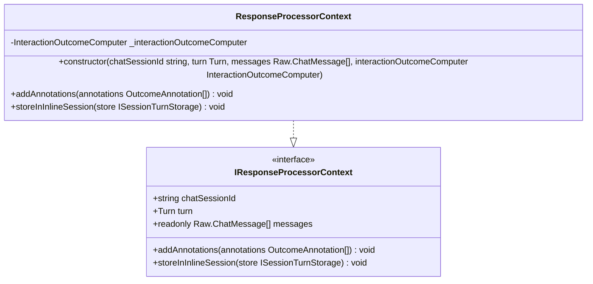
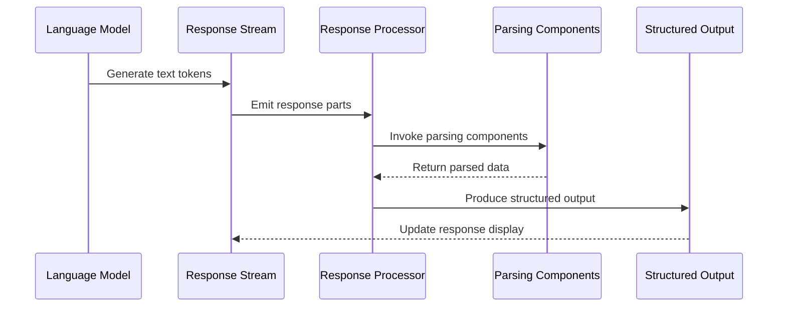
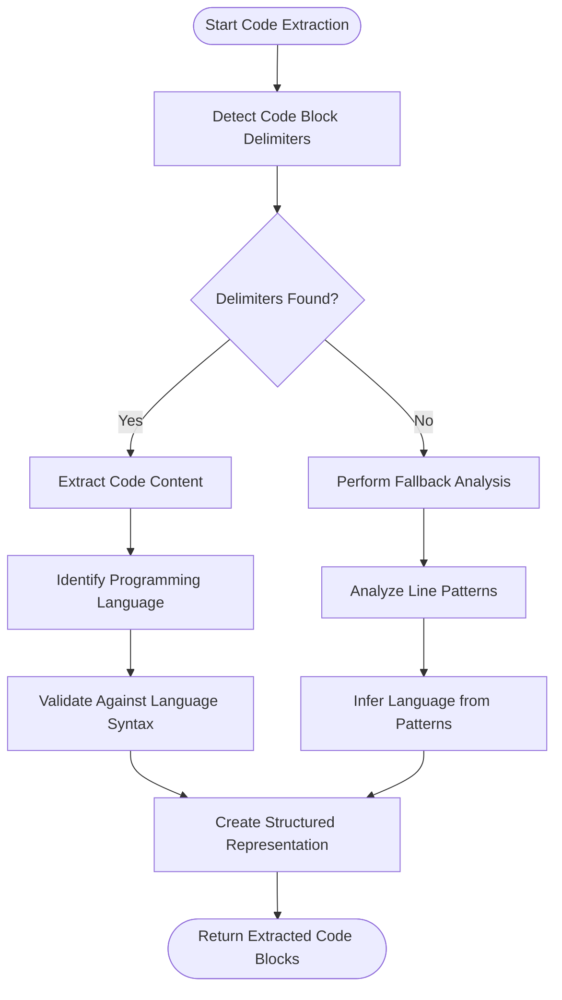
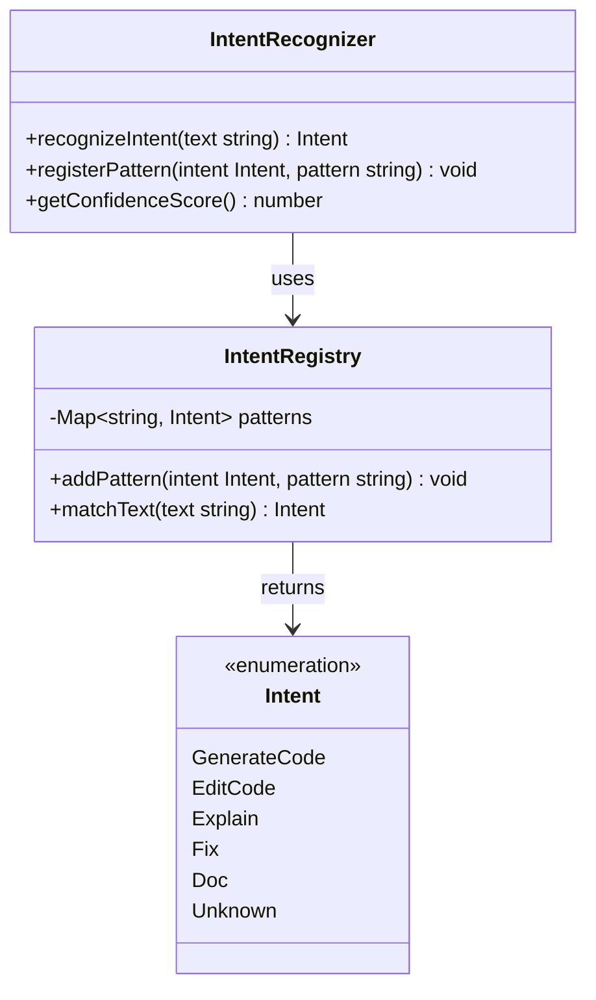
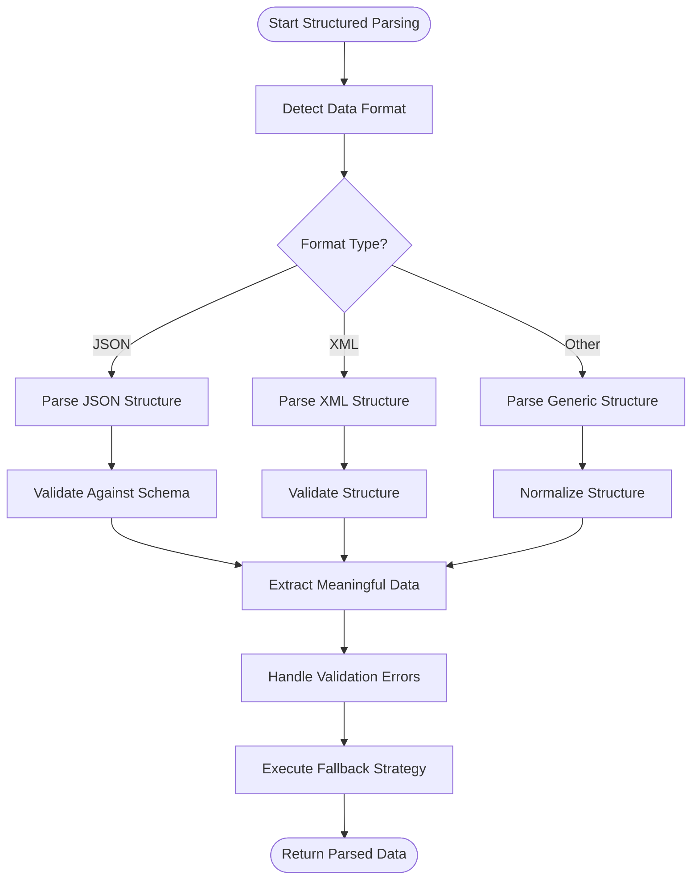
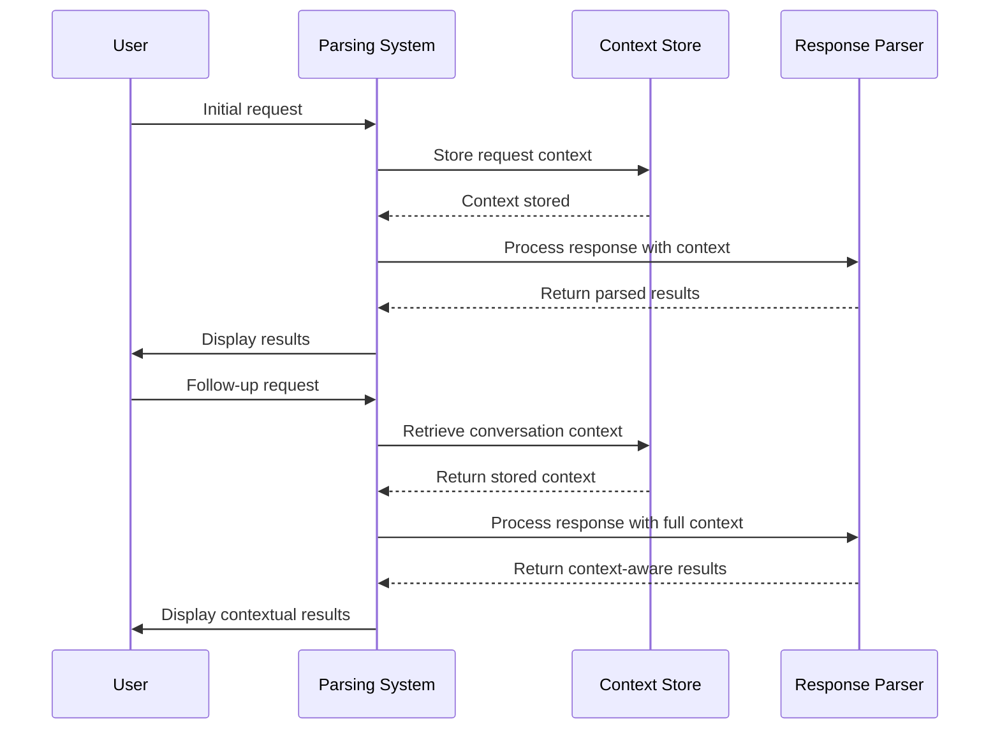
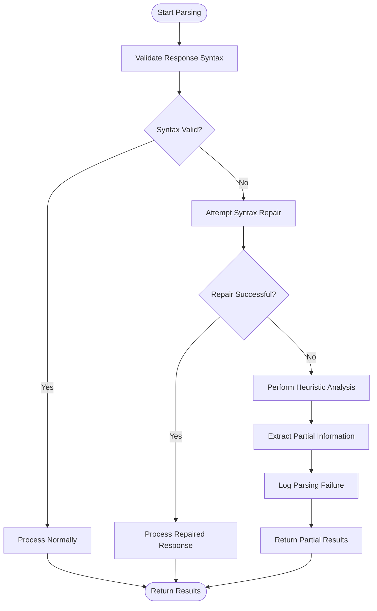

# Response Parsing

<cite>
**Referenced Files in This Document**   
- [responseProcessorContext.ts](file://src/extension/prompt/node/responseProcessorContext.ts)
- [intents.ts](file://src/extension/prompt/node/intents.ts)
- [toolCallingLoop.ts](file://src/extension/intents/node/toolCallingLoop.ts)
- [responseProcessor.ts](file://src/platform/inlineEdits/common/responseProcessor.ts)
- [responses.ts](file://src/platform/chat/common/responses.ts)
- [parserServiceImpl.ts](file://src/platform/parser/node/parserServiceImpl.ts)
- [parserImpl.ts](file://src/platform/parser/node/parserImpl.ts)
- [responseStreamWithLinkification.ts](file://src/extension/linkify/common/responseStreamWithLinkification.ts)
</cite>

## Table of Contents
1. [Introduction](#introduction)
2. [Response Processing Context](#response-processing-context)
3. [Parsing Pipeline Architecture](#parsing-pipeline-architecture)
4. [Code Block Extraction](#code-block-extraction)
5. [Semantic Intent Recognition](#semantic-intent-recognition)
6. [Structured Data Parsing](#structured-data-parsing)
7. [Context-Aware Parsing](#context-aware-parsing)
8. [Error Recovery and Fallback Mechanisms](#error-recovery-and-fallback-mechanisms)
9. [Performance Considerations](#performance-considerations)
10. [Conclusion](#conclusion)

## Introduction

The response parsing mechanism in vscode-copilot-chat is responsible for extracting structured data from unstructured AI model responses. This system processes raw text output from language models and identifies code blocks, tool calls, and semantic intents to enable intelligent code assistance. The parsing pipeline operates within a context-aware framework that maintains conversation state across multiple turns, allowing for sophisticated analysis of AI-generated content in various formats including JSON, XML, and markdown code blocks.

The system employs a multi-stage parsing approach that combines pattern recognition, syntax analysis, and semantic understanding to accurately extract meaningful information from model responses. When primary parsing methods fail, the system implements robust error recovery strategies and fallback mechanisms to ensure reliable operation even with malformed or ambiguous responses.

**Section sources**
- [responseProcessorContext.ts](file://src/extension/prompt/node/responseProcessorContext.ts#L1-L27)
- [intents.ts](file://src/extension/prompt/node/intents.ts#L214-L253)

## Response Processing Context

The response processing context provides the foundation for parsing AI model responses by maintaining essential information about the current conversation state. The `ResponseProcessorContext` class implements the `IResponseProcessorContext` interface, which defines the contract for accessing conversation metadata during the parsing process.

This context includes the chat session identifier, the current turn in the conversation, and the complete message history that was sent to the language model. These elements enable context-aware parsing that can reference previous interactions and maintain continuity across multiple response cycles. The context also provides methods for recording annotations and storing information in the inline chat session, which supports tracking of parsing outcomes and intermediate results.

The context is instantiated with a reference to the `InteractionOutcomeComputer`, which handles the recording of annotations and session storage operations. This separation of concerns allows the parsing logic to focus on content extraction while delegating outcome tracking to a specialized component.



**Diagram sources**
- [responseProcessorContext.ts](file://src/extension/prompt/node/responseProcessorContext.ts#L11-L27)
- [intents.ts](file://src/extension/prompt/node/intents.ts#L227-L253)

**Section sources**
- [responseProcessorContext.ts](file://src/extension/prompt/node/responseProcessorContext.ts#L1-L27)
- [intents.ts](file://src/extension/prompt/node/intents.ts#L227-L253)

## Parsing Pipeline Architecture

The parsing pipeline in vscode-copilot-chat follows a modular architecture that processes AI responses through multiple specialized components. The pipeline begins with raw text streaming from the language model and progresses through stages of tokenization, pattern recognition, and semantic analysis.

At the core of the architecture is the `IResponseProcessor` interface, which defines the contract for processing response streams. Implementations of this interface receive an asynchronous iterable of response parts and transform them into structured outputs. The pipeline supports both real-time streaming processing and batch processing of complete responses, enabling responsive user interfaces and comprehensive analysis.

The architecture employs a decorator pattern for response processors, allowing multiple processing stages to be chained together. Each processor in the chain can modify the response stream, extract structured data, or perform side effects like annotation recording. This design enables flexible composition of parsing functionality while maintaining separation of concerns.



**Diagram sources**
- [toolCallingLoop.ts](file://src/extension/intents/node/toolCallingLoop.ts#L362-L382)
- [responseProcessor.ts](file://src/platform/inlineEdits/common/responseProcessor.ts#L11-L250)

**Section sources**
- [toolCallingLoop.ts](file://src/extension/intents/node/toolCallingLoop.ts#L362-L382)
- [responseProcessor.ts](file://src/platform/inlineEdits/common/responseProcessor.ts#L1-L250)

## Code Block Extraction

The code block extraction system identifies and isolates code segments from AI model responses, enabling proper syntax highlighting and execution. This process analyzes the response text for markdown-style code blocks delimited by triple backticks (```) or other recognized code delimiters.

The extraction mechanism uses pattern matching to identify code block boundaries and capture metadata such as programming language identifiers. For each detected code block, the system creates a structured representation that includes the code content, language type, and positional information within the original response.

When processing code blocks, the system validates the content against the expected language syntax and may employ additional parsing through the Tree-sitter library for detailed syntax analysis. This enables features like code completion, error detection, and refactoring suggestions based on the extracted code.

The extraction process handles nested code blocks and malformed delimiters through heuristic analysis, ensuring robust operation even with imperfectly formatted responses. Fallback strategies include line-by-line analysis for responses that lack proper code block delimiters.



**Diagram sources**
- [responseStreamWithLinkification.ts](file://src/extension/linkify/common/responseStreamWithLinkification.ts)
- [parserServiceImpl.ts](file://src/platform/parser/node/parserServiceImpl.ts#L1-L126)

**Section sources**
- [responseStreamWithLinkification.ts](file://src/extension/linkify/common/responseStreamWithLinkification.ts)
- [parserServiceImpl.ts](file://src/platform/parser/node/parserServiceImpl.ts#L1-L126)

## Semantic Intent Recognition

Semantic intent recognition analyzes AI responses to identify the underlying purpose or action requested by the user. The system classifies responses into categories such as code generation, explanation, refactoring, or debugging based on linguistic patterns and contextual cues.

The recognition process uses a combination of keyword matching, pattern analysis, and machine learning techniques to determine the semantic intent. For example, phrases like "generate a function" or "create a class" trigger code generation intents, while "explain this code" or "what does this do" indicate explanation intents.

The system maintains a registry of known intents and their associated patterns, which can be extended through configuration. Each intent type has specific processing requirements and output formats, guiding the subsequent parsing and execution stages.

Intent recognition operates within the conversation context, considering previous interactions to resolve ambiguities. For instance, a vague request like "fix this" can be interpreted correctly by examining the preceding code selection and conversation history.



**Diagram sources**
- [intents.ts](file://src/extension/prompt/node/intents.ts#L214-L253)
- [toolCallingLoop.ts](file://src/extension/intents/node/toolCallingLoop.ts#L362-L382)

**Section sources**
- [intents.ts](file://src/extension/prompt/node/intents.ts#L214-L253)
- [toolCallingLoop.ts](file://src/extension/intents/node/toolCallingLoop.ts#L362-L382)

## Structured Data Parsing

The structured data parsing system handles responses in formats such as JSON, XML, and other structured representations. This component validates the syntax of structured data and extracts meaningful information according to predefined schemas.

For JSON responses, the parser validates the document structure against expected formats and handles common variations and extensions. The system supports streaming JSON parsing for large responses, enabling incremental processing without requiring complete response buffering.

XML parsing follows similar principles, with additional handling for namespaces, attributes, and mixed content models. The parser normalizes XML structures into a consistent internal representation for downstream processing.

When parsing structured data, the system implements strict error handling to prevent malformed content from disrupting the overall response processing. Validation failures trigger fallback mechanisms that attempt to extract partial information or request reformatted responses from the language model.



**Diagram sources**
- [responses.ts](file://src/platform/chat/common/responses.ts#L1-L21)
- [parserImpl.ts](file://src/platform/parser/node/parserImpl.ts#L1-L773)

**Section sources**
- [responses.ts](file://src/platform/chat/common/responses.ts#L1-L21)
- [parserImpl.ts](file://src/platform/parser/node/parserImpl.ts#L1-L773)

## Context-Aware Parsing

Context-aware parsing maintains conversation state across multiple turns, enabling sophisticated analysis of AI responses based on historical interactions. The system tracks conversation context through the `ResponseProcessorContext`, which preserves information about previous exchanges and user interactions.

This context includes the complete message history, allowing the parser to reference earlier responses when interpreting current content. For example, a follow-up request like "do the same for the other function" can be resolved by examining the previous code modification and applying similar changes to the referenced function.

The context also stores annotations and intermediate results from previous parsing operations, enabling incremental analysis and avoiding redundant processing. This is particularly valuable for multi-turn conversations where the AI response builds upon previous interactions.

Context-aware parsing supports conversation continuity by maintaining state variables that track the conversation's progress, such as the current editing session, selected code regions, and user preferences. This information guides the parsing process and influences how responses are interpreted and executed.



**Diagram sources**
- [responseProcessorContext.ts](file://src/extension/prompt/node/responseProcessorContext.ts#L1-L27)
- [toolCallingLoop.ts](file://src/extension/intents/node/toolCallingLoop.ts#L362-L382)

**Section sources**
- [responseProcessorContext.ts](file://src/extension/prompt/node/responseProcessorContext.ts#L1-L27)
- [toolCallingLoop.ts](file://src/extension/intents/node/toolCallingLoop.ts#L362-L382)

## Error Recovery and Fallback Mechanisms

The error recovery system handles parsing failures and malformed responses through a comprehensive set of fallback mechanisms. When primary parsing methods fail, the system employs alternative strategies to extract meaningful information from AI responses.

The recovery process begins with syntax validation, where the system checks the response against expected formats and structures. For invalid responses, the parser attempts to repair common issues such as missing delimiters, unbalanced brackets, or incomplete code blocks.

If syntax repair fails, the system falls back to heuristic analysis, examining text patterns and linguistic cues to infer the intended structure. This includes line-by-line analysis for code blocks, keyword matching for intents, and statistical analysis for structured data.

The system also implements progressive degradation, where partial information is extracted even when complete parsing fails. For example, if a JSON response is malformed, the parser attempts to extract valid JSON fragments rather than rejecting the entire response.

Error recovery strategies are configurable and can be tailored to specific use cases and reliability requirements. The system logs parsing failures and recovery attempts for monitoring and improvement.



**Diagram sources**
- [responseProcessor.ts](file://src/platform/inlineEdits/common/responseProcessor.ts#L1-L250)
- [parserImpl.ts](file://src/platform/parser/node/parserImpl.ts#L1-L773)

**Section sources**
- [responseProcessor.ts](file://src/platform/inlineEdits/common/responseProcessor.ts#L1-L250)
- [parserImpl.ts](file://src/platform/parser/node/parserImpl.ts#L1-L773)

## Performance Considerations

The response parsing system is designed with performance optimization as a key consideration, ensuring responsive user experiences even with complex responses. The architecture employs several strategies to minimize latency and resource consumption.

Streaming processing enables incremental parsing of responses as they arrive from the language model, reducing perceived latency and enabling progressive rendering of results. This approach avoids the need to buffer complete responses before processing can begin.

The system implements caching for frequently used parsing operations, such as syntax tree construction and pattern matching results. This reduces redundant computation when processing similar responses or revisiting previously analyzed code.

Resource usage is carefully managed through asynchronous operations and worker threads, preventing the main UI thread from being blocked during intensive parsing tasks. The parser service can operate in both local and worker modes, allowing resource-intensive operations to be offloaded when necessary.

Memory efficiency is achieved through careful object lifecycle management and disposal of temporary data structures. The system uses lazy initialization for expensive components and implements proper cleanup to prevent memory leaks.

**Section sources**
- [parserServiceImpl.ts](file://src/platform/parser/node/parserServiceImpl.ts#L1-L126)
- [responseProcessor.ts](file://src/platform/inlineEdits/common/responseProcessor.ts#L1-L250)

## Conclusion

The response parsing mechanism in vscode-copilot-chat provides a robust and flexible system for extracting structured data from unstructured AI model responses. By combining context-aware parsing, sophisticated pattern recognition, and comprehensive error recovery, the system delivers reliable performance across diverse response formats and use cases.

The architecture's modular design enables extensibility and adaptation to new parsing requirements, while its streaming capabilities ensure responsive user experiences. The integration of semantic intent recognition and code analysis enhances the system's ability to understand and act upon AI-generated content effectively.

Future improvements could include enhanced machine learning-based parsing, broader format support, and more sophisticated context modeling to further improve accuracy and reliability. The current implementation provides a solid foundation for intelligent code assistance that can evolve with advancing AI capabilities.