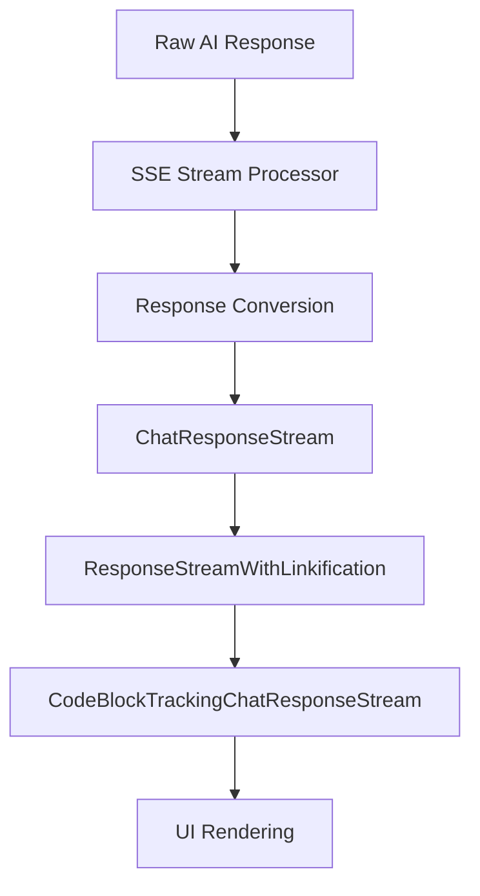
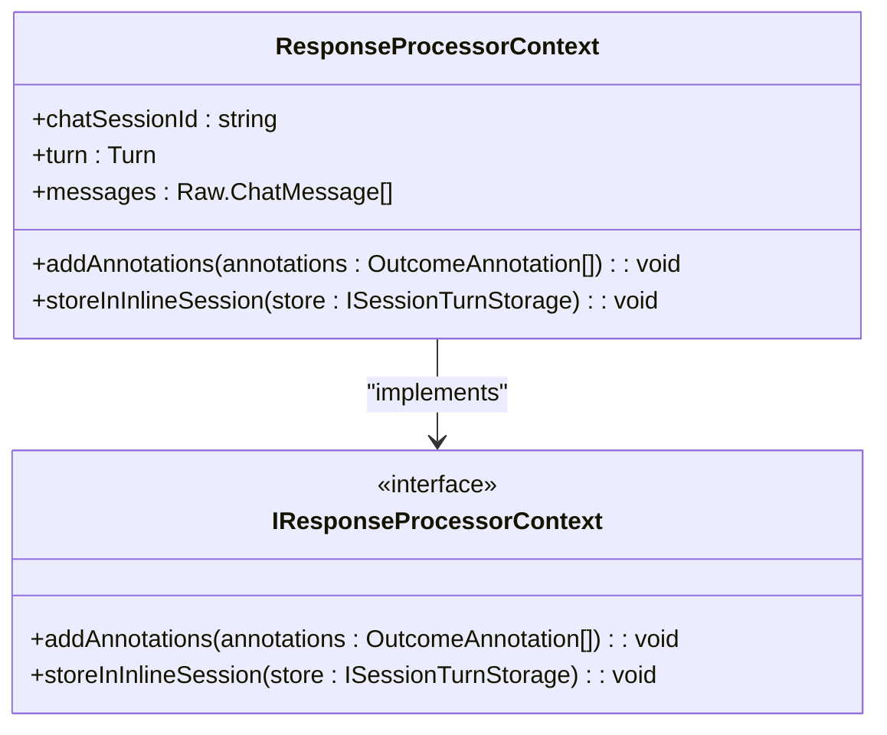
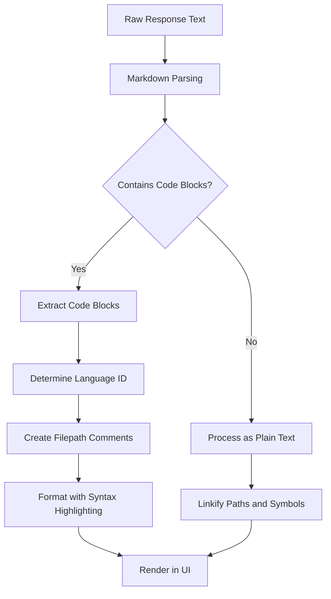
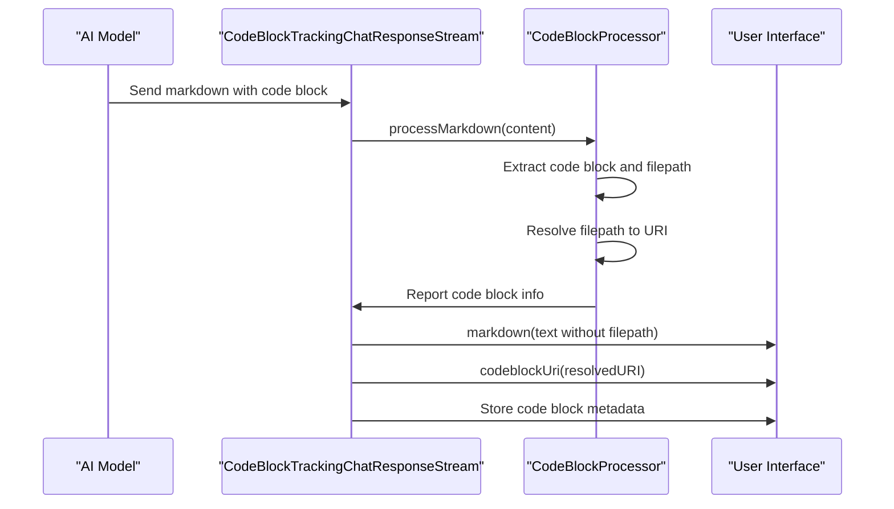
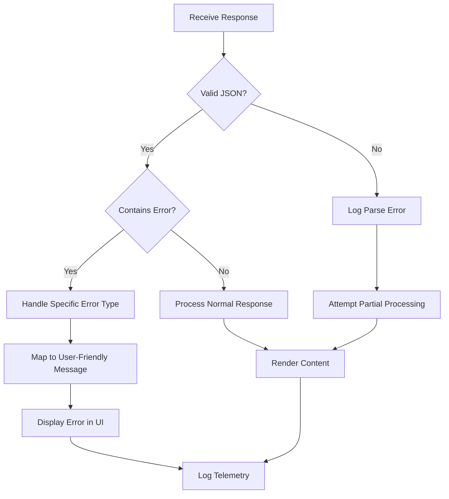
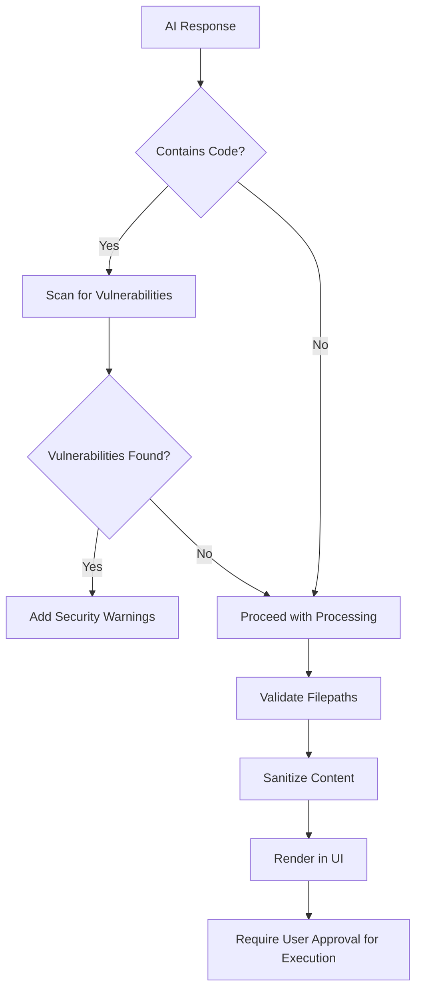
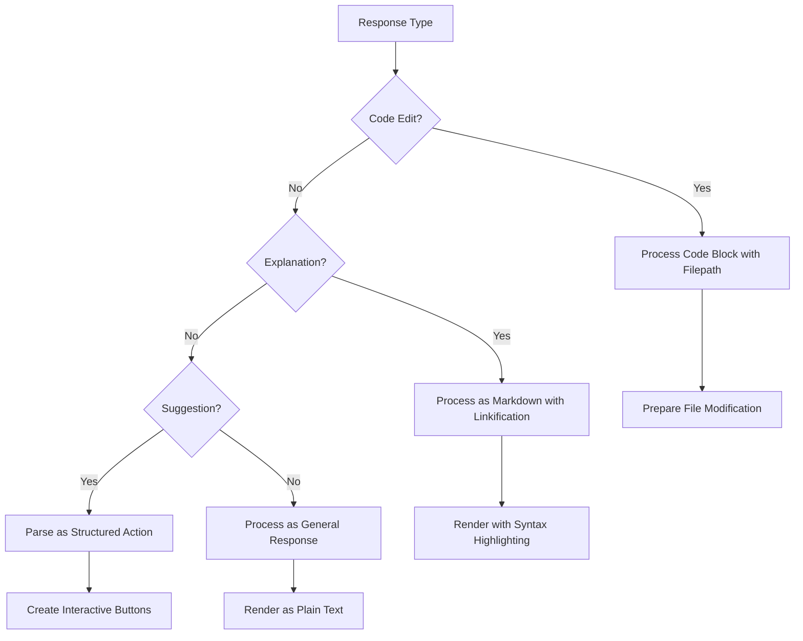

# Response Processing

<cite>
**Referenced Files in This Document**   
- [responseProcessorContext.ts](file://src/extension/prompt/node/responseProcessorContext.ts)
- [responseStreamWithLinkification.ts](file://src/extension/linkify/common/responseStreamWithLinkification.ts)
- [codeBlockProcessor.ts](file://src/extension/codeBlocks/node/codeBlockProcessor.ts)
- [responseConvert.ts](file://src/platform/networking/common/responseConvert.ts)
- [chatResponseStreamImpl.ts](file://src/util/common/chatResponseStreamImpl.ts)
- [markdown.ts](file://src/util/common/markdown.ts)
- [responseProcessor.ts](file://src/platform/inlineEdits/common/responseProcessor.ts)
</cite>

## Table of Contents
1. [Introduction](#introduction)
2. [Response Processing Pipeline](#response-processing-pipeline)
3. [ResponseProcessorContext](#responseprocessorcontext)
4. [Response Formatting and Transformation](#response-formatting-and-transformation)
5. [Code Block Processing](#code-block-processing)
6. [Streaming Response Support](#streaming-response-support)
7. [Error Handling and Partial Response Processing](#error-handling-and-partial-response-processing)
8. [Security Considerations](#security-considerations)
9. [Response Type Handling](#response-type-handling)
10. [Conclusion](#conclusion)

## Introduction

The response processing system in vscode-copilot-chat handles the transformation of raw AI model responses into structured, actionable outputs that can be safely rendered in the UI. This system processes natural language responses, extracts structured data, validates content, and transforms it into appropriate UI elements such as code blocks, markdown, and interactive components. The architecture is designed to handle various response types including code edits, explanations, and suggestions while maintaining security and performance.

The system employs a multi-layered approach to response processing, with specialized components for different aspects of the transformation pipeline. Key components include the responseProcessorContext for extracting structured data from natural language, code block processors for handling code snippets, and various stream processors for managing the flow of data from the AI model to the UI.

**Section sources**
- [responseProcessorContext.ts](file://src/extension/prompt/node/responseProcessorContext.ts#L1-L28)
- [responseStreamWithLinkification.ts](file://src/extension/linkify/common/responseStreamWithLinkification.ts#L1-L233)

## Response Processing Pipeline

The response processing pipeline in vscode-copilot-chat follows a structured flow from receiving raw AI responses to rendering them in the UI. The pipeline begins with the reception of streaming responses from the AI model through Server-Sent Events (SSE), which are then processed incrementally as they arrive.

The core of the pipeline is built around the `ChatResponseStream` interface, which serves as the foundation for processing and transforming response parts. Various decorator classes wrap the base stream to add specific processing capabilities. The `ResponseStreamWithLinkification` class, for example, processes markdown content to linkify paths and symbols, making them clickable in the UI.

Response parts are converted between different representations using utility functions in the `responseConvert.ts` module. The `toResponseDelta` function converts `ResponsePart` objects to `IResponseDelta` objects, while the `fromResponseDelta` generator function performs the reverse conversion. This conversion layer enables consistent handling of different response types across the system.



**Diagram sources**
- [responseConvert.ts](file://src/platform/networking/common/responseConvert.ts#L1-L121)
- [responseStreamWithLinkification.ts](file://src/extension/linkify/common/responseStreamWithLinkification.ts#L1-L233)

**Section sources**
- [responseConvert.ts](file://src/platform/networking/common/responseConvert.ts#L1-L121)
- [responseStreamWithLinkification.ts](file://src/extension/linkify/common/responseStreamWithLinkification.ts#L1-L233)

## ResponseProcessorContext

The `ResponseProcessorContext` class plays a crucial role in extracting structured data from natural language responses. It serves as a container for contextual information that is passed through the response processing pipeline, enabling various components to access and modify the processing state.

The context is initialized with key information including the chat session ID, the current turn in the conversation, the complete message history, and an interaction outcome computer. This information allows the system to maintain continuity across multiple interactions and to make informed decisions about how to process each response.

The primary function of the `ResponseProcessorContext` is to facilitate the extraction and storage of annotations and outcomes from the AI response. It provides methods like `addAnnotations` and `storeInInlineSession` that allow processing components to attach metadata to the response. This metadata can include information about code vulnerabilities, intellectual property citations, or other structured data extracted from the natural language response.

The context also enables coordination between different processing stages, ensuring that annotations and outcomes are properly propagated through the pipeline and made available for subsequent processing or user interface rendering.



**Diagram sources**
- [responseProcessorContext.ts](file://src/extension/prompt/node/responseProcessorContext.ts#L1-L28)

**Section sources**
- [responseProcessorContext.ts](file://src/extension/prompt/node/responseProcessorContext.ts#L1-L28)

## Response Formatting and Transformation

The response formatting system transforms AI-generated content into properly structured UI elements that enhance user experience and functionality. This process involves several key components that work together to ensure consistent and secure rendering of different content types.

The `markdown.ts` utility module provides essential functions for processing markdown content, including code block extraction and language identification. The `extractCodeBlocks` function parses markdown text to identify code blocks, extracting their language, content, and position information. This enables the system to properly format and highlight code snippets in the UI.

Language identification is handled through a mapping system that converts between VS Code language IDs and markdown code block language identifiers. The `mdCodeBlockLangToLanguageId` function looks up the appropriate language ID based on the markdown language identifier, while `languageIdToMDCodeBlockLang` performs the reverse conversion. This ensures consistent language handling across the system.

The formatting process also includes special handling for file paths in code blocks. The `filepathCodeBlockMarker` constant defines the marker text used to indicate file paths, and related functions create and parse filepath comments in various comment formats depending on the programming language.



**Diagram sources**
- [markdown.ts](file://src/util/common/markdown.ts#L1-L165)

**Section sources**
- [markdown.ts](file://src/util/common/markdown.ts#L1-L165)

## Code Block Processing

Code block processing is a critical component of the response transformation system, handling the extraction, validation, and rendering of code snippets from AI responses. The `CodeBlockTrackingChatResponseStream` class serves as the primary processor for code blocks, implementing the `ChatResponseStream` interface to intercept and process markdown content.

The processor uses a `CodeBlockProcessor` instance to analyze markdown content and identify code blocks that contain filepath information. When a code block with a filepath is detected, the processor resolves the filepath using the `IPromptPathRepresentationService` and reports the resolved URI through the `codeblockUri` method. This enables the UI to properly associate code blocks with their corresponding files.

The processing flow involves several key steps:
1. Receiving markdown content through the `markdown` method
2. Processing the content to identify code blocks with filepaths
3. Resolving filepaths to URIs
4. Extracting code block metadata
5. Forwarding processed content to the wrapped stream

The system supports both inline and block code formatting, with special handling for different comment styles based on the programming language. For example, TypeScript files use `// filepath: path/to/file` while HTML files use `<!-- filepath: path/to/file -->`.



**Diagram sources**
- [codeBlockProcessor.ts](file://src/extension/codeBlocks/node/codeBlockProcessor.ts#L18-L72)
- [markdown.ts](file://src/util/common/markdown.ts#L1-L165)

**Section sources**
- [codeBlockProcessor.ts](file://src/extension/codeBlocks/node/codeBlockProcessor.ts#L18-L72)

## Streaming Response Support

The system implements robust support for streaming responses, enabling real-time rendering of AI-generated content as it becomes available. This is achieved through the use of Server-Sent Events (SSE) and asynchronous processing pipelines that handle incremental data arrival.

The `SSEProcessor` class is responsible for parsing the SSE stream from the AI model, breaking it into individual data chunks, and processing each chunk as it arrives. The processor handles the complete lifecycle of a streaming response, from initial connection to final completion, including proper handling of the `[DONE]` signal that indicates the end of the stream.

For error handling during streaming, the processor includes mechanisms to detect and process error messages that may be present in the stream data. If an error is detected in the remaining data after processing all complete chunks, it is properly logged and reported through the telemetry system.

The streaming architecture is designed to be resilient to partial data, allowing the system to process whatever content has been received even if the stream is interrupted. This ensures that users receive as much useful information as possible, even in cases of network issues or service interruptions.

```mermaid
flowchart TD
A[Start Stream] --> B[Receive Data Chunk]
B --> C{Complete JSON?}
C --> |Yes| D[Parse JSON Data]
D --> E{Is [DONE]?}
E --> |Yes| F[Complete Processing]
E --> |No| G[Process Response Part]
G --> H[Update UI]
H --> B
C --> |No| I[Store Partial Data]
I --> B
F --> J[End Stream]
```

**Section sources**
- [stream.ts](file://src/platform/endpoint/node/responsesApi.ts)
- [sseProcessor.ts](file://src/platform/endpoint/test/node/stream.sseProcessor.spec.ts)

## Error Handling and Partial Response Processing

The response processing system implements comprehensive error handling mechanisms to ensure robust operation in the face of various failure modes. Errors are categorized and handled appropriately based on their type and severity.

The system distinguishes between different types of errors, including network errors, service errors, and content filtering errors. Network and service errors (HTTP status codes 400-600) are handled by the error creator utilities, which map HTTP status codes to appropriate error reasons such as Unauthorized, BadArguments, NotFound, RateLimit, and InternalError.

For content received during streaming, the system includes special handling for partial or incomplete data. When the stream ends, any remaining data in the buffer is checked for error messages. If an error is detected in this residual data, it is properly logged and reported, preventing silent failures.

The processing pipeline is designed to handle partial responses gracefully. Even if a response is incomplete or interrupted, the system attempts to process and display whatever content was successfully received. This ensures that users receive maximum value from the AI interaction, even in suboptimal network conditions.

Error information is propagated through the response stream using the `copilotErrors` field in the response delta, allowing the UI to display appropriate error messages to the user. The system also includes telemetry reporting for errors, helping to identify and address recurring issues.



**Section sources**
- [errorCreator.ts](file://src/extension/completions-core/vscode-node/lib/src/snippy/errorCreator.ts#L25-L65)
- [stream.ts](file://src/platform/networking/node/stream.ts#L583-L607)

## Security Considerations

The response processing system incorporates multiple security measures to protect against potential threats from AI-generated content. These measures address both code execution risks and content-based vulnerabilities.

One key security feature is the handling of code vulnerabilities. The system can detect and report potential security issues in generated code through the `ChatVulnerability` interface. When vulnerabilities are detected, they are reported alongside the code block, allowing users to be aware of potential security risks in the suggested code.

The system also implements safeguards against malicious content in code blocks. Filepath resolution is handled through the `IPromptPathRepresentationService`, which ensures that filepaths are properly validated and resolved within the appropriate context. This prevents potential path traversal attacks or attempts to access unauthorized files.

For code execution, the system follows a principle of least privilege, ensuring that any code suggested by the AI requires explicit user approval before execution. Interactive components and command suggestions are presented as buttons or actions that the user must explicitly trigger, preventing accidental execution of potentially harmful code.

The markdown processing system includes protections against injection attacks by properly escaping special characters and validating content structure. Linkification is performed in a controlled manner, ensuring that only legitimate paths and symbols are made clickable.



**Section sources**
- [responseStreamWithLinkification.ts](file://src/extension/linkify/common/responseStreamWithLinkification.ts#L1-L233)
- [pythonCookbookData.ts](file://src/extension/prompts/node/inline/pythonCookbookData.ts)

## Response Type Handling

The system handles different response types through specialized processing logic that adapts to the nature of the content. Each response type follows a specific processing path to ensure appropriate formatting and functionality.

For code edits, the system uses the filepath markers in code blocks to identify the target files and prepare for potential file modifications. The presence of a filepath comment triggers the code block processing pipeline, which extracts the code and associates it with the resolved file URI.

Explanations and general responses are processed as markdown content, with appropriate formatting and linkification. The system preserves the natural language structure while enhancing it with clickable references to files, symbols, and other relevant entities.

Suggestions and recommendations are often formatted as structured JSON responses that describe actions to take. These responses include type indicators (such as "setting" or "command") and details about the suggested action, enabling the UI to present appropriate interactive elements.

The processing system maintains flexibility to handle evolving response formats while ensuring backward compatibility with existing patterns. This allows the AI model to experiment with different response styles while maintaining a consistent user experience.



**Section sources**
- [editCodePrompt2.tsx](file://src/extension/prompts/node/panel/editCodePrompt2.tsx#L84-L110)
- [vscode.tsx](file://src/extension/prompts/node/panel/vscode.tsx#L182-L221)

## Conclusion

The response processing system in vscode-copilot-chat provides a comprehensive framework for transforming raw AI model responses into safe, structured, and actionable outputs. Through a combination of streaming processing, content validation, and security measures, the system ensures that AI-generated content is delivered in a reliable and user-friendly manner.

Key components like the ResponseProcessorContext, code block processors, and response stream decorators work together to extract structured data from natural language, format content appropriately, and handle various response types. The system's modular architecture allows for flexible extension and adaptation to new requirements while maintaining robust error handling and security protections.

The implementation demonstrates a thoughtful approach to balancing functionality with safety, ensuring that users can benefit from AI assistance while being protected from potential risks associated with generated content. As the system continues to evolve, these foundational principles will support the addition of new features and capabilities while maintaining a high standard of quality and security.