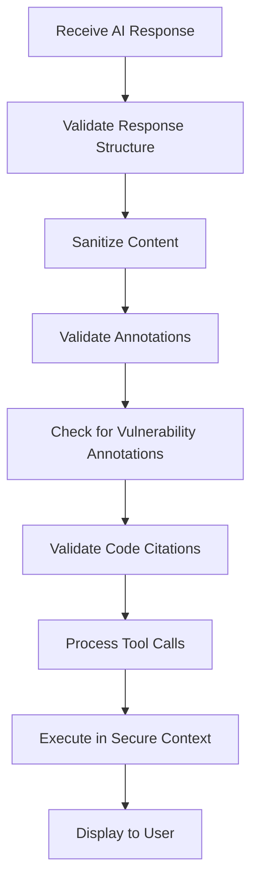
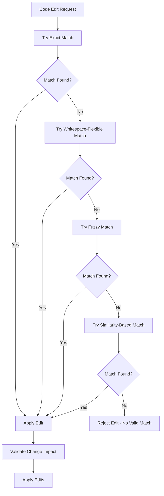
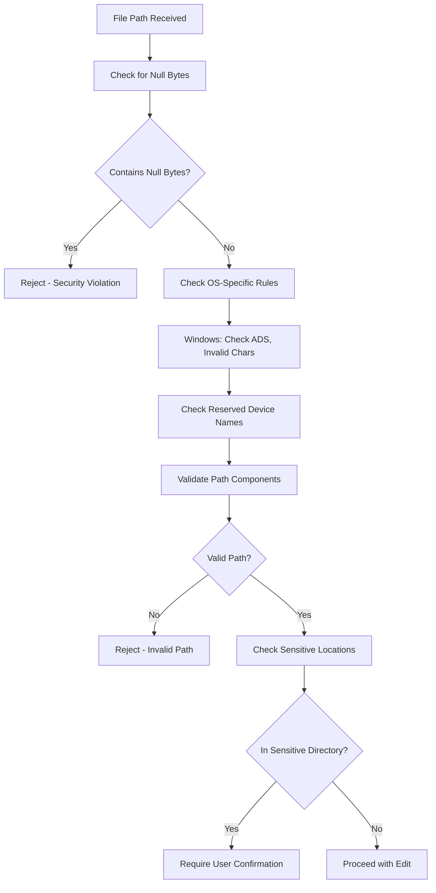
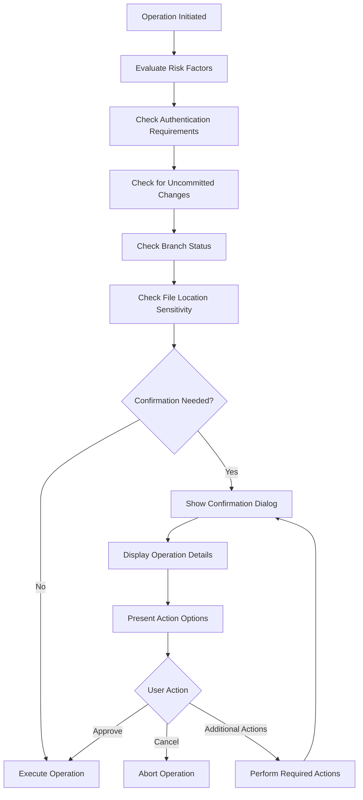
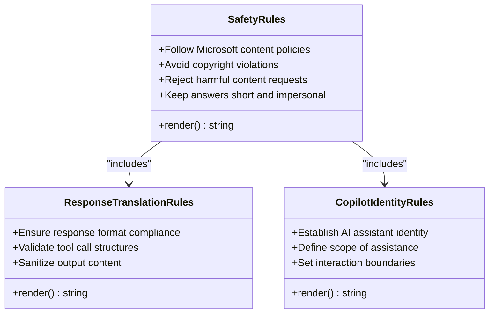

# Security Validation

<cite>
**Referenced Files in This Document**   
- [safetyRules.tsx](file://src/extension/prompts/node/base/safetyRules.tsx)
- [inlineChat2Prompt.tsx](file://src/extension/prompts/node/inline/inlineChat2Prompt.tsx)
- [codeMapperPrompt.tsx](file://src/extension/prompts/node/codeMapper/codeMapperPrompt.tsx)
- [editFileToolUtils.tsx](file://src/extension/tools/node/editFileToolUtils.tsx)
- [extpath.ts](file://src/util/vs/base/common/extpath.ts)
- [copilotCloudSessionsProvider.ts](file://src/extension/chatSessions/vscode-node/copilotCloudSessionsProvider.ts)
- [sanitizer.spec.ts](file://src/extension/log/vscode-node/test/sanitizer.spec.ts)
- [stream.ts](file://src/platform/networking/node/stream.ts)
</cite>

## Table of Contents
1. [Introduction](#introduction)
2. [AI Response Validation and Sanitization](#ai-response-validation-and-sanitization)
3. [Code Edit Validation Mechanisms](#code-edit-validation-mechanisms)
4. [File Path Validation and Permission Checks](#file-path-validation-and-permission-checks)
5. [User Confirmation Workflows](#user-confirmation-workflows)
6. [Security Policy Enforcement](#security-policy-enforcement)
7. [Audit Logging and Security Monitoring](#audit-logging-and-security-monitoring)
8. [Conclusion](#conclusion)

## Introduction
The vscode-copilot-chat extension implements a comprehensive security framework to validate and sanitize AI-generated content before execution or display. This documentation details the multi-layered security mechanisms that protect users from potentially harmful content, unauthorized system access, and malicious operations. The system employs content policy enforcement, code validation, file path security checks, user confirmation workflows, and audit logging to ensure safe interaction with AI-generated responses. These security measures are designed to prevent injection attacks, unauthorized file modifications, and other security threats while maintaining the functionality of AI-assisted development.

## AI Response Validation and Sanitization
The system implements robust validation and sanitization mechanisms for AI-generated content through multiple layers of protection. The core validation occurs at the prompt level, where safety rules are embedded directly into the AI interaction framework to prevent generation of harmful content.

The security framework includes content validation at multiple stages of the response processing pipeline. When AI responses are received, they undergo validation to ensure they conform to expected data structures and do not contain malicious content. The system validates various types of annotations and tool calls to prevent injection attacks and ensure data integrity.

**Diagram sources**
- [stream.ts](file://src/platform/networking/node/stream.ts#L419-L429)
- [sanitizer.spec.ts](file://src/extension/log/vscode-node/test/sanitizer.spec.ts#L9-L30)

**Section sources**
- [stream.ts](file://src/platform/networking/node/stream.ts#L419-L429)
- [sanitizer.spec.ts](file://src/extension/log/vscode-node/test/sanitizer.spec.ts#L9-L30)

## Code Edit Validation Mechanisms
The system implements sophisticated validation mechanisms for code edit operations to ensure changes are safe, accurate, and properly contextualized. These mechanisms include multiple matching strategies to apply code changes with high precision while preventing unintended modifications.

The code edit validation system employs several matching strategies in sequence:
1. **Exact matching**: Attempts to find an exact match of the code to be replaced
2. **Whitespace-flexible matching**: Handles variations in whitespace and indentation
3. **Fuzzy matching**: Uses regex patterns to match code with flexible formatting
4. **Similarity-based matching**: As a last resort, uses string similarity algorithms

Each strategy includes safeguards against multiple matches, which would indicate ambiguous edit instructions that could lead to incorrect modifications. The system also validates that edits result in actual changes to prevent unnecessary file modifications.

**Diagram sources**
- [editFileToolUtils.tsx](file://src/extension/tools/node/editFileToolUtils.tsx#L224-L512)
- [editFileToolUtils.tsx](file://src/extension/tools/node/editFileToolUtils.tsx#L560-L703)

**Section sources**
- [editFileToolUtils.tsx](file://src/extension/tools/node/editFileToolUtils.tsx#L224-L703)

## File Path Validation and Permission Checks
The system implements comprehensive file path validation and permission checking to prevent security vulnerabilities related to file system access. These mechanisms protect against path traversal attacks, invalid file paths, and unauthorized access to sensitive system locations.

File path validation includes multiple security checks:
- **Null byte validation**: Rejects paths containing null bytes which could be used in injection attacks
- **Windows-specific validation**: Checks for NTFS Alternate Data Streams, invalid characters, and reserved device names
- **Path component validation**: Ensures path components don't end with dots or spaces (Windows quirk)
- **8.3 short filename detection**: Prevents use of legacy short filenames that could bypass security checks

The system also implements permission checks based on file location and sensitivity. Certain directories, such as user home directories and system configuration folders, require explicit user confirmation before modifications can be made.

**Diagram sources**
- [editFileToolUtils.tsx](file://src/extension/tools/node/editFileToolUtils.tsx#L725-L807)
- [extpath.ts](file://src/util/vs/base/common/extpath.ts#L113-L172)

**Section sources**
- [editFileToolUtils.tsx](file://src/extension/tools/node/editFileToolUtils.tsx#L725-L807)
- [extpath.ts](file://src/util/vs/base/common/extpath.ts#L113-L172)

## User Confirmation Workflows
The system implements user confirmation workflows for potentially dangerous operations to ensure users are aware of and approve significant changes. These workflows are triggered based on the sensitivity of the operation and the location of the files being modified.

The confirmation system evaluates multiple factors to determine if user confirmation is required:
- Whether the operation requires permissive authentication
- Presence of uncommitted changes in the repository
- Whether the operation affects a non-default branch
- Whether the file is in a sensitive or system directory

When confirmation is required, the system presents a dialog with appropriate messaging and action buttons. The workflow ensures that users can review the proposed changes and make informed decisions about whether to proceed, cancel, or take additional actions like committing changes first.

**Diagram sources**
- [copilotCloudSessionsProvider.ts](file://src/extension/chatSessions/vscode-node/copilotCloudSessionsProvider.ts#L938-L975)
- [editFileToolUtils.tsx](file://src/extension/tools/node/editFileToolUtils.tsx#L787-L807)

**Section sources**
- [copilotCloudSessionsProvider.ts](file://src/extension/chatSessions/vscode-node/copilotCloudSessionsProvider.ts#L938-L975)
- [editFileToolUtils.tsx](file://src/extension/tools/node/editFileToolUtils.tsx#L787-L807)

## Security Policy Enforcement
The system enforces comprehensive security policies through multiple mechanisms, including content rules, safety guidelines, and operational constraints. These policies are designed to prevent generation and execution of harmful content while maintaining the utility of AI-assisted development.

The security policy framework includes:
- **Content policies**: Rules that prevent generation of harmful, hateful, or copyrighted content
- **Operational constraints**: Limitations on the scope of AI operations to prevent unintended consequences
- **Contextual awareness**: Ensuring AI responses are grounded in the current development context

The system implements these policies through prompt engineering, where safety rules are embedded directly into the AI interaction context. This approach ensures that the AI model is guided to produce safe and appropriate responses from the outset, rather than relying solely on post-processing filters.

**Diagram sources**
- [safetyRules.tsx](file://src/extension/prompts/node/base/safetyRules.tsx#L1-L44)
- [inlineChat2Prompt.tsx](file://src/extension/prompts/node/inline/inlineChat2Prompt.tsx#L60-L67)
- [codeMapperPrompt.tsx](file://src/extension/prompts/node/codeMapper/codeMapperPrompt.tsx#L86-L87)

**Section sources**
- [safetyRules.tsx](file://src/extension/prompts/node/base/safetyRules.tsx#L1-L44)
- [inlineChat2Prompt.tsx](file://src/extension/prompts/node/inline/inlineChat2Prompt.tsx#L60-L67)
- [codeMapperPrompt.tsx](file://src/extension/prompts/node/codeMapper/codeMapperPrompt.tsx#L86-L87)

## Audit Logging and Security Monitoring
The system implements audit logging and security monitoring to track security-critical actions and detect potential security incidents. These mechanisms provide visibility into AI-assisted operations and enable post-incident analysis if security issues arise.

The logging framework captures information about:
- Security policy violations
- Failed validation attempts
- User confirmation decisions
- Sensitive operations

This logging infrastructure supports both real-time monitoring and retrospective analysis, helping to identify patterns of potentially malicious activity or systemic security weaknesses. The logs are designed to provide sufficient detail for security analysis while respecting user privacy and minimizing performance impact.

**Section sources**
- [sanitizer.spec.ts](file://src/extension/log/vscode-node/test/sanitizer.spec.ts#L9-L30)
- [stream.ts](file://src/platform/networking/node/stream.ts#L419-L429)

## Conclusion
The vscode-copilot-chat extension implements a comprehensive security framework that protects users from potential risks associated with AI-generated content. Through a combination of content validation, code edit verification, file path security, user confirmation workflows, and policy enforcement, the system ensures that AI-assisted development remains both powerful and safe. The multi-layered approach addresses security concerns at multiple levels, from preventing generation of harmful content to validating code changes and protecting sensitive system locations. These security mechanisms work together to create a secure environment for AI-assisted development while maintaining the productivity benefits of intelligent code suggestions and automated edits.