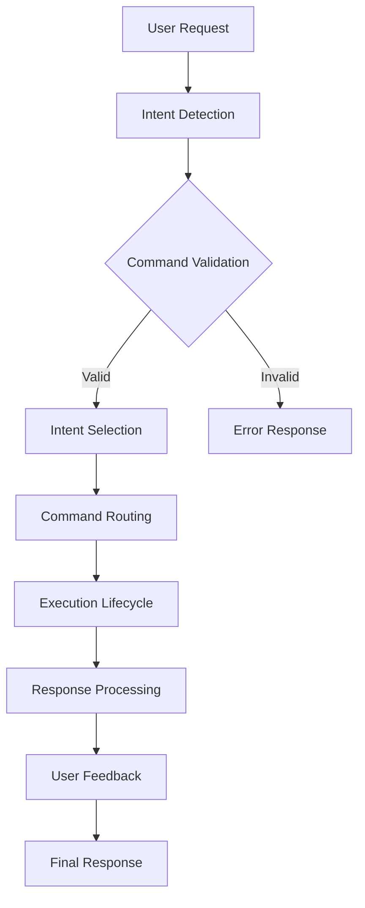
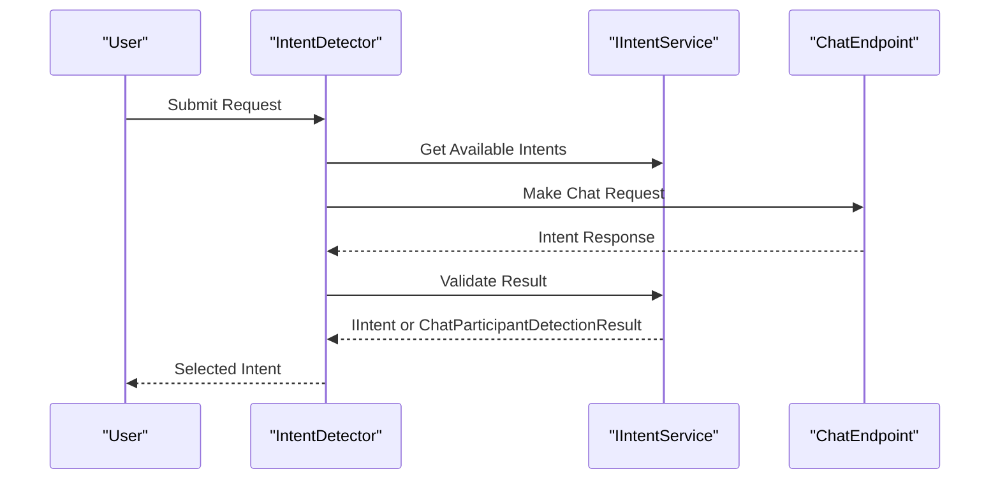
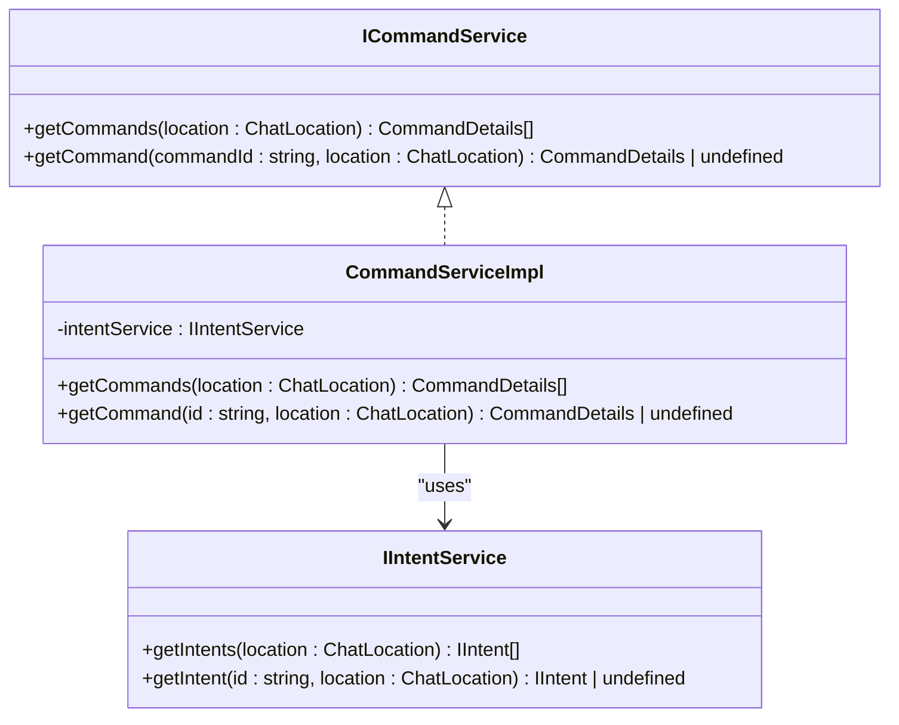
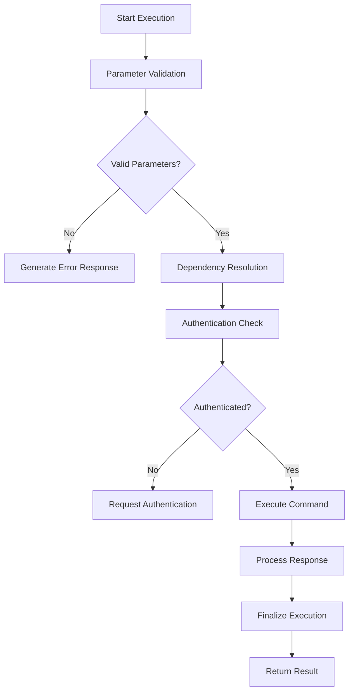
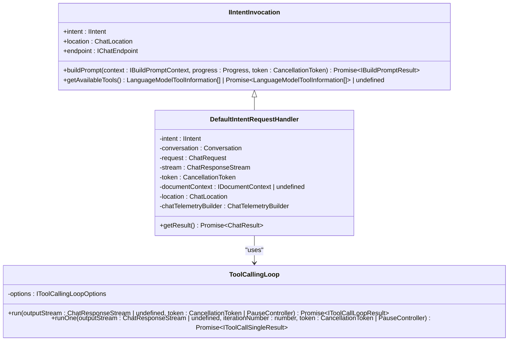
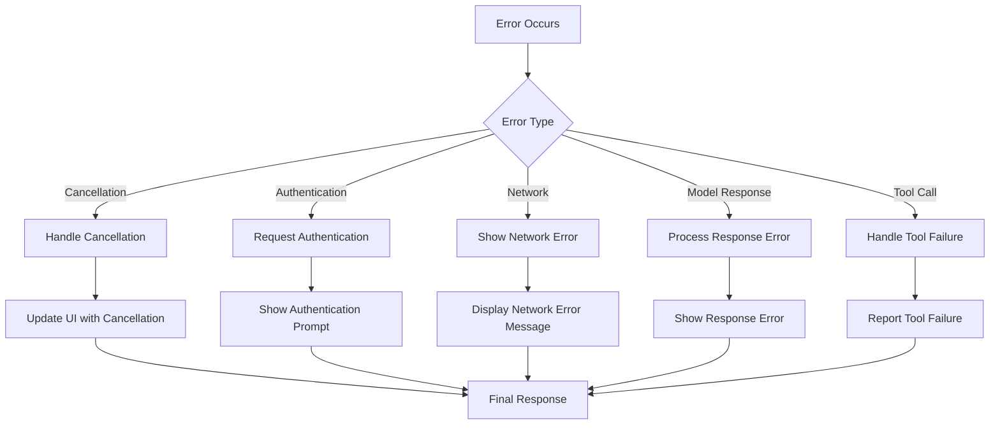
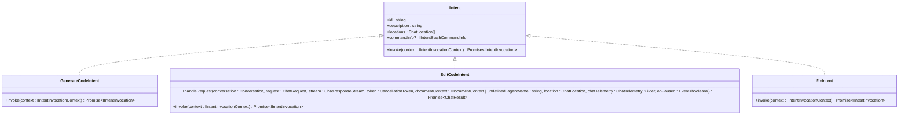

# Command Processing

<cite>
**Referenced Files in This Document**   
- [commandService.ts](file://src/extension/commands/node/commandService.ts)
- [intentService.ts](file://src/extension/intents/node/intentService.ts)
- [intentDetector.tsx](file://src/extension/prompt/node/intentDetector.tsx)
- [chatParticipantRequestHandler.ts](file://src/extension/prompt/node/chatParticipantRequestHandler.ts)
- [defaultIntentRequestHandler.ts](file://src/extension/prompt/node/defaultIntentRequestHandler.ts)
- [toolCallingLoop.ts](file://src/extension/intents/node/toolCallingLoop.ts)
- [intents.ts](file://src/extension/prompt/node/intents.ts)
- [generateCodeIntent.ts](file://src/extension/intents/node/generateCodeIntent.ts)
- [editCodeIntent.ts](file://src/extension/intents/node/editCodeIntent.ts)
- [fixIntent.ts](file://src/extension/intents/node/fixIntent.ts)
</cite>

## Table of Contents
1. [Introduction](#introduction)
2. [Command Processing Pipeline Overview](#command-processing-pipeline-overview)
3. [Intent Detection and Selection](#intent-detection-and-selection)
4. [Command Routing System](#command-routing-system)
5. [Execution Lifecycle](#execution-lifecycle)
6. [Interaction with VS Code API and Extension Services](#interaction-with-vs-code-api-and-extension-services)
7. [Asynchronous Command Execution and Progress Reporting](#asynchronous-command-execution-and-progress-reporting)
8. [Error Handling and User Feedback](#error-handling-and-user-feedback)
9. [Command Type Processing](#command-type-processing)
10. [Conclusion](#conclusion)

## Introduction
The command processing pipeline in vscode-copilot-chat is a sophisticated system that translates user intents into executable commands and actions. This documentation provides a comprehensive overview of how detected intents are processed, routed to appropriate handlers, and executed within the VS Code environment. The system handles various command types, including synchronous, asynchronous, and long-running operations, while maintaining responsiveness and providing appropriate user feedback throughout the execution lifecycle.

## Command Processing Pipeline Overview

The command processing pipeline in vscode-copilot-chat follows a structured flow from intent detection to command execution and response handling. The process begins when a user submits a request through the chat interface, triggering a series of coordinated operations that ultimately produce a response.



**Diagram sources** 
- [chatParticipantRequestHandler.ts](file://src/extension/prompt/node/chatParticipantRequestHandler.ts#L227-L253)
- [intentDetector.tsx](file://src/extension/prompt/node/intentDetector.tsx#L311-L334)

**Section sources**
- [chatParticipantRequestHandler.ts](file://src/extension/prompt/node/chatParticipantRequestHandler.ts#L227-L253)
- [intentDetector.tsx](file://src/extension/prompt/node/intentDetector.tsx#L311-L334)

## Intent Detection and Selection

The intent detection system is responsible for analyzing user input and determining the appropriate intent to execute. This process involves several key components working together to accurately identify the user's request.

The `IntentDetector` class implements the `ChatParticipantDetectionProvider` interface and uses a combination of contextual analysis and machine learning to detect intents. It evaluates the user's message against available commands and participants, considering factors such as the current document context, conversation history, and available tools.



**Diagram sources** 
- [intentDetector.tsx](file://src/extension/prompt/node/intentDetector.tsx#L311-L334)
- [intentService.ts](file://src/extension/intents/node/intentService.ts#L49-L56)

**Section sources**
- [intentDetector.tsx](file://src/extension/prompt/node/intentDetector.tsx#L311-L334)
- [intentService.ts](file://src/extension/intents/node/intentService.ts#L49-L56)

## Command Routing System

The command routing system directs intents to appropriate handlers based on their type and context. This system is implemented through the `ICommandService` interface and its concrete implementation `CommandServiceImpl`.

The command service acts as a registry for all available commands, providing methods to retrieve commands by location and command ID. It integrates with the intent service to filter and map intents to command details, ensuring that only appropriate commands are available in specific contexts.



**Diagram sources** 
- [commandService.ts](file://src/extension/commands/node/commandService.ts#L11-L37)
- [intentService.ts](file://src/extension/intents/node/intentService.ts#L16-L22)

**Section sources**
- [commandService.ts](file://src/extension/commands/node/commandService.ts#L11-L37)
- [intentService.ts](file://src/extension/intents/node/intentService.ts#L16-L22)

## Execution Lifecycle

The execution lifecycle encompasses the complete process of command validation, dependency resolution, and execution. This lifecycle is managed by the `DefaultIntentRequestHandler` class, which coordinates the various stages of command processing.

The lifecycle begins with parameter validation to ensure that required arguments are present. If validation fails, an appropriate error response is generated. Upon successful validation, the system proceeds to resolve dependencies, including tool availability and authentication requirements.



**Diagram sources** 
- [defaultIntentRequestHandler.ts](file://src/extension/prompt/node/defaultIntentRequestHandler.ts#L103-L150)
- [chatParticipantRequestHandler.ts](file://src/extension/prompt/node/chatParticipantRequestHandler.ts#L227-L253)

**Section sources**
- [defaultIntentRequestHandler.ts](file://src/extension/prompt/node/defaultIntentRequestHandler.ts#L103-L150)
- [chatParticipantRequestHandler.ts](file://src/extension/prompt/node/chatParticipantRequestHandler.ts#L227-L253)

## Interaction with VS Code API and Extension Services

The command processing system interacts extensively with the VS Code API and various extension services to provide functionality and access to workspace resources. These interactions are facilitated through dependency injection and service interfaces.

Key services include the `IEndpointProvider` for accessing chat endpoints, `IAuthenticationService` for handling authentication, and `IWorkspaceService` for workspace operations. The system also integrates with the VS Code chat API through interfaces like `ChatResponseStream` for streaming responses and `ChatRequest` for handling user input.



**Diagram sources** 
- [intents.ts](file://src/extension/prompt/node/intents.ts#L165-L212)
- [defaultIntentRequestHandler.ts](file://src/extension/prompt/node/defaultIntentRequestHandler.ts#L71-L101)
- [toolCallingLoop.ts](file://src/extension/intents/node/toolCallingLoop.ts#L93-L117)

**Section sources**
- [intents.ts](file://src/extension/prompt/node/intents.ts#L165-L212)
- [defaultIntentRequestHandler.ts](file://src/extension/prompt/node/defaultIntentRequestHandler.ts#L71-L101)
- [toolCallingLoop.ts](file://src/extension/intents/node/toolCallingLoop.ts#L93-L117)

## Asynchronous Command Execution and Progress Reporting

The system supports asynchronous command execution through the `ToolCallingLoop` class, which manages the lifecycle of tool calls and provides progress reporting to the user. This mechanism allows for long-running operations while maintaining responsiveness in the UI.

The tool calling loop implements a retry mechanism and handles tool call limits, providing users with options to continue or stop execution when limits are reached. Progress is reported through the `ChatResponseStream` interface, allowing real-time updates to be displayed in the chat interface.

```mermaid
sequenceDiagram
participant Handler as "DefaultIntentRequestHandler"
participant Loop as "ToolCallingLoop"
participant Stream as "ChatResponseStream"
participant Model as "LLM"
Handler->>Loop : run(outputStream, token)
Loop->>Stream : Show Progress
Loop->>Model : Send Request
Model-->>Loop : Stream Response
Loop->>Stream : Update Progress
alt Tool Calls Required
Loop->>Model : Execute Tool Calls
Model-->>Loop : Tool Results
Loop->>Loop : Process Results
Loop->>Model : Continue Request
end
Loop-->>Handler : Return Result
Handler->>Stream : Finalize Response
```

**Diagram sources** 
- [toolCallingLoop.ts](file://src/extension/intents/node/toolCallingLoop.ts#L171-L224)
- [defaultIntentRequestHandler.ts](file://src/extension/prompt/node/defaultIntentRequestHandler.ts#L290-L349)

**Section sources**
- [toolCallingLoop.ts](file://src/extension/intents/node/toolCallingLoop.ts#L171-L224)
- [defaultIntentRequestHandler.ts](file://src/extension/prompt/node/defaultIntentRequestHandler.ts#L290-L349)

## Error Handling and User Feedback

The system implements comprehensive error handling to manage various failure scenarios, including network errors, authentication issues, and model response errors. Errors are categorized and handled appropriately, with user-friendly messages provided through the chat interface.

User feedback mechanisms include progress indicators, confirmation dialogs for potentially destructive operations, and clear error messages that help users understand what went wrong and how to proceed. The system also provides telemetry for monitoring and improving error handling over time.



**Diagram sources** 
- [defaultIntentRequestHandler.ts](file://src/extension/prompt/node/defaultIntentRequestHandler.ts#L151-L167)
- [toolCallingLoop.ts](file://src/extension/intents/node/toolCallingLoop.ts#L472-L482)

**Section sources**
- [defaultIntentRequestHandler.ts](file://src/extension/prompt/node/defaultIntentRequestHandler.ts#L151-L167)
- [toolCallingLoop.ts](file://src/extension/intents/node/toolCallingLoop.ts#L472-L482)

## Command Type Processing

The system handles different command types through specialized intent implementations. Each intent type follows a consistent pattern but may have unique processing requirements based on its purpose.

For example, the `GenerateCodeIntent` handles code generation requests, while the `EditCodeIntent` manages code modification operations. The `FixIntent` addresses code fixes and error resolution. Each intent type implements the `IIntent` interface and provides specific behavior through its `invoke` method.



**Diagram sources** 
- [intents.ts](file://src/extension/prompt/node/intents.ts#L54-L87)
- [generateCodeIntent.ts](file://src/extension/intents/node/generateCodeIntent.ts#L16-L39)
- [editCodeIntent.ts](file://src/extension/intents/node/editCodeIntent.ts#L82-L193)
- [fixIntent.ts](file://src/extension/intents/node/fixIntent.ts#L22-L64)

**Section sources**
- [intents.ts](file://src/extension/prompt/node/intents.ts#L54-L87)
- [generateCodeIntent.ts](file://src/extension/intents/node/generateCodeIntent.ts#L16-L39)
- [editCodeIntent.ts](file://src/extension/intents/node/editCodeIntent.ts#L82-L193)
- [fixIntent.ts](file://src/extension/intents/node/fixIntent.ts#L22-L64)

## Conclusion
The command processing pipeline in vscode-copilot-chat is a robust and flexible system that effectively translates user intents into actionable commands. By leveraging a modular architecture with clear separation of concerns, the system provides reliable command routing, execution, and error handling. The integration with VS Code APIs and extension services enables rich functionality while maintaining responsiveness through asynchronous execution and progress reporting. This comprehensive approach ensures a seamless user experience when interacting with the Copilot chat assistant.