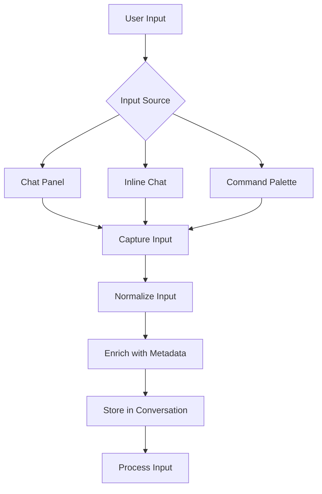
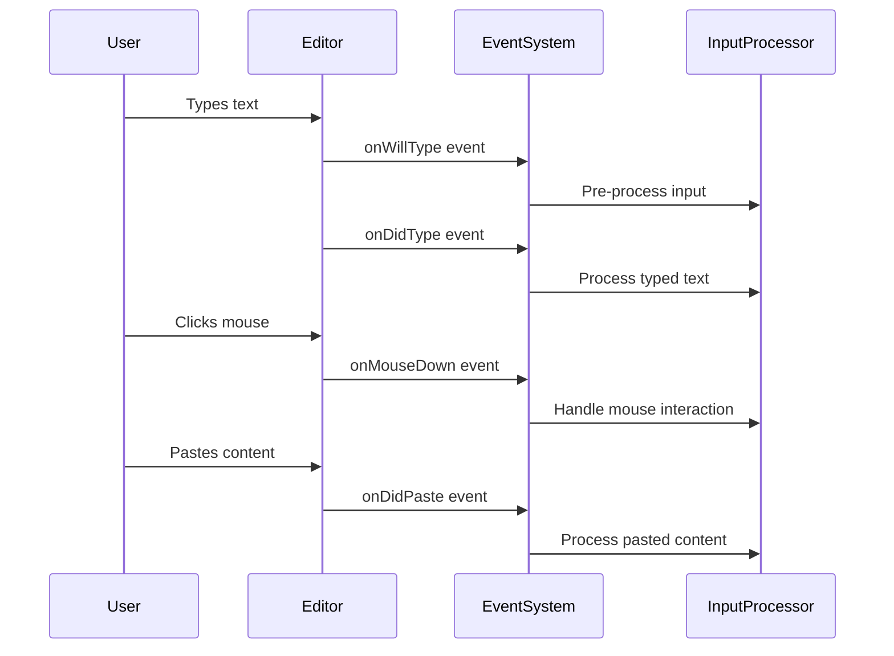
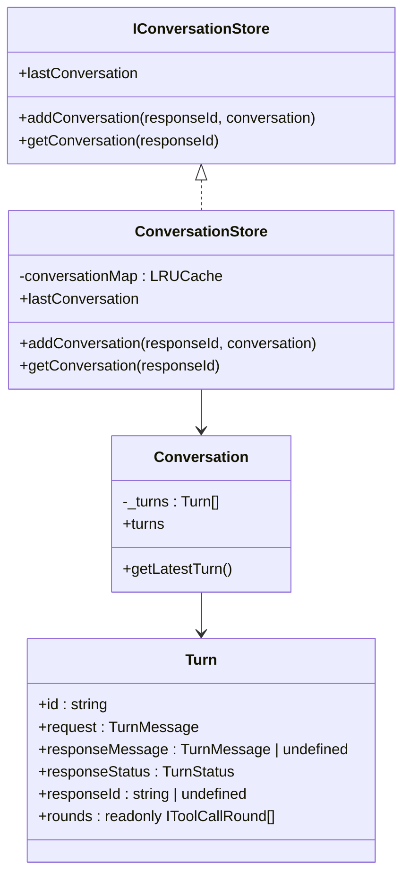
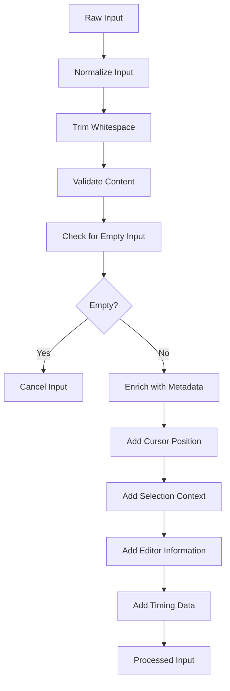
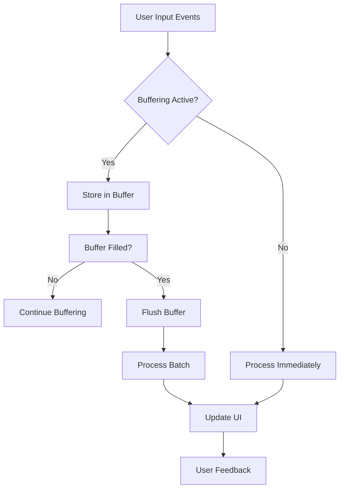
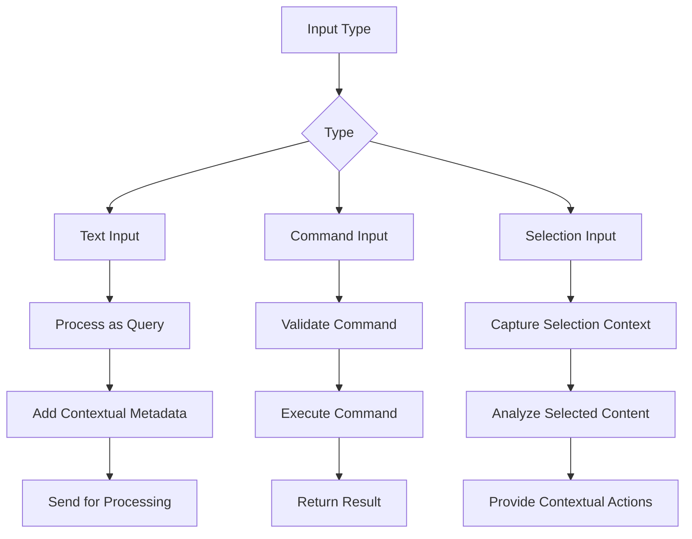
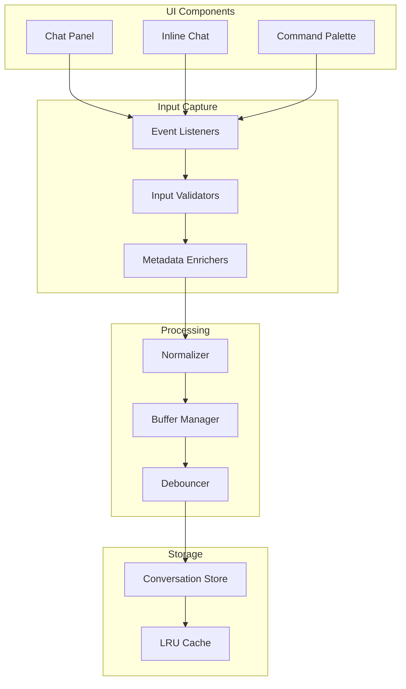

# Input Capture

<cite>
**Referenced Files in This Document**   
- [conversationStore.ts](file://src/extension/conversationStore/node/conversationStore.ts)
- [conversation.ts](file://src/extension/prompt/common/conversation.ts)
- [interactiveEditorWidget.ts](file://test/simulation/fixtures/edit-single-line-await-issue-3702/interactiveEditorWidget.ts)
- [codeEditorWidget.ts](file://test/simulation/fixtures/vscode/codeEditorWidget.ts)
- [inlineChatCommands.ts](file://src/extension/inlineChat/vscode-node/inlineChatCommands.ts)
- [event.ts](file://src/util/vs/base/common/event.ts)
- [chatStream.ts](file://src/platform/networking/node/chatStream.ts)
</cite>

## Table of Contents
1. [Introduction](#introduction)
2. [Input Capture Mechanism Overview](#input-capture-mechanism-overview)
3. [Event Handling System](#event-handling-system)
4. [Conversation Store and State Management](#conversation-store-and-state-management)
5. [Input Normalization and Metadata Enrichment](#input-normalization-and-metadata-enrichment)
6. [Input Buffering and Real-time Processing](#input-buffering-and-real-time-processing)
7. [Handling Different Input Types](#handling-different-input-types)
8. [Architecture Overview](#architecture-overview)
9. [Conclusion](#conclusion)

## Introduction

The input capture mechanism in vscode-copilot-chat is responsible for collecting user inputs from various UI components including chat panels, inline chat interfaces, and command palette interactions. This documentation provides a comprehensive analysis of how user inputs are captured, processed, and managed throughout the system. The mechanism handles keyboard events, text input, and mouse interactions while maintaining context through the conversation store. Inputs are normalized, sanitized, and enriched with metadata such as cursor position, selection context, and active editor information before being processed.

**Section sources**
- [conversationStore.ts](file://src/extension/conversationStore/node/conversationStore.ts#L1-L40)
- [conversation.ts](file://src/extension/prompt/common/conversation.ts#L1-L384)

## Input Capture Mechanism Overview

The input capture system in vscode-copilot-chat is designed to handle user interactions from multiple UI components. The system captures inputs from chat panels, inline chat interfaces, and command palette interactions through a unified event handling mechanism. Each UI component implements specific event listeners that capture user actions and transform them into processable events.

The core input capture functionality is implemented through event emitters that listen for various user interactions. For example, the interactive editor widget captures input through an input editor component that monitors text changes, cursor movements, and user actions. When a user begins typing in the input field, the system establishes event handlers for accepting or canceling the input, ensuring that empty or whitespace-only inputs are properly handled.

**Diagram sources**
- [interactiveEditorWidget.ts](file://test/simulation/fixtures/edit-single-line-await-issue-3702/interactiveEditorWidget.ts#L60-L299)
- [inlineChatCommands.ts](file://src/extension/inlineChat/vscode-node/inlineChatCommands.ts#L43-L53)

**Section sources**
- [interactiveEditorWidget.ts](file://test/simulation/fixtures/edit-single-line-await-issue-3702/interactiveEditorWidget.ts#L60-L299)
- [inlineChatCommands.ts](file://src/extension/inlineChat/vscode-node/inlineChatCommands.ts#L43-L53)

## Event Handling System

The event handling system in vscode-copilot-chat captures various user interactions through a comprehensive set of event listeners. The system implements event emitters for different types of user actions, including typing events, composition events, paste operations, and mouse interactions.

Keyboard events are captured through dedicated event listeners that monitor key presses and releases. The system implements both `onWillType` and `onDidType` events to capture text input before and after it occurs. Composition events are handled through `onDidCompositionStart` and `onDidCompositionEnd` listeners, which track when users are composing text (such as when using IMEs for non-Latin scripts).

Mouse interactions are captured through a series of event listeners including `onMouseUp`, `onMouseDown`, `onMouseMove`, `onMouseLeave`, and `onMouseWheel`. These events provide detailed information about user interactions with the editor interface. The system also captures paste events through the `onDidPaste` listener, which receives information about pasted content and its source.

**Diagram sources**
- [codeEditorWidget.ts](file://test/simulation/fixtures/vscode/codeEditorWidget.ts#L167-L183)
- [codeEditorWidget.ts](file://test/simulation/fixtures/edit/issue-7996/codeEditorWidget.ts#L129-L175)

**Section sources**
- [codeEditorWidget.ts](file://test/simulation/fixtures/vscode/codeEditorWidget.ts#L167-L183)
- [codeEditorWidget.ts](file://test/simulation/fixtures/edit/issue-7996/codeEditorWidget.ts#L129-L175)

## Conversation Store and State Management

The conversation store is a central component in the input capture mechanism, responsible for maintaining input state and context across user interactions. The store implements an LRU (Least Recently Used) cache with a capacity of 1000 conversations, ensuring efficient memory usage while preserving recent conversation history.

The conversation store provides methods for adding new conversations, retrieving existing conversations by response ID, and accessing the most recent conversation. Each conversation contains a series of turns, where each turn represents a complete interaction cycle between the user and the system. The store maintains the conversation state, including the sequence of user requests and system responses.

Conversations are structured as a collection of turns, with each turn containing the user's input message, response status, and associated metadata. The system ensures that conversations have at least one turn and provides methods for accessing the latest turn in a conversation. This structure allows the system to maintain context across multiple interactions, enabling features like conversation history and contextual understanding.

**Diagram sources**
- [conversationStore.ts](file://src/extension/conversationStore/node/conversationStore.ts#L1-L40)
- [conversation.ts](file://src/extension/prompt/common/conversation.ts#L1-L384)

**Section sources**
- [conversationStore.ts](file://src/extension/conversationStore/node/conversationStore.ts#L1-L40)
- [conversation.ts](file://src/extension/prompt/common/conversation.ts#L1-L384)

## Input Normalization and Metadata Enrichment

The input capture system normalizes and enriches user inputs with contextual metadata before processing. This process ensures that inputs are consistent, sanitized, and contain all necessary information for effective processing.

Input normalization includes trimming whitespace, validating content, and ensuring proper formatting. The system checks for empty or whitespace-only inputs and handles them appropriately by canceling the input operation. This prevents the processing of invalid or meaningless inputs.

Metadata enrichment adds contextual information to inputs, including cursor position, selection context, and active editor information. For example, when a user interacts with the inline editor, the system captures the cursor position relative to the first and last lines of the input. This information is stored in context keys that can be used to determine the input's position within the editor.

Additional metadata includes information about the input source, timing, and user interaction patterns. The system captures information about when inputs occur, how long they take to complete, and the sequence of user actions leading up to the input. This metadata enables features like input prediction, context-aware responses, and user behavior analysis.

**Diagram sources**
- [interactiveEditorWidget.ts](file://test/simulation/fixtures/edit-single-line-await-issue-3702/interactiveEditorWidget.ts#L272-L282)
- [conversation.ts](file://src/extension/prompt/common/conversation.ts#L58-L91)

**Section sources**
- [interactiveEditorWidget.ts](file://test/simulation/fixtures/edit-single-line-await-issue-3702/interactiveEditorWidget.ts#L272-L282)
- [conversation.ts](file://src/extension/prompt/common/conversation.ts#L58-L91)

## Input Buffering and Real-time Processing

The input capture system implements sophisticated buffering and real-time processing mechanisms to handle user inputs efficiently. The system uses event buffering to group related events and process them as a batch, reducing processing overhead and improving performance.

Event buffering is implemented through a buffer manager that temporarily stores events before they are processed. When the buffer is flushed, all stored events are processed in sequence. This approach allows the system to handle bursts of user activity without overwhelming the processing pipeline. The buffer manager also supports nested buffering, enabling complex event processing scenarios.

Real-time processing considerations include debouncing and throttling mechanisms to prevent excessive processing. The system implements debouncing for user input events, ensuring that rapid successive inputs are processed as a single operation. This prevents the system from reacting to every keystroke individually, which would be inefficient and could lead to poor user experience.

The system also implements throttling for resource-intensive operations, limiting the rate at which certain operations can occur. This prevents the system from consuming excessive resources and ensures that other operations can proceed smoothly. The throttling mechanism is configurable, allowing different operations to have different rate limits based on their resource requirements.

**Diagram sources**
- [event.ts](file://src/util/vs/base/common/event.ts#L1674-L1682)
- [delayer.ts](file://src/extension/inlineEdits/common/delayer.ts#L70-L110)

**Section sources**
- [event.ts](file://src/util/vs/base/common/event.ts#L1674-L1682)
- [delayer.ts](file://src/extension/inlineEdits/common/delayer.ts#L70-L110)

## Handling Different Input Types

The input capture system handles various input types differently, applying specific processing logic based on the input source and content. The system distinguishes between text inputs, command inputs, and selection-based inputs, each requiring unique handling approaches.

Text inputs from chat panels and inline chat interfaces are processed as natural language queries. The system captures the complete text content, normalizes it, and enriches it with contextual metadata before sending it for processing. The input may include references to code, files, or other resources that are resolved during processing.

Command inputs from the command palette are handled differently, as they typically represent specific actions or operations. The system captures the command identifier and any parameters, validates them against available commands, and executes the appropriate action. Command inputs may trigger different processing pipelines than text inputs, depending on their purpose.

Selection-based inputs, such as code selections in the editor, are enriched with additional context about the selected content. The system captures information about the selection range, the surrounding code context, and the file in which the selection occurs. This information is used to provide more relevant responses and actions based on the selected content.

**Diagram sources**
- [inlineChatCommands.ts](file://src/extension/inlineChat/vscode-node/inlineChatCommands.ts#L43-L53)
- [conversation.ts](file://src/extension/prompt/common/conversation.ts#L68-L81)

**Section sources**
- [inlineChatCommands.ts](file://src/extension/inlineChat/vscode-node/inlineChatCommands.ts#L43-L53)
- [conversation.ts](file://src/extension/prompt/common/conversation.ts#L68-L81)

## Architecture Overview

The input capture architecture in vscode-copilot-chat consists of several interconnected components that work together to capture, process, and manage user inputs. The system follows a modular design with clear separation of concerns, allowing each component to focus on specific aspects of input handling.

The architecture includes input capture components that interface directly with UI elements, event handling components that manage user interactions, normalization components that process raw inputs, and storage components that maintain conversation state. These components communicate through well-defined interfaces and events, ensuring loose coupling and high cohesion.

The system uses a service-oriented architecture, with the conversation store implemented as a service that can be accessed by various components. This allows multiple parts of the system to share conversation state and ensures consistency across different UI elements. The service interface provides methods for adding, retrieving, and managing conversations.

**Diagram sources**
- [conversationStore.ts](file://src/extension/conversationStore/node/conversationStore.ts#L1-L40)
- [event.ts](file://src/util/vs/base/common/event.ts#L258-L264)
- [chatStream.ts](file://src/platform/networking/node/chatStream.ts#L375-L389)

**Section sources**
- [conversationStore.ts](file://src/extension/conversationStore/node/conversationStore.ts#L1-L40)
- [event.ts](file://src/util/vs/base/common/event.ts#L258-L264)
- [chatStream.ts](file://src/platform/networking/node/chatStream.ts#L375-L389)

## Conclusion

The input capture mechanism in vscode-copilot-chat provides a robust and flexible system for handling user interactions across various UI components. By implementing a comprehensive event handling system, maintaining conversation state through the conversation store, and enriching inputs with contextual metadata, the system ensures that user inputs are captured accurately and processed effectively.

The architecture supports real-time processing through buffering, debouncing, and throttling mechanisms, ensuring responsive performance even during periods of high user activity. The system's ability to handle different input types appropriately allows it to support a wide range of user interactions, from natural language queries to specific commands and selection-based actions.

Overall, the input capture mechanism demonstrates a well-designed approach to user interaction handling, balancing responsiveness, accuracy, and efficiency while maintaining the context necessary for meaningful AI-assisted coding experiences.