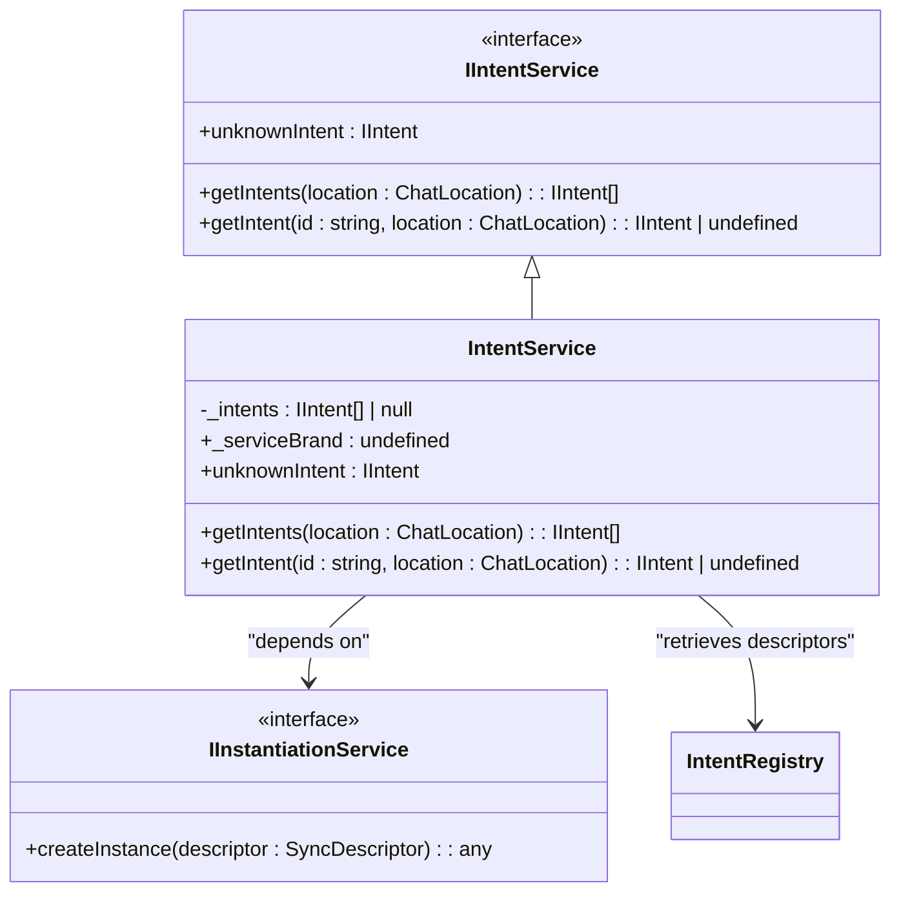
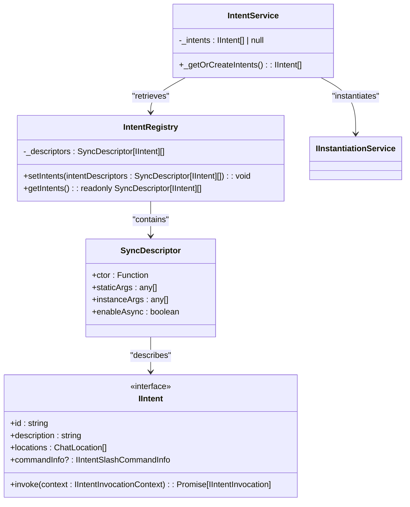
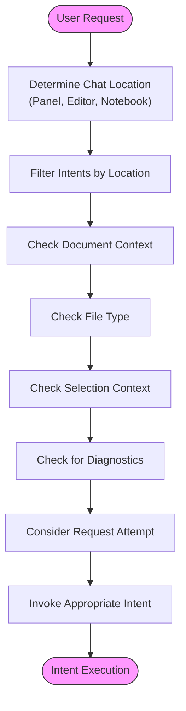

# Intent Detection

<cite>
**Referenced Files in This Document**   
- [intentService.ts](file://src/extension/intents/node/intentService.ts)
- [intentRegistry.ts](file://src/extension/prompt/node/intentRegistry.ts)
- [intents.ts](file://src/extension/prompt/node/intents.ts)
- [allIntents.ts](file://src/extension/intents/node/allIntents.ts)
- [generateCodeIntent.ts](file://src/extension/intents/node/generateCodeIntent.ts)
- [explainIntent.ts](file://src/extension/intents/node/explainIntent.ts)
- [fixIntent.ts](file://src/extension/intents/node/fixIntent.ts)
- [searchIntent.ts](file://src/extension/intents/node/searchIntent.ts)
- [docIntent.tsx](file://src/extension/intents/node/docIntent.tsx)
- [editCodeIntent.ts](file://src/extension/intents/node/editCodeIntent.ts)
- [unknownIntent.ts](file://src/extension/intents/node/unknownIntent.ts)
</cite>

## Table of Contents
1. [Introduction](#introduction)
2. [Intent Service Architecture](#intent-service-architecture)
3. [Intent Registration System](#intent-registration-system)
4. [Core Intent Categories](#core-intent-categories)
5. [Context-Aware Matching Algorithm](#context-aware-matching-algorithm)
6. [Intent Confidence Scoring and Ambiguity Resolution](#intent-confidence-scoring-and-ambiguity-resolution)
7. [Natural Language Query Mapping](#natural-language-query-mapping)
8. [Fallback Mechanisms](#fallback-mechanisms)
9. [Conclusion](#conclusion)

## Introduction
The intent detection system in vscode-copilot-chat is a sophisticated framework designed to analyze user input and classify requests into specific action categories such as code generation, explanation, refactoring, or debugging. This system serves as the foundation for the AI assistant's ability to understand and respond appropriately to user queries in various contexts within the Visual Studio Code environment. The IntentService component plays a central role in this process, orchestrating the identification and execution of appropriate intents based on user input, workspace state, file type, and selection context.

**Section sources**
- [intentService.ts](file://src/extension/intents/node/intentService.ts#L1-L58)
- [intents.ts](file://src/extension/prompt/node/intents.ts#L1-L400)

## Intent Service Architecture
The IntentService is the core component responsible for managing and providing access to all registered intents within the system. Implemented as a service with the identifier `IIntentService`, it follows a singleton pattern to ensure consistent access to intent functionality throughout the application. The service maintains a collection of intent instances that are lazily initialized upon first access, optimizing performance by deferring instantiation until needed.

The architecture follows a dependency injection pattern, with the IntentService constructor accepting an `IInstantiationService` parameter that handles the creation of intent instances. This design promotes loose coupling and testability. The service provides three primary methods: `getIntents(location)` returns all intents applicable to a specific chat location (panel, editor, or notebook), `getIntent(id, location)` retrieves a specific intent by identifier and location, and `unknownIntent` provides access to a fallback intent for unclassified requests.

**Diagram sources **
- [intentService.ts](file://src/extension/intents/node/intentService.ts#L14-L58)
- [intentRegistry.ts](file://src/extension/prompt/node/intentRegistry.ts#L19-L30)

**Section sources**
- [intentService.ts](file://src/extension/intents/node/intentService.ts#L6-L58)

## Intent Registration System
The intent registration system in vscode-copilot-chat is built around the IntentRegistry singleton, which maintains a collection of intent descriptors that can be instantiated as needed. This registry-based approach allows for a modular and extensible system where new intents can be added without modifying core service code. The registration process occurs in the `allIntents.ts` file, where all available intents are registered with the IntentRegistry using `SyncDescriptor` objects.

Each intent is registered with specific metadata including its identifier, description, supported locations (panel, editor, or notebook), and optional command information. The registration system supports conditional enablement through properties like `defaultEnablement`, allowing certain intents to be enabled only in specific environments such as pre-release versions. The use of descriptors rather than direct instances enables lazy instantiation, improving startup performance and memory efficiency.

**Diagram sources **
- [intentRegistry.ts](file://src/extension/prompt/node/intentRegistry.ts#L19-L30)
- [allIntents.ts](file://src/extension/intents/node/allIntents.ts#L33-L57)
- [intentService.ts](file://src/extension/intents/node/intentService.ts#L33-L38)

**Section sources**
- [intentRegistry.ts](file://src/extension/prompt/node/intentRegistry.ts#L19-L30)
- [allIntents.ts](file://src/extension/intents/node/allIntents.ts#L6-L57)

## Core Intent Categories
The system implements several core intent categories, each designed to handle specific types of user requests. These intents are implemented as classes that conform to the `IIntent` interface, providing a consistent API for invocation and execution. The primary intent categories include code generation, explanation, fixing, searching, and documentation.

The `GenerateCodeIntent` handles requests for new code creation, restricted to the editor location and hidden from user-facing command lists. The `ExplainIntent` provides code explanations and adapts its behavior based on whether it's invoked in the panel or editor context. The `FixIntent` addresses code issues and incorporates diagnostic information when available. The `SearchIntent` generates workspace search queries, while the `DocIntent` focuses on generating documentation for code elements.

```mermaid
classDiagram
class IIntent {
<<interface>>
+id : string
+description : string
+locations : ChatLocation[]
+commandInfo? : IIntentSlashCommandInfo
+invoke(context : IIntentInvocationContext) : Promise[IIntentInvocation]
}
class GenerateCodeIntent {
+id : string
+description : string
+locations : ChatLocation[]
+commandInfo : IIntentSlashCommandInfo
+invoke(context : IIntentInvocationContext) : Promise[IIntentInvocation]
}
class ExplainIntent {
+id : string
+description : string
+locations : ChatLocation[]
+commandInfo? : IIntentSlashCommandInfo
+invoke(context : IIntentInvocationContext) : Promise[IIntentInvocation]
}
class FixIntent {
+id : string
+description : string
+locations : ChatLocation[]
+commandInfo : IIntentSlashCommandInfo
+invoke(context : IIntentInvocationContext) : Promise[IIntentInvocation]
}
class SearchIntent {
+id : string
+description : string
+locations : ChatLocation[]
+commandInfo : IIntentSlashCommandInfo
+invoke(context : IIntentInvocationContext) : Promise[IIntentInvocation]
}
class DocIntent {
+id : string
+description : string
+locations : ChatLocation[]
+invoke(context : IIntentInvocationContext) : Promise[IIntentInvocation]
}
IIntent <|-- GenerateCodeIntent
IIntent <|-- ExplainIntent
IIntent <|-- FixIntent
IIntent <|-- SearchIntent
IIntent <|-- DocIntent
class EditCodeIntent {
+id : string
+description : string
+locations : ChatLocation[]
+invoke(context : IIntentInvocationContext) : Promise[IIntentInvocation]
}
IIntent <|-- EditCodeIntent
```

**Diagram sources **
- [generateCodeIntent.ts](file://src/extension/intents/node/generateCodeIntent.ts#L16-L39)
- [explainIntent.ts](file://src/extension/intents/node/explainIntent.ts#L68-L91)
- [fixIntent.ts](file://src/extension/intents/node/fixIntent.ts#L22-L64)
- [searchIntent.ts](file://src/extension/intents/node/searchIntent.ts#L145-L168)
- [docIntent.tsx](file://src/extension/intents/node/docIntent.tsx)
- [editCodeIntent.ts](file://src/extension/intents/node/editCodeIntent.ts)

**Section sources**
- [generateCodeIntent.ts](file://src/extension/intents/node/generateCodeIntent.ts#L6-L39)
- [explainIntent.ts](file://src/extension/intents/node/explainIntent.ts#L6-L91)
- [fixIntent.ts](file://src/extension/intents/node/fixIntent.ts#L6-L64)
- [searchIntent.ts](file://src/extension/intents/node/searchIntent.ts#L6-L168)

## Context-Aware Matching Algorithm
The context-aware matching algorithm in vscode-copilot-chat considers multiple factors when determining the appropriate intent for a user request. The system evaluates workspace state, file type, selection context, and chat location to make informed decisions about intent classification. This contextual awareness is implemented through the `IIntentInvocationContext` interface, which provides comprehensive information about the current environment to each intent during invocation.

The algorithm first filters intents based on the chat location (panel, editor, or notebook), ensuring that only location-appropriate intents are considered. It then examines the document context, including the active file type and any selected code, to further refine intent selection. For example, the `FixIntent` checks for diagnostic information when available, while the `ExplainIntent` adapts its behavior based on whether code is selected. The system also considers the request attempt number, enabling different strategies for initial requests versus retries.

**Diagram sources **
- [intentService.ts](file://src/extension/intents/node/intentService.ts#L49-L55)
- [explainIntent.ts](file://src/extension/intents/node/explainIntent.ts#L82-L89)
- [fixIntent.ts](file://src/extension/intents/node/fixIntent.ts#L36-L63)
- [intents.ts](file://src/extension/prompt/node/intents.ts#L37-L53)

**Section sources**
- [intentService.ts](file://src/extension/intents/node/intentService.ts#L49-L55)
- [explainIntent.ts](file://src/extension/intents/node/explainIntent.ts#L82-L89)
- [fixIntent.ts](file://src/extension/intents/node/fixIntent.ts#L36-L63)

## Intent Confidence Scoring and Ambiguity Resolution
The system employs a sophisticated approach to intent confidence scoring and ambiguity resolution, though explicit confidence values are not directly exposed in the code. Instead, confidence is implicitly managed through the registration and prioritization system. The order of intent registration in `allIntents.ts` may influence resolution priority, with earlier-registered intents potentially taking precedence in ambiguous situations.

Ambiguity resolution is handled through several mechanisms: location filtering restricts intents to appropriate contexts, command information provides additional specificity, and the `unknownIntent` serves as a fallback for unclassified requests. When multiple intents could potentially match a request, the system relies on the specificity of the intent's implementation and its contextual awareness to determine the most appropriate match. For example, the `FixIntent` specifically checks for diagnostic information, making it more likely to be selected when errors are present in the code.

The system also handles ambiguity through adaptive behavior within individual intents. The `ExplainIntent`, for instance, provides different invocation contexts for panel versus inline usage, allowing it to adapt its behavior based on the specific context. This contextual adaptation reduces ambiguity by ensuring that the same intent can serve multiple purposes while maintaining clear boundaries between them.

**Section sources**
- [intentService.ts](file://src/extension/intents/node/intentService.ts#L40-L47)
- [unknownIntent.ts](file://src/extension/intents/node/unknownIntent.ts)
- [intents.ts](file://src/extension/prompt/node/intents.ts#L54-L104)

## Natural Language Query Mapping
The system maps natural language queries to specific intents through a combination of command-based routing and contextual analysis. While the codebase doesn't reveal a traditional natural language processing pipeline, it uses a structured approach to interpret user requests. The `commandInfo` property in the `IIntent` interface suggests a command-based system where specific phrases or commands trigger particular intents.

For example, the `SearchIntent` has a `commandInfo` configuration that specifies it doesn't allow empty arguments and is only enabled in pre-release versions, indicating a controlled command interface. The `GenerateCodeIntent` is explicitly hidden from users, suggesting it's triggered by specific contextual cues rather than direct commands. The system likely uses pattern matching on user input to identify keywords and phrases associated with specific intents, combined with the contextual factors discussed earlier.

The mapping process is further refined by the invocation context, which includes the user's query text. Intents can analyze this query to determine relevance and confidence. For compound requests, the system may either select the most relevant intent based on contextual factors or potentially chain multiple intents together, though the latter behavior isn't explicitly evident in the provided code.

**Section sources**
- [searchIntent.ts](file://src/extension/intents/node/searchIntent.ts#L152-L156)
- [generateCodeIntent.ts](file://src/extension/intents/node/generateCodeIntent.ts#L23-L24)
- [intents.ts](file://src/extension/prompt/node/intents.ts#L27-L35)

## Fallback Mechanisms
The intent detection system implements robust fallback mechanisms to handle cases where user requests cannot be confidently classified. The primary fallback is the `unknownIntent`, which is guaranteed to be available through the `unknownIntent` property on the `IntentService`. This ensures that even when no specific intent matches a user request, the system can still provide a response rather than failing silently.

The `unknownIntent` is explicitly registered in the `allIntents.ts` file and is retrieved by ID in the `IntentService`. If the unknown intent cannot be found, the system throws an error, indicating the critical importance of this fallback mechanism. This design ensures that users always receive feedback, even for unrecognized requests, maintaining a positive user experience.

Additional fallback behaviors are implemented within specific intents. For example, the `ExplainIntent` provides a default query when the user's input is empty, ensuring that the intent can still proceed with a reasonable assumption about the user's intent. The system also uses progressive enhancement, where initial responses may be more general but can be refined through follow-up interactions.

**Section sources**
- [intentService.ts](file://src/extension/intents/node/intentService.ts#L40-L47)
- [allIntents.ts](file://src/extension/intents/node/allIntents.ts#L46)
- [explainIntent.ts](file://src/extension/intents/node/explainIntent.ts#L40-L42)

## Conclusion
The intent detection system in vscode-copilot-chat represents a sophisticated and well-architected approach to classifying user requests in a code editing environment. By combining a registry-based intent management system with context-aware matching algorithms, the system effectively routes user queries to appropriate handlers based on location, file type, selection context, and other environmental factors. The modular design allows for easy extension with new intents while maintaining a consistent interface and behavior across all functionality.

The system's strength lies in its contextual awareness and adaptive behavior, enabling it to provide relevant responses across different usage scenarios. The fallback mechanisms ensure robustness, while the separation of intent registration from execution promotes maintainability and testability. This architecture provides a solid foundation for an AI assistant that can understand and respond appropriately to a wide range of developer needs within the Visual Studio Code environment.