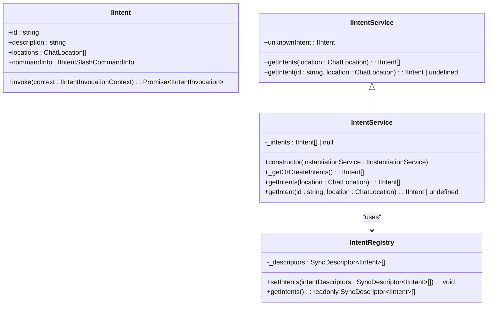
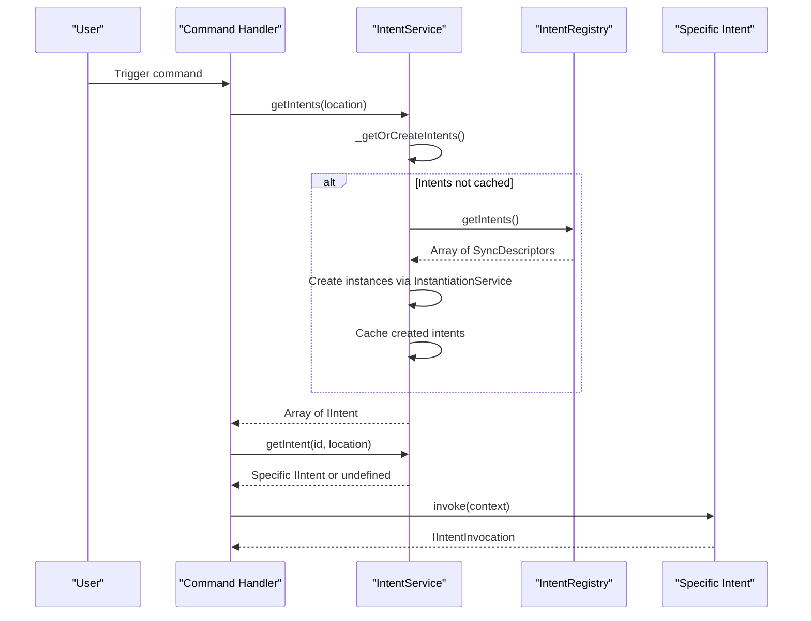
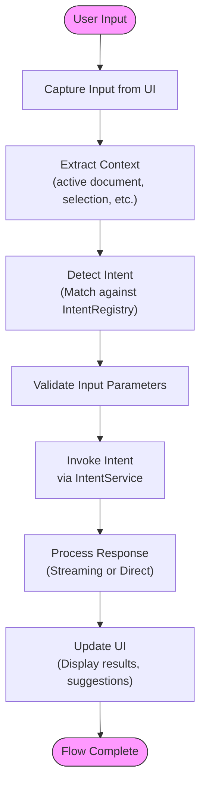
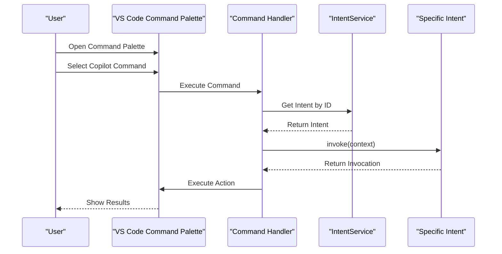
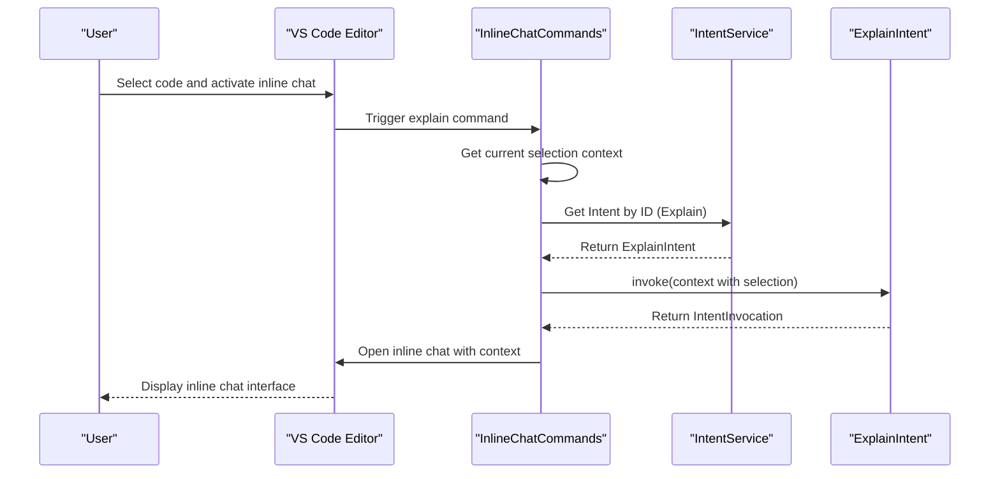
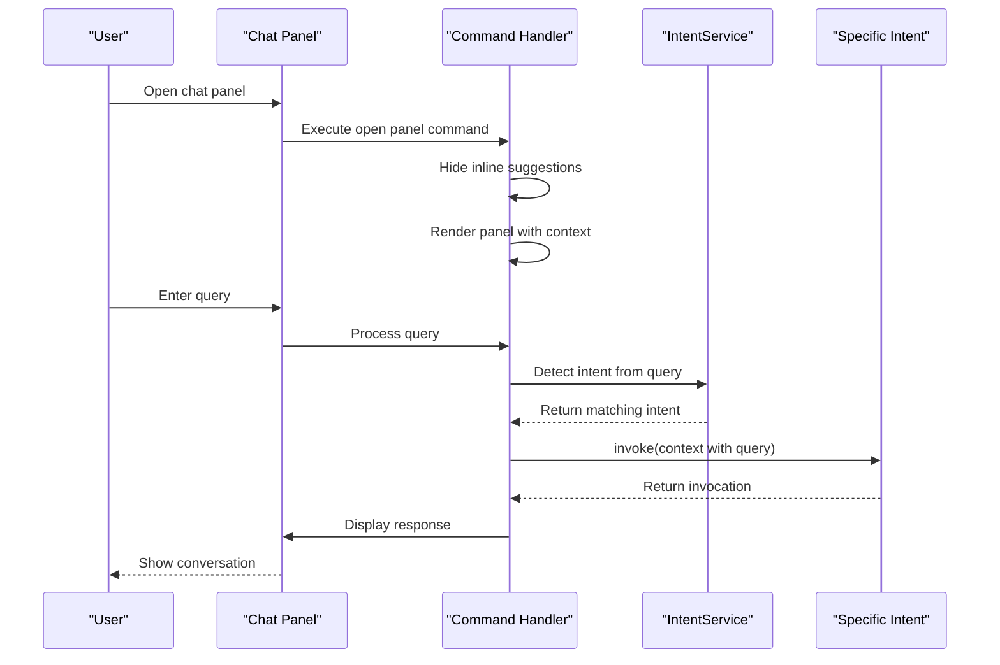
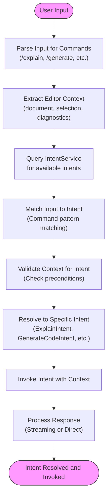

# User Input Flow

<cite>
**Referenced Files in This Document**   
- [intentService.ts](file://src/extension/intents/node/intentService.ts)
- [inlineChatCommands.ts](file://src/extension/inlineChat/vscode-node/inlineChatCommands.ts)
- [common.ts](file://src/extension/completions-core/vscode-node/extension/src/copilotPanel/common.ts)
- [intents.ts](file://src/extension/prompt/node/intents.ts)
- [intentRegistry.ts](file://src/extension/prompt/node/intentRegistry.ts)
- [allIntents.ts](file://src/extension/intents/node/allIntents.ts)
- [explainIntent.ts](file://src/extension/intents/node/explainIntent.ts)
- [generateCodeIntent.ts](file://src/extension/intents/node/generateCodeIntent.ts)
- [docIntent.tsx](file://src/extension/intents/node/docIntent.tsx)
</cite>

## Table of Contents
1. [Introduction](#introduction)
2. [Input Entry Points](#input-entry-points)
3. [Intent Detection System](#intent-detection-system)
4. [Intent Service Architecture](#intent-service-architecture)
5. [User Input Processing Flow](#user-input-processing-flow)
6. [Command Palette Integration](#command-palette-integration)
7. [Inline Chat Input Handling](#inline-chat-input-handling)
8. [Panel Chat Input Handling](#panel-chat-input-handling)
9. [Intent Classification and Resolution](#intent-classification-and-resolution)
10. [Performance Considerations](#performance-considerations)

## Introduction
The user input flow in vscode-copilot-chat is a sophisticated system that captures user interactions from multiple entry points including chat panels, inline chat, and command palette. This documentation details the complete pathway from user interaction through event handling to intent detection, explaining how user inputs are captured, processed, and classified into specific actions such as code generation, explanation, or refactoring. The system leverages the IntentService to classify user requests and routes them appropriately through the extension's architecture.

## Input Entry Points
The vscode-copilot-chat extension provides multiple entry points for user input, each with specific handling mechanisms:

1. **Chat Panel**: The primary interface for conversational interactions, accessible via the sidebar
2. **Inline Chat**: Contextual chat interface available directly in the editor 
3. **Command Palette**: Quick access to common Copilot commands through VS Code's command palette
4. **Editor Context Menu**: Right-click menu options for specific actions
5. **Keyboard Shortcuts**: Direct keyboard access to common functions

Each entry point captures user input and routes it through the intent detection system for appropriate processing.

**Section sources**
- [inlineChatCommands.ts](file://src/extension/inlineChat/vscode-node/inlineChatCommands.ts#L283-L313)
- [common.ts](file://src/extension/completions-core/vscode-node/extension/src/copilotPanel/common.ts#L37-L48)

## Intent Detection System
The intent detection system is the core component responsible for classifying user requests into specific actions. It analyzes user input to determine the appropriate action to take, such as code generation, explanation, or refactoring. The system uses a registry of available intents and matches user input against these registered intents based on command patterns and context.

The intent detection process involves several key components:
- **Intent Registry**: Maintains a collection of all available intents in the system
- **Intent Service**: Provides the interface for retrieving and invoking intents
- **Intent Invocation**: Handles the execution of a specific intent with appropriate context

**Diagram sources**
- [intentService.ts](file://src/extension/intents/node/intentService.ts#L14-L57)
- [intents.ts](file://src/extension/prompt/node/intents.ts#L54-L87)
- [intentRegistry.ts](file://src/extension/prompt/node/intentRegistry.ts#L19-L28)

## Intent Service Architecture
The IntentService is the central component responsible for managing and providing access to all available intents in the system. It implements the IIntentService interface and serves as a factory for creating intent instances. The service maintains a cache of intents to avoid repeated instantiation and provides methods for retrieving intents based on location and ID.

The IntentService architecture follows a lazy initialization pattern, where intents are only created when first requested. This improves startup performance by deferring the creation of intent instances until they are actually needed.

**Diagram sources**
- [intentService.ts](file://src/extension/intents/node/intentService.ts#L24-L57)
- [intentRegistry.ts](file://src/extension/prompt/node/intentRegistry.ts#L19-L28)
- [allIntents.ts](file://src/extension/intents/node/allIntents.ts#L33-L57)

## User Input Processing Flow
The user input processing flow follows a consistent pattern across different entry points, with variations based on the specific context. The general flow involves capturing the user input, determining the appropriate intent, and invoking the corresponding handler.

The processing flow includes several key steps:
1. Input capture from the user interface
2. Context extraction (active document, selection, etc.)
3. Intent detection and classification
4. Intent invocation with appropriate context
5. Response handling and UI updates

**Diagram sources**
- [inlineChatCommands.ts](file://src/extension/inlineChat/vscode-node/inlineChatCommands.ts#L56-L112)
- [intentService.ts](file://src/extension/intents/node/intentService.ts#L30-L37)
- [intents.ts](file://src/extension/prompt/node/intents.ts#L165-L196)

## Command Palette Integration
The command palette integration allows users to access Copilot functionality through VS Code's command palette. This provides a quick way to invoke common actions without navigating to specific UI elements. The integration registers multiple commands that map to specific intents and actions.

Key command palette commands include:
- `github.copilot.chat.explain`: Explain the selected code
- `github.copilot.chat.generate`: Generate new code
- `github.copilot.chat.fix`: Fix issues in the selected code
- `github.copilot.chat.review`: Review the current code
- `github.copilot.chat.generateTests`: Generate tests for the current code

Each command is registered with the VS Code command system and maps to a specific handler function that processes the request and invokes the appropriate intent.

**Diagram sources**
- [inlineChatCommands.ts](file://src/extension/inlineChat/vscode-node/inlineChatCommands.ts#L283-L313)
- [common.ts](file://src/extension/completions-core/vscode-node/extension/src/copilotPanel/common.ts#L37-L48)

## Inline Chat Input Handling
The inline chat input handling system provides contextual assistance directly within the code editor. When activated, it captures the current selection and surrounding context to provide relevant suggestions and actions. The inline chat system is particularly useful for code explanation, generation, and refactoring tasks.

The inline chat input flow involves:
1. Activation via command or keyboard shortcut
2. Capture of current selection and document context
3. Presentation of inline chat interface
4. Processing of user input through intent detection
5. Display of results directly in the editor context

**Diagram sources**
- [inlineChatCommands.ts](file://src/extension/inlineChat/vscode-node/inlineChatCommands.ts#L56-L112)
- [explainIntent.ts](file://src/extension/intents/node/explainIntent.ts#L68-L90)

## Panel Chat Input Handling
The panel chat input handling system provides a dedicated interface for conversational interactions with Copilot. Unlike inline chat, which is context-specific to the current editor, the panel chat provides a more general conversational interface that can handle a wider range of queries and commands.

The panel chat input flow involves:
1. Opening the chat panel via command or UI element
2. Displaying the chat interface with conversation history
3. Capturing user input from the chat input field
4. Processing input through intent detection
5. Displaying responses in the chat panel

**Diagram sources**
- [common.ts](file://src/extension/completions-core/vscode-node/extension/src/copilotPanel/common.ts#L31-L65)
- [inlineChatCommands.ts](file://src/extension/inlineChat/vscode-node/inlineChatCommands.ts#L56-L112)

## Intent Classification and Resolution
The intent classification and resolution system is responsible for mapping user input to specific actions. This process involves analyzing the input text, extracting command information, and matching against registered intents. The system supports both explicit commands (prefixed with '/') and implicit requests based on natural language patterns.

The classification process follows these steps:
1. Parse input for command prefixes and parameters
2. Extract context from the current editor state
3. Query IntentService for available intents at the current location
4. Match input against intent command patterns
5. Return the appropriate intent for invocation

**Diagram sources**
- [intentService.ts](file://src/extension/intents/node/intentService.ts#L49-L56)
- [intents.ts](file://src/extension/prompt/node/intents.ts#L54-L87)
- [explainIntent.ts](file://src/extension/intents/node/explainIntent.ts#L68-L90)
- [generateCodeIntent.ts](file://src/extension/intents/node/generateCodeIntent.ts#L16-L38)

## Performance Considerations
The user input flow system incorporates several performance optimizations to ensure responsive interactions and minimize latency:

1. **Lazy Initialization**: Intents are only instantiated when first requested, reducing startup time
2. **Intent Caching**: The IntentService caches created intent instances to avoid repeated instantiation
3. **Asynchronous Processing**: Input handling and intent invocation are performed asynchronously to prevent UI blocking
4. **Streaming Responses**: Responses from the language model are processed and displayed as they stream in, providing immediate feedback
5. **Context Optimization**: Only necessary context is extracted and passed to intents to minimize processing overhead

The system also implements error handling and fallback mechanisms to maintain responsiveness even when individual components fail. This includes timeout handling for slow operations and graceful degradation when certain features are unavailable.

**Section sources**
- [intentService.ts](file://src/extension/intents/node/intentService.ts#L27-L38)
- [intents.ts](file://src/extension/prompt/node/intents.ts#L269-L287)
- [inlineChatCommands.ts](file://src/extension/inlineChat/vscode-node/inlineChatCommands.ts#L366-L376)