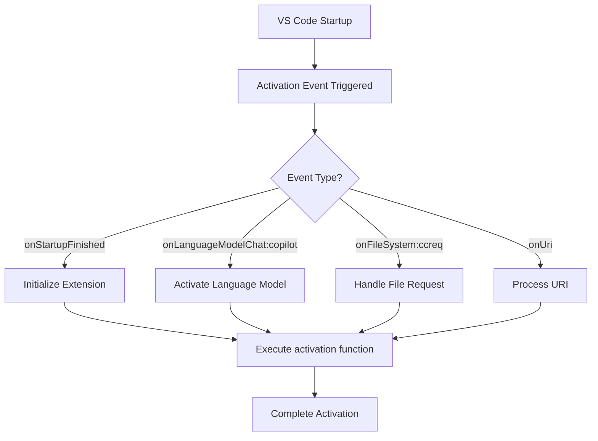
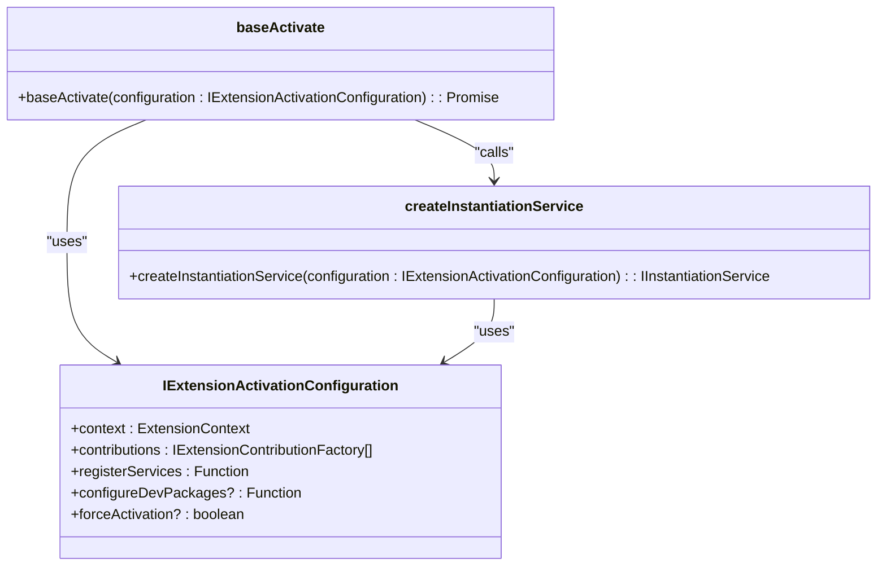
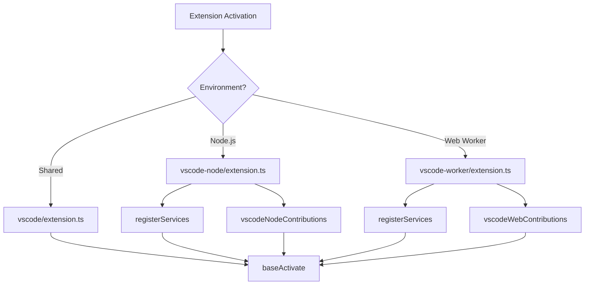
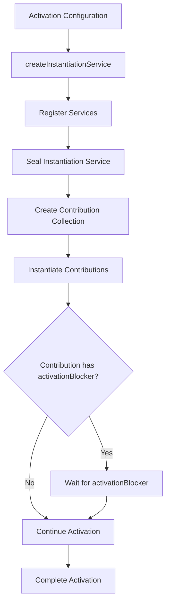
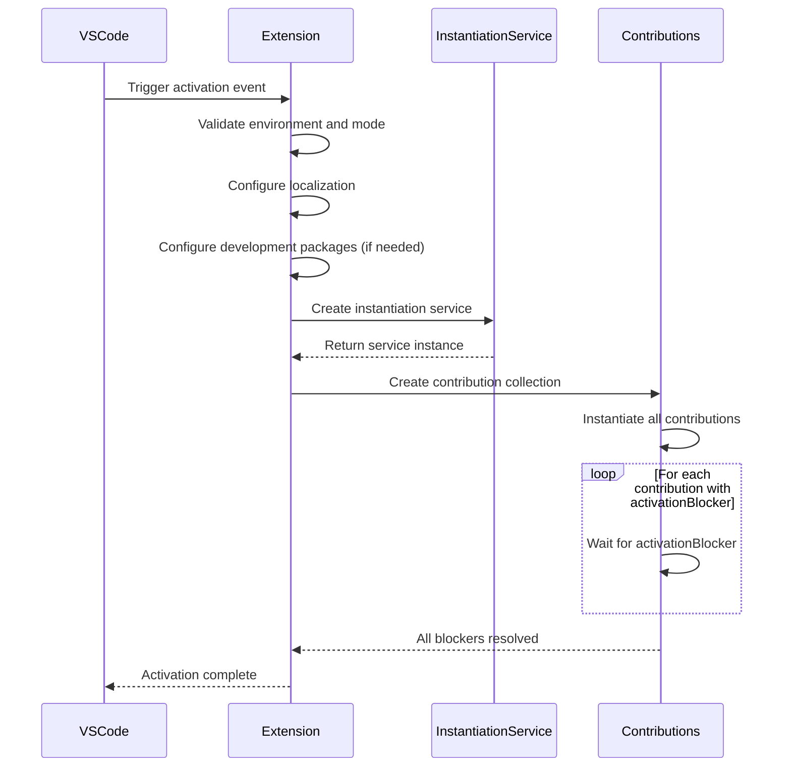
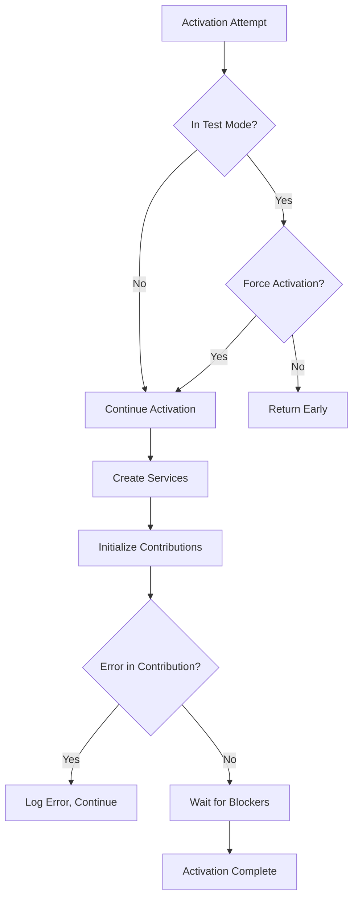

# Extension Activation Process

<cite>
**Referenced Files in This Document**   
- [package.json](file://package.json)
- [src/extension/extension/vscode/extension.ts](file://src/extension/extension/vscode/extension.ts)
- [src/extension/extension/vscode-node/extension.ts](file://src/extension/extension/vscode-node/extension.ts)
- [src/extension/extension/vscode-worker/extension.ts](file://src/extension/extension/vscode-worker/extension.ts)
- [src/extension/extension/vscode/contributions.ts](file://src/extension/extension/vscode/contributions.ts)
- [src/extension/extension/vscode-node/contributions.ts](file://src/extension/extension/vscode-node/contributions.ts)
- [src/extension/telemetry/common/lifecycleTelemetryContrib.ts](file://src/extension/telemetry/common/lifecycleTelemetryContrib.ts)
- [src/extension/common/contributions.ts](file://src/extension/common/contributions.ts)
</cite>

## Table of Contents
1. [Introduction](#introduction)
2. [Activation Events and Entry Points](#activation-events-and-entry-points)
3. [Core Activation Architecture](#core-activation-architecture)
4. [Multi-Environment Activation Strategy](#multi-environment-activation-strategy)
5. [Service Registration and Dependency Management](#service-registration-and-dependency-management)
6. [Lazy Loading and Performance Optimization](#lazy-loading-and-performance-optimization)
7. [Activation Sequence and Timing](#activation-sequence-and-timing)
8. [Common Activation Issues and Recovery](#common-activation-issues-and-recovery)
9. [Best Practices for Extension Authors](#best-practices-for-extension-authors)
10. [Conclusion](#conclusion)

## Introduction
The extension activation process in vscode-copilot-chat follows a sophisticated multi-layered architecture designed to support different execution environments while maintaining code reusability and performance. The activation lifecycle begins when VS Code loads the extension based on predefined activation events and proceeds through a series of initialization steps that register services, contributions, and event listeners. This document provides a comprehensive analysis of the activation process, detailing how the extension adapts to various contexts (UI, node, worker), implements lazy loading strategies, and handles dependencies across different environments.

**Section sources**
- [package.json](file://package.json#L81-L87)
- [src/extension/extension/vscode/extension.ts](file://src/extension/extension/vscode/extension.ts#L17-L23)

## Activation Events and Entry Points
The extension defines multiple activation events in its package.json file that trigger the activation process under different conditions. These events include "onStartupFinished", "onLanguageModelChat:copilot", "onUri", "onFileSystem:ccreq", "onFileSystem:ccsettings", and "onCustomAgentsProvider". The "onStartupFinished" event ensures the extension activates after VS Code has completed its startup process, while language model and file system events trigger activation when specific Copilot-related functionality is needed.

The main entry point for the extension is specified in the "main" field of package.json as "./dist/extension", which points to the compiled extension code. The activation process begins with environment-specific entry points that delegate to shared activation logic, allowing for both environment-specific initialization and code reuse across platforms.

**Diagram sources**
- [package.json](file://package.json#L81-L87)
- [src/extension/extension/vscode-node/extension.ts](file://src/extension/extension/vscode-node/extension.ts#L35-L43)

**Section sources**
- [package.json](file://package.json#L81-L87)
- [src/extension/extension/vscode-node/extension.ts](file://src/extension/extension/vscode-node/extension.ts#L35-L43)

## Core Activation Architecture
The core activation architecture follows a modular design pattern with shared and environment-specific components. The base activation logic is implemented in `src/extension/extension/vscode/extension.ts` through the `baseActivate` function, which serves as the central activation point for all environments. This shared code handles common initialization tasks and provides a consistent activation interface across different execution contexts.

The activation process is configured through the `IExtensionActivationConfiguration` interface, which defines the essential components needed for activation: the extension context, contribution factories, service registration function, and optional configuration for development packages. This configuration-driven approach allows different environments to customize their activation while sharing the same core logic.

**Diagram sources**
- [src/extension/extension/vscode/extension.ts](file://src/extension/extension/vscode/extension.ts#L25-L31)

**Section sources**
- [src/extension/extension/vscode/extension.ts](file://src/extension/extension/vscode/extension.ts#L25-L31)

## Multi-Environment Activation Strategy
The extension employs a sophisticated multi-environment activation strategy that supports different execution contexts through specialized entry points. Three distinct activation paths exist for different environments:

1. **Node.js Environment**: Implemented in `src/extension/extension/vscode-node/extension.ts`, this path handles activation in the Node.js extension host with access to file system and network operations.

2. **Web Worker Environment**: Implemented in `src/extension/extension/vscode-worker/extension.ts`, this path handles activation in web worker contexts with limited access to certain APIs.

3. **Shared Environment**: Implemented in `src/extension/extension/vscode/extension.ts`, this shared code provides common functionality for both Node.js and web environments.

Each environment-specific entry point imports the shared `baseActivate` function and provides environment-specific configuration, including the appropriate contribution factories and service registration functions. This architectural pattern enables code reuse while allowing for environment-specific optimizations and feature sets.

**Diagram sources**
- [src/extension/extension/vscode-node/extension.ts](file://src/extension/extension/vscode-node/extension.ts#L8-L11)
- [src/extension/extension/vscode-worker/extension.ts](file://src/extension/extension/vscode-worker/extension.ts#L7-L9)

**Section sources**
- [src/extension/extension/vscode-node/extension.ts](file://src/extension/extension/vscode-node/extension.ts#L8-L11)
- [src/extension/extension/vscode-worker/extension.ts](file://src/extension/extension/vscode-worker/extension.ts#L7-L9)

## Service Registration and Dependency Management
Service registration and dependency management are critical components of the extension's activation process. The `createInstantiationService` function in `src/extension/extension/vscode/extension.ts` is responsible for creating an instantiation service that manages the lifecycle of services and their dependencies. This service uses a builder pattern to register services before sealing the container, ensuring that all dependencies are properly resolved before activation completes.

The extension implements a hierarchical contribution system where contributions are organized by environment. The shared `vscode/contributions.ts` file contains contributions that run in both web and node.js environments, while environment-specific contribution files (like `vscode-node/contributions.ts`) contain contributions specific to their respective environments. This approach ensures that only necessary components are loaded in each environment, optimizing performance and resource usage.

**Diagram sources**
- [src/extension/extension/vscode/extension.ts](file://src/extension/extension/vscode/extension.ts#L92-L107)
- [src/extension/common/contributions.ts](file://src/extension/common/contributions.ts#L41-L78)

**Section sources**
- [src/extension/extension/vscode/extension.ts](file://src/extension/extension/vscode/extension.ts#L92-L107)
- [src/extension/common/contributions.ts](file://src/extension/common/contributions.ts#L41-L78)

## Lazy Loading and Performance Optimization
The extension implements several lazy loading and performance optimization strategies to minimize startup time and resource usage. The activation process includes conditional checks that prevent unnecessary initialization in test environments, as seen in the `baseActivate` function which returns early when running in ExtensionMode.Test without force activation.

The contribution system supports activation blockers through the `activationBlocker` property on `IExtensionContribution`. This allows certain contributions to delay the completion of the activation process until their initialization is complete, but the system is designed to minimize the use of activation blockers to avoid slowing down startup. The `ContributionCollection` class logs the duration of each activation blocker, providing visibility into performance impacts.

Environment-specific code splitting ensures that only the necessary code is loaded for each execution context. For example, the node.js-specific entry point imports only the services and contributions needed for that environment, reducing the memory footprint and initialization time in other contexts.

**Section sources**
- [src/extension/extension/vscode/extension.ts](file://src/extension/extension/vscode/extension.ts#L35-L38)
- [src/extension/common/contributions.ts](file://src/extension/common/contributions.ts#L60-L66)

## Activation Sequence and Timing
The activation sequence follows a well-defined order that ensures proper initialization of dependencies and services. The process begins with environment-specific entry points calling the shared `baseActivate` function, which performs the following steps in sequence:

1. Environment and mode validation
2. Localization configuration
3. Development package configuration (if needed)
4. Instantiation service creation
5. Contribution collection and initialization
6. Waiting for activation blockers
7. Return of extension API

The timing of activation is optimized through parallel execution of independent initialization tasks. The use of Promise.allSettled in the `waitForActivationBlockers` method allows multiple activation blockers to resolve concurrently, reducing overall activation time. The system also implements early returns for test environments and handles pre-release version checks to prevent activation in incompatible VS Code versions.

**Diagram sources**
- [src/extension/extension/vscode/extension.ts](file://src/extension/extension/vscode/extension.ts#L33-L90)

**Section sources**
- [src/extension/extension/vscode/extension.ts](file://src/extension/extension/vscode/extension.ts#L33-L90)

## Common Activation Issues and Recovery
The extension activation process includes several mechanisms to handle common issues and implement recovery strategies. One of the primary safeguards is the early return in test environments, which prevents the extension from fully activating during testing scenarios unless explicitly forced. This helps avoid bundling unnecessary code in test bundles and prevents interference with test execution.

The contribution system includes error handling that catches and logs errors during contribution instantiation, allowing the activation process to continue even if individual contributions fail. This graceful degradation ensures that partial functionality remains available even when some components cannot be initialized.

For dependency management, the system verifies that required dependencies are available before attempting activation, and includes specific error handling for missing or failed dependencies. The telemetry system also tracks activation events, providing valuable data for diagnosing activation issues in production environments.

**Diagram sources**
- [src/extension/extension/vscode/extension.ts](file://src/extension/extension/vscode/extension.ts#L35-L38)
- [src/extension/common/contributions.ts](file://src/extension/common/contributions.ts#L67-L69)

**Section sources**
- [src/extension/extension/vscode/extension.ts](file://src/extension/extension/vscode/extension.ts#L35-L38)
- [src/extension/common/contributions.ts](file://src/extension/common/contributions.ts#L67-L69)

## Best Practices for Extension Authors
Based on the analysis of the vscode-copilot-chat extension activation process, several best practices emerge for extension authors seeking to optimize activation performance and reliability:

1. **Use Shared Code for Common Functionality**: Follow the pattern of implementing shared activation logic in a common module (like `vscode/extension.ts`) that can be reused across different environments.

2. **Implement Environment-Specific Entry Points**: Create separate entry points for different execution contexts (node, web, worker) that delegate to shared logic while providing environment-specific configuration.

3. **Minimize Activation Blockers**: Use activation blockers sparingly and only when absolutely necessary, as they delay the completion of the activation process.

4. **Optimize for Test Environments**: Implement early returns or simplified initialization paths for test modes to avoid unnecessary work during testing.

5. **Use Hierarchical Contribution Management**: Organize contributions by environment and importance, loading only what's needed for each context.

6. **Implement Proper Error Handling**: Ensure that failures in individual components don't prevent the entire extension from activating, allowing for graceful degradation.

7. **Leverage Parallel Initialization**: Design initialization processes to allow parallel execution of independent tasks to reduce overall activation time.

8. **Monitor Activation Performance**: Include telemetry and logging to track activation duration and identify performance bottlenecks.

**Section sources**
- [src/extension/extension/vscode/extension.ts](file://src/extension/extension/vscode/extension.ts)
- [src/extension/common/contributions.ts](file://src/extension/common/contributions.ts)

## Conclusion
The extension activation process in vscode-copilot-chat demonstrates a sophisticated, well-architected approach to handling initialization across multiple environments. By separating concerns between shared and environment-specific code, implementing a flexible contribution system, and optimizing for performance through lazy loading and parallel execution, the extension achieves a balance between functionality and efficiency. The activation process is designed to be resilient, with proper error handling and recovery mechanisms that ensure reliability even in challenging conditions. This comprehensive approach serves as an excellent model for other VS Code extensions seeking to implement robust, high-performance activation strategies.