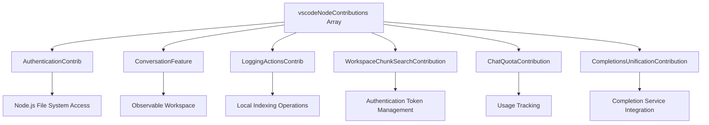
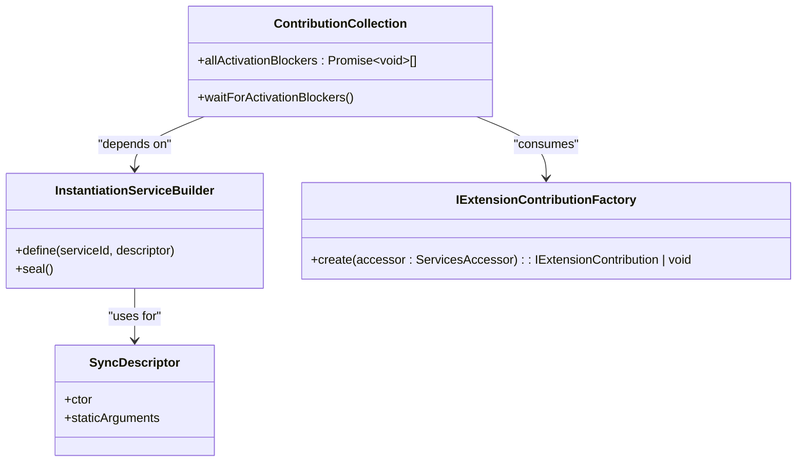

# Node Activation

<cite>
**Referenced Files in This Document**   
- [contributions.ts](file://src/extension/common/contributions.ts)
- [contributions.ts](file://src/extension/extension/vscode-node/contributions.ts)
- [chatLibMain.ts](file://src/lib/node/chatLibMain.ts)
</cite>

## Table of Contents
1. [Introduction](#introduction)
2. [Node.js Extension Host Context](#nodejs-extension-host-context)
3. [Initialization of Development Packages](#initialization-of-development-packages)
4. [Node-Specific Services and Contributions](#node-specific-services-and-contributions)
5. [Service Registration and Dependency Injection](#service-registration-and-dependency-injection)
6. [Security Implications of Environment Configuration](#security-implications-of-environment-configuration)
7. [Error Handling and Debugging](#error-handling-and-debugging)
8. [Performance Considerations](#performance-considerations)

## Introduction
This document provides a comprehensive analysis of the Node.js-specific activation process in the vscode-copilot-chat extension. It details how the Node.js extension host differs from other execution contexts, the initialization of development packages, configuration of Node-specific services, and the delegation pattern used for activation. The documentation also covers security considerations, error handling strategies, and performance implications of the activation process.

## Node.js Extension Host Context
The Node.js extension host provides a privileged execution environment that enables access to system-level APIs and file system operations that are not available in browser-based or worker contexts. This environment is specifically designed for extension components that require direct access to local resources, network operations, and cryptographic functions.

The architecture separates concerns between different execution contexts, with Node.js components handling backend operations while UI components run in separate contexts. This separation enhances security by isolating potentially sensitive operations to the Node.js host while maintaining responsive user interfaces in other contexts.

**Section sources**
- [contributions.ts](file://src/extension/extension/vscode-node/contributions.ts#L53-L124)

## Initialization of Development Packages
The activation process includes initialization of development packages with specific support for source maps and environment variable loading. Source map support enables effective debugging by mapping transpiled code back to its original source, while environment variable loading via dotenv provides configuration flexibility without requiring code changes.

The initialization sequence ensures that development tools are properly configured before other components attempt to use them, preventing race conditions and configuration errors. This process is particularly important for debugging scenarios where accurate stack traces and variable inspection are critical.

**Section sources**
- [chatLibMain.ts](file://src/lib/node/chatLibMain.ts#L335-L370)

## Node-Specific Services and Contributions
The Node.js activation process centers around the `vscodeNodeContributions` array, which contains factory functions for creating services that are specifically designed to run in the Node.js context. These contributions are registered through the `asContributionFactory` helper function, which wraps service constructors for proper instantiation via the dependency injection system.

The contributions include authentication services, chat quota management, workspace indexing, inline completion providers, and various telemetry and logging components. These services leverage Node.js capabilities such as file system access, network requests, and cryptographic operations that are not available in other execution contexts.

**Diagram sources**
- [contributions.ts](file://src/extension/extension/vscode-node/contributions.ts#L63-L96)

**Section sources**
- [contributions.ts](file://src/extension/extension/vscode-node/contributions.ts#L63-L124)

## Service Registration and Dependency Injection
The activation process utilizes a dependency injection system to manage service lifecycles and dependencies. The `InstantiationServiceBuilder` creates a container for service registration, where each service is defined with its dependencies and instantiation strategy. Services are registered with `SyncDescriptor` wrappers that specify constructor parameters and configuration options.

The registration process follows a hierarchical pattern where common services are defined first, followed by Node.js-specific implementations. This allows for proper dependency resolution and ensures that services are available when needed during the activation sequence. The system also supports asynchronous initialization through activation blockers that delay completion of the activation process until critical services are ready.

**Diagram sources**
- [contributions.ts](file://src/extension/common/contributions.ts#L41-L78)
- [chatLibMain.ts](file://src/lib/node/chatLibMain.ts#L335-L370)

**Section sources**
- [contributions.ts](file://src/extension/common/contributions.ts#L41-L78)
- [chatLibMain.ts](file://src/lib/node/chatLibMain.ts#L335-L370)

## Security Implications of Environment Configuration
The activation process includes security considerations for environment configuration, particularly regarding the loading of `.env` files. While the current implementation does not explicitly show dotenv usage, the architecture provides mechanisms for secure configuration management through the `ConfigurationService` and `ExperimentationService`.

The system isolates sensitive operations such as token management and authentication to specific services that follow security best practices. Token storage and retrieval are handled through dedicated services that minimize exposure and provide proper encryption where needed. The separation of concerns between different execution contexts also reduces the attack surface by limiting access to sensitive APIs.

**Section sources**
- [chatLibMain.ts](file://src/lib/node/chatLibMain.ts#L351-L356)

## Error Handling and Debugging
The activation process implements comprehensive error handling through structured logging, telemetry, and graceful degradation. Errors during service initialization are caught and logged without preventing the entire activation process from completing. The `ContributionCollection` class wraps contribution creation in try-catch blocks to ensure that failures in one component do not cascade to others.

Debugging support is provided through multiple mechanisms including detailed logging with configurable levels, request tracing, and performance monitoring. The system captures timing information for activation blockers, allowing developers to identify performance bottlenecks during startup. Telemetry events provide insights into activation success rates and error conditions across different environments.

**Section sources**
- [contributions.ts](file://src/extension/common/contributions.ts#L67-L69)

## Performance Considerations
The activation process balances functionality with performance through several optimization strategies. The use of activation blockers allows non-critical services to initialize asynchronously, preventing them from delaying the overall activation sequence. Services are instantiated on-demand rather than all at startup, reducing initial memory usage and startup time.

The dependency injection system optimizes service creation by reusing instances and resolving dependencies efficiently. The architecture also supports lazy loading of certain components, ensuring that resources are only consumed when actually needed. Performance monitoring is built into the activation process, with timing measurements for key operations that help identify optimization opportunities.

**Section sources**
- [contributions.ts](file://src/extension/common/contributions.ts#L60-L66)