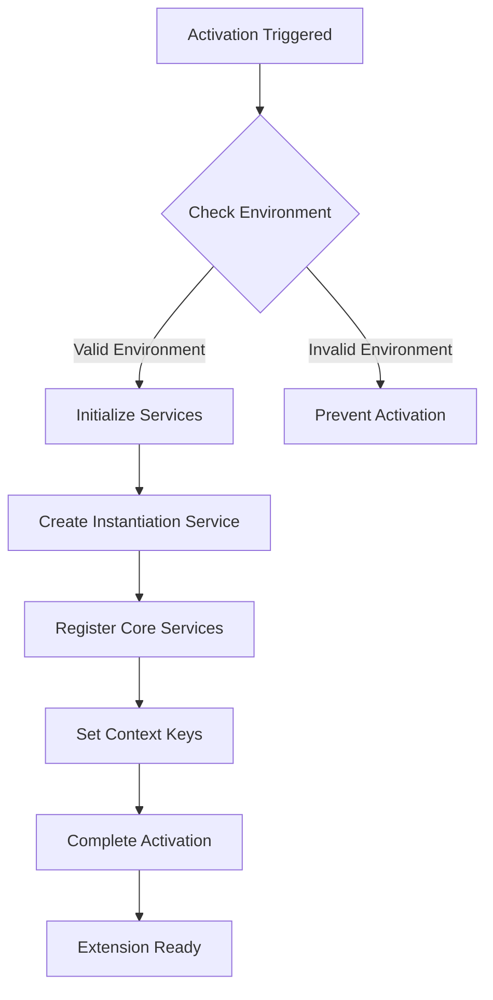

# UI Activation

<cite>
**Referenced Files in This Document**   
- [package.json](file://package.json)
- [src/extension/extension/vscode-node/extension.ts](file://src/extension/extension/vscode-node/extension.ts)
- [src/extension/extension/vscode-worker/extension.ts](file://src/extension/extension/vscode-worker/extension.ts)
- [src/vscodeTypes.ts](file://src/vscodeTypes.ts)
</cite>

## Table of Contents
1. [Introduction](#introduction)
2. [Activation Events and Entry Point](#activation-events-and-entry-point)
3. [Environment Detection and Pre-release Checks](#environment-detection-and-pre-release-checks)
4. [Service Initialization and Dependency Injection](#service-initialization-and-dependency-injection)
5. [Base Activation Function](#base-activation-function)
6. [Context Key Management](#context-key-management)
7. [Test Mode Handling](#test-mode-handling)
8. [Common UI Activation Issues and Troubleshooting](#common-ui-activation-issues-and-troubleshooting)

## Introduction
The UI activation process in vscode-copilot-chat is a comprehensive initialization sequence that establishes the extension's presence within the VS Code environment. This process involves loading localization bundles, detecting the runtime environment, performing pre-release version checks, creating the instantiation service, and registering core services through the dependency injection system. The activation is coordinated through the baseActivate function, which handles different runtime environments and ensures proper initialization across various contexts. This documentation details the complete activation workflow, including context key management, test mode handling, and common troubleshooting scenarios.

## Activation Events and Entry Point
The extension's activation is triggered by specific events defined in the package.json file. The main entry point for the extension is specified in the "main" field, which points to "./dist/extension". The activation events include "onStartupFinished", "onLanguageModelChat:copilot", "onUri", "onFileSystem:ccreq", "onFileSystem:ccsettings", and "onCustomAgentsProvider". These events ensure the extension activates at appropriate times during the VS Code lifecycle, such as when the startup process is complete or when specific language model chat features are requested.

**Section sources**
- [package.json](file://package.json#L81-L88)
- [package.json](file://package.json#L89)

## Environment Detection and Pre-release Checks
The activation process includes comprehensive environment detection and pre-release version checks to ensure compatibility and proper functionality. The extension checks for the presence of prerelease versions and prevents activation in unsupported configurations, such as when the prerelease version of the Copilot Chat extension is installed in VS Code Stable. This check is implemented to maintain stability, as rapid development of chat features may not be compatible with stable VS Code releases. The environment detection also includes checking for specific API proposals and ensuring the extension only activates in environments that support the required APIs.

**Section sources**
- [package.json](file://package.json#L1815)
- [package.json](file://package.json#L316-L327)

## Service Initialization and Dependency Injection
The extension creates an instantiation service during activation and registers core services through a dependency injection system. This system allows for modular and testable code by managing the lifecycle and dependencies of various components. The dependency injection framework ensures that services are properly instantiated and available when needed throughout the extension's execution. The service initialization process includes setting up the necessary context and registering providers for various extension features, ensuring that all components can access the services they require.

**Section sources**
- [src/extension/extension/vscode-node/extension.ts](file://src/extension/extension/vscode-node/extension.ts#L34)
- [src/extension/extension/vscode-worker/extension.ts](file://src/extension/extension/vscode-worker/extension.ts#L18)

## Base Activation Function
The baseActivate function serves as the central coordinator for the extension's activation across different runtime environments. It is responsible for handling the activation process in both node and worker contexts, ensuring consistent behavior regardless of the execution environment. The function takes an ExtensionContext parameter and an optional forceActivation flag, allowing for controlled activation under specific circumstances. This function orchestrates the initialization of various components, manages the activation sequence, and ensures that all necessary setup steps are completed before the extension becomes fully operational.

**Diagram sources **
- [src/extension/extension/vscode-node/extension.ts](file://src/extension/extension/vscode-node/extension.ts#L34)
- [src/extension/extension/vscode-worker/extension.ts](file://src/extension/extension/vscode-worker/extension.ts#L18)

**Section sources**
- [src/extension/extension/vscode-node/extension.ts](file://src/extension/extension/vscode-node/extension.ts#L34)
- [src/extension/extension/vscode-worker/extension.ts](file://src/extension/extension/vscode-worker/extension.ts#L18)

## Context Key Management
Context keys are set based on the extension's state and version compatibility to control UI elements and command availability. The activation process establishes various context keys that reflect the current status of the extension, such as whether it is activated, in test mode, or compatible with the current VS Code version. These context keys are used throughout the extension to enable or disable features, show or hide UI elements, and control the behavior of commands. The context key management ensures that the extension's interface accurately reflects its current state and capabilities.

**Section sources**
- [package.json](file://package.json#L1749)
- [package.json](file://package.json#L2051)
- [package.json](file://package.json#L2170)
- [package.json](file://package.json#L2176)

## Test Mode Handling
The activation process includes specific handling for test modes to prevent interference with normal extension operation during testing. Activation can be prevented during testing scenarios unless explicitly forced through the forceActivation parameter. This allows for controlled testing of the extension's functionality without affecting the user's normal workflow. The test mode handling ensures that the extension can be properly tested in isolation, with the ability to simulate various activation scenarios and verify the behavior under different conditions.

**Section sources**
- [src/extension/extension/vscode-node/extension.ts](file://src/extension/extension/vscode-node/extension.ts#L34)
- [src/extension/extension/vscode-worker/extension.ts](file://src/extension/extension/vscode-worker/extension.ts#L18)

## Common UI Activation Issues and Troubleshooting
Common issues with UI activation in vscode-copilot-chat typically stem from environment incompatibilities, missing dependencies, or configuration problems. The most frequent issue occurs when attempting to use a prerelease version of the extension with VS Code Stable, which is explicitly prevented by the activation logic. Other common problems include missing API proposals, incorrect activation events, or conflicts with other extensions. Troubleshooting these issues involves verifying the VS Code version, checking the extension's activation events, ensuring all required dependencies are present, and reviewing the developer console for error messages. In cases where activation fails, users should verify their environment meets the extension's requirements and check for any conflicting extensions that might interfere with the activation process.

**Section sources**
- [package.json](file://package.json#L1815)
- [package.json](file://package.json#L316-L327)
- [src/extension/extension/vscode-node/extension.ts](file://src/extension/extension/vscode-node/extension.ts#L34)
- [src/extension/extension/vscode-worker/extension.ts](file://src/extension/extension/vscode-worker/extension.ts#L18)