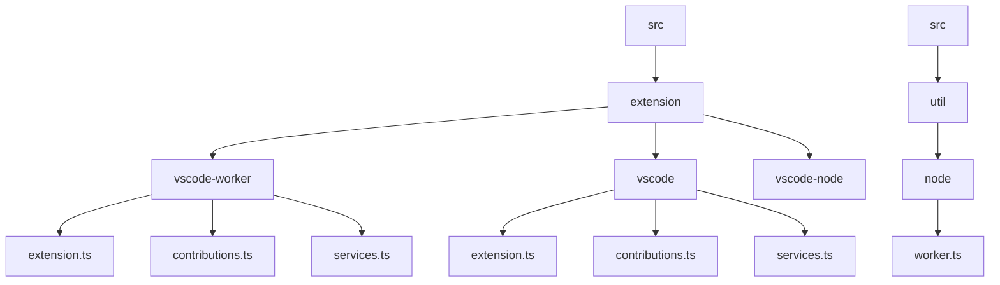
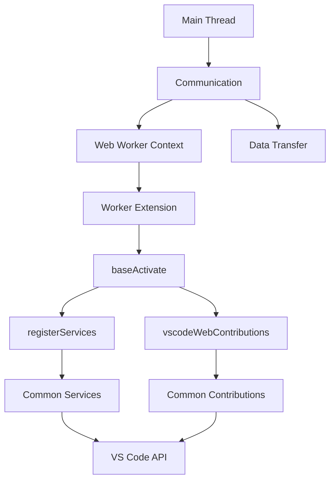
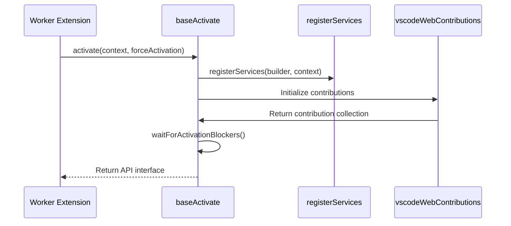
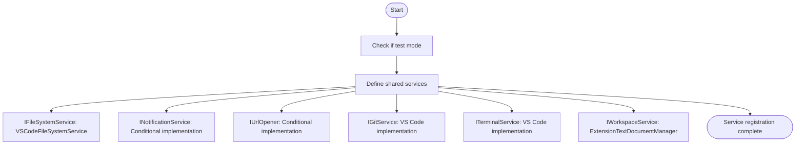
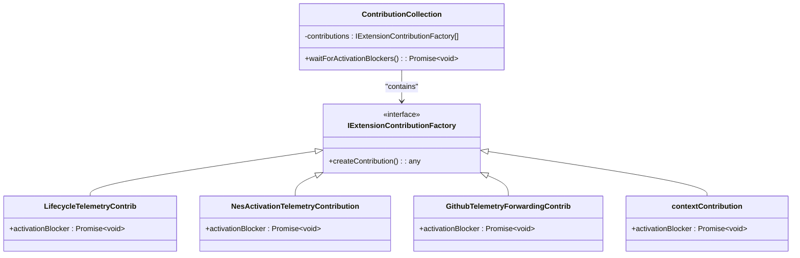
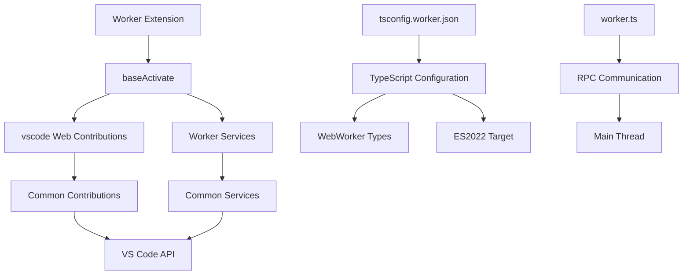

# Worker Activation

<cite>
**Referenced Files in This Document**   
- [extension.ts](file://src/extension/extension/vscode-worker/extension.ts)
- [contributions.ts](file://src/extension/extension/vscode-worker/contributions.ts)
- [services.ts](file://src/extension/extension/vscode-worker/services.ts)
- [extension.ts](file://src/extension/extension/vscode/extension.ts)
- [services.ts](file://src/extension/extension/vscode/services.ts)
- [contributions.ts](file://src/extension/extension/vscode/contributions.ts)
- [tsconfig.worker.json](file://tsconfig.worker.json)
- [worker.ts](file://src/util/node/worker.ts)
</cite>

## Table of Contents
1. [Introduction](#introduction)
2. [Project Structure](#project-structure)
3. [Core Components](#core-components)
4. [Architecture Overview](#architecture-overview)
5. [Detailed Component Analysis](#detailed-component-analysis)
6. [Dependency Analysis](#dependency-analysis)
7. [Performance Considerations](#performance-considerations)
8. [Troubleshooting Guide](#troubleshooting-guide)
9. [Conclusion](#conclusion)

## Introduction
This document provides comprehensive documentation for the Web Worker activation process in the vscode-copilot-chat extension. It explains how the extension operates within the web worker extension host environment, detailing the streamlined activation process that leverages shared functionality while adapting to web-specific constraints. The documentation covers the differences between worker and node activation, the registration and initialization of vscodeWebContributions in the worker context, implications of running in a browser environment, and best practices for optimizing worker activation and communication between worker and main thread.

## Project Structure
The vscode-copilot-chat extension is organized with a clear separation between different execution contexts, particularly distinguishing between web worker and node.js environments. The project structure shows dedicated directories for different extension variants, with specific files for worker, vscode, and common functionality.

**Diagram sources**
- [extension.ts](file://src/extension/extension/vscode-worker/extension.ts)
- [extension.ts](file://src/extension/extension/vscode/extension.ts)
- [worker.ts](file://src/util/node/worker.ts)

**Section sources**
- [extension.ts](file://src/extension/extension/vscode-worker/extension.ts)
- [extension.ts](file://src/extension/extension/vscode/extension.ts)

## Core Components
The Web Worker activation process in vscode-copilot-chat is built around several core components that enable the extension to function within the constrained environment of a web worker. The architecture leverages a shared baseActivate function while providing web-specific contributions and services. This design pattern allows for code reuse while accommodating the unique requirements of the web worker execution context.

The activation process begins with the worker-specific extension.ts file, which imports the baseActivate function from the shared vscode directory. This function is then called with worker-specific parameters including the registerServices function and vscodeWebContributions. The approach ensures that common activation logic is centralized while allowing for environment-specific customizations.

**Section sources**
- [extension.ts](file://src/extension/extension/vscode-worker/extension.ts)
- [extension.ts](file://src/extension/extension/vscode/extension.ts)

## Architecture Overview
The architecture of the Web Worker activation process follows a modular design that separates concerns between shared functionality and environment-specific implementations. The system is designed to maximize code reuse while accommodating the constraints of the web worker environment.

**Diagram sources**
- [extension.ts](file://src/extension/extension/vscode-worker/extension.ts)
- [extension.ts](file://src/extension/extension/vscode/extension.ts)
- [worker.ts](file://src/util/node/worker.ts)

## Detailed Component Analysis

### Worker Activation Process
The worker activation process in vscode-copilot-chat is designed to be both efficient and maintainable by leveraging a shared activation function while providing web-specific implementations for contributions and services.

#### Activation Flow

**Diagram sources**
- [extension.ts](file://src/extension/extension/vscode-worker/extension.ts)
- [extension.ts](file://src/extension/extension/vscode/extension.ts)

#### Service Registration
The service registration process in the worker context follows the same pattern as the general vscode activation but with worker-specific adaptations. The registerServices function in the worker directory delegates to the common service registration while potentially adding worker-specific overrides.

**Diagram sources**
- [services.ts](file://src/extension/extension/vscode-worker/services.ts)
- [services.ts](file://src/extension/extension/vscode/services.ts)

### Web-Specific Contributions
The web worker extension uses a specific set of contributions that are tailored to the browser environment. These contributions are defined in the vscodeWebContributions array and extend the base vscode contributions.

#### Contribution Architecture

**Diagram sources**
- [contributions.ts](file://src/extension/extension/vscode-worker/contributions.ts)
- [contributions.ts](file://src/extension/extension/vscode/contributions.ts)

## Dependency Analysis
The Web Worker activation process in vscode-copilot-chat has a well-defined dependency structure that ensures proper initialization order and separation of concerns between different components.

**Diagram sources**
- [extension.ts](file://src/extension/extension/vscode-worker/extension.ts)
- [tsconfig.worker.json](file://tsconfig.worker.json)
- [worker.ts](file://src/util/node/worker.ts)

## Performance Considerations
The Web Worker activation process in vscode-copilot-chat is designed with performance in mind, particularly considering the constraints of the browser environment. The activation process minimizes the amount of code executed during startup and leverages lazy initialization where possible.

The use of the baseActivate function across different execution contexts ensures that common initialization logic is optimized and maintained in a single location. This approach reduces code duplication and makes performance improvements easier to implement across all environments.

The worker-specific configuration in tsconfig.worker.json targets ES2022 and includes WebWorker types, ensuring that the compiled code is optimized for the browser environment. This configuration helps reduce bundle size and improve execution performance in the web worker context.

**Section sources**
- [tsconfig.worker.json](file://tsconfig.worker.json)
- [extension.ts](file://src/extension/extension/vscode/extension.ts)

## Troubleshooting Guide
When troubleshooting issues with the Web Worker activation process in vscode-copilot-chat, consider the following common scenarios and their solutions:

1. **Activation failures in web worker context**: Verify that the worker-specific contributions and services are properly registered and that the baseActivate function is called with the correct parameters.

2. **Communication issues between worker and main thread**: Check the RPC implementation in worker.ts to ensure proper message handling and error propagation.

3. **Missing functionality in web environment**: Ensure that web-specific implementations are provided for any services that have different requirements in the browser context.

4. **TypeScript compilation errors**: Verify that tsconfig.worker.json includes the necessary lib settings (ES2022, WebWorker) and that the include/exclude patterns are correctly configured.

5. **Service initialization problems**: Check that all required services are properly defined in the registerServices function and that dependencies are resolved in the correct order.

**Section sources**
- [extension.ts](file://src/extension/extension/vscode-worker/extension.ts)
- [worker.ts](file://src/util/node/worker.ts)
- [tsconfig.worker.json](file://tsconfig.worker.json)

## Conclusion
The Web Worker activation process in vscode-copilot-chat demonstrates a well-architected approach to supporting multiple execution contexts while maintaining code quality and performance. By leveraging a shared baseActivate function and providing environment-specific implementations for contributions and services, the extension achieves a balance between code reuse and context-specific optimization.

The architecture effectively addresses the constraints of the web worker environment while providing a seamless experience for users. The clear separation between shared and worker-specific code makes the system maintainable and extensible, allowing for future enhancements without compromising the integrity of the activation process.

Best practices for optimizing worker activation include minimizing the amount of code executed during startup, leveraging lazy initialization, and ensuring efficient communication between the worker and main thread. These principles contribute to a responsive and reliable extension experience in the browser environment.